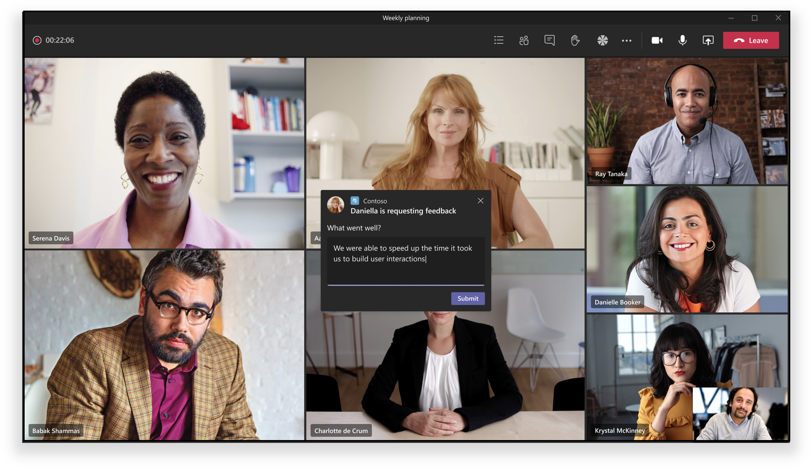
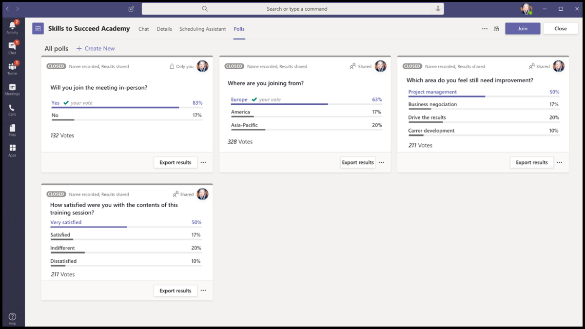

# Extensibilité de l’application de réunion

Teams’extensibilité de l’application de réunion est basée sur les concepts suivants :

* Le cycle de vie des réunions se produit selon différentes étapes, telles que les phases préalables à la réunion, aux réunions et après la réunion.  
* Il existe trois rôles de participant distincts dans une réunion : organisateur, présentateur et participant. Pour plus d’informations, voir [les rôles dans une Teams réunion.](https://support.microsoft.com/office/roles-in-a-teams-meeting-c16fa7d0-1666-4dde-8686-0a0bfe16e019)  
* Il existe différents [types d’utilisateurs](/microsoftteams/non-standard-users#:~:text=An%20anonymous%20user%20is%20a,their%20Microsoft%20or%20organization's%20account.) dans une réunion : utilisateurs en [client,](/microsoftteams/guest-access)invités, [fédérés](/microsoftteams/manage-external-access)et anonymes.

Cet article traite des informations sur le cycle de vie des réunions et sur la façon d’intégrer des onglets, des bots et des extensions de messagerie dans la réunion. Il fournit des informations permettant d’identifier différents rôles de participants et différents types d’utilisateurs pour effectuer des tâches.

## Cycle de vie des réunions

Le cycle de vie des réunions consiste en une expérience d’application avant, en réunion et après la réunion. Vous pouvez intégrer des onglets, des bots et des extensions de messagerie à chaque étape du cycle de vie de la réunion.

### Intégrer des onglets dans le cycle de vie de la réunion

Les onglets permettent aux membres de l’équipe d’accéder aux services et au contenu dans un espace spécifique au sein d’une réunion. L’équipe travaille directement avec les onglets et a des conversations sur les outils et les données disponibles dans les onglets. Dans Teams réunion, les utilisateurs peuvent ajouter un onglet en sélectionnant et en choisissant l’application qu’ils souhaitent installer.

> [!IMPORTANT]
> Si vous avez intégré un onglet à votre réunion, votre application doit suivre le flux d’authentification unique Teams [(SSO) pour les onglets.](../tabs/how-to/authentication/auth-aad-sso.md)

> [!NOTE]
> * Les clients mobiles ne supportent les onglets qu’aux étapes préalables et post-réunion. Les expériences en réunion qui sont des boîtes de dialogue et des panneaux en réunion ne sont actuellement pas disponibles sur les appareils mobiles.
> * Les applications sont uniquement pris en charge dans les réunions privées programmées.

#### Expérience d’application avant la réunion

Avec l’expérience d’application de pré-réunion, vous pouvez rechercher et ajouter des applications de réunion et effectuer des tâches préalables à la réunion, telles que le développement d’un sondage pour sondé les participants à la réunion.

**Pour ajouter des onglets à une réunion existante**

1. Dans votre calendrier, sélectionnez une réunion à laquelle vous souhaitez ajouter un onglet.
1. Sélectionnez **l’onglet Détails,** puis sélectionnez . La galerie d’onglets s’affiche.

    

1. Dans la galerie d’onglets, sélectionnez l’application à ajouter et suivez les étapes nécessaires. L’application est installée en tant qu’onglet.

    

    > [!NOTE]
    > * Vous pouvez également ajouter un onglet à l’aide de l’onglet **Conversation** de réunion dans une réunion existante.
    > * La disposition des onglets doit être dans un état organisé, s’il y a plus de dix sondages ou enquêtes.

#### Expérience d’application en réunion

Grâce à l’expérience d’application en réunion, vous pouvez impliquer des participants pendant la réunion à l’aide d’applications et de la boîte de dialogue de réunion. Les applications de réunion sont hébergées dans la barre supérieure de la fenêtre de réunion en tant qu’onglet de réunion. Utilisez la boîte de dialogue de réunion pour présenter le contenu actionnable aux participants à la réunion. Pour plus d’informations, voir [créer des applications pour Teams réunions.](create-apps-for-teams-meetings.md)

**Pour utiliser des onglets pendant une réunion**

1. Après avoir entré la réunion, dans la barre supérieure supérieure de la fenêtre de conversation, sélectionnez l’application que vous souhaitez utiliser. Une application est visible dans une Teams dans le panneau latéral ou dans la boîte de dialogue de la réunion.
1. Dans la boîte de dialogue de réunion, entrez votre réponse en tant que commentaire.

    

    > [!NOTE]
    > * Les applications peuvent tirer parti Teams SDK client pour accéder au , et pour `meetingId` `userMri` restituer `frameContext` l’expérience de manière appropriée.
    > * Si la boîte de dialogue de réunion s’est correctement rendue, vous êtes informé du téléchargement réussi des résultats.
    > * Le manifeste de votre application spécifie les endroits où vous souhaitez qu’ils apparaissent. Le champ de contexte est utilisé à cet effet. Il peut également faire partie d’une expérience de partage de bac, sous réserve des instructions de conception spécifiées.

    L’image suivante illustre le panneau latéral en réunion :

    

#### Expérience d’application post-réunion

Avec l’expérience d’application post-réunion, vous pouvez afficher les résultats de la réunion, tels que les résultats des sondages ou les commentaires. Sélectionner  pour ajouter un onglet et obtenir des notes et des résultats de réunion sur lesquels les organisateurs et les participants doivent agir.

L’image suivante affiche l’onglet **Contoso** avec les résultats du sondage et les commentaires reçus des participants à la réunion :

> [!NOTE]
> La disposition des onglets doit être organisée lorsqu’il y a plus de dix sondages ou enquêtes.

### Intégrer des bots dans le cycle de vie de la réunion

Les bots activés dans l’étendue groupchat commencent à fonctionner dans les réunions. Pour implémenter des bots, commencez par [créer un bot,](../build-your-first-app/build-bot.md) puis continuez à créer des applications [pour Teams réunions.](../apps-in-teams-meetings/create-apps-for-teams-meetings.md#meeting-apps-api-references)

### Intégrer des extensions de messagerie dans le cycle de vie de la réunion

Pour implémenter des extensions de messagerie, commencez par créer une [extension](../messaging-extensions/how-to/create-messaging-extension.md) de messagerie, puis continuez à créer des applications pour [Teams réunions.](../apps-in-teams-meetings/create-apps-for-teams-meetings.md#meeting-apps-api-references)

L Teams extensibilité de l’application de réunion vous permet de concevoir votre application en fonction des rôles des participants à une réunion.

## Rôles des participants dans une réunion

Les paramètres de participant par défaut sont déterminés par l’administrateur informatique d’une organisation. Les rôles des participants à une réunion sont les suivants :

* **Organisateur**: l’organisateur prévoit une réunion, définit les options de la réunion, attribue des rôles de réunion et démarre la réunion. Seuls les utilisateurs ayant un compte M365 Teams licence peuvent être organisateurs et contrôler les autorisations des participants. Un organisateur de réunion peut modifier les paramètres d’une réunion spécifique. Les organisateurs peuvent apporter ces modifications sur la page web **Des options de** réunion.
* **Présentateur**: les présentateurs ont les mêmes fonctionnalités que les organisateurs avec des exclusions. Un présentateur ne peut pas supprimer un organisateur de la session ou modifier les options de réunion pour la session. Par défaut, les participants qui rejoignent une réunion ont le rôle de présentateur.
* **Participant**: un participant est un utilisateur qui a été invité à participer à une réunion, mais qui n’est pas autorisé à agir en tant que présentateur. Les participants peuvent interagir avec d’autres membres de la réunion, mais ne peuvent pas gérer les paramètres de la réunion ou partager du contenu.

> [!NOTE]
> Seul un organisateur ou un présentateur peut ajouter, supprimer ou désinstaller des applications.

Pour plus d’informations, voir [les rôles dans une Teams réunion.](https://support.microsoft.com/office/roles-in-a-teams-meeting-c16fa7d0-1666-4dde-8686-0a0bfe16e019)

Après avoir conçu votre application en fonction des rôles des participants à une réunion, vous pouvez identifier chaque type d’utilisateur pour les réunions et sélectionner ce à quoi ils peuvent accéder.

## Types d’utilisateurs dans une réunion

> [!NOTE]
> Le type d’utilisateur n’est pas inclus dans **l’API getParticipantRole.**

Les types d’utilisateurs, tels que l’organisateur, le présentateur ou le participant à une réunion, peuvent effectuer l’un des rôles [de participant à une réunion.](#participant-roles-in-a-meeting)

La liste suivante détaille les différents types d’utilisateurs, ainsi que leur accessibilité et leurs performances :

* **Dans le client :** les utilisateurs dans le client appartiennent à l’organisation et ont des informations d’identification Azure Active Directory (AAD) pour le client. Il s’agit généralement d’employés à plein temps, sur site ou distants. Un utilisateur dans le client peut être organisateur, présentateur ou participant.
* **Invité**: un invité est un participant d’une autre organisation invité à accéder Teams ou d’autres ressources dans le client de l’organisation. Les invités sont ajoutés au AAD de l’organisation et ont les mêmes fonctionnalités de Teams qu’un membre d’équipe natif ayant accès aux conversations, réunions et fichiers de l’équipe. Un utilisateur invité peut être organisateur, présentateur ou participant. Pour plus d’informations, [voir l’accès](/microsoftteams/guest-access)invité dans Teams .
* **Fédéré ou externe**: un utilisateur fédéré est un utilisateur Teams d’une autre organisation qui a été invité à participer à une réunion. Les utilisateurs fédérés ont des informations d’identification valides avec des partenaires fédérés et sont autorisés par Teams. Ils n’ont pas accès à vos équipes ou à d’autres ressources partagées de votre organisation. L’accès invité est une meilleure option pour les utilisateurs externes qui ont accès aux équipes et aux canaux. Pour plus d’informations, [voir gérer l’accès externe dans Teams](/microsoftteams/manage-external-access).

    > [!NOTE]
    > Vos Teams peuvent ajouter des applications lorsqu’ils hébergent des réunions ou des conversations avec d’autres organisations. Les utilisateurs peuvent utiliser des applications partagées par des utilisateurs externes lorsque vos utilisateurs rejoignent des réunions ou des conversations hébergées par d’autres organisations. Les stratégies de données de l’organisation de l’utilisateur hôte, ainsi que les pratiques de partage de données des applications tierces partagées par l’organisation de cet utilisateur, seront en vigueur.

* **Anonyme**: les utilisateurs anonymes n’ont pas d’identité AAD et ne sont pas fédérés avec un client. Les participants anonymes sont comme des utilisateurs externes, mais leur identité n’est pas projetée dans la réunion. Les utilisateurs anonymes ne peuvent pas accéder aux applications dans une fenêtre de réunion. Un utilisateur anonyme ne peut pas être un organisateur, mais peut être présentateur ou participant.

    > [!NOTE]
    > Les utilisateurs anonymes héritent de la stratégie d’autorisation d’application globale au niveau de l’utilisateur par défaut. Pour plus d’informations, voir [gérer les applications.](/microsoftteams/non-standard-users#anonymous-user-in-meetings-access)

Un utilisateur invité ou anonyme ne peut pas ajouter, supprimer ou désinstaller des applications.

Le tableau suivant fournit les types d’utilisateurs et les fonctionnalités accessibles à chaque utilisateur :

| Type d’utilisateur | Onglets | Bots | Extensions de messagerie | Cartes adaptatives | Modules de tâche | Boîtes de dialogue en réunion |
| :-- | :-- | :-- | :-- | :-- | :-- | :-- |
| Utilisateur anonyme | Non disponible | Non disponible | Non disponible | Les interactions dans la conversation de réunion sont autorisées. | Les interactions dans la conversation de réunion à partir d’une carte adaptative sont autorisées. | Non disponible |
| Invité qui fait partie du client AAD | L’interaction est autorisée. La création, la mise à jour et la suppression ne sont pas autorisées. | Non disponible | Non disponible | Les interactions dans la conversation de réunion sont autorisées. | Les interactions dans la conversation de réunion à partir d’une carte adaptative sont autorisées. | Available |
| Utilisateur fédéré. Pour plus d’informations, voir [utilisateurs non standard.](/microsoftteams/non-standard-users) | L’interaction est autorisée. La création, la mise à jour et la suppression ne sont pas autorisées. | L’interaction est autorisée. L’acquisition, la mise à jour et la suppression ne sont pas autorisées. | Non disponible | Les interactions dans la conversation de réunion sont autorisées. | Les interactions dans la conversation de réunion à partir d’une carte adaptative sont autorisées. | Non disponible |

## Voir aussi

* [Tab](../tabs/what-are-tabs.md#understand-how-tabs-work)
* [Bot](../bots/what-are-bots.md)
* [Extension de la messagerie](../messaging-extensions/what-are-messaging-extensions.md)
* [Concevoir votre application](../apps-in-teams-meetings/design/designing-apps-in-meetings.md)

## Étape suivante

> [!div class="nextstepaction"]
> [Conditions préalables et références d’API pour les applications dans les réunions Teams](create-apps-for-teams-meetings.md)