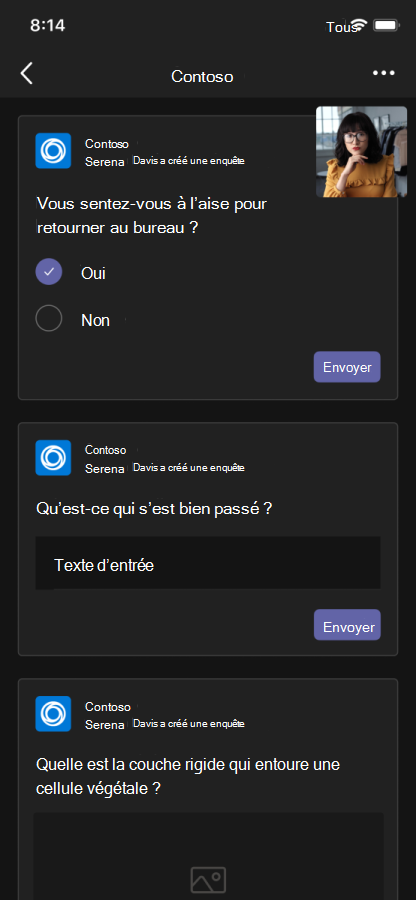

# Applications de réunions unifiées

Les applications de réunions unifiées Teams sont basées sur les concepts suivants :

* Le cycle de vie d'une réunion comporte différentes étapes : avant la réunion, pendant la réunion et après la réunion.  
* Il existe trois rôles distincts pour les participants à une réunion : organisateur, présentateur et participant. Pour plus d’informations, consultez [Partager du contenu dans une réunion Teams](https://support.microsoft.com/office/roles-in-a-teams-meeting-c16fa7d0-1666-4dde-8686-0a0bfe16e019).  
* Il existe différents [types d’utilisateurs](/microsoftteams/non-standard-users#:~:text=An%20anonymous%20user%20is%20a,their%20Microsoft%20or%20organization's%20account.) dans une réunion : utilisateurs locataires, [invités](/microsoftteams/guest-access), [fédérés](/microsoftteams/manage-external-access) et anonymes.

Cet article traite des informations sur le cycle de vie des réunions et sur la façon d’intégrer des onglets, des bots et des extensions de message. Il identifie différents rôles de participant et types d’utilisateurs.

## Cycle de vie des réunions

Un cycle de vie de réunion consiste en une expérience d'application avant, pendant et après la réunion. Vous pouvez intégrer des onglets, des bots et des extensions de message à chaque étape du cycle de vie de la réunion.

> [!NOTE]
>
> * Les applications pour les réunions instantanées, les appels en tête-à-tête et les appels de groupe sont actuellement disponibles uniquement en [préversion publique pour les développeurs](../resources/dev-preview/developer-preview-intro.md).
>
> * Les extensions de réunion telles que les bots, les cartes, les extensions de message et les actions de message sont prises en charge dans le client web. Toutefois, les expériences hébergées telles que les onglets, les bulles de contenu et les partages intermédiaires ne sont pas actuellement entièrement prises en charge.

### Intégrer des onglets dans le cycle de vie de la réunion

Les onglets permettent aux membres de l'équipe d'accéder aux services et au contenu d'un espace spécifique au sein d'une réunion. L'équipe travaille directement avec les onglets et a des conversations sur les outils et les données disponibles dans les onglets. Dans la réunion Teams, vous pouvez ajouter un onglet en sélectionnant , puis sélectionnez l’application que vous souhaitez installer.

> [!IMPORTANT]
> Si vous avez intégré un onglet à votre réunion, votre application doit suivre le [flux d’authentification unique Teams (SSO) pour les onglets](../tabs/how-to/authentication/tab-sso-overview.md).

> [!NOTE]
>
> * L’option Ajouter une application pour l’application d’extension de réunion Teams n’est pas prise en charge dans le client web Teams.

#### Expérience de l'application avant la réunion

Avec l'expérience de l'application de pré-réunion, vous pouvez rechercher et ajouter des applications de réunion. Vous pouvez également effectuer des tâches préalables à la réunion, telles que l'élaboration d'un sondage pour sonder les participants à la réunion.

Pour ajouter des onglets à une réunion existante :

1. Dans votre calendrier, sélectionnez une réunion à laquelle vous souhaitez ajouter un onglet.
1. Sélectionnez l’onglet **Détails** , puis sélectionnez . La galerie d’onglets s’affiche.

    :::image type="content" source="~/assets/images/apps-in-meetings/Pre-Meeting-002.png" alt-text="Expérience d’application avant la réunion.":::

1. Dans la galerie d’onglets, sélectionnez l’application que vous souhaitez ajouter et suivez les étapes nécessaires. L’application est installée sous forme d’onglet.

   > [!NOTE]
   >
   > * Vous pouvez également ajouter un onglet à une réunion existante à l’aide de l’onglet **Conversation** de réunion.
   > * La disposition des onglets doit être organisée, s’il y a plus de 10 sondages ou enquêtes.

# [Imprimante de bureau](#tab/desktop)

:::image type="content" source="~/assets/images/apps-in-meetings/PreMeetingTab.png" alt-text="Onglets pendant une réunion.":::

# [Mobile](#tab/mobile)

Après avoir ajouté les onglets à une réunion existante sur mobile, vous pouvez voir les mêmes applications dans l’expérience de pré-réunion sous **la section Plus** des détails de la réunion.

  

---

#### Expérience d'application en réunion

Avec l'expérience de l'application en réunion, vous pouvez engager les participants pendant la réunion en utilisant des applications et la boîte de dialogue en réunion. Les applications de réunion sont hébergées sur la barre d'outils de la fenêtre de réunion en tant qu'onglet de réunion. Utilisez la boîte de dialogue de réunion pour présenter du contenu exploitable aux participants à la réunion. Pour plus d’informations, consultez [Activer et configurer vos applications pour les réunions Teams](enable-and-configure-your-app-for-teams-meetings.md).

Pour les applications mobiles, les applications de réunion sont disponibles à partir **d’applications** > points de suspension &#x25CF;&#x25CF;&#x25CF; de la réunion. Sélectionnez **Applications** pour afficher toutes les applications disponibles dans la réunion.

Pour le bureau, vous pouvez ajouter des applications pendant une réunion à l’aide de l’option **Ajouter une application** :::image type="icon" source="../assets/icons/add-icon.png" border="false"::: à partir de la fenêtre de réunion.

Pour utiliser des onglets pendant une réunion :

1. Accédez à Teams.
1. Dans votre calendrier, sélectionnez une réunion dans laquelle vous souhaitez utiliser un onglet.
1. Après avoir entré la réunion, dans la barre d’outils de la fenêtre de conversation, sélectionnez l’application requise.
    Une application est visible dans une réunion Teams dans le panneau latéral ou dans la boîte de dialogue en réunion.
1. Dans la boîte de dialogue en réunion, entrez votre réponse en tant que commentaires.

# [Imprimante de bureau](#tab/desktop)

:::image type="content" source="~/assets/images/apps-in-meetings/desktop-in-meeting-dialog-view.png" alt-text="Affichage bureau en réunion.":::

# [Mobile](#tab/mobile)

Après avoir entré la réunion et ajouté l’application à partir du bureau ou du web, l’application est visible dans la réunion Teams mobile sous la section **Applications** . Sélectionnez **Applications** pour afficher la liste des applications. L’utilisateur peut lancer n’importe quelle application en tant que panneau côté réunion de l’application.

La boîte de dialogue en réunion s’affiche, dans laquelle vous pouvez entrer votre réponse en tant que commentaires.

> [!NOTE]
> Vous n’avez pas besoin de modifier le manifeste de l’application pour que les applications fonctionnent sur un appareil mobile.

---

> [!NOTE]
>
> * Les applications peuvent tirer parti du Kit de développement logiciel (SDK) client Teams pour accéder à l’expérience`meetingId``userMri`, et `frameContext` pour afficher l’expérience de manière appropriée.
> * Si la boîte de dialogue en réunion est correctement affichée, elle envoie une notification indiquant que les résultats sont correctement téléchargés.
> * Le manifeste de votre application spécifie les emplacements dans lesquels vous souhaitez que les applications apparaissent. Pour ce faire, spécifiez le champ de contexte dans le manifeste. Il fait également partie d’une expérience de phase de réunion de partage, sous réserve [des instructions de conception](~\apps-in-teams-meetings\design\designing-apps-in-meetings.md) spécifiées.
> * La phase de réunion n’est pas prise en charge pour les utilisateurs anonymes et le client web Teams.

L’image suivante illustre le panneau côté réunion :

# [Imprimante de bureau](#tab/desktop)

# [Mobile](#tab/mobile)

---

Le tableau suivant décrit le comportement de l’application quand elle est validée et non validée :

|Fonctionnalité d’application | L’application est validée | L’application n’est pas validée |
|---|---|---|
| Extensibilité des réunions | L’application s’affiche dans les réunions. | L’application n’apparaît pas dans les réunions pour les clients mobiles. |

Pour plus d’informations, consultez [les instructions de validation du magasin](../concepts/deploy-and-publish/appsource/prepare/teams-store-validation-guidelines.md).

#### Expérience d’application post-réunion

Avec l’expérience de l’application post-réunion, vous pouvez afficher les résultats de la réunion, tels que les résultats d’un sondage ou des commentaires. Sélectionner  pour ajouter un onglet, obtenir des notes de réunion et afficher les résultats sur lesquels les organisateurs et les participants doivent prendre des mesures.

L’image suivante affiche l’onglet **Contoso** avec les résultats du sondage et les commentaires reçus des participants à la réunion :

# [Imprimante de bureau](#tab/desktop)

:::image type="content" source="~/assets/images/apps-in-meetings/post.png" alt-text="Onglet Contoso avec résultats.":::

# [Mobile](#tab/mobile)

:::image type="content" source="~/assets/images/apps-in-meetings/mobilepremeeting.png" alt-text="Expérience d’application post-réunion.":::

---

> [!NOTE]
> La disposition des onglets doit être organisée lorsqu’il y a plus de 10 sondages ou enquêtes.

### Intégrer des bots dans le cycle de vie des réunions

Les bots activés dans l’étendue de conversation de groupe commencent à fonctionner dans les réunions. Pour implémenter des bots, commencez par [créer un bot](../build-your-first-app/build-bot.md), puis continuez avec [la création d’applications pour les réunions Teams](../apps-in-teams-meetings/API-references.md#meeting-apps-api-references).

### Intégrer des extensions de message dans le cycle de vie des réunions

Pour implémenter l’extension de message, commencez par [générer une extension de message](../messaging-extensions/how-to/create-messaging-extension.md), puis continuez avec [la création d’applications pour les réunions Teams](../apps-in-teams-meetings/API-references.md#meeting-apps-api-references).

Les applications de réunions unifiées Teams vous permettent de concevoir votre application en fonction des rôles de participant d’une réunion.

## Rôles de participant dans une réunion

:::image type="content" source="~/assets/images/apps-in-meetings/participant-roles.png" alt-text="Rôles de participant dans une réunion.":::

Les paramètres de participant par défaut sont déterminés par l’administrateur informatique d’une organisation. Voici les rôles de participant dans une réunion :

* **Organisateur** : l’organisateur planifie une réunion, définit les options de réunion, attribue des rôles de réunion et démarre la réunion. Les utilisateurs disposant d’un compte Microsoft 365 et d’une licence Teams peuvent uniquement être les organisateurs et contrôler les autorisations des participants. Un organisateur de réunion peut modifier les paramètres d’une réunion spécifique. Les organisateurs peuvent apporter ces modifications sur la page web **Options de** réunion.

* **Présentateur** : Les présentateurs ont les mêmes fonctionnalités que les organisateurs avec des exclusions. Un présentateur ne peut pas supprimer un organisateur de la session ou modifier les options de réunion pour la session. Par défaut, les participants à une réunion ont le rôle présentateur.

* **Participant** : un participant est un utilisateur qui est invité à participer à la réunion. Les participants ont des fonctionnalités limitées pendant la réunion, par exemple :
  * Ils peuvent interagir avec d’autres membres de la réunion, mais ils ne peuvent pas gérer les paramètres de la réunion ni partager le contenu.  
  * Ils peuvent afficher ou interagir avec l’application onglet sur la phase de réunion dans le client de bureau Teams sans installer l’application ou sans droits d’application. Ils ne peuvent pas afficher ou interagir avec l’application lors de la phase de réunion dans un client web Teams.
  * Ils ne peuvent pas afficher ou interagir avec l’application dans le panneau latéral sans droits d’application.
  * Ils ne sont pas autorisés à agir en tant que présentateur.
  * Si le participant rejoint en tant qu’utilisateur anonyme, il ne peut pas afficher ou interagir avec l’application onglet sur la phase de réunion dans les clients web et de bureau Teams.

> [!NOTE]
> Seul un organisateur ou un présentateur peut ajouter, supprimer ou désinstaller des applications.

Pour plus d’informations, consultez [Partager du contenu dans une réunion Teams](https://support.microsoft.com/office/roles-in-a-teams-meeting-c16fa7d0-1666-4dde-8686-0a0bfe16e019).

Après avoir conçu votre application en fonction des rôles de participant d’une réunion, vous pouvez identifier chaque type d’utilisateur pour les réunions et sélectionner ce à quoi il peut accéder.

## Types d’utilisateurs dans une réunion

Les types d’utilisateurs, tels que les utilisateurs in-tenants, invités, fédérés ou externes dans une réunion, peuvent effectuer l’un des [rôles de participant dans une réunion](#participant-roles-in-a-meeting).

> [!NOTE]
> Le type d’utilisateur n’est pas inclus dans l’API **getParticipantRole** .

La liste suivante détaille les différents types d’utilisateurs ainsi que leur accessibilité et leurs performances :

* **In-tenant** : les utilisateurs in-tenants appartiennent à l’organisation et disposent d’informations d’identification dans Microsoft Azure Active Directory (Azure AD) pour le locataire. Ce sont des employés à temps plein, sur site ou distants. Un utilisateur in-tenant peut être un organisateur, un présentateur ou un participant.
* **Invité** : un invité est un participant d’une autre organisation invité à accéder à Teams ou à d’autres ressources dans le locataire de l’organisation. Les invités sont ajoutés à Azure AD de l’organisation et disposent des mêmes fonctionnalités Teams qu’un membre d’équipe natif. Ils ont accès aux conversations d’équipe, aux réunions et aux fichiers. Un invité peut être un organisateur, un présentateur ou un participant. Pour plus d’informations, consultez [l’accès invité dans Teams](/microsoftteams/guest-access).
* **Fédéré ou externe** : un utilisateur fédéré est un utilisateur Teams externe d’une autre organisation qui a été invité à participer à une réunion. Les utilisateurs fédérés ont des informations d’identification valides avec des partenaires fédérés et sont autorisés par Teams. Ils n’ont pas accès à vos équipes ou à d’autres ressources partagées de votre organisation. L’accès invité est une meilleure option pour que les utilisateurs externes aient accès aux équipes et aux canaux. Pour plus d’informations, consultez [gérer l’accès externe dans Teams](/microsoftteams/manage-external-access).

    > [!NOTE]
    > Vos utilisateurs Teams peuvent ajouter des applications lorsqu’ils hébergent des réunions ou des conversations avec d’autres organisations. Les utilisateurs peuvent utiliser des applications partagées par des utilisateurs externes lorsque vos utilisateurs rejoignent des réunions ou des conversations hébergées par d’autres organisations. Les stratégies de données de l’organisation de l’utilisateur hôte, ainsi que les pratiques de partage de données des applications tierces partagées par l’organisation de cet utilisateur, seront en vigueur.

    > [!IMPORTANT]
    > Actuellement, les applications tierces sont disponibles dans Cloud de la communauté du secteur public (GCC), mais ne sont pas disponibles pour GCC-High et le Ministère de la défense (DOD). Les applications tierces sont désactivées par défaut pour GCC. Pour activer des applications tierces pour GCC, consultez [gérer les stratégies d’autorisation d’application](/microsoftteams/teams-app-permission-policies) et [gérer les applications](/microsoftteams/manage-apps).

* **Anonyme** : les utilisateurs anonymes n’ont pas d’identité Azure AD et ne sont pas fédérés avec un locataire. Les participants anonymes sont comme des utilisateurs externes, mais leur identité n’est pas affichée dans la réunion. Les utilisateurs anonymes ne peuvent pas accéder aux applications dans une fenêtre de réunion et une étape de réunion. Un utilisateur anonyme ne peut pas être organisateur, mais peut être présentateur ou participant.

    > [!NOTE]
    > Les utilisateurs anonymes héritent de la stratégie d’autorisation d’application au niveau de l’utilisateur par défaut. Pour plus d’informations, consultez [Gérer les applications](/microsoftteams/non-standard-users#anonymous-user-in-meetings-access).

Le tableau suivant fournit les types d’utilisateurs et répertorie les fonctionnalités auxquelles chaque utilisateur peut accéder dans les réunions planifiées :

| Type d'utilisateur | Onglets | Bots | Extensions de messages | Cartes adaptatives | Modules de tâche | Boîtes de dialogue en réunion | Étape de la réunion |
| :-- | :-- | :-- | :-- | :-- | :-- | :-- | :-- |
| Utilisateur anonyme | Non disponible | Non disponible | Non disponible | Les interactions dans la conversation de réunion sont autorisées. | Les interactions dans la conversation de réunion à partir de la carte adaptative sont autorisées. | Non disponible | Non disponible |
| Invité, partie du locataire Azure AD | L’interaction est autorisée. La création, la mise à jour et la suppression ne sont pas autorisées. | Non disponible | Non disponible | Les interactions dans la conversation de réunion sont autorisées. | Les interactions dans la conversation de réunion à partir de la carte adaptative sont autorisées. | Available | Peut démarrer, afficher et interagir avec l’application sur la phase de réunion uniquement sur le client de bureau Teams |
| Pour plus d’informations, consultez [les utilisateurs fédérés](/microsoftteams/non-standard-users). | L’interaction est autorisée dans les réunions planifiées. La création, la mise à jour et la suppression ne sont pas autorisées. | L’interaction est autorisée. L’acquisition, la mise à jour et la suppression ne sont pas autorisées. | Non disponible | Les interactions dans la conversation de réunion sont autorisées. | Les interactions dans la conversation de réunion à partir de la carte adaptative sont autorisées. | Non disponible | Peut démarrer, afficher et interagir avec l’application sur la phase de réunion uniquement sur le client de bureau Teams. |

> [!NOTE]
>
> Le comportement des différents types d’utilisateurs pour les applications dans les appels est identique à celui des réunions planifiées, à l’exception des éléments suivants :
>
> * Les utilisateurs fédérés ne peuvent pas interagir avec les applications onglet dans les appels.
> * Si des utilisateurs fédérés sont ajoutés à un appel existant avec des utilisateurs clients ou invités, tous les participants perdent la possibilité d’ajouter, de mettre à jour ou de supprimer des applications. Toutefois, seuls les utilisateurs locataires ou invités existants pourraient toujours interagir avec les applications qui ont été ajoutées avant d’inviter des utilisateurs fédérés à l’appel.

## Étape suivante

> [!div class="nextstepaction"]
> [Activer et configurer vos applications pour les réunions Teams](enable-and-configure-your-app-for-teams-meetings.md)

## Voir aussi

* [Tab](../tabs/what-are-tabs.md#understand-how-tabs-work)
* [Bot](../bots/what-are-bots.md)
* [Extension de message](../messaging-extensions/what-are-messaging-extensions.md)
* [Concevoir votre application](../apps-in-teams-meetings/design/designing-apps-in-meetings.md)
* [Rapports de présence aux réunions Microsoft Teams](/microsoftteams/teams-analytics-and-reports/meeting-attendance-report)
