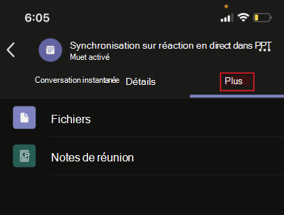

# Applications de réunions unifiées

Teams applications de réunions unifiées sont basées sur les concepts suivants :

* Le cycle de vie d'une réunion comporte différentes étapes : avant la réunion, pendant la réunion et après la réunion.  
* Il existe trois rôles distincts pour les participants à une réunion : organisateur, présentateur et participant. Pour plus d’informations, voir [rôles dans une Teams réunion.](https://support.microsoft.com/office/roles-in-a-teams-meeting-c16fa7d0-1666-4dde-8686-0a0bfe16e019)  
* Il existe différents [types d’utilisateurs](/microsoftteams/non-standard-users#:~:text=An%20anonymous%20user%20is%20a,their%20Microsoft%20or%20organization's%20account.) dans une réunion : utilisateurs en [client,](/microsoftteams/guest-access) invités, [fédérés](/microsoftteams/manage-external-access) et anonymes.

Cet article traite des informations sur le cycle de vie des réunions et sur la façon d’intégrer des onglets, des bots et des extensions de messagerie. Il identifie différents rôles de participant et types d’utilisateurs.

## Cycle de vie des réunions

Un cycle de vie de réunion consiste en une expérience d'application avant, pendant et après la réunion. Vous pouvez intégrer des onglets, des bots et des extensions de messagerie à chaque étape du cycle de vie de la réunion.

> [!NOTE]
> Les extensions de réunion telles que les bots, les cartes, les extensions de message et les actions de message sont prises en charge dans le client web. Toutefois, les expériences hébergées telles que les onglets, les bulles de contenu et le partage par étape ne sont actuellement pas entièrement pris en charge.

### Intégrer des onglets dans le cycle de vie de la réunion

Les onglets permettent aux membres de l'équipe d'accéder aux services et au contenu d'un espace spécifique au sein d'une réunion. L'équipe travaille directement avec les onglets et a des conversations sur les outils et les données disponibles dans les onglets. Dans Teams réunion, vous pouvez ajouter un onglet en sélectionnant et sélectionnez l’application que vous souhaitez installer.

> [!IMPORTANT]
> Si vous avez intégré un onglet à votre réunion, votre application doit suivre le flux d’authentification unique Teams pour les [onglets](../tabs/how-to/authentication/auth-aad-sso.md).

> [!NOTE]
>
> * Les réunions privées programmées ne supportent que les applications.
> * L’option Ajouter une application Teams’onglet d’extension de réunion n’est pas prise en charge Teams client web.

#### Expérience de l'application avant la réunion

Avec l'expérience de l'application de pré-réunion, vous pouvez rechercher et ajouter des applications de réunion. Vous pouvez également effectuer des tâches préalables à la réunion, telles que l'élaboration d'un sondage pour sonder les participants à la réunion.

Pour ajouter des onglets à une réunion existante :

1. Dans votre calendrier, sélectionnez une réunion à laquelle vous souhaitez ajouter un onglet.
1. Sélectionnez **l’onglet Détails** et sélectionnez . La galerie d’onglets s’affiche.

    :::image type="content" source="~/assets/images/apps-in-meetings/Pre-Meeting-002.png" alt-text="Expérience de l'application avant la réunion":::

1. Dans la galerie d’onglets, sélectionnez l’application à ajouter et suivez les étapes nécessaires. L’application est installée en tant qu’onglet.

   > [!NOTE]
   >
   > * Vous pouvez également ajouter un onglet à une réunion existante à l’aide de l’onglet **Conversation de** réunion.
   > * La disposition des onglets doit être dans un état organisé, s’il y a plus de 10 sondages ou enquêtes.

# [Imprimante de bureau](#tab/desktop)

:::image type="content" source="~/assets/images/apps-in-meetings/PreMeetingTab.png" alt-text="Onglets pendant une réunion":::

# [Mobile](#tab/mobile)

Après avoir ajouté les onglets à une réunion existante sur mobile, vous pouvez voir les mêmes applications dans l’expérience de pré-réunion sous la section **Plus** des détails de la réunion.

  

---

#### Expérience d'application en réunion

Avec l'expérience de l'application en réunion, vous pouvez engager les participants pendant la réunion en utilisant des applications et la boîte de dialogue en réunion. Les applications de réunion sont hébergées sur la barre d'outils de la fenêtre de réunion en tant qu'onglet de réunion. Utilisez la boîte de dialogue de réunion pour présenter du contenu exploitable aux participants à la réunion. Pour plus d’informations, [voir Activer et configurer vos applications pour Teams réunions](enable-and-configure-your-app-for-teams-meetings.md).

Pour les appareils mobiles, les applications de réunion sont disponibles à **partir > des** &#x25CF;&#x25CF;&#x25CF; lors de la réunion. **Sélectionnez Applications** pour afficher toutes les applications disponibles dans la réunion.

Pour utiliser des onglets pendant une réunion :

1. Go to Teams.
1. Dans votre calendrier, sélectionnez une réunion dans laquelle vous souhaitez utiliser un onglet.
1. Après avoir entré la réunion, dans la barre d’outils de la fenêtre de conversation, sélectionnez l’application requise.
    Une application est visible dans une Teams dans le panneau latéral ou dans la boîte de dialogue de la réunion.
1. Dans la boîte de dialogue de réunion, entrez votre réponse en tant que commentaire.

# [Imprimante de bureau](#tab/desktop)

# [Mobile](#tab/mobile)

Une fois entrée dans la réunion et ajouté l’application à partir du bureau ou du web, l’application est visible dans la Teams sous la section **Applications**. **Sélectionnez Applications** pour afficher la liste des applications. L’utilisateur peut lancer n’importe quelle application en tant que panneau latéral en réunion de l’application.

La boîte de dialogue de réunion s’affiche et vous permet d’entrer votre réponse en tant que commentaire.

> [!NOTE]
> Vous n’avez pas besoin de modifier le manifeste de l’application pour que les applications fonctionnent sur un appareil mobile.

---

> [!NOTE]
>
> * Les applications peuvent tirer parti Teams SDK `meetingId`client pour accéder au , et `userMri``frameContext` pour restituer l’expérience de manière appropriée.
> * Si la boîte de dialogue de réunion s’est correctement restituer, elle envoie une notification de téléchargement des résultats.
> * Le manifeste de votre application spécifie les endroits où vous souhaitez que les applications apparaissent. Pour ce faire, vous pouvez spécifier le champ de contexte dans le manifeste. Il fait également partie d’une expérience de partage de la phase de réunion, sous réserve des instructions de [conception spécifiées](~\apps-in-teams-meetings\design\designing-apps-in-meetings.md).

L’image suivante illustre le panneau latéral en réunion :

# [Imprimante de bureau](#tab/desktop)

# [Mobile](#tab/mobile)

---

Le tableau suivant décrit le comportement de l’application lorsqu’elle est validée et non validée :

|Fonctionnalité d’application | L’application est validée | L’application n’est pas validée |
|---|---|---|
| Extensibilité de réunion | L’application s’affiche dans les réunions. | L’application n’apparaîtra pas dans les réunions pour les clients mobiles. |

Pour plus d’informations, voir [les instructions de validation du Store](../concepts/deploy-and-publish/appsource/prepare/teams-store-validation-guidelines.md).

#### Expérience d’application post-réunion

Avec l’expérience d’application post-réunion, vous pouvez afficher les résultats de la réunion, tels que les résultats des sondages ou les commentaires. Sélectionner  pour ajouter un onglet, obtenir des notes de réunion et voir les résultats sur lesquels les organisateurs et les participants doivent agir.

L’image suivante affiche l’onglet **Contoso** avec les résultats du sondage et les commentaires reçus des participants à la réunion :

# [Imprimante de bureau](#tab/desktop)

:::image type="content" source="~/assets/images/apps-in-meetings/post.png" alt-text="Onglet Contoso avec résultats":::

# [Mobile](#tab/mobile)

:::image type="content" source="~/assets/images/apps-in-meetings/mobilepremeeting.png" alt-text="Expérience d’application après la réunion":::

---

> [!NOTE]
> La disposition des onglets doit être organisée lorsqu’il y a plus de 10 sondages ou enquêtes.

### Intégrer des bots dans le cycle de vie de la réunion

Les bots activés dans l’étendue de conversation de groupe commencent à fonctionner dans les réunions. Pour implémenter des bots, commencez par [créer un bot](../build-your-first-app/build-bot.md), puis continuez à créer des [applications pour Teams réunions](../apps-in-teams-meetings/API-references.md#meeting-apps-api-references).

### Intégrer des extensions de messagerie dans le cycle de vie de la réunion

Pour implémenter l’extension de messagerie, commencez par créer une [extension](../messaging-extensions/how-to/create-messaging-extension.md) de messagerie, puis continuez à créer des applications pour [Teams réunions](../apps-in-teams-meetings/API-references.md#meeting-apps-api-references).

Les Teams réunions unifiées vous permettent de concevoir votre application en fonction des rôles des participants à une réunion.

## Rôles des participants à une réunion

:::image type="content" source="~/assets/images/apps-in-meetings/participant-roles.png" alt-text="Rôles des participants à une réunion":::

Les paramètres de participant par défaut sont déterminés par l’administrateur informatique d’une organisation. Les rôles des participants à une réunion sont les suivants :

* **Organisateur** : l’organisateur prévoit une réunion, définit les options de la réunion, attribue des rôles de réunion et démarre la réunion. Les utilisateurs  ayant Microsoft 365 et une licence Teams ne peuvent être que les organisateurs et contrôler les autorisations des participants. Un organisateur de réunion peut modifier les paramètres d’une réunion spécifique. Les organisateurs peuvent apporter ces modifications sur la page web **Des options de** réunion.

* **Présentateur** : les présentateurs ont les mêmes fonctionnalités que les organisateurs avec des exclusions. Un présentateur ne peut pas supprimer un organisateur de la session ou modifier les options de réunion pour la session. Par défaut, les participants qui rejoignent une réunion ont le rôle de présentateur.

* **Participant** : un participant est un utilisateur qui est invité à participer à la réunion. Les participants ont des fonctionnalités limitées pendant la réunion, telles que :
  * Ils peuvent interagir avec d’autres membres de la réunion, mais ne peuvent pas gérer les paramètres de réunion ni partager le contenu.  
  * Ils peuvent afficher ou interagir avec l’application Onglet sur la phase de réunion sans installer l’application ou sans droit d’application.
  * Ils ne peuvent pas afficher ou interagir avec l’application dans le panneau latéral sans droits d’application.
  * Ils ne sont pas autorisés à agir en tant que présentateur.

> [!NOTE]
> Seul un organisateur ou un présentateur peut ajouter, supprimer ou désinstaller des applications.

Pour plus d’informations, voir [rôles dans une Teams réunion.](https://support.microsoft.com/office/roles-in-a-teams-meeting-c16fa7d0-1666-4dde-8686-0a0bfe16e019)

Après avoir conçu votre application en fonction des rôles des participants à une réunion, vous pouvez identifier chaque type d’utilisateur pour les réunions et sélectionner ce à quoi ils peuvent accéder.

## Types d’utilisateurs dans une réunion

Les types d’utilisateurs, tels que l’organisateur, le présentateur ou le participant à une réunion, peuvent jouer l’un des rôles [de participant à une réunion](#participant-roles-in-a-meeting).

> [!NOTE]
> Le type d’utilisateur n’est pas inclus dans **l’API getParticipantRole** .

La liste suivante détaille les différents types d’utilisateurs, ainsi que leur accessibilité et leurs performances :

* **Dans le client :** les utilisateurs dans le client appartiennent à l’organisation et ont des informations d’identification Microsoft Azure Active Directory (Azure AD) pour le client. Ce sont des employés à plein temps, sur site ou distants. Un utilisateur dans le client peut être organisateur, présentateur ou participant.
* **Invité** : un invité est un participant d’une autre organisation invité à accéder Teams ou d’autres ressources dans le client de l’organisation. Les invités sont ajoutés au Azure AD de l’organisation et ont les mêmes fonctionnalités Teams qu’un membre d’équipe natif. Ils ont accès aux conversations d’équipe, aux réunions et aux fichiers. Un invité peut être organisateur, présentateur ou participant. Pour plus d’informations, [voir l’accès invité dans Teams](/microsoftteams/guest-access).
* **Fédéré ou externe** : un utilisateur fédéré est un utilisateur Teams d’une autre organisation qui a été invité à participer à une réunion. Les utilisateurs fédérés ont des informations d’identification valides avec des partenaires fédérés et sont autorisés par Teams. Ils n’ont pas accès à vos équipes ou à d’autres ressources partagées de votre organisation. L’accès invité est une meilleure option pour les utilisateurs externes qui ont accès aux équipes et aux canaux. Pour plus d’informations, [voir gérer l’accès externe dans Teams](/microsoftteams/manage-external-access).

    > [!NOTE]
    > Vos Teams peuvent ajouter des applications lorsqu’ils hébergent des réunions ou des conversations avec d’autres organisations. Les utilisateurs peuvent utiliser des applications partagées par des utilisateurs externes lorsque vos utilisateurs rejoignent des réunions ou des conversations hébergées par d’autres organisations. Les stratégies de données de l’organisation de l’utilisateur hôte, ainsi que les pratiques de partage de données des applications tierces partagées par l’organisation de cet utilisateur, seront en vigueur.

    > [!IMPORTANT]
    > Actuellement, les applications tierces sont disponibles dans Cloud de la communauté du secteur public (Cloud de la communauté du secteur public), mais ne sont pas disponibles pour GCC-High et le Département de la Défense (DOD). Les applications tierces sont désactivées par défaut pour les Cloud de la communauté du secteur public. Pour activer les applications tierces pour Cloud de la communauté du secteur public, voir gérer les stratégies [d’autorisation](/microsoftteams/teams-app-permission-policies) d’application et [gérer les applications](/microsoftteams/manage-apps).

* **Anonyme** : les utilisateurs anonymes n’ont pas Azure AD identité et ne sont pas fédérés avec un client. Les participants anonymes sont comme des utilisateurs externes, mais leur identité n’est pas affichée dans la réunion. Les utilisateurs anonymes ne peuvent pas accéder aux applications dans une fenêtre de réunion. Un utilisateur anonyme ne peut pas être un organisateur, mais peut être présentateur ou participant.

    > [!NOTE]
    > Les utilisateurs anonymes héritent de la stratégie d’autorisation d’application globale par défaut au niveau de l’utilisateur. Pour plus d’informations, voir [gérer les applications](/microsoftteams/non-standard-users#anonymous-user-in-meetings-access).

Un invité ou un utilisateur anonyme ne peut pas ajouter, supprimer ou désinstaller des applications.

Le tableau suivant fournit les types d’utilisateur et répertorie les fonctionnalités accessibles à chaque utilisateur :

| Type d’utilisateur | Onglets | Bots | Extensions de messagerie | Cartes adaptatives | Modules de tâche | Boîtes de dialogue en réunion | Étape de la réunion | Bulle de contenu |
| :-- | :-- | :-- | :-- | :-- | :-- | :-- | :-- | :-- |
| Utilisateur anonyme | Non disponible | Non disponible | Non disponible | Les interactions dans la conversation de réunion sont autorisées. | Les interactions dans la conversation de réunion à partir de la carte adaptative sont autorisées. | Non disponible | Peut afficher et interagir avec l’application sur la phase de réunion | Non disponible |
| Invité, faisant partie du client Azure AD | L’interaction est autorisée. La création, la mise à jour et la suppression ne sont pas autorisées. | Non disponible | Non disponible | Les interactions dans la conversation de réunion sont autorisées. | Les interactions dans la conversation de réunion à partir de la carte adaptative sont autorisées. | Disponible | Peut démarrer, afficher et interagir avec l’application lors de la phase de réunion | Disponible |
| Pour plus d’informations, consultez les utilisateurs [non standard](/microsoftteams/non-standard-users). | L’interaction est autorisée. La création, la mise à jour et la suppression ne sont pas autorisées. | L’interaction est autorisée. L’acquisition, la mise à jour et la suppression ne sont pas autorisées. | Non disponible | Les interactions dans la conversation de réunion sont autorisées. | Les interactions dans la conversation de réunion à partir de la carte adaptative sont autorisées. | Non disponible | Peut démarrer, afficher et interagir avec l’application lors de la phase de réunion | Non disponible |

## Étape suivante

> [!div class="nextstepaction"]
> [Activer et configurer vos applications pour Teams réunions](enable-and-configure-your-app-for-teams-meetings.md)

## Voir aussi

* [Tab](../tabs/what-are-tabs.md#understand-how-tabs-work)
* [Bot](../bots/what-are-bots.md)
* [Extension de la messagerie](../messaging-extensions/what-are-messaging-extensions.md)
* [Concevoir votre application](../apps-in-teams-meetings/design/designing-apps-in-meetings.md)
