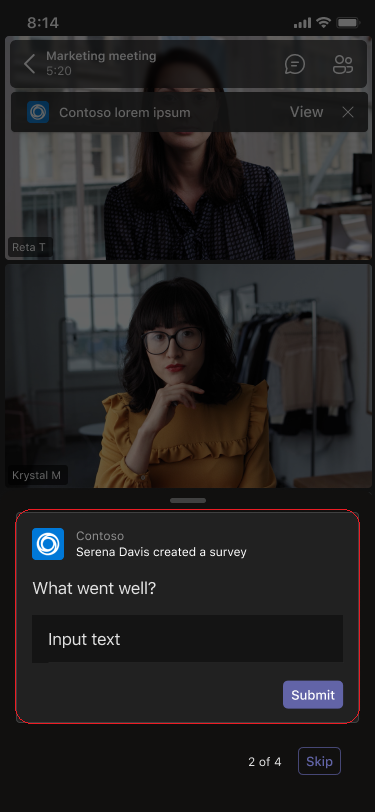

# Extensibilité de l’application de réunionMeeting app extensibility

Teams’extensibilité de l’application de réunion est basée sur les concepts suivants :Teams’ meeting app extensibility is based on the following concepts:

* Le cycle de vie des réunions se produit selon différentes étapes, telles que les phases préalables à la réunion, aux réunions et après la réunion.Meeting lifecycle has different stages such as pre-meeting, in-meeting, and post-meeting.  
* Il existe trois rôles de participant distincts dans une réunion : organisateur, présentateur et participant.There are three distinct participant roles in a meeting: organizer, presenter, and attendee. Pour plus d’informations, voir [les rôles dans une Teams réunion.](https://support.microsoft.com/office/roles-in-a-teams-meeting-c16fa7d0-1666-4dde-8686-0a0bfe16e019)For more information, see [roles in a Teams meeting](https://support.microsoft.com/office/roles-in-a-teams-meeting-c16fa7d0-1666-4dde-8686-0a0bfe16e019).  
* Il existe différents [types d’utilisateurs](/microsoftteams/non-standard-users#:~:text=An%20anonymous%20user%20is%20a,their%20Microsoft%20or%20organization's%20account.) dans une réunion : utilisateurs en [client,](/microsoftteams/guest-access)invités, [fédérés](/microsoftteams/manage-external-access)et anonymes.There are various [user types](/microsoftteams/non-standard-users#:~:text=An%20anonymous%20user%20is%20a,their%20Microsoft%20or%20organization's%20account.) in a meeting: in-tenant, [guest](/microsoftteams/guest-access), [federated](/microsoftteams/manage-external-access), and anonymous users.

Cet article traite des informations sur le cycle de vie des réunions et sur la façon d’intégrer des onglets, des bots et des extensions de messagerie dans la réunion.This article covers information about meeting lifecycle and how to integrate tabs, bots, and messaging extensions in the meeting. Il fournit des informations permettant d’identifier différents rôles de participants et différents types d’utilisateurs pour effectuer des tâches.It provides information to identify different participant roles and different user types to perform tasks.

## Cycle de vie des réunionsMeeting lifecycle

Le cycle de vie des réunions se compose de l’expérience de l’application avant, en réunion et après la réunion.Meeting lifecycle consists of pre-meeting, in-meeting, and post-meeting app experience. Vous pouvez intégrer des onglets, des bots et des extensions de messagerie à chaque étape du cycle de vie de la réunion.You can integrate tabs, bots, and messaging extensions in each stage of the meeting lifecycle.

### Intégrer des onglets dans le cycle de vie de la réunionIntegrate tabs into the meeting lifecycle

Les onglets permettent aux membres de l’équipe d’accéder aux services et au contenu dans un espace spécifique au sein d’une réunion.Tabs allow team members to access services and content in a specific space within a meeting. L’équipe travaille directement avec les onglets et a des conversations sur les outils et les données disponibles dans les onglets.The team works directly with tabs and has conversations about the tools and data available within tabs. Dans Teams réunion, les utilisateurs peuvent ajouter un onglet en sélectionnantIn Teams meeting, users can add a tab by selecting et en choisissant l’application qu’ils souhaitent installer., and choosing the app that they want to install.

> [!IMPORTANT]
> Si vous avez intégré un onglet à votre réunion, votre application doit suivre le flux d’authentification unique Teams [(SSO) pour les onglets.](../tabs/how-to/authentication/auth-aad-sso.md)If you have integrated a tab with your meeting, then your app must follow the Teams [single sign-on (SSO) authentication flow for tabs](../tabs/how-to/authentication/auth-aad-sso.md).

> [!NOTE]
> Les applications sont uniquement pris en charge dans les réunions privées programmées.Apps are supported in private scheduled meetings only.

#### Expérience d’application avant la réunionPre-meeting app experience

Avec l’expérience d’application de pré-réunion, vous pouvez rechercher et ajouter des applications de réunion et effectuer des tâches préalables à la réunion, telles que le développement d’un sondage pour sondé les participants à la réunion.With the pre-meeting app experience, you can find and add meeting apps and perform pre-meeting tasks, such as developing a poll to survey meeting participants.

**Pour ajouter des onglets à une réunion existante****To add tabs to an existing meeting**

1. Dans votre calendrier, sélectionnez une réunion à laquelle vous souhaitez ajouter un onglet.In your calendar, select a meeting to which you want to add a tab.
1. Sélectionnez **l’onglet Détails,** puis sélectionnezSelect the **Details** tab and select .. La galerie d’onglets s’affiche.The tab gallery appears.

    

1. Dans la galerie d’onglets, sélectionnez l’application à ajouter et suivez les étapes nécessaires.In the tab gallery, select the app that you want to add and follow the steps as required. L’application est installée en tant qu’onglet.The app is installed as a tab.

    > [!NOTE]
    > * Vous pouvez également ajouter un onglet à l’aide de l’onglet **Conversation** de réunion dans une réunion existante.You can also add a tab using the meeting **Chat** tab in an existing meeting.
    > * La disposition des onglets doit être dans un état organisé, s’il y a plus de dix sondages ou enquêtes.Tab layout must be in an organized state, if there are more than ten polls or surveys.

# [Imprimante de bureauDesktop](#tab/desktop)

# [MobileMobile](#tab/mobile)

Une fois que les onglets ont été ajoutés à une réunion existante sur un ordinateur de bureau ou sur le web, vous pouvez voir les mêmes applications dans l’expérience de pré-réunion sous la **section** Plus des détails de la réunion.After the tabs are added to an existing meeting on desktop or web, you can see the same apps in pre-meeting experience under **More** section of the meeting details.

  

---

#### Expérience d’application en réunionIn-meeting app experience

Grâce à l’expérience d’application en réunion, vous pouvez impliquer des participants pendant la réunion à l’aide d’applications et de la boîte de dialogue de réunion.With the in-meeting app experience, you can engage participants during the meeting by using apps and the in-meeting dialog box. Les applications de réunion sont hébergées dans la barre supérieure de la fenêtre de réunion en tant qu’onglet de réunion. Utilisez la boîte de dialogue de réunion pour présenter le contenu actionnable aux participants à la réunion.Meeting apps are hosted in the top upper bar of the meeting window as an in-meeting tab. Use the in-meeting dialog box to showcase actionable content for meeting participants. Pour plus d’informations, voir [créer des applications pour Teams réunions.](create-apps-for-teams-meetings.md)For more information, see [create apps for Teams meetings](create-apps-for-teams-meetings.md).

Pour les appareils mobiles, les applications de réunion sont disponibles à partir **>** les &#x25CF;&#x25CF;&#x25CF; de la réunion.For mobile, meeting apps are available from **Apps** > ellipses &#x25CF;&#x25CF;&#x25CF; in the meeting. Sélectionnez **Applications** pour afficher toutes les applications disponibles dans la réunion.Select **Apps** to view all the apps available in the meeting.

**Pour utiliser des onglets pendant une réunion****To use tabs during a meeting**

1. Go to Teams.Go to Teams.
1. Dans votre calendrier, sélectionnez une réunion dans laquelle vous souhaitez utiliser un onglet.In your calendar, select a meeting where you want to use a tab.
1. Après avoir entré la réunion, dans la barre supérieure supérieure de la fenêtre de conversation, sélectionnez l’application requise.After entering the meeting, from the top upper bar of the chat window, select the required app.
    Une application est visible dans une Teams dans le panneau latéral ou dans la boîte de dialogue de la réunion.An app is visible in a Teams meeting in the side panel or the in-meeting dialog box.
1. Dans la boîte de dialogue de réunion, entrez votre réponse en tant que commentaire.In the in-meeting dialog box, enter your response as a feedback.

# [Imprimante de bureauDesktop](#tab/desktop)

# [MobileMobile](#tab/mobile)

Une fois que vous entrez dans la réunion et ajoutez l’application à partir du bureau ou du web, l’application est visible dans la Teams sous la section **Applications.**After entering the meeting and adding the app from desktop or web, the app is visible in mobile Teams meeting under the **Apps** section. Sélectionnez **Applications** pour afficher la liste des applications.Select **Apps** to show the list of apps. L’utilisateur peut lancer n’importe quelle application en tant que panneau latéral en réunion de l’application.User can launch any of the apps as an in-meeting side panel of the app.

La boîte de dialogue de réunion s’affiche et vous permet d’entrer votre réponse en tant que commentaire.The in-meeting dialog box is displayed where you can enter your response as a feedback.

> [!NOTE]
> Vous n’avez pas besoin de modifier le manifeste de l’application pour que les applications fonctionnent sur un appareil mobile.You need not change the app manifest for the apps to work on mobile.

---

> [!NOTE]
> * Les applications peuvent tirer parti Teams SDK client pour accéder au , et pour `meetingId` `userMri` restituer `frameContext` l’expérience de manière appropriée.Apps can leverage the Teams Client SDK to access the `meetingId`, `userMri`, and `frameContext` to render the experience appropriately.
> * Si la boîte de dialogue de réunion s’est correctement rendue, vous recevez une notification vous avertissant que les résultats sont correctement téléchargés.If the in-meeting dialog box is rendered successfully, you will get a notification that the results are successfully downloaded.
> * Le manifeste de votre application spécifie les endroits où vous souhaitez qu’ils apparaissent.Your app manifest specifies the places that you want them to appear. Le champ de contexte est utilisé à cet effet.The context field is used for this purpose. Il fait également partie d’une expérience de partage de bacs, sous réserve des instructions de conception spécifiées.It is also the part of a share-tray experience, subject to specified design guidelines.

L’image suivante illustre le panneau latéral en réunion :The following image illustrates the in-meeting side panel:

Le tableau suivant décrit le comportement de l’application lorsqu’elle est approuvée et non approuvée :The following table describes the behavior of app when it is approved and not approved:

|Fonctionnalité de l’applicationApp capability | L’application est approuvéeApp is approved | L’application n’est pas approuvéeApp is not approved |
|---|---|---|
| Extensibilité de réunionMeeting extensibility | L’application s’affiche dans les réunions.The app will appear in meetings. | L’application n’apparaîtra pas dans les réunions pour les clients mobiles.The app will not appear in meetings for the mobile clients. |

#### Expérience d’application post-réunionPost-meeting app experience

Avec l’expérience d’application post-réunion, vous pouvez afficher les résultats de la réunion, tels que les résultats des sondages ou les commentaires.With post-meeting app experience, you can view the results of the meeting, such as poll survey results or feedback. SélectionnerSelect  pour ajouter un onglet, obtenir des notes de réunion et des résultats sur lesquels les organisateurs et les participants doivent agir.to add a tab, get meeting notes, and results on which organizers and attendees must take action.

L’image suivante affiche l’onglet **Contoso** avec les résultats du sondage et les commentaires reçus des participants à la réunion :The following image displays the **Contoso** tab with results of poll and feedback received from meeting attendees:

# [Imprimante de bureauDesktop](#tab/desktop)

# [MobileMobile](#tab/mobile)

---

> [!NOTE]
> La disposition des onglets doit être organisée lorsqu’il y a plus de 10 sondages ou enquêtes.Tab layout must be organized when there are more than 10 polls or surveys.

### Intégrer des bots dans le cycle de vie de la réunionIntegrate bots into the meeting lifecycle

Les bots activés dans l’étendue groupchat commencent à fonctionner dans les réunions.Bots enabled in groupchat scope start functioning in meetings. Pour implémenter des bots, commencez par [créer un bot,](../build-your-first-app/build-bot.md) puis continuez à créer des applications [pour Teams réunions.](../apps-in-teams-meetings/create-apps-for-teams-meetings.md#meeting-apps-api-references)To implement bots, start with [build a bot](../build-your-first-app/build-bot.md) and then continue with [create apps for Teams meetings](../apps-in-teams-meetings/create-apps-for-teams-meetings.md#meeting-apps-api-references).

### Intégrer des extensions de messagerie dans le cycle de vie de la réunionIntegrate messaging extensions into the meeting lifecycle

Pour implémenter des extensions de messagerie, commencez par créer une [extension](../messaging-extensions/how-to/create-messaging-extension.md) de messagerie, puis continuez à créer des applications pour [Teams réunions.](../apps-in-teams-meetings/create-apps-for-teams-meetings.md#meeting-apps-api-references)To implement messaging extensions, start with [build a messaging extension](../messaging-extensions/how-to/create-messaging-extension.md) and then continue with [create apps for Teams meetings](../apps-in-teams-meetings/create-apps-for-teams-meetings.md#meeting-apps-api-references).

L Teams extensibilité de l’application de réunion vous permet de concevoir votre application en fonction des rôles des participants à une réunion.The Teams meeting app extensibility allows you to design your app based on participant roles in a meeting.

## Rôles des participants dans une réunionParticipant roles in a meeting

Les paramètres de participant par défaut sont déterminés par l’administrateur informatique d’une organisation.Default participant settings are determined by an organization's IT administrator. Les rôles des participants à une réunion sont les suivants :The following are the participant roles in a meeting:

* **Organisateur**: l’organisateur prévoit une réunion, définit les options de la réunion, attribue des rôles de réunion et démarre la réunion.**Organizer**: The organizer schedules a meeting, sets the meeting options, assigns meeting roles, and starts the meeting. Seuls les utilisateurs ayant un compte M365 Teams licence peuvent être organisateurs et contrôler les autorisations des participants.Only users with M365 account and Teams license can be organizers, and control attendee permissions. Un organisateur de réunion peut modifier les paramètres d’une réunion spécifique.A meeting organizer can change the settings for a specific meeting. Les organisateurs peuvent apporter ces modifications sur la page web **Des options de** réunion.Organizers can make these changes on the **Meeting options** web page.
* **Présentateur**: les présentateurs ont les mêmes fonctionnalités que les organisateurs avec des exclusions.**Presenter**: Presenters have same capabilities of organizers with exclusions. Un présentateur ne peut pas supprimer un organisateur de la session ou modifier les options de réunion pour la session.A presenter cannot remove an organizer from the session or modify meeting options for the session. Par défaut, les participants qui rejoignent une réunion ont le rôle de présentateur.By default, participants joining a meeting have the presenter role.
* **Participant**: un participant est un utilisateur qui a été invité à participer à une réunion, mais qui n’est pas autorisé à agir en tant que présentateur.**Attendee**: An attendee is a user who has been invited to attend a meeting but is not authorized to act as a presenter. Les participants peuvent interagir avec d’autres membres de la réunion, mais ne peuvent pas gérer les paramètres de la réunion ou partager du contenu.Attendees can interact with other meeting members but cannot manage any of the meeting settings or share content.

> [!NOTE]
> Seul un organisateur ou un présentateur peut ajouter, supprimer ou désinstaller des applications.Only an organizer or presenter can add, remove, or uninstall apps.

Pour plus d’informations, voir [les rôles dans une Teams réunion.](https://support.microsoft.com/office/roles-in-a-teams-meeting-c16fa7d0-1666-4dde-8686-0a0bfe16e019)For more information, see [roles in a Teams meeting](https://support.microsoft.com/office/roles-in-a-teams-meeting-c16fa7d0-1666-4dde-8686-0a0bfe16e019).

Après avoir conçu votre application en fonction des rôles des participants à une réunion, vous pouvez identifier chaque type d’utilisateur pour les réunions et sélectionner ce à quoi ils peuvent accéder.After you design your app based on participant roles in a meeting, you can identify each user type for meetings and select what they can access.

## Types d’utilisateurs dans une réunionUser types in a meeting

> [!NOTE]
> Le type d’utilisateur n’est pas inclus dans **l’API getParticipantRole.**The user type is not included in the **getParticipantRole** API.

Les types d’utilisateurs, tels que l’organisateur, le présentateur ou le participant à une réunion, peuvent effectuer l’un des rôles [de participant à une réunion.](#participant-roles-in-a-meeting)User types, such as, organizer, presenter, or attendee in a meeting can perform one of the [participant roles in a meeting](#participant-roles-in-a-meeting).

La liste suivante détaille les différents types d’utilisateurs, ainsi que leur accessibilité et leurs performances :The following list details the different user types along with their accessibility and performance:

* **Dans le client**: les utilisateurs dans le client appartiennent à l’organisation et ont des informations d’identification Azure Active Directory (AAD) pour le client.**In-tenant**: In-tenant users belong to the organization and have credentials in Azure Active Directory (AAD) for the tenant. Il s’agit généralement d’employés à plein temps, sur site ou distants.They are usually full-time, onsite, or remote employees. Un utilisateur dans le client peut être organisateur, présentateur ou participant.An in-tenant user can be an organizer, presenter, or attendee.
* **Invité**: un invité est un participant d’une autre organisation invité à accéder Teams ou d’autres ressources dans le client de l’organisation.**Guest**: A guest is a participant from another organization invited to access Teams or other resources in the organization's tenant. Les invités sont ajoutés au AAD de l’organisation et ont les mêmes fonctionnalités de Teams qu’un membre d’équipe natif ayant accès aux conversations, réunions et fichiers de l’équipe.Guests are added to the organization’s AAD and have same Teams capabilities as a native team member with access to team chats, meetings, and files. Un utilisateur invité peut être organisateur, présentateur ou participant.A guest user can be an organizer, presenter, or attendee. Pour plus d’informations, [voir l’accès](/microsoftteams/guest-access)invité dans Teams .For more information, see [guest access in Teams](/microsoftteams/guest-access).
* **Fédéré ou externe**: un utilisateur fédéré est un utilisateur Teams d’une autre organisation qui a été invité à participer à une réunion.**Federated or external**: A federated user is an external Teams user in another organization who has been invited to join a meeting. Les utilisateurs fédérés ont des informations d’identification valides avec des partenaires fédérés et sont autorisés par Teams.Federated users have valid credentials with federated partners and are authorized by Teams. Ils n’ont pas accès à vos équipes ou à d’autres ressources partagées de votre organisation.They do not have access to your teams or other shared resources from your organization. L’accès invité est une meilleure option pour les utilisateurs externes qui ont accès aux équipes et aux canaux.Guest access is a better option for external users to have access to teams and channels. Pour plus d’informations, [voir gérer l’accès externe dans Teams](/microsoftteams/manage-external-access).For more information, see [manage external access in Teams](/microsoftteams/manage-external-access).

    > [!NOTE]
    > Vos Teams peuvent ajouter des applications lorsqu’ils hébergent des réunions ou des conversations avec d’autres organisations.Your Teams users can add apps when they host meetings or chats with other organizations. Les utilisateurs peuvent utiliser des applications partagées par des utilisateurs externes lorsque vos utilisateurs rejoignent des réunions ou des conversations hébergées par d’autres organisations.The users can use apps shared by external users when your users join meetings or chats hosted by other organizations. Les stratégies de données de l’organisation de l’utilisateur hôte, ainsi que les pratiques de partage de données des applications tierces partagées par l’organisation de cet utilisateur, seront en vigueur.The data policies of the hosting user's organization, as well as the data sharing practices of the third-party apps shared by that user's organization, will be in effect.

* **Anonyme**: les utilisateurs anonymes n’ont pas d’identité AAD et ne sont pas fédérés avec un client.**Anonymous**: Anonymous users do not have an AAD identity and are not federated with a tenant. Les participants anonymes sont comme des utilisateurs externes, mais leur identité n’est pas projetée dans la réunion.The anonymous participants are like external users, but their identity is not projected in the meeting. Les utilisateurs anonymes ne peuvent pas accéder aux applications dans une fenêtre de réunion.Anonymous users are not able to access apps in a meeting window. Un utilisateur anonyme ne peut pas être un organisateur, mais peut être présentateur ou participant.An anonymous user cannot be an organizer but can be a presenter or attendee.

    > [!NOTE]
    > Les utilisateurs anonymes héritent de la stratégie d’autorisation d’application globale par défaut au niveau de l’utilisateur.Anonymous users inherit the global default user-level app permission policy. Pour plus d’informations, voir [gérer les applications.](/microsoftteams/non-standard-users#anonymous-user-in-meetings-access)For more information, see [manage Apps](/microsoftteams/non-standard-users#anonymous-user-in-meetings-access).

Un utilisateur invité ou anonyme ne peut pas ajouter, supprimer ou désinstaller des applications.A guest or anonymous user cannot add, remove, or uninstall apps.

Le tableau suivant fournit les types d’utilisateurs et les fonctionnalités accessibles à chaque utilisateur :The following table provides the user types and what features each user can access:

| Type d’utilisateurUser type | OngletsTabs | BotsBots | Extensions de messagerieMessaging extensions | Cartes adaptativesAdaptive Cards | Modules de tâcheTask modules | Boîtes de dialogue en réunionIn-meeting dialog |
| :-- | :-- | :-- | :-- | :-- | :-- | :-- |
| Utilisateur anonymeAnonymous user | Non disponibleNot available | Non disponibleNot available | Non disponibleNot available | Les interactions dans la conversation de réunion sont autorisées.Interactions in the meeting chat are allowed. | Les interactions dans la conversation de réunion à partir d’une carte adaptative sont autorisées.Interactions in the meeting chat from an Adaptive Card are allowed. | Non disponibleNot available |
| Invité qui fait partie du client AADGuest that is part of the tenant AAD | L’interaction est autorisée.Interaction is allowed. La création, la mise à jour et la suppression ne sont pas autorisées.Creating, updating, and deleting are not allowed. | Non disponibleNot available | Non disponibleNot available | Les interactions dans la conversation de réunion sont autorisées.Interactions in the meeting chat are allowed. | Les interactions dans la conversation de réunion à partir d’une carte adaptative sont autorisées.Interactions in the meeting chat from an Adaptive Card are allowed. | AvailableAvailable |
| Utilisateur fédéré.Federated user. Pour plus d’informations, voir [utilisateurs non standard.](/microsoftteams/non-standard-users)For more information, see [non-standard users](/microsoftteams/non-standard-users). | L’interaction est autorisée.Interaction is allowed. La création, la mise à jour et la suppression ne sont pas autorisées.Creating, updating, and deleting are not allowed. | L’interaction est autorisée.Interaction is allowed. L’acquisition, la mise à jour et la suppression ne sont pas autorisées.Acquiring, updating, and deleting are not allowed. | Non disponibleNot available | Les interactions dans la conversation de réunion sont autorisées.Interactions in the meeting chat are allowed. | Les interactions dans la conversation de réunion à partir d’une carte adaptative sont autorisées.Interactions in the meeting chat from an Adaptive Card are allowed. | Non disponibleNot available |

## Voir aussiSee also

* [TabTab](../tabs/what-are-tabs.md#understand-how-tabs-work)
* [BotBot](../bots/what-are-bots.md)
* [Extension de la messagerieMessaging extension](../messaging-extensions/what-are-messaging-extensions.md)
* [Concevoir votre applicationDesign your app](../apps-in-teams-meetings/design/designing-apps-in-meetings.md)

## Étape suivanteNext step

> [!div class="nextstepaction"]
> [Conditions préalables et références d’API pour les applications dans les réunions TeamsPrerequisites and API references for apps in Teams meetings](create-apps-for-teams-meetings.md)