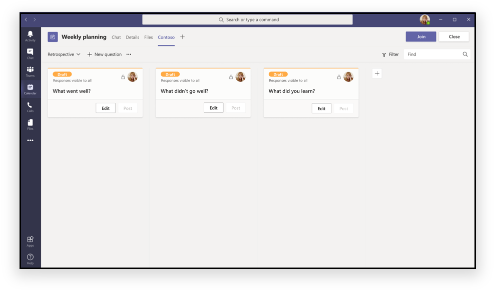

# Applications dans Teams réunions

Les réunions permettent la collaboration, le partenariat, une communication éclairée et des commentaires partagés dans un forum inclusif et actif. L’application de réunion peut offrir une expérience utilisateur pour chaque étape du cycle de vie de la réunion, y compris l’expérience de l’application avant, réunion et après la réunion, selon l’état du participant.

Teams utilisateurs finaux peuvent accéder aux applications pendant les réunions à l’aide de la galerie d’onglets, par exemple :

* Pré-étape d’un conseil Kanban
* Lancer un dialogue actionnable en réunion
* Créer un sondage après la réunion

Teams’extensibilité de l’application de réunion de l’entreprise est basée sur les concepts suivants :

✔ cycle de vie de la réunion a des étapes telles qu’avant, pendant et après le délai de réunion.  
✔ rôles des participants à une réunion, comme l’organisateur de la réunion, le présentateur ou le participant.  
✔ les types d’utilisateurs dans une réunion tels que les utilisateurs en locataire, invités, fédérés ou Teams anonymes.

Cet article couvre des informations sur le cycle de vie de la réunion et la façon d’intégrer des onglets, des bots et des extensions de messagerie dans votre réunion. Il vous permet également d’identifier les rôles des participants et d’utiliser différents types d’utilisateurs pour effectuer des tâches.

> [!NOTE]
> Pour travailler avec les fonctionnalités d’extensibilité de l’application de réunion, vous devez avoir les autorisations appropriées.

### Cycle de vie de réunion

Le cycle de vie des réunions consiste en une expérience d’application avant, en réunion et après la réunion. Vous pouvez intégrer des onglets, des bots et des extensions de messagerie à chaque étape du cycle de vie de la réunion.

## Intégrer les onglets dans le cycle de vie de la réunion

Les onglets permettent aux membres de l’équipe d’accéder aux services et au contenu dans un espace spécifique au sein d’un canal ou d’un chat. Cela permet à l’équipe de travailler directement avec les onglets et d’avoir des conversations sur les outils et les données disponibles dans les onglets. Dans Teams réunion, les utilisateurs peuvent ajouter un onglet en sélectionnant plus , et le choix de l’application qu’ils veulent installer comme onglet.

> [!IMPORTANT]
> Si vous avez intégré un onglet à votre réunion, votre application doit suivre le flux d’authentification Teams [simple de connectement (SSO)](../tabs/how-to/authentication/auth-aad-sso.md) pour les onglets.

> [!NOTE]
> * Les clients mobiles ne supporte les onglets qu’aux étapes avant et après la réunion. Les expériences en réunion qui sont en réunion de dialogue et de panel ne sont actuellement pas disponibles sur mobile.
> * Les applications ne sont prises en charge que lors de réunions privées planifiées.

### Expérience d’application avant la réunion

**Expérience de pré-réunion :**

**Onglet pré-réunion :**

✔ utilisateurs autorisés sont des utilisateurs qui peuvent ajouter des applications à une réunion à différentes étapes du cycle de vie de la réunion. Ces utilisateurs peuvent ajouter des applications à une réunion à travers la galerie d’onglets de deux façons :

   * Utilisation de **l’onglet** Détails sur le formulaire Teams de planification.

   * Utilisation de **l’onglet Chat** de réunion dans une réunion existante.

✔appraux Onglet sont accessibles dans les réunions **Détails et** Pages **chats** à l’aide d’un bouton ➕ plus.

✔ disposition de l’onglet doit être dans un état organisé s’il y a plus de dix sondages ou sondages.

### Expérience d’application en réunion

✔ de réunion sont hébergées dans la barre supérieure supérieure de la fenêtre de chat et comme expérience d’onglet en réunion à l’aide de l’onglet en réunion. Lorsque les utilisateurs ajoutent un onglet à une réunion via la galerie d’onglets, les applications qui sont pendant **les expériences de** réunion sont affichées.

✔ utilisateurs autorisés peuvent ajouter des applications pendant la réunion.

✔ Lorsqu’elles sont chargées dans le cadre d’une réunion, les applications peuvent tirer parti de la Teams client SDK pour `meetingId` accéder à la , et de rendre correctement `userMri` `frameContext` l’expérience.

✔ Exporte un résultat d’un sondage ou d’un sondage informe les utilisateurs que les résultats téléchargés avec succès.

✔'une application est visible dans une Teams réunion dans le panneau latéral ou la boîte de dialogue en réunion. Utilisez la boîte de dialogue en réunion pour présenter du contenu actionnable pour les participants à la réunion. Pour plus d’informations, [voir créer des applications pour Teams réunions.](create-apps-for-teams-meetings.md)

   > [!NOTE]
   > Votre manifeste d’application spécifie que votre onglet [est optimisé pour le panneau latéral,](create-apps-for-teams-meetings.md#during-a-meeting)c’est là qu’il est affiché. Il peut également faire partie d’une expérience de plateau de partage, sous réserve de directives de conception spécifiées.

Les images suivantes affichent l’application comme une boîte de dialogue en réunion et comme un panneau latéral distinct :

#### Dialogue actionnable en réunion pour les utilisateurs

### Expérience d’application post-réunion

✔ Le scénario d’application post-réunion est similaire à l’expérience post-réunion actuelle avec l’avantage supplémentaire d’avoir des onglets qui existent dans la surface.

✔ utilisateurs autorisés peuvent ajouter des applications de la galerie d’onglets à une réunion à l’aide de **l’onglet Détails** sur le formulaire de planification Teams et **l’onglet Chat** de réunion dans une réunion existante.

✔ disposition de l’onglet doit être organisée lorsqu’il y a plus de dix sondages ou sondages.

### Intégrer les bots dans le cycle de vie de la réunion

Pour la mise en œuvre de bot, commencez par construire un [bot,](../build-your-first-app/build-bot.md) puis [continuez avec créer des applications pour Teams réunions.](../apps-in-teams-meetings/create-apps-for-teams-meetings.md#meeting-apps-api-reference)

### Intégrer les extensions de messagerie dans le cycle de vie de la réunion

Pour la mise en œuvre de l’extension [de messagerie, commencez par créer une extension](../messaging-extensions/how-to/create-messaging-extension.md) de [messagerie, puis continuez à créer des applications pour Teams réunions.](../apps-in-teams-meetings/create-apps-for-teams-meetings.md#meeting-apps-api-reference)

## Rôles des participants et types d’utilisateurs dans une réunion

### Rôles des participants

Les paramètres des participants par défaut sont déterminés par l’administrateur informatique d’une organisation. Voici les rôles des participants à une réunion :

* **Organisateur**: L’organisateur planifie une réunion, définit les options de réunion, attribue les rôles de réunion et commence la réunion. Seuls les utilisateurs ayant un compte M365 avec une licence Teams peuvent être des organisateurs et contrôler les autorisations des participants. Un organisateur de réunion peut modifier les paramètres d’une réunion spécifique. Les organisateurs peuvent apporter ces modifications sur la page **Web des options** de réunion.
* **Présentateur**: Les présentateurs ont les mêmes capacités que les organisateurs. Toutefois, un présentateur ne peut pas supprimer un organisateur de la session ou modifier les options de réunion pour la session. Par défaut, les participants qui se joignent à une réunion ont le rôle de présentateur.
* **Participant :** Un participant est un utilisateur qui a été invité à assister à une réunion mais qui n’est pas autorisé à agir à titre de présentateur. Les participants peuvent interagir avec d’autres membres de la réunion, mais ne peuvent gérer aucun des paramètres de la réunion ou partager du contenu.

Seul un organisateur ou un présentateur peut ajouter, supprimer ou désinstaller des applications. Seul l’organisateur ou le présentateur peut créer des sondages lors d’une réunion.

Pour plus d’informations, [voir les rôles dans une Teams réunion](https://support.microsoft.com/office/roles-in-a-teams-meeting-c16fa7d0-1666-4dde-8686-0a0bfe16e019).

Vous pouvez accéder à la page  **options de** réunion comme suit :

* Dans Teams, allez au logo **du**  calendrier, sélectionnez une réunion, puis **rencontrez les options**.

* Dans une invitation à la réunion, sélectionnez **Options de réunion**.

* Au cours d’une réunion, certains **participants au Salon** affichent  aux contrôles de la réunion. Ensuite, au-dessus de la liste des participants, choisissez **Gérer les autorisations**.

### Types d'utilisateur

> [!NOTE]
> Les utilisateurs avec des types d’utilisateurs spécifiques qui leur sont assignés peuvent participer aux réunions et assumer l’un des rôles des participants décrits dans [les rôles des participants.](#participant-roles) Le type d’utilisateur n’est pas **inclus dans l’API getParticipantRole.**

Les types d’utilisateurs suivants identifient ce que chaque utilisateur peut faire et ce qu’il peut accéder :

* **Locataire : Les** utilisateurs locataires appartiennent à l’organisation et ont des titres de compétences en Azure Active Directory (AAD) pour le locataire. Il s’agit habituellement d’employés à temps plein, sur place ou à distance. Un utilisateur locataire peut être un organisateur, un présentateur ou un participant.
* **Invité**: Un invité est un participant d’un autre organisme invité à accéder à Teams ou à d’autres ressources du locataire de l’organisation. Les invités sont ajoutés à l’AAD de votre organisation et ont les mêmes capacités de Teams qu’un membre de l’équipe autochtone ayant accès à des conversations d’équipe, des réunions et des fichiers. Un utilisateur invité peut être un organisateur, un présentateur ou un participant. Pour plus d’informations, [consultez l’accès des clients dans Teams](/microsoftteams/guest-access).
* **Fédéré ou externe**: Un utilisateur fédéré est un utilisateur Teams externe d’une autre organisation qui a été invité à participer à une réunion. Ces utilisateurs ont des informations d’identification valides avec des partenaires fédérés et sont autorisés par Teams. Ils n’ont pas accès à vos équipes ou à d’autres ressources partagées de votre organisation. L’accès des clients est une meilleure option pour les utilisateurs externes d’avoir accès aux équipes et aux canaux. Pour plus d’informations, [voir gérer l’accès externe dans Teams](/microsoftteams/manage-external-access).
* **Anonyme**: Les utilisateurs anonymes n’ont pas d’identité AAD et ne sont pas fédérés avec un locataire. Le participant anonyme est comme un utilisateur externe, mais son identité n’est pas projetée dans la réunion. Un utilisateur anonyme ne peut pas être un organisateur, mais peut être un présentateur ou un participant.

> [!NOTE]
> Les utilisateurs anonymes héritent de la stratégie globale d’autorisation d’application par défaut de l’utilisateur. Pour plus d’informations, voir [Gérer les applications](/microsoftteams/non-standard-users#anonymous-user-in-meetings-access).

Le tableau suivant fournit les types d’utilisateurs et les fonctionnalités à qui chaque utilisateur peut accéder :

| Type d’utilisateur | Onglets | Bots | Extensions de messagerie | Cartes adaptatives | Modules de tâche | Boîtes de dialogue en réunion |
| :-- | :-- | :-- | :-- | :-- | :-- | :-- |
| Utilisateur anonyme | Non disponible | Non disponible | Non disponible | Les interactions dans le chat de réunion sont autorisées. | Les interactions dans le chat de réunion à partir d’une carte adaptative sont autorisées. | Non disponible |
| Invité qui fait partie du locataire AAD | L’interaction est autorisée. La création, la mise à jour et la suppression ne sont pas autorisées. | Non disponible | Non disponible | Les interactions dans le chat de réunion sont autorisées. | Les interactions dans le chat de réunion à partir d’une carte adaptative sont autorisées. | Available |
| fédéré | Non disponible | Non disponible | Non disponible | Non disponible | Non disponible | Non disponible |

## Voir aussi

* [Tab](../tabs/what-are-tabs.md#understand-how-tabs-work)
* [Bot](../bots/what-are-bots.md)
* [Extension de la messagerie](../messaging-extensions/what-are-messaging-extensions.md)
* [Concevoir votre application](../apps-in-teams-meetings/design/designing-apps-in-meetings.md)

## Étape suivante

> [!div class="nextstepaction"]
> [Créer votre application](create-apps-for-teams-meetings.md)
