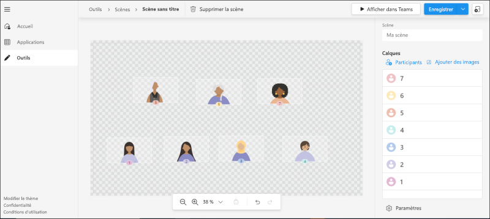
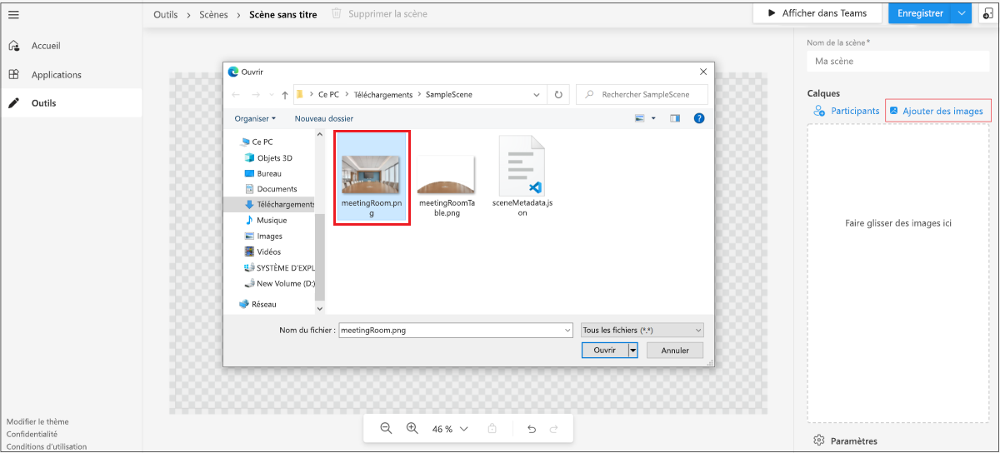
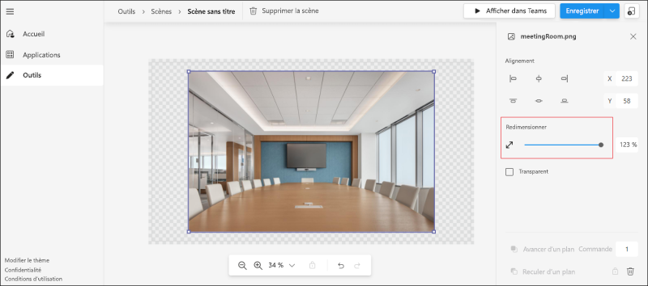
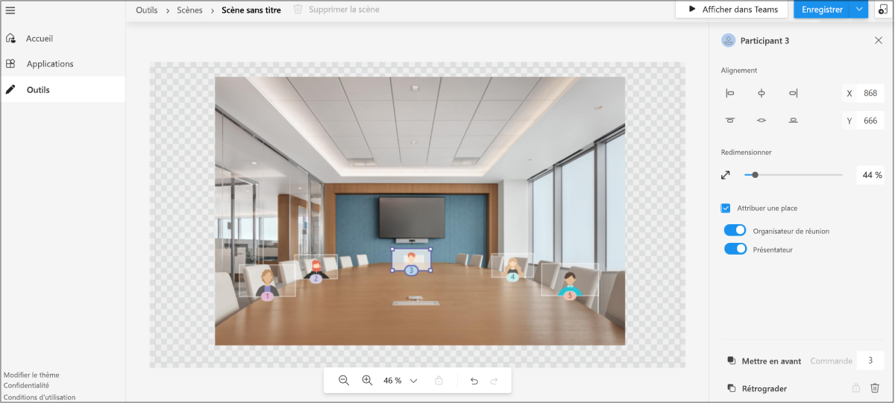
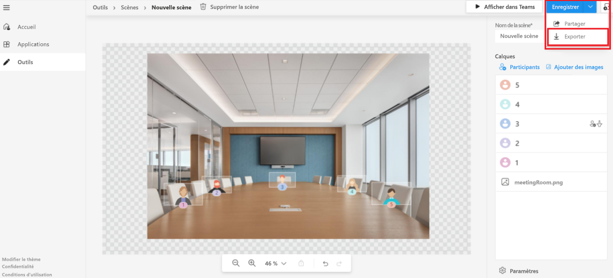

# <a name="custom-together-mode-scenes-in-teams"></a>Scènes personnalisées en mode Ensemble dans Teams

Les scènes personnalisées en mode Ensemble dans Microsoft Teams fournissent un environnement de réunion immersif et attrayant avec les actions suivantes :

* Rassemblez les personnes et encouragez-les à activer leur vidéo.
* Combinez numériquement les participants dans une scène virtuelle unique.
* Placez les flux vidéo des participants dans des sièges pré-déterminés conçus et corrigés par le créateur de la scène.

Dans les scènes personnalisées du mode Ensemble, la scène est un artefact. La scène est créée par le développeur de la scènes à l'aide du studio de scène Microsoft. Dans une scène conçue, les participants disposent de sièges avec des flux vidéo. Les vidéos sont restituer dans ces sièges. Nous vous recommandons les applications de scène uniquement car l'expérience avec ces applications est claire.

Le processus suivant donne une vue d'ensemble de la création d'une application de scène uniquement :

:::image type="content" source="../assets/images/apps-in-meetings/create-together-mode-scene-flow.png" alt-text="Créer une application de scène uniquement" border="false":::

Une application de scène uniquement est toujours une application dans Teams. Le studio de scène gère la création de package d’application en arrière-plan. Plusieurs scènes d’un package d’application unique s’affichent sous la forme d’une liste plate pour les utilisateurs.

> [!NOTE]
> Toutefois, quand un utilisateur rejoint une réunion via mobile et que le mode Ensemble est allumé à partir du bureau, les utilisateurs mobiles qui ont allumé la vidéo apparaissent en mode Ensemble sur le bureau.

## <a name="prerequisites"></a>Configuration requise

Vous devez avoir une connaissance de base des éléments suivants pour utiliser des scènes personnalisées du mode Ensemble :

* Définir une scène et des sièges dans une scène.
* Vous devez disposer d’un compte de développeur Microsoft et être familier avec le [portail des développeurs](../concepts/build-and-test/teams-developer-portal.md) Teams et App Studio.
* Comprendre le [concept de chargement indépendant d’application.](../concepts/deploy-and-publish/apps-upload.md)
* Assurez-vous que l’administrateur a accordé l’autorisation de [**Charger une application personnalisée**](../concepts/deploy-and-publish/apps-upload.md) et de sélectionner tous les filtres dans le cadre de la configuration de l’application et des stratégies de réunion, respectivement.

## <a name="best-practices"></a>Bonnes pratiques

Prenons les pratiques suivantes pour une expérience de création de scène :

* Veillez à ce que toutes les images sont au format PNG.
* Veillez à ce que le package final avec toutes les images rassemblées ne dépasse pas la résolution de 1920 x 1080. La résolution est un nombre pair. Cette résolution est une exigence pour que les scènes soient affichées avec succès.
* Veillez à ce que la taille maximale de la scène ne dépasse pas 10 Mo.
* Veillez à ce que la taille maximale de chaque image ne dépasse pas 5 Mo. Une scène est une collection de plusieurs images. La limite est pour chaque image individuelle.
* Veillez à sélectionner **Transparent** selon les besoins. Cette case à cocher est disponible sur le panneau de droite lorsqu'une image est sélectionnée. Les images qui se chevauchent doivent être marquées comme **transparentes** pour indiquer qu'elles se chevauchent dans la scène.

## <a name="build-a-scene-using-the-scene-studio"></a>Créer une scène à l’aide du studio de scène

Microsoft dispose d’un studio de scène qui vous permet de créer des scènes. Celui-ci est disponible sur [Éditeur de scènes : portail des développeurs Teams.](https://dev.teams.microsoft.com/scenes) Ce document fait référence au studio de scène situé dans le portail des développeurs Teams. L’interface et les fonctionnalités sont identiques dans Le Concepteur de scène App Studio.

Une scène dans le contexte du studio de scène est un artefact qui contient les éléments suivants :

* Sièges réservés aux organisateurs et présentateurs de réunion. Le présentateur ne fait pas référence à l’utilisateur qui partage activement. Il fait référence au [rôle de réunion](https://support.microsoft.com/office/roles-in-a-teams-meeting-c16fa7d0-1666-4dde-8686-0a0bfe16e019).

* Siège et image pour chaque participant avec une largeur et une hauteur réglables. Seul le format PNG est pris en charge pour l’image.

* Coordonnées XYZ de tous les sièges et images.

* Collection d'images qui sont camouflées en une seule image.

L’image suivante montre chaque siège représenté comme un avatar pour la création des scènes :



Pour créer une scène à l'aide du studio de scène, procédez comme suit :

1. Accédez à [Éditeur de scenes : portail des développeurs Teams](https://dev.teams.microsoft.com/scenes).

    Vous pouvez également ouvrir le studio de scène sur la page d’accueil du [portail des développeurs Teams](https://dev.teams.microsoft.com/home) :
    * Sélectionnez **Créer des scènes personnalisées pour les réunions.**
    * Sélectionnez **Outils** dans la section de gauche, puis **Studio de scène** dans la section **Outils**.

1. Dans l’**Éditeur de scènes**, sélectionnez **Créer une scène**.

1. Dans **Nom de la scène**, entrez un nom pour la scène.

    * Vous pouvez sélectionner **Fermer** pour faire bascule entre la fermeture ou la réouverture du volet droit.
    * Pour une meilleure vue de la scène, vous pouvez effectuer un zoom avant ou arrière sur la scène à l’aide de la barre de zoom.

1. Sélectionnez **Ajouter des images** pour ajouter l’image dans l’environnement :

    

    >[!NOTE]
    >Vous pouvez télécharger [ fichiersSampleScene.zip](https://github.com/MicrosoftDocs/msteams-docs/tree/master/msteams-platform/apps-in-teams-meetings/SampleScene.zip) et [SampleApp.zip](https://github.com/MicrosoftDocs/msteams-docs/tree/master/msteams-platform/apps-in-teams-meetings/SampleApp.zip) avec les images.

1. Sélectionnez l’image que vous avez ajoutée.

1. Dans le volet droit, sélectionnez un alignement pour l’image ou utilisez **Redimensionner** pour ajuster la taille de l’image :

    

1. Sélectionnez une zone en dehors de l’image.

1. Dans le coin supérieur droit, sélectionnez **Participants** sous **Calques**.

1. Sélectionnez le nombre de participants pour la scène dans la zone **Nombre de participants**, puis sélectionnez **Ajouter**. Une fois la scène livrée, les emplacements des avatars sont remplacés par les flux vidéo des participants réels. Vous pouvez faire glisser les images des participants autour de la scène et les placer à la position requise. Vous pouvez les redimensionner à l’aide de la flèche de redimensionnement.

1. Sélectionnez n’importe quelle image de participant, puis sélectionnez **Affecter une place** pour affecter la place au participant.

1. Sélectionnez le rôle **Organisateur de réunion** ou **Présentateur** pour le participant. Dans une réunion, le rôle d’organisateur d’une réunion doit être attribué à un participant :

    

1. Pour tester rapidement votre scène dans Teams, sélectionnez **Enregistrer** et sélectionner **Afficher dans Teams**.

    * La sélection de **Affichage dans Teams** crée automatiquement une application Teams qui peut être affichée dans la page **Applications** dans le portail des développeurs Teams.
    * La sélection de **Affichage dans Teams** crée automatiquement un package d’application qui est appmanifest.json derrière la scène. Vous pouvez accéder aux **applications** à partir du menu et accéder au package d’application créé automatiquement.
    * Pour supprimer une scène que vous avez créée, sélectionnez **Supprimer une scène** dans la barre supérieure.

1. In **Afficher dans Teams**, select **Prévisualiser dans Teams**.
1. Dans la boîte de dialogue qui s’affiche, sélectionnez **Ajouter.**

    La scène est testée ou accessible en créant une réunion de test et en lançant des scènes personnalisées en mode Ensemble. Pour plus d’informations, consultez [activer des scènes personnalisées du mode Ensemble](#activate-custom-together-mode-scenes) :

    

    La scène peut ensuite être vue dans la galerie de scènes personnalisée du mode Ensemble.

Si vous le souhaitez, vous pouvez sélectionner **Partager** dans le menu déroulant **Enregistrer**. Vous pouvez créer un lien partageable pour distribuer vos scènes à d’autres personnes. L’utilisateur peut ouvrir le lien pour installer la scène et commencer à l’utiliser.

Après la prévisualisation, la scène est livrée en tant qu’application à Teams en suivant les étapes de soumission de l’application. Cette étape nécessite le package d’application. Pour la scène qui a été conçue, le package d’application est différent du package de scène. Le package d’application créé automatiquement se trouve dans la section **Applications** du centre de développement Teams.

Si vous le souhaitez, le package de scène est récupéré en sélectionnant **Exporter** dans le menu déroulant **Enregistrer**. Un fichier .zip, qui est le package de scène, est téléchargé. Le package de scène inclut un fichier scene.json et les ressources PNG utilisées pour générer une scène. Le package de scène est examiné pour incorporer d’autres modifications :



Une scène complexe qui utilise l’axe Z est illustrée dans l’exemple de prise en main pas à pas.

## <a name="sample-scenejson"></a>Exemple de scene.json

Scene.json avec les images indiquent la position exacte des sièges. Une scène est constituée d'images bitmap, d’images-objets et de rectangles dans lesquels on peut placer les vidéos des participants. Ces images-objets et zones de participants sont définis dans un système de coordonnées de monde. L’axe X pointe vers la droite et l’axe Y pointe vers le bas.

Les scènes personnalisées en mode Ensemble prise en charge le zoom avant sur les participants actuels. Cette fonctionnalité est utile pour les petites réunions dans une grande scène. Une image-objet est une image bitmap statique positionnée dans le monde. La valeur Z de l’image-objet détermine la position de l’image-objet. Le rendu commence par l’image-objet avec la valeur Z la plus faible, donc une valeur Z plus élevée signifie que vous vous rapprochez de la caméra. Chaque participant possède son propre flux vidéo, qui est segmenté afin que seul le premier plan soit rendu.

Le code suivant est l’exemple scene.json :

```json
{
   "protocolVersion": "1.0",
   "id": "A",
   "autoZoom": true,
   "mirrorParticipants ": true,
   "extent":{
      "left":0.0,
      "top":0.0,
      "width":16.0,
      "height":9.0
   },
   "sprites":[
      {
         "filename":"background.png",
         "cx":8.0,
         "cy":4.5,
         "width":16.0,
         "height":9.0,
         "zOrder":0.0,
   "isAlpha":false
      },
      {
         "filename":"table.png",
         "cx":8.0,
         "cy":7.0,
         "width":12.0,
         "height":4.0,
         "zOrder":3.0,
   "isAlpha":true
      },
      {
         "filename":"row0.png",
         "cx":12.0,
         "cy":15.0,
         "width":8.0,
         "height":4.0,
         "zOrder":2.0,
   "isAlpha":true
      }

   ],
   "participants":[
      {
         "cx":5.0,
         "cy":4.0,
         "width":4.0,
         "height":2.25,
         "zOrder":1.0,
         "seatingOrder":0
      },
      {
         "cx":11.0,
         "cy":4.0,
         "width":4.0,
         "height":2.25,
         "zOrder":1.0,
         "seatingOrder":1
      }
   ]
}
```

Chaque scène possède un ID et un nom uniques. Le fichier JSON de la scène contient également des informations sur toutes les ressources utilisées pour la scène. Chaque ressource contient un nom de fichier, une largeur, une hauteur et une position sur les axes X et Y. De même, chaque siège contient un ID de siège, une largeur, une hauteur et une position sur les axes X et Y. L’ordre de classement est généré automatiquement et modifié selon les préférences. Le numéro de commande de classement correspond à l’ordre des personnes qui rejoignent l’appel.

Le `zOrder` représente l’ordre de placement des images et des sièges le long de l’axe Z. Cela donne une idée de la profondeur ou de partition si nécessaire. Consultez l’exemple de prise en main pas à pas. L’exemple utilise le `zOrder`.

Maintenant que vous avez parcouru l’exemple scene.json, vous pouvez activer les scènes personnalisées en mode Ensemble pour vous engager dans des scènes.

## <a name="activate-custom-together-mode-scenes"></a>Activer des scènes personnalisées du mode Ensemble

Obtenez plus d’informations sur la façon dont un utilisateur s’engage avec des scènes dans des scènes personnalisées du mode Ensemble.

Pour sélectionner des scènes et activer des scènes personnalisées en mode Ensemble, procédez comme suit :

1. Créez une réunion de test.

    >[!NOTE]
    > Lorsque vous sélectionnez **Aperçu** dans le studio de scène, la scène est installée en tant qu’application dans Teams. Il s'agit du modèle permettant à un développeur de tester et d'essayer les scènes du studio de scène. Une fois qu’une scène est livrée en tant qu’application, les utilisateurs voient ces scènes dans la galerie de scène.

1. Dans la liste déroulante **Galerie** dans le coin supérieur gauche, sélectionnez **Mode ensemble**. La boîte de dialogue du **Sélecteur** s’affiche et la scène ajoutée est disponible.

1. Sélectionnez **Modifier la scène** pour modifier la scène par défaut.

1. Dans la **Galerie de scène**, sélectionnez la scène que vous souhaitez utiliser pour votre réunion.

    Si vous le souhaitez, l’organisateur et le présentateur de la réunion peuvent **changer de scène pour tous les participants** dans la réunion.

    >[!NOTE]
    > À tout moment, une seule scène est utilisée de manière homogène pour la réunion. Si un présentateur ou un organisateur modifie une scène, celle-ci change pour tout le mode. Il revient à chaque participant d’entrer ou sortir des scènes personnalisées du mode Ensemble, mais lorsqu'ils sont dans des scènes personnalisées du mode Ensemble, tous les participants ont la même scène.

1. Sélectionnez **Appliquer**. Teams installe l’application pour l’utilisateur et applique la scène.

## <a name="open-a-custom-together-mode-scenes-scene-package"></a>Ouvrez un package de scènes personnalisées du mode Ensemble

Pour améliorer davantage la scène, vous pouvez partager le package de scène (qui est un fichier .zip extrait du studio de scène) avec d’autres créateurs. La fonctionnalité **Importer une scène** permet de désenvelopper un package de scènes pour permettre au créateur de continuer à créer la scène.


## <a name="see-also"></a>Voir aussi

* [Applications pour les réunions Teams](teams-apps-in-meetings.md)
* [Bots d’appels et réunions](~/bots/calls-and-meetings/calls-meetings-bots-overview.md)
* [Appels et réunions multimédias en temps réel avec Microsoft Teams](~/bots/calls-and-meetings/real-time-media-concepts.md)
