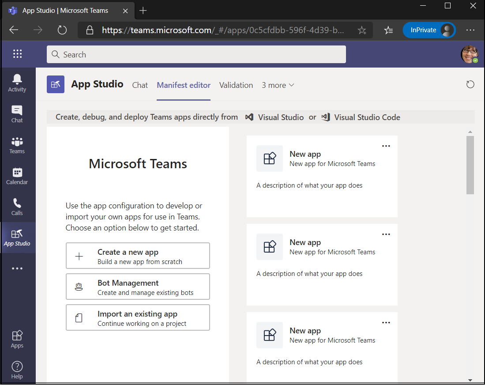
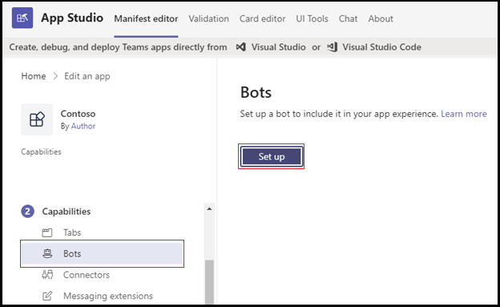

# <a name="add-power-virtual-agents-chatbot"></a>Ajouter le chatbot Power Virtual Agents 

Power Virtual Agents est une solution d’interface graphique guidée sans code qui permet à chaque membre de votre équipe de créer des chatbots riches et conversationnels qui s’intègrent facilement à la plateforme Teams web. Tout le contenu rédigé dans Power Virtual Agents s’restituera naturellement dans Teams. Power Virtual Agents bots s’engagent avec les utilisateurs dans le Teams de conversation native. Les administrateurs informatiques, les analystes d’entreprise, les spécialistes de domaines et les développeurs d’applications compétents peuvent concevoir, développer et publier des agents virtuels intelligents pour Teams sans avoir à configurer un environnement de développement. Ils peuvent créer un service web ou s’inscrire directement auprès de Bot Framework. 

Ce document vous guide sur la façon de rendre votre chatbot disponible dans Teams via le portail Power Virtual Agents et d’ajouter votre bot à Teams à l’aide d’App Studio. 

Power Virtual Agents vous permet de créer des chatbots puissants qui peuvent répondre aux questions posées par vos clients, d’autres employés ou les visiteurs de votre site web ou service.

Ces bots peuvent être créés facilement sans avoir besoin de développeurs ou de développeurs.

> [!NOTE]
> En ajoutant votre chatbot à Microsoft Teams, certaines données, telles que le contenu du bot et le contenu de conversation utilisateur, sont partagées avec Microsoft Teams. Cela signifie que vos données sont en dehors des limites de conformité et géographiques [ou régionales de votre organisation.](/power-virtual-agents/data-location) <br/>

## <a name="make-your-chatbot-available-in-teams-through-the-power-virtual-agents-portal"></a>Rendre votre chatbot disponible dans Teams via le portail Power Virtual Agents web

Pour rendre votre chatbot disponible dans Teams via le portail Power Virtual Agents, vous devez effectuer les étapes de processus suivantes :

**Pour rendre le chatbot disponible dans Teams**

1. **Publier le contenu du bot le plus récent**  
Après avoir créé un chatbot dans le portail Power Virtual Agents, vous devez publier votre bot pour que Teams utilisateurs puisse interagir avec celui-ci. Pour plus d’informations, voir [Publier le contenu du bot le plus récent.](/power-virtual-agents/publication-fundamentals-publish-channels#publish-the-latest-bot-content)

   

1. **Configurer le canal Teams canal**  
Après avoir publié votre bot, ajoutez le canal Teams pour le mettre à la disposition Teams utilisateurs.

   

1. **Générer un ID d’application pour votre chatbot**  
Après avoir ajouté le Teams à votre chatbot, un **ID** d’application est généré dans la boîte de dialogue. L’ID d’application est un identificateur Microsoft unique généré pour votre bot. Enregistrez l’ID d’application pour créer un package d’application Teams.

## <a name="add-your-bot-to-teams-using-app-studio"></a>Ajouter votre bot à Teams à l’aide d’App Studio

Si [le](/microsoftteams/admin-settings) téléchargement d’applications personnalisées est activé dans votre instance Teams, vous pouvez utiliser Teams App Studio pour télécharger directement votre chatbot et commencer à l’utiliser immédiatement. Pour partager votre chatbot, vous pouvez demander à votre administrateur de rendre votre bot disponible dans le catalogue d’applications client ou vous pouvez envoyer votre package d’application à d’autres utilisateurs et leur demander de le télécharger indépendamment.

1. **Installer App Studio dans Teams**  
App Studio est une application Teams application. Installez App Studio à partir du magasin Teams qui simplifie le processus de création et d’inscription du bot dans Teams : 

   1. Sélectionnez l’icône du Magasin d’applications Teams instance, puis recherchez **App Studio.**

      &emsp;&emsp;    

   1. Sélectionnez **la vignette App Studio** et **sélectionnez Installer** dans la boîte de dialogue qui s’affiche.

      &emsp;&emsp; 

1. **Créer le manifeste Teams’application dans App Studio**  
Les bots dans Teams sont définis par un fichier JSON manifeste d’application qui fournit les informations de base sur votre bot et ses fonctionnalités. Dans **App Studio,** sélectionnez **l’éditeur de** manifeste, puis **sélectionnez Créer une application.**

    

1. **Ajouter les détails de votre bot**  
Remplissez tous les champs requis. Pour obtenir une description complète de chaque champ, voir [la définition du schéma de manifeste.](../../resources/schema/manifest-schema.md)

    

1. **Configurer votre bot** Pour configurer le bot, effectuez les étapes suivantes : 
     1. Ouvrez **l’onglet Bots.** 
     1. Sélectionnez   >  **Le bot d’installation** existant et entrez le nom de votre bot.

    

   L’image suivante décrit comment configurer un bot existant :      

   
       
1. **Ajouter votre ID d’application**  
Pour ajouter votre ID d’application, effectuez les étapes suivantes :  
    1. Sélectionnez **Connecter vers un autre ID de bot** et collez l’ID **d’application** que vous avez copié précédemment. 
    1. Sélectionnez   >  **l’étendue d’enregistrer**  >  **personnel**.

    

1. **Ajouter des domaines valides pour votre bot**  
Cette étape est requise uniquement si votre bot nécessite que l’utilisateur se connecte. Sélectionnez **Domaines et autorisations** et, dans le **champ Domaines valides,** fournissez l’entrée suivante :

    ```bash
       token.botframework.com
    ```

1. **Tester et distribuer votre bot**  
Ouvrez **Test et distribuez** l’onglet, puis sélectionnez **Installer** pour ajouter votre bot directement à Teams instance. Vous pouvez également télécharger le package d’application terminé pour le partager avec des utilisateurs Teams ou le fournir à votre administrateur pour que votre bot soit disponible dans le catalogue d’applications client.

1. **Démarrer une conversation**   
Le processus de mise en place de l’ajout Power Virtual Agents bot de conversation à Teams est terminé. Vous pouvez maintenant démarrer une conversation avec votre bot dans une conversation personnelle.

## <a name="see-also"></a>Voir aussi

* [Power Virtual Agents](/power-virtual-agents/fundamentals-what-is-power-virtual-agents)  
* [Créez un chatbot pour Teams avec Microsoft Power Virtual Agents](../bot-features.md#bots-and-the-microsoft-power-virtual-agents).  
* [Power Virtual Agents portail](https://powervirtualagents.microsoft.com)
* [Publier votre bot Power Virtual Agents de publication](/power-virtual-agents/publication-fundamentals-publish-channels)
* [Sécurité et conformité dans Microsoft Teams](/MicrosoftTeams/security-compliance-overview).

## <a name="next-step"></a>Étape suivante

> [!div class="nextstepaction"]
> [Créer un assistant virtuel](~/samples/virtual-assistant.md)

