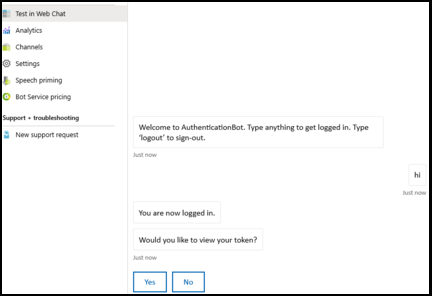
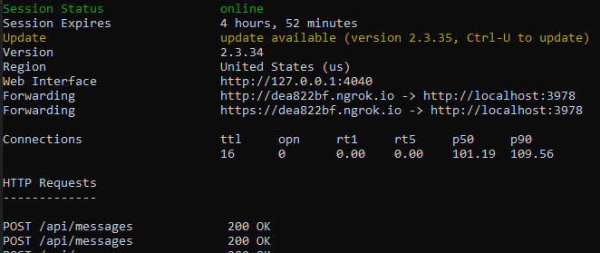

# <a name="add-authentication-to-your-teams-bot"></a>Ajouter l’authentification à votre robot teams

Dans certains cas, vous devrez peut-être créer des robots dans Microsoft teams qui peuvent accéder aux ressources au nom de l’utilisateur, tel qu’un service de messagerie.

Cet article explique comment utiliser l’authentification du kit de développement logiciel (SDK) de l’outil Azure bot Service v4, basée sur OAuth 2,0. Ainsi, il est plus facile de développer un bot qui peut utiliser des jetons d’authentification en fonction des informations d’identification de l’utilisateur. Key dans tout ceci est l’utilisation de **fournisseurs d’identité**, comme nous le verrons plus tard.

OAuth 2.0 est une norme ouverte pour l’authentification et l’autorisation utilisée par Azure Active Directory (Azure AD) et de nombreux autres fournisseurs d’identité. Une compréhension de base de OAuth 2,0 est une condition préalable à l’utilisation de l’authentification dans Teams.

Voir [OAuth 2 simplifiée](https://aka.ms/oauth2-simplified) pour une compréhension de base et [OAuth 2,0](https://oauth.net/2/) pour la spécification complète.

Pour plus d’informations sur la façon dont le service Azure bot gère l’authentification, consultez [la rubrique authentification des utilisateurs au sein d’une conversation](https://aka.ms/azure-bot-authentication).

Voici les titres des sections de cet article :

- **Comment créer un bot compatible avec l’authentification**. Vous utiliserez [CS-Auth-Sample][teams-auth-bot-cs] pour gérer les informations d’identification de connexion de l’utilisateur et la génération du jeton d’authentification.
- **Comment déployer le bot sur Azure et l’associer à un fournisseur d’identité**. Le fournisseur émet un jeton basé sur les informations d’identification de connexion de l’utilisateur. Le bot peut utiliser le jeton pour accéder aux ressources, telles qu’un service de messagerie, qui requiert l’authentification. Pour plus d’informations, consultez la rubrique [flux d’authentification de Microsoft teams pour les robots](auth-flow-bot.md).
- **Comment intégrer le robot dans Microsoft teams**. Une fois le robot intégré, vous pouvez vous connecter et échanger des messages avec celui-ci dans une conversation.

## <a name="prerequisites"></a>Conditions préalables

- Connaissance des [notions de base des robots][concept-basics], de la gestion de l' [État][concept-state], de la bibliothèque de [boîtes de dialogue][concept-dialogs]et de la mise en œuvre d’un [flux de conversation séquentiel][simple-dialog].
- Connaissance des développements Azure et OAuth 2,0.
- Visual Studio 2017 ou version ultérieure et git.
- Compte Azure. Si nécessaire, vous pouvez créer un [compte Azure gratuit](https://azure.microsoft.com/free/).
- L’exemple suivant.

    | Exemple | Version d’BotBuilder | Montre |
    |:---|:---:|:---|
    | **Authentification bot** dans [CS-Auth-Sample][teams-auth-bot-cs] | v4 | Prise en charge OAuthCard |
    | **Authentification bot** dans [js-auth-Sample][teams-auth-bot-js] | v4| Prise en charge OAuthCard  |
    | **Authentification de robot** dans la [py-auth-Sample][teams-auth-bot-py] | v4 | Prise en charge OAuthCard |

## <a name="create-the-resource-group"></a>Créer le groupe de ressources

Le groupe de ressources et le plan de service ne sont pas strictement nécessaires, mais ils vous permettent de libérer facilement les ressources que vous créez. Cette pratique est intéressante pour maintenir l’organisation et la gestion de vos ressources.

Vous utilisez un groupe de ressources pour créer des ressources individuelles pour l’infrastructure bot. Pour des performances optimales, vérifiez que ces ressources se trouvent dans la même région Azure.

1. Dans votre navigateur, connectez-vous au [**portail Azure**][azure-portal].
1. Dans le volet de navigation de gauche, sélectionnez **groupes de ressources**.
1. Dans le coin supérieur gauche de la fenêtre affichée, sélectionnez **Ajouter** un onglet pour créer un nouveau groupe de ressources. Vous serez invité à fournir les informations suivantes :
    1. **Abonnement**. Utilisez votre abonnement existant.
    1. **Groupe de ressources**. Entrez le nom du groupe de ressources. Un exemple peut être *TeamsResourceGroup*. N’oubliez pas que le nom doit être unique.
    1. Dans le menu déroulant **région** , sélectionnez *anglais (États-Unis*) ou une région proche de vos applications.
    1. Sélectionnez le bouton **vérifier et créer** . Vous devriez voir une bannière indiquant que la *validation a réussi*.
    1. Sélectionnez le bouton **créer** . La création du groupe de ressources peut prendre quelques minutes.

> [!TIP]
> Comme pour les ressources que vous allez créer plus loin dans ce didacticiel, nous vous recommandons de épingler ce groupe de ressources à votre tableau de bord pour un accès facile. Si vous souhaitez le faire, sélectionnez l’icône de code confidentiel & # 128204 ; dans le coin supérieur droit du tableau de bord.

## <a name="create-the-service-plan"></a>Créer le plan de service

1. Dans le [**portail Azure**][azure-portal], dans le volet de navigation de gauche, sélectionnez **créer une ressource**.
1. Dans la zone de recherche, tapez *plan de service d’application*. Sélectionnez la carte **app service plan** dans les résultats de la recherche.
1. Sélectionnez **Créer**.
1. Vous serez invité à fournir les informations suivantes :
    1. **Abonnement**. Vous pouvez utiliser un abonnement existant.
    1. **Groupe de ressources**. Sélectionnez le groupe que vous avez créé précédemment.
    1. **Nom**. Entrez le nom du plan de service. Un exemple peut être *TeamsServicePlan*. N’oubliez pas que le nom doit être unique au sein du groupe.
    1. **Système d’exploitation**. Sélectionnez *Windows* ou votre système d’exploitation applicable.
    1. **Région**. Sélectionnez *West US* ou une région proche de vos applications.
    1. **Niveau de tarification**. Assurez-vous que l’option *standard S1* est sélectionnée. Il doit s’agir de la valeur par défaut.
    1. Sélectionnez le bouton **vérifier et créer** . Vous devriez voir une bannière indiquant que la *validation a réussi*.
    1. Sélectionnez **Créer**. La création du plan de service d’application peut prendre quelques minutes. Le plan est affiché dans le groupe de ressources.

## <a name="create-the-bot-channels-registration"></a>Création de l’enregistrement des canaux de robots

L’inscription des canaux de robots enregistre votre service Web en tant que bot avec l’infrastructure de robot, à condition que vous disposiez d’un ID d’application Microsoft et d’un mot de passe d’application (clé secrète client).

> [!IMPORTANT]
> Il vous suffit d’enregistrer votre robot s’il n’est pas hébergé dans Azure. Si vous avez [créé un bot](/azure/bot-service/abs-quickstart?view=azure-bot-service-4.0&viewFallbackFrom=azure-bot-service-3.0) via le portail Azure, il est déjà enregistré auprès du service. Si vous avez créé votre bot via l' [infrastructure bot](https://dev.botframework.com/bots/new) ou [AppStudio](~/concepts/build-and-test/app-studio-overview.md) , votre bot n’est pas enregistré dans Azure.

[!INCLUDE [bot channels registration steps](~/includes/bots/azure-bot-channels-registration.md)]

Une fois que Azure a créé la ressource d’inscription, elle est incluse dans la liste des groupes de ressources.  


> [!NOTE]
> La ressource d’inscription des canaux de robots affiche la région **globale** , même si vous avez sélectionné West US. Ceci est normal.

Pour plus d’informations, consultez [la rubrique Create a bot for teams](../create-a-bot-for-teams.md).

## <a name="create-the-identity-provider"></a>Créer le fournisseur d’identité

Vous avez besoin d’un fournisseur d’identité qui peut être utilisé pour l’authentification.
Dans cette procédure, vous allez utiliser un fournisseur Azure AD ; d’autres fournisseurs d’identité pris en charge par Azure AD peuvent également être utilisés.

1. Dans le [**portail Azure**][azure-portal], dans le volet de navigation de gauche, sélectionnez **Azure Active Directory**.
    > [!TIP]
    > Vous devrez créer et enregistrer cette ressource Azure AD dans un client dans lequel vous pouvez consentir à déléguer les autorisations demandées par une application.
    > Pour obtenir des instructions sur la création d’un client, consultez [la rubrique accéder au portail et créer un client](/azure/active-directory/fundamentals/active-directory-access-create-new-tenant).
1. Dans le volet gauche, sélectionnez **inscriptions des applications**.
1. Dans le volet droit, sélectionnez l’onglet **nouvel enregistrement** , dans le coin supérieur gauche.
1. Vous serez invité à fournir les informations suivantes :
   1. **Nom**. Entrez le nom de l’application. Un exemple peut être *BotTeamsIdentity*. N’oubliez pas que le nom doit être unique.
   1. Sélectionnez les **types de comptes pris en charge** pour votre application. Sélectionnez des *comptes dans n’importe quel annuaire d’organisation (n’importe quel compte Azure ad Directory-multiclient) et des comptes Microsoft personnels (par exemple, Skype, Xbox)*.
   1. Pour l' **URI de redirection**:<br/>
       &#x2713;sélectionnez **Web**. <br/>
       &#x2713; définissez l’URL sur `https://token.botframework.com/.auth/web/redirect`.
   1. Sélectionnez **Inscrire**.

1. Une fois créé, Azure affiche la page de **vue d’ensemble** de l’application. Copiez et enregistrez les informations suivantes dans un fichier :

    1. Valeur de l’ID de l' **application (client)** . Vous utiliserez cette valeur ultérieurement comme *ID client* lorsque vous enregistrerez cette application d’identité Azure avec votre bot.
    1. Valeur de l' **ID d’annuaire (locataire)** . Vous utiliserez également cette valeur ultérieurement comme *ID de client* pour enregistrer cette application d’identité Azure avec votre bot.

1. Dans le volet gauche, sélectionnez **certificats & secrets** pour créer une clé secrète client pour votre application.

   1. Sous **secrets client**, sélectionnez &#x2795; **nouvelle clé secrète client**.
   1. Ajoutez une description pour identifier cette clé secrète auprès d’autres personnes que vous devrez peut-être créer pour cette application, telle que *l’application d’identité bot dans teams*.
   1. Définit **expire** à votre sélection.
   1. Sélectionnez **Ajouter**.
   1. Avant de quitter cette page, **Enregistrez la clé secrète**. Vous utiliserez cette valeur ultérieurement comme _clé secrète client_ lorsque vous enregistrerez votre application Azure ad avec votre robot.

### <a name="configure-the-identity-provider-connection-and-register-it-with-the-bot"></a>Configurer la connexion du fournisseur d’identité et l’inscrire auprès du robot

1. Dans le [**portail Azure**][azure-portal], sélectionnez votre groupe de ressources dans le tableau de bord.
1. Sélectionnez le lien d’inscription de votre robot.
1. Sur la page des ressources, sélectionnez **paramètres**.
1. Sous **paramètres de connexion OAuth** , dans la partie inférieure de la page, sélectionnez **Ajouter un paramètre**.
1. Remplissez le formulaire comme suit :

    1. **Nom**. Entrez un nom pour la connexion. Vous utiliserez ce nom dans votre robot dans le `appsettings.json` fichier. Par exemple *BotTeamsAuthADv1*.
    1. **Fournisseur de services**. Sélectionner **Azure Active Directory**. Une fois que vous avez sélectionné cette option, les champs spécifiques à Azure AD sont affichés.
    1. **ID client**. Entrez l’ID d’application (client) que vous avez enregistré pour votre application de fournisseur d’identité Azure dans les étapes ci-dessus.
    1. **Clé secrète client**. Entrez le secret que vous avez enregistré pour votre application Azure Identity Provider dans les étapes ci-dessus.
    1. **Type d’autorisation**. Entrée `authorization_code`.
    1. **URL de connexion**. Entrée `https://login.microsoftonline.com`.
    1. **ID de client**, entrez l' **ID de répertoire (locataire)** que vous avez enregistré précédemment pour votre application d’identité Azure ou **courant** en fonction du type de compte pris en charge sélectionné lors de la création de l’application du fournisseur d’identité. Pour déterminer la valeur à affecter, suivez ces critères :

        - Si vous avez sélectionné l’un des *comptes de cet annuaire d’organisation uniquement (Microsoft uniquement-client unique)* ou *des comptes dans n’importe quel annuaire d’organisation (Microsoft AAD Directory-multi-client),* entrez l' **ID de client** que vous avez enregistré précédemment pour l’application AAD. Il s’agira du client associé aux utilisateurs qui peuvent être authentifiés.

        - Si vous avez sélectionné *comptes dans n’importe quel annuaire d’organisation (tous les comptes Microsoft AAD Directory-clients multiples et personnels, par exemple Skype, Xbox, Outlook)* , entrez le mot **commun** au lieu d’un ID de client. Dans le cas contraire, l’application AAD vérifie via le client dont l’ID a été sélectionné et exclut les comptes Microsoft personnels.

    h. Pour **URL de ressource**, `https://graph.microsoft.com/`entrez. Cela n’est pas utilisé dans l’exemple de code actuel.  
    Je. Laissez les **étendues** vides. L’image suivante est un exemple :

    

1. Sélectionnez **Enregistrer**.

### <a name="test-the-connection"></a>Tester la connexion

1. Sélectionnez l’entrée de connexion pour ouvrir la connexion que vous venez de créer.
1. Sélectionnez **tester la connexion** en haut du panneau **paramètres de connexion du fournisseur de services** .
1. La première fois que vous effectuez cette opération, une nouvelle fenêtre de navigateur s’ouvre et vous invite à sélectionner un compte. Sélectionnez celle que vous souhaitez utiliser.
1. Ensuite, vous serez invité à autoriser le fournisseur d’identité à utiliser vos données (informations d’identification). L’image suivante est un exemple :

    

1. Sélectionnez **Accepter**.
1. Cela doit ensuite vous rediriger vers une **connexion test à \<votre page-connection-Name> Succeeded** . Actualisez la page si vous obtenez une erreur. L’image suivante est un exemple :

  

Le nom de connexion est utilisé par le code de robot pour récupérer des jetons d’authentification utilisateur.

## <a name="prepare-the-bot-sample-code"></a>Préparation de l’exemple de code bot

Une fois les paramètres préliminaires effectués, nous allons nous concentrer sur la création du bot à utiliser dans cet article.

# <a name="cnet"></a>[C#/.NET](#tab/dotnet)

1. Clone [CS-Auth-Sample][teams-auth-bot-cs].
1. Lancez Visual Studio.
1. Dans la barre d’outils, sélectionnez **fichier-> ouvrir-> projet/solution** et ouvrir le projet bot.
1. Dans la mise à jour C# **appSettings. JSON** , comme suit :

    - Définissez `ConnectionName` le nom de la connexion du fournisseur d’identité que vous avez ajoutée à l’enregistrement du canal du robot. Le nom que nous avons utilisé dans cet exemple est *BotTeamsAuthADv1*.
    - Définissez `MicrosoftAppId` l’ID de l' **application bot** que vous avez enregistré au moment de l’enregistrement du canal bot.
    - Définissez `MicrosoftAppPassword` la **clé secrète client** que vous avez enregistrée au moment de l’enregistrement du canal bot.
    - Définissez le `ConnectionName` sur le nom de la connexion du fournisseur d’identité.

    En fonction des caractères de votre clé secrète, il se peut que vous deviez utiliser le mot de passe XML. Par exemple, tous les esperluettes (&) doivent être codés en tant que `&amp;`.

     [!code-json[appsettings](~/../botbuilder-samples/samples/csharp_dotnetcore/46.teams-auth/appsettings.json?range=1-5)]

1. Dans l’Explorateur de solutions, accédez au `TeamsAppManifest` dossier, ouvrez `manifest.json` et définissez `id` `botId` l’ID d' **application bot** que vous avez enregistré au moment de l’enregistrement du canal bot.

# <a name="javascript"></a>[JavaScript](#tab/node-js)

1. Clone [node-auth-Sample][teams-auth-bot-js].
1. Dans une console, accédez au projet : </br></br>
`cd samples/javascript_nodejs/46.teams`  
1. Modules d’installation</br></br>
`npm install`
1. Mettez à jour la configuration **. env** comme suit :

    - Définissez `MicrosoftAppId` l’ID de l' **application bot** que vous avez enregistré au moment de l’enregistrement du canal bot.
    - Définissez `MicrosoftAppPassword` la **clé secrète client** que vous avez enregistrée au moment de l’enregistrement du canal bot.
    - Définissez le `connectionName` sur le nom de la connexion du fournisseur d’identité.

    En fonction des caractères de votre clé secrète, il se peut que vous deviez utiliser le mot de passe XML. Par exemple, tous les esperluettes (&) doivent être codés en tant que `&amp;`.

     [!code-javascript[settings](~/../botbuilder-samples/samples/javascript_nodejs/46.teams-auth/.env)]

1. Dans le `teamsAppManifest` dossier, ouvrez `manifest.json` et définissez `id` l’ID de votre **application Microsoft** et `botId` l' **ID de l’application bot** que vous avez enregistré au moment de l’enregistrement du canal bot.

# <a name="python"></a>[Python](#tab/python)

1. Clone [py-auth-Sample][teams-auth-bot-py] à partir du référentiel github.
1. Mettre à jour **config.py**:

    - Définissez `ConnectionName` le nom du paramètre de connexion OAuth que vous avez ajouté à votre bot.
    - Défini `MicrosoftAppId` et `MicrosoftAppPassword` à l’ID de l’application et à la clé secrète de l’application de votre bot.

      En fonction des caractères de votre clé secrète, il se peut que vous deviez utiliser le mot de passe XML. Par exemple, tous les esperluettes (&) doivent être codés en tant que `&amp;`.

      [!code-python[config](~/../botbuilder-samples/samples/python/46.teams-auth/config.py?range=14-16)]

---

### <a name="deploy-the-bot-to-azure"></a>Déployer le bot sur Azure

Pour déployer le robot, suivez les étapes décrites dans la procédure de [déploiement de votre robot sur Azure](https://aka.ms/azure-bot-deployment-cli).

Par ailleurs, dans Visual Studio, vous pouvez suivre les étapes suivantes :

1. Dans l' *Explorateur de solutions* Visual Studio, sélectionnez le nom du projet (ou cliquez avec le bouton droit).
1. Dans le menu déroulant, sélectionnez **publier**.
1. Dans la fenêtre affichée, sélectionnez le **nouveau** lien.
1. Dans la fenêtre de boîte de dialogue, sélectionnez **app service** sur la gauche et **créer un nouveau** à droite.
1. Sélectionnez le bouton **publier** .
1. Dans la fenêtre de boîte de dialogue suivante, entrez les informations requises. Voici un exemple :

   

1. Sélectionnez **Créer**.
1. Si le déploiement réussit, vous devriez le voir apparaître dans Visual Studio. De plus, une page s’affiche dans votre navigateur par défaut pour dire que *votre robot est prêt !*. L’URL sera semblable à ceci : `https://botteamsauth.azurewebsites.net/`. Enregistrez-le dans un fichier.
1. Dans votre navigateur, accédez au [**portail Azure**][azure-portal].
1. Vérifiez votre groupe de ressources, le bot doit être affiché avec les autres ressources. L’image suivante est un exemple :

    

1. Dans le groupe ressource, sélectionnez le nom de l’enregistrement du canal bot (lien).
1. Dans le volet de gauche, sélectionnez **paramètres**.
1. Dans la zone **point de terminaison de messagerie** , entrez l’URL obtenue `api/messages`ci-dessus suivie de. Voici un exemple : `https://botteamsauth.azurewebsites.net/api/messages`.
1. Sélectionnez le bouton **Enregistrer** dans le coin supérieur gauche.

## <a name="test-the-bot-using-the-emulator"></a>Tester le bot à l’aide de l’émulateur

Si vous ne l’avez pas encore fait, installez l' [émulateur de Microsoft bot Framework](https://aka.ms/bot-framework-emulator-readme). Voir aussi [Déboguer avec l’émulateur](https://aka.ms/bot-framework-emulator-debug-with-emulator).

Pour que l’exemple de robot de connexion fonctionne, vous devez configurer l’émulateur comme indiqué ci-dessous.

### <a name="configure-the-emulator-for-authentication"></a>Configurer l’émulateur pour l’authentification

Si un bot requiert une authentification, vous devez configurer l’émulateur comme indiqué ci-dessous.

1. Démarrez l’émulateur.
1. Dans l’émulateur, sélectionnez l’icône représentant un engrenage &#9881; en bas à gauche ou l’onglet Paramètres de l' **émulateur** dans le coin supérieur droit.
1. Activez la case à cocher **utiliser les jetons d’authentification version 1,0**.
1. Entrez le chemin d’accès local à l’outil **ngrok** . *Voir* le [wiki](https://github.com/Microsoft/BotFramework-Emulator/wiki/Tunneling-(ngrok))de l’émulateur de robot/ngrok tunneling Integration. Pour plus d’informations sur l’outil, voir [ngrok](https://ngrok.com/).
1. Activez la case à cocher **exécuter ngrok au démarrage de l’émulateur**.
1. Cliquez sur le bouton **Enregistrer** .

Lorsque le bot affiche une carte de connexion et que l’utilisateur sélectionne le bouton de connexion, l’émulateur ouvre une page que l’utilisateur peut utiliser pour se connecter avec le fournisseur d’authentification.
Une fois que l’utilisateur effectue cette opération, le fournisseur génère un jeton utilisateur et l’envoie au bot. Après cela, le bot peut agir au nom de l’utilisateur.

### <a name="test-the-bot-locally"></a>Tester le bot localement

Une fois que vous avez configuré le mécanisme d’authentification, vous pouvez effectuer les tests de votre propre robot.  

1. Exécutez l’exemple de bot localement sur votre ordinateur, via Visual Studio par exemple.
1. Démarrez l’émulateur.
1. Sélectionnez le bouton **ouvrir un bot** .
1. Dans l' **URL du robot**, entrez l’URL locale du robot. En règle `http://localhost:3978/api/messages`générale,.
1. Dans l' **ID de l’application Microsoft** , entrez l’ID d' `appsettings.json`application du bot à partir de.
1. Dans le **mot de passe de l’application Microsoft** , entrez le mot `appsettings.json`de passe d’application du bot dans le.
1. Sélectionnez **se connecter**.
1. Une fois le robot opérationnel, entrez le texte pour afficher la carte de connexion.
1. Sélectionnez le bouton **Se connecter**.
1. Une boîte de dialogue contextuelle s’affiche pour **confirmer l’ouverture**de l’URL. Cela permet d’authentifier l’utilisateur du robot (vous).  
1. Sélectionnez **confirmer**.
1. Si vous y êtes invité, sélectionnez le compte de l’utilisateur concerné.
1. En fonction de la configuration que vous avez utilisée pour l’émulateur, vous obtenez l’un des éléments suivants :
    1. **Utilisation du code de vérification de connexion**  
      &#x2713; une fenêtre s’ouvre et affiche le code de validation.  
      &#x2713; copiez et entrez le code de validation dans la zone de conversation pour terminer la connexion.
    1. **À l’aide de jetons d’authentification**.  
      &#x2713; vous êtes connecté en fonction de vos informations d’identification.

    L’image suivante est un exemple de l’interface utilisateur du bot une fois que vous avez ouvert une session :

    

1. Si vous sélectionnez **Oui** lorsque le bot vous demande si *vous souhaitez afficher votre jeton ?*, vous obtiendrez une réponse semblable à la suivante :

    

1. Entrez **déconnexion** dans la zone de conversation d’entrée pour vous déconnecter. Cela libère le jeton d’utilisateur et le bot ne pourra pas agir en votre nom tant que vous n’aurez pas reconnecté.

> [!NOTE]
> L’authentification du robot nécessite l’utilisation du **service de connecteur bot**. Le service accède aux informations d’inscription des canaux des robots pour votre bot.

## <a name="test-the-deployed-bot"></a>Tester le robot déployé

<!--There are several testing scenarios here. Ideally, we'd have a separate article on the what, why, 
and when for these, and just reference that from here, along with the set of steps that exercises the bot code.-->

1. Dans votre navigateur, accédez au [**portail Azure**][azure-portal].
1. Recherchez votre groupe de ressources.
1. Sélectionnez le lien ressource. La page de ressources s’affiche.
1. Dans la page des ressources, sélectionnez **tester dans la conversation Web**. Le bot démarre et affiche les messages d’accueil prédéfinis.
1. Tapez n’importe quel élément dans la zone conversation.
1. Sélectionnez la zone **se connecter** .
1. Une boîte de dialogue contextuelle s’affiche pour **confirmer l’ouverture**de l’URL. Cela permet d’authentifier l’utilisateur du robot (vous).  
1. Sélectionnez **confirmer**.
1. Si vous y êtes invité, sélectionnez le compte de l’utilisateur concerné.
    L’image suivante est un exemple de l’interface utilisateur du bot une fois que vous avez ouvert une session :

    .

1. Sélectionnez le bouton **Oui** pour afficher votre jeton d’authentification. L’image suivante est un exemple :

    .

1. Entrez déconnexion pour vous déconnecter.

    

> [!NOTE]
> Si vous rencontrez des problèmes lors de la connexion, essayez de tester à nouveau la connexion, comme décrit dans les étapes précédentes. Cela peut recréer le jeton d’authentification.
> Avec le client de conversation Web de robot dans Azure, il se peut que vous deviez vous connecter à plusieurs reprises avant l’établissement correct de l’authentification.

## <a name="install-and-test-the-bot-in-teams"></a>Installer et tester le bot dans teams

1. Dans votre projet de robot, vérifiez que `TeamsAppManifest` le dossier contient `manifest.json` avec un `outline.png` et `color.png` des fichiers.
1. Dans l' `TeamsAppManifest` Explorateur de solutions, accédez au dossier. Modifiez `manifest.json` en assignant les valeurs suivantes :
    1. Assurez-vous que l' **ID d’application bot** que vous avez reçu au moment de l’enregistrement `id` du `botId`canal bot est affecté à et.
    1. Affectez cette valeur `validDomains: [ "token.botframework.com" ]`:.
1. Sélectionnez et **compressez** les `manifest.json`fichiers, `outline.png`et `color.png` .
1. Ouvrez **Microsoft teams**.
1. Dans le volet gauche, dans la partie inférieure, sélectionnez l' **icône applications**.
1. Dans le volet droit, dans la partie inférieure, sélectionnez **Télécharger une application personnalisée**.
1. Naviguez jusqu' `TeamsAppManifest` au dossier et téléchargez le manifeste zippé.
L’Assistant suivant s’affiche :

    

1. Sélectionnez le bouton **Ajouter à une équipe**.
1. Dans la fenêtre suivante, sélectionnez l’équipe dans laquelle vous souhaitez utiliser le bot.
1. Sélectionnez le bouton **configurer un robot** .
1. Sélectionnez les trois points (&#x25cf;&#x25cf;&#x25cf;) dans le volet de gauche. Ensuite, sélectionnez l’icône **app Studio** .
1. Sélectionnez l’onglet **éditeur de manifeste** . L’icône du bot que vous avez téléchargé doit s’afficher.
1. De plus, vous devriez voir le robot répertorié en tant que contact dans la liste des conversations que vous pouvez utiliser pour échanger des messages avec le bot.

### <a name="testing-the-bot-locally-in-teams"></a>Test du bot localement dans teams

Microsoft teams est un produit entièrement basé sur le Cloud, il faut que tous les services auxquels il accède soient disponibles dans le nuage à l’aide de points de terminaison HTTPs. Par conséquent, pour permettre au bot (notre exemple) de fonctionner dans Teams, vous devez soit publier le code dans le nuage de votre choix, soit rendre une instance en cours d’exécution accessible en externe via un outil de **tunneling** . Nous vous recommandons d’utiliser [ngrok](https://ngrok.com/download), qui crée une URL adressable en externe pour un port que vous ouvrez localement sur votre ordinateur.
Pour configurer ngrok en vue de l’exécution locale de votre application Microsoft Teams, procédez comme suit :

1. Dans une fenêtre de terminal, accédez au répertoire dans lequel `ngrok.exe` vous avez installé. Nous vous suggérons de définir le chemin d’accès de la *variable d’environnement* de sorte qu’il pointe vers lui.
1. Exécuter, par exemple, `ngrok http 3978 --host-header=localhost:3978`. Remplacez le numéro de port selon vos besoins.
Cela lance ngrok pour écouter sur le port que vous spécifiez. En retour, elle vous fournit une URL adressable de manière externe, valide pendant le temps que ngrok est en cours d’exécution. L’image suivante est un exemple :

    .

1. Copiez l’adresse HTTPs de transfert. Il doit ressembler à ce qui `https://dea822bf.ngrok.io/`suit :.
1. Ajouter `/api/messages` pour obtenir `https://dea822bf.ngrok.io/api/messages`. Il s’agit du **point de terminaison de messages** pour le robot s’exécutant localement sur votre ordinateur et accessible via le Web dans une conversation dans Microsoft Teams.
1. Une dernière étape consiste à mettre à jour le point de terminaison des messages du bot déployé. Dans l’exemple, nous avons déployé le bot dans Azure. So * * nous allons effectuer les étapes suivantes :
    1. Dans votre navigateur, accédez au [**portail Azure**][azure-portal].
    1. Sélectionnez l' **enregistrement**de votre canal de robot.
    1. Dans le volet de gauche, sélectionnez **paramètres**.
    1. Dans le volet droit, dans la zone **point de terminaison de messagerie** , entrez l’URL ngrok, dans `https://dea822bf.ngrok.io/api/messages`notre exemple,.
1. Démarrez votre robot localement, par exemple en mode de débogage Visual Studio.
1. Testez le robot tout en s’exécutant localement à l’aide de la **conversation Web test**du portail de l’infrastructure bot. À l’instar de l’émulateur, ce test ne vous permet pas d’accéder aux fonctionnalités spécifiques des équipes.
1. Dans la fenêtre de terminal `ngrok` où est exécuté, vous pouvez voir le trafic http entre le bot et le client de conversation Web. Si vous souhaitez une vue plus détaillée, dans une fenêtre de navigateur `http://127.0.0.1:4040` , entrez que vous avez obtenu à partir de la fenêtre de terminal précédente. L’image suivante est un exemple :

    .

> [!NOTE]
> Si vous arrêtez et redémarrez ngrok, l’URL change. Pour utiliser ngrok dans votre projet et selon les fonctionnalités que vous utilisez, vous devez mettre à jour toutes les références d’URL.

## <a name="additional-information"></a>Informations supplémentaires

### <a name="teamsappmanifestmanifestjson"></a>TeamsAppManifest/manifest. JSON

Ce manifeste contient les informations nécessaires à Microsoft teams pour se connecter au robot.  

```json
{
  "$schema": "https://developer.microsoft.com/json-schemas/teams/v1.5/MicrosoftTeams.schema.json",
  "manifestVersion": "1.5",
  "version": "1.0.0",
  "id": "",
  "packageName": "com.teams.auth.bot",
  "developer": {
    "name": "TeamsBotAuth",
    "websiteUrl": "https://www.microsoft.com",
    "privacyUrl": "https://www.teams.com/privacy",
    "termsOfUseUrl": "https://www.teams.com/termsofuse"
  },
  "icons": {
    "color": "color.png",
    "outline": "outline.png"
  },
  "name": {
    "short": "TeamsBotAuth",
    "full": "Teams Bot Authentication"
  },
  "description": {
    "short": "TeamsBotAuth",
    "full": "Teams Bot Authentication"
  },
  "accentColor": "#FFFFFF",
  "bots": [
    {
      "botId": "",
      "scopes": [
        "groupchat",
        "team"
      ],
      "supportsFiles": false,
      "isNotificationOnly": false
    }
  ],
  "permissions": [
    "identity",
    "messageTeamMembers"
  ],
  "validDomains": [ "token.botframework.com" ]
}
```

Avec l’authentification, teams se comporte légèrement différemment des autres canaux, comme expliqué ci-dessous.

### <a name="handling-invoke-activity"></a>Gestion de l’activité d’appel

Une **activité d’appel** est envoyée au bot au lieu de l’activité d’événement utilisée par d’autres canaux.
Cette opération est réalisée par la sous-classe du **ActivityHandler**.

# <a name="cnet"></a>[C#/.NET](#tab/dotnet-sample)

**Robots/DialogBot. cs**

[!code-csharp[ActivityHandler](~/../botbuilder-samples/samples/csharp_dotnetcore/46.teams-auth/Bots/DialogBot.cs?range=19-51)]

**Robots/TeamsBot. cs**

L' *activité d’appel* doit être transférée à la boîte de dialogue si **OAuthPrompt** est utilisé.

[!code-csharp[ActivityHandler](~/../botbuilder-samples/samples/csharp_dotnetcore/46.teams-auth/Bots/TeamsBot.cs?range=34-42)]

#### <a name="teamsactivityhandlercs"></a>TeamsActivityHandler.cs

```csharp

protected virtual Task OnInvokeActivityAsync(ITurnContext<IInvokeActivity> turnContext, CancellationToken cancellationToken)
{
    switch (turnContext.Activity.Name)
    {
        case "signin/verifyState":
            return OnSigninVerifyStateAsync(turnContext, cancellationToken);

        default:
            return Task.CompletedTask;
    }
}

protected virtual Task OnSigninVerifyStateAsync(ITurnContext<IInvokeActivity> turnContext, CancellationToken cancellationToken)
{
    return Task.CompletedTask;
}
```

# <a name="javascript"></a>[JavaScript](#tab/node-js-dialog-sample)

**robots/dialogBot. js**

[!code-javascript[ActivityHandler](~/../botbuilder-samples/samples/javascript_nodejs/46.teams-auth/bots/dialogBot.js?range=4-46)]

**robots/teamsBot. js**

L' *activité d’appel* doit être transférée à la boîte de dialogue si **OAuthPrompt** est utilisé.

[!code-javascript[ActivityHandler](~/../botbuilder-samples/samples/javascript_nodejs/46.teams-auth/bots/teamsBot.js?range=4-33)]

**Dialogs/mainDialog. js**

Dans une étape de dialogue, `beginDialog` utilisez pour démarrer l’invite OAuth, qui demande à l’utilisateur de se connecter.

- Si l’utilisateur est déjà connecté, cela génère un événement de réponse au jeton, sans demander de confirmation à l’utilisateur.
- Dans le cas contraire, l’utilisateur est invité à se connecter. Le service de robots Azure envoie l’événement de réponse de jeton une fois que l’utilisateur tente de se connecter.

[!code-javascript[AddOAuthPrompt](~/../botbuilder-samples/samples/javascript_nodejs/46.teams-auth/dialogs/mainDialog.js?range=50-52)]

Dans l’étape suivante de la boîte de dialogue, vérifiez la présence d’un jeton dans le résultat de l’étape précédente. Si ce n’est pas le cas, l’utilisateur s’est connecté.

[!code-javascript[AddOAuthPrompt](~/../botbuilder-samples/samples/javascript_nodejs/46.teams-auth/dialogs/mainDialog.js?range=50-64)]

**robots/logoutDialog. js**

[!code-javascript[allow-logout](~/../botbuilder-samples/samples/javascript_nodejs/46.teams-auth/dialogs/logoutDialog.js?range=31-42&highlight=7)]

# <a name="python"></a>[Python](#tab/python-sample)

**bots/dialog_bot. py**

[!code-python[ActivityHandler](~/../botbuilder-samples/samples/python/46.teams-auth/bots/dialog_bot.py?range=10-42)]

**bots/teams_bot. py**

L' *activité d’appel* doit être transférée à la boîte de dialogue si **OAuthPrompt** est utilisé.

[!code-python[on_token_response_event](~/../botbuilder-samples/samples/python/46.teams-auth/bots/teams_bot.py?range=38-45)]

**Dialogs/main_dialog. py**

Dans une étape de dialogue, `begin_dialog` utilisez pour démarrer l’invite OAuth, qui demande à l’utilisateur de se connecter.

- Si l’utilisateur est déjà connecté, cela génère un événement de réponse au jeton, sans demander de confirmation à l’utilisateur.
- Dans le cas contraire, l’utilisateur est invité à se connecter. Le service de robots Azure envoie l’événement de réponse de jeton une fois que l’utilisateur tente de se connecter.

[!code-python[Add OAuthPrompt](~/../botbuilder-samples/samples/python/46.teams-auth/dialogs/main_dialog.py?range=48-49)]

Dans l’étape suivante de la boîte de dialogue, vérifiez la présence d’un jeton dans le résultat de l’étape précédente. Si ce n’est pas le cas, l’utilisateur s’est connecté.

[!code-python[Add OAuthPrompt](~/../botbuilder-samples/samples/python/46.teams-auth/dialogs/main_dialog.py?range=51-61)]

**Dialogs/logout_dialog. py**

[!code-python[allow logout](~/../botbuilder-samples/samples/python/46.teams-auth/dialogs/logout_dialog.py?range=29-36&highlight=6)]

---

> [!div class="nextstepaction"]
> [En savoir plus sur l’ajout de l’authentification via le service de robots Azure](https://aka.ms/azure-bot-add-authentication)

<!-- Footnote-style links -->

[azure-portal]: https://ms.portal.azure.com

[concept-basics]: https://docs.microsoft.com/azure/bot-service/bot-builder-basics?view=azure-bot-service-4.0
[concept-state]: https://docs.microsoft.com/azure/bot-service/bot-builder-concept-state?view=azure-bot-service-4.0
[concept-dialogs]: https://docs.microsoft.com/azure/bot-service/bot-builder-concept-dialog?view=azure-bot-service-4.0
[simple-dialog]: https://docs.microsoft.com/azure/bot-service/bot-builder-dialog-manage-conversation-flow?view=azure-bot-service-4.0

[teams-auth-bot-cs]: https://github.com/microsoft/BotBuilder-Samples/tree/master/samples/csharp_dotnetcore/46.teams-auth

[teams-auth-bot-py]: https://github.com/microsoft/BotBuilder-Samples/tree/master/samples/python/46.teams-auth

[teams-auth-bot-js]: https://github.com/microsoft/BotBuilder-Samples/tree/master/samples/javascript_nodejs/46.teams-auth

[azure-aad-blade]: https://ms.portal.azure.com/#blade/Microsoft_AAD_IAM/ActiveDirectoryMenuBlade/Overview
[aad-registration-blade]: https://ms.portal.azure.com/#blade/Microsoft_AAD_IAM/ActiveDirectoryMenuBlade/RegisteredAppsPreview
