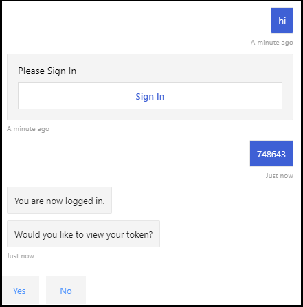

# <a name="add-authentication-to-your-teams-bot"></a>Ajouter l’authentification à votre bot Teams

Il arrive parfois que vous devrez créer des bots dans Microsoft Teams qui peuvent accéder aux ressources pour le compte de l’utilisateur, telles qu’un service de messagerie.

Cet article montre comment utiliser l’authentification SDK Azure Bot Service v4, basée sur OAuth 2.0. Cela facilite le développement d’un bot qui peut utiliser des jetons d’authentification basés sur les informations d’identification de l’utilisateur. L’essentiel de tout cela est l’utilisation de fournisseurs **d’identité**, comme nous le constaterons plus tard.

OAuth 2.0 est une norme ouverte d’authentification et d’autorisation utilisée par Microsoft Azure Active Directory (Azure AD) et de nombreux autres fournisseurs d’identité. Une compréhension de base d’OAuth 2.0 est une condition préalable à l’utilisation de l’authentification dans Teams.

Voir [OAuth 2 Simplifié pour](https://aka.ms/oauth2-simplified) une compréhension de base et [OAuth 2.0](https://oauth.net/2/) pour la spécification complète.

Pour plus d’informations sur la façon dont Azure Bot Service gère l’authentification, consultez [l’authentification utilisateur au sein d’une conversation](https://aka.ms/azure-bot-authentication).

Voici les titres des sections de cet article :

- **Comment créer un bot activé pour l’authentification**. Vous utiliserez [cs-auth-sample][teams-auth-bot-cs] pour gérer les informations d’identification de connexion de l’utilisateur et la génération du jeton d’authentification.
- **Comment déployer le bot sur Azure et l’associer à un fournisseur d’identité**. Le fournisseur émettra un jeton basé sur les informations d’identification de connexion de l’utilisateur. Le bot peut utiliser le jeton pour accéder à des ressources, telles qu’un service de messagerie, qui nécessitent une authentification. Pour plus d’informations, [Microsoft Teams flux d’authentification pour les bots](auth-flow-bot.md).
- **Comment intégrer le bot dans Microsoft Teams**. Une fois le bot intégré, vous pouvez vous inscrire et échanger des messages avec lui dans une conversation.

## <a name="prerequisites"></a>Conditions préalables

- Connaissance des principes [de base du bot][concept-basics], [de la gestion de l’état][concept-state], de la bibliothèque [de][concept-dialogs] boîtes de dialogue et de la façon d’implémenter un [flux de conversation séquentiel][simple-dialog].
- Connaissance du développement Azure et OAuth 2.0.
- Les versions actuelles de Microsoft Visual Studio git.
- Compte Azure. Si nécessaire, vous pouvez créer un [compte gratuit Azure](https://azure.microsoft.com/free/).
- L’exemple suivant :

    | Échantillon | Version de BotBuilder | Demonstrates |
    |:---|:---:|:---|
    | **Authentification de bot** [dans cs-auth-sample][teams-auth-bot-cs] | v4 | Prise en charge d’OAuthCard |
    | **Authentification de bot** [dans js-auth-sample][teams-auth-bot-js] | v4| Prise en charge d’OAuthCard  |
    | **Authentification de bot** [dans py-auth-sample][teams-auth-bot-py] | v4 | Prise en charge d’OAuthCard |

## <a name="create-the-resource-group"></a>Créer le groupe de ressources

Le groupe de ressources et le plan de service ne sont pas strictement nécessaires, mais ils vous permettent de libérer facilement les ressources que vous créez. Il s’agit d’une bonne pratique pour maintenir l’organisation et la gestion de vos ressources.

Vous utilisez un groupe de ressources pour créer des ressources individuelles pour Bot Framework. Pour obtenir des performances, assurez-vous que ces ressources se trouvent dans la même région Azure.

1. Dans votre navigateur, connectez-vous au [**portail Microsoft Azure web**][azure-portal].
1. Dans le panneau de navigation de gauche, sélectionnez **Groupes de ressources**.
1. Dans le coin supérieur gauche de la fenêtre affichée, **sélectionnez Ajouter** un onglet pour créer un groupe de ressources. Vous serez invité à fournir les informations suivantes :
    1. **Abonnement**. Utilisez votre abonnement existant.
    1. **Groupe de ressources**. Entrez le nom du groupe de ressources. Par exemple,  *TeamsResourceGroup*. N’oubliez pas que le nom doit être unique.
    1. Dans le menu **déroulant Région** , sélectionnez *Ouest des* États-Unis ou une région proche de vos applications.
    1. Sélectionnez le **bouton Révision et** créer. Vous devriez voir une bannière qui lit *Validation transmise*.
    1. Sélectionnez **le bouton** Créer. La création du groupe de ressources peut prendre quelques minutes.

> [!TIP]
> Comme pour les ressources que vous créerez plus loin dans ce didacticiel, il est bon d’épingler ce groupe de ressources à votre tableau de bord pour en faciliter l’accès. Si vous le souhaitez, sélectionnez l’icône de broche & #128204; dans le coin supérieur droit du tableau de bord.

## <a name="create-the-service-plan"></a>Créer le plan de service

1. Dans le [**portail Azure**][azure-portal], dans le panneau de navigation de gauche, **sélectionnez Créer une ressource**.
1. Dans la zone de recherche, tapez *Plan de service d’application*. Sélectionnez la carte **Plan du service d’application** dans les résultats de la recherche.
1. Sélectionnez **Créer**.
1. Vous serez invité à fournir les informations suivantes :
    1. **Abonnement**. Vous pouvez utiliser un abonnement existant.
    1. **Groupe de ressources**. Sélectionnez le groupe que vous avez créé précédemment.
    1. **Nom**. Entrez le nom du plan de service. Par exemple,  *TeamsServicePlan*. N’oubliez pas que le nom doit être unique au sein du groupe.
    1. **Système d’exploitation**. *Sélectionnez Windows* ou votre système d’exploitation applicable.
    1. **Région**. *Sélectionnez Ouest des États-Unis* ou une région proche de vos applications.
    1. **Niveau de tarification**. Assurez-vous *que Standard S1* est sélectionné. Cette valeur doit être la valeur par défaut.
    1. Sélectionnez le **bouton Révision et** créer. Vous devriez voir une bannière qui lit *Validation transmise*.
    1. Sélectionnez **Créer**. La création du plan de service d’application peut prendre quelques minutes. Le plan sera répertorié dans le groupe de ressources.

## <a name="create-azure-bot-resource-registration"></a>Créer une inscription de ressource Azure Bot

L’inscription de ressource Azure Bot inscrit votre service web en tant que bot auprès de Bot Framework qui vous fournit un ID d’application Microsoft et un mot de passe d’application (secret client).

> [!IMPORTANT]
> Vous ne devez inscrire votre bot que s’il n’est pas hébergé dans Azure. Si vous [avez créé un bot via](/azure/bot-service/abs-quickstart?view=azure-bot-service-4.0&viewFallbackFrom=azure-bot-service-3.0&preserve-view=true) le portail Azure, il est déjà inscrit auprès du service. Si vous avez créé votre bot via [Bot Framework](https://dev.botframework.com/bots/new) ou [le portail](../../../concepts/build-and-test/teams-developer-portal.md) de développement, votre bot n’est pas inscrit dans Azure.

1. Visitez [**le portail Azure**][azure-portal] et recherchez **Azure Bot** dans **la section Créer une** ressource.
1. Ouvrez **le bot Azure et** sélectionnez **Créer**.
1. Entrez le nom de handle du bot dans **le champ De handle bot** .
1. Sélectionnez **votre abonnement dans** la liste liste.
1. Sélectionnez votre **groupe de ressources** dans la liste liste.
1. **Sélectionnez Type d’application en** **tant qu’ID** **d’application Multi-Client pour Microsoft**.

    

1. Sélectionnez **Examiner et créer**.

    

1. Si la validation réussit, sélectionnez **Créer**.

    La mise en service de votre service de bot prend quelques instants.

    

1. Sélectionnez **Accéder à la ressource**. Le bot et les ressources associées sont répertoriés dans le groupe de ressources.

    

    Votre bot Azure est maintenant créé.

    

Pour créer une secret client :

1. Dans **Paramètres**, sélectionnez **Configuration**. Enregistrez **l’ID de l’application Microsoft** (ID client) pour référence ultérieure.

    

1. Adjacent à **l’ID de l’application Microsoft**, sélectionnez **Gérer**.

    

1. Dans la section **Secrets client** , sélectionnez **Nouvelle secret client**. **Une fenêtre d’ajout d’une secret client** s’affiche.

    

1. Entrez **description,** puis sélectionnez **Ajouter**.

    

1. Dans la **colonne Valeur** , **sélectionnez Copier dans le Presse-papiers** et enregistrez l’ID de la question secrète client pour référence ultérieure.

    

Pour ajouter le Microsoft Teams canal :

1. Go to **Home**.

    

1. Ouvrez votre bot, qui est répertorié dans la section **Ressources récentes** .

1. **Sélectionnez Canaux** dans le volet gauche et **sélectionnez Microsoft Teams** :::image type="icon" source="../../../assets/icons/teams-icon.png" border="false":::.

   :::image type="content" source="../../../assets/images/adaptive-cards/channel-teams.png" alt-text="Canal Teams":::

1. Cochez la case pour accepter les conditions d’utilisation et sélectionnez **Accepter**.</br>

    

1. Sélectionnez **Enregistrer**.

    

Pour plus d’informations, [voir Créer un bot pour Teams](../create-a-bot-for-teams.md).

## <a name="create-the-identity-provider"></a>Créer le fournisseur d’identité

Vous avez besoin d’un fournisseur d’identité qui peut être utilisé pour l’authentification.
Dans cette procédure, vous allez utiliser un fournisseur Azure AD de données ; d’Azure AD fournisseurs d’identité pris en charge peuvent également être utilisés.

1. Dans le [**portail Azure**][azure-portal], dans le panneau de navigation de gauche, **sélectionnez Azure Active Directory**.
    > [!TIP]
    > Vous devez créer et inscrire cette ressource Azure AD dans un client dans lequel vous pouvez consentir à déléguer les autorisations demandées par une application.
    > Pour obtenir des instructions sur la création d’un client, voir [Accéder au portail et créer un client](/azure/active-directory/fundamentals/active-directory-access-create-new-tenant).
1. Dans le panneau gauche, sélectionnez **Inscriptions d’applications**.
1. Dans le panneau droit, sélectionnez **l’onglet** Nouvel enregistrement, dans le coin supérieur gauche.
1. Vous serez invité à fournir les informations suivantes :
   1. **Nom**. Entrez le nom de l’application. Par exemple,  *BotTeamsIdentity*. N’oubliez pas que le nom doit être unique.
   1. Sélectionnez les **types de comptes pris en** charge pour votre application. Sélectionnez les comptes dans n’importe quel répertoire d’organisation *(N’importe quel Microsoft Azure Active Directory (Azure AD) - Multi-client) et les comptes Microsoft personnels (par exemple, Skype, Xbox).*
   1. Pour **l’URI de redirection** :<br/>
       &#x2713;Sélectionnez **Web**. <br/>
       &#x2713; définir l’URL sur `https://token.botframework.com/.auth/web/redirect`.
   1. Sélectionnez **Inscrire**.

1. Une fois créé, Azure affiche la page **Vue d’ensemble** de l’application. Copiez et enregistrez les informations suivantes dans un fichier :

    1. Valeur **de l’ID de l’application (** client). Vous utiliserez cette valeur ultérieurement comme *ID client* lorsque vous enregistrerez cette application d’identité Azure auprès de votre bot.
    1. Valeur **de l’ID** du répertoire (client). Vous utiliserez également cette valeur ultérieurement comme *ID de client* pour inscrire cette application d’identité Azure auprès de votre bot.

1. Dans le panneau gauche, **sélectionnez Certificats & secrets** pour créer une secret client pour votre application.

   1. Sous **Les secrets client**, sélectionnez &#x2795; **Nouvelle secret client**.
   1. Ajoutez une description pour identifier ce secret auprès d’autres personnes que vous devrez peut-être créer pour cette application, telles que l’application d’identité bot *dans Teams*.
   1. La **sélection expire** .
   1. Sélectionnez **Ajouter**.
   1. Avant de quitter cette page, **enregistrez la question secrète**. Vous utiliserez cette valeur comme secret *client* ultérieurement lorsque vous enregistrerez votre application Azure AD votre bot.

### <a name="configure-the-identity-provider-connection-and-register-it-with-the-bot"></a>Configurer la connexion du fournisseur d’identité et l’inscrire auprès du bot

Remarque : il existe deux options pour les fournisseurs de services Microsoft Azure Active Directory (Azure AD) V1 et Microsoft Azure Active Directory (Azure AD) V2.  Les différences entre les deux fournisseurs sont résumées [ici, mais](/azure/active-directory/azuread-dev/azure-ad-endpoint-comparison) en général, V2 offre plus de flexibilité en ce qui concerne la modification des autorisations de bot.  Graph’API sont répertoriées dans le champ d’étendues et, à mesure que de nouvelles autorisations sont ajoutées, les bots permettent aux utilisateurs d’autoriser les nouvelles autorisations à la prochaine connexion.  Pour V1, le consentement du bot doit être supprimé par l’utilisateur pour que de nouvelles autorisations soient invités dans la boîte de dialogue OAuth.

#### <a name="microsoft-azure-active-directory-azure-ad-v1"></a>Microsoft Azure Active Directory (Azure AD) V1

1. Dans le [**portail Azure**][azure-portal], sélectionnez votre groupe de ressources dans le tableau de bord.
1. Sélectionnez le lien d’inscription de votre bot.
1. Ouvrez la page de ressources et **sélectionnez Configuration** **sous Paramètres**.
1. **Sélectionnez Ajouter une connexion OAuth Paramètres**.
L’image suivante affiche la sélection correspondante dans la page de ressources :  

1. Remplissez le formulaire comme suit :

    1. **Nom**. Entrez un nom pour la connexion. Vous utiliserez ce nom dans votre bot dans le `appsettings.json` fichier. Par exemple *BotTeamsAuthADv1*.
    1. **Fournisseur de services**. **Sélectionnez Microsoft Azure Active Directory (Azure AD)**. Une fois cette sélection sélectionnée, les Azure AD spécifiques sont affichés.
    1. **ID client**. Entrez l’ID d’application (client) que vous avez enregistré pour votre application de fournisseur d’identité Azure dans les étapes ci-dessus.
    1. **Secret client**. Entrez le secret que vous avez enregistré pour votre application de fournisseur d’identité Azure dans les étapes ci-dessus.
    1. **Type d’octroi**. Entrez `authorization_code`.
    1. **URL de connexion**. Entrez `https://login.microsoftonline.com`.
    1. **ID de client**, entrez **l’ID** d’annuaire (client) que vous avez enregistré précédemment pour votre  application d’identité Azure ou commun en fonction du type de compte pris en charge sélectionné lors de la création de l’application fournisseur d’identité. Pour déterminer la valeur à attribuer, suivez ces critères :

        - Si vous avez sélectionné les comptes dans cet annuaire d’organisation uniquement *(Microsoft uniquement -* Client unique) ou les comptes dans n’importe quel répertoire d’organisation *(Microsoft Azure Active Directory (Azure AD) - Client multiple),* entrez l’ID de locataire que vous avez enregistré précédemment pour le  application Microsoft Azure Active Directory (Azure AD). Il s’agit du client associé aux utilisateurs qui peuvent être authentifiés.

        - Si vous avez sélectionné des comptes dans un répertoire d’organisation (N’importe quel Microsoft Azure Active Directory (Azure AD) - comptes Microsoft multi-clients et personnels par exemple *, Skype, Xbox, Outlook),* entrez le mot commun au lieu d’un ID  de client. Dans le cas contraire, l Microsoft Azure Active Directory (Azure AD) vérifiera via le client dont l’ID a été sélectionné et exclura les comptes Microsoft personnels.

    h. Pour **l’URL de** la ressource, entrez `https://graph.microsoft.com/`. Cela n’est pas utilisé dans l’exemple de code actuel.  
    i. Laissez **les étendues** vides. L’image suivante est un exemple :

    

1. Sélectionnez **Enregistrer**.

#### <a name="microsoft-azure-active-directory-azure-ad-v2"></a>Microsoft Azure Active Directory (Azure AD) V2

1. Dans le [**portail Azure**][azure-portal], sélectionnez votre bot Azure dans le tableau de bord.
1. Dans la page de ressources, **sélectionnez Configuration** **sous Paramètres**.
1. **Sélectionnez Ajouter une connexion OAuth Paramètres**.  
L’image suivante affiche la sélection correspondante dans la page de ressources : 

1. Remplissez le formulaire comme suit :

    1. **Nom**. Entrez un nom pour la connexion. Vous utiliserez ce nom dans votre bot dans le `appsettings.json` fichier. Par exemple *BotTeamsAuthADv2*.
    1. **Fournisseur de services**. **Sélectionnez Microsoft Azure Active Directory v2**. Une fois cette sélection sélectionnée, les champs Microsoft Azure Active Directory (Azure AD) spécifiques sont affichés.
    1. **ID client**. Entrez l’ID d’application (client) que vous avez enregistré pour votre application de fournisseur d’identité Azure dans les étapes ci-dessus.
    1. **Secret client**. Entrez le secret que vous avez enregistré pour votre application de fournisseur d’identité Azure dans les étapes ci-dessus.
    1. **URL de Exchange jeton**. Laissez ce champ vide.
    1. **ID de client**, entrez **l’ID** d’annuaire (client) que vous avez enregistré précédemment pour votre  application d’identité Azure ou commun en fonction du type de compte pris en charge sélectionné lors de la création de l’application fournisseur d’identité. Pour déterminer la valeur à attribuer, suivez ces critères :

        - Si vous avez sélectionné des comptes dans cet annuaire d’organisation uniquement *(Microsoft uniquement -* Client unique) ou des comptes dans un annuaire d’organisation *(Microsoft Azure Active Directory - Multi-client),* entrez l’ID de locataire que vous avez enregistré précédemment pour l’application Microsoft Azure Active Directory (Azure AD). Il s’agit du client associé aux utilisateurs qui peuvent être authentifiés.

        - Si vous avez sélectionné des comptes dans un répertoire d’organisation (N’importe quel Microsoft Azure Active Directory (Azure AD) - comptes Microsoft multi-clients et personnels par exemple *, Skype, Xbox, Outlook),* entrez le mot commun au lieu d’un ID  de client. Dans le cas contraire, l Microsoft Azure Active Directory (Azure AD) vérifiera via le client dont l’ID a été sélectionné et exclura les comptes Microsoft personnels.

    1. Pour **les étendues**, entrez une liste délimitée par des espaces d’autorisations graphiques que cette application requiert par exemple : User.Read User.ReadBasic.All Mail.Read

1. Sélectionnez **Enregistrer**.

### <a name="test-the-connection"></a>Tester la connexion

1. Sélectionnez l’entrée de connexion pour ouvrir la connexion que vous avez créée.
1. **Sélectionnez Tester la connexion** en haut du panneau **Paramètres de connexion** du fournisseur de services.
1. La première fois que vous le faites, une nouvelle fenêtre de navigateur s’ouvre et vous demande de sélectionner un compte. Sélectionnez celui que vous souhaitez utiliser.
1. Ensuite, vous serez invité à autoriser le fournisseur d’identité à utiliser vos données (informations d’identification). L’image suivante est un exemple :

    

1. Sélectionnez **Accepter**.
1. Vous devez ensuite vous rediriger vers une page **De connexion test \<your-connection-name> à Réussite** . Actualisez la page si vous obtenez une erreur. L’image suivante est un exemple :

    

Le nom de connexion est utilisé par le code du bot pour récupérer les jetons d’authentification de l’utilisateur.

## <a name="prepare-the-bot-sample-code"></a>Préparer l’exemple de code du bot

Une fois les paramètres préliminaires terminés, nous allons nous concentrer sur la création du bot à utiliser dans cet article.

# <a name="cnet"></a>[C#/.NET](#tab/dotnet)

1. [Clonez cs-auth-sample][teams-auth-bot-cs].
1. Lancez Visual Studio.
1. Dans la barre d’outils, **sélectionnez Fichier -> Ouvrir -> Project/Solution** et ouvrez le projet bot.
1. Dans C# update **appsettings.json** comme suit :

    - Définissez `ConnectionName` ce nom sur le nom de la connexion de fournisseur d’identité que vous avez ajoutée à l’inscription du bot. Le nom que nous avons utilisé dans cet exemple *est BotTeamsAuthADv1*.
    - Définissez `MicrosoftAppId` ce dernier sur **l’ID d’application du bot** que vous avez enregistré au moment de l’inscription du bot.
    - Définissez `MicrosoftAppPassword` la secret **client que** vous avez enregistrée au moment de l’inscription du bot.

    En fonction des caractères dans votre secret de bot, vous devrez peut-être éviter le mot de passe au code XML. Par exemple, les andersands (&) doivent être codés comme .`&amp;`

     [!code-json[appsettings](~/../botbuilder-samples/samples/csharp_dotnetcore/46.teams-auth/appsettings.json?range=1-5)]

1. Dans l’Explorateur de solutions, `TeamsAppManifest` accédez au dossier, ouvrez `id` `manifest.json` `botId` et définissez l’ID d’application du **bot** que vous avez enregistré au moment de l’inscription du bot.

# <a name="javascript"></a>[JavaScript](#tab/node-js)

1. Clone [node-auth-sample][teams-auth-bot-js].
1. Dans une console, accédez au projet : </br></br>
`cd samples/javascript_nodejs/46.teams`  
1. Installer des modules</br></br>
`npm install`
1. Mettez à jour **la configuration .env** comme suit :

    - Définissez `MicrosoftAppId` ce dernier sur **l’ID d’application du bot** que vous avez enregistré au moment de l’inscription du bot.
    - Définissez `MicrosoftAppPassword` la secret **client que** vous avez enregistrée au moment de l’inscription du bot.
    - Définissez le `connectionName` nom de la connexion du fournisseur d’identité.
    En fonction des caractères dans votre secret de bot, vous devrez peut-être éviter le mot de passe au code XML. Par exemple, les andersands (&) doivent être codés comme .`&amp;`

     [!code-javascript[settings](~/../botbuilder-samples/samples/javascript_nodejs/46.teams-auth/.env)]

1. Dans le dossier `teamsAppManifest` , ouvrez `manifest.json` et définissez `id`  votre **ID** `botId` d’application Microsoft et **l’ID d’application du bot** que vous avez enregistré au moment de l’inscription du bot.

# <a name="python"></a>[Python](#tab/python)

1. [Clonez py-auth-sample][teams-auth-bot-py] à partir du référentiel github.
1. Mettez à **jour config.py** :

    - Définissez `ConnectionName` ce paramètre sur le nom du paramètre de connexion OAuth que vous avez ajouté à votre bot.
    - Définissez `MicrosoftAppId` et définissez `MicrosoftAppPassword` l’ID d’application et la secret de l’application de votre bot.

      En fonction des caractères dans votre secret de bot, vous devrez peut-être éviter le mot de passe au code XML. Par exemple, les andersands (&) doivent être codés comme .`&amp;`

      [!code-python[config](~/../botbuilder-samples/samples/python/46.teams-auth/config.py?range=14-16)]

---

### <a name="deploy-the-bot-to-azure"></a>Déployer le bot sur Azure

Pour déployer le bot, suivez les étapes de la procédure de déploiement [de votre bot sur Azure](https://aka.ms/azure-bot-deployment-cli).

Vous pouvez également utiliser Visual Studio, vous pouvez suivre les étapes suivantes :

1. Dans *Visual Studio’Explorateur de* solutions, sélectionnez et maintenez (ou cliquez avec le bouton droit) le nom du projet.
1. Dans le menu déroulant, sélectionnez **Publier**.
1. Dans la fenêtre affichée, sélectionnez le **lien** Nouveau.
1. Dans la fenêtre de boîte de dialogue, **sélectionnez Service d’application** sur la gauche et **Créer** à droite.
1. Sélectionnez **le bouton** Publier.
1. Dans la fenêtre de boîte de dialogue suivante, entrez les informations requises. Voici un exemple :

    

1. Sélectionnez **Créer**.
1. Si le déploiement se termine correctement, vous devez le voir dans Visual Studio. En outre, une page s’affiche dans votre navigateur par défaut pour dire *que votre bot est prêt !*. L’URL sera similaire à celle-ci : `https://botteamsauth.azurewebsites.net/` Enregistrez-le dans un fichier.
1. Dans votre navigateur, accédez au [**portail Azure**][azure-portal].
1. Vérifiez votre groupe de ressources, le bot doit être répertorié avec les autres ressources. L’image suivante est un exemple :

    

1. Dans le groupe de ressources, sélectionnez le nom d’inscription du bot (lien).
1. Dans le panneau gauche, sélectionnez **Paramètres**.
1. Dans la **zone Point de terminaison de messagerie** , entrez l’URL obtenue ci-dessus, suivie de `api/messages`. Voici un exemple : `https://botteamsauth.azurewebsites.net/api/messages`.
    > [!NOTE]
    > Un seul point de terminaison de messagerie est autorisé pour un bot
1. Sélectionnez **le bouton** Enregistrer dans le coin supérieur gauche.

## <a name="test-the-bot-using-the-emulator"></a>Testez le bot à l’aide du Emulator

Si vous ne l’avez pas déjà fait, installez [le Microsoft Bot Framework Emulator](https://aka.ms/bot-framework-emulator-readme). Voir aussi [Déboguer avec le Emulator](https://aka.ms/bot-framework-emulator-debug-with-emulator).

Pour que l’exemple de connexion du bot fonctionne, vous devez configurer le Emulator.

### <a name="configure-the-emulator-for-authentication"></a>Configurer le Emulator pour l’authentification

Si un bot nécessite une authentification, vous devez configurer le Emulator. Pour configurer :

1. Démarrez le Emulator.
1. Dans la Emulator, sélectionnez l’icône d’engrenage &#9881; en bas à gauche ou **l’onglet Emulator Paramètres** dans le coin supérieur droit.
1. Cochez la case **en authentification version 1.0**.
1. Entrez le chemin d’accès local à **l’outil ngrok** . *Consultez* le Wiki Bot Framework Emulator/ngrok [d’intégration](https://github.com/Microsoft/BotFramework-Emulator/wiki/Tunneling-(ngrok)) de tunneling. Pour plus d’informations sur l’outil, [voir ngrok](https://ngrok.com/).
1. Cochez la case **par Exécuter ngrok au démarrage Emulator démarrage**.
1. Sélectionnez le bouton **Enregistrer** .

Lorsque le bot affiche une carte de visite et que l’utilisateur sélectionne le bouton de signature, le Emulator ouvre une page que l’utilisateur peut utiliser pour se connecter avec le fournisseur d’authentification.
Une fois que l’utilisateur a fait cela, le fournisseur génère un jeton utilisateur et l’envoie au bot. Après cela, le bot peut agir pour le compte de l’utilisateur.

### <a name="test-the-bot-locally"></a>Tester le bot localement

Une fois que vous avez configuré le mécanisme d’authentification, vous pouvez effectuer le test réel du bot.  

1. Exécutez l’exemple de bot localement sur votre ordinateur, Visual Studio par exemple.
1. Démarrez le Emulator.
1. Sélectionnez **le bouton Ouvrir le bot** .
1. Dans **l’URL du bot**, entrez l’URL locale du bot. Généralement, `http://localhost:3978/api/messages`.
1. Dans **l’ID d’application Microsoft** , entrez l’ID d’application du bot à partir de `appsettings.json`.
1. Dans le **mot de passe de l’application Microsoft** , entrez le mot de passe de l’application du bot à partir du `appsettings.json`.
1. Sélectionnez **Connexion**.
1. Une fois que le bot est en cours d’exécution, entrez du texte pour afficher la carte de signature.
1. Sélectionnez le bouton **Se connecter**.
1. Une boîte de dialogue s’affiche pour confirmer **l’ouverture de l’URL**. Cela permet à l’utilisateur du bot (vous) d’être authentifié.  
1. Sélectionner **Confirmer**.
1. Si vous y êtes invité, sélectionnez le compte de l’utilisateur applicable.
1. Selon la configuration que vous avez utilisée pour le Emulator, vous obtenez l’une des configurations suivantes :
    1. **Utilisation du code de vérification de la signature**  
      &#x2713; fenêtre ouverte affichant le code de validation.  
      &#x2713; copiez et entrez le code de validation dans la zone de conversation pour terminer la signature.
    1. **Utilisation de jetons d’authentification**.  
      &#x2713; vous êtes connecté en fonction de vos informations d’identification.

    L’image suivante est un exemple de l’interface utilisateur du bot après vous être connecté :

    

1. Si vous sélectionnez **Oui** lorsque le bot vous demande Voulez-vous afficher votre jeton *?*, vous recevrez une réponse semblable à la suivante :

    

1. Entrez **la connexion dans** la zone de conversation d’entrée pour vous déconnecter. Cela libère le jeton utilisateur et le bot ne peut pas agir en votre nom tant que vous ne vous connectez pas à nouveau.

> [!NOTE]
> L’authentification du bot nécessite l’utilisation **du service Bot Connector**. Le service accède aux informations d’inscription des bots pour votre bot.

## <a name="test-the-deployed-bot"></a>Tester le bot déployé

<!--There are several testing scenarios here. Ideally, we'd have a separate article on the what, why, 
and when for these, and just reference that from here, along with the set of steps that exercises the bot code.-->

1. Dans votre navigateur, accédez au [**portail Azure**][azure-portal].
1. Recherchez votre groupe de ressources.
1. Sélectionnez le lien de la ressource. La page de ressources s’affiche.
1. Dans la page de ressources, **sélectionnez Tester dans la conversation web**. Le bot démarre et affiche les salutations prédéfinës.
1. Tapez quoi que ce soit dans la zone de conversation.
1. Sélectionnez la **zone Se** connectez.
1. Une boîte de dialogue s’affiche pour confirmer **l’ouverture de l’URL**. Cela permet à l’utilisateur du bot (vous) d’être authentifié.  
1. Sélectionner **Confirmer**.
1. Si vous y êtes invité, sélectionnez le compte de l’utilisateur applicable.
    L’image suivante est un exemple de l’interface utilisateur du bot après vous être connecté :

    .

1. Sélectionnez le **bouton Oui** pour afficher votre jeton d’authentification. L’image suivante est un exemple :

    .

1. Entrez la connexion pour vous déconnecter.

    

> [!NOTE]
> Si vous avez des problèmes de connexion, essayez de tester à nouveau la connexion comme décrit dans les étapes précédentes. Cela pourrait recréer le jeton d’authentification.
> Avec le client De conversation web Bot Framework dans Azure, vous devrez peut-être vous y connecter plusieurs fois avant que l’authentification ne soit établie correctement.

## <a name="install-and-test-the-bot-in-teams"></a>Installer et tester le bot dans Teams

1. Dans votre projet de bot, assurez-vous que le `TeamsAppManifest` dossier contient le `manifest.json` contenu et les `outline.png` fichiers `color.png` .
1. Dans l’Explorateur de solutions, accédez au `TeamsAppManifest` dossier. Modifiez `manifest.json` en attribuant les valeurs suivantes :
    1. Assurez-vous que **l’ID d’application du bot** que vous avez reçu au moment de l’inscription du bot est affecté à `id` et `botId`.
    1. Affectez cette valeur : `validDomains: [ "token.botframework.com" ]`.
1. Sélectionnez **et compresser** `manifest.json`les fichiers et `outline.png`les `color.png` fichiers.
1. Ouvrez **Microsoft Teams**.
1. Dans le panneau gauche, en bas, sélectionnez **l’icône Applications**.
1. Dans le panneau droit, en bas, sélectionnez **Télécharger une application personnalisée**.
1. Accédez au dossier `TeamsAppManifest` et téléchargez le manifeste compressé.
L’Assistant suivant s’affiche :

    

1. Sélectionnez le bouton **Ajouter à une équipe**.
1. Dans la fenêtre suivante, sélectionnez l’équipe dans laquelle vous souhaitez utiliser le bot.
1. Sélectionnez **le bouton Configurer un bot** .
1. Sélectionnez les trois points (&#x25cf;&#x25cf;&#x25cf;) dans le panneau gauche. Sélectionnez ensuite **l’icône App Studio** .
1. Sélectionnez **l’onglet Éditeur de** manifeste. Vous devriez voir l’icône du bot que vous avez téléchargé.
1. En outre, vous devriez être en mesure de voir le bot répertorié en tant que contact dans la liste de conversation que vous pouvez utiliser pour échanger des messages avec le bot.

### <a name="testing-the-bot-locally-in-teams"></a>Test du bot localement dans Teams

Microsoft Teams est un produit entièrement basé sur le cloud, tous les services accessibles doivent être disponibles à partir du cloud à l’aide de points de terminaison HTTPS. Par conséquent, pour permettre au bot (notre exemple) de fonctionner dans Teams, vous devez publier le code dans le cloud de votre choix ou rendre une instance en cours d’exécution localement accessible en externe via un outil **de tunneling**. Nous vous  [recommandons ngrok](https://ngrok.com/download), qui crée une URL adressan externe pour un port que vous ouvrez localement sur votre ordinateur.
Pour configurer ngrok en vue de l’exécution locale de Microsoft Teams’application, suivez les étapes suivantes :

1. Dans une fenêtre terminal, allez dans le répertoire où vous avez `ngrok.exe` installé. Nous vous suggérons de définir *le chemin d’accès de la variable* d’environnement pour qu’il pointe vers celui-ci.
1. Exécuter, par exemple, `ngrok http 3978 --host-header=localhost:3978`. Remplacez le numéro de port selon vos besoins.
Cela lance ngrok pour écouter sur le port que vous spécifiez. En retour, il vous donne une URL adressan externe, valide tant que ngrok est en cours d’exécution. L’image suivante est un exemple :

    .

1. Copiez l’adresse HTTPS de forwarding. Il doit être similaire à ce qui suit : `https://dea822bf.ngrok.io/`
1. Append `/api/messages` pour obtenir `https://dea822bf.ngrok.io/api/messages`. Il s’agit du **point de terminaison des messages** pour le bot s’exécutant localement sur votre ordinateur et accessible sur le web dans une conversation Microsoft Teams.
1. Une dernière étape consiste à mettre à jour le point de terminaison des messages du bot déployé. Dans l’exemple, nous avons déployé le bot dans Azure. Nous allons donc effectuer les étapes suivantes :
    1. Dans votre navigateur, accédez au [**portail Azure**][azure-portal].
    1. Sélectionnez votre **inscription de bot**.
    1. Dans le panneau gauche, sélectionnez **Paramètres**.
    1. Dans le panneau droit, dans **la zone Point** de terminaison de messagerie, entrez l’URL ngrok, dans notre exemple. `https://dea822bf.ngrok.io/api/messages`
1. Démarrez votre bot localement, par exemple en mode Visual Studio débogage.
1. Testez le bot lors de l’exécution locale à l’aide de la **conversation Web test** du portail Bot Framework. Comme le Emulator, ce test ne vous permet pas d’accéder Teams fonctionnalités spécifiques.
1. Dans la fenêtre terminal où s’exécute `ngrok` le trafic HTTP entre le bot et le client de conversation web. Si vous souhaitez une vue plus détaillée, dans une fenêtre de `http://127.0.0.1:4040` navigateur, entrez ce que vous avez obtenu à partir de la fenêtre terminal précédente. L’image suivante est un exemple :

    .

> [!NOTE]
> Si vous arrêtez et redémarrez ngrok, l’URL change. Pour utiliser ngrok dans votre projet et en fonction des fonctionnalités que vous utilisez, vous devez mettre à jour toutes les références d’URL.

## <a name="additional-information"></a>Informations supplémentaires

### <a name="teamsappmanifestmanifestjson"></a>TeamsAppManifest/manifest.json

Ce manifeste contient les informations requises par Microsoft Teams pour se connecter au bot :  

```json
{
  "$schema": "https://developer.microsoft.com/json-schemas/teams/v1.8/MicrosoftTeams.schema.json",
  "manifestVersion": "1.5",
  "version": "1.0.0",
  "id": "",
  "packageName": "com.teams.auth.bot",
  "developer": {
    "name": "TeamsBotAuth",
    "websiteUrl": "https://www.microsoft.com",
    "privacyUrl": "https://www.teams.com/privacy",
    "termsOfUseUrl": "https://www.teams.com/termsofuse"
  },
  "icons": {
    "color": "color.png",
    "outline": "outline.png"
  },
  "name": {
    "short": "TeamsBotAuth",
    "full": "Teams Bot Authentication"
  },
  "description": {
    "short": "TeamsBotAuth",
    "full": "Teams Bot Authentication"
  },
  "accentColor": "#FFFFFF",
  "bots": [
    {
      "botId": "",
      "scopes": [
        "groupchat",
        "team"
      ],
      "supportsFiles": false,
      "isNotificationOnly": false
    }
  ],
  "permissions": [
    "identity",
    "messageTeamMembers"
  ],
  "validDomains": [ "token.botframework.com" ]
}
```

Avec l’authentification, Teams se comporte légèrement différemment des autres canaux, comme expliqué ci-dessous.

### <a name="handling-invoke-activity"></a>Gestion de l’activité d’appel

Une **activité d’appel** est envoyée au bot au lieu de l’activité d’événement utilisée par d’autres canaux.
Cette action est effectuée en sous-classant **l’ActivityHandler**.

# <a name="cnet"></a>[C#/.NET](#tab/dotnet-sample)

**Bots/DialogBot.cs**

[!code-csharp[ActivityHandler](~/../botbuilder-samples/samples/csharp_dotnetcore/46.teams-auth/Bots/DialogBot.cs?range=19-51)]

**Bots/TeamsBot.cs**

*L’activité d’appel* doit être transmis à la boîte de dialogue si **le OAuthPrompt** est utilisé.

[!code-csharp[ActivityHandler](~/../botbuilder-samples/samples/csharp_dotnetcore/46.teams-auth/Bots/TeamsBot.cs?range=34-42)]

#### <a name="teamsactivityhandlercs"></a>TeamsActivityHandler.cs

```csharp

protected virtual Task OnInvokeActivityAsync(ITurnContext<IInvokeActivity> turnContext, CancellationToken cancellationToken)
{
    switch (turnContext.Activity.Name)
    {
        case "signin/verifyState":
            return OnSigninVerifyStateAsync(turnContext, cancellationToken);

        default:
            return Task.CompletedTask;
    }
}

protected virtual Task OnSigninVerifyStateAsync(ITurnContext<IInvokeActivity> turnContext, CancellationToken cancellationToken)
{
    return Task.CompletedTask;
}
```

# <a name="javascript"></a>[JavaScript](#tab/node-js-dialog-sample)

**bots/dialogBot.js**

[!code-javascript[ActivityHandler](~/../botbuilder-samples/samples/javascript_nodejs/46.teams-auth/bots/dialogBot.js?range=4-46)]

**bots/teamsBot.js**

*L’activité d’appel* doit être transmis à la boîte de dialogue si **le OAuthPrompt** est utilisé.

[!code-javascript[ActivityHandler](~/../botbuilder-samples/samples/javascript_nodejs/46.teams-auth/bots/teamsBot.js?range=4-33)]

**dialogs/mainDialog.js**

Dans une étape de boîte de dialogue, `beginDialog` utilisez pour démarrer l’invite OAuth, qui demande à l’utilisateur de se connecter.

- Si l’utilisateur est déjà signé, cela génère un événement de réponse de jeton, sans que l’utilisateur soit invité à le faire.
- Sinon, cela invite l’utilisateur à se connecter. Le service de bot Azure envoie l’événement de réponse au jeton une fois que l’utilisateur tente de se connecter.

[!code-javascript[AddOAuthPrompt](~/../botbuilder-samples/samples/javascript_nodejs/46.teams-auth/dialogs/mainDialog.js?range=50-52)]

Dans l’étape de boîte de dialogue suivante, vérifiez la présence d’un jeton dans le résultat de l’étape précédente. S’il n’est pas null, l’utilisateur s’est correctement inscrit.

[!code-javascript[AddOAuthPrompt](~/../botbuilder-samples/samples/javascript_nodejs/46.teams-auth/dialogs/mainDialog.js?range=50-64)]

**bots/logoutDialog.js**

[!code-javascript[allow-logout](~/../botbuilder-samples/samples/javascript_nodejs/46.teams-auth/dialogs/logoutDialog.js?range=31-42&highlight=7)]

# <a name="python"></a>[Python](#tab/python-sample)

**bots/dialog_bot.py**

[!code-python[ActivityHandler](~/../botbuilder-samples/samples/python/46.teams-auth/bots/dialog_bot.py?range=10-42)]

**bots/teams_bot.py**

*L’activité d’appel* doit être transmis à la boîte de dialogue si **le OAuthPrompt** est utilisé.

[!code-python[on_token_response_event](~/../botbuilder-samples/samples/python/46.teams-auth/bots/teams_bot.py?range=38-45)]

**dialogs/main_dialog.py**

Dans une étape de boîte de dialogue, `begin_dialog` utilisez pour démarrer l’invite OAuth, qui demande à l’utilisateur de se connecter.

- Si l’utilisateur est déjà signé, cela génère un événement de réponse de jeton, sans que l’utilisateur soit invité à le faire.
- Sinon, cela invite l’utilisateur à se connecter. Le service de bot Azure envoie l’événement de réponse au jeton une fois que l’utilisateur tente de se connecter.

[!code-python[Add OAuthPrompt](~/../botbuilder-samples/samples/python/46.teams-auth/dialogs/main_dialog.py?range=48-49)]

Dans l’étape de boîte de dialogue suivante, vérifiez la présence d’un jeton dans le résultat de l’étape précédente. S’il n’est pas null, l’utilisateur s’est correctement inscrit.

[!code-python[Add OAuthPrompt](~/../botbuilder-samples/samples/python/46.teams-auth/dialogs/main_dialog.py?range=51-61)]

**dialogs/logout_dialog.py**

[!code-python[allow logout](~/../botbuilder-samples/samples/python/46.teams-auth/dialogs/logout_dialog.py?range=29-36&highlight=6)]

---

## <a name="see-also"></a>Voir aussi

[Ajouter l’authentification via Azure Bot Service](https://aka.ms/azure-bot-add-authentication)

<!-- Footnote-style links -->

[azure-portal]: https://ms.portal.azure.com

[concept-basics]: /azure/bot-service/bot-builder-basics?view=azure-bot-service-4.0&preserve-view=true
[concept-state]: /azure/bot-service/bot-builder-concept-state?view=azure-bot-service-4.0&preserve-view=true
[concept-dialogs]: /azure/bot-service/bot-builder-concept-dialog?view=azure-bot-service-4.0&preserve-view=true
[simple-dialog]: /azure/bot-service/bot-builder-dialog-manage-conversation-flow?view=azure-bot-service-4.0&preserve-view=true

[teams-auth-bot-cs]: https://github.com/microsoft/BotBuilder-Samples/tree/master/samples/csharp_dotnetcore/46.teams-auth

[teams-auth-bot-py]: https://github.com/microsoft/BotBuilder-Samples/tree/master/samples/python/46.teams-auth

[teams-auth-bot-js]: https://github.com/microsoft/BotBuilder-Samples/tree/master/samples/javascript_nodejs/46.teams-auth

[azure-aad-blade]: https://ms.portal.azure.com/#blade/Microsoft_AAD_IAM/ActiveDirectoryMenuBlade/Overview
[aad-registration-blade]: https://ms.portal.azure.com/#blade/Microsoft_AAD_IAM/ActiveDirectoryMenuBlade/RegisteredAppsPreview
