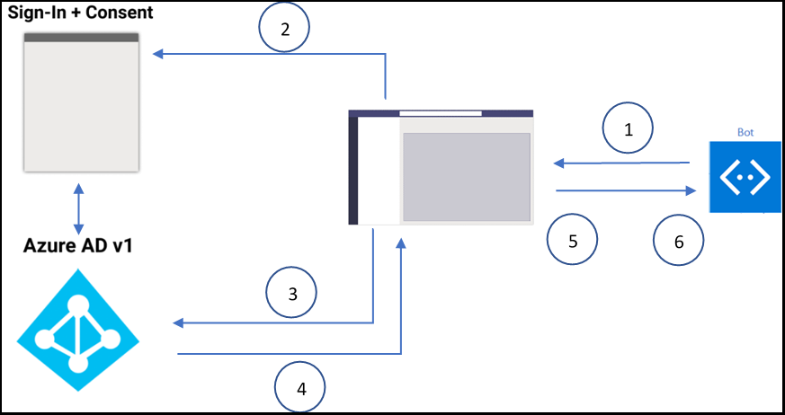

# <a name="single-sign-on-sso-support-for-bots"></a><span data-ttu-id="220d2-105">Prise en charge de l' sign-on unique (SSO) pour les bots</span><span class="sxs-lookup"><span data-stu-id="220d2-105">Single sign-on (SSO) support for bots</span></span>

<span data-ttu-id="220d2-106">L’authentification unique dans Azure Active Directory (AAD) réduit le nombre de fois que les utilisateurs doivent entrer leurs informations d’identification de connexion en actualisation silencieuse du jeton d’authentification.</span><span class="sxs-lookup"><span data-stu-id="220d2-106">Single sign-on authentication in Azure Active Directory (AAD) minimizes the number of times users need to enter their sign in credentials by silently refreshing the authentication token.</span></span> <span data-ttu-id="220d2-107">Si les utilisateurs acceptent d’utiliser votre application, ils n’ont pas besoin de donner à nouveau leur consentement sur un autre appareil et peuvent se connecter automatiquement.</span><span class="sxs-lookup"><span data-stu-id="220d2-107">If users agree to use your app, they need not provide consent again on another device and can sign in automatically.</span></span> <span data-ttu-id="220d2-108">Le flux est similaire à celui de la prise en charge de l’oD [DSO](../../../tabs/how-to/authentication/auth-aad-sso.md)de l’onglet Microsoft Teams. Toutefois, la différence est dans le protocole pour la façon dont un [bot](#request-a-bot-token) demande des jetons et reçoit [des réponses.](#receive-the-bot-token)</span><span class="sxs-lookup"><span data-stu-id="220d2-108">The flow is similar to that of [Microsoft Teams tab SSO support](../../../tabs/how-to/authentication/auth-aad-sso.md), however, the difference is in the protocol for how a bot [requests tokens](#request-a-bot-token) and [receives responses](#receive-the-bot-token).</span></span>

>[!NOTE]
> <span data-ttu-id="220d2-109">OAuth 2.0 est une norme ouverte d’authentification et d’autorisation utilisée par AAD et de nombreux autres fournisseurs d’identité.</span><span class="sxs-lookup"><span data-stu-id="220d2-109">OAuth 2.0 is an open standard for authentication and authorization used by AAD and many other identity providers.</span></span> <span data-ttu-id="220d2-110">Une compréhension de base d’OAuth 2.0 est une condition préalable à l’utilisation de l’authentification dans Teams.</span><span class="sxs-lookup"><span data-stu-id="220d2-110">A basic understanding of OAuth 2.0 is a prerequisite for working with authentication in Teams.</span></span>

## <a name="bot-sso-at-runtime"></a><span data-ttu-id="220d2-111">SO du bot lors de l’runtime</span><span class="sxs-lookup"><span data-stu-id="220d2-111">Bot SSO at runtime</span></span>



<span data-ttu-id="220d2-113">Pour obtenir l’authentification et les jetons d’application bot, complétez les étapes suivantes :</span><span class="sxs-lookup"><span data-stu-id="220d2-113">Complete the following steps to get authentication and bot application tokens:</span></span>

1. <span data-ttu-id="220d2-114">Le bot envoie un message avec un OAuthCard qui contient la `tokenExchangeResource` propriété.</span><span class="sxs-lookup"><span data-stu-id="220d2-114">The bot sends a message with an OAuthCard that contains the `tokenExchangeResource` property.</span></span> <span data-ttu-id="220d2-115">Il indique à Teams d’obtenir un jeton d’authentification pour l’application bot.</span><span class="sxs-lookup"><span data-stu-id="220d2-115">It tells Teams to obtain an authentication token for the bot application.</span></span> <span data-ttu-id="220d2-116">L’utilisateur reçoit des messages à tous les points de terminaison de l’utilisateur actif.</span><span class="sxs-lookup"><span data-stu-id="220d2-116">The user receives messages at all the active user endpoints.</span></span>

    > [!NOTE]
    >* <span data-ttu-id="220d2-117">Un utilisateur peut avoir plusieurs points de terminaison actifs à la fois.</span><span class="sxs-lookup"><span data-stu-id="220d2-117">A user can have more than one active endpoint at a time.</span></span>
    >* <span data-ttu-id="220d2-118">Le jeton bot est reçu de chaque point de terminaison utilisateur actif.</span><span class="sxs-lookup"><span data-stu-id="220d2-118">The bot token is received from every active user endpoint.</span></span>
    >* <span data-ttu-id="220d2-119">L’application doit être installée dans l’étendue personnelle pour la prise en charge de l' cesso.</span><span class="sxs-lookup"><span data-stu-id="220d2-119">The app must be installed in personal scope for SSO support.</span></span>

2. <span data-ttu-id="220d2-120">Si l’utilisateur actuel utilise votre application bot pour la première fois, une invite de demande s’affiche demandant à l’utilisateur d’appliquer l’une des procédures suivantes :</span><span class="sxs-lookup"><span data-stu-id="220d2-120">If the current user is using your bot application for the first time, a request prompt appears requesting the user to do one of the following:</span></span>
    * <span data-ttu-id="220d2-121">Fournir le consentement, si nécessaire.</span><span class="sxs-lookup"><span data-stu-id="220d2-121">Provide consent, if required.</span></span>
    * <span data-ttu-id="220d2-122">Gérer l’authentification par étapes, telle que l’authentification à deux facteurs.</span><span class="sxs-lookup"><span data-stu-id="220d2-122">Handle step-up authentication, such as two-factor authentication.</span></span>

3. <span data-ttu-id="220d2-123">Teams demande le jeton d’application bot au point de terminaison AAD pour l’utilisateur actuel.</span><span class="sxs-lookup"><span data-stu-id="220d2-123">Teams requests the bot application token from the AAD endpoint for the current user.</span></span>

4. <span data-ttu-id="220d2-124">AAD envoie le jeton d’application bot à l’application Teams.</span><span class="sxs-lookup"><span data-stu-id="220d2-124">AAD sends the bot application token to the Teams application.</span></span>

5. <span data-ttu-id="220d2-125">Teams envoie le jeton au bot dans le cadre de l’objet de valeur renvoyé par l’activité d’appel avec le nom **sign-in/tokenExchange**.</span><span class="sxs-lookup"><span data-stu-id="220d2-125">Teams sends the token to the bot as part of the value object returned by the invoke activity with the name **sign-in/tokenExchange**.</span></span>
  
6. <span data-ttu-id="220d2-126">Le jeton de l’application bot fournit les informations requises, telles que l’adresse e-mail de l’utilisateur.</span><span class="sxs-lookup"><span data-stu-id="220d2-126">The parsed token in the bot application provides the required information, such as the user's email address.</span></span>
  
## <a name="develop-an-sso-teams-bot"></a><span data-ttu-id="220d2-127">Développer un bot sso teams</span><span class="sxs-lookup"><span data-stu-id="220d2-127">Develop an SSO Teams bot</span></span>
  
<span data-ttu-id="220d2-128">Pour développer un bot SSO Teams, complétez les étapes suivantes :</span><span class="sxs-lookup"><span data-stu-id="220d2-128">Complete the following steps to develop an SSO Teams bot:</span></span>

1. <span data-ttu-id="220d2-129">[Inscrivez votre application via le portail AAD.](#register-your-app-through-the-aad-portal)</span><span class="sxs-lookup"><span data-stu-id="220d2-129">[Register your app through the AAD portal](#register-your-app-through-the-aad-portal).</span></span>
2. <span data-ttu-id="220d2-130">[Mettez à jour le manifeste de votre application Teams pour votre bot.](#update-your-teams-application-manifest-for-your-bot)</span><span class="sxs-lookup"><span data-stu-id="220d2-130">[Update your Teams application manifest for your bot](#update-your-teams-application-manifest-for-your-bot).</span></span>
3. <span data-ttu-id="220d2-131">[Ajoutez le code pour demander et recevoir un jeton de bot.](#add-the-code-to-request-and-receive-a-bot-token)</span><span class="sxs-lookup"><span data-stu-id="220d2-131">[Add the code to request and receive a bot token](#add-the-code-to-request-and-receive-a-bot-token).</span></span>

### <a name="register-your-app-through-the-aad-portal"></a><span data-ttu-id="220d2-132">Inscrire votre application via le portail AAD</span><span class="sxs-lookup"><span data-stu-id="220d2-132">Register your app through the AAD portal</span></span>

<span data-ttu-id="220d2-133">Les étapes d’inscription de votre application via le portail AAD sont similaires au flux d' utilisateur unique [de l’onglet.](../../../tabs/how-to/authentication/auth-aad-sso.md)</span><span class="sxs-lookup"><span data-stu-id="220d2-133">The steps to register your app through the AAD portal are similar to the [tab SSO flow](../../../tabs/how-to/authentication/auth-aad-sso.md).</span></span> <span data-ttu-id="220d2-134">Pour inscrire votre application, complétez les étapes suivantes :</span><span class="sxs-lookup"><span data-stu-id="220d2-134">Complete the following steps to register your app:</span></span>

1. <span data-ttu-id="220d2-135">Inscrivez une nouvelle application dans [le portail Azure Active Directory – Inscriptions des](https://go.microsoft.com/fwlink/?linkid=2083908) applications.</span><span class="sxs-lookup"><span data-stu-id="220d2-135">Register a new application in the [Azure Active Directory – App Registrations](https://go.microsoft.com/fwlink/?linkid=2083908) portal.</span></span>
2. <span data-ttu-id="220d2-136">Sélectionnez **Nouvelle inscription.**</span><span class="sxs-lookup"><span data-stu-id="220d2-136">Select **New Registration**.</span></span> <span data-ttu-id="220d2-137">La page **Inscrire une application** s’affiche.</span><span class="sxs-lookup"><span data-stu-id="220d2-137">The **Register an application** page appears.</span></span>
3. <span data-ttu-id="220d2-138">Dans la page **Inscrire une application,** entrez les valeurs suivantes :</span><span class="sxs-lookup"><span data-stu-id="220d2-138">In the **Register an application** page, enter the following values:</span></span>
    1. <span data-ttu-id="220d2-139">Entrez un **nom** pour votre application.</span><span class="sxs-lookup"><span data-stu-id="220d2-139">Enter a **Name** for your app.</span></span>
    2. <span data-ttu-id="220d2-140">Choisissez les **types de comptes pris en** charge, sélectionnez le type de compte client unique ou multi-locataire.</span><span class="sxs-lookup"><span data-stu-id="220d2-140">Choose the **Supported account types**, select single tenant or multitenant account type.</span></span>

        > [!NOTE]
        >
        > <span data-ttu-id="220d2-141">Les utilisateurs ne sont pas invités à donner leur consentement et se voir accorder des jetons d’accès immédiatement, si l’application AAD est inscrite dans le même client où ils font une demande d’authentification dans Teams.</span><span class="sxs-lookup"><span data-stu-id="220d2-141">The users are not asked for consent and are granted access tokens right away, if the AAD app is registered in the same tenant where they are making an authentication request in Teams.</span></span> <span data-ttu-id="220d2-142">Toutefois, les utilisateurs doivent donner leur consentement aux autorisations, si l’application AAD est inscrite dans un autre client.</span><span class="sxs-lookup"><span data-stu-id="220d2-142">However, the users must provide consent to the permissions, if the AAD app is registered in a different tenant.</span></span>

    3. <span data-ttu-id="220d2-143">Choisissez **Inscrire**.</span><span class="sxs-lookup"><span data-stu-id="220d2-143">Choose **Register**.</span></span>
4. <span data-ttu-id="220d2-144">Dans la page vue d’ensemble, copiez et enregistrez **l’ID de l’application (client).**</span><span class="sxs-lookup"><span data-stu-id="220d2-144">On the overview page, copy and save the **Application (client) ID**.</span></span> <span data-ttu-id="220d2-145">Vous en aurez besoin ultérieurement lors de la mise à jour du manifeste de votre application Teams.</span><span class="sxs-lookup"><span data-stu-id="220d2-145">You need it later when updating your Teams application manifest.</span></span>
5. <span data-ttu-id="220d2-146">Sélectionnez **Exposer une API** sous **Gérer**.</span><span class="sxs-lookup"><span data-stu-id="220d2-146">Under **Manage**, select **Expose an API**.</span></span> 

   > [!IMPORTANT]
    > * <span data-ttu-id="220d2-147">Si vous construisez un bot autonome, entrez l’URI d’ID d’application sous le nom `api://botid-{YourBotId}` .</span><span class="sxs-lookup"><span data-stu-id="220d2-147">If you are building a standalone bot, enter the Application ID URI as `api://botid-{YourBotId}`.</span></span> <span data-ttu-id="220d2-148">Ici, **YourBotId est** votre ID d’application AAD.</span><span class="sxs-lookup"><span data-stu-id="220d2-148">Here **YourBotId** is your AAD application ID.</span></span>
    > * <span data-ttu-id="220d2-149">Si vous construisez une application avec un bot et un onglet, entrez l’URI d’ID d’application sous le nom `api://fully-qualified-domain-name.com/botid-{YourBotId}` .</span><span class="sxs-lookup"><span data-stu-id="220d2-149">If you are building an app with a bot and a tab, enter the Application ID URI as `api://fully-qualified-domain-name.com/botid-{YourBotId}`.</span></span>

5. <span data-ttu-id="220d2-150">Sélectionnez les autorisations dont votre application a besoin pour le point de terminaison AAD et, éventuellement, pour Microsoft Graph.</span><span class="sxs-lookup"><span data-stu-id="220d2-150">Select the permissions that your application needs for the AAD endpoint and, optionally, for Microsoft Graph.</span></span>
6. <span data-ttu-id="220d2-151">[Accorder des autorisations](/azure/active-directory/develop/v2-permissions-and-consent) pour les applications de bureau, web et mobiles Teams.</span><span class="sxs-lookup"><span data-stu-id="220d2-151">[Grant permissions](/azure/active-directory/develop/v2-permissions-and-consent) for Teams desktop, web, and mobile applications.</span></span>
7. <span data-ttu-id="220d2-152">Sélectionnez **Ajouter une étendue**.</span><span class="sxs-lookup"><span data-stu-id="220d2-152">Select **Add a scope**.</span></span>
8. <span data-ttu-id="220d2-153">Dans le panneau qui s’ouvre, ajoutez une application cliente en entrant `access_as_user` le nom de **l’étendue.**</span><span class="sxs-lookup"><span data-stu-id="220d2-153">In the panel that opens, add a client app by entering `access_as_user` as the **Scope name**.</span></span>

    >[!NOTE]
    > <span data-ttu-id="220d2-154">L’étendue « access_as_user » utilisée pour ajouter une application cliente est pour « Administrateurs et utilisateurs ».</span><span class="sxs-lookup"><span data-stu-id="220d2-154">The "access_as_user" scope used to add a client app is for "Administrators and users".</span></span>
    >
    > <span data-ttu-id="220d2-155">Vous devez connaître les restrictions importantes suivantes :</span><span class="sxs-lookup"><span data-stu-id="220d2-155">You must be aware of the following important restrictions:</span></span>
    >
    > * <span data-ttu-id="220d2-156">Seules les autorisations de l’API Microsoft Graph au niveau de l’utilisateur, telles que la messagerie, le profil, offline_access et OpenId, sont pris en charge.</span><span class="sxs-lookup"><span data-stu-id="220d2-156">Only user-level Microsoft Graph API permissions, such as email, profile, offline_access, and OpenId are supported.</span></span> <span data-ttu-id="220d2-157">Si vous avez besoin d’accéder à d’autres étendues Microsoft Graph, telles que ou , voir `User.Read` `Mail.Read` la solution de [contournement recommandée.](../../../tabs/how-to/authentication/auth-aad-sso.md#apps-that-require-additional-graph-scopes)</span><span class="sxs-lookup"><span data-stu-id="220d2-157">If you need access to other Microsoft Graph scopes, such as `User.Read` or `Mail.Read`, see [recommended workaround](../../../tabs/how-to/authentication/auth-aad-sso.md#apps-that-require-additional-graph-scopes).</span></span>
    > * <span data-ttu-id="220d2-158">Le nom de domaine de votre application doit être identique au nom de domaine que vous avez enregistré pour votre application AAD.</span><span class="sxs-lookup"><span data-stu-id="220d2-158">Your application's domain name must be same as the domain name that you have registered for your AAD application.</span></span>
    > * <span data-ttu-id="220d2-159">Plusieurs domaines par application ne sont actuellement pas pris en charge.</span><span class="sxs-lookup"><span data-stu-id="220d2-159">Multiple domains per app are currently not supported.</span></span>
    > * <span data-ttu-id="220d2-160">Les applications qui utilisent le domaine ne sont pas pris en charge `azurewebsites.net` car elles sont courantes et peuvent être un risque pour la sécurité.</span><span class="sxs-lookup"><span data-stu-id="220d2-160">Applications that use the `azurewebsites.net` domain are not supported because it is common and may be a security risk.</span></span>

#### <a name="update-the-azure-portal-with-the-oauth-connection"></a><span data-ttu-id="220d2-161">Mettre à jour le portail Azure avec la connexion OAuth</span><span class="sxs-lookup"><span data-stu-id="220d2-161">Update the Azure portal with the OAuth connection</span></span>

<span data-ttu-id="220d2-162">Pour mettre à jour le portail Azure avec la connexion OAuth, effectuer les étapes suivantes :</span><span class="sxs-lookup"><span data-stu-id="220d2-162">Complete the following steps to update the Azure portal with the OAuth connection:</span></span>

1. <span data-ttu-id="220d2-163">Dans le portail Azure, accédez aux inscriptions **d’applications.**</span><span class="sxs-lookup"><span data-stu-id="220d2-163">In the Azure Portal, navigate to **App registrations**.</span></span>

2. <span data-ttu-id="220d2-164">Go to **API Permissions**.</span><span class="sxs-lookup"><span data-stu-id="220d2-164">Go to **API Permissions**.</span></span> <span data-ttu-id="220d2-165">Sélectionnez **Ajouter une autorisation Autorisation**  >  déléguée Microsoft **Graph,** puis ajoutez les autorisations suivantes à partir de  >  l’API Microsoft Graph :</span><span class="sxs-lookup"><span data-stu-id="220d2-165">Select **Add a permission** > **Microsoft Graph** > **Delegated permissions**, then add the following permissions from Microsoft Graph API:</span></span>
    * <span data-ttu-id="220d2-166">User.Read (activé par défaut)</span><span class="sxs-lookup"><span data-stu-id="220d2-166">User.Read (enabled by default)</span></span>
    * <span data-ttu-id="220d2-167">email</span><span class="sxs-lookup"><span data-stu-id="220d2-167">email</span></span>
    * <span data-ttu-id="220d2-168">offline_access</span><span class="sxs-lookup"><span data-stu-id="220d2-168">offline_access</span></span>
    * <span data-ttu-id="220d2-169">OpenId</span><span class="sxs-lookup"><span data-stu-id="220d2-169">OpenId</span></span>
    * <span data-ttu-id="220d2-170">profil</span><span class="sxs-lookup"><span data-stu-id="220d2-170">profile</span></span>

3. <span data-ttu-id="220d2-171">Dans le portail Azure, accédez à **Enregistrement des canaux bots.**</span><span class="sxs-lookup"><span data-stu-id="220d2-171">In the Azure Portal, navigate to **Bot Channels Registration**.</span></span>

4. <span data-ttu-id="220d2-172">Sélectionnez **Paramètres** dans le volet gauche et **sélectionnez Ajouter** un paramètre dans la section Paramètres de connexion **OAuth.**</span><span class="sxs-lookup"><span data-stu-id="220d2-172">Select **Settings** on the left pane and choose **Add Setting** under the **OAuth Connection Settings** section.</span></span>

    

5. <span data-ttu-id="220d2-174">Pour remplir le formulaire Nouveau paramètre de connexion, effectuez les étapes **suivantes** :</span><span class="sxs-lookup"><span data-stu-id="220d2-174">Perform the following steps to complete the **New Connection Setting** form:</span></span>

    >[!NOTE]
    > <span data-ttu-id="220d2-175">**L’octroi** implicite peut être requis dans l’application AAD.</span><span class="sxs-lookup"><span data-stu-id="220d2-175">**Implicit grant** may be required in the AAD application.</span></span>

    1. <span data-ttu-id="220d2-176">Entrez un **nom dans** la page Nouveau paramètre **de connexion.**</span><span class="sxs-lookup"><span data-stu-id="220d2-176">Enter a **Name** in the **New Connection Setting** page.</span></span> <span data-ttu-id="220d2-177">Il s’agit du nom qui est référent dans les paramètres de votre code de service de bot à l’étape *5* de l' sso bot lors [de l’utilisation.](#bot-sso-at-runtime)</span><span class="sxs-lookup"><span data-stu-id="220d2-177">This is the name that is referred to inside the settings of your bot service code in *step 5* of [Bot SSO at runtime](#bot-sso-at-runtime).</span></span>
    2. <span data-ttu-id="220d2-178">Dans la **drop-down Fournisseur** de services, sélectionnez Azure **Active Directory v2**.</span><span class="sxs-lookup"><span data-stu-id="220d2-178">From the **Service Provider** drop-down, select **Azure Active Directory v2**.</span></span>
    3. <span data-ttu-id="220d2-179">Entrez les informations d’identification du client, telles que **l’ID client** et la **secret client** pour l’application AAD.</span><span class="sxs-lookup"><span data-stu-id="220d2-179">Enter the client credentials, such as **Client id** and **Client secret** for the AAD application.</span></span>
    4. <span data-ttu-id="220d2-180">Pour **l’URL d’Exchange** de jeton, utilisez la valeur d’étendue définie dans mettre à jour le manifeste de votre [application Teams pour votre bot.](#update-your-teams-application-manifest-for-your-bot)</span><span class="sxs-lookup"><span data-stu-id="220d2-180">For the **Token Exchange URL**, use the scope value defined in [Update your Teams application manifest for your bot](#update-your-teams-application-manifest-for-your-bot).</span></span> <span data-ttu-id="220d2-181">L’URL d’Exchange de jeton indique au SDK que cette application AAD est configurée pour l' cesso.</span><span class="sxs-lookup"><span data-stu-id="220d2-181">The Token Exchange URL indicates to the SDK that this AAD application is configured for SSO.</span></span>
    5. <span data-ttu-id="220d2-182">Dans la **zone ID client,** entrez *commun*.</span><span class="sxs-lookup"><span data-stu-id="220d2-182">In the **Tenant ID** box, enter *common*.</span></span>
    6. <span data-ttu-id="220d2-183">Ajoutez toutes les **étendues configurées** lors de la spécification d’autorisations pour les API en aval pour votre application AAD.</span><span class="sxs-lookup"><span data-stu-id="220d2-183">Add all the **Scopes** configured when specifying permissions to downstream APIs for your AAD application.</span></span> <span data-ttu-id="220d2-184">Avec l’ID client et la secret client fournis, le magasin de jetons échange le jeton contre un jeton graphique avec des autorisations définies.</span><span class="sxs-lookup"><span data-stu-id="220d2-184">With the Client id and Client secret provided, the token store exchanges the token for a graph token with defined permissions.</span></span>
    7. <span data-ttu-id="220d2-185">Sélectionnez **Enregistrer**.</span><span class="sxs-lookup"><span data-stu-id="220d2-185">Select **Save**.</span></span>

    

### <a name="update-your-teams-application-manifest-for-your-bot"></a><span data-ttu-id="220d2-187">Mettre à jour le manifeste de votre application Teams pour votre bot</span><span class="sxs-lookup"><span data-stu-id="220d2-187">Update your Teams application manifest for your bot</span></span>

<span data-ttu-id="220d2-188">Si l’application contient un bot autonome, utilisez le code suivant pour ajouter de nouvelles propriétés au manifeste de l’application Teams :</span><span class="sxs-lookup"><span data-stu-id="220d2-188">If the application contains a standalone bot, then use the following code to add new properties to the Teams application manifest:</span></span>

```json
    "webApplicationInfo": 
        {
            "id": "00000000-0000-0000-0000-000000000000",
            "resource": "api://botid-00000000-0000-0000-0000-000000000000"
        }
```
<span data-ttu-id="220d2-189">Si l’application contient un bot et un onglet, utilisez le code suivant pour ajouter de nouvelles propriétés au manifeste de l’application Teams :</span><span class="sxs-lookup"><span data-stu-id="220d2-189">If the application contains a bot and a tab, then use the following code to add new properties to the Teams application manifest:</span></span>

```json
    "webApplicationInfo": 
        {
            "id": "00000000-0000-0000-0000-000000000000",
            "resource": "api://subdomain.example.com/botid-00000000-0000-0000-0000-000000000000"
        }
```

<span data-ttu-id="220d2-190">**webApplicationInfo** est le parent des éléments suivants :</span><span class="sxs-lookup"><span data-stu-id="220d2-190">**webApplicationInfo** is the parent of the following elements:</span></span>

* <span data-ttu-id="220d2-191">**id** : ID client de l’application.</span><span class="sxs-lookup"><span data-stu-id="220d2-191">**id** - The client ID of the application.</span></span> <span data-ttu-id="220d2-192">Il s’agit de l’ID d’application que vous avez obtenu dans le cadre de l’inscription de l’application auprès d’AAD.</span><span class="sxs-lookup"><span data-stu-id="220d2-192">This is the application ID that you obtained as part of registering the application with AAD.</span></span>
* <span data-ttu-id="220d2-193">**ressource** : domaine et sous-domaine de votre application.</span><span class="sxs-lookup"><span data-stu-id="220d2-193">**resource** - The domain and subdomain of your application.</span></span> <span data-ttu-id="220d2-194">Il s’agit du même URI, y compris le protocole que vous avez enregistré lors de la création de votre dans Enregistrer votre `api://` application via le portail `scope` [AAD](#register-your-app-through-the-aad-portal).</span><span class="sxs-lookup"><span data-stu-id="220d2-194">This is the same URI, including the `api://` protocol that you registered when creating your `scope` in [Register your app through the AAD portal](#register-your-app-through-the-aad-portal).</span></span> <span data-ttu-id="220d2-195">Vous ne devez pas inclure le `access_as_user` chemin d’accès dans votre ressource.</span><span class="sxs-lookup"><span data-stu-id="220d2-195">You must not include the `access_as_user` path in your resource.</span></span> <span data-ttu-id="220d2-196">La partie domaine de cet URI doit correspondre au domaine et aux sous-domaines utilisés dans les URL de votre manifeste d’application Teams.</span><span class="sxs-lookup"><span data-stu-id="220d2-196">The domain part of this URI must match the domain and subdomains used in the URLs of your Teams application manifest.</span></span>

### <a name="add-the-code-to-request-and-receive-a-bot-token"></a><span data-ttu-id="220d2-197">Ajouter le code pour demander et recevoir un jeton de bot</span><span class="sxs-lookup"><span data-stu-id="220d2-197">Add the code to request and receive a bot token</span></span>

#### <a name="request-a-bot-token"></a><span data-ttu-id="220d2-198">Demander un jeton de bot</span><span class="sxs-lookup"><span data-stu-id="220d2-198">Request a bot token</span></span>

<span data-ttu-id="220d2-199">La demande d’obtenir le jeton est une demande de message POST normale à l’aide du schéma de message existant.</span><span class="sxs-lookup"><span data-stu-id="220d2-199">The request to get the token is a normal POST message request using the existing message schema.</span></span> <span data-ttu-id="220d2-200">Il est inclus dans les pièces jointes d’un OAuthCard.</span><span class="sxs-lookup"><span data-stu-id="220d2-200">It is included in the attachments of an OAuthCard.</span></span> <span data-ttu-id="220d2-201">Le schéma de la classe OAuthCard est défini dans [Microsoft Bot Schema 4.0](/dotnet/api/microsoft.bot.schema.oauthcard?view=botbuilder-dotnet-stable&preserve-view=true) et est similaire à une carte de signature.</span><span class="sxs-lookup"><span data-stu-id="220d2-201">The schema for the OAuthCard class is defined in [Microsoft Bot Schema 4.0](/dotnet/api/microsoft.bot.schema.oauthcard?view=botbuilder-dotnet-stable&preserve-view=true) and it is similar to a sign-in card.</span></span> <span data-ttu-id="220d2-202">Teams traite cette demande comme une acquisition de jeton silencieuse si la propriété `TokenExchangeResource` est remplie sur la carte.</span><span class="sxs-lookup"><span data-stu-id="220d2-202">Teams treats this request as a silent token acquisition if the `TokenExchangeResource` property is populated on the card.</span></span> <span data-ttu-id="220d2-203">Pour le canal Teams, seule la propriété, qui identifie de manière unique une demande de `Id` jeton, est honorée.</span><span class="sxs-lookup"><span data-stu-id="220d2-203">For the Teams channel, only the `Id` property, which uniquely identifies a token request, is honored.</span></span>

>[!NOTE]
> <span data-ttu-id="220d2-204">Microsoft Bot Framework `OAuthPrompt` ou microsoft est pris en charge pour `MultiProviderAuthDialog` l’authentification sso.</span><span class="sxs-lookup"><span data-stu-id="220d2-204">The Microsoft Bot Framework `OAuthPrompt` or the `MultiProviderAuthDialog` is supported for SSO authentication.</span></span>

<span data-ttu-id="220d2-205">Si l’utilisateur utilise l’application pour la première fois et que le consentement de l’utilisateur est requis, la boîte de dialogue suivante s’affiche pour poursuivre l’expérience de consentement :</span><span class="sxs-lookup"><span data-stu-id="220d2-205">If the user is using the application for the first time and user consent is required, the following dialog box appears to continue with the consent experience:</span></span>


<span data-ttu-id="220d2-207">Lorsque l’utilisateur sélectionne **Continuer,** les événements suivants se produisent :</span><span class="sxs-lookup"><span data-stu-id="220d2-207">When the user selects **Continue**, the following events occur:</span></span>

* <span data-ttu-id="220d2-208">Si le bot définit un bouton de sign-in, le flux de se connectant pour les bots est déclenché de la même façon que le flux de la signature à partir d’un bouton de carte OAuth dans un flux de message.</span><span class="sxs-lookup"><span data-stu-id="220d2-208">If the bot defines a sign-in button, the sign in flow for bots is triggered similar to the sign in flow from an OAuth card button in a message stream.</span></span> <span data-ttu-id="220d2-209">Le développeur doit déterminer les autorisations qui nécessitent le consentement de l’utilisateur.</span><span class="sxs-lookup"><span data-stu-id="220d2-209">The developer must decide which permissions require user's consent.</span></span> <span data-ttu-id="220d2-210">Cette approche est recommandée si vous avez besoin d’un jeton avec des autorisations `openId` au-delà.</span><span class="sxs-lookup"><span data-stu-id="220d2-210">This approach is recommended if you require a token with permissions beyond `openId`.</span></span> <span data-ttu-id="220d2-211">Par exemple, si vous souhaitez échanger le jeton pour les ressources graphiques.</span><span class="sxs-lookup"><span data-stu-id="220d2-211">For example, if you want to exchange the token for graph resources.</span></span>

* <span data-ttu-id="220d2-212">Si le bot ne fournit pas de bouton de sign-in sur la carte OAuth, le consentement de l’utilisateur est requis pour un ensemble minimal d’autorisations.</span><span class="sxs-lookup"><span data-stu-id="220d2-212">If the bot is not providing a sign-in button on the OAuth card, user consent is required for a minimal set of permissions.</span></span> <span data-ttu-id="220d2-213">Ce jeton est utile pour l’authentification de base et pour obtenir l’adresse e-mail de l’utilisateur.</span><span class="sxs-lookup"><span data-stu-id="220d2-213">This token is useful for basic authentication and to get the user's email address.</span></span>

##### <a name="c-token-request-without-a-sign-in-button"></a><span data-ttu-id="220d2-214">C# demande de jeton sans bouton de sign-in</span><span class="sxs-lookup"><span data-stu-id="220d2-214">C# token request without a sign-in button</span></span>

```csharp
    var attachment = new Attachment
            {
                Content = new OAuthCard
                {
                    TokenExchangeResource = new TokenExchangeResource
                    {
                        Id = requestId
                    }
                },
                ContentType = OAuthCard.ContentType,
            };
            var activity = MessageFactory.Attachment(attachment);

            // NOTE: This activity needs to be sent in the 1:1 conversation between the bot and the user. 
            // If the bot supports group and channel scope, this code should be updated to send the request to the 1:1 chat. 

       await turnContext.SendActivityAsync(activity, cancellationToken);
```

#### <a name="receive-the-bot-token"></a><span data-ttu-id="220d2-215">Recevoir le jeton du bot</span><span class="sxs-lookup"><span data-stu-id="220d2-215">Receive the bot token</span></span>

<span data-ttu-id="220d2-216">La réponse avec le jeton est envoyée par le biais d’une activité d’appel avec le même schéma que les autres activités d’appel que les bots reçoivent aujourd’hui.</span><span class="sxs-lookup"><span data-stu-id="220d2-216">The response with the token is sent through an invoke activity with the same schema as other invoke activities that the bots receive today.</span></span> <span data-ttu-id="220d2-217">La seule différence est le nom de l’appel, **la sign-in/tokenExchange** et le **champ valeur.**</span><span class="sxs-lookup"><span data-stu-id="220d2-217">The only difference is the invoke name, **sign-in/tokenExchange** and the **value** field.</span></span> <span data-ttu-id="220d2-218">Le **champ** de valeur contient **l’ID**, une chaîne  de la demande initiale pour obtenir le jeton et le champ de jeton, une valeur de chaîne incluant le jeton.</span><span class="sxs-lookup"><span data-stu-id="220d2-218">The **value** field contains the **Id**, a string of the initial request to get the token and the **token** field, a string value including the token.</span></span>

>[!NOTE]
> <span data-ttu-id="220d2-219">Vous pouvez recevoir plusieurs réponses pour une demande donnée si l’utilisateur a plusieurs points de terminaison actifs.</span><span class="sxs-lookup"><span data-stu-id="220d2-219">You might receive multiple responses for a given request if the user has multiple active endpoints.</span></span> <span data-ttu-id="220d2-220">Vous devez déduplicer les réponses avec le jeton.</span><span class="sxs-lookup"><span data-stu-id="220d2-220">You must deduplicate the responses with the token.</span></span>

##### <a name="c-code-to-handle-the-invoke-activity"></a><span data-ttu-id="220d2-221">C# code pour gérer l’activité d’appel</span><span class="sxs-lookup"><span data-stu-id="220d2-221">C# code to handle the invoke activity</span></span>

```csharp
    protected override async Task<InvokeResponse> OnInvokeActivityAsync
    (ITurnContext<IInvokeActivity> turnContext, CancellationToken cancellationToken)
            {
                try
                {
                    if (turnContext.Activity.Name == SignInConstants.TokenExchangeOperationName && turnContext.Activity.ChannelId == Channels.Msteams)
                    {
                        await OnTokenResponseEventAsync(turnContext, cancellationToken);
                        return new InvokeResponse() { Status = 200 };
                    }
                    else
                    {
                        return await base.OnInvokeActivityAsync(turnContext, cancellationToken);
                    }
                }
                catch (InvokeResponseException e)
                {
                    return e.CreateInvokeResponse();
                }
            }
```

<span data-ttu-id="220d2-222">Il `turnContext.activity.value` est de type [TokenExchangeInvokeRequest](/dotnet/api/microsoft.bot.schema.tokenexchangeinvokerequest?view=botbuilder-dotnet-stable&preserve-view=true) et contient le jeton qui peut être utilisé par votre bot.</span><span class="sxs-lookup"><span data-stu-id="220d2-222">The `turnContext.activity.value` is of type [TokenExchangeInvokeRequest](/dotnet/api/microsoft.bot.schema.tokenexchangeinvokerequest?view=botbuilder-dotnet-stable&preserve-view=true) and contains the token that can be further used by your bot.</span></span> <span data-ttu-id="220d2-223">Vous devez stocker les jetons pour des raisons de performances et les actualiser.</span><span class="sxs-lookup"><span data-stu-id="220d2-223">You must store the tokens for performance reasons and refresh them.</span></span>

### <a name="token-exchange-failure"></a><span data-ttu-id="220d2-224">Échec de l’échange de jetons</span><span class="sxs-lookup"><span data-stu-id="220d2-224">Token exchange failure</span></span>

<span data-ttu-id="220d2-225">En cas d’échec de l’échange de jetons, utilisez le code suivant :</span><span class="sxs-lookup"><span data-stu-id="220d2-225">In case of token exchange failure, use the following code:</span></span>

```json
{ 
    "status": "<response code>", 
    "body": 
    { 
        "id":"<unique Id>", 
        "connectionName": "<connection Name on the bot (from the OAuth card)>", 
        "failureDetail": "<failure reason if status code is not 200, null otherwise>" 
    } 
}
```

<span data-ttu-id="220d2-226">Pour comprendre ce que fait le bot lorsque l’échange de jetons ne parvient pas à déclencher une invite de consentement, consultez les étapes suivantes :</span><span class="sxs-lookup"><span data-stu-id="220d2-226">To understand what the bot does when the token exchange fails to trigger a consent prompt, see the following steps:</span></span>

>[!NOTE]
> <span data-ttu-id="220d2-227">Aucune action de l’utilisateur n’est requise car le bot prend les mesures en cas d’échec de l’échange de jetons.</span><span class="sxs-lookup"><span data-stu-id="220d2-227">No user action is required to be taken as the bot takes the actions when the token exchange fails.</span></span>

1. <span data-ttu-id="220d2-228">Le client démarre une conversation avec le bot déclenchant un scénario OAuth.</span><span class="sxs-lookup"><span data-stu-id="220d2-228">The client starts a conversation with the bot triggering an OAuth scenario.</span></span>
2. <span data-ttu-id="220d2-229">Le bot renvoie une carte OAuth au client.</span><span class="sxs-lookup"><span data-stu-id="220d2-229">The bot sends back an OAuth card to the client.</span></span>
3. <span data-ttu-id="220d2-230">Le client intercepte la carte OAuth avant de l’afficher à l’utilisateur et vérifie s’il contient une `TokenExchangeResource` propriété.</span><span class="sxs-lookup"><span data-stu-id="220d2-230">The client intercepts the OAuth card before displaying it to the user and checks if it contains a `TokenExchangeResource` property.</span></span>
4. <span data-ttu-id="220d2-231">Si la propriété existe, le client envoie un `TokenExchangeInvokeRequest` message au bot.</span><span class="sxs-lookup"><span data-stu-id="220d2-231">If the property exists, the client sends a `TokenExchangeInvokeRequest` to the bot.</span></span> <span data-ttu-id="220d2-232">Le client doit avoir un jeton échangeable pour l’utilisateur, qui doit être un jeton Azure AD v2 et dont l’audience doit être identique à la `TokenExchangeResource.Uri` propriété.</span><span class="sxs-lookup"><span data-stu-id="220d2-232">The client must have an exchangeable token for the user, which must be an Azure AD v2 token and whose audience must be the same as `TokenExchangeResource.Uri` property.</span></span> <span data-ttu-id="220d2-233">Le client envoie une activité d’appel au bot avec le code suivant :</span><span class="sxs-lookup"><span data-stu-id="220d2-233">The client sends an invoke activity to the bot with the following code:</span></span>

    ```json
    {
        "type": "Invoke",
        "name": "signin/tokenExchange",
        "value": 
        {
            "id": "<any unique Id>",
            "connectionName": "<connection Name on the skill bot (from the OAuth card)>",
            "token": "<exchangeable token>"
        }
    }
    ```

5. <span data-ttu-id="220d2-234">Le bot traite le `TokenExchangeInvokeRequest` client et renvoie un retour au `TokenExchangeInvokeResponse` client.</span><span class="sxs-lookup"><span data-stu-id="220d2-234">The bot processes the `TokenExchangeInvokeRequest` and returns a `TokenExchangeInvokeResponse` back to the client.</span></span> <span data-ttu-id="220d2-235">Le client doit attendre qu’il reçoit le `TokenExchangeInvokeResponse` .</span><span class="sxs-lookup"><span data-stu-id="220d2-235">The client must wait till it receives the `TokenExchangeInvokeResponse`.</span></span>

    ```json
    {
        "status": "<response code>",
        "body": 
        {
            "id":"<unique Id>",
            "connectionName": "<connection Name on the skill bot (from the OAuth card)>",
            "failureDetail": "<failure reason if status code is not 200, null otherwise>"
        }
    }
    ```

6. <span data-ttu-id="220d2-236">`TokenExchangeInvokeResponse`S’il en possède `status` `200` une, le client n’affiche pas la carte OAuth.</span><span class="sxs-lookup"><span data-stu-id="220d2-236">If the `TokenExchangeInvokeResponse` has a `status` of `200`, then the client does not show the OAuth card.</span></span> <span data-ttu-id="220d2-237">Voir [l’image de flux normal.](/azure/bot-service/bot-builder-concept-sso?view=azure-bot-service-4.0#sso-components-interaction&preserve-view=true)</span><span class="sxs-lookup"><span data-stu-id="220d2-237">See the [normal flow image](/azure/bot-service/bot-builder-concept-sso?view=azure-bot-service-4.0#sso-components-interaction&preserve-view=true).</span></span> <span data-ttu-id="220d2-238">Pour toute autre carte ou si elle n’est pas reçue, le client affiche la carte `status` `TokenExchangeInvokeResponse` OAuth à l’utilisateur.</span><span class="sxs-lookup"><span data-stu-id="220d2-238">For any other `status` or if the `TokenExchangeInvokeResponse` is not received, then the client shows the OAuth card to the user.</span></span> <span data-ttu-id="220d2-239">Voir [l’image de flux de retour.](/azure/bot-service/bot-builder-concept-sso?view=azure-bot-service-4.0#sso-components-interaction&preserve-view=true)</span><span class="sxs-lookup"><span data-stu-id="220d2-239">See the [fallback flow image](/azure/bot-service/bot-builder-concept-sso?view=azure-bot-service-4.0#sso-components-interaction&preserve-view=true).</span></span> <span data-ttu-id="220d2-240">Cela garantit que le flux DSO revient au flux OAuthCard normal en cas d’erreurs ou de dépendances non satisfaites telles que le consentement de l’utilisateur.</span><span class="sxs-lookup"><span data-stu-id="220d2-240">This ensures that the SSO flow falls back to normal OAuthCard flow in case of any errors or unmet dependencies like user consent.</span></span>


### <a name="update-the-auth-sample"></a><span data-ttu-id="220d2-241">Mettre à jour l’exemple d’th</span><span class="sxs-lookup"><span data-stu-id="220d2-241">Update the auth sample</span></span>

<span data-ttu-id="220d2-242">Ouvrez [l’exemple d’th](https://github.com/microsoft/BotBuilder-Samples/tree/master/samples/csharp_dotnetcore/46.teams-auth) teams, puis complétez les étapes suivantes pour le mettre à jour :</span><span class="sxs-lookup"><span data-stu-id="220d2-242">Open [Teams auth sample](https://github.com/microsoft/BotBuilder-Samples/tree/master/samples/csharp_dotnetcore/46.teams-auth) and then complete the following steps to update it:</span></span>

1. <span data-ttu-id="220d2-243">Mettez à jour TeamsBot pour gérer le déduping de la demande entrante en incluant le code suivant :</span><span class="sxs-lookup"><span data-stu-id="220d2-243">Update the TeamsBot to handle the deduping of the incoming request by including the following code:</span></span>

    ```csharp
        protected override async Task OnSignInInvokeAsync(ITurnContext<IInvokeActivity> turnContext, CancellationToken cancellationToken)
            {
                await Dialog.RunAsync(turnContext, ConversationState.CreateProperty<DialogState>(nameof(DialogState)), cancellationToken);
            }
        protected override async Task OnTokenResponseEventAsync(ITurnContext<IEventActivity> turnContext, CancellationToken cancellationToken)
            {
                await Dialog.RunAsync(turnContext, ConversationState.CreateProperty<DialogState>(nameof(DialogState)), cancellationToken);
            }
    ```
  
2. <span data-ttu-id="220d2-244">Mise à jour pour inclure le mot de passe, et le nom de connexion défini dans Mettre à jour le portail Azure avec `appsettings.json` `botId` la connexion [OAuth](#update-the-azure-portal-with-the-oauth-connection).</span><span class="sxs-lookup"><span data-stu-id="220d2-244">Update `appsettings.json` to include the `botId`, password, and the connection name defined in [Update the Azure portal with the OAuth connection](#update-the-azure-portal-with-the-oauth-connection).</span></span>
3. <span data-ttu-id="220d2-245">Mettez à jour le manifeste et `token.botframework.com` assurez-vous qu’il figure dans la liste des domaines valides.</span><span class="sxs-lookup"><span data-stu-id="220d2-245">Update the manifest and ensure that `token.botframework.com` is in the valid domains list.</span></span> <span data-ttu-id="220d2-246">Pour plus d’informations, voir [l’exemple d’th teams.](https://github.com/microsoft/BotBuilder-Samples/tree/master/samples/csharp_dotnetcore/46.teams-auth)</span><span class="sxs-lookup"><span data-stu-id="220d2-246">For more information, see [Teams auth sample](https://github.com/microsoft/BotBuilder-Samples/tree/master/samples/csharp_dotnetcore/46.teams-auth).</span></span>
4. <span data-ttu-id="220d2-247">Zip the manifest with the profile images and install it in Teams.</span><span class="sxs-lookup"><span data-stu-id="220d2-247">Zip the manifest with the profile images and install it in Teams.</span></span>

## <a name="code-sample"></a><span data-ttu-id="220d2-248">Exemple de code</span><span class="sxs-lookup"><span data-stu-id="220d2-248">Code sample</span></span>
|<span data-ttu-id="220d2-249">**Exemple de nom**</span><span class="sxs-lookup"><span data-stu-id="220d2-249">**Sample name**</span></span> | <span data-ttu-id="220d2-250">**Description**</span><span class="sxs-lookup"><span data-stu-id="220d2-250">**Description**</span></span> |<span data-ttu-id="220d2-251">**.NET**</span><span class="sxs-lookup"><span data-stu-id="220d2-251">**.NET**</span></span> | 
|----------------|-----------------|--------------|
|<span data-ttu-id="220d2-252">Bot framework SDK</span><span class="sxs-lookup"><span data-stu-id="220d2-252">Bot framework SDK</span></span> | <span data-ttu-id="220d2-253">Exemple d’utilisation du SDK Bot Framework.</span><span class="sxs-lookup"><span data-stu-id="220d2-253">Sample for using the bot framework SDK.</span></span> |[<span data-ttu-id="220d2-254">View</span><span class="sxs-lookup"><span data-stu-id="220d2-254">View</span></span>](https://github.com/microsoft/BotBuilder-Samples/tree/main/experimental/teams-sso/csharp_dotnetcore)|
