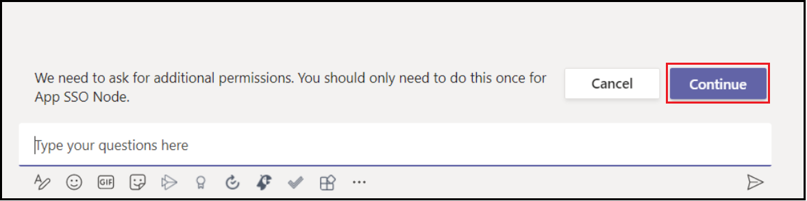

# <a name="single-sign-on-sso-support-for-bots"></a><span data-ttu-id="7b0cd-105">Prise en charge unique de la signalisation (SSO) pour les bots</span><span class="sxs-lookup"><span data-stu-id="7b0cd-105">Single sign-on (SSO) support for bots</span></span>

<span data-ttu-id="7b0cd-106">L’authentification unique en Azure Active Directory (AAD) minimise le nombre de fois que les utilisateurs doivent entrer leur signe dans les informations d’identification en rafraichissant silencieusement le jeton d’authentification.</span><span class="sxs-lookup"><span data-stu-id="7b0cd-106">Single sign-on authentication in Azure Active Directory (AAD) minimizes the number of times users need to enter their sign in credentials by silently refreshing the authentication token.</span></span> <span data-ttu-id="7b0cd-107">Si les utilisateurs acceptent d’utiliser votre application, ils n’ont plus besoin d’accord pour un autre appareil et peuvent se connecter automatiquement.</span><span class="sxs-lookup"><span data-stu-id="7b0cd-107">If users agree to use your app, they need not provide consent again on another device and can sign in automatically.</span></span> <span data-ttu-id="7b0cd-108">Le flux est similaire à celui [de l’onglet Microsoft Teams support SSO](../../../tabs/how-to/authentication/auth-aad-sso.md), cependant, la différence est dans le protocole pour la façon dont un bot [demande des jetons et](#request-a-bot-token) reçoit des [réponses](#receive-the-bot-token).</span><span class="sxs-lookup"><span data-stu-id="7b0cd-108">The flow is similar to that of [Microsoft Teams tab SSO support](../../../tabs/how-to/authentication/auth-aad-sso.md), however, the difference is in the protocol for how a bot [requests tokens](#request-a-bot-token) and [receives responses](#receive-the-bot-token).</span></span>

>[!NOTE]
> <span data-ttu-id="7b0cd-109">OAuth 2.0 est une norme ouverte pour l’authentification et l’autorisation utilisées par l’AAD et de nombreux autres fournisseurs d’identité.</span><span class="sxs-lookup"><span data-stu-id="7b0cd-109">OAuth 2.0 is an open standard for authentication and authorization used by AAD and many other identity providers.</span></span> <span data-ttu-id="7b0cd-110">Une compréhension de base d’OAuth 2.0 est une condition préalable pour travailler avec l’authentification Teams.</span><span class="sxs-lookup"><span data-stu-id="7b0cd-110">A basic understanding of OAuth 2.0 is a prerequisite for working with authentication in Teams.</span></span>

## <a name="bot-sso-at-runtime"></a><span data-ttu-id="7b0cd-111">Bot SSO à l’heure d’exécution</span><span class="sxs-lookup"><span data-stu-id="7b0cd-111">Bot SSO at runtime</span></span>


<span data-ttu-id="7b0cd-113">Complétez les étapes suivantes pour obtenir des jetons d’authentification et d’application bot :</span><span class="sxs-lookup"><span data-stu-id="7b0cd-113">Complete the following steps to get authentication and bot application tokens:</span></span>

1. <span data-ttu-id="7b0cd-114">Le robot envoie un message avec une carte OAuth qui contient la propriété `tokenExchangeResource`.</span><span class="sxs-lookup"><span data-stu-id="7b0cd-114">The bot sends a message with an OAuthCard that contains the `tokenExchangeResource` property.</span></span> <span data-ttu-id="7b0cd-115">Il indique aux Teams d’obtenir un jeton d’authentification pour l’application bot.</span><span class="sxs-lookup"><span data-stu-id="7b0cd-115">It tells Teams to obtain an authentication token for the bot application.</span></span> <span data-ttu-id="7b0cd-116">L’utilisateur reçoit des messages sur tous les points de terminaison d’utilisateur actifs.</span><span class="sxs-lookup"><span data-stu-id="7b0cd-116">The user receives messages at all the active user endpoints.</span></span>

    > [!NOTE]
    >* <span data-ttu-id="7b0cd-117">Un utilisateur peut avoir plusieurs points de terminaison actifs à la fois.</span><span class="sxs-lookup"><span data-stu-id="7b0cd-117">A user can have more than one active endpoint at a time.</span></span>
    >* <span data-ttu-id="7b0cd-118">Le jeton bot est reçu de chaque point de terminaison d’utilisateur actif.</span><span class="sxs-lookup"><span data-stu-id="7b0cd-118">The bot token is received from every active user endpoint.</span></span>
    >* <span data-ttu-id="7b0cd-119">L’application doit être installée dans l’étendue personnelle pour la prise en charge de l’authentification unique.</span><span class="sxs-lookup"><span data-stu-id="7b0cd-119">The app must be installed in personal scope for SSO support.</span></span>

1. <span data-ttu-id="7b0cd-120">Si l’utilisateur actuel utilise votre application bot pour la première fois, une invite de demande apparaît demandant à l’utilisateur de faire l’un des éléments suivants :</span><span class="sxs-lookup"><span data-stu-id="7b0cd-120">If the current user is using your bot application for the first time, a request prompt appears requesting the user to do one of the following:</span></span>
    * <span data-ttu-id="7b0cd-121">Donner son consentement, au besoin.</span><span class="sxs-lookup"><span data-stu-id="7b0cd-121">Provide consent, if required.</span></span>
    * <span data-ttu-id="7b0cd-122">Gérer l’authentification étape par étape, telle que l’authentification à deux facteurs.</span><span class="sxs-lookup"><span data-stu-id="7b0cd-122">Handle step-up authentication, such as two-factor authentication.</span></span>

1. <span data-ttu-id="7b0cd-123">Teams le jeton d’application bot à partir du point de terminaison AAD pour l’utilisateur actuel.</span><span class="sxs-lookup"><span data-stu-id="7b0cd-123">Teams requests the bot application token from the AAD endpoint for the current user.</span></span>

1. <span data-ttu-id="7b0cd-124">AAD envoie le jeton d’application bot à l’application Teams’application.</span><span class="sxs-lookup"><span data-stu-id="7b0cd-124">AAD sends the bot application token to the Teams application.</span></span>

1. <span data-ttu-id="7b0cd-125">Teams envoie le jeton au bot dans le cadre de l’objet de valeur retourné par l’activité invoquer avec **le nom sign-in/tokenExchange**.</span><span class="sxs-lookup"><span data-stu-id="7b0cd-125">Teams sends the token to the bot as part of the value object returned by the invoke activity with the name **sign-in/tokenExchange**.</span></span>
  
1. <span data-ttu-id="7b0cd-126">Le jeton analysée dans l’application bot fournit les informations requises, telles que l’adresse de l’utilisateur.</span><span class="sxs-lookup"><span data-stu-id="7b0cd-126">The parsed token in the bot application provides the required information, such as the user's email address.</span></span>
  
## <a name="develop-an-sso-teams-bot"></a><span data-ttu-id="7b0cd-127">Développer un bot SSO Teams</span><span class="sxs-lookup"><span data-stu-id="7b0cd-127">Develop an SSO Teams bot</span></span>
  
<span data-ttu-id="7b0cd-128">Terminez les étapes suivantes pour développer un bot SSO Teams:</span><span class="sxs-lookup"><span data-stu-id="7b0cd-128">Complete the following steps to develop an SSO Teams bot:</span></span>

1. <span data-ttu-id="7b0cd-129">[Enregistrez votre application via le portail AAD](#register-your-app-through-the-aad-portal).</span><span class="sxs-lookup"><span data-stu-id="7b0cd-129">[Register your app through the AAD portal](#register-your-app-through-the-aad-portal).</span></span>
1. <span data-ttu-id="7b0cd-130">[Mettez à jour Teams manifeste d’application pour votre bot](#update-your-teams-application-manifest-for-your-bot).</span><span class="sxs-lookup"><span data-stu-id="7b0cd-130">[Update your Teams application manifest for your bot](#update-your-teams-application-manifest-for-your-bot).</span></span>
1. <span data-ttu-id="7b0cd-131">[Ajoutez le code à la demande et recevez un jeton bot](#add-the-code-to-request-and-receive-a-bot-token).</span><span class="sxs-lookup"><span data-stu-id="7b0cd-131">[Add the code to request and receive a bot token](#add-the-code-to-request-and-receive-a-bot-token).</span></span>

### <a name="register-your-app-through-the-aad-portal"></a><span data-ttu-id="7b0cd-132">Inscrivez votre application via le portail AAD</span><span class="sxs-lookup"><span data-stu-id="7b0cd-132">Register your app through the AAD portal</span></span>

<span data-ttu-id="7b0cd-133">Les étapes d’enregistrement de votre application via le portail AAD sont similaires au [flux SSO onglet](../../../tabs/how-to/authentication/auth-aad-sso.md).</span><span class="sxs-lookup"><span data-stu-id="7b0cd-133">The steps to register your app through the AAD portal are similar to the [tab SSO flow](../../../tabs/how-to/authentication/auth-aad-sso.md).</span></span> <span data-ttu-id="7b0cd-134">Remplissez les étapes suivantes pour enregistrer votre application :</span><span class="sxs-lookup"><span data-stu-id="7b0cd-134">Complete the following steps to register your app:</span></span>

1. <span data-ttu-id="7b0cd-135">Enregistrez une nouvelle application dans le [portail Azure Active Directory - Inscriptions d’applications.](https://go.microsoft.com/fwlink/?linkid=2083908)</span><span class="sxs-lookup"><span data-stu-id="7b0cd-135">Register a new application in the [Azure Active Directory – App Registrations](https://go.microsoft.com/fwlink/?linkid=2083908) portal.</span></span>
2. <span data-ttu-id="7b0cd-136">Sélectionnez **Nouvelle inscription**.</span><span class="sxs-lookup"><span data-stu-id="7b0cd-136">Select **New Registration**.</span></span> <span data-ttu-id="7b0cd-137">Le **Registre d’une** page de demande apparaît.</span><span class="sxs-lookup"><span data-stu-id="7b0cd-137">The **Register an application** page appears.</span></span>
3. <span data-ttu-id="7b0cd-138">Dans le Registre, une page **de demande,** entrez les valeurs suivantes :</span><span class="sxs-lookup"><span data-stu-id="7b0cd-138">In the **Register an application** page, enter the following values:</span></span>
    1. <span data-ttu-id="7b0cd-139">Entrez **un** nom pour votre application.</span><span class="sxs-lookup"><span data-stu-id="7b0cd-139">Enter a **Name** for your app.</span></span>
    2. <span data-ttu-id="7b0cd-140">Choisissez les **types de compte pris en** charge, sélectionnez le type de compte unique ou multitenant.</span><span class="sxs-lookup"><span data-stu-id="7b0cd-140">Choose the **Supported account types**, select single tenant or multitenant account type.</span></span>

        > [!NOTE]
        >
        > <span data-ttu-id="7b0cd-141">Les utilisateurs ne sont pas sollicités pour obtenir leur consentement et obtiennent immédiatement des jetons d’accès, si l’application AAD est enregistrée dans le même locataire lorsqu’ils font une demande d’authentification en Teams.</span><span class="sxs-lookup"><span data-stu-id="7b0cd-141">The users are not asked for consent and are granted access tokens right away, if the AAD app is registered in the same tenant where they are making an authentication request in Teams.</span></span> <span data-ttu-id="7b0cd-142">Toutefois, les utilisateurs doivent donner leur consentement aux autorisations, si l’application AAD est enregistrée auprès d’un autre locataire.</span><span class="sxs-lookup"><span data-stu-id="7b0cd-142">However, the users must provide consent to the permissions, if the AAD app is registered in a different tenant.</span></span>

    3. <span data-ttu-id="7b0cd-143">Choisissez **Inscrire**.</span><span class="sxs-lookup"><span data-stu-id="7b0cd-143">Choose **Register**.</span></span>
4. <span data-ttu-id="7b0cd-144">Sur la page d’aperçu, copiez et enregistrez **l’ID application (client).**</span><span class="sxs-lookup"><span data-stu-id="7b0cd-144">On the overview page, copy and save the **Application (client) ID**.</span></span> <span data-ttu-id="7b0cd-145">Vous en avez besoin plus tard lors de la mise à jour Teams manifeste d’application.</span><span class="sxs-lookup"><span data-stu-id="7b0cd-145">You need it later when updating your Teams application manifest.</span></span>
5. <span data-ttu-id="7b0cd-146">Sélectionnez **Exposer une API** sous **Gérer**.</span><span class="sxs-lookup"><span data-stu-id="7b0cd-146">Under **Manage**, select **Expose an API**.</span></span> 

   > [!IMPORTANT]
    > * <span data-ttu-id="7b0cd-147">Si vous construisez un bot autonome, entrez l’ID d’application URI comme `api://botid-{YourBotId}` .</span><span class="sxs-lookup"><span data-stu-id="7b0cd-147">If you are building a standalone bot, enter the Application ID URI as `api://botid-{YourBotId}`.</span></span> <span data-ttu-id="7b0cd-148">Ici **YourBotId est** votre identifiant d’application AAD.</span><span class="sxs-lookup"><span data-stu-id="7b0cd-148">Here **YourBotId** is your AAD application ID.</span></span>
    > * <span data-ttu-id="7b0cd-149">Si vous construisez une application avec un bot et un onglet, entrez l’ID d’application URI comme `api://fully-qualified-domain-name.com/botid-{YourBotId}` .</span><span class="sxs-lookup"><span data-stu-id="7b0cd-149">If you are building an app with a bot and a tab, enter the Application ID URI as `api://fully-qualified-domain-name.com/botid-{YourBotId}`.</span></span>

5. <span data-ttu-id="7b0cd-150">Sélectionnez les autorisations dont votre application a besoin pour le point de terminaison AAD et, en option, pour microsoft Graph.</span><span class="sxs-lookup"><span data-stu-id="7b0cd-150">Select the permissions that your application needs for the AAD endpoint and, optionally, for Microsoft Graph.</span></span>
6. <span data-ttu-id="7b0cd-151">[Accordez des autorisations](/azure/active-directory/develop/v2-permissions-and-consent) pour Teams applications de bureau, web et mobiles.</span><span class="sxs-lookup"><span data-stu-id="7b0cd-151">[Grant permissions](/azure/active-directory/develop/v2-permissions-and-consent) for Teams desktop, web, and mobile applications.</span></span>
7. <span data-ttu-id="7b0cd-152">Sélectionnez **Ajouter une étendue**.</span><span class="sxs-lookup"><span data-stu-id="7b0cd-152">Select **Add a scope**.</span></span>
8. <span data-ttu-id="7b0cd-153">Dans le panneau qui s’ouvre, ajoutez une application client en entrant `access_as_user` comme **nom Scope**.</span><span class="sxs-lookup"><span data-stu-id="7b0cd-153">In the panel that opens, add a client app by entering `access_as_user` as the **Scope name**.</span></span>

    >[!NOTE]
    > <span data-ttu-id="7b0cd-154">La portée « access_as_user » utilisée pour ajouter une application client s’œuvre pour les administrateurs et les utilisateurs.</span><span class="sxs-lookup"><span data-stu-id="7b0cd-154">The "access_as_user" scope used to add a client app is for "Administrators and users".</span></span>
    >
    > <span data-ttu-id="7b0cd-155">Vous devez être au courant des restrictions importantes suivantes :</span><span class="sxs-lookup"><span data-stu-id="7b0cd-155">You must be aware of the following important restrictions:</span></span>
    >
    > * <span data-ttu-id="7b0cd-156">Seules les autorisations Microsoft au niveau Graph’utilisateur et les autorisations api, telles que le courrier électronique, le profil, offline_access et OpenId, sont prises en charge.</span><span class="sxs-lookup"><span data-stu-id="7b0cd-156">Only user-level Microsoft Graph API permissions, such as email, profile, offline_access, and OpenId are supported.</span></span> <span data-ttu-id="7b0cd-157">Si vous avez besoin d’accéder à d’autres Graph Microsoft, telles que `User.Read` ou , voir la solution de `Mail.Read` [contournement recommandée](../../../tabs/how-to/authentication/auth-aad-sso.md#apps-that-require-additional-graph-scopes).</span><span class="sxs-lookup"><span data-stu-id="7b0cd-157">If you need access to other Microsoft Graph scopes, such as `User.Read` or `Mail.Read`, see [recommended workaround](../../../tabs/how-to/authentication/auth-aad-sso.md#apps-that-require-additional-graph-scopes).</span></span>
    > * <span data-ttu-id="7b0cd-158">Le nom de domaine de votre application doit être le même que le nom de domaine que vous avez enregistré pour votre application AAD.</span><span class="sxs-lookup"><span data-stu-id="7b0cd-158">Your application's domain name must be same as the domain name that you have registered for your AAD application.</span></span>
    > * <span data-ttu-id="7b0cd-159">Plusieurs domaines par application ne sont actuellement pas pris en charge.</span><span class="sxs-lookup"><span data-stu-id="7b0cd-159">Multiple domains per app are currently not supported.</span></span>
    > * <span data-ttu-id="7b0cd-160">Les applications qui utilisent le `azurewebsites.net` domaine ne sont pas prises en charge parce qu’elles sont courantes et peuvent être un risque pour la sécurité.</span><span class="sxs-lookup"><span data-stu-id="7b0cd-160">Applications that use the `azurewebsites.net` domain are not supported because it is common and may be a security risk.</span></span>

#### <a name="update-the-azure-portal-with-the-oauth-connection"></a><span data-ttu-id="7b0cd-161">Mettre à jour le portail Azure avec la connexion OAuth</span><span class="sxs-lookup"><span data-stu-id="7b0cd-161">Update the Azure portal with the OAuth connection</span></span>

<span data-ttu-id="7b0cd-162">Complétez les étapes suivantes pour mettre à jour le portail Azure avec la connexion OAuth :</span><span class="sxs-lookup"><span data-stu-id="7b0cd-162">Complete the following steps to update the Azure portal with the OAuth connection:</span></span>

1. <span data-ttu-id="7b0cd-163">Dans le portail Azure, accédez aux **enregistrements d’applications**.</span><span class="sxs-lookup"><span data-stu-id="7b0cd-163">In the Azure Portal, navigate to **App registrations**.</span></span>

2. <span data-ttu-id="7b0cd-164">Aller à **autorisations API**.</span><span class="sxs-lookup"><span data-stu-id="7b0cd-164">Go to **API Permissions**.</span></span> <span data-ttu-id="7b0cd-165">Sélectionnez **Ajouter une autorisation** Microsoft  >  **Graph**  >  **autorisations déléguées,** puis ajouter les autorisations suivantes de Microsoft Graph API :</span><span class="sxs-lookup"><span data-stu-id="7b0cd-165">Select **Add a permission** > **Microsoft Graph** > **Delegated permissions**, then add the following permissions from Microsoft Graph API:</span></span>
    * <span data-ttu-id="7b0cd-166">User.Read (activé par défaut)</span><span class="sxs-lookup"><span data-stu-id="7b0cd-166">User.Read (enabled by default)</span></span>
    * <span data-ttu-id="7b0cd-167">email</span><span class="sxs-lookup"><span data-stu-id="7b0cd-167">email</span></span>
    * <span data-ttu-id="7b0cd-168">offline_access</span><span class="sxs-lookup"><span data-stu-id="7b0cd-168">offline_access</span></span>
    * <span data-ttu-id="7b0cd-169">OpenId (En)</span><span class="sxs-lookup"><span data-stu-id="7b0cd-169">OpenId</span></span>
    * <span data-ttu-id="7b0cd-170">profil</span><span class="sxs-lookup"><span data-stu-id="7b0cd-170">profile</span></span>

3. <span data-ttu-id="7b0cd-171">Dans le portail Azure, accédez à **l’enregistrement des canaux Bot**.</span><span class="sxs-lookup"><span data-stu-id="7b0cd-171">In the Azure Portal, navigate to **Bot Channels Registration**.</span></span>

4. <span data-ttu-id="7b0cd-172">Sélectionnez **Paramètres** sur le volet gauche et choisissez **Ajouter le réglage** sous la section **OAuth Connection Paramètres.**</span><span class="sxs-lookup"><span data-stu-id="7b0cd-172">Select **Settings** on the left pane and choose **Add Setting** under the **OAuth Connection Settings** section.</span></span>

    

5. <span data-ttu-id="7b0cd-174">Effectuez les étapes suivantes pour remplir le nouveau **formulaire de réglage de** connexion :</span><span class="sxs-lookup"><span data-stu-id="7b0cd-174">Perform the following steps to complete the **New Connection Setting** form:</span></span>

    >[!NOTE]
    > <span data-ttu-id="7b0cd-175">**Une subvention implicite** peut être exigée dans la demande de SAA.</span><span class="sxs-lookup"><span data-stu-id="7b0cd-175">**Implicit grant** may be required in the AAD application.</span></span>

    1. <span data-ttu-id="7b0cd-176">Entrez un **nom** dans la nouvelle page **de réglage de** connexion.</span><span class="sxs-lookup"><span data-stu-id="7b0cd-176">Enter a **Name** in the **New Connection Setting** page.</span></span> <span data-ttu-id="7b0cd-177">C’est le nom qui est mentionné à l’intérieur des paramètres de votre code de service bot à *l’étape 5* [de Bot SSO à l’heure d’exécution](#bot-sso-at-runtime).</span><span class="sxs-lookup"><span data-stu-id="7b0cd-177">This is the name that is referred to inside the settings of your bot service code in *step 5* of [Bot SSO at runtime](#bot-sso-at-runtime).</span></span>
    2. <span data-ttu-id="7b0cd-178">À partir **du drop-down** du fournisseur de services, **sélectionnez Azure Active Directory v2**.</span><span class="sxs-lookup"><span data-stu-id="7b0cd-178">From the **Service Provider** drop-down, select **Azure Active Directory v2**.</span></span>
    3. <span data-ttu-id="7b0cd-179">Saisissez les informations d’identification du client, telles que **l’id client** et **le secret client** pour l’application AAD.</span><span class="sxs-lookup"><span data-stu-id="7b0cd-179">Enter the client credentials, such as **Client id** and **Client secret** for the AAD application.</span></span>
    4. <span data-ttu-id="7b0cd-180">Pour **l’URL Exchange jeton,** utilisez la valeur de portée définie dans Mise à [jour de votre Teams d’application pour votre bot](#update-your-teams-application-manifest-for-your-bot).</span><span class="sxs-lookup"><span data-stu-id="7b0cd-180">For the **Token Exchange URL**, use the scope value defined in [Update your Teams application manifest for your bot](#update-your-teams-application-manifest-for-your-bot).</span></span> <span data-ttu-id="7b0cd-181">L’URL Exchange jetons indique au SDK que cette application AAD est configurée pour SSO.</span><span class="sxs-lookup"><span data-stu-id="7b0cd-181">The Token Exchange URL indicates to the SDK that this AAD application is configured for SSO.</span></span>
    5. <span data-ttu-id="7b0cd-182">Dans la boîte **d’identification** du locataire, entrez *commun*.</span><span class="sxs-lookup"><span data-stu-id="7b0cd-182">In the **Tenant ID** box, enter *common*.</span></span>
    6. <span data-ttu-id="7b0cd-183">Ajoutez toutes les **étendues configurées** lors de la spécifier des autorisations aux API en aval pour votre application AAD.</span><span class="sxs-lookup"><span data-stu-id="7b0cd-183">Add all the **Scopes** configured when specifying permissions to downstream APIs for your AAD application.</span></span> <span data-ttu-id="7b0cd-184">Avec l’id client et le secret client fournis, le magasin de jetons échange le jeton contre un jeton graphique avec des autorisations définies.</span><span class="sxs-lookup"><span data-stu-id="7b0cd-184">With the Client id and Client secret provided, the token store exchanges the token for a graph token with defined permissions.</span></span>
    7. <span data-ttu-id="7b0cd-185">Sélectionnez **Enregistrer**.</span><span class="sxs-lookup"><span data-stu-id="7b0cd-185">Select **Save**.</span></span>

    

### <a name="update-your-teams-application-manifest-for-your-bot"></a><span data-ttu-id="7b0cd-187">Mettez à jour votre Teams d’application pour votre bot</span><span class="sxs-lookup"><span data-stu-id="7b0cd-187">Update your Teams application manifest for your bot</span></span>

<span data-ttu-id="7b0cd-188">Si l’application contient un bot autonome, utilisez le code suivant pour ajouter de nouvelles propriétés au manifeste d’application Teams’application :</span><span class="sxs-lookup"><span data-stu-id="7b0cd-188">If the application contains a standalone bot, then use the following code to add new properties to the Teams application manifest:</span></span>

```json
    "webApplicationInfo": 
        {
            "id": "00000000-0000-0000-0000-000000000000",
            "resource": "api://botid-00000000-0000-0000-0000-000000000000"
        }
```
<span data-ttu-id="7b0cd-189">Si l’application contient un bot et un onglet, utilisez le code suivant pour ajouter de nouvelles propriétés au manifeste d Teams’application :</span><span class="sxs-lookup"><span data-stu-id="7b0cd-189">If the application contains a bot and a tab, then use the following code to add new properties to the Teams application manifest:</span></span>

```json
    "webApplicationInfo": 
        {
            "id": "00000000-0000-0000-0000-000000000000",
            "resource": "api://subdomain.example.com/botid-00000000-0000-0000-0000-000000000000"
        }
```

<span data-ttu-id="7b0cd-190">**webApplicationInfo** est le parent des éléments suivants :</span><span class="sxs-lookup"><span data-stu-id="7b0cd-190">**webApplicationInfo** is the parent of the following elements:</span></span>

* <span data-ttu-id="7b0cd-191">**id** - L’identité client de l’application.</span><span class="sxs-lookup"><span data-stu-id="7b0cd-191">**id** - The client ID of the application.</span></span> <span data-ttu-id="7b0cd-192">Il s’agit de l’id de demande que vous avez obtenu dans le cadre de l’enregistrement de la demande auprès de l’AAD.</span><span class="sxs-lookup"><span data-stu-id="7b0cd-192">This is the application ID that you obtained as part of registering the application with AAD.</span></span>
* <span data-ttu-id="7b0cd-193">**ressource** - Le domaine et la sous-main de votre application.</span><span class="sxs-lookup"><span data-stu-id="7b0cd-193">**resource** - The domain and subdomain of your application.</span></span> <span data-ttu-id="7b0cd-194">Il s’agit du même URI, y compris le `api://` protocole que vous avez enregistré lors de la création de votre dans Enregistrer votre application via le `scope` portail [AAD](#register-your-app-through-the-aad-portal).</span><span class="sxs-lookup"><span data-stu-id="7b0cd-194">This is the same URI, including the `api://` protocol that you registered when creating your `scope` in [Register your app through the AAD portal](#register-your-app-through-the-aad-portal).</span></span> <span data-ttu-id="7b0cd-195">Vous ne devez pas inclure `access_as_user` le chemin dans votre ressource.</span><span class="sxs-lookup"><span data-stu-id="7b0cd-195">You must not include the `access_as_user` path in your resource.</span></span> <span data-ttu-id="7b0cd-196">La partie domaine de cet URI doit correspondre au domaine et aux sous-domaines utilisés dans les URL de votre Teams d’application.</span><span class="sxs-lookup"><span data-stu-id="7b0cd-196">The domain part of this URI must match the domain and subdomains used in the URLs of your Teams application manifest.</span></span>

### <a name="add-the-code-to-request-and-receive-a-bot-token"></a><span data-ttu-id="7b0cd-197">Ajouter le code à la demande et recevoir un jeton bot</span><span class="sxs-lookup"><span data-stu-id="7b0cd-197">Add the code to request and receive a bot token</span></span>

#### <a name="request-a-bot-token"></a><span data-ttu-id="7b0cd-198">Demander un jeton bot</span><span class="sxs-lookup"><span data-stu-id="7b0cd-198">Request a bot token</span></span>

<span data-ttu-id="7b0cd-199">La demande d’obtenir le jeton est une demande de message POST normale en utilisant le schéma de message existant.</span><span class="sxs-lookup"><span data-stu-id="7b0cd-199">The request to get the token is a normal POST message request using the existing message schema.</span></span> <span data-ttu-id="7b0cd-200">Il est inclus dans les pièces jointes d’une OAuthCard.</span><span class="sxs-lookup"><span data-stu-id="7b0cd-200">It is included in the attachments of an OAuthCard.</span></span> <span data-ttu-id="7b0cd-201">Le schéma de la classe OAuthCard est défini dans [Microsoft Bot Schema 4.0](/dotnet/api/microsoft.bot.schema.oauthcard?view=botbuilder-dotnet-stable&preserve-view=true) et il est similaire à une carte de connectement.</span><span class="sxs-lookup"><span data-stu-id="7b0cd-201">The schema for the OAuthCard class is defined in [Microsoft Bot Schema 4.0](/dotnet/api/microsoft.bot.schema.oauthcard?view=botbuilder-dotnet-stable&preserve-view=true) and it is similar to a sign-in card.</span></span> <span data-ttu-id="7b0cd-202">Teams traite cette demande comme une acquisition de jeton silencieux si `TokenExchangeResource` la propriété est peuplée sur la carte.</span><span class="sxs-lookup"><span data-stu-id="7b0cd-202">Teams treats this request as a silent token acquisition if the `TokenExchangeResource` property is populated on the card.</span></span> <span data-ttu-id="7b0cd-203">Pour le Teams, seule la `Id` propriété, qui identifie uniquement une demande symbolique, est honorée.</span><span class="sxs-lookup"><span data-stu-id="7b0cd-203">For the Teams channel, only the `Id` property, which uniquely identifies a token request, is honored.</span></span>

>[!NOTE]
> <span data-ttu-id="7b0cd-204">Le Microsoft Bot Framework ou `OAuthPrompt` le est pris en charge pour `MultiProviderAuthDialog` l’authentification SSO.</span><span class="sxs-lookup"><span data-stu-id="7b0cd-204">The Microsoft Bot Framework `OAuthPrompt` or the `MultiProviderAuthDialog` is supported for SSO authentication.</span></span>

<span data-ttu-id="7b0cd-205">Si l’utilisateur utilise l’application pour la première fois et que le consentement de l’utilisateur est requis, la boîte de dialogue suivante semble se poursuivre avec l’expérience de consentement :</span><span class="sxs-lookup"><span data-stu-id="7b0cd-205">If the user is using the application for the first time and user consent is required, the following dialog box appears to continue with the consent experience:</span></span>



<span data-ttu-id="7b0cd-207">Lorsque l’utilisateur sélectionne **Continuer**, ces événements se produisent :</span><span class="sxs-lookup"><span data-stu-id="7b0cd-207">When the user selects **Continue**, the following events occur:</span></span>

* <span data-ttu-id="7b0cd-208">Si le bot définit un bouton de dédage, le flux de connectage pour les bots est déclenché de la même manière que le flux de signe à partir d’un bouton de carte OAuth dans un flux de messages.</span><span class="sxs-lookup"><span data-stu-id="7b0cd-208">If the bot defines a sign-in button, the sign in flow for bots is triggered similar to the sign in flow from an OAuth card button in a message stream.</span></span> <span data-ttu-id="7b0cd-209">Le développeur doit décider des autorisations qui nécessitent le consentement de l’utilisateur.</span><span class="sxs-lookup"><span data-stu-id="7b0cd-209">The developer must decide which permissions require user's consent.</span></span> <span data-ttu-id="7b0cd-210">Cette approche est recommandée si vous avez besoin d’un jeton avec des autorisations au-delà `openId` .</span><span class="sxs-lookup"><span data-stu-id="7b0cd-210">This approach is recommended if you require a token with permissions beyond `openId`.</span></span> <span data-ttu-id="7b0cd-211">Par exemple, si vous souhaitez échanger le jeton contre des ressources graphiques.</span><span class="sxs-lookup"><span data-stu-id="7b0cd-211">For example, if you want to exchange the token for graph resources.</span></span>

* <span data-ttu-id="7b0cd-212">Si le bot ne fournit pas de bouton de dédage sur la carte OAuth, le consentement de l’utilisateur est requis pour un ensemble minimal d’autorisations.</span><span class="sxs-lookup"><span data-stu-id="7b0cd-212">If the bot is not providing a sign-in button on the OAuth card, user consent is required for a minimal set of permissions.</span></span> <span data-ttu-id="7b0cd-213">Ce jeton est utile pour l’authentification de base et pour obtenir l’adresse e-mail de l’utilisateur.</span><span class="sxs-lookup"><span data-stu-id="7b0cd-213">This token is useful for basic authentication and to get the user's email address.</span></span>

##### <a name="c-token-request-without-a-sign-in-button"></a><span data-ttu-id="7b0cd-214">Demande de jeton C# sans bouton de déd connecte</span><span class="sxs-lookup"><span data-stu-id="7b0cd-214">C# token request without a sign-in button</span></span>

```csharp
    var attachment = new Attachment
            {
                Content = new OAuthCard
                {
                    TokenExchangeResource = new TokenExchangeResource
                    {
                        Id = requestId
                    }
                },
                ContentType = OAuthCard.ContentType,
            };
            var activity = MessageFactory.Attachment(attachment);

            // NOTE: This activity needs to be sent in the 1:1 conversation between the bot and the user. 
            // If the bot supports group and channel scope, this code should be updated to send the request to the 1:1 chat. 

       await turnContext.SendActivityAsync(activity, cancellationToken);
```

#### <a name="receive-the-bot-token"></a><span data-ttu-id="7b0cd-215">Recevez le jeton bot</span><span class="sxs-lookup"><span data-stu-id="7b0cd-215">Receive the bot token</span></span>

<span data-ttu-id="7b0cd-216">La réponse avec le jeton est envoyée par une activité d’invocer avec le même schéma que d’autres invoquent les activités que les bots reçoivent aujourd’hui.</span><span class="sxs-lookup"><span data-stu-id="7b0cd-216">The response with the token is sent through an invoke activity with the same schema as other invoke activities that the bots receive today.</span></span> <span data-ttu-id="7b0cd-217">La seule différence est le nom d’invocer, **le connectement/tokenExchange et** le **champ de** valeur.</span><span class="sxs-lookup"><span data-stu-id="7b0cd-217">The only difference is the invoke name, **sign-in/tokenExchange** and the **value** field.</span></span> <span data-ttu-id="7b0cd-218">Le **champ** de valeur contient **l’Id**, une chaîne de la demande initiale pour obtenir le jeton et **le champ de jetons,** une valeur de chaîne incluant le jeton.</span><span class="sxs-lookup"><span data-stu-id="7b0cd-218">The **value** field contains the **Id**, a string of the initial request to get the token and the **token** field, a string value including the token.</span></span>

>[!NOTE]
> <span data-ttu-id="7b0cd-219">Vous pouvez recevoir plusieurs réponses pour une demande donnée si l’utilisateur a plusieurs paramètres actifs.</span><span class="sxs-lookup"><span data-stu-id="7b0cd-219">You might receive multiple responses for a given request if the user has multiple active endpoints.</span></span> <span data-ttu-id="7b0cd-220">Vous devez déduiser les réponses avec le jeton.</span><span class="sxs-lookup"><span data-stu-id="7b0cd-220">You must deduplicate the responses with the token.</span></span>

##### <a name="c-code-to-handle-the-invoke-activity"></a><span data-ttu-id="7b0cd-221">Code C# pour gérer l’activité invocant</span><span class="sxs-lookup"><span data-stu-id="7b0cd-221">C# code to handle the invoke activity</span></span>

```csharp
    protected override async Task<InvokeResponse> OnInvokeActivityAsync
    (ITurnContext<IInvokeActivity> turnContext, CancellationToken cancellationToken)
            {
                try
                {
                    if (turnContext.Activity.Name == SignInConstants.TokenExchangeOperationName && turnContext.Activity.ChannelId == Channels.Msteams)
                    {
                        await OnTokenResponseEventAsync(turnContext, cancellationToken);
                        return new InvokeResponse() { Status = 200 };
                    }
                    else
                    {
                        return await base.OnInvokeActivityAsync(turnContext, cancellationToken);
                    }
                }
                catch (InvokeResponseException e)
                {
                    return e.CreateInvokeResponse();
                }
            }
```

<span data-ttu-id="7b0cd-222">`turnContext.activity.value`L’est de type [TokenExchangeInvokeRequest](/dotnet/api/microsoft.bot.schema.tokenexchangeinvokerequest?view=botbuilder-dotnet-stable&preserve-view=true) et contient le jeton qui peut être utilisé par votre bot.</span><span class="sxs-lookup"><span data-stu-id="7b0cd-222">The `turnContext.activity.value` is of type [TokenExchangeInvokeRequest](/dotnet/api/microsoft.bot.schema.tokenexchangeinvokerequest?view=botbuilder-dotnet-stable&preserve-view=true) and contains the token that can be further used by your bot.</span></span> <span data-ttu-id="7b0cd-223">Vous devez stocker les jetons pour des raisons de performances et les rafraîchir.</span><span class="sxs-lookup"><span data-stu-id="7b0cd-223">You must store the tokens for performance reasons and refresh them.</span></span>

### <a name="token-exchange-failure"></a><span data-ttu-id="7b0cd-224">Échec de l’échange de jetons</span><span class="sxs-lookup"><span data-stu-id="7b0cd-224">Token exchange failure</span></span>

<span data-ttu-id="7b0cd-225">En cas d’échec de l’échange de jetons, utilisez le code suivant :</span><span class="sxs-lookup"><span data-stu-id="7b0cd-225">In case of token exchange failure, use the following code:</span></span>

```json
{ 
    "status": "<response code>", 
    "body": 
    { 
        "id":"<unique Id>", 
        "connectionName": "<connection Name on the bot (from the OAuth card)>", 
        "failureDetail": "<failure reason if status code is not 200, null otherwise>" 
    } 
}
```

<span data-ttu-id="7b0cd-226">Pour comprendre ce que fait le bot lorsque l’échange de jetons ne déclenche pas une invite de consentement, voir les étapes suivantes :</span><span class="sxs-lookup"><span data-stu-id="7b0cd-226">To understand what the bot does when the token exchange fails to trigger a consent prompt, see the following steps:</span></span>

>[!NOTE]
> <span data-ttu-id="7b0cd-227">Aucune action de l’utilisateur n’est nécessaire pour être prise car le bot prend les mesures lorsque l’échange de jetons échoue.</span><span class="sxs-lookup"><span data-stu-id="7b0cd-227">No user action is required to be taken as the bot takes the actions when the token exchange fails.</span></span>

1. <span data-ttu-id="7b0cd-228">Le client commence une conversation avec le bot déclenchant un scénario OAuth.</span><span class="sxs-lookup"><span data-stu-id="7b0cd-228">The client starts a conversation with the bot triggering an OAuth scenario.</span></span>
2. <span data-ttu-id="7b0cd-229">Le bot renvoie une carte OAuth au client.</span><span class="sxs-lookup"><span data-stu-id="7b0cd-229">The bot sends back an OAuth card to the client.</span></span>
3. <span data-ttu-id="7b0cd-230">Le client intercepte la carte OAuth avant de l’afficher à l’utilisateur et vérifie si elle contient une `TokenExchangeResource` propriété.</span><span class="sxs-lookup"><span data-stu-id="7b0cd-230">The client intercepts the OAuth card before displaying it to the user and checks if it contains a `TokenExchangeResource` property.</span></span>
4. <span data-ttu-id="7b0cd-231">Si la propriété existe, le client envoie `TokenExchangeInvokeRequest` un au bot.</span><span class="sxs-lookup"><span data-stu-id="7b0cd-231">If the property exists, the client sends a `TokenExchangeInvokeRequest` to the bot.</span></span> <span data-ttu-id="7b0cd-232">Le client doit avoir un jeton échangeable pour l’utilisateur, qui doit être un jeton Azure AD v2 et dont l’audience doit être la même que la `TokenExchangeResource.Uri` propriété.</span><span class="sxs-lookup"><span data-stu-id="7b0cd-232">The client must have an exchangeable token for the user, which must be an Azure AD v2 token and whose audience must be the same as `TokenExchangeResource.Uri` property.</span></span> <span data-ttu-id="7b0cd-233">Le client envoie une activité d’invocer au bot avec le code suivant :</span><span class="sxs-lookup"><span data-stu-id="7b0cd-233">The client sends an invoke activity to the bot with the following code:</span></span>

    ```json
    {
        "type": "Invoke",
        "name": "signin/tokenExchange",
        "value": 
        {
            "id": "<any unique Id>",
            "connectionName": "<connection Name on the skill bot (from the OAuth card)>",
            "token": "<exchangeable token>"
        }
    }
    ```

5. <span data-ttu-id="7b0cd-234">Le bot traite le `TokenExchangeInvokeRequest` et renvoie `TokenExchangeInvokeResponse` un dos au client.</span><span class="sxs-lookup"><span data-stu-id="7b0cd-234">The bot processes the `TokenExchangeInvokeRequest` and returns a `TokenExchangeInvokeResponse` back to the client.</span></span> <span data-ttu-id="7b0cd-235">Le client doit attendre jusqu’à ce qu’il reçoive `TokenExchangeInvokeResponse` le .</span><span class="sxs-lookup"><span data-stu-id="7b0cd-235">The client must wait till it receives the `TokenExchangeInvokeResponse`.</span></span>

    ```json
    {
        "status": "<response code>",
        "body": 
        {
            "id":"<unique Id>",
            "connectionName": "<connection Name on the skill bot (from the OAuth card)>",
            "failureDetail": "<failure reason if status code is not 200, null otherwise>"
        }
    }
    ```

6. <span data-ttu-id="7b0cd-236">Si le `TokenExchangeInvokeResponse` a un de , alors le client ne montre pas la carte `status` `200` OAuth.</span><span class="sxs-lookup"><span data-stu-id="7b0cd-236">If the `TokenExchangeInvokeResponse` has a `status` of `200`, then the client does not show the OAuth card.</span></span> <span data-ttu-id="7b0cd-237">Voir [l’image de flux normal](/azure/bot-service/bot-builder-concept-sso?view=azure-bot-service-4.0#sso-components-interaction&preserve-view=true).</span><span class="sxs-lookup"><span data-stu-id="7b0cd-237">See the [normal flow image](/azure/bot-service/bot-builder-concept-sso?view=azure-bot-service-4.0#sso-components-interaction&preserve-view=true).</span></span> <span data-ttu-id="7b0cd-238">Pour tout autre `status` ou si le `TokenExchangeInvokeResponse` n’est pas reçu, alors le client montre la carte OAuth à l’utilisateur.</span><span class="sxs-lookup"><span data-stu-id="7b0cd-238">For any other `status` or if the `TokenExchangeInvokeResponse` is not received, then the client shows the OAuth card to the user.</span></span> <span data-ttu-id="7b0cd-239">Voir [l’image de flux de repli](/azure/bot-service/bot-builder-concept-sso?view=azure-bot-service-4.0#sso-components-interaction&preserve-view=true).</span><span class="sxs-lookup"><span data-stu-id="7b0cd-239">See the [fallback flow image](/azure/bot-service/bot-builder-concept-sso?view=azure-bot-service-4.0#sso-components-interaction&preserve-view=true).</span></span> <span data-ttu-id="7b0cd-240">Cela garantit que le flux SSO retombe au flux normal d’OAuthCard en cas d’erreurs ou de dépendances non satisfaites comme le consentement de l’utilisateur.</span><span class="sxs-lookup"><span data-stu-id="7b0cd-240">This ensures that the SSO flow falls back to normal OAuthCard flow in case of any errors or unmet dependencies like user consent.</span></span>


### <a name="update-the-auth-sample"></a><span data-ttu-id="7b0cd-241">Mettre à jour l’échantillon auth</span><span class="sxs-lookup"><span data-stu-id="7b0cd-241">Update the auth sample</span></span>

<span data-ttu-id="7b0cd-242">Ouvrez [Teams échantillon auth,](https://github.com/microsoft/BotBuilder-Samples/tree/master/samples/csharp_dotnetcore/46.teams-auth) puis terminez les étapes suivantes pour le mettre à jour :</span><span class="sxs-lookup"><span data-stu-id="7b0cd-242">Open [Teams auth sample](https://github.com/microsoft/BotBuilder-Samples/tree/master/samples/csharp_dotnetcore/46.teams-auth) and then complete the following steps to update it:</span></span>

1. <span data-ttu-id="7b0cd-243">Mettez à jour le TeamsBot pour gérer le dédupage de la demande entrante en incluant le code suivant :</span><span class="sxs-lookup"><span data-stu-id="7b0cd-243">Update the TeamsBot to handle the deduping of the incoming request by including the following code:</span></span>

    ```csharp
        protected override async Task OnSignInInvokeAsync(ITurnContext<IInvokeActivity> turnContext, CancellationToken cancellationToken)
            {
                await Dialog.RunAsync(turnContext, ConversationState.CreateProperty<DialogState>(nameof(DialogState)), cancellationToken);
            }
        protected override async Task OnTokenResponseEventAsync(ITurnContext<IEventActivity> turnContext, CancellationToken cancellationToken)
            {
                await Dialog.RunAsync(turnContext, ConversationState.CreateProperty<DialogState>(nameof(DialogState)), cancellationToken);
            }
    ```
  
2. <span data-ttu-id="7b0cd-244">Mise `appsettings.json` à jour pour inclure le , mot de `botId` passe, et le nom de connexion défini [dans Mettre à jour le portail Azure avec la connexion OAuth](#update-the-azure-portal-with-the-oauth-connection).</span><span class="sxs-lookup"><span data-stu-id="7b0cd-244">Update `appsettings.json` to include the `botId`, password, and the connection name defined in [Update the Azure portal with the OAuth connection](#update-the-azure-portal-with-the-oauth-connection).</span></span>
3. <span data-ttu-id="7b0cd-245">Mettez à jour le manifeste et `token.botframework.com` assurez-vous que c’est dans la liste des domaines valides.</span><span class="sxs-lookup"><span data-stu-id="7b0cd-245">Update the manifest and ensure that `token.botframework.com` is in the valid domains list.</span></span> <span data-ttu-id="7b0cd-246">Pour plus d’informations, [Teams échantillon auth](https://github.com/microsoft/BotBuilder-Samples/tree/master/samples/csharp_dotnetcore/46.teams-auth).</span><span class="sxs-lookup"><span data-stu-id="7b0cd-246">For more information, see [Teams auth sample](https://github.com/microsoft/BotBuilder-Samples/tree/master/samples/csharp_dotnetcore/46.teams-auth).</span></span>
4. <span data-ttu-id="7b0cd-247">Zip le manifeste avec les images de profil et l’installer dans Teams.</span><span class="sxs-lookup"><span data-stu-id="7b0cd-247">Zip the manifest with the profile images and install it in Teams.</span></span>

## <a name="code-sample"></a><span data-ttu-id="7b0cd-248">Exemple de code</span><span class="sxs-lookup"><span data-stu-id="7b0cd-248">Code sample</span></span>
|<span data-ttu-id="7b0cd-249">**Nom de l’échantillon**</span><span class="sxs-lookup"><span data-stu-id="7b0cd-249">**Sample name**</span></span> | <span data-ttu-id="7b0cd-250">**Description**</span><span class="sxs-lookup"><span data-stu-id="7b0cd-250">**Description**</span></span> |<span data-ttu-id="7b0cd-251">**.NET (en)**</span><span class="sxs-lookup"><span data-stu-id="7b0cd-251">**.NET**</span></span> | 
|----------------|-----------------|--------------|
|<span data-ttu-id="7b0cd-252">Bot cadre SDK</span><span class="sxs-lookup"><span data-stu-id="7b0cd-252">Bot framework SDK</span></span> | <span data-ttu-id="7b0cd-253">Exemple pour l’utilisation du cadre de bot SDK.</span><span class="sxs-lookup"><span data-stu-id="7b0cd-253">Sample for using the bot framework SDK.</span></span> |[<span data-ttu-id="7b0cd-254">View</span><span class="sxs-lookup"><span data-stu-id="7b0cd-254">View</span></span>](https://github.com/microsoft/BotBuilder-Samples/tree/main/experimental/teams-sso/csharp_dotnetcore)|
