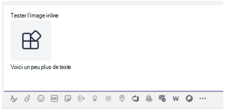

# <a name="send-and-receive-files-through-the-bot"></a>Envoyer et recevoir des fichiers via le bot

> [!IMPORTANT]
> Les articles de ce document sont basés sur le SDK v4 Bot Framework.

Il existe deux façons d'envoyer et de recevoir des fichiers à partir d'un bot :

* [**Utilisez les API Microsoft Graph :**](#use-the-graph-apis) Cette méthode fonctionne pour les bots dans toutes les étendues Microsoft Teams :
  * `personal`
  * `channel`
  * `groupchat`

* [**Utilisez les API de bot Teams :**](#use-the-teams-bot-apis) Ces fichiers ne sont en charge que dans le `personal` contexte.

## <a name="use-the-graph-apis"></a>Utiliser les API Graph

Publiez des messages avec des pièces jointes de carte qui font référence à des fichiers SharePoint existants, à l'aide des API Graph pour [OneDrive et SharePoint](/onedrive/developer/rest-api/). Pour utiliser les API Graph, accédez à l'une des informations suivantes via le flux d'autorisation OAuth 2.0 standard :

* Dossier OneDrive d'un utilisateur et `personal` `groupchat` fichiers.
* Fichiers dans le canal d'une équipe pour les `channel` fichiers.

Les API Graph fonctionnent dans toutes les étendues Teams. Pour plus d'informations, voir [envoyer des pièces jointes au fichier de message de conversation.](/graph/api/chatmessage-post?view=graph-rest-beta&tabs=http#example-4-file-attachments&preserve-view=true)

Vous pouvez également envoyer et recevoir des fichiers à partir d'un bot à l'aide des API de bot Teams.

## <a name="use-the-teams-bot-apis"></a>Utiliser les API de bot Teams

> [!NOTE]
> Les API de bot Teams fonctionnent uniquement dans le `personal` contexte. Elles ne fonctionnent pas dans le `channel` contexte ou dans le `groupchat` contexte.

À l'aide des API Teams, le bot peut directement envoyer et recevoir des fichiers avec des utilisateurs dans le contexte, également appelé `personal` conversations personnelles. Implémenter des fonctionnalités telles que les notes de frais, la reconnaissance d'image, l'archivage de fichiers et les signatures électronique impliquant la modification du contenu du fichier. Les fichiers partagés dans Teams s'affichent généralement sous la main de cartes et permettent un affichage enrichi dans l'application.

Les sections suivantes décrivent comment envoyer du contenu de fichier en tant qu'interaction directe de l'utilisateur, comme l'envoi d'un message. Cette API est fournie dans le cadre de la plateforme de bot Teams.

### <a name="configure-the-bot-to-support-files"></a>Configurer le bot pour prendre en charge les fichiers

Pour envoyer et recevoir des fichiers dans le bot, définissez la `supportsFiles` propriété dans le manifeste sur `true` . Cette propriété est décrite dans la section [bots](~/resources/schema/manifest-schema.md#bots) de la référence du manifeste.

La définition ressemble à `"supportsFiles": true` ceci: Si le bot n'est pas activé, les fonctionnalités répertoriées `supportsFiles` dans cette section ne fonctionnent pas.

### <a name="receive-files-in-personal-chat"></a>Recevoir des fichiers dans une conversation personnelle

Lorsqu'un utilisateur envoie un fichier au bot, le fichier est d'abord téléchargé vers le stockage OneDrive Entreprise de l'utilisateur. Le bot reçoit ensuite une activité de message notifiant l'utilisateur sur le chargement de l'utilisateur. L'activité contient des métadonnées de fichier, telles que son nom et l'URL de contenu. L'utilisateur peut lire directement à partir de cette URL pour récupérer son contenu binaire.

#### <a name="message-activity-with-file-attachment-example"></a>Exemple d'activité de message avec pièce jointe

Le code suivant montre un exemple d'activité de message avec une pièce jointe :

```json
{
  "attachments": [{
    "contentType": "application/vnd.microsoft.teams.file.download.info",
    "contentUrl": "https://contoso.sharepoint.com/personal/johnadams_contoso_com/Documents/Applications/file_example.txt",
    "name": "file_example.txt",
    "content": {
      "downloadUrl" : "https://download.link",
      "uniqueId": "1150D938-8870-4044-9F2C-5BBDEBA70C9D",
      "fileType": "txt",
      "etag": "123"
    }
  }]
}
```

Le tableau suivant décrit les propriétés de contenu de la pièce jointe :

| Propriété | Objectif |
| --- | --- |
| `downloadUrl` | URL OneDrive pour la récupération du contenu du fichier. L'utilisateur peut `HTTP GET` émettre une adresse directement à partir de cette URL. |
| `uniqueId` | ID de fichier unique. Il s'agit de l'ID de l'élément de lecteur OneDrive, au cas où l'utilisateur envoie un fichier au bot. |
| `fileType` | Type de fichier, tel que .pdf ou .docx. |

En tant que meilleure pratique, reconnaissez le chargement du fichier en renvoyant un message à l'utilisateur.

### <a name="upload-files-to-personal-chat"></a>Charger des fichiers dans une conversation personnelle

**Pour télécharger un fichier vers un utilisateur**

1. Envoyez un message à l'utilisateur demandant l'autorisation d'écrire le fichier. Ce message doit contenir `FileConsentCard` une pièce jointe avec le nom du fichier à télécharger.
2. Si l'utilisateur accepte le téléchargement du fichier, le bot reçoit une activité d'appel avec une URL d'emplacement.
3. Pour transférer le fichier, le bot effectue une entrée directement dans `HTTP POST` l'URL d'emplacement fournie.
4. Si vous le souhaitez, supprimez la carte de consentement d'origine si vous ne souhaitez pas que l'utilisateur accepte d'autres téléchargements du même fichier.

#### <a name="message-requesting-permission-to-upload"></a>Message demandant l'autorisation de téléchargement

Le message de bureau suivant contient un objet de pièce jointe simple demandant l'autorisation de l'utilisateur pour télécharger le fichier :


Le message mobile suivant contient un objet de pièce jointe demandant l'autorisation de l'utilisateur pour télécharger le fichier :


```json
{
  "attachments": [{
    "contentType": "application/vnd.microsoft.teams.card.file.consent",
    "name": "file_example.txt",
    "content": {
      "description": "<Purpose of the file, such as: this is your monthly expense report>",
      "sizeInBytes": 1029393,
      "acceptContext": {
      },
      "declineContext": {
      }
    }
  }]
}
```

Le tableau suivant décrit les propriétés de contenu de la pièce jointe :

| Propriété | Objectif |
| --- | --- |
| `description` | Décrit l'objectif du fichier ou résume son contenu. |
| `sizeInBytes` | Fournit à l'utilisateur une estimation de la taille du fichier et de la quantité d'espace qu'il occupe dans OneDrive. |
| `acceptContext` | Contexte supplémentaire transmis silencieusement au bot lorsque l'utilisateur accepte le fichier. |
| `declineContext` | Contexte supplémentaire transmis silencieusement au bot lorsque l'utilisateur refuse le fichier. |

#### <a name="invoke-activity-when-the-user-accepts-the-file"></a>Appeler l'activité lorsque l'utilisateur accepte le fichier

Une activité d'appel est envoyée au bot si et quand l'utilisateur accepte le fichier. Il contient l'URL de l'espace réservé OneDrive Entreprise que le bot peut ensuite émettre pour `PUT` transférer le contenu du fichier. Pour plus d'informations sur le chargement vers l'URL OneDrive, voir [charger des octets vers la session de chargement.](/onedrive/developer/rest-api/api/driveitem_createuploadsession#upload-bytes-to-the-upload-session)

Le code suivant montre un exemple de version concise de l'activité d'appel que le bot reçoit :

```json
{
  "name": "fileConsent/invoke",
  "value": {
    "type": "fileUpload",
    "action": "accept",
    "context": {
    },
    "uploadInfo": {
      "contentUrl": "https://contoso.sharepoint.com/personal/johnadams_contoso_com/Documents/Applications/file_example.txt",
      "name": "file_example.txt",
      "uploadUrl": "https://upload.link",
      "uniqueId": "1150D938-8870-4044-9F2C-5BBDEBA70C8C",
      "fileType": "txt",
      "etag": "123"
    }
  }
}
```

De même, si l'utilisateur refuse le fichier, le bot reçoit l'événement suivant avec le même nom d'activité globale :

```json
{
  "name": "fileConsent/invoke",
  "value": {
    "type": "fileUpload",
    "action": "decline",
    "context": {
    }
  }
}
```

### <a name="notifying-the-user-about-an-uploaded-file"></a>Informer l'utilisateur d'un fichier téléchargé

Après avoir téléchargé un fichier sur le OneDrive de l'utilisateur, envoyez un message de confirmation à l'utilisateur. Le message doit contenir la pièce jointe suivante que l'utilisateur peut sélectionner, soit pour afficher un aperçu, soit l'ouvrir dans `FileCard` OneDrive, ou télécharger localement :

```json
{
  "attachments": [{
    "contentType": "application/vnd.microsoft.teams.card.file.info",
    "contentUrl": "https://contoso.sharepoint.com/personal/johnadams_contoso_com/Documents/Applications/file_example.txt",
    "name": "file_example.txt",
    "content": {
      "uniqueId": "1150D938-8870-4044-9F2C-5BBDEBA70C8C",
      "fileType": "txt",
    }
  }]
}
```

Le tableau suivant décrit les propriétés de contenu de la pièce jointe :

| Propriété | Objectif |
| --- | --- |
| `uniqueId` | ID d'élément de lecteur OneDrive ou SharePoint. |
| `fileType` | Type de fichier, tel que .pdf ou .docx. |

### <a name="fetch-inline-images-from-message"></a>Récupérer des images en ligne à partir d'un message

Récupérer des images en ligne qui font partie du message à l'aide du jeton d'accès du bot.



Le code suivant montre un exemple d'extraction d'images en ligne à partir d'un message :

```csharp
private async Task ProcessInlineImage(ITurnContext<IMessageActivity> turnContext, CancellationToken cancellationToken)
{
    var attachment = turnContext.Activity.Attachments[0];
    var client = _clientFactory.CreateClient();
    // Get Bot's access token to fetch inline image. 
    var token = await new MicrosoftAppCredentials(microsoftAppId, microsoftAppPassword).GetTokenAsync();
    client.DefaultRequestHeaders.Authorization = new AuthenticationHeaderValue("Bearer", token);
    var responseMessage = await client.GetAsync(attachment.ContentUrl);
    // Save the inline image to Files directory.
    var filePath = Path.Combine("Files", "ImageFromUser.png");
    using (var fileStream = new FileStream(filePath, FileMode.Create, FileAccess.Write, FileShare.None))
    {
        await responseMessage.Content.CopyToAsync(fileStream);
    }
    // Create reply with image.
    var reply = MessageFactory.Text($"Attachment of {attachment.ContentType} type and size of {responseMessage.Content.Headers.ContentLength} bytes received.");
    reply.Attachments = new List<Attachment>() { 
        GetInlineAttachment() 
    };
    await turnContext.SendActivityAsync(reply, cancellationToken);
}
private static Attachment GetInlineAttachment()
{
    var imagePath = Path.Combine("Files", "ImageFromUser.png");
    var imageData = Convert.ToBase64String(File.ReadAllBytes(imagePath));
    return new Attachment
    {
        Name = @"ImageFromUser.png",
        ContentType = "image/png",
        ContentUrl = $"data:image/png;base64,{imageData}",
    };
}
```

### <a name="basic-example-in-c"></a>Exemple de base en C #

Le code suivant montre un exemple de la façon de gérer les téléchargements de fichiers et d'envoyer des demandes de consentement de fichier dans la boîte de dialogue du bot :

```csharp

protected override async Task OnMessageActivityAsync(ITurnContext<IMessageActivity> turnContext, CancellationToken cancellationToken)
{
    if (turnContext.Activity.Attachments?[0].ContentType.Contains("image/*") == true)
    {
        // Inline image.
        await ProcessInlineImage(turnContext, cancellationToken);
    }
    else
    {
        string filename = "teams-logo.png";
        string filePath = Path.Combine("Files", filename);
        long fileSize = new FileInfo(filePath).Length;
        await SendFileCardAsync(turnContext, filename, fileSize, cancellationToken);
    }
}
private async Task ProcessInlineImage(ITurnContext<IMessageActivity> turnContext, CancellationToken cancellationToken)
{
    var attachment = turnContext.Activity.Attachments[0];
    var client = _clientFactory.CreateClient();
    // Get Bot's access token to fetch inline image. 
    var token = await new MicrosoftAppCredentials(microsoftAppId, microsoftAppPassword).GetTokenAsync();
    client.DefaultRequestHeaders.Authorization = new AuthenticationHeaderValue("Bearer", token);
    var responseMessage = await client.GetAsync(attachment.ContentUrl);
    // Save the inline image to Files directory.
    var filePath = Path.Combine("Files", "ImageFromUser.png");
    using (var fileStream = new FileStream(filePath, FileMode.Create, FileAccess.Write, FileShare.None))
    {
        await responseMessage.Content.CopyToAsync(fileStream);
    }
    // Create reply with image.
    var reply = MessageFactory.Text($"Attachment of {attachment.ContentType} type and size of {responseMessage.Content.Headers.ContentLength} bytes received.");
    reply.Attachments = new List<Attachment>() { GetInlineAttachment() };
    await turnContext.SendActivityAsync(reply, cancellationToken);
}
private static Attachment GetInlineAttachment()
{
    var imagePath = Path.Combine("Files", "ImageFromUser.png");
    var imageData = Convert.ToBase64String(File.ReadAllBytes(imagePath));
    return new Attachment
    {
        Name = @"ImageFromUser.png",
        ContentType = "image/png",
        ContentUrl = $"data:image/png;base64,{imageData}",
    };
}
private async Task SendFileCardAsync(ITurnContext turnContext, string filename, long filesize, CancellationToken cancellationToken)
{
    var consentContext = new Dictionary<string, string>
    {
        { 
            "filename", filename 
        },
    };
    var fileCard = new FileConsentCard
    {
        Description = "This is the file I want to send you",
        SizeInBytes = filesize,
        AcceptContext = consentContext,
        DeclineContext = consentContext,
    };
    var asAttachment = new Attachment
    {
        Content = fileCard,
        ContentType = FileConsentCard.ContentType,
        Name = filename,
    };
    var replyActivity = turnContext.Activity.CreateReply();
    replyActivity.Attachments = new List<Attachment>() { asAttachment };
    await turnContext.SendActivityAsync(replyActivity, cancellationToken);
}
```

## <a name="code-sample"></a>Exemple de code

L'exemple de code suivant montre comment obtenir le consentement du fichier et télécharger des fichiers dans Teams à partir d'un bot :

|**Exemple de nom** | **Description** | **.NET** | **Javascript** | **Python**|
|----------------|-----------------|--------------|----------------|-----------|
| File upload | Montre comment obtenir le consentement des fichiers et télécharger des fichiers dans Teams à partir d’un bot. En outre, comment recevoir un fichier envoyé à un bot. | [View](https://github.com/microsoft/BotBuilder-Samples/blob/main/samples/csharp_dotnetcore/56.teams-file-upload) | [View](https://github.com/microsoft/BotBuilder-Samples/blob/main/samples/javascript_nodejs/56.teams-file-upload) | [View](https://github.com/microsoft/BotBuilder-Samples/blob/main/samples/python/56.teams-file-upload) |

## <a name="next-step"></a>Étape suivante

> [!div class="nextstepaction"]
> [Optimisez votre robot grâce à la limitation du débit dans Teams](~/bots/how-to/rate-limit.md)
