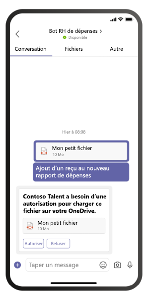

# <a name="send-and-receive-files-through-the-bot"></a><span data-ttu-id="9c570-104">Envoyer et recevoir des fichiers via le bot</span><span class="sxs-lookup"><span data-stu-id="9c570-104">Send and receive files through the bot</span></span>

> [!IMPORTANT]
> <span data-ttu-id="9c570-105">Les articles de ce document sont basés sur le SDK v4 Bot Framework.</span><span class="sxs-lookup"><span data-stu-id="9c570-105">The articles in this document are based on the v4 Bot Framework SDK.</span></span>

<span data-ttu-id="9c570-106">Il existe deux façons d'envoyer et de recevoir des fichiers à partir d'un bot :</span><span class="sxs-lookup"><span data-stu-id="9c570-106">There are two ways to send files to and receive files from a bot:</span></span>

* <span data-ttu-id="9c570-107">[**Utilisez les API Microsoft Graph :**](#use-the-graph-apis) Cette méthode fonctionne pour les bots dans toutes les étendues Microsoft Teams :</span><span class="sxs-lookup"><span data-stu-id="9c570-107">[**Use the Microsoft Graph APIs:**](#use-the-graph-apis) This method works for bots in all Microsoft Teams scopes:</span></span>
  * `personal`
  * `channel`
  * `groupchat`

* <span data-ttu-id="9c570-108">[**Utilisez les API de bot Teams :**](#use-the-teams-bot-apis) Ces fichiers ne sont en charge que dans le `personal` contexte.</span><span class="sxs-lookup"><span data-stu-id="9c570-108">[**Use the Teams bot APIs:**](#use-the-teams-bot-apis) These only support files in `personal` context.</span></span>

## <a name="use-the-graph-apis"></a><span data-ttu-id="9c570-109">Utiliser les API Graph</span><span class="sxs-lookup"><span data-stu-id="9c570-109">Use the Graph APIs</span></span>

<span data-ttu-id="9c570-110">Publiez des messages avec des pièces jointes de carte qui font référence à des fichiers SharePoint existants, à l'aide des API Graph pour [OneDrive et SharePoint](/onedrive/developer/rest-api/).</span><span class="sxs-lookup"><span data-stu-id="9c570-110">Post messages with card attachments that refer to existing SharePoint files, using the Graph APIs for [OneDrive and SharePoint](/onedrive/developer/rest-api/).</span></span> <span data-ttu-id="9c570-111">Pour utiliser les API Graph, accédez à l'une des informations suivantes via le flux d'autorisation OAuth 2.0 standard :</span><span class="sxs-lookup"><span data-stu-id="9c570-111">To use the Graph APIs, obtain access to either of the following through the standard OAuth 2.0 authorization flow:</span></span>

* <span data-ttu-id="9c570-112">Dossier OneDrive d'un utilisateur et `personal` `groupchat` fichiers.</span><span class="sxs-lookup"><span data-stu-id="9c570-112">A user's OneDrive folder for `personal` and `groupchat` files.</span></span>
* <span data-ttu-id="9c570-113">Fichiers dans le canal d'une équipe pour les `channel` fichiers.</span><span class="sxs-lookup"><span data-stu-id="9c570-113">The files in a team's channel for `channel` files.</span></span>

<span data-ttu-id="9c570-114">Les API Graph fonctionnent dans toutes les étendues Teams.</span><span class="sxs-lookup"><span data-stu-id="9c570-114">Graph APIs work in all Teams scopes.</span></span> <span data-ttu-id="9c570-115">Pour plus d'informations, voir [envoyer des pièces jointes au fichier de message de conversation.](/graph/api/chatmessage-post?view=graph-rest-beta&tabs=http#example-4-file-attachments&preserve-view=true)</span><span class="sxs-lookup"><span data-stu-id="9c570-115">For more information, see [send chat message file attachments](/graph/api/chatmessage-post?view=graph-rest-beta&tabs=http#example-4-file-attachments&preserve-view=true).</span></span>

<span data-ttu-id="9c570-116">Vous pouvez également envoyer et recevoir des fichiers à partir d'un bot à l'aide des API de bot Teams.</span><span class="sxs-lookup"><span data-stu-id="9c570-116">Alternately, you can send files to and receive files from a bot using the Teams bot APIs.</span></span>

## <a name="use-the-teams-bot-apis"></a><span data-ttu-id="9c570-117">Utiliser les API de bot Teams</span><span class="sxs-lookup"><span data-stu-id="9c570-117">Use the Teams bot APIs</span></span>

> [!NOTE]
> <span data-ttu-id="9c570-118">Les API de bot Teams fonctionnent uniquement dans le `personal` contexte.</span><span class="sxs-lookup"><span data-stu-id="9c570-118">Teams bot APIs work only in the `personal` context.</span></span> <span data-ttu-id="9c570-119">Elles ne fonctionnent pas dans le `channel` contexte ou dans le `groupchat` contexte.</span><span class="sxs-lookup"><span data-stu-id="9c570-119">They do not work in the `channel` or `groupchat` context.</span></span>

<span data-ttu-id="9c570-120">À l'aide des API Teams, le bot peut directement envoyer et recevoir des fichiers avec des utilisateurs dans le contexte, également appelé `personal` conversations personnelles.</span><span class="sxs-lookup"><span data-stu-id="9c570-120">Using Teams APIs, the bot can directly send and receive files with users in the `personal` context, also known as personal chats.</span></span> <span data-ttu-id="9c570-121">Implémenter des fonctionnalités telles que les notes de frais, la reconnaissance d'image, l'archivage de fichiers et les signatures électronique impliquant la modification du contenu du fichier.</span><span class="sxs-lookup"><span data-stu-id="9c570-121">Implement features, such as expense reporting, image recognition, file archival, and e-signatures involving the editing of file content.</span></span> <span data-ttu-id="9c570-122">Les fichiers partagés dans Teams s'affichent généralement sous la main de cartes et permettent un affichage enrichi dans l'application.</span><span class="sxs-lookup"><span data-stu-id="9c570-122">Files shared in Teams typically appear as cards and allow rich in-app viewing.</span></span>

<span data-ttu-id="9c570-123">Les sections suivantes décrivent comment envoyer du contenu de fichier en tant qu'interaction directe de l'utilisateur, comme l'envoi d'un message.</span><span class="sxs-lookup"><span data-stu-id="9c570-123">The next sections describe how to send file content as direct user interaction, like sending a message.</span></span> <span data-ttu-id="9c570-124">Cette API est fournie dans le cadre de la plateforme de bot Teams.</span><span class="sxs-lookup"><span data-stu-id="9c570-124">This API is provided as part of the Teams bot platform.</span></span>

### <a name="configure-the-bot-to-support-files"></a><span data-ttu-id="9c570-125">Configurer le bot pour prendre en charge les fichiers</span><span class="sxs-lookup"><span data-stu-id="9c570-125">Configure the bot to support files</span></span>

<span data-ttu-id="9c570-126">Pour envoyer et recevoir des fichiers dans le bot, définissez la `supportsFiles` propriété dans le manifeste sur `true` .</span><span class="sxs-lookup"><span data-stu-id="9c570-126">To send and receive files in the bot, set the `supportsFiles` property in the manifest to `true`.</span></span> <span data-ttu-id="9c570-127">Cette propriété est décrite dans la section [bots](~/resources/schema/manifest-schema.md#bots) de la référence du manifeste.</span><span class="sxs-lookup"><span data-stu-id="9c570-127">This property is described in the [bots](~/resources/schema/manifest-schema.md#bots) section of the Manifest reference.</span></span>

<span data-ttu-id="9c570-128">La définition ressemble à `"supportsFiles": true` ceci:</span><span class="sxs-lookup"><span data-stu-id="9c570-128">The definition looks like this, `"supportsFiles": true`.</span></span> <span data-ttu-id="9c570-129">Si le bot n'est pas activé, les fonctionnalités répertoriées `supportsFiles` dans cette section ne fonctionnent pas.</span><span class="sxs-lookup"><span data-stu-id="9c570-129">If the bot does not enable `supportsFiles`, the features listed in this section do not work.</span></span>

### <a name="receive-files-in-personal-chat"></a><span data-ttu-id="9c570-130">Recevoir des fichiers dans une conversation personnelle</span><span class="sxs-lookup"><span data-stu-id="9c570-130">Receive files in personal chat</span></span>

<span data-ttu-id="9c570-131">Lorsqu'un utilisateur envoie un fichier au bot, le fichier est d'abord téléchargé vers le stockage OneDrive Entreprise de l'utilisateur.</span><span class="sxs-lookup"><span data-stu-id="9c570-131">When a user sends a file to the bot, the file is first uploaded to the user's OneDrive for business storage.</span></span> <span data-ttu-id="9c570-132">Le bot reçoit ensuite une activité de message notifiant l'utilisateur sur le chargement de l'utilisateur.</span><span class="sxs-lookup"><span data-stu-id="9c570-132">The bot then receives a message activity notifying the user about the user upload.</span></span> <span data-ttu-id="9c570-133">L'activité contient des métadonnées de fichier, telles que son nom et l'URL de contenu.</span><span class="sxs-lookup"><span data-stu-id="9c570-133">The activity contains file metadata, such as its name and the content URL.</span></span> <span data-ttu-id="9c570-134">L'utilisateur peut lire directement à partir de cette URL pour récupérer son contenu binaire.</span><span class="sxs-lookup"><span data-stu-id="9c570-134">The user can directly read from this URL to fetch its binary content.</span></span>

#### <a name="message-activity-with-file-attachment-example"></a><span data-ttu-id="9c570-135">Exemple d'activité de message avec pièce jointe</span><span class="sxs-lookup"><span data-stu-id="9c570-135">Message activity with file attachment example</span></span>

<span data-ttu-id="9c570-136">Le code suivant montre un exemple d'activité de message avec une pièce jointe :</span><span class="sxs-lookup"><span data-stu-id="9c570-136">The following code shows an example of message activity with file attachment:</span></span>

```json
{
  "attachments": [{
    "contentType": "application/vnd.microsoft.teams.file.download.info",
    "contentUrl": "https://contoso.sharepoint.com/personal/johnadams_contoso_com/Documents/Applications/file_example.txt",
    "name": "file_example.txt",
    "content": {
      "downloadUrl" : "https://download.link",
      "uniqueId": "1150D938-8870-4044-9F2C-5BBDEBA70C9D",
      "fileType": "txt",
      "etag": "123"
    }
  }]
}
```

<span data-ttu-id="9c570-137">Le tableau suivant décrit les propriétés de contenu de la pièce jointe :</span><span class="sxs-lookup"><span data-stu-id="9c570-137">The following table describes the content properties of the attachment:</span></span>

| <span data-ttu-id="9c570-138">Propriété</span><span class="sxs-lookup"><span data-stu-id="9c570-138">Property</span></span> | <span data-ttu-id="9c570-139">Objectif</span><span class="sxs-lookup"><span data-stu-id="9c570-139">Purpose</span></span> |
| --- | --- |
| `downloadUrl` | <span data-ttu-id="9c570-140">URL OneDrive pour la récupération du contenu du fichier.</span><span class="sxs-lookup"><span data-stu-id="9c570-140">OneDrive URL for fetching the content of the file.</span></span> <span data-ttu-id="9c570-141">L'utilisateur peut `HTTP GET` émettre une adresse directement à partir de cette URL.</span><span class="sxs-lookup"><span data-stu-id="9c570-141">The user can issue an `HTTP GET` directly from this URL.</span></span> |
| `uniqueId` | <span data-ttu-id="9c570-142">ID de fichier unique.</span><span class="sxs-lookup"><span data-stu-id="9c570-142">Unique file ID.</span></span> <span data-ttu-id="9c570-143">Il s'agit de l'ID de l'élément de lecteur OneDrive, au cas où l'utilisateur envoie un fichier au bot.</span><span class="sxs-lookup"><span data-stu-id="9c570-143">This is the OneDrive drive item ID, in case the user sends a file to the bot.</span></span> |
| `fileType` | <span data-ttu-id="9c570-144">Type de fichier, tel que .pdf ou .docx.</span><span class="sxs-lookup"><span data-stu-id="9c570-144">Type of file, such as .pdf or .docx.</span></span> |

<span data-ttu-id="9c570-145">En tant que meilleure pratique, reconnaissez le chargement du fichier en renvoyant un message à l'utilisateur.</span><span class="sxs-lookup"><span data-stu-id="9c570-145">As a best practice, acknowledge the file upload by sending a message back to the user.</span></span>

### <a name="upload-files-to-personal-chat"></a><span data-ttu-id="9c570-146">Charger des fichiers dans une conversation personnelle</span><span class="sxs-lookup"><span data-stu-id="9c570-146">Upload files to personal chat</span></span>

<span data-ttu-id="9c570-147">**Pour télécharger un fichier vers un utilisateur**</span><span class="sxs-lookup"><span data-stu-id="9c570-147">**To upload a file to a user**</span></span>

1. <span data-ttu-id="9c570-148">Envoyez un message à l'utilisateur demandant l'autorisation d'écrire le fichier.</span><span class="sxs-lookup"><span data-stu-id="9c570-148">Send a message to the user requesting permission to write the file.</span></span> <span data-ttu-id="9c570-149">Ce message doit contenir `FileConsentCard` une pièce jointe avec le nom du fichier à télécharger.</span><span class="sxs-lookup"><span data-stu-id="9c570-149">This message must contain a `FileConsentCard` attachment with the name of the file to be uploaded.</span></span>
2. <span data-ttu-id="9c570-150">Si l'utilisateur accepte le téléchargement du fichier, le bot reçoit une activité d'appel avec une URL d'emplacement.</span><span class="sxs-lookup"><span data-stu-id="9c570-150">If the user accepts the file download, the bot receives an invoke activity with a location URL.</span></span>
3. <span data-ttu-id="9c570-151">Pour transférer le fichier, le bot effectue une entrée directement dans `HTTP POST` l'URL d'emplacement fournie.</span><span class="sxs-lookup"><span data-stu-id="9c570-151">To transfer the file, the bot performs an `HTTP POST` directly into the provided location URL.</span></span>
4. <span data-ttu-id="9c570-152">Si vous le souhaitez, supprimez la carte de consentement d'origine si vous ne souhaitez pas que l'utilisateur accepte d'autres téléchargements du même fichier.</span><span class="sxs-lookup"><span data-stu-id="9c570-152">Optionally, remove the original consent card if you do not want the user to accept further uploads of the same file.</span></span>

#### <a name="message-requesting-permission-to-upload"></a><span data-ttu-id="9c570-153">Message demandant l'autorisation de téléchargement</span><span class="sxs-lookup"><span data-stu-id="9c570-153">Message requesting permission to upload</span></span>

<span data-ttu-id="9c570-154">Le message de bureau suivant contient un objet de pièce jointe simple demandant l'autorisation de l'utilisateur pour télécharger le fichier :</span><span class="sxs-lookup"><span data-stu-id="9c570-154">The following desktop message contains a simple attachment object requesting user permission to upload the file:</span></span>


<span data-ttu-id="9c570-156">Le message mobile suivant contient un objet de pièce jointe demandant l'autorisation de l'utilisateur pour télécharger le fichier :</span><span class="sxs-lookup"><span data-stu-id="9c570-156">The following mobile message contains an attachment object requesting user permission to upload the file:</span></span>



```json
{
  "attachments": [{
    "contentType": "application/vnd.microsoft.teams.card.file.consent",
    "name": "file_example.txt",
    "content": {
      "description": "<Purpose of the file, such as: this is your monthly expense report>",
      "sizeInBytes": 1029393,
      "acceptContext": {
      },
      "declineContext": {
      }
    }
  }]
}
```

<span data-ttu-id="9c570-157">Le tableau suivant décrit les propriétés de contenu de la pièce jointe :</span><span class="sxs-lookup"><span data-stu-id="9c570-157">The following table describes the content properties of the attachment:</span></span>

| <span data-ttu-id="9c570-158">Propriété</span><span class="sxs-lookup"><span data-stu-id="9c570-158">Property</span></span> | <span data-ttu-id="9c570-159">Objectif</span><span class="sxs-lookup"><span data-stu-id="9c570-159">Purpose</span></span> |
| --- | --- |
| `description` | <span data-ttu-id="9c570-160">Décrit l'objectif du fichier ou résume son contenu.</span><span class="sxs-lookup"><span data-stu-id="9c570-160">Describes the purpose of the file or summarizes its content.</span></span> |
| `sizeInBytes` | <span data-ttu-id="9c570-161">Fournit à l'utilisateur une estimation de la taille du fichier et de la quantité d'espace qu'il occupe dans OneDrive.</span><span class="sxs-lookup"><span data-stu-id="9c570-161">Provides the user an estimate of the file size and the amount of space it takes in OneDrive.</span></span> |
| `acceptContext` | <span data-ttu-id="9c570-162">Contexte supplémentaire transmis silencieusement au bot lorsque l'utilisateur accepte le fichier.</span><span class="sxs-lookup"><span data-stu-id="9c570-162">Additional context that is silently transmitted to the bot when the user accepts the file.</span></span> |
| `declineContext` | <span data-ttu-id="9c570-163">Contexte supplémentaire transmis silencieusement au bot lorsque l'utilisateur refuse le fichier.</span><span class="sxs-lookup"><span data-stu-id="9c570-163">Additional context that is silently transmitted to the bot when the user declines the file.</span></span> |

#### <a name="invoke-activity-when-the-user-accepts-the-file"></a><span data-ttu-id="9c570-164">Appeler l'activité lorsque l'utilisateur accepte le fichier</span><span class="sxs-lookup"><span data-stu-id="9c570-164">Invoke activity when the user accepts the file</span></span>

<span data-ttu-id="9c570-165">Une activité d'appel est envoyée au bot si et quand l'utilisateur accepte le fichier.</span><span class="sxs-lookup"><span data-stu-id="9c570-165">An invoke activity is sent to the bot if and when the user accepts the file.</span></span> <span data-ttu-id="9c570-166">Il contient l'URL de l'espace réservé OneDrive Entreprise que le bot peut ensuite émettre pour `PUT` transférer le contenu du fichier.</span><span class="sxs-lookup"><span data-stu-id="9c570-166">It contains the OneDrive for Business placeholder URL that the bot can then issue a `PUT` to transfer the file contents.</span></span> <span data-ttu-id="9c570-167">Pour plus d'informations sur le chargement vers l'URL OneDrive, voir [charger des octets vers la session de chargement.](/onedrive/developer/rest-api/api/driveitem_createuploadsession#upload-bytes-to-the-upload-session)</span><span class="sxs-lookup"><span data-stu-id="9c570-167">For information on uploading to the OneDrive URL, see [upload bytes to the upload session](/onedrive/developer/rest-api/api/driveitem_createuploadsession#upload-bytes-to-the-upload-session).</span></span>

<span data-ttu-id="9c570-168">Le code suivant montre un exemple de version concise de l'activité d'appel que le bot reçoit :</span><span class="sxs-lookup"><span data-stu-id="9c570-168">The following code shows an example of a concise version of the invoke activity that the bot receives:</span></span>

```json
{
  "name": "fileConsent/invoke",
  "value": {
    "type": "fileUpload",
    "action": "accept",
    "context": {
    },
    "uploadInfo": {
      "contentUrl": "https://contoso.sharepoint.com/personal/johnadams_contoso_com/Documents/Applications/file_example.txt",
      "name": "file_example.txt",
      "uploadUrl": "https://upload.link",
      "uniqueId": "1150D938-8870-4044-9F2C-5BBDEBA70C8C",
      "fileType": "txt",
      "etag": "123"
    }
  }
}
```

<span data-ttu-id="9c570-169">De même, si l'utilisateur refuse le fichier, le bot reçoit l'événement suivant avec le même nom d'activité globale :</span><span class="sxs-lookup"><span data-stu-id="9c570-169">Similarly, if the user declines the file, the bot receives the following event with the same overall activity name:</span></span>

```json
{
  "name": "fileConsent/invoke",
  "value": {
    "type": "fileUpload",
    "action": "decline",
    "context": {
    }
  }
}
```

### <a name="notifying-the-user-about-an-uploaded-file"></a><span data-ttu-id="9c570-170">Informer l'utilisateur d'un fichier téléchargé</span><span class="sxs-lookup"><span data-stu-id="9c570-170">Notifying the user about an uploaded file</span></span>

<span data-ttu-id="9c570-171">Après avoir chargé un fichier sur le OneDrive de l'utilisateur, envoyez un message de confirmation à l'utilisateur.</span><span class="sxs-lookup"><span data-stu-id="9c570-171">After uploading a file to the user's OneDrive, send a confirmation message to the user.</span></span> <span data-ttu-id="9c570-172">Le message doit contenir la pièce jointe suivante que l'utilisateur peut sélectionner, soit pour afficher un aperçu, soit l'ouvrir dans `FileCard` OneDrive, ou télécharger localement :</span><span class="sxs-lookup"><span data-stu-id="9c570-172">The message must contain the following `FileCard` attachment that the user can select, either to preview or open it in OneDrive, or download locally:</span></span>

```json
{
  "attachments": [{
    "contentType": "application/vnd.microsoft.teams.card.file.info",
    "contentUrl": "https://contoso.sharepoint.com/personal/johnadams_contoso_com/Documents/Applications/file_example.txt",
    "name": "file_example.txt",
    "content": {
      "uniqueId": "1150D938-8870-4044-9F2C-5BBDEBA70C8C",
      "fileType": "txt",
    }
  }]
}
```

<span data-ttu-id="9c570-173">Le tableau suivant décrit les propriétés de contenu de la pièce jointe :</span><span class="sxs-lookup"><span data-stu-id="9c570-173">The following table describes the content properties of the attachment:</span></span>

| <span data-ttu-id="9c570-174">Propriété</span><span class="sxs-lookup"><span data-stu-id="9c570-174">Property</span></span> | <span data-ttu-id="9c570-175">Objectif</span><span class="sxs-lookup"><span data-stu-id="9c570-175">Purpose</span></span> |
| --- | --- |
| `uniqueId` | <span data-ttu-id="9c570-176">ID d'élément de lecteur OneDrive ou SharePoint.</span><span class="sxs-lookup"><span data-stu-id="9c570-176">OneDrive or SharePoint drive item ID.</span></span> |
| `fileType` | <span data-ttu-id="9c570-177">Type de fichier, tel que .pdf ou .docx.</span><span class="sxs-lookup"><span data-stu-id="9c570-177">Type of file, such as .pdf or .docx.</span></span> |

### <a name="fetch-inline-images-from-message"></a><span data-ttu-id="9c570-178">Récupérer des images en ligne à partir d'un message</span><span class="sxs-lookup"><span data-stu-id="9c570-178">Fetch inline images from message</span></span>

<span data-ttu-id="9c570-179">Récupérer des images en ligne qui font partie du message à l'aide du jeton d'accès du bot.</span><span class="sxs-lookup"><span data-stu-id="9c570-179">Fetch inline images that are part of the message using the Bot's access token.</span></span>


<span data-ttu-id="9c570-181">Le code suivant montre un exemple d'extraction d'images en ligne à partir d'un message :</span><span class="sxs-lookup"><span data-stu-id="9c570-181">The following code shows an example of fetching inline images from message:</span></span>

```csharp
private async Task ProcessInlineImage(ITurnContext<IMessageActivity> turnContext, CancellationToken cancellationToken)
{
    var attachment = turnContext.Activity.Attachments[0];
    var client = _clientFactory.CreateClient();
    // Get Bot's access token to fetch inline image. 
    var token = await new MicrosoftAppCredentials(microsoftAppId, microsoftAppPassword).GetTokenAsync();
    client.DefaultRequestHeaders.Authorization = new AuthenticationHeaderValue("Bearer", token);
    var responseMessage = await client.GetAsync(attachment.ContentUrl);
    // Save the inline image to Files directory.
    var filePath = Path.Combine("Files", "ImageFromUser.png");
    using (var fileStream = new FileStream(filePath, FileMode.Create, FileAccess.Write, FileShare.None))
    {
        await responseMessage.Content.CopyToAsync(fileStream);
    }
    // Create reply with image.
    var reply = MessageFactory.Text($"Attachment of {attachment.ContentType} type and size of {responseMessage.Content.Headers.ContentLength} bytes received.");
    reply.Attachments = new List<Attachment>() { 
        GetInlineAttachment() 
    };
    await turnContext.SendActivityAsync(reply, cancellationToken);
}
private static Attachment GetInlineAttachment()
{
    var imagePath = Path.Combine("Files", "ImageFromUser.png");
    var imageData = Convert.ToBase64String(File.ReadAllBytes(imagePath));
    return new Attachment
    {
        Name = @"ImageFromUser.png",
        ContentType = "image/png",
        ContentUrl = $"data:image/png;base64,{imageData}",
    };
}
```

### <a name="basic-example-in-c"></a><span data-ttu-id="9c570-182">Exemple de base en C #</span><span class="sxs-lookup"><span data-stu-id="9c570-182">Basic example in C#</span></span>

<span data-ttu-id="9c570-183">Le code suivant montre un exemple de la façon de gérer les téléchargements de fichiers et d'envoyer des demandes de consentement de fichier dans la boîte de dialogue du bot :</span><span class="sxs-lookup"><span data-stu-id="9c570-183">The following code shows an example of how to handle file uploads and send file consent requests in the bot's dialog:</span></span>

```csharp

protected override async Task OnMessageActivityAsync(ITurnContext<IMessageActivity> turnContext, CancellationToken cancellationToken)
{
    if (turnContext.Activity.Attachments?[0].ContentType.Contains("image/*") == true)
    {
        // Inline image.
        await ProcessInlineImage(turnContext, cancellationToken);
    }
    else
    {
        string filename = "teams-logo.png";
        string filePath = Path.Combine("Files", filename);
        long fileSize = new FileInfo(filePath).Length;
        await SendFileCardAsync(turnContext, filename, fileSize, cancellationToken);
    }
}
private async Task ProcessInlineImage(ITurnContext<IMessageActivity> turnContext, CancellationToken cancellationToken)
{
    var attachment = turnContext.Activity.Attachments[0];
    var client = _clientFactory.CreateClient();
    // Get Bot's access token to fetch inline image. 
    var token = await new MicrosoftAppCredentials(microsoftAppId, microsoftAppPassword).GetTokenAsync();
    client.DefaultRequestHeaders.Authorization = new AuthenticationHeaderValue("Bearer", token);
    var responseMessage = await client.GetAsync(attachment.ContentUrl);
    // Save the inline image to Files directory.
    var filePath = Path.Combine("Files", "ImageFromUser.png");
    using (var fileStream = new FileStream(filePath, FileMode.Create, FileAccess.Write, FileShare.None))
    {
        await responseMessage.Content.CopyToAsync(fileStream);
    }
    // Create reply with image.
    var reply = MessageFactory.Text($"Attachment of {attachment.ContentType} type and size of {responseMessage.Content.Headers.ContentLength} bytes received.");
    reply.Attachments = new List<Attachment>() { GetInlineAttachment() };
    await turnContext.SendActivityAsync(reply, cancellationToken);
}
private static Attachment GetInlineAttachment()
{
    var imagePath = Path.Combine("Files", "ImageFromUser.png");
    var imageData = Convert.ToBase64String(File.ReadAllBytes(imagePath));
    return new Attachment
    {
        Name = @"ImageFromUser.png",
        ContentType = "image/png",
        ContentUrl = $"data:image/png;base64,{imageData}",
    };
}
private async Task SendFileCardAsync(ITurnContext turnContext, string filename, long filesize, CancellationToken cancellationToken)
{
    var consentContext = new Dictionary<string, string>
    {
        { 
            "filename", filename 
        },
    };
    var fileCard = new FileConsentCard
    {
        Description = "This is the file I want to send you",
        SizeInBytes = filesize,
        AcceptContext = consentContext,
        DeclineContext = consentContext,
    };
    var asAttachment = new Attachment
    {
        Content = fileCard,
        ContentType = FileConsentCard.ContentType,
        Name = filename,
    };
    var replyActivity = turnContext.Activity.CreateReply();
    replyActivity.Attachments = new List<Attachment>() { asAttachment };
    await turnContext.SendActivityAsync(replyActivity, cancellationToken);
}
```

## <a name="code-sample"></a><span data-ttu-id="9c570-184">Exemple de code</span><span class="sxs-lookup"><span data-stu-id="9c570-184">Code sample</span></span>

<span data-ttu-id="9c570-185">L'exemple de code suivant montre comment obtenir le consentement du fichier et télécharger des fichiers dans Teams à partir d'un bot :</span><span class="sxs-lookup"><span data-stu-id="9c570-185">The following code sample demonstrates how to obtain file consent and upload files to Teams from a bot:</span></span>

|<span data-ttu-id="9c570-186">**Exemple de nom**</span><span class="sxs-lookup"><span data-stu-id="9c570-186">**Sample name**</span></span> | <span data-ttu-id="9c570-187">**Description**</span><span class="sxs-lookup"><span data-stu-id="9c570-187">**Description**</span></span> | <span data-ttu-id="9c570-188">**.NET**</span><span class="sxs-lookup"><span data-stu-id="9c570-188">**.NET**</span></span> | <span data-ttu-id="9c570-189">**Javascript**</span><span class="sxs-lookup"><span data-stu-id="9c570-189">**Javascript**</span></span> | <span data-ttu-id="9c570-190">**Python**</span><span class="sxs-lookup"><span data-stu-id="9c570-190">**Python**</span></span>|
|----------------|-----------------|--------------|----------------|-----------|
| <span data-ttu-id="9c570-191">File upload</span><span class="sxs-lookup"><span data-stu-id="9c570-191">File upload</span></span> | <span data-ttu-id="9c570-192">Montre comment obtenir le consentement des fichiers et télécharger des fichiers dans Teams à partir d’un bot.</span><span class="sxs-lookup"><span data-stu-id="9c570-192">Demonstrates how to obtain file consent and upload files to Teams from a bot.</span></span> <span data-ttu-id="9c570-193">En outre, comment recevoir un fichier envoyé à un bot.</span><span class="sxs-lookup"><span data-stu-id="9c570-193">Also, how to receive a file sent to a bot.</span></span> | [<span data-ttu-id="9c570-194">View</span><span class="sxs-lookup"><span data-stu-id="9c570-194">View</span></span>](https://github.com/microsoft/BotBuilder-Samples/blob/main/samples/csharp_dotnetcore/56.teams-file-upload) | [<span data-ttu-id="9c570-195">View</span><span class="sxs-lookup"><span data-stu-id="9c570-195">View</span></span>](https://github.com/microsoft/BotBuilder-Samples/blob/main/samples/javascript_nodejs/56.teams-file-upload) | [<span data-ttu-id="9c570-196">View</span><span class="sxs-lookup"><span data-stu-id="9c570-196">View</span></span>](https://github.com/microsoft/BotBuilder-Samples/blob/main/samples/python/56.teams-file-upload) |

## <a name="next-step"></a><span data-ttu-id="9c570-197">Étape suivante</span><span class="sxs-lookup"><span data-stu-id="9c570-197">Next step</span></span>

> [!div class="nextstepaction"]
> [<span data-ttu-id="9c570-198">Optimisez votre robot grâce à la limitation du débit dans Teams</span><span class="sxs-lookup"><span data-stu-id="9c570-198">Optimize your bot with rate limiting in Teams</span></span>](~/bots/how-to/rate-limit.md)
