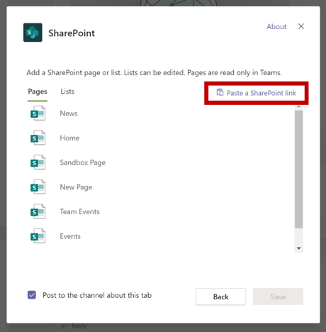
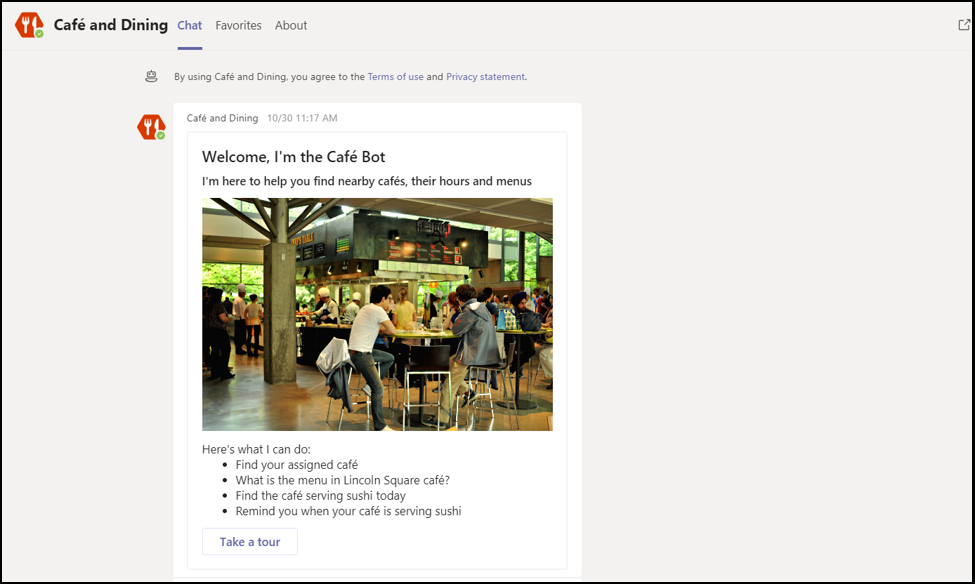

# Astuces pour une soumission d’Microsoft Teams d’application réussie

>[!NOTE]
>Cette page sera dépréciée d’ici mai 2021. Pour plus d’informations sur la publication réussie de votre application, voir les instructions [de validation Teams store.](~/concepts/deploy-and-publish/appsource/prepare/teams-store-validation-guidelines.md)

Cet article traite des raisons courantes pour lesquelles la validation des applications envoyées échoue. Bien qu’il ne s’agit pas d’une liste exhaustive de tous les problèmes potentiels avec votre application, le fait de suivre ce guide augmente la probabilité que la soumission de votre application se passe la première fois. Pour plus d’informations, voir [Stratégies de certification](/legal/marketplace/certification-policies) de Marketplace commercial pour obtenir une liste complète des stratégies de validation.

>[!NOTE]
>**[La section 1140](/legal/marketplace/certification-policies#1140-teams)** est spécifique aux Microsoft Teams et la **[sous-section 1140.4](/legal/marketplace/certification-policies#11404-functionality)** traite des fonctionnalités requises pour Teams applications.

## Recommandations de validation & cas de test les plus échoués

### &#9989; considérations générales

* Assurez-vous que vous utilisez la version 1.4.1 ou une version ultérieure du [SDK Microsoft Teams.](https://www.npmjs.com/package/@microsoft/teams-js)
* Ne modifiez pas votre application lorsque le processus de validation est en cours. Cela nécessite une revalidation complète de votre application.
* Votre app ne doit pas cesser de répondre, se terminer de manière inopinée ou contenir des erreurs de programmation. Si un problème se produit, votre application doit échouer et fournir des informations valides pour la voie à suivre à l’utilisateur.
* Votre application ne doit pas télécharger, installer ou lancer automatiquement du code exécutable dans l’environnement utilisateur. Tous les téléchargements doivent demander une autorisation explicite à l’utilisateur.
* Les documents que vous associez à votre expérience, tels que les descriptions et la documentation de support, doivent être exacts. Utilisez correctement l'orthographe, les majuscules, la ponctuation et la grammaire.
* Fournir des informations d’aide et de support. Il est vivement recommandé que votre application inclue un lien d’aide ou de FAQ pour la première utilisation de l’expérience utilisateur. Pour toutes les applications personnelles, nous vous recommandons de fournir votre page d’aide en tant qu’onglet personnel pour une meilleure expérience utilisateur.
* Toutes les applications doivent avoir une visite visuelle, telle que **Prendre** une visite guidée ou un **Guide** d’application dans son écran de configuration, qui parle des fonctionnalités de l’application et de l’intégration nécessaire aux endroits suivants :
    * Page de description dans le Store (description longue).
    * Écran de configuration de l’onglet.
    * Message de bienvenue pour un bot.
    * Métadonnées source de l’application.
    * Écran de configuration du connecteur.

* La visite visuelle peut être une vidéo, une capture d’écran, un lien vers un onglet statique avec les détails de l’application. Toutes ces références doivent se trouver dans l’environnement Teams de travail.

     

* Incrémentez le numéro de version de votre application dans le manifeste si vous a modifiez votre soumission.
* L’application ne doit pas sortir les utilisateurs de Teams pour les scénarios utilisateur principaux. Les cibles de liens dans les applications ne doivent pas être en lien avec un navigateur externe. Les cibles de liaison doivent être en lien avec les éléments div contenus dans Teams, par exemple, les modules de tâche et les onglets. 
* L’utilisation de modules de tâche ou d’onglets est suggérée pour afficher des informations aux utilisateurs dans Teams.
* Tous les scénarios principaux et non principaux doivent être effectués dans l’environnement Teams à l’exception des éléments suivants :
  * Politique de confidentialité
  * Conditions d’utilisation (TOU)
  * Lien du site web
  * Processus d’inscription

* Les applications personnelles permettent aux utilisateurs de partager du contenu à partir d’une expérience d’application personnelle avec d’autres membres de l’équipe.

### &#9989; fournir une expérience de signature, de signature et d’inscription claire et simple

* Si votre application ou votre add-in dépend de comptes ou de services externes, l’expérience de vous inscrire, de vous inscrire et de vous y inscrire doit être visible et accessible dans toutes les fonctionnalités de votre application.
* Si une option de signature explicite est fournie à l’utilisateur, une option de sortie doit être disponible (même si l’application utilise l’authentification [silencieuse).](../../../../tabs/how-to/authentication/auth-silent-aad.md)
* L’option de sortie de l’application doit uniquement se sortir de la fonctionnalité de votre application et non de l’Teams client.
* Au minimum, l’option de sortie doit se sortir des mêmes fonctionnalités que l’option de signature. Par exemple, si l’option de signature inclut l’extension de messagerie et l’onglet, l’option de sortie doit inclure à la fois l’extension de messagerie et l’onglet.

* Assurez-vous qu’il existe toujours un moyen d’inverser les comportements suivants (ou similaires) :
  * Sign-in => sign-out.
  * Lier un compte/service => dissocier un compte/service.
  * Connecter compte/service => déconnecter un compte/service.
  * Autoriser un compte/service => autoriser/refuser un compte/service.
  * Inscrivez un compte/service => inscrire/désabonner un compte/service.
* Si votre application nécessite un compte ou un service, vous devez fournir un moyen à l’utilisateur de s’inscrire ou de créer une demande d’inscription. Une exception peut être accordée si votre application nécessite une licence à utiliser. Dans de tels scénarios, fournissez des instructions claires pour l’inscription d’un nouvel utilisateur.
* Fournissez des instructions claires sur la façon de faire suivre à un nouvel utilisateur la façon de s’inscrire pour utiliser vos services d’application. Si aucun lien d’inscription prêt n’est disponible, fournissez des instructions précises dans les domaines suivants :

> [!div class="checklist"]
>
> * dans la section description de votre application.
> * dans le message de bienvenue de votre application.
> * dans le message d’aide de votre application.
> * dans la fenêtre dans laquelle vous demandez à un utilisateur de se connecter à vos services.

* Les applications sans flux d’inscription facile doivent également inclure un onglet d’aide ou un lien vers une page web, où un nouvel utilisateur peut voir des instructions détaillées sur la configuration de Teams application. Fournissez des informations détaillées pour vous assurer qu’un nouvel utilisateur n’est pas bloqué lors de la première tentative de votre application.
* Les fonctionnalités de signature et de sortie doivent fonctionner sur les clients mobiles. Veillez à utiliser [Microsoft Teams SDK](https://www.npmjs.com/package/@microsoft/teams-js) version 1.4.1 ou ultérieure.

Pour plus d’informations sur l’authentification, voir :

* [Documentation sur l’authentification](../../../authentication/authentication.md)
* [Exemple d’authentification de bot dans Node](https://github.com/OfficeDev/microsoft-teams-sample-auth-node)
* [Exemple d’authentification d’onglet dans node](https://github.com/OfficeDev/microsoft-teams-sample-complete-node)
* [Authentification tab/bot dans C#/.NET](https://github.com/OfficeDev/microsoft-teams-sample-complete-csharp)

### &#9989; temps de réponse doit être raisonnable

* **Onglets**. Si une réponse à une action prend plus de trois secondes, vous devez fournir un message de chargement ou un avertissement.
* **Bots**. Une réponse à une commande utilisateur doit se produire dans un délai de deux secondes. Si un traitement plus long est nécessaire, votre application doit afficher un indicateur de saisie.
* **Extensions de composition**. Une réponse à une commande utilisateur doit se produire dans un délai de cinq secondes.

> [!TIP]
> Assurez-vous que votre application affiche un indicateur de chargement ou une forme d’avertissement lorsque la réponse de votre application est plus longue que prévu.

### &#9989; tabulation ne doit pas avoir une navigation en couches ou chrome excessive

* Les onglets doivent fournir du contenu centré et éviter les éléments d’interface utilisateur inutiles. Il s’agit généralement d’une navigation en couches ou imbrique inutile, d’une interface utilisateur superflue ou non pertinente à côté du contenu ou de tout lien qui permet à l’utilisateur d’ajouter du contenu non lié. Par exemple, l’affichage Onglet suivant omet les menus de navigation et affiche uniquement le contenu principal :

  

* Les onglets doivent être de nature légère et ne pas inclure de navigation complexe.
* Les onglets de canal qui ont des fonctionnalités d’édition complexes au sein de l’application doivent ouvrir l’affichage de l’éditeur dans une fenêtre multiple plutôt que dans un onglet.
* Les onglets de canal ne doivent pas fournir de barre d’application avec des icônes dans le rail gauche qui entrent en conflit avec le Teams navigation principale.
* Les onglets ne doivent pas présenter de barre d’application avec des icônes dans le rail gauche qui entrent en conflit avec le Teams navigation principale.
* Les onglets qui ont des fonctionnalités d’édition complexes au sein de l’application doivent ouvrir l’affichage de l’éditeur dans une fenêtre multiple plutôt que dans l’onglet.
* S’il existe plusieurs options d’affichage, envisagez de disposer d’un menu de config d’onglets dans le choix de l’utilisateur. Par exemple, au lieu d’incorporer un menu à l’intérieur de l’onglet, placez le menu dans la page de configuration afin que l’affichage de l’onglet réel soit propre et concentré.
* Incluez un *onglet d’aide* en tant qu’onglet statique pour conseiller les utilisateurs sur la configuration, l’inscription et l’utilisation de votre application.
* Veuillez inclure un *onglet Paramètres* qui est disponible à partir de l’en-tête de l’application.

### &#9989; la configuration de l’onglet doit se produire dans l’écran de configuration

* L’écran de configuration doit expliquer clairement la valeur de l’expérience et comment configurer l’onglet.
* Le processus de configuration doit toujours offrir aux utilisateurs un moyen de continuer et de ne pas mettre fin à l’expérience utilisateur. Par exemple, n’affichez pas de tableau vide une fois que l’utilisateur a configuré l’onglet.
* Le processus de signature utilisateur doit faire partie du processus de configuration. Assurez-vous de l’effectuer dans l’interface utilisateur de l’onglet. Une fois que l’utilisateur a terminé la configuration et chargé l’onglet, aucune action supplémentaire n’est requise.
* N’affichez pas l’intégralité de votre page web dans la fenêtre de configuration de la signature.
* Un utilisateur doit toujours être en mesure de terminer l’expérience de configuration, même s’il ne peut pas trouver immédiatement le contenu qu’il recherche.
* L’expérience de configuration doit fournir des options pour que l’utilisateur trouve son contenu, épingle une URL ou crée du contenu s’il n’existe pas.
* L’expérience de configuration doit rester dans Teams contexte. L’utilisateur ne doit pas avoir à quitter l’expérience de configuration pour créer du contenu, puis revenir à Teams pour l’épingler.
* Utilisez efficacement la zone de laport d’affichage disponible. Ne le perdez pas en utilisant des logos énormes à l’intérieur de la fenêtre de configuration.

### &#9989; onglets dans le canal - Accès des membres

* Un onglet configuré par un membre dans une étendue de canal doit être accessible aux autres membres sans avoir à demander d’autorisations au membre qui a configuré l’onglet.
* L’application doit fournir les options de gestion des autorisations à l’avance si l’onglet est pour une utilisation privée ou restreinte ou nécessite des autorisations du membre qui a configuré l’onglet.

### &#9989; bots doivent toujours être réactifs et échouer normalement

Votre bot doit répondre à n’importe quelle commande et non à l’utilisateur. Voici quelques conseils pour aider votre bot à répondre intelligemment aux utilisateurs :

* **Utilisez des listes de commandes.** L’analyse de l’entrée utilisateur ou la prévision de l’intention de l’utilisateur est difficile. Au lieu de laisser les utilisateurs deviner ce que votre bot peut faire, fournissez une liste de commandes que votre bot comprend.

* **Incluez une commande d’aide.** Les utilisateurs sont susceptibles de taper « Aide » lorsqu’ils sont perdus ou lorsque votre bot ne répond pas comme prévu. Incluez une commande d’aide qui décrit la façon dont la valeur de votre application sera expérimentée, ainsi que toutes les commandes valides.

* **Incluez du contenu d’aide ou des conseils lorsque votre bot est perdu.** Lorsque votre bot ne comprend pas l’entrée utilisateur, il doit suggérer une autre action. Par exemple, *« Désolé, je ne comprends pas. Tapez « aide » pour plus d’informations. »* Ne répondez pas par un message d’erreur ou simplement par « *Je ne comprends pas*».

### &#9989; de commande d’aide

* La commande d’aide doit être précise et les réponses de l’application doivent être dans un format de carte adaptative avec un contenu actionnable pour au moins six commandes.
* Si une application possède moins de six commandes, vérifiez si toutes les commandes sont présentes dans la carte adaptative.

  

* **Utiliser des cartes adaptatives et des modules de tâche pour** rendre la réponse du bot claire et actionnable 
 [Les cartes adaptatives avec des boutons qui appelaient des modules de tâche améliorent](/task-modules-and-cards/task-modules/task-modules-bots.md) l’expérience utilisateur du bot. Ces cartes et boutons sont plus faciles à utiliser sur un appareil mobile que lorsque votre utilisateur tape les commandes. En outre, les réponses du bot ne doivent pas être textuelles avec du texte long. Les bots doivent utiliser des cartes adaptatives et des modules de tâche à la place de l’interface utilisateur de conversation et des réponses texte longues.

* **Réfléchissez à toutes les étendues.** Assurez-vous que votre bot fournit des réponses appropriées lorsqu’il est mentionné () dans `@*botname*` un canal et dans des conversations personnelles. Si votre bot ne fournit pas de contexte significatif dans l’étendue personnelle ou d’équipe, désactivez cette étendue via le manifeste. (Consultez le `bots` bloc dans la référence Microsoft Teams schéma [de](../../../../resources/schema/manifest-schema.md#bots)manifeste.)

* **Inclure une équipe, une conversation de groupe ou une conversation 1:1.** Les notifications de bot doivent inclure une équipe, une conversation de groupe ou une conversation un-à-un avec du contenu pertinent pour votre public.

* **Ne pas pousser les données sensibles**. Les bots ne doivent pas pousser de données sensibles vers une équipe, une conversation de groupe ou une conversation 1:1, où une audience ne doit pas afficher ces données.

* **Fournissez un message de bienvenue.** Le bot doit fournir un message de bienvenue fre qui inclut un didacticiel interactif avec des cartes carrousel ou des boutons « essayer », pour encourager l’engagement.

### &#9989; bots personnels doivent toujours envoyer un message de bienvenue lors du premier lancement

Un message de bienvenue est la meilleure façon de définir le ton de votre bot de conversation personnel. Il s’agit de la première interaction entre un utilisateur et le bot. Un message de bienvenue peut encourager l’utilisateur à continuer à explorer l’application. Si le message d’accueil ou d’introduction est déroutant ou peu clair, les utilisateurs ne voient pas immédiatement la valeur de l’application et perdent leur intérêt.
Consultez la section suivante pour obtenir les conditions requises pour les messages de bienvenue :

> [!Note]
> Un message de bienvenue est facultatif pour un bot de canal.

### Conditions requises pour les messages de bienvenue

* Incluez une proposition de valeur dans la visite guidée d’accueil.
* Fournir des instructions pour l’utilisation de l’application.
* Incluez des instructions sur la façon de vous inscrire et de configurer votre application.
* Présentez un texte facile à lire et un dialogue simple, de préférence une carte avec un bouton de visite guidée actionnable qui charge un module de tâche.
* Restez simple et utilisable avec des boutons et des cartes , évitez les longues discussions.
* Incluez des cartes adaptatives et des boutons pour rendre le message de bienvenue plus utilisable.
* Invoke the welcome message with one ping, not two or more simultaneous pings.
* Un message de bienvenue doit uniquement être affiché à l’utilisateur qui a configuré l’application, de préférence dans une conversation personnelle 1:1.
* Les applications personnelles doivent toujours fournir un message de bienvenue à un utilisateur.
* N’envoyez jamais de conversation personnelle à tous les membres de l’équipe ; il est considéré comme du courrier indésirable.
* Ne jamais envoyer le message de bienvenue plus d’une fois. La répétition du même message de bienvenue à intervalles réguliers n’est pas autorisée et est considérée comme un courrier indésirable.

#### Éviter le courrier indésirable de bienvenue

* **Message de canal par bot**. Ne pas envoyer de courrier indésirable aux utilisateurs en créant des billets de conversation distincts. Créez un billet de thread unique avec des réponses dans le même thread.
* **Conversation personnelle par bot**. N’envoyez pas plusieurs messages. Envoyez un message avec des informations complètes. La répétition du même message de bienvenue à intervalles réguliers n’est pas autorisée et est considérée comme un courrier indésirable.

#### Messages de bienvenue du bot de notification uniquement

Les bots de notification uniquement doivent envoyer un message de bienvenue qui inclut un message transmettant « Je suis un bot de notification uniquement et ne pourra pas répondre à vos *conversations*».

#### Messages de bienvenue dans l’étendue personnelle

   * **Rendez votre message concis et informatif.** L’expérience utilisateur et les connaissances de votre application varient. Un utilisateur a peut-être utilisé votre application sur une autre plateforme ou ne connaît rien de votre application. Vous souhaitez adapter votre message à tous les publics et, en quelques phrases, expliquer ce que fait votre bot et les façons d’interagir avec celui-ci. Vous devez également expliquer la valeur de l’application et la façon dont les utilisateurs pourront tirer parti de son utilisation.

* **Rendre votre message actionnable.** Pensez à la première chose que vous souhaitez que les utilisateurs font après l’installation de votre application. Existe-t-il une commande qu’ils doivent essayer ? Existe-t-il une autre expérience d’intégration à connaître ? Doivent-ils se connecter ? Vous pouvez ajouter des actions sur une carte adaptative ou fournir des exemples spécifiques tels que « Essayez de *demander...*», « C’est ce que *je peux faire...*».

#### Messages de bienvenue dans l’étendue de l’équipe ou du canal

Les choses sont légèrement différentes lorsque le bot est ajouté pour la première fois à un canal. Normalement, vous ne devez pas envoyer de message 1:1 à tous les membres de l’équipe, mais le bot peut envoyer un message de bienvenue dans le canal.

### &#9989; mobile, pas de vente à prix moyen ou de paiement direct

* Vos onglets, cartes adaptatives, messages de bot et contenu dans les modules de tâche doivent être réactifs pour une variété de tailles d’écran d’appareil mobile.
* Les applications qui permettent de prendre en charge iOS doivent être entièrement fonctionnelles sur la dernière iPad l’aide de la dernière version d’iOS.
* Ne doit pas inclure de références directes à des achats in-app, des offres d’essai, des offres pour les versions payantes ou des liens vers des magasins en ligne où les utilisateurs peuvent acheter ou acquérir d’autres contenus, applications ou modules à partir de votre application Teams sur un système d’exploitation mobile (Android, iOS).
* La version iOS ou Android du add-in ne doit pas afficher d’interface utilisateur ou de langue, ni de lien vers d’autres applications, des modules ou un site web demandant à l’utilisateur de payer.
* Les pages de politique de confidentialité et de conditions d’utilisation associées ne doivent pas non plus être liées à une interface utilisateur commerciale ou au Store.

### &#9989; ne publiez pas de données sensibles à une audience qui n’est pas destinée à afficher les données

Votre application Teams ne doit pas publier de données sensibles telles que la carte bancaire ou l’instrument de paiement financier, les informations d’identification personnelle (PIN), la santé ou les informations de suivi des contacts à une audience qui n’a pas l’intention d’afficher ces données.

### &#9989; ne pas transmettre les détails des paiements financiers ou effectuer de transactions financières via votre application Teams de paiement

* Votre application Teams ne doit pas demander aux utilisateurs d’effectuer un paiement directement dans Teams interface.
* Les applications ne peuvent pas transmettre les détails de l’instrument financier via l’utilisateur sur l’interface de l’application. Les applications ne peuvent transmettre aux utilisateurs des liens vers des services de paiement sécurisés que s’ils sont divulgués dans les conditions d’utilisation de l’application, la politique de confidentialité et toute page de profil ou site web de l’application avant qu’un utilisateur accepte d’utiliser l’application.

### &#9989; effacer l’avertissement avant de télécharger des fichiers ou des fichiers exécutables ( `.exe` ) dans l’environnement d’un utilisateur

Avertissez les utilisateurs avant que votre application télécharge des fichiers ou des fichiers exécutables ( `.exe`  ) sur l’ordinateur ou l’environnement de l’utilisateur.

### &#9989; extensions de messagerie doivent fournir du texte d’aide et être faciles à lire

* L’extension de messagerie basée sur la recherche doit fournir un texte d’aide sur la façon de rechercher efficacement (par exemple, afficher des exemples d’entrée).
* Les modules de tâche doivent inclure une icône et un nom court qu’ils contiennent ou créent à partir de l’application.
* Les `@mention` exécutables d’extension de message doivent être clairs, faciles à comprendre et faciles à lire.

## Attestation d’Publisher M365

### &#9989; l’attestation Publisher dans l’Partner Center

* Pour plus d’informations, [reportez-vous à la](/microsoft-365-app-certification/docs/attestation) documentation complète Publisher attestation d’attestation d’attestation d’identité.
* Suivez les étapes de la section Publisher flux de travail [d’attestation](/microsoft-365-app-certification/docs/userguide#3publisher-attestation-workflow) d’attestation pour terminer le processus d’attestation d’éditeur. Écrivez dans appcert@microsoft.com pour toute question.
* Pour plus d’informations, voir le [guide](/azure/active-directory/develop/troubleshoot-publisher-verification) de résolution des problèmes.
* Terminez l’attestation d’auto-attestation par le biais de l’Centre partenaires. Remplissez le questionnaire Self-Assessment sous **Conformité des applications.**

## Voir aussi

* [En savoir plus sur les stratégies Teams d’approbation d’application](/legal/marketplace/certification-policies#1140-teams)
* [Section 100 — Général](/legal/marketplace/certification-policies#100-general)
* [Section 1100.5 — Contrôle client](/legal/marketplace/certification-policies#11005-customer-control)
