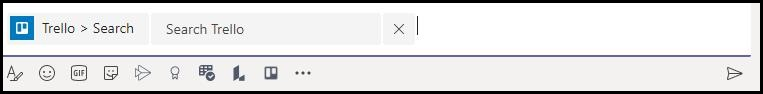

# Astuces une soumission réussie d’Microsoft Teams’applicationTips for a successful Microsoft Teams app submission

>[!NOTE]
>Cette page sera dépréciée d’ici mai 2021.This page will be deprecated by May 2021. Pour plus d’informations sur la publication réussie de votre application, consultez les [lignes directrices Teams validation des magasins de détail.](~/concepts/deploy-and-publish/appsource/prepare/teams-store-validation-guidelines.md)For more information on successfully publishing your app, see the [Teams store validation guidelines](~/concepts/deploy-and-publish/appsource/prepare/teams-store-validation-guidelines.md).

Cet article traite des raisons courantes pour lesquelles les applications soumises échouent à la validation.This article addresses common reasons submitted apps fail validation. Bien qu’il ne soit pas destiné à être une liste exhaustive de tous les problèmes potentiels avec votre application, suivre ce guide augmentera la probabilité que la soumission de votre application passera la première fois.While it's not intended to be an exhaustive list of all potential issues with your app, following this guide will increase the likelihood that your app submission will pass the first time. Pour plus d’informations, consultez [les politiques de certification du marché](/legal/marketplace/certification-policies) commercial pour une longue liste de politiques de validation.For more information, see [Commercial marketplace certification policies](/legal/marketplace/certification-policies) for an extensive list of validation policies.

>[!NOTE]
>**[L’article 1140](/legal/marketplace/certification-policies#1140-teams)** est spécifique Microsoft Teams **[et la sous-section 1140.4 traite](/legal/marketplace/certification-policies#11404-functionality)** des exigences de fonctionnalité pour Teams applications.**[Section 1140](/legal/marketplace/certification-policies#1140-teams)** is specific to Microsoft Teams and **[sub-section 1140.4](/legal/marketplace/certification-policies#11404-functionality)** addresses functionality requirements for Teams apps.

## Lignes directrices de validation & cas de test les plus échouésValidation guidelines & most failed test cases

### &#9989; considérations générales&#9989; General considerations

* Assurez-vous d’utiliser la version 1.4.1 ou plus tard [de la Microsoft Teams SDK](https://www.npmjs.com/package/@microsoft/teams-js).Ensure you are using version 1.4.1 or later of the [Microsoft Teams SDK](https://www.npmjs.com/package/@microsoft/teams-js).
* N’modifiez pas votre application pendant que le processus de validation est en cours.Don't make changes to your app while the validation process is in progress. Pour ce faire, vous aurez besoin d’une revalidation complète de votre application.Doing so will require a complete revalidation of your app.
* Votre app ne doit pas cesser de répondre, se terminer de manière inopinée ou contenir des erreurs de programmation.Your app must not stop responding, end unexpectedly, or contain programming errors. En cas de problème, votre application doit échouer et fournir des informations valides pour la voie à suivre pour l’utilisateur.If an issue occurs, your app must fail and provide valid information for the way-forward to the user.
* Votre application ne doit pas télécharger, installer ou lancer automatiquement un code exécutable dans l’environnement utilisateur.Your app must not automatically download, install, or launch any executable code in the user environment. Tous les téléchargements doivent demander l’autorisation explicite de l’utilisateur.All downloads must seek explicit permission from the user.
* Tout matériel que vous associez à votre expérience, comme les descriptions et la documentation à l’appui, doit être exact.Any material that you associate with your experience, such as descriptions and support documentation, must be accurate. Utilisez correctement l'orthographe, les majuscules, la ponctuation et la grammaire.Use correct spelling, capitalization, punctuation, and grammar in your descriptions and materials.
* Fournir de l’aide et de l’information de soutien.Provide help and support information. Il est fortement recommandé que votre application inclue un lien d’aide ou de FAQ pour l’expérience utilisateur de première série.It's highly recommended that your app include a help or FAQ link for the first-run user experience. Pour toutes les applications personnelles, nous vous recommandons de fournir votre page d’aide comme onglet personnel pour une meilleure expérience utilisateur.For all personal apps, we recommend providing your help page as a personal tab for a better user experience.
* Toutes les applications doivent avoir une visite visuelle, comme **Take a Tour ou** un App Guide **dans** son écran de configuration qui parle des fonctionnalités de l’application et de l’intégration nécessaire dans les endroits suivants :All apps must have a visual tour, such as **Take a Tour** or an **App Guide** in its configuration screen that talks about the app features and necessary integration in the following places:
    * La page d’inscription du magasin (Longue Description).The store listing page (Long Description).
    * Écran de configuration d’onglet.Tab configuration screen.
    * Message de bienvenue pour un bot.Welcome message for a bot.
    * Métadonnées source d’application.App source metadata.
    * Écran de configuration du connecteur.Connector configuration screen.

* La visite visuelle peut être une vidéo, capture d’écran, un lien vers un onglet statique avec les détails de l’application.The visual tour can be a  video, screenshot, a link to a static tab with app details. Toutes ces références doivent être dans l’Teams environnement.All these references must be within the Teams environment.

      

* Incrément votre numéro de version d’application dans le manifeste si vous faites des changements manifestes à votre soumission.Increment your app version number in the manifest if you make any manifest changes to your submission.
* L’application ne doit pas sortir les utilisateurs de l’Teams pour les scénarios utilisateur de base.The app must not take users out of Teams for core user scenarios. Les cibles de lien dans les applications ne doivent pas être lier à un navigateur externe.Link targets in apps must not link to an external browser. Les cibles de liaison doivent être lier à des éléments div contenus dans Teams, par exemple, des modules de tâches et des onglets.Link targets must link to div elements contained within Teams, for example, task modules and tabs. 
* L’utilisation de modules de tâches ou d’onglets est suggérée pour afficher des informations aux utilisateurs dans Teams.Using task modules or tabs is suggested to display information to users within Teams.
* Tous les scénarios de base et non essentiels doivent être complétés dans l’environnement Teams, à l’exception de :All core and non-core scenarios must be completed within the Teams environment except for:
  * Politique de confidentialitéPrivacy Policy
  * Conditions d’utilisation (TOU)Terms Of Use (TOU)
  * Lien vers le site WebWebsite link
  * Processus d’inscriptionSign-up process

* Les applications personnelles permettent aux utilisateurs de partager du contenu à partir d’une expérience d’application personnelle avec d’autres membres de l’équipe.Personal apps enable users to share content from a personal app experience with other team members.

### &#9989; fournir une expérience d’inscription, d’inscription et d’inscription claire et simple&#9989; Provide a clear and simple sign-in, sign-out, and sign-up experience

* Si votre application ou votre module d’inscription dépend de comptes ou de services externes, l’expérience d’inscription, d’inscription et d’inscription doit être apparente et accessible à toutes les fonctionnalités de votre application.If your app or add-in depends on external accounts or services, the sign-in, sign-out, and sign-up experience must be apparent and reachable across all capabilities in your app.
* S’il existe une option de connectement explicite fournie à l’utilisateur, il doit y avoir une option de dédicdicotation correspondante (même si l’application utilise [l’authentification silencieuse).](../../../../tabs/how-to/authentication/auth-silent-aad.md)If there is an explicit sign-in option provided to the user, there must be a corresponding sign-out option (even if the app is using [silent authentication](../../../../tabs/how-to/authentication/auth-silent-aad.md)).
* L’option de dédicage ne doit signer l’utilisateur que hors de la capacité de votre application et non hors de la Teams client.The sign-out option must only sign the user out of your app's capability and not out of the Teams client.
* Au minimum, l’option de déd déd 100 % doit dédant l’utilisateur des mêmes fonctionnalités accessibles avec l’option de connecte.At a minimum, the sign-out option must sign the user out of the same capabilities accessed with the sign-in option. Par exemple, si l’option de connecte inclut à la fois l’extension de messagerie et l’onglet, alors l’option de dédation doit inclure à la fois l’extension de messagerie et l’onglet.For example, if the sign-in option includes both messaging extension and tab, then the sign-out option must include both messaging extension and tab.

* Assurez-vous qu’il existe toujours un moyen d’inverser les comportements suivants (ou similaires) :Make sure there is always a way to reverse the following (or similar) behaviors:
  * Inscription => dédestment.Sign-in => sign-out.
  * Reliez un compte/service => un lien entre un compte ou un service.Link an account/service => unlink an account/service.
  * Connecter compte/service = déconnectez> compte/service.Connect an account/service => disconnect an account/service.
  * Autoriser un compte/service => autoriser/refuser un compte ou un service.Authorize an account/service => deauthorize/deny an account/service.
  * Enregistrer un compte/service => désinscrire/désabonner un compte/service.Register an account/service => deregister/unsubscribe an account/service.
* Si votre application nécessite un compte ou un service, vous devez fournir un moyen à l’utilisateur de s’inscrire ou de créer une demande d’inscription.If your app requires an account or service, you must provide a way for the user to sign-up or create a sign-up request. Une exception peut être accordée si votre application nécessite une licence d’utilisation.An exception may be granted if your app requires a license to use. Dans de tels scénarios, fournissez des instructions claires à un nouvel utilisateur pour qu’il s’insédo.In such scenarios, provide clear instructions for a new user to sign-up.
* Fournissez des conseils clairs sur la voie à suivre pour un nouvel utilisateur sur la façon de s’inscrire pour utiliser vos services d’application.Provide clear guidance on the way-forward to a new user on how to sign-up to use your app services. Si un lien d’inscription prêt n’est pas disponible, fournissez des indications précises dans les domaines suivants :If a ready sign-up link is not available, provide precise guidance in the following areas:

> [!div class="checklist"]
>
> * dans la section description de votre application.within your app's description section.
> * dans le message de bienvenue de votre application.in your app's welcome message.
> * dans le message d’aide de votre application.in your app's help message.
> * dans la fenêtre où vous demandez à un utilisateur de se connecter à vos services.in the window where you ask a user to sign-in to your services.

* Les applications sans flux d’inscription facile doivent également inclure un onglet d’aide ou un lien vers une page Web, où un nouvel utilisateur peut voir des conseils détaillés sur la configuration de votre Teams appe.Apps without an easy sign-up flow must also include a help tab or link to a web page, where a new user can see detailed guidance on configuring your Teams app. Fournissez des informations détaillées pour vous assurer qu’un nouvel utilisateur n’est pas bloqué lors de l’essai de votre application pour la première fois.Provide detailed information to ensure a new user is not blocked when trying your app for the first time.
* Les fonctionnalités de connect-in et de déd dédontoi doivent fonctionner sur les clients mobiles.Sign-in and sign-out functionality must work on mobile clients. Assurez-vous [d’utiliser Microsoft Teams version SDK](https://www.npmjs.com/package/@microsoft/teams-js) 1.4.1 ou plus tard.Ensure to use the [Microsoft Teams SDK](https://www.npmjs.com/package/@microsoft/teams-js) version 1.4.1 or later.

Pour plus d’informations sur l’authentification, voir :For additional information on authentication see:

* [Documentation d’authentificationAuthentication documentation](../../../authentication/authentication.md)
* [Exemple d’authentification bot dans NodeBot authentication sample in Node](https://github.com/OfficeDev/microsoft-teams-sample-auth-node)
* [Exemple d’authentification d’onglet dans NodeTab authentication sample in Node](https://github.com/OfficeDev/microsoft-teams-sample-complete-node)
* [Authentification onglet/bot dans C#/.NETTab/bot authentication in C#/.NET](https://github.com/OfficeDev/microsoft-teams-sample-complete-csharp)

### &#9989; temps de réponse doivent être raisonnables&#9989; Response times must be reasonable

* **Onglets**.**Tabs**. Si une réponse à une action prend plus de trois secondes, vous devez fournir un message de chargement ou un avertissement.If a response to an action takes more than three seconds, you must provide a loading message or warning.
* **Bots**.**Bots**. Une réponse à une commande utilisateur doit se produire dans les deux secondes.A response to a user command must occur within two seconds. Si un traitement plus long est nécessaire, votre application doit afficher un indicateur de dactylographie.If longer processing is required, your app must display a typing indicator.
* **Composez des extensions**.**Compose extensions**. Une réponse à une commande utilisateur doit se produire dans les cinq secondes.A response to a user command must occur within five seconds.

> [!TIP]
> Assurez-vous que votre application affiche un indicateur de chargement ou une forme quelconque d’avertissement lorsque votre application prend plus de temps que prévu pour répondre.Make sure your app displays a loading indicator or some form of warning when your app is taking longer than expected to respond.

### &#9989; tab ne doit pas avoir une navigation chromée ou superposée excessive&#9989; Tab content must not have excessive chrome or layered navigation

* Les onglets doivent fournir du contenu ciblé et éviter les éléments d’interface utilisateur inutiles.Tabs must provide focused content and avoid needless UI elements. Il s’agit généralement d’une navigation imbriquée ou superposée inutile, d’une interface utilisateur extérieure ou non pertinente à côté du contenu, ou de tout lien qui emmène l’utilisateur vers du contenu indépendant.This usually refers to unnecessary nested or layered navigation, an extraneous or irrelevant UI next to the content, or any links that take the user to unrelated content. Par exemple, la vue onglet suivante omet les menus de navigation et ne présente que le contenu principal :For example, the following tab view omits navigation menus and only showcases the main content:

  

* Les onglets doivent être légers et ne pas inclure de navigation complexe.Tabs must be light in nature and not include complex navigation.
* Les onglets de canal qui ont des capacités d’édition complexes au sein de l’application doivent ouvrir la vue éditeur dans une fenêtre multi plutôt qu’un onglet.Channel tabs that have complex editing capabilities within the app must open the editor view in a multi-window rather than a tab.
* Les onglets de canal ne doivent pas fournir une barre d’application avec des icônes dans le rail gauche qui entre en conflit avec la Teams navigation.Channel tabs must not provide an app bar with icons in the left rail that conflicts with the main Teams navigation.
* Les onglets ne doivent pas présenter une barre d’application avec des icônes dans le rail gauche qui entre en conflit avec la Teams navigation.Tabs must not present an app bar with icons in the left rail that conflict with the main Teams navigation.
* Les onglets qui ont des capacités d’édition complexes au sein de l’application doivent ouvrir la vue éditeur dans une fenêtre multi plutôt que dans l’onglet.Tabs that have complex editing capabilities within the app must open the editor view in a multi-window rather than in the tab.
* S’il existe plusieurs options de vue, envisagez d’avoir un menu config onglet pour l’utilisateur à choisir.If there are multiple view options, consider having a tab config menu for the user to choose from. Par exemple, au lieu d’intégrer un menu à l’intérieur de l’onglet, placez le menu dans la page de configuration afin que la vue de l’onglet réel soit propre et ciblée.For example, instead of embedding a menu inside the tab, put the menu in the configuration page so the actual tab view is clean and focused.
* Veuillez inclure un *onglet Aide* comme onglet statique pour conseiller les utilisateurs sur la façon de configurer, de vous inscrire et d’utiliser votre application.Please include a *Help* tab as a static tab to advise users how to configure, sign-up, and use your app.
* Veuillez inclure un onglet *Paramètres disponible* à partir de l’en-tête de l’application.Please include a *Settings* tab that is available from the app header.

### &#9989; configuration tab doit se produire dans l’écran de configuration&#9989; Tab configuration must happen in the configuration screen

* L’écran de configuration doit expliquer clairement la valeur de l’expérience et la façon de configurer l’onglet.The configuration screen must clearly explain the value of the experience and how to configure the tab.
* Le processus de configuration doit toujours fournir un moyen pour les utilisateurs de continuer et de ne pas mettre fin à l’expérience utilisateur.The configuration process must always provide a way for the users to continue and not end the user experience. Par exemple, ne montrez pas une carte vide après que l’utilisateur a configuré l’onglet.For example, do not show an empty board after the user has configured the tab.
* Le processus de connectage de l’utilisateur doit faire partie du processus de configuration.The user sign-in process must be a part of the configuration process. Assurez-vous de le compléter dans l’interface utilisateur onglet.Ensure to complete it in the Tab UI. Une fois que l’utilisateur a terminé la configuration et chargé l’onglet, aucune autre action n’est nécessaire.After the user has completed the configuration and loaded the tab, no further action is required.
* Ne montrez pas toute votre page Web dans la fenêtre contextée de configuration de dédation.Don't show your entire webpage within the sign-in configuration pop-up window.
* Un utilisateur doit toujours être en mesure de terminer l’expérience de configuration, même s’il ne peut pas immédiatement trouver le contenu qu’il recherche.A user must always be able to finish the configuration experience, even if they can’t immediately find the content they’re looking for.
* L’expérience de configuration doit fournir aux utilisateurs des options pour trouver leur contenu, épingler une URL ou créer du nouveau contenu s’il n’existe pas.The configuration experience must provide options for the user to find their content, pin a URL, or create new content if it doesn’t exist.
* L’expérience de configuration doit rester dans Teams contexte.The configuration experience must remain within the Teams context. L’utilisateur ne devrait pas avoir à quitter l’expérience de configuration pour créer du contenu, puis revenir à Teams pour l’épingler.The user shouldn’t have to leave the configuration experience to create content and then return to Teams to pin it.
* Utilisez efficacement la zone viewport disponible.Use the available viewport area efficiently. Ne le gaspillez pas sur l’utilisation d’énormes logos à l’intérieur de la configuration pop up.Do not waste it on using huge logos inside the configuration pop up.

### &#9989; tabs dans le canal - Accès des membres&#9989; Tabs in channel - Member access

* Un onglet configuré par un membre dans une étendue de canal doit être accessible aux autres membres sans avoir à demander l’autorisation du membre qui a configuré l’onglet.A tab configured by a member in a channel scope must be accessible to the other members without having to seek permissions from the member who configured the tab.
* L’application doit fournir les options de gestion des autorisations dès le départ si l’onglet est pour une utilisation privée ou restreinte ou nécessite des autorisations du membre qui a configuré l’onglet.The app must provide the permission management options upfront if the tab is for private or restricted use or requires any permissions from the member who configured the tab.

### &#9989; Bots doivent toujours être réactifs et échouer gracieusement&#9989; Bots must always be responsive and fail gracefully

Votre bot doit être réactif à n’importe quelle commande et non pas sans issue à l’utilisateur.Your bot must be responsive to any command and not dead-end the user. Voici quelques conseils pour aider votre bot à répondre intelligemment aux utilisateurs :Here are some tips to help your bot intelligently respond to users:

* **Utilisez des listes de commandes**.**Use command lists**. Il est difficile d’analyser l’entrée de l’utilisateur ou de prédire l’intention de l’utilisateur.Analyzing user input or predicting user intent is hard. Au lieu de laisser les utilisateurs deviner ce que votre bot peut faire, fournissez une liste de commandes que votre bot comprend.Instead of letting users guess what your bot can do, provide a list of commands your bot understands.

* **Inclure une commande d’aide**.**Include a help command**. Les utilisateurs sont susceptibles de taper « Aide » quand ils sont perdus ou lorsque votre bot ne répond pas comme prévu.Users are likely to type "Help" when they are lost or when your bot doesn't respond as expected. Incluez une commande d’aide qui décrit comment la valeur de votre application sera expérimentée avec toutes les commandes valides.Include a help command that describes how your app's value will be experienced along with all valid commands.

* **Incluez du contenu d’aide ou des conseils lorsque votre bot est perdu.****Include help content or guidance when your bot is lost**. Lorsque votre bot ne peut pas comprendre l’entrée de l’utilisateur, il doit suggérer une action alternative.When your bot cannot understand the user input, it must suggest an alternative action. Par exemple, *« Je suis désolé, je ne comprends pas. Tapez « aide » pour plus d’informations.*For example, *"I'm sorry, I don't understand. Type "help" for more information."* Ne répondez pas par un message d’erreur ou *tout simplement, « Je ne comprends pas ».*Don't respond with an error message or simply, *"I don't understand"*.

### &#9989; de commande d’aide&#9989; Help command response

* La commande d’aide doit être précise et les réponses de l’application doivent être dans un format de carte adaptative avec un contenu actionnable pour au moins six commandes.Help Command must be precise and the app responses must be in an adaptive card format with an actionable content for at least six commands.
* Si une application a moins de six commandes, vérifiez si toutes les commandes sont présentes dans la carte adaptative.If an app has less than six commands, check if all the commands are present in the adaptive card.

  

* **Utilisez des cartes adaptatives et des modules de tâches pour rendre votre réponse bot claire et actionnable** 
 [Les cartes adaptatives avec boutons invoquant des modules de tâches améliorent](/task-modules-and-cards/task-modules/task-modules-bots.md) l’expérience utilisateur du bot.**Use adaptive cards and task modules to make your bot response clear and actionable**
[Adaptive cards with buttons invoking task modules](/task-modules-and-cards/task-modules/task-modules-bots.md) enhance the bot user experience. Ces cartes et boutons sont plus faciles à utiliser dans un appareil mobile que votre utilisateur tapant les commandes.These cards and buttons are easier to use in a mobile device as opposed to your user typing the commands. Aussi bot réponses ne doivent pas être textuelles avec un texte long.Also bot responses must not be textual with long text. Les bots doivent utiliser des cartes adaptatives et des modules de tâches au lieu de l’interface utilisateur basée sur le chat conversationnel et de longues réponses textuelles.Bots must make use of adaptive cards and task modules instead of conversational chat based user interface and lengthy text responses.

* **Réfléchissez à toutes les portées**.**Think through all scopes**. Assurez-vous que votre bot fournit des réponses appropriées lorsqu’il est `@*botname*` mentionné ( ) dans un canal et dans les conversations personnelles.Be sure that your bot provides appropriate responses when mentioned (`@*botname*`) in a channel and in personal conversations. Si votre bot ne fournit pas de contexte significatif dans le champ d’application personnel ou des équipes, désactivez cette portée via le manifeste.If your bot does not provide meaningful context within the personal or teams scope, disable that scope via the manifest. (Voir le `bots` bloc dans la Microsoft Teams manifeste de [schémas](../../../../resources/schema/manifest-schema.md#bots).)(See the `bots` block in the [Microsoft Teams manifest schema reference](../../../../resources/schema/manifest-schema.md#bots).)

* **Incluez l’équipe, le chat de groupe, ou la conversation 1:1.****Include team, group chat, or 1:1 conversation**. Les notifications bot doivent inclure une équipe, un chat de groupe ou une conversation en tête-à-tête avec du contenu pertinent pour votre public.Bot notifications must include a team, a group chat, or a one-to-one conversation with relevant content for your audience.

* **Ne poussez pas les données sensibles**.**Do not push sensitive data**. Les bots ne doivent pas pousser les données sensibles vers une équipe, un chat de groupe ou une conversation 1:1, où il y a un public qui ne doit pas voir ces données.Bots must not push sensitive data to a team, a group chat, or a 1:1 conversation, where there is an audience who must not view that data.

* **Fournir un message de bienvenue**.**Provide a welcome message**. Bot doit fournir un message de bienvenue FRE qui comprend un tutoriel interactif avec des cartes carrousel ou « essayez-le » boutons, pour encourager l’engagement.Bot must provide an FRE welcome message that includes an interactive tutorial with carousel cards or "try it" buttons, to encourage engagement.

### &#9989; bots personnels doivent toujours envoyer un message de bienvenue lors du premier lancement&#9989; Personal bots must always send a welcome message on first launch

Un message de bienvenue est la meilleure façon de donner le ton à votre chat bot personnel.A welcome message is the best way to set the tone for your personal chat bot. Il s’agit de la première interaction d’un utilisateur avec le bot.This is the first interaction a user has with the bot. Un bon message de bienvenue peut encourager l’utilisateur à continuer à explorer l’application.A good welcome message can encourage the user to keep exploring the app. Si le message d’accueil ou d’introduction est déroutant ou peu clair, les utilisateurs ne verront pas immédiatement la valeur de l’application et ne perdront pas d’intérêt.If the welcome or introductory message is confusing or unclear, users won't see the value of the app immediately and lose interest.
Consultez la section suivante pour les exigences relatives aux messages de bienvenue :See the following section for welcome message requirements:

> [!Note]
> Un message de bienvenue est facultatif pour un bot de canal.A welcome message is optional for a channel bot.

### Exigences relatives aux messages de bienvenueWelcome message requirements

* Incluez une proposition de valeur avec la visite de bienvenue.Include a value proposition with the welcome tour.
* Fournir des conseils avancés pour l’utilisation de l’application.Provide way-forward guidance for using the app.
* Incluez des conseils sur la façon de vous inscrire et de configurer votre application.Include guidance on how to sign-up and configure your app.
* Présentez du texte facile à lire et un dialogue simple — de préférence une carte avec un bouton de visite de bienvenue actionnable qui charge un module de tâches.Present easy-to-read text and straightforward dialogue — preferably a card with an actionable welcome tour button that loads a task module.
* Gardez-le simple et utilisable avec des boutons et des cartes - éviter le texte long, le dialogue bavard.Keep it simple and usable with buttons and cards — avoid long text, chatty dialogue.
* Incluez des cartes et des boutons adaptatifs pour rendre le message de bienvenue plus utilisable.Include adaptive cards and buttons to make the welcome message more usable.
* Invoquez le message de bienvenue avec un ping, pas deux ou plusieurs pings simultanés.Invoke the welcome message  with one ping, not two or more simultaneous pings.
* Un message de bienvenue ne doit être affiché qu’à l’utilisateur qui a configuré l’application, de préférence dans un chat personnel 1:1.A welcome message must only be shown to the user who configured the app, preferably in a 1:1 personal chat.
* Les applications personnelles doivent toujours fournir un message de bienvenue à un utilisateur.Personal apps must always provide a welcome message to a user.
* N’envoyez jamais de chat personnel à tous les membres de l’équipe; il est considéré comme spam.Never send a personal chat to every member of the team; it is considered spam.
* N’envoyez jamais le message de bienvenue plus d’une fois.Never send the welcome message more than once. Répéter le même message de bienvenue sur des intervalles réguliers n’est pas autorisé et est considéré comme spamming.Repeating the same welcome message over regular intervals is not allowed and is considered spamming.

#### Évitez le message de bienvenue spammingAvoid welcome message spamming

* **Message de canal par bot**.**Channel message by bot**. Ne spammez pas les utilisateurs en créant de nouveaux messages de chat distincts.Don't spam users by creating separate new chat posts. Créez un seul thread avec des réponses dans le même thread.Create a single thread post with replies in the same thread.
* **Chat personnel par bot**.**Personal chat by bot**. N’envoyez pas plusieurs messages.Don't send multiple messages. Envoyez un message avec des informations complètes.Send one message with complete information. Répéter le même message de bienvenue sur des intervalles réguliers n’est pas autorisé et est considéré comme spamming.Repeating the same welcome message over regular intervals is not allowed and is considered spamming.

#### Messages de bienvenue bot notification uniquementNotification-only bot welcome messages

Les bots de notification uniquement doivent envoyer un message de bienvenue qui inclut un message transmettant : *« Je suis un bot de notification seulement et je ne pourrai pas répondre à vos conversations*».Notification-only bots must send a welcome message that includes a message conveying, *"I am a notification-only bot and will not be able to reply to your chats"*.

#### Messages de bienvenue dans le cadre personnelWelcome messages in the personal scope

   * **Rendez votre message concis et instructif.****Make your message concise and informative**. L’expérience utilisateur et les connaissances de votre application varient.The user experience and the knowledge of your app will vary. Un utilisateur peut avoir utilisé votre application sur une autre plate-forme ou ne rien savoir de votre application.A user may have used your app on another platform or know nothing about your app. Vous souhaitez adapter votre message à tous les publics et en quelques phrases expliquer ce que votre bot fait et les façons d’interagir avec elle.You want to tailor your message to all audiences and in a couple sentences explain what your bot does and the ways to interact with it. Vous devez également expliquer la valeur de l’application et comment les utilisateurs bénéficieront de son utilisation.You must also explain the value of the app and how the users will benefit from using it.

* **Rendre votre message accessible .****Make your message actionable**. Pensez à la première chose que vous voulez que les utilisateurs à faire après l’installation de votre application.Think about the first thing you want users to do after installing your app. Y at-il une commande cool qu’ils doivent essayer?Is there a cool command they must try? Y a-t-il une autre expérience d’onboarding qu’ils doivent connaître?Is there another onboarding experience they must know about? Ont-ils besoin de se connecter?Do they need to sign-in? Vous pouvez ajouter des actions sur une carte adaptative ou fournir des exemples spécifiques *tels que « Essayez de demander ... »,* *« C’est ce que je peux faire ... »*.You can add actions on an adaptive card or provide specific examples such as *“Try asking….”*, *“This is what I can do…”*.

#### Messages de bienvenue dans la portée de l’équipe ou du canalWelcome messages in the team or channel  scope

Les choses sont un peu différentes lorsque le bot est d’abord ajouté à un canal.Things are a little bit different when the bot is first added to a channel. Normalement, vous ne devriez pas envoyer un message 1:1 à tout le monde dans l’équipe, mais le bot peut envoyer un message de bienvenue dans le canal.Normally, you shouldn't send a 1:1 message to everyone on the team, but the bot can send a welcome message in the channel.

### &#9989; réactivité mobile, pas de vente directe ou de paiement&#9989; Mobile responsiveness, no direct upsell or payment

* Vos onglets, cartes adaptatives, messages bot et contenu dans les modules de tâches doivent être réactifs pour une variété de tailles d’écrans d’appareils mobiles.Your tabs, adaptive cards, bot messages and content in task modules must be responsive for a variety of mobile device screens sizes.
* Les applications qui soutiennent iOS doivent être entièrement fonctionnelles sur les dernières iPad en utilisant la dernière version d’iOS.Apps that support iOS must be fully functional on the latest iPad device using the latest version of iOS.
* Ne doit pas inclure de références directes aux achats intégrés, aux offres d’essai, aux offres de versions payantes ou aux liens vers des magasins en ligne où les utilisateurs peuvent acheter ou acquérir d’autres contenus, applications ou modules supplémentaires à partir de votre application Teams sur os mobile (Android, iOS).Must not include any direct references to in-app purchases, trial offers, offers for paid versions, or links to any online stores where users can purchase or acquire other content, apps, or add-ins from your Teams app on mobile OS (Android, iOS).
* La version iOS ou Android de l’add-in ne doit pas afficher d’interface utilisateur ou de langue ou de lien vers d’autres applications, add-ins ou site Web qui demandent à l’utilisateur de payer.The iOS or Android version of the add-in must not show any UI or language or link to any other apps, add-ins, or website that ask the user to pay.
* Les pages de politique de confidentialité et de conditions d’utilisation associées doivent également être exemptes de liens d’interface utilisateur ou de magasin commerciaux.The associated Privacy Policy and Terms of Use pages must also be free of any commerce UI or Store links.

### &#9989; ne publiez pas de données sensibles à un public qui n’a pas l’intention de&#9989; Do not post sensitive data to an audience not intended to view the data

Votre application Teams ne doit pas afficher de données sensibles telles que la carte de crédit ou l’instrument de paiement financier, les renseignements personnels identifiables (NIP), la santé ou les coordonnées d’un public qui n’a pas l’intention de les consulter.Your Teams app must not post sensitive data such as credit card or financial payment instrument, Personal Identifiable Information (PIN), health, or contact tracing information to an audience not intended to view that data.

### &#9989; ne transmettez pas de détails de paiement financier ou ne réalisez pas de transactions financières via votre Teams appe&#9989; Do not transmit financial payment details or complete financial transactions via your Teams app

* Votre Teams appe ne doit pas demander aux utilisateurs d’effectuer un paiement directement dans Teams interface.Your Teams app must not ask users to make a payment directly within Teams interface.
* Les applications ne peuvent pas transmettre les détails des instruments financiers par l’intermédiaire de l’utilisateur sur l’interface de l’application.Apps may not transmit financial instrument details through the user on the app interface. Les applications ne peuvent transmettre des liens vers des services de paiement sécurisés aux utilisateurs que si cela est divulgué dans les conditions d’utilisation de l’application, la politique de confidentialité et toute page de profil ou site Web de l’application avant qu’un utilisateur accepte d’utiliser l’application.Apps may only transmit links to secure payment services to users if this is disclosed in the app's Terms of Use, Privacy Policy, and any profile page or website for the app before a user agrees to use the app.

### &#9989; avertissement clair avant de télécharger des fichiers ou exécutables `.exe` () dans l’environnement d’un utilisateur&#9989; Clear warning before downloading any files or executable (`.exe`) into a user’s environment

Veuillez avertir les utilisateurs avant que votre application ne télécharge des fichiers ou exécutable `.exe`  ()dans la machine ou l’environnement de l’utilisateur.Please warn users before your app downloads any files or executable (`.exe`  )into the user's machine or environment.

### &#9989; extensions de messagerie doivent fournir du texte d’aide et être faciles à lire&#9989; Messaging extensions must provide help text and be easy to read

* L’extension de messagerie basée sur la recherche doit fournir du texte d’aide sur la façon de rechercher efficacement (par exemple, afficher l’entrée d’exemple).The search-based messaging extension must provide help text on how to effectively search (e.g., show example input).
* Les modules de tâches doivent inclure une icône et un nom court dans laquelle ils sont contenus ou créés à partir de l’application.Task modules must include an icon and a short name that they are contained in or created from the app.
* Les `@mention` exécutables d’extension de message doivent être clairs, faciles à comprendre et faciles à lire.The message extension `@mention` executables must be clear, easy to understand, and easy to read.

## Attestation Publisher M365M365 Publisher Attestation

### &#9989; compléter l’attestation Publisher dans le centre partenaire&#9989; Complete the Publisher Attestation in Partner Center

* Consultez la documentation complète [du programme Publisher attestation](/microsoft-365-app-certification/docs/attestation) pour plus de détails.Refer to the [Complete Publisher Attestation](/microsoft-365-app-certification/docs/attestation) program documentation for more details.
* Suivez les étapes de la section [Publisher de workflow d’attestation](/microsoft-365-app-certification/docs/userguide#3publisher-attestation-workflow) pour compléter le processus d’attestation de l’éditeur.Follow the steps in the [Publisher Attestation Workflow](/microsoft-365-app-certification/docs/userguide#3publisher-attestation-workflow) section to complete the publisher attestation process. Écrivez à appcert@microsoft.com pour toute question.Write to appcert@microsoft.com for any questions.
* Consultez le [guide de dépannage pour plus](/azure/active-directory/develop/troubleshoot-publisher-verification) d’informations.Refer to the [Troubleshooting guide](/azure/active-directory/develop/troubleshoot-publisher-verification) for additional information.
* Complétez l’auto-attestation par le centre partenaire.Complete the self attestation through partner center. Remplissez le questionnaire Self-Assessment sous conformité **app**.Fill the Self-Assessment questionnaire under **App Compliance**.

## Voir aussiSee also

* [En savoir plus sur les politiques Teams’approbation des applicationsLearn more about Teams app approval policies](/legal/marketplace/certification-policies#1140-teams)
* [Article 100 — GénéralSection 100 — General](/legal/marketplace/certification-policies#100-general)
* [Article 1100.5 — Contrôle de la clientèleSection 1100.5 — Customer control](/legal/marketplace/certification-policies#11005-customer-control)
