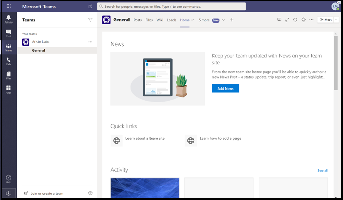

# Astuces une soumission réussie d’Microsoft Teams’application

>[!NOTE]
>Cette page sera dépréciée d’ici mai 2021. Pour plus d’informations sur la publication réussie de votre application, consultez les [lignes directrices Teams validation des magasins de détail.](~/concepts/deploy-and-publish/appsource/prepare/teams-store-validation-guidelines.md)

Cet article traite des raisons courantes pour lesquelles les applications soumises échouent à la validation. Bien qu’il ne soit pas destiné à être une liste exhaustive de tous les problèmes potentiels avec votre application, suivre ce guide augmentera la probabilité que la soumission de votre application passera la première fois. Pour plus d’informations, consultez [les politiques de certification du marché](/legal/marketplace/certification-policies) commercial pour une longue liste de politiques de validation.

>[!NOTE]
>**[L’article 1140](/legal/marketplace/certification-policies#1140-teams)** est spécifique Microsoft Teams **[et la sous-section 1140.4 traite](/legal/marketplace/certification-policies#11404-functionality)** des exigences de fonctionnalité pour Teams applications.

## Lignes directrices de validation & cas de test les plus échoués

### &#9989; considérations générales

* Assurez-vous d’utiliser la version 1.4.1 ou plus tard [de la Microsoft Teams SDK](https://www.npmjs.com/package/@microsoft/teams-js).
* N’modifiez pas votre application pendant que le processus de validation est en cours. Pour ce faire, vous aurez besoin d’une revalidation complète de votre application.
* Votre app ne doit pas cesser de répondre, se terminer de manière inopinée ou contenir des erreurs de programmation. En cas de problème, votre application doit échouer et fournir des informations valides pour la voie à suivre pour l’utilisateur.
* Votre application ne doit pas télécharger, installer ou lancer automatiquement un code exécutable dans l’environnement utilisateur. Tous les téléchargements doivent demander l’autorisation explicite de l’utilisateur.
* Tout matériel que vous associez à votre expérience, comme les descriptions et la documentation à l’appui, doit être exact. Utilisez correctement l'orthographe, les majuscules, la ponctuation et la grammaire.
* Fournir de l’aide et de l’information de soutien. Il est fortement recommandé que votre application inclue un lien d’aide ou de FAQ pour l’expérience utilisateur de première série. Pour toutes les applications personnelles, nous vous recommandons de fournir votre page d’aide comme onglet personnel pour une meilleure expérience utilisateur.
* Toutes les applications doivent avoir une visite visuelle, comme **Take a Tour ou** un App Guide **dans** son écran de configuration qui parle des fonctionnalités de l’application et de l’intégration nécessaire dans les endroits suivants :
    * La page d’inscription du magasin (Longue Description).
    * Écran de configuration d’onglet.
    * Message de bienvenue pour un bot.
    * Métadonnées source d’application.
    * Écran de configuration du connecteur.

* La visite visuelle peut être une vidéo, capture d’écran, un lien vers un onglet statique avec les détails de l’application. Toutes ces références doivent être dans l’Teams environnement.

     

* Incrément votre numéro de version d’application dans le manifeste si vous faites des changements manifestes à votre soumission.
* L’application ne doit pas sortir les utilisateurs de l’Teams pour les scénarios utilisateur de base. Les cibles de lien dans les applications ne doivent pas être lier à un navigateur externe. Les cibles de liaison doivent être lier à des éléments div contenus dans Teams, par exemple, des modules de tâches et des onglets. 
* L’utilisation de modules de tâches ou d’onglets est suggérée pour afficher des informations aux utilisateurs dans Teams.
* Tous les scénarios de base et non essentiels doivent être complétés dans l’environnement Teams, à l’exception de :
  * Politique de confidentialité
  * Conditions d’utilisation (TOU)
  * Lien vers le site Web
  * Processus d’inscription

* Les applications personnelles permettent aux utilisateurs de partager du contenu à partir d’une expérience d’application personnelle avec d’autres membres de l’équipe.

### &#9989; fournir une expérience d’inscription, d’inscription et d’inscription claire et simple

* Si votre application ou votre module d’inscription dépend de comptes ou de services externes, l’expérience d’inscription, d’inscription et d’inscription doit être apparente et accessible à toutes les fonctionnalités de votre application.
* S’il existe une option de connectement explicite fournie à l’utilisateur, il doit y avoir une option de dédicdicotation correspondante (même si l’application utilise [l’authentification silencieuse).](../../../../tabs/how-to/authentication/auth-silent-aad.md)
* L’option de dédicage ne doit signer l’utilisateur que hors de la capacité de votre application et non hors de la Teams client.
* Au minimum, l’option de déd déd 100 % doit dédant l’utilisateur des mêmes fonctionnalités accessibles avec l’option de connecte. Par exemple, si l’option de connecte inclut à la fois l’extension de messagerie et l’onglet, alors l’option de dédation doit inclure à la fois l’extension de messagerie et l’onglet.

* Assurez-vous qu’il existe toujours un moyen d’inverser les comportements suivants (ou similaires) :
  * Inscription => dédestment.
  * Reliez un compte/service => un lien entre un compte ou un service.
  * Connecter compte/service = déconnectez> compte/service.
  * Autoriser un compte/service => autoriser/refuser un compte ou un service.
  * Enregistrer un compte/service => désinscrire/désabonner un compte/service.
* Si votre application nécessite un compte ou un service, vous devez fournir un moyen à l’utilisateur de s’inscrire ou de créer une demande d’inscription. Une exception peut être accordée si votre application nécessite une licence d’utilisation. Dans de tels scénarios, fournissez des instructions claires à un nouvel utilisateur pour qu’il s’insédo.
* Fournissez des conseils clairs sur la voie à suivre pour un nouvel utilisateur sur la façon de s’inscrire pour utiliser vos services d’application. Si un lien d’inscription prêt n’est pas disponible, fournissez des indications précises dans les domaines suivants :

> [!div class="checklist"]
>
> * dans la section description de votre application.
> * dans le message de bienvenue de votre application.
> * dans le message d’aide de votre application.
> * dans la fenêtre où vous demandez à un utilisateur de se connecter à vos services.

* Les applications sans flux d’inscription facile doivent également inclure un onglet d’aide ou un lien vers une page Web, où un nouvel utilisateur peut voir des conseils détaillés sur la configuration de votre Teams appe. Fournissez des informations détaillées pour vous assurer qu’un nouvel utilisateur n’est pas bloqué lors de l’essai de votre application pour la première fois.
* Les fonctionnalités de connect-in et de déd dédontoi doivent fonctionner sur les clients mobiles. Assurez-vous [d’utiliser Microsoft Teams version SDK](https://www.npmjs.com/package/@microsoft/teams-js) 1.4.1 ou plus tard.

Pour plus d’informations sur l’authentification, voir :

* [Documentation d’authentification](../../../authentication/authentication.md)
* [Exemple d’authentification bot dans Node](https://github.com/OfficeDev/microsoft-teams-sample-auth-node)
* [Exemple d’authentification d’onglet dans Node](https://github.com/OfficeDev/microsoft-teams-sample-complete-node)
* [Authentification onglet/bot dans C#/.NET](https://github.com/OfficeDev/microsoft-teams-sample-complete-csharp)

### &#9989; temps de réponse doivent être raisonnables

* **Onglets**. Si une réponse à une action prend plus de trois secondes, vous devez fournir un message de chargement ou un avertissement.
* **Bots**. Une réponse à une commande utilisateur doit se produire dans les deux secondes. Si un traitement plus long est nécessaire, votre application doit afficher un indicateur de dactylographie.
* **Composez des extensions**. Une réponse à une commande utilisateur doit se produire dans les cinq secondes.

> [!TIP]
> Assurez-vous que votre application affiche un indicateur de chargement ou une forme quelconque d’avertissement lorsque votre application prend plus de temps que prévu pour répondre.

### &#9989; tab ne doit pas avoir une navigation chromée ou superposée excessive

* Les onglets doivent fournir du contenu ciblé et éviter les éléments d’interface utilisateur inutiles. Il s’agit généralement d’une navigation imbriquée ou superposée inutile, d’une interface utilisateur extérieure ou non pertinente à côté du contenu, ou de tout lien qui emmène l’utilisateur vers du contenu indépendant. Par exemple, la vue onglet suivante omet les menus de navigation et ne présente que le contenu principal :

  

* Les onglets doivent être légers et ne pas inclure de navigation complexe.
* Les onglets de canal qui ont des capacités d’édition complexes au sein de l’application doivent ouvrir la vue éditeur dans une fenêtre multi plutôt qu’un onglet.
* Les onglets de canal ne doivent pas fournir une barre d’application avec des icônes dans le rail gauche qui entre en conflit avec la Teams navigation.
* Les onglets ne doivent pas présenter une barre d’application avec des icônes dans le rail gauche qui entre en conflit avec la Teams navigation.
* Les onglets qui ont des capacités d’édition complexes au sein de l’application doivent ouvrir la vue éditeur dans une fenêtre multi plutôt que dans l’onglet.
* S’il existe plusieurs options de vue, envisagez d’avoir un menu config onglet pour l’utilisateur à choisir. Par exemple, au lieu d’intégrer un menu à l’intérieur de l’onglet, placez le menu dans la page de configuration afin que la vue de l’onglet réel soit propre et ciblée.
* Veuillez inclure un *onglet Aide* comme onglet statique pour conseiller les utilisateurs sur la façon de configurer, de vous inscrire et d’utiliser votre application.
* Veuillez inclure un onglet *Paramètres disponible* à partir de l’en-tête de l’application.

### &#9989; configuration tab doit se produire dans l’écran de configuration

* L’écran de configuration doit expliquer clairement la valeur de l’expérience et la façon de configurer l’onglet.
* Le processus de configuration doit toujours fournir un moyen pour les utilisateurs de continuer et de ne pas mettre fin à l’expérience utilisateur. Par exemple, ne montrez pas une carte vide après que l’utilisateur a configuré l’onglet.
* Le processus de connectage de l’utilisateur doit faire partie du processus de configuration. Assurez-vous de le compléter dans l’interface utilisateur onglet. Une fois que l’utilisateur a terminé la configuration et chargé l’onglet, aucune autre action n’est nécessaire.
* Ne montrez pas toute votre page Web dans la fenêtre contextée de configuration de dédation.
* Un utilisateur doit toujours être en mesure de terminer l’expérience de configuration, même s’il ne peut pas immédiatement trouver le contenu qu’il recherche.
* L’expérience de configuration doit fournir aux utilisateurs des options pour trouver leur contenu, épingler une URL ou créer du nouveau contenu s’il n’existe pas.
* L’expérience de configuration doit rester dans Teams contexte. L’utilisateur ne devrait pas avoir à quitter l’expérience de configuration pour créer du contenu, puis revenir à Teams pour l’épingler.
* Utilisez efficacement la zone viewport disponible. Ne le gaspillez pas sur l’utilisation d’énormes logos à l’intérieur de la configuration pop up.

### &#9989; tabs dans le canal - Accès des membres

* Un onglet configuré par un membre dans une étendue de canal doit être accessible aux autres membres sans avoir à demander l’autorisation du membre qui a configuré l’onglet.
* L’application doit fournir les options de gestion des autorisations dès le départ si l’onglet est pour une utilisation privée ou restreinte ou nécessite des autorisations du membre qui a configuré l’onglet.

### &#9989; Bots doivent toujours être réactifs et échouer gracieusement

Votre bot doit être réactif à n’importe quelle commande et non pas sans issue à l’utilisateur. Voici quelques conseils pour aider votre bot à répondre intelligemment aux utilisateurs :

* **Utilisez des listes de commandes**. Il est difficile d’analyser l’entrée de l’utilisateur ou de prédire l’intention de l’utilisateur. Au lieu de laisser les utilisateurs deviner ce que votre bot peut faire, fournissez une liste de commandes que votre bot comprend.

* **Inclure une commande d’aide**. Les utilisateurs sont susceptibles de taper « Aide » quand ils sont perdus ou lorsque votre bot ne répond pas comme prévu. Incluez une commande d’aide qui décrit comment la valeur de votre application sera expérimentée avec toutes les commandes valides.

* **Incluez du contenu d’aide ou des conseils lorsque votre bot est perdu.** Lorsque votre bot ne peut pas comprendre l’entrée de l’utilisateur, il doit suggérer une action alternative. Par exemple, *« Je suis désolé, je ne comprends pas. Tapez « aide » pour plus d’informations.* Ne répondez pas par un message d’erreur ou *tout simplement, « Je ne comprends pas ».*

### &#9989; de commande d’aide

* La commande d’aide doit être précise et les réponses de l’application doivent être dans un format de carte adaptative avec un contenu actionnable pour au moins six commandes.
* Si une application a moins de six commandes, vérifiez si toutes les commandes sont présentes dans la carte adaptative.

  

* **Utilisez des cartes adaptatives et des modules de tâches pour rendre votre réponse bot claire et actionnable** 
 [Les cartes adaptatives avec boutons invoquant des modules de tâches améliorent](/task-modules-and-cards/task-modules/task-modules-bots.md) l’expérience utilisateur du bot. Ces cartes et boutons sont plus faciles à utiliser dans un appareil mobile que votre utilisateur tapant les commandes. Aussi bot réponses ne doivent pas être textuelles avec un texte long. Les bots doivent utiliser des cartes adaptatives et des modules de tâches au lieu de l’interface utilisateur basée sur le chat conversationnel et de longues réponses textuelles.

* **Réfléchissez à toutes les portées**. Assurez-vous que votre bot fournit des réponses appropriées lorsqu’il est `@*botname*` mentionné ( ) dans un canal et dans les conversations personnelles. Si votre bot ne fournit pas de contexte significatif dans le champ d’application personnel ou des équipes, désactivez cette portée via le manifeste. (Voir le `bots` bloc dans la Microsoft Teams manifeste de [schémas](../../../../resources/schema/manifest-schema.md#bots).)

* **Incluez l’équipe, le chat de groupe, ou la conversation 1:1.** Les notifications bot doivent inclure une équipe, un chat de groupe ou une conversation en tête-à-tête avec du contenu pertinent pour votre public.

* **Ne poussez pas les données sensibles**. Les bots ne doivent pas pousser les données sensibles vers une équipe, un chat de groupe ou une conversation 1:1, où il y a un public qui ne doit pas voir ces données.

* **Fournir un message de bienvenue**. Bot doit fournir un message de bienvenue FRE qui comprend un tutoriel interactif avec des cartes carrousel ou « essayez-le » boutons, pour encourager l’engagement.

### &#9989; bots personnels doivent toujours envoyer un message de bienvenue lors du premier lancement

Un message de bienvenue est la meilleure façon de donner le ton à votre chat bot personnel. Il s’agit de la première interaction d’un utilisateur avec le bot. Un bon message de bienvenue peut encourager l’utilisateur à continuer à explorer l’application. Si le message d’accueil ou d’introduction est déroutant ou peu clair, les utilisateurs ne verront pas immédiatement la valeur de l’application et ne perdront pas d’intérêt.
Consultez la section suivante pour les exigences relatives aux messages de bienvenue :

> [!Note]
> Un message de bienvenue est facultatif pour un bot de canal.

### Exigences relatives aux messages de bienvenue

* Incluez une proposition de valeur avec la visite de bienvenue.
* Fournir des conseils avancés pour l’utilisation de l’application.
* Incluez des conseils sur la façon de vous inscrire et de configurer votre application.
* Présentez du texte facile à lire et un dialogue simple — de préférence une carte avec un bouton de visite de bienvenue actionnable qui charge un module de tâches.
* Gardez-le simple et utilisable avec des boutons et des cartes - éviter le texte long, le dialogue bavard.
* Incluez des cartes et des boutons adaptatifs pour rendre le message de bienvenue plus utilisable.
* Invoquez le message de bienvenue avec un ping, pas deux ou plusieurs pings simultanés.
* Un message de bienvenue ne doit être affiché qu’à l’utilisateur qui a configuré l’application, de préférence dans un chat personnel 1:1.
* Les applications personnelles doivent toujours fournir un message de bienvenue à un utilisateur.
* N’envoyez jamais de chat personnel à tous les membres de l’équipe; il est considéré comme spam.
* N’envoyez jamais le message de bienvenue plus d’une fois. Répéter le même message de bienvenue sur des intervalles réguliers n’est pas autorisé et est considéré comme spamming.

#### Évitez le message de bienvenue spamming

* **Message de canal par bot**. Ne spammez pas les utilisateurs en créant de nouveaux messages de chat distincts. Créez un seul thread avec des réponses dans le même thread.
* **Chat personnel par bot**. N’envoyez pas plusieurs messages. Envoyez un message avec des informations complètes. Répéter le même message de bienvenue sur des intervalles réguliers n’est pas autorisé et est considéré comme spamming.

#### Messages de bienvenue bot notification uniquement

Les bots de notification uniquement doivent envoyer un message de bienvenue qui inclut un message transmettant : *« Je suis un bot de notification seulement et je ne pourrai pas répondre à vos conversations*».

#### Messages de bienvenue dans le cadre personnel

   * **Rendez votre message concis et instructif.** L’expérience utilisateur et les connaissances de votre application varient. Un utilisateur peut avoir utilisé votre application sur une autre plate-forme ou ne rien savoir de votre application. Vous souhaitez adapter votre message à tous les publics et en quelques phrases expliquer ce que votre bot fait et les façons d’interagir avec elle. Vous devez également expliquer la valeur de l’application et comment les utilisateurs bénéficieront de son utilisation.

* **Rendre votre message accessible .** Pensez à la première chose que vous voulez que les utilisateurs à faire après l’installation de votre application. Y at-il une commande cool qu’ils doivent essayer? Y a-t-il une autre expérience d’onboarding qu’ils doivent connaître? Ont-ils besoin de se connecter? Vous pouvez ajouter des actions sur une carte adaptative ou fournir des exemples spécifiques *tels que « Essayez de demander ... »,* *« C’est ce que je peux faire ... »*.

#### Messages de bienvenue dans la portée de l’équipe ou du canal

Les choses sont un peu différentes lorsque le bot est d’abord ajouté à un canal. Normalement, vous ne devriez pas envoyer un message 1:1 à tout le monde dans l’équipe, mais le bot peut envoyer un message de bienvenue dans le canal.

### &#9989; réactivité mobile, pas de vente directe ou de paiement

* Vos onglets, cartes adaptatives, messages bot et contenu dans les modules de tâches doivent être réactifs pour une variété de tailles d’écrans d’appareils mobiles.
* Les applications qui soutiennent iOS doivent être entièrement fonctionnelles sur les dernières iPad en utilisant la dernière version d’iOS.
* Ne doit pas inclure de références directes aux achats intégrés, aux offres d’essai, aux offres de versions payantes ou aux liens vers des magasins en ligne où les utilisateurs peuvent acheter ou acquérir d’autres contenus, applications ou modules supplémentaires à partir de votre application Teams sur os mobile (Android, iOS).
* La version iOS ou Android de l’add-in ne doit pas afficher d’interface utilisateur ou de langue ou de lien vers d’autres applications, add-ins ou site Web qui demandent à l’utilisateur de payer.
* Les pages de politique de confidentialité et de conditions d’utilisation associées doivent également être exemptes de liens d’interface utilisateur ou de magasin commerciaux.

### &#9989; ne publiez pas de données sensibles à un public qui n’a pas l’intention de

Votre application Teams ne doit pas afficher de données sensibles telles que la carte de crédit ou l’instrument de paiement financier, les renseignements personnels identifiables (NIP), la santé ou les coordonnées d’un public qui n’a pas l’intention de les consulter.

### &#9989; ne transmettez pas de détails de paiement financier ou ne réalisez pas de transactions financières via votre Teams appe

* Votre Teams appe ne doit pas demander aux utilisateurs d’effectuer un paiement directement dans Teams interface.
* Les applications ne peuvent pas transmettre les détails des instruments financiers par l’intermédiaire de l’utilisateur sur l’interface de l’application. Les applications ne peuvent transmettre des liens vers des services de paiement sécurisés aux utilisateurs que si cela est divulgué dans les conditions d’utilisation de l’application, la politique de confidentialité et toute page de profil ou site Web de l’application avant qu’un utilisateur accepte d’utiliser l’application.

### &#9989; avertissement clair avant de télécharger des fichiers ou exécutables `.exe` () dans l’environnement d’un utilisateur

Veuillez avertir les utilisateurs avant que votre application ne télécharge des fichiers ou exécutable `.exe`  ()dans la machine ou l’environnement de l’utilisateur.

### &#9989; extensions de messagerie doivent fournir du texte d’aide et être faciles à lire

* L’extension de messagerie basée sur la recherche doit fournir du texte d’aide sur la façon de rechercher efficacement (par exemple, afficher l’entrée d’exemple).
* Les modules de tâches doivent inclure une icône et un nom court dans laquelle ils sont contenus ou créés à partir de l’application.
* Les `@mention` exécutables d’extension de message doivent être clairs, faciles à comprendre et faciles à lire.

## Attestation Publisher M365

### &#9989; compléter l’attestation Publisher dans le centre partenaire

* Consultez la documentation complète [du programme Publisher attestation](/microsoft-365-app-certification/docs/attestation) pour plus de détails.
* Suivez les étapes de la section [Publisher de workflow d’attestation](/microsoft-365-app-certification/docs/userguide#3publisher-attestation-workflow) pour compléter le processus d’attestation de l’éditeur. Écrivez à appcert@microsoft.com pour toute question.
* Consultez le [guide de dépannage pour plus](/azure/active-directory/develop/troubleshoot-publisher-verification) d’informations.
* Complétez l’auto-attestation par le centre partenaire. Remplissez le questionnaire Self-Assessment sous conformité **app**.

## Voir aussi

* [En savoir plus sur les politiques Teams’approbation des applications](/legal/marketplace/certification-policies#1140-teams)
* [Article 100 — Général](/legal/marketplace/certification-policies#100-general)
* [Article 1100.5 — Contrôle de la clientèle](/legal/marketplace/certification-policies#11005-customer-control)
