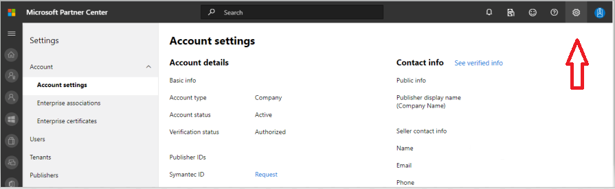

# Envoi de votre application à AppSource

## Soumission d’applications teams

La publication de votre application dans [AppSource](https://appsource.microsoft.com) le rend disponible dans le catalogue d’applications de teams et sur le Web. À un niveau élevé, le processus d’envoi de votre application à AppSource est le suivant :

1. Développez votre application en suivant nos [instructions de conception](~/concepts/design/understand-use-cases.md). Les onglets doivent suivre [les instructions de conception d’onglet](~/tabs/design/tabs.md). Les robots doivent suivre les [instructions de conception de robot](~/bots/design/bots.md).
1. Assurez-vous que votre application remplit les [stratégies de validation](/legal/marketplace/certification-policies) d’application pour Microsoft Teams.
1. [Configurez un compte de développeur dans le](/office/dev/store/open-a-developer-account) [Centre de partenaires](https://support.microsoft.com/help/4499930/partner-center-overview). *Voir aussi* [comment créer un compte de centre partenaire](#how-do-i-create-a-partner-center-account) dans la section Forum aux questions, ci-dessous.
1. Préparez votre application pour l’envoi en suivant notre [liste de vérification de soumission](~/concepts/deploy-and-publish/appsource/prepare/submission-checklist.md).
1. Consultez nos [conseils pour obtenir la soumission d’une application réussie](~/concepts/deploy-and-publish/appsource/prepare/frequently-failed-cases.md).
1. Envoyez votre package à [AppSource via le centre de partenaires](/office/dev/store/use-partner-center-to-submit-to-appsource).
1. Suivez le processus d’approbation de votre tableau de bord du centre partenaires. *Consultez la rubrique* [Présentation du centre partenaires](https://support.microsoft.com/help/4499930/partner-center-overview).
1. Post-soumission : consultez nos instructions pour [maintenir et prendre en charge votre application publiée](~/concepts/deploy-and-publish/appsource/post-publish/overview.md).

>[!NOTE]
>
>- Si votre application teams contient un bot, vous devez vous conformer au [Code de conduite de](https://aka.ms/bf-conduct)l’infrastructure de développement de robots.
>- Si votre application contient un connecteur Office 365, des conditions supplémentaires peuvent s’appliquer. *Consultez* le [tableau de bord du développeur de connecteurs](https://aka.ms/connectorsdashboard) et des développeurs d' [applications](https://sellerdashboard.microsoft.com/Assets/Content/Agreements/Office_Store_Seller_Agreement_20120927.htm).

## FAQ — applications teams et comptes partenaires

## Comment puis-je créer un compte de centre partenaire ?

Il existe deux façons de créer un compte de centre partenaire :

- Si vous débutez avec le centre de partenaires et que vous n’avez pas de compte dans le réseau Microsoft, [créez un compte à l’aide de la page d’enregistrement du centre partenaires](/office/dev/store/open-a-developer-account#create-an-account-using-an-existing-partner-center-enrollment).
- Si vous êtes déjà dans le réseau partenaire, [créez un compte directement dans le centre de partenaires à l’aide d’une inscriptions existante](/office/dev/store/).

## Que se passe-t-il si je ne trouve pas mon compte Office Store dans le centre partenaires ?

Ouvrez un [ticket de support de centre partenaire](https://partner.microsoft.com/en-US/support/v2/?stage=1) et sélectionnez ce qui suit dans les menus déroulants :

| Menu | Option |
| -------   | -------  |
|Catégorie| Marché commercial|
| Rubrique | Aide générale sur Marketplace et questions sur les procédures |
| Sujet secondaire| Complément Office |

## Où puis-je obtenir de l’aide pour mes problèmes de mon centre partenaires ?

Consultez notre [page de support des éditeurs](https://aka.ms/marketplacepublishersupport) pour rechercher votre rubrique de problèmes et obtenir des conseils. Si les instructions fournies ne sont pas utiles, [ouvrez un ticket de support de centre partenaire](/azure/marketplace/partner-center-portal/support#how-to-open-a-support-ticket).

## Comment puis-je gérer mon compte Office Store ?

Pour obtenir des instructions sur la gestion de votre compte Office Store via le centre de partenaires, consultez notre [compte Manage Your Office Store dans le Centre des partenaires](/office/dev/store/manage-account-settings-and-profile) .

## Comment puis-je ajouter mon numéro de téléphone à la section contact du profil partenaire ?

Le numéro de téléphone comprend trois parties : indicatif du pays, indicatif régional et numéro de téléphone. Si votre numéro de téléphone n’inclut pas d’indicatif régional, laissez la deuxième zone vide et complétez la troisième zone.

## Comment puis-je gérer mes paramètres de compte et mon profil partenaire dans le centre de partenaires ?

Pour obtenir des instructions sur la gestion des paramètres de votre compte centre partenaires, consultez notre page [gérer les paramètres de compte et les informations de profil](/windows/uwp/publish/manage-account-settings-and-profile#additional-settings-and-info) .

## Pourquoi est-ce que je reçois le message « ce compte n’est pas autorisé à publier » lorsque j’essaie d’envoyer mon complément via le centre de partenariat ?

Vous recevrez le message d’erreur ci-dessus lorsque l' [État de vérification](/partner-center/verification-responses) de votre compte est en attente. Vous pouvez vérifier l’état de la vérification de votre compte dans le [tableau de bord](https://partner.microsoft.com/dashboard) du centre partenaires en sélectionnant l’option **paramètres** (icône d’engrenage) dans le coin supérieur droit de l’environnement d’en-tête de page et en sélectionnant Paramètres du compte de compte pour les **développeurs**  =>  **Account**   =>  **Account settings** .

Pendant le processus de vérification de compte, l’état de chaque étape requise (la propriété de l’E-mail, la vérification de l’emploi et la vérification de l’entreprise) s’affiche. Une fois le processus de vérification terminé, l’état de vérification de votre enregistrement sur la page de profil passe de « en attente » à « autorisé » et les étapes du processus ne s’affichent plus.

## Mon état de vérification de compte n’a pas avancé au-delà de la propriété de messagerie. Comment procéder ?

Pendant le processus de vérification de la **propriété de messagerie** , un message électronique de vérification est envoyé à l’adresse de messagerie du contact principal. Consultez la boîte de réception de votre contact principal pour obtenir un e-mail de **maccount@Microsoft. com** en fonction de la ligne d’objet *requise : Vérifiez votre compte de messagerie auprès de Microsoft*, en vous demandant d’effectuer le processus de vérification du courrier électronique. Le message électronique de vérification sera envoyé à l’adresse de messagerie indiquée dans la page Paramètres de votre compte dans le centre de partenaires.

> [!NOTE]
 >Le lien de vérification de la messagerie n’est valide que pendant 7 jours. Vous pouvez demander à ce que nous puissions vous renvoyer le courrier électronique en visitant votre page de profil partenaire et en sélectionnant le lien **renvoyer le message électronique de vérification** . Pour vous assurer que le courrier électronique est reçu, la liste des messages autorisés d’microsoft.com en tant que domaine approuvé et vérifiez vos dossiers de courrier indésirable.

## Comment puis-je obtenir une assistance supplémentaire pour les problèmes liés à mon compte ?

Pour obtenir des instructions et des étapes de création d’un ticket d’assistance, consultez notre [support pour le programme de marché commercial dans la page Centre de partenaires](/azure/marketplace/partner-center-portal/support) .

## J’ai vérifié mes dossiers de courrier et je n’ai pas reçu le message électronique de vérification. Que dois-je faire maintenant ?

Procédez comme suit :

1. Vérifiez votre dossier de courrier indésirable.
1. Effacez le cache du navigateur, accédez à votre tableau de bord du compte centre partenaire, puis sélectionnez le lien **renvoyer le message électronique de vérification** pour renvoyer le message électronique de vérification à votre adresse de messagerie.
1. Essayez d’accéder au lien **renvoyer la messagerie de vérification** à partir d’un autre navigateur.
1. Collaborez avec votre service informatique pour vous assurer que les e-mails de vérification ne sont pas bloqués par le serveur de messagerie.
1. Réglez le filtre de courrier indésirable de votre serveur pour autoriser/autoriser tous les messages électroniques provenant d' **maccount@microsoft.  com**.

## Combien de temps dure le processus de vérification de l’emploi ?

Si tous les détails envoyés sont corrects, la vérification de l’emploi se termine dans 1 à 2 heures.

## Combien de temps dure le processus de « vérification de l’activité » ?

La vérification de l’activité prend entre 1 et 2 jours ouvrés, à condition que tous les documents requis aient été envoyés.

## Si je suis en contact avec l’équipe de support, mon ticket sera-t-il expédié ?

Les tickets de support seront résolus au cours d’une semaine. Recherchez les mises à jour qui seront envoyées à l’e-mail fourni lorsque le ticket de support était généré.

## Mon problème n’est pas répertorié ici.  Existe-t-il d’autres pages que je peux référencer pour les problèmes du centre partenaire ?

Pour plus d’informations, reportez-vous à notre documentation sur le [marché commercial](/azure/marketplace/) .

## J’ai créé un ticket d’assistance, il a été de 7 jours ouvrés et je n’ai pas reçu de mise à jour. Où puis-je obtenir de l’aide supplémentaire ?

Envoyez un courrier électronique **<teamsubm@microsoft.com>** avec les informations suivantes :

1. **Ligne d’objet**. *Problème de compte du centre partenaire pour <App_Name>* (spécifiez le nom de votre application).
1. **Corps du message :**
    * Numéro de ticket d’assistance :
    * Votre IDENTIFIant vendeur :
    * Une capture d’écran du problème (si possible) :

>
> [!div class="nextstepaction"]
> [En savoir plus sur les stratégies de validation d’application pour Microsoft teams](/legal/marketplace/certification-policies)
