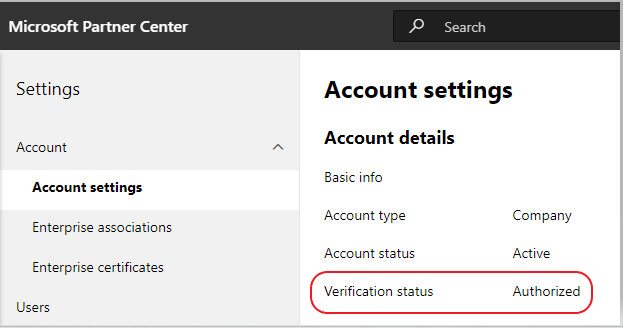

# Soumettre votre application à AppSource

## Soumission d’applications Teams

Rendez votre application disponible dans le catalogue d’applications Microsoft Teams et sur le web en la publiant sur [AppSource.](https://appsource.microsoft.com) À un niveau élevé, le processus de soumission de votre application à AppSource est le suivant :

1. Développez votre application en suivant les instructions [de conception.](~/concepts/design/understand-use-cases.md) Les onglets doivent respecter les instructions de conception des onglets pour les ordinateurs de [bureau et web](~/tabs/design/tabs.md) et [mobiles.](~/tabs/design/tabs-mobile.md) Les bots doivent respecter les instructions [de conception du bot.](~/bots/design/bots.md)
1. Assurez-vous que votre application répond aux stratégies [de validation d’application](/legal/marketplace/certification-policies) pour Microsoft Teams. 
1. Testez votre application avec [l’outil de validation de manifeste.](prepare/submission-checklist.md#teams-app-validation-tool)
1. Configurer un compte [de développeur dans](/office/dev/store/open-a-developer-account) [l’Partner Center](https://support.microsoft.com/help/4499930/partner-center-overview). *Voir aussi* [Comment créer un compte Espace partenaires](#how-do-i-create-a-partner-center-account) dans la section FAQ.
1. Préparez votre application pour la soumission en suivant la liste [de vérification de soumission.](prepare/submission-checklist.md)
1. Examinez les cas de test les plus échoués pour obtenir une approbation plus rapide de [la qualité de l’application.](prepare/frequently-failed-cases.md)
1. Envoyez votre package à [AppSource via l’Partner Center.](/office/dev/store/use-partner-center-to-submit-to-appsource)
1. Suivez le processus d’approbation sur votre tableau de bord de l’Centre partenaires. *Voir Vue* [d’ensemble de l’Centre partenaires.](https://support.microsoft.com/help/4499930/partner-center-overview)
1. Après l’envoi, tenez compte des conseils pour [la maintenance et la prise en charge de votre application publiée.](post-publish/overview.md)

>[!NOTE]
>
>- Votre application Teams doit être réactive  aux appareils mobiles et se conformer à aucune exigence de vente sur le système d’exploitation mobile (iOS et Android). 
>- Si votre application Teams contient un bot, vous devez vous conformer au [code](https://aka.ms/bf-conduct)de conduite de Bot Developer Framework.
>- Si votre application contient un connecteur Office 365, des conditions supplémentaires peuvent s’appliquer. Voir [Tableau de bord du développeur de connecteurs](https://aka.ms/connectorsdashboard) et Contrat du développeur [d’applications.](https://sellerdashboard.microsoft.com/Assets/Content/Agreements/Office_Store_Seller_Agreement_20120927.htm)
>- Pour rendre votre application disponible pour les utilisateurs du cloud communautaire du gouvernement (GCC) et éviter les doublons de listes d’applications dans le Store, le processus ou le flux d’th doit identifier et router l’utilisateur vers l’URL de contenu spécifiée ou attendue pour les utilisateurs GCC.

## FAQ : processus de vérification des applications Teams et des comptes partenaires dans l’Centre partenaires

## Comment créer un compte Espace partenaires ?

Il existe deux façons de créer un compte Espace partenaires :

- Si vous débutez avec l’Espace partenaires et que vous n’avez pas de compte dans le réseau Microsoft, créez un compte à l’aide de la page d’inscription de [l’Espace partenaires.](/office/dev/store/open-a-developer-account#create-an-account-using-an-existing-partner-center-enrollment)
- Si vous êtes déjà inscrit au Réseau de partenaires, créez un compte directement dans l’Espace partenaires à l’aide d’une [page d’inscription existante.](/office/dev/store/)

## Que se passe-t-il si je ne trouve pas mon compte Office Store dans l’Partner Center ?

Ouvrez un [ticket de support de l’Espace](https://partner.microsoft.com/support/v2/?stage=1) partenaires et sélectionnez ce qui suit dans les menus listes :

| Menu | Option |
| -------   | -------  |
|Catégorie| Commercial Marketplace|
| Rubrique | Questions générales sur l’aide et les comments sur Marketplace |
| Subtopic| Complément Office |

## Où puis-je obtenir de l’aide pour les problèmes de compte de l’Partner Center ?

Visitez la [page de support des éditeurs](https://aka.ms/marketplacepublishersupport) pour rechercher votre sujet de problème et obtenir des conseils. Si les conseils fournis ne sont pas utiles, augmentez un [ticket de support de l’Centre partenaires.](/azure/marketplace/partner-center-portal/support#how-to-open-a-support-ticket)

## Comment gérer mon compte Office Store dans l’Partner Center ?

Consultez le [site Gérer votre compte Office Store via l’Partner Center pour](/office/dev/store/manage-account-settings-and-profile) obtenir des conseils.

## Comment ajouter mon numéro de téléphone à la section de contact de profil partenaire ?

Le numéro de téléphone est en trois parties : code pays, code de zone et numéro de téléphone. Si votre numéro de téléphone n’inclut pas de code de zone, laissez la deuxième zone vide et complétez la troisième zone.

## Comment gérer les paramètres de mon compte et mon profil de partenaire dans l’Partner Center ?

Consultez la page [Gérer les paramètres du compte et](/windows/uwp/publish/manage-account-settings-and-profile#additional-settings-and-info) les informations de profil pour obtenir des conseils sur la gestion de vos paramètres de compte De l’Partner Center.

## Pourquoi reçois-je le message « Ce compte n’est pas éligible pour la publication » lorsque j’essaie d’envoyer mon add-in par le biais de l’Partner Center ?

Vous recevez le message d’erreur ci-dessus lorsque l’état [de vérification de](/partner-center/verification-responses) votre compte est en attente. Vérifiez l’état de vérification de votre compte dans le tableau de bord de l’Centre [partenaires.](https://partner.microsoft.com/dashboard) Sélectionnez **Paramètres,** l’icône d’engrenage dans le coin supérieur droit de l’en-tête de page. Choisissez **les paramètres du compte**  =>  **de**   =>  **paramètres du développeur.**

L’état de chaque étape requise, telle que la propriété de l’e-mail, la vérification de l’emploi et la vérification de l’entreprise, est affiché dans le processus de vérification du compte. Une fois le processus de vérification terminé, l’état de vérification de votre inscription sur la page de profil passe *d’en* attente *à autorisé.* Les étapes du processus ne sont plus affichées.

## Qu’est-ce qui est vérifié dans le processus de vérification du compte de l’Partner Center et comment y répondre ?
Il existe trois zones de vérification, **la propriété de messagerie,** **l’emploi** et **l’entreprise.** Pour plus d’informations sur le processus de vérification, voir [Ce qui est vérifié et comment y répondre.](/partner-center/verification-responses#what-is-verified-and-how-to-respond)
Si vous êtes le contact principal, l’administrateur global ou l’administrateur de compte, go to your Partner Profile to monitor verification status and track the progress.

Une fois le processus de vérification terminé, l’état de vérification de votre inscription sur la page de profil passe *d’en* attente *à autorisé.* Après l’autorisation, les étapes du processus et leur état ne sont plus disponibles sur la page. Le contact principal reçoit un e-mail de Microsoft dans les jours ou suivants après la fin de la vérification.

## L’état de vérification de mon compte n’a pas été avancé au-delà de la propriété de l’e-mail dans l’Partner Center. Comment dois-je continuer ?

Pendant le processus **de vérification de la** propriété de l’e-mail, un message électronique de vérification est envoyé à l’adresse de messagerie du contact principal. Vérifiez la boîte de réception de votre contact principal pour obtenir un **e-mail maccount@microsoft.com** avec l’action de ligne d’objet requise : Vérifiez votre compte de messagerie *auprès de Microsoft.* Terminez le processus de vérification du courrier électronique. L’e-mail de vérification est envoyé à l’adresse de messagerie répertoriée sur la page des paramètres de votre compte dans l’Partner Center.

> [!NOTE]
> * Le lien de vérification du courrier électronique n’est valide que pendant sept jours. 
> * Vous pouvez nous demander de renvoyer l’e-mail en visitant la page de votre profil de partenaire et en sélectionnant le lien renvoyer le courrier électronique de **vérification.**
> * Pour vous assurer que le courrier électronique est reçu, listez les messages électroniques provenant de microsoft.com en tant que domaine sécurisé et vérifiez vos dossiers de courrier indésirable.

## Comment obtenir une assistance supplémentaire pour les problèmes liés à mon compte ?

Consultez la page [Support pour le programme Commercial Marketplace](/azure/marketplace/partner-center-portal/support) dans l’Espace partenaires pour obtenir des conseils et des étapes pour créer un ticket de support.

## J’ai vérifié mes dossiers de courrier et je n’ai pas reçu l’e-mail de vérification. Que dois-je faire ensuite ?

Procédez comme suit :
* Vérifiez votre dossier de courrier indésirable ou de courrier indésirable.
* Clear the browser cache, go to your Partner Center account dashboard, and select the **Resend verification email** link to have the verification email resent to your email address.
* Essayez d’accéder au **lien renvoyer le courrier** électronique de vérification à partir d’un autre navigateur.
* Contactez votre service informatique pour vous assurer que les e-mails de vérification ne sont pas bloqués par le serveur de messagerie.
* Ajustez le filtre de courrier indésirable de votre serveur pour autoriser ou lister en toute sécurité tous les e-mails provenant **maccount@microsoft.  com**.

## Combien de temps dure généralement le processus de vérification de l’emploi ?

Si tous les détails envoyés sont corrects, le processus de vérification de l’emploi prend environ deux heures.

## Combien de temps le processus de vérification d’entreprise prend-il en général ?

Si tous les documents requis sont envoyés, la vérification de l’entreprise prend un à deux jours ou plus.

## Si je pars en direction de l’équipe de support technique, mon ticket sera-t-il accéléré ?

Les tickets de support sont résolus dans une semaine. Recherchez les mises à jour envoyées à l’ID de courrier électronique fourni lors de l’augmentation du ticket de support.

## Mon problème n’est pas répertorié ici. Existe-t-il d’autres pages que je peux référencer pour les problèmes de l’Partner Center ?

Pour plus [d’aide, voir](/azure/marketplace/) la documentation du marketplace commercial.

## J’ai créé un ticket de support, cela fait 7 jours ou moins et je n’ai pas reçu de mise à jour. Où puis-je obtenir de l’aide supplémentaire ?

Envoyez un courrier **<teamsubm@microsoft.com>** électronique avec les détails suivants :

* **Ligne d’objet**: Problème de compte de l'<App_Name> (spécifiez le nom de votre application).
* **Corps de l’e-mail**:
    * Numéro de ticket de support
    * Votre ID vendeur
    * Capture d’écran du problème (si possible)
    
## Mappage des catégories d’application

| Catégorie Teams       | Catégories de PC  |
|:---------------------|:---------------|
| Analyse et bi | Analyse, visualisation des données et bi |
| Développeur et informatique | Outils de développement, administrateur informatique |
| Éducation | Éducation |
| Ressources humaines | Ressources humaines et recrutement |
| Productivité | Gestion de contenu, fichiers et documents, productivité, formation et didacticiels, et utilitaires |
| Gestion de projets | Communication, gestion de projet, flux de travail et gestion de l’entreprise |
| Ventes et support | Gestion des clients et des contacts, support client, gestion financière, ventes et marketing |
| Social et fun | Galeries d’images et de vidéos, style de vie, actualités et météo, réseau social, voyage et navigation |

>
> [!div class="nextstepaction"]
> [En savoir plus sur les stratégies de validation d’application pour Microsoft Teams](/legal/marketplace/certification-policies)
