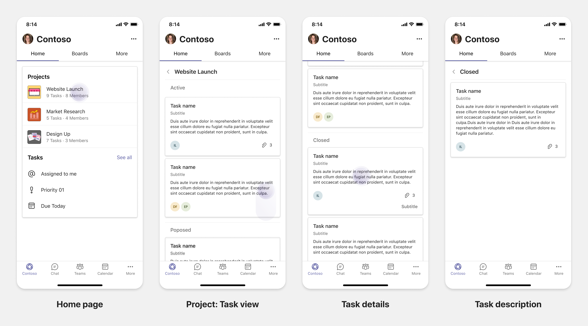

# Planifier des onglets réactifs pour Teams mobile

 Teams plateforme offre la possibilité de créer des applications sur les appareils mobiles et de bureau. Les utilisateurs de votre application peuvent préférer un ordinateur de bureau ou un appareil mobile, ou les deux. Les utilisateurs peuvent préparer des données sur un ordinateur de bureau, mais consomment et partagent davantage de données à l’aide d’appareils mobiles. La clé pour créer une application consiste à comprendre et à répondre aux besoins des utilisateurs. Il existe des fonctionnalités telles que les bots, les extensions de messagerie et les connecteurs qui fonctionnent en toute transparence sur ordinateur de bureau et mobile. Toutefois, la création d’onglets et de modules de tâches nécessite la planification de l’hébergement de votre expérience web sur Teams mobile. Guides de document pour planifier vos pages web réactives sur Teams mobile.

## Identifier l’étendue des applications

La liste suivante fournit les informations clés pour planifier la création d’applications pour Teams mobile :

* Envisagez la fonctionnalité d’appareil Teams’application. Par exemple, si vous avez une application très performant sur un ordinateur de bureau, vous pouvez explorer pour créer une application similaire sur mobile. À l’origine, il peut être difficile de déplacer l’intégralité de l’expérience de bureau sur un appareil mobile. Vous pouvez commencer par des scénarios de base mais courants. Ajoutez des fonctionnalités et des fonctionnalités après avoir collecté plus d’informations et de commentaires des utilisateurs.

* Veillez à cibler la personne d’utilisateur appropriée sur mobile. Par exemple, si vous créez une application qui fournit un service aux utilisateurs finaux et fournit également un accès aux données aux développeurs et aux cadres supérieurs, les utilisateurs finaux peuvent utiliser davantage l’application pendant que vous commencez à créer l’application sur Teams mobile. Vous pouvez répondre à toutes les personnes que vous avez sur votre application de bureau. Toutefois, il est recommandé de commencer par persona avec une base plus grande et les utilisateurs précoces possibles pour une expérience d’écran plus petite. Comme dans l’exemple, les utilisateurs finaux sont les personnes d’utilisateur appropriées. Vous pouvez progressivement ajouter des fonctionnalités pour prendre en charge d’autres personnes utilisateur sur votre Teams mobile. 

## Comprendre les différentes étapes de la construction d’applications

Une fois que vous avez identifié l’étendue de l’application, il est temps de comprendre les trois étapes suivantes pour planifier une application sur Teams mobile et améliorer l’expérience utilisateur :

1. **Consommation**

   Afficher les applications sur un appareil mobile. Pour créer une application sur mobile, vous pouvez commencer par l’expérience de consommation. Étant donné que le monde mobile a fait du défilement du contenu une pratique courante, vous pouvez afficher des informations pertinentes. Utiliser des mécanismes d’engagement, tels que des notifications pour informer les mises à jour.

2. **Actions rapides**

   Utiliser l’application sur un appareil mobile. Une fois que vos utilisateurs ont commencé à consommer le contenu sur un appareil mobile, vous pouvez mettre à l’échelle votre application au niveau suivant en migrer certaines actions à partir de l’application de bureau. Vous pouvez optimiser et créer de nouvelles actions pour les appareils mobiles.

3. **Activation**

   Fournir des expériences d’application complètes pour vous engager sur mobile. Lorsque vos utilisateurs s’engagent avec votre application, offrez une expérience immersive complète sur mobile, à parité ou meilleure que l’expérience de bureau. Pour offrir une bonne expérience à vos utilisateurs, faites en sorte que tous les cas d’utilisation répondent sur les appareils mobiles.

> [!TIP]
> Pour obtenir des informations sur les instructions de conception, voir [le processus de conception pour Teams applications.](design-teams-app-process.md)

## Cas d’utilisation

Examinons les cas d’utilisation suivants pour comprendre comment planifier différents types d’applications pour Teams mobile :

 

<b>Applications de tableau de bord et de visualisation des données</b>

Vous pouvez comprendre comment planifier des onglets réactifs pour les applications de visualisation de tableaux de bord et de données sur Teams plateforme mobile.

**Consommation**

Dans la première étape, vous pouvez implémenter l’expérience de consommation la plus basique, pour afficher les données. L’objectif de n’importe quelle application dans le domaine est d’afficher des données sous forme de visualisations. Dans votre application, vous pouvez afficher les visualisations récemment vues sur le bureau ou la liste de tous les graphiques autorisés pour les utilisateurs. Après avoir créé des tableaux de bord sur un ordinateur de bureau, les utilisateurs peuvent accéder aux informations à l’aide de l’appareil mobile. Vous pouvez afficher un affichage détaillé de n’importe quel graphique sélectionné par l’utilisateur sous la forme d’une vue étendue dans vos onglets ou à l’aide de modules de tâche.

Vous pouvez afficher les informations suivantes : 

* Tableaux de bord et résumés
* Visuels, cartes et infographies de données
* Graphiques, graphiques et tableaux 

**Actions rapides**

Dans la deuxième étape, les utilisateurs peuvent travailler sur les graphiques et les éléments visuels existants à partir de l’expérience de bureau. Vous pouvez introduire les actions suivantes :

* Rechercher du contenu
* Filtrer les données
* Créer des signets

**Activation**

Dans la troisième étape, permettre aux utilisateurs de créer du contenu tel que des graphiques et des graphiques à partir de zéro. Veillez à présenter toutes les fonctionnalités de votre application pour appareils mobiles. Par exemple, vous pouvez utiliser des modules de tâche pour accéder à des éléments de données spécifiques avec une vue détaillée.

Vous pouvez fournir l’accès suivant aux utilisateurs :
* Modifier le titre et la description
* Insérer des éléments de données pour créer des visualisations
* Partager des visualisations dans une conversation de canal ou de groupe

 

 

<b>Applications d’embarquement de tâches</b>

Vous pouvez comprendre comment planifier des onglets réactifs pour les applications d’embarquement de tâches sur Teams plateforme mobile.

**Consommation**

Dans la première étape, votre application peut afficher la liste des tâches à l’utilisateur dans une pile verticale. S’il existe plusieurs catégories de tâches, telles que  proposées, **actives** et fermées, fournissez des filtres pour afficher les tâches groupées ou sous forme d’en-têtes pour afficher les tâches groupées. 

**Actions rapides**

Dans la deuxième étape, vous pouvez fournir l’accès d’application suivant aux utilisateurs :
* Créer des tâches ou des éléments avec les champs obligatoires pour réduire la charge cognitive des utilisateurs
* Modifier le type ou l’affichage du tableau
* Passer en revue les tâches en agrandissant l’affichage
* Utiliser des modules de tâche pour afficher l’affichage détaillé
* Déplacer les tâches dans différentes catégories 
* Partager des tâches pertinentes dans des conversations et des canaux via des e-mails et des flux d’activités

**Activation**

Dans la troisième étape, vous pouvez activer l’expérience utilisateur avec les activités suivantes :
* Ajouter de nouveaux projets et tableaux
* Ajouter et modifier différentes catégories, telles que **Proposée,** **Active** et **Fermée**
* Configurer les tâches pour les commentaires, les pièces jointes et d’autres fonctionnalités complexes

 

 

<b>Applications de co-auteur et de tableau blanc</b>

Vous pouvez comprendre comment planifier des onglets réactifs pour les applications de co-conception et de tableau blanc sur Teams plateforme mobile.

**Consommation**

Dans la première étape, vous pouvez envisager l’expérience de bureau pour afficher le contenu et les ressources dans votre application.  Vous pouvez afficher les fonctions suivantes :

* Commentaires ou commentaires
* Zoom avant ou arrière
* Étape ou progression en cours d’un document en attente

**Actions rapides**

Dans la deuxième étape, vous pouvez introduire les actions suivantes :

* Créer un nouveau tableau pour la collaboration ou de nouveaux documents pour la signature
* Partager des tableaux en interne et également avec des invités
* Configurer les autorisations d’administrateur

> [!TIP]
> Vous exposez des actions, qui peuvent être affichées facilement sur les petits écrans.

**Activation**

Dans la troisième étape, offrez une expérience complète à vos utilisateurs. Vous pouvez activer l’expérience utilisateur avec les activités suivantes :

* Ajout de texte, de formes et de notes rapides
* Naviguer dans le contenu
* Ajouter des couches et des filtres
* Opérations de suppression, d’opération d’annuler et de refaire
* Accéder à la caméra et au microphone à l’aide des API du SDK JS. Pour plus d’informations sur les fonctionnalités des appareils, voir [vue d’ensemble des fonctionnalités de l’appareil.](../device-capabilities/device-capabilities-overview.md)

 

## Voir aussi

Les instructions de conception et de validation suivantes vous aident en fonction de l’étendue de votre application :

* [Conception de votre onglet](../../tabs/design/tabs.md)
* [Conception de votre bot](../../bots/design/bots.md)
* [Conception de modules de tâches](../..//task-modules-and-cards/task-modules/design-teams-task-modules.md)
* [Recommandations en matière de validation du Store](../deploy-and-publish/appsource/prepare/teams-store-validation-guidelines.md)
