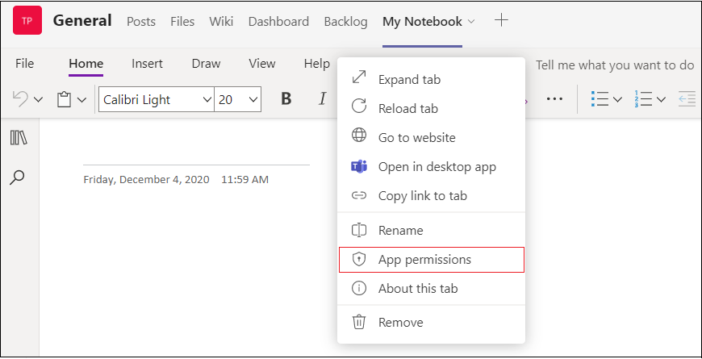

# Autorisations de périphérique pour le navigateur

> [!NOTE]
> La dernière mise à jour sur la façon dont les autorisations d’appareil sont gérées dans le navigateur est actuellement disponible en [prévisualisation publique pour les](../../resources/dev-preview/developer-preview-intro.md) développeurs uniquement. Cette mise à jour sera généralement disponible d’ici le 01 février 2022.

Teams qui nécessitent des autorisations d’appareil, telles que l’accès à l’appareil photo ou au microphone, obligent désormais les utilisateurs à accorder manuellement des autorisations au niveau de chaque application dans le navigateur web. Auparavant, le navigateur géré comment accorder des autorisations d’accès, mais maintenant ces autorisations sont gérées dans Microsoft Teams. Cela a une incidence sur la façon dont vous concevez votre application et s’ils requièrent ces autorisations dans le navigateur.

## Activer les autorisations d’appareil de l’application
Si votre application Teams a déclaré dans le manifeste de [l’application](native-device-permissions.md#specify-permissions) qu’elle a besoin d’autorisations d’appareil, l’option **Autorisations** de l’application s’affiche pour permettre aux utilisateurs d’activer les autorisations d’appareil de l’application. **L’option Autorisations d’application** est disponible dans les fonctionnalités suivantes : 

* **Applications personnelles et boîtes de dialogue de module de** tâche : l’option **Autorisations** d’application est disponible dans le coin supérieur droit de la page.

* **Onglets Conversations, canal** ou réunion : l’option **Autorisations** de l’application est disponible dans ladown de l’onglet. 

Une fois **l’option d’autorisations d’application** sélectionnée, une fenêtre apparaît dans laquelle l’utilisateur peut activer le bouton Autorisations.

Un utilisateur devra activer ces autorisations dans le navigateur pour que ces autorisations prennent effet. Une fois que l’utilisateur a changé les autorisations d’appareil de l’application dans le navigateur, il est invité à recharger l’application dans Teams.

> [!IMPORTANT]
> Vous devez faire en sorte que les utilisateurs sachent où aller pour activer ces **autorisations d’application** dans Microsoft Teams.

## Recommandation
Teams qui nécessitent des autorisations d’appareil dans le navigateur doit afficher des instructions aux utilisateurs sur l’endroit où trouver et activer ces autorisations dans l’interface Teams utilisateur. Selon le contexte dans lequel votre application est en cours d’exécution, vous devez vous assurer que vos instructions pointent l’utilisateur vers un emplacement correct pour accéder à ces autorisations, car elles diffèrent pour les applications personnelles, les boîtes de dialogue de module de tâche, les onglets dans les conversations et les canaux ou les réunions.

 

## Voir aussi

* [Vue d’ensemble des fonctionnalités des appareils](device-capabilities-overview.md)
* [Demande des autorisations d’appareil](native-device-permissions.md)
