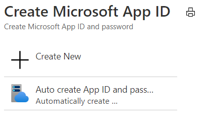

1. Dans le [portail Azure,](https://ms.portal.azure.com/#home)sous services Azure, **sélectionnez Créer une ressource.**In the [Azure portal](https://ms.portal.azure.com/#home), under Azure services, select **Create a resource**.
1. Dans la zone de recherche, entrez « bot ».In the search box enter "bot". And in the drop-down list, select **Bot Channels Registration**.And in the drop-down list, select **Bot Channels Registration**.
1. Sélectionnez **le bouton** Créer.Select the **Create** button.
1. Dans le blade **d'inscription du** canal bot, fournissez les informations demandées sur votre bot.In the **Bot Channel Registration** blade, provide the requested information about your bot.
1. Laissez la **zone de point de terminaison** de messagerie vide pour le moment, vous entrez l'URL requise après le déploiement du bot.Leave the **Messaging endpoint** box empty for now, you will enter the required URL after deploying the bot. L'image suivante montre un exemple des paramètres d'inscription :The following picture shows an example of the registration settings:

    

1. Cliquez **sur L'ID et le mot de passe de l'application Microsoft,** **puis créez-en un.**Click **Microsoft App ID and password** and then **Create New**.

          

1. Cliquez **sur Créer un ID d'application dans le lien Portail d'inscription des** applications.Click **Create App ID in the App Registration Portal** link.

   
   
1. Dans la fenêtre **d'inscription de l'application** affichée, cliquez sur l'onglet Nouvelle **inscription** dans le coin supérieur gauche.In the displayed **App registration** window, click the **New registration** tab in the upper left.
1. Entrez le nom de l'application bot que vous inscrivez, nous avons *utilisé BotTeamsAuth* (vous devez sélectionner votre propre nom unique).Enter the name of the bot application you are registering, we used *BotTeamsAuth* (you need to select your own unique name).
1. Pour les **types** de comptes pris en charge, sélectionnez Comptes dans n'importe quel annuaire d'organisation (n'importe quel annuaire *Azure AD - Multi-client)* et comptes Microsoft personnels (par exemple, Skype, Xbox).For the **Supported account types** select *Accounts in any organizational directory (Any Azure AD directory - Multitenant) and personal Microsoft accounts (e.g. Skype, Xbox)*.
1. Cliquez sur le **bouton** Enregistrer.Click the **Register** button. Une fois terminé, Azure affiche la page *Vue d'ensemble* de l'application.Once completed, Azure displays the *Overview* page for the application.
1. Copiez et enregistrez dans un fichier la valeur de l'ID de **l'application (client).**Copy and save to a file the **Application (client) ID** value.
1. Dans le panneau gauche, cliquez sur **Certificat et secrets.**In the left panel, click **Certificate and secrets**.
    1. Sous *Les secrets client,* cliquez **sur Nouvelle secret client.**Under *Client secrets*, click **New client secret**.
    1. Ajoutez une description pour identifier ce secret auprès d'autres personnes que vous devrez peut-être créer pour cette application.Add a description to identify this secret from others you might need to create for this app.
    1. La *sélection expire.*Set *Expires* to your selection.
    1. Cliquez sur **Ajouter**.Click **Add**.
    1. Copiez la secret client et enregistrez-la dans un fichier.Copy the client secret and save it to a file.
1. Revenir à la fenêtre Inscription du canal bot  et copiez respectivement  *l'ID* d'application et la secret client dans les zones  **ID** de l'application Microsoft et Mot de passe.Go back to the **Bot Channel Registration** window and copy the *App ID* and the *Client secret* in the **Microsoft App ID** and **Password** boxes, respectively.
1. Cliquez sur **OK**.Click **OK**.
1. Enfin, cliquez sur **Créer.**Finally, click **Create**.

Une fois qu'Azure a créé la ressource d'inscription, elle sera incluse dans la liste des groupes de ressources.After Azure has created the registration resource it will be included in the resource group list.  

Une fois l'inscription de vos canaux de bot créée, vous devez activer le canal Teams.Once your bot channels registration is created, you'll need to enable the Teams channel.

1. Dans le [portail Azure, sous](https://ms.portal.azure.com/#home)services Azure, sélectionnez l'inscription du canal bot **que** vous avez créée.In the [Azure portal](https://ms.portal.azure.com/#home), under Azure services, select the **Bot Channel Registration** you just created.
1. Dans le panneau gauche, cliquez sur **Canaux**.In the left panel, click **Channels**.
1. Cliquez sur l'icône Microsoft Teams, puis choisissez **Enregistrer.**Click the Microsoft Teams icon, then choose **Save**.
