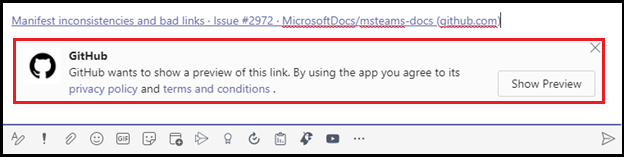

# Extensions de messagerieMessaging extensions

Les extensions de messagerie permettent aux utilisateurs d’interagir avec votre service web par le biais de boutons et de formulaires dans Microsoft Teams client.Messaging extensions allow the users to interact with your web service through buttons and forms in the Microsoft Teams client. Ils peuvent rechercher ou initier des actions dans un système externe à partir de la zone de composition du message, de la zone de commande ou directement à partir d’un message.They can search or initiate actions in an external system from the compose message area, the command box, or directly from a message. Vous pouvez renvoyer les résultats de cette interaction au client Microsoft Teams sous la forme d’une carte richement mise en forme.You can send back the results of that interaction to the Microsoft Teams client in the form of a richly formatted card. Ce document donne une vue d’ensemble de l’extension de messagerie, des tâches effectuées dans différents scénarios, de l’utilisation de l’extension de messagerie, des commandes d’action et de recherche, et du déploiement de liens.This document gives an overview of the messaging extension, tasks performed under different scenarios, working of messaging extension, action and search commands, and link unfurling.

L’image suivante affiche les emplacements d’appel des extensions de messagerie :The following image displays the locations from where messaging extensions are invoked:

## Scénarios dans lequel les extensions de messagerie sont utiliséesScenarios where messaging extensions are used

| ScénarioScenario | ExempleExample |
|:-----------------|:-----------------|
|Vous souhaitez qu’un système externe soit en mesure d’action et que le résultat de l’action soit renvoyé à votre conversation.You want some external system to do an action  and the result of the action to be sent back to your conversation.|Réservez une ressource et autorisez le canal à connaître le créneau horaire réservé.Reserve a resource and allow the channel to know the reserved time slot.|
|Vous souhaitez trouver quelque chose dans un système externe et partager les résultats avec la conversation.You want to find something in an external system, and share the results with the conversation.|Recherchez un élément de travail dans Azure DevOps et partagez-le avec le groupe en tant que carte adaptative.Search for a work item in Azure DevOps, and share it with the group as an Adaptive Card.|
|Vous souhaitez effectuer une tâche complexe impliquant plusieurs étapes ou une grande quantité d’informations dans un système externe et partager les résultats avec une conversation.You want to complete a complex task involving multiple steps or lots of information in an external system, and share the results with a conversation.|Créez un bogue dans votre système de suivi en fonction d’un message Teams, affectez ce bogue à Bob et envoyez une carte au thread de conversation avec les détails du bogue.Create a bug in your tracking system based on a Teams message, assign that bug to Bob, and send a card to the conversation thread with the bug's details.|

## Comprendre le fonctionnement des extensions de messagerieUnderstand how messaging extensions work

Une extension de messagerie se compose d’un service web que vous hébergez et d’un manifeste d’application, qui définit l’endroit à partir duquel votre service web est appelé dans le client Microsoft Teams client.A messaging extension consists of a web service that you host and an app manifest, which defines where your web service is invoked from in the Microsoft Teams client. Le service web tire parti du schéma de messagerie et du protocole de communication sécurisée de Bot Framework. Vous devez donc inscrire votre service web en tant que bot dans Bot Framework.The web service takes advantage of the Bot Framework's messaging schema and secure communication protocol, so you must register your web service as a bot in the Bot Framework. 

> [!NOTE]
> Bien que vous pouvez créer le service web manuellement, utilisez le [SDK Bot Framework](https://github.com/microsoft/botframework) pour utiliser le protocole.Though you can create the web service manually, use [Bot Framework SDK](https://github.com/microsoft/botframework) to work with the protocol.

Dans le manifeste de l’Microsoft Teams’application, une seule extension de messagerie est définie avec jusqu’à dix commandes différentes.In the app manifest for Microsoft Teams app, a single messaging extension is defined with up to ten different commands. Chaque commande définit un type, tel qu’une action ou une recherche, ainsi que les emplacements dans le client à partir de l’endroit où elle est invoquée.Each command defines a type, such as action or search and the locations in the client from where it is invoked. Les emplacements d’appel sont la zone de message de composition, la barre de commandes et le message.The invoke locations are compose message area, command bar, and message. Lors de l’appel, le service web reçoit un message HTTPS avec une charge utile JSON incluant toutes les informations pertinentes.On invoke, the web service receives an HTTPS message with a JSON payload including all the relevant information. Répondez avec une charge utile JSON, ce qui permet au client Teams de connaître l’interaction suivante à activer.Respond with a JSON payload, allowing the Teams client to know the next interaction to enable. 

## Types de commandes d’extension de messagerieTypes of messaging extension commands

Il existe deux types de commandes d’extension de messagerie : commande d’action et commande de recherche.There are two types of messaging extension commands, action command and search command. Le type de commande d’extension de messagerie définit les éléments d’interface utilisateur et les flux d’interaction disponibles pour votre service web.The messaging extension command type defines the UI elements and interaction flows available to your web service. Certaines interactions, telles que l’authentification et la configuration, sont disponibles pour les deux types de commandes.Some interactions, such as authentication and configuration are available for both types of commands.

### Commandes d'actionAction commands

Les commandes d’action sont utilisées pour présenter aux utilisateurs une fenêtre popup modale pour collecter ou afficher des informations.Action commands are used to present the users with a modal popup to collect or display information. Lorsque l’utilisateur soumet le formulaire, votre service web répond en insérant un message directement dans la conversation ou en insérant un message dans la zone de composition du message.When the user submits the form, your web service responds by inserting a message into the conversation directly or by inserting a message into the compose message area. Après cela, l’utilisateur peut envoyer le message.After that the user can submit the message. Vous pouvez chaîner plusieurs formulaires pour des flux de travail plus complexes.You can chain multiple forms together for more complex workflows.

Les commandes d’action sont déclenchées à partir de la zone de composition du message, de la zone de commande ou d’un message.The action commands are triggered from the compose message area, the command box, or from a message. Lorsque la commande est invoquée à partir d’un message, la charge utile JSON initiale envoyée à votre bot inclut l’intégralité du message à partir de qui elle a été invoquée.When the command is invoked from a message, the initial JSON payload sent to your bot includes the entire message it was invoked from. L’image suivante affiche le module de tâche de commande d’action d’extension de messagerie : module de tâche de commande The following image displays the messaging extension action command task module: 

### Commandes de rechercheSearch commands

Les commandes de recherche permettent aux utilisateurs de rechercher des informations manuellement dans un système externe via une zone de recherche, ou en csérant un lien vers un domaine surveillé dans la zone de composition du message et en insérant les résultats de la recherche dans un message.Search commands allow the users to search an external system for information either manually through a search box, or by pasting a link to a monitored domain into the compose message area, and insert the results of the search into a message. Dans le flux de commande de recherche le plus élémentaire, le message d’appel initial inclut la chaîne de recherche envoyée par l’utilisateur.In the most basic search command flow, the initial invoke message includes the search string that the user submitted. Vous répondez avec une liste de cartes et d’aperçus de carte.You respond with a list of cards and card previews. Le client Teams affiche une liste d’aperçus de carte pour l’utilisateur.The Teams client renders a list of card previews for the user. Lorsque l’utilisateur sélectionne une carte dans la liste, la carte pleine taille est insérée dans la zone de composition du message.When the user selects a card from the list, the full-size card is inserted into the compose message area.

Les cartes sont déclenchées à partir de la zone de composition du message ou de la zone de commande et ne sont pas déclenchées à partir d’un message.The cards are triggered from the compose message area or the command box and not triggered from a message. Ils ne peuvent pas être déclenchés à partir d’un message.They can not be triggered from a message.
L’image suivante affiche le module de tâche de recherche d’extension de messagerie :The following image displays the messaging extension search command task module:

> [!NOTE]
> Pour plus d’informations sur les cartes, voir [les cartes.](../task-modules-and-cards/what-are-cards.md)For more information on cards, see [what are cards](../task-modules-and-cards/what-are-cards.md).

## Déploiement de lienLink unfurling

Un service web est appelé lorsqu’une URL est pastée dans la zone composer un message.A web service is invoked when a URL is pasted in the compose message area. Cette fonctionnalité est connue sous le nom de déploiement de lien.This functionality is known as link unfurling. Vous pouvez vous abonner pour recevoir un appel lorsque les URL contenant un domaine particulier sont passées dans la zone de rédaction d’un message.You can subscribe to receive an invoke when URLs containing a particular domain are pasted into the compose message area. Votre service web peut « déployer » l’URL dans une carte détaillée, fournissant plus d’informations que la carte d’aperçu du site web standard.Your web service can "unfurl" the URL into a detailed card, providing more information than the standard website preview card. Vous pouvez ajouter des boutons pour permettre aux utilisateurs d’agir immédiatement sans quitter Microsoft Teams client.You can add buttons to allow the users to immediately take action without leaving the Microsoft Teams client.
Les images suivantes affichent la fonctionnalité de déploiement de lien lorsqu’un lien est passé dans l’extension de messagerie :The following images display link unfurling feature when a link is pasted in messaging extension:
 

## Exemple de codeCode sample

| **Exemple de nom****Sample name** | **Description****Description** | **.NET****.NET** | **Node.js****Node.js** | **Python****Python** |
|------------|-------------|----------------|------------|
| Extension de messagerie avec commandes basées sur l’actionMessaging extension with action-based commands | Cet exemple montre comment créer une extension de messagerie basée sur une action.This sample illustrates how to build an action-based messaging extension. | [ViewView](https://github.com/microsoft/BotBuilder-Samples/tree/master/samples/csharp_dotnetcore/51.teams-messaging-extensions-action) | [ViewView](https://github.com/microsoft/BotBuilder-Samples/tree/master/samples/javascript_nodejs/51.teams-messaging-extensions-action) | [ViewView](https://github.com/microsoft/BotBuilder-Samples/tree/main/samples/python/51.teams-messaging-extensions-action) |
| Extension de messagerie avec commandes basées sur la rechercheMessaging extension with search-based commands | Cet exemple montre comment créer une extension de messagerie basée sur la recherche.This sample illustrates how to build a Search-based Messaging Extension. | [ViewView](https://github.com/microsoft/BotBuilder-Samples/tree/master/samples/csharp_dotnetcore/50.teams-messaging-extensions-search) | [ViewView](https://github.com/microsoft/BotBuilder-Samples/tree/master/samples/javascript_nodejs/50.teams-messaging-extensions-search) | [ViewView](https://github.com/microsoft/BotBuilder-Samples/tree/main/samples/python/50.teams-messaging-extension-search) |

## Voir aussiSee also

[Créer une extension de messagerieCreate a messaging extension](../build-your-first-app/build-messaging-extension.md)

## Étape suivanteNext step

> [!div class="nextstepaction"]
> [Définir la commande d’extension de messagerie d’actionDefine action messaging extension command](~/messaging-extensions/how-to/action-commands/define-action-command.md)

> [!div class="nextstepaction"]
> [Définir la commande d’extension de messagerie de rechercheDefine search messaging extension command](~/messaging-extensions/how-to/search-commands/define-search-command.md)
