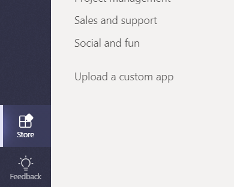
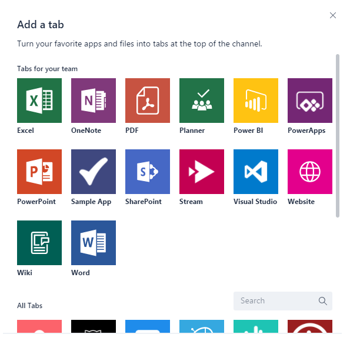

# Téléchargement d’un package d’application dans Microsoft TeamsUpload an app package to Microsoft Teams

Pour tester l’expérience de votre application dans Microsoft Teams, vous devez charger votre application dans Teams.To test your app experience within Microsoft Teams, you need to upload your app to Teams. Le téléchargement ajoute l’application à l’équipe que vous sélectionnez, et vous et les membres de votre équipe pouvez interagir avec elle comme les utilisateurs finaux.Uploading adds the app to the team you select, and you and your team members can interact with it like end users.

> [!NOTE]
> Le téléchargement d’un package mis à jour pour une application existante avec un bot peut ne pas afficher les changements d’onglet lorsqu’ils sont affichés dans la fenêtre de conversation.Uploading an updated package for an existing app with a bot might not show tab changes when viewed through the Conversations window. Il est préférable d’y accéder via la fonction fly-out des applications ou de tester un environnement de test propre.It's better to access it via the Apps fly-out, or test on a clean test environment.

## Créer votre package de téléchargementCreate your upload package

Pour le développement et l’envoi AppSource (anciennement Office Store), vous devez créer un package pouvant être chargé contenant les informations pour décrire votre expérience.For development as well as AppSource (formerly Office Store) submission you must create an uploadable package that contains the information to describe your experience. Le package, un fichier. zip, contient le manifeste de l’application et des icônes qui définissent votre expérience de manière unique.The package, a .zip file, contains the application manifest and icons that uniquely define your experience.

Pour créer un package de téléchargement, voir [créer le package pour votre application Microsoft teams](../../concepts/build-and-test/apps-package.md).To create an upload package, see [Create the package for your Microsoft Teams app](../../concepts/build-and-test/apps-package.md).

Une fois votre package créé, vous pouvez le charger dans une équipe.With your package created, you can now upload it into a team. Une fois téléchargée, elle est disponible pour tous les utilisateurs de l’équipe sélectionnée et uniquement les utilisateurs de cette équipe.Once uploaded it will be available for all users in the selected team, and only the users of that team.

## Charger votre package dans teamsLoad your package into Teams

Vous pouvez tester votre package en le téléchargeant dans Teams.You can test your package by uploading it into Teams.

> [!NOTE]
> Pour que le chargement fonctionne, votre administrateur client doit d’abord [activer le téléchargement des applications](/microsoftteams/admin-settings).For uploading to work, your tenant admin must first [enable uploading of apps](/microsoftteams/admin-settings).

Il existe deux façons de charger votre application dans teams :There are two ways to upload your app to Teams:

* Utilisation de la BanqueUsing the Store
* Utilisation de l’onglet applicationsUsing the Apps tab

## Charger votre package dans une équipe ou une conversation à l’aide de la BanqueUpload your package into a team or conversation using the Store

1. Dans le coin inférieur gauche de teams, sélectionnez l’icône Store.In the lower left corner of Teams, choose the Store icon. Sur la page Store, choisissez **Télécharger une application personnalisée**.On the Store page, choose **Upload a custom app**.

   

2. Dans la boîte de dialogue *ouvrir* , accédez au package à télécharger, puis choisissez *ouvrir*.In the *Open* dialog, navigate to the package you want to upload and choose *Open*.

Le package téléchargé doit maintenant être disponible pour une utilisation dans l’équipe ou la conversation spécifiée dans la boîte de dialogue de consentement.The uploaded package should now be available for use in the team or conversation specified in the consent dialog. Si votre application ne s’affiche pas, la cause la plus fréquente est une erreur dans le manifeste, en particulier les ID pour les extensions App, bot et Messaging.If your app does not appear, the most common reason is an error in the manifest, particularly ids for the app, bot and messaging extensions. Si l’application n’est pas étendue pour les conversations, cette option n’apparaît pas.If the app is not scoped for conversations, that option will not appear.

>[!NOTE]
> Les applications dans les conversations sont actuellement en version préliminaire pour les [développeurs](../../resources/dev-preview/developer-preview-intro.md)et l’option ne s’affiche pas si teams n’est pas en cours d’exécution dans ce mode.Apps in conversations is currently in [Developer Preview](../../resources/dev-preview/developer-preview-intro.md), and the option will not appear if Teams is not running in that mode.

## Charger votre package dans une équipe à l’aide de l’onglet applicationsUpload your package into a team using the Apps tab

1. Dans l’équipe cible, sélectionnez *plus d’options* (**&#8943;**) et sélectionnez *gérer l’équipe*.In the target team, choose *More options* (**&#8943;**) and choose *Manage team*.

   > [!NOTE]
   > Vous devez être le propriétaire de l’équipe, ou le propriétaire doit autoriser les utilisateurs à ajouter les types d’application appropriés pour que cette fonctionnalité apparaisse.You must be the team owner, or the owner must allow users to add the appropriate app types for this functionality to appear.

2. Sélectionnez l’onglet applications, puis *Télécharger une application personnalisée* dans la partie inférieure droite.Select the Apps tab, and then choose *Upload a custom app* on the lower right.

   

3. Naviguez jusqu’à votre package. zip et sélectionnez-le sur votre ordinateur.Browse to and select your .zip package from your computer.

4. Après une brève pause, vous verrez votre application téléchargée dans la liste.After a brief pause you will see your uploaded app in the list.

   

Si votre application ne se charge pas, la cause la plus fréquente est une erreur dans le manifeste, en particulier les ID pour les extensions App, bot et Messaging.If your app does not load, the most common reason is an error in the manifest, particularly ids for the app, bot and messaging extensions.

## Accès à votre onglet configurable chargéAccessing your uploaded configurable tab

Si l’application contient des onglets, les utilisateurs peuvent les épingler à n’importe quelle conversation ou canal d’équipe à l’aide du flux de Galerie d’onglets standard :If the app contains tabs, users can pin them to any conversation or team channel using the standard tab gallery flow:

1. Accéder à un canal dans l’équipe.Go to a channel in the team. Choisissez *+* (*Ajouter un onglet*) à droite des onglets existants.Choose *+* (*Add a tab*) to the right of the existing tabs.

2. Sélectionnez votre onglet dans la galerie qui s’affiche.Select your tab from the gallery that appears.

3. Acceptez l’invite de consentement.Accept the consent prompt.

4. Configurez votre onglet par le biais de sa [page de configuration](../../tabs/how-to/create-tab-pages/configuration-page.md) , puis choisissez *Enregistrer*.Configure your tab via its [configuration page](../../tabs/how-to/create-tab-pages/configuration-page.md) and choose *Save*.

  

## Accès à votre bot chargéAccessing your uploaded bot

Lorsque vous ajoutez un bot à une équipe, il doit pouvoir être utilisé par tous les utilisateurs de cette équipe, à l’intérieur et à l’extérieur des canaux de l’équipe, en fonction de la définition de l’étendue du bot.When you add a bot to a team, it should be usable by anyone on that team, inside and outside the team channels, depending on bot scope definition. Vous et les autres membres de l’équipe verrez un billet dans le canal général indiquant que le bot a été ajouté à l’équipe.You and other team members will see a post in the General channel indicating that the bot has been added to the team.

Pour un robot compatible Teams, vous pouvez commencer par appeler votre bot en @mentioning le nom du bot, qui doit se terminer de manière automatique.For a teams-enabled bot, you can start by invoking your bot by @mentioning the name of the bot, which should autocomplete.

Pour tester les conversations directes avec votre robot, vous pouvez y accéder via la page d’accueil de l’application, le @mention dans un canal ou le Rechercher dans la nouvelle fenêtre de **conversation** .To test direct chats with your bot, you can either access it via the App home, @mention it in a channel, or search for it in the **New Chat** window.

Lorsque vous ajoutez votre bot à une conversation pour tester les conversations directes avec votre robot, vous pouvez le @mention dans une conversation ou le Rechercher dans la nouvelle fenêtre de **conversation** .When you add your bot to a conversation To test direct chats with your bot, you can @mention it in a conversation, or search for it in the **New Chat** window.

## Accès à votre connecteur téléchargéAccessing your uploaded connector

Une fois l’application chargée dans l’équipe ou la conversation, les utilisateurs peuvent configurer un connecteur à l’aide du flux de Galerie de connecteurs standard :With the app loaded in the team or conversation, users can set up a Connector using the standard connectors gallery flow:

1. Accéder à un canal dans l’équipe.Go to a channel in the team. Sélectionnez *plus d’options* (*&#8943;*) et choisissez *connecteurs*.Choose *More options* (*&#8943;*) and choose *Connectors*.

2. Sélectionnez votre connecteur dans la section **chargé** en bas.Select your Connector from the **Uploaded** section at the bottom.

3. Configurez votre connecteur via sa [page de configuration](../../webhooks-and-connectors/how-to/connectors-creating.md) et sélectionnez *Enregistrer*.Configure your Connector via its [configuration page](../../webhooks-and-connectors/how-to/connectors-creating.md) and choose *Save*.

  

## Accès à votre extension de messagerie chargéeAccessing your uploaded messaging extension

Une application téléchargée avec une extension de messagerie apparaît automatiquement dans le menu *plus d’options* (*&#8943;*) de la zone de composition.An uploaded app with a messaging extension automatically appears in the *More options* (*&#8943;*) menu in the compose box.

## Suppression ou mise à jour de votre applicationRemoving or updating your app

Si vous souhaitez supprimer votre application, sélectionnez l’icône de la Corbeille en regard du nom de l’application dans la liste afficher les bots de teams.If you want to remove your app, select the trash-can icon next to the app name in the View Teams bots list.

Si vous modifiez les informations de manifeste, vous devez d’abord supprimer l’application, puis ajouter le package mis à jour (par [chargez votre package dans une équipe](#load-your-package-into-teams)).If you change manifest information, you must first remove the app and then add the updated package (per [Load your package into a team](#load-your-package-into-teams)). Notez que, en règle générale, les modifications apportées au code de votre service ne nécessitent pas le chargement de votre manifeste, sauf si ces modifications nécessitent des mises à jour du manifeste (telles que les modifications apportées à l’URL ou l’ID de l’application Microsoft pour son bot).Note that, in general, code changes on your service do not require you to re-upload your manifest, unless those changes require manifest updates (such as changes to the URL or the Microsoft app ID for its bot).

> [!NOTE]
> Il n’existe aucun moyen de supprimer complètement un bot du contexte personnel.There is no way to completely remove a bot from personal context. Si le bot est supprimé et ajouté de nouveau, une communication supplémentaire avec le bot est ajoutée à la conversation précédente.If the bot is removed and re-added, additional communication with the bot will append to the previous conversation.

## Remarques sur la résolution des problèmesTroubleshooting notes

* Si le manifeste ne se charge pas, vérifiez que vous avez suivi toutes les instructions de [Create the package](../../concepts/build-and-test/apps-package.md) et validé votre manifeste par rapport au [schéma](../../resources/schema/manifest-schema.md).If the manifest doesn't load, please double-check that you followed all the instructions in [Create the package](../../concepts/build-and-test/apps-package.md) and validated your manifest against the [schema](../../resources/schema/manifest-schema.md).
