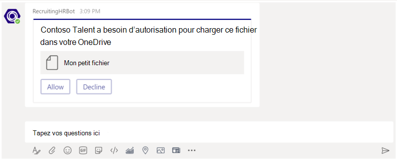
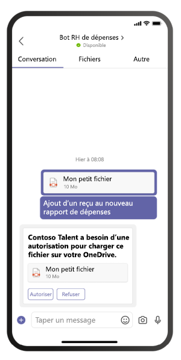

# <a name="send-and-receive-files-through-your-bot"></a>Envoyer et recevoir des fichiers via votre bot

[!include[v3-to-v4-SDK-pointer](~/includes/v3-to-v4-pointer-bots.md)]

Il existe deux façons d'envoyer des fichiers vers et à partir d'un bot :

* Utilisation des API Microsoft Graph. Cette méthode fonctionne pour les bots dans toutes les étendues dans Teams :
  * `personal`
  * `channel`
  * `groupchat`
* Utilisation des API Teams. Ces fichiers ne sont en charge que dans un contexte :
  * `personal`

## <a name="using-the-microsoft-graph-apis"></a>Utilisation des API Microsoft Graph

Vous pouvez publier des messages avec des pièces jointes de carte faisant référence à des fichiers SharePoint existants à l'aide des API Microsoft Graph pour [OneDrive et SharePoint.](/onedrive/developer/rest-api/) L'utilisation des API Graph nécessite l'obtention de l'accès au dossier OneDrive d'un utilisateur (pour et fichiers) ou aux fichiers dans les canaux d'une équipe (pour les fichiers) via le flux `personal` `groupchat` d'autorisation `channel` OAuth 2.0 standard. Cette méthode fonctionne dans toutes les étendues Teams.

## <a name="using-the-teams-bot-apis"></a>Utilisation des API du bot Teams

> [!NOTE]
> Cette méthode fonctionne uniquement dans le `personal` contexte. Elle ne fonctionne pas dans le `channel` contexte ou dans le `groupchat` contexte.

Votre bot peut directement envoyer et recevoir des fichiers avec des utilisateurs dans le contexte, également appelé conversations personnelles, à l'aide des `personal` API Teams. Cela vous permet d'implémenter des notes de frais, la reconnaissance d'image, l'archivage de fichiers, des signatures e et d'autres scénarios impliquant une manipulation directe du contenu de fichier. Les fichiers partagés dans Teams s'affichent généralement sous la main de cartes et permettent un affichage enrichi dans l'application.

Les sections suivantes décrivent comment faire pour envoyer du contenu de fichier suite à une interaction directe de l'utilisateur, comme l'envoi d'un message. Cette API est fournie dans le cadre de la plateforme de bot Microsoft Teams.

### <a name="configure-your-bot-to-support-files"></a>Configurer votre bot pour prendre en charge les fichiers

Pour envoyer et recevoir des fichiers dans votre bot, vous devez définir la propriété `supportsFiles` dans le manifeste sur `true` . Cette propriété est décrite dans la section [bots](~/resources/schema/manifest-schema.md#bots) de la référence du manifeste.

La définition ressemblera à ceci `"supportsFiles": true` : Si votre bot n'est pas `supportsFiles` activé, les fonctionnalités suivantes ne fonctionneront pas.

### <a name="receiving-files-in-personal-chat"></a>Réception de fichiers dans une conversation personnelle

Lorsqu'un utilisateur envoie un fichier à votre bot, le fichier est d'abord téléchargé vers le stockage OneDrive Entreprise de l'utilisateur. Votre bot reçoit ensuite une activité de message vous notifiant du chargement de l'utilisateur. L'activité contiendra des métadonnées de fichier, telles que son nom et l'URL de contenu. Vous pouvez lire directement à partir de cette URL pour récupérer son contenu binaire.

#### <a name="message-activity-with-file-attachment-example"></a>Exemple d'activité de message avec pièce jointe

```json
{
  "attachments": [{
    "contentType": "application/vnd.microsoft.teams.file.download.info",
    "contentUrl": "https://contoso.sharepoint.com/personal/johnadams_contoso_com/Documents/Applications/file_example.txt",
    "name": "file_example.txt",
    "content": {
      "downloadUrl" : "https://download.link",
      "uniqueId": "1150D938-8870-4044-9F2C-5BBDEBA70C9D",
      "fileType": "txt",
      "etag": "123"
    }
  }]
}
```

Le tableau suivant décrit les propriétés de contenu de la pièce jointe :

| Propriété | Objectif |
| --- | --- |
| `downloadUrl` | URL OneDrive pour la récupération du contenu du fichier. Vous pouvez émettre `HTTP GET` une adresse directement à partir de cette URL. |
| `uniqueId` | ID de fichier unique. Il s'agit de l'ID d'élément de lecteur OneDrive, dans le cas où l'utilisateur envoie un fichier à votre bot. |
| `fileType` | Type d'extension de fichier, tel que pdf ou docx. |

En tant que meilleure pratique, vous devez reconnaître le chargement du fichier en renvoyant un message à l'utilisateur.

### <a name="uploading-files-to-personal-chat"></a>Téléchargement de fichiers dans une conversation personnelle

Le téléchargement d'un fichier vers un utilisateur implique les étapes suivantes :

1. Envoyez un message à l'utilisateur demandant l'autorisation d'écrire le fichier. Ce message doit contenir `FileConsentCard` une pièce jointe avec le nom du fichier à télécharger.
2. Si l'utilisateur accepte le téléchargement du fichier, votre bot reçoit une activité *Invoke* avec une URL d'emplacement.
3. Pour transférer le fichier, votre bot effectue une entrée directement dans `HTTP POST` l'URL d'emplacement fournie.
4. Si vous le souhaitez, vous pouvez supprimer la carte de consentement d'origine si vous ne souhaitez pas autoriser l'utilisateur à accepter d'autres téléchargements du même fichier.

#### <a name="message-requesting-permission-to-upload"></a>Message demandant l'autorisation de téléchargement

Ce message de bureau contient un objet de pièce jointe simple demandant l'autorisation de l'utilisateur pour télécharger le fichier :



Ce message mobile contient un objet pièce jointe demandant l'autorisation de l'utilisateur pour télécharger le fichier :



```json
{
  "attachments": [{
    "contentType": "application/vnd.microsoft.teams.card.file.consent",
    "name": "file_example.txt",
    "content": {
      "description": "<Purpose of the file, such as: this is your monthly expense report>",
      "sizeInBytes": 1029393,
      "acceptContext": {
      },
      "declineContext": {
      }
    }
  }]
}
```

Le tableau suivant décrit les propriétés de contenu de la pièce jointe :

| Propriété | Objectif |
| --- | --- |
| `description` | Description du fichier. Peut être présenté à l'utilisateur pour décrire son objectif ou pour résumer son contenu. |
| `sizeInBytes` | Fournit à l'utilisateur une estimation de la taille du fichier et de la quantité d'espace qu'il prendra dans OneDrive. |
| `acceptContext` | Contexte supplémentaire qui sera transmis silencieusement à votre bot lorsque l'utilisateur acceptera le fichier. |
| `declineContext` | Contexte supplémentaire qui sera transmis silencieusement à votre bot lorsque l'utilisateur refusera le fichier. |

#### <a name="invoke-activity-when-the-user-accepts-the-file"></a>Appeler l'activité lorsque l'utilisateur accepte le fichier

Une activité d'appel est envoyée à votre bot si et quand l'utilisateur accepte le fichier. Il contient l'URL de l'espace réservé OneDrive Entreprise que votre bot peut ensuite émettre pour transférer `PUT` le contenu du fichier. Pour plus d'informations sur le chargement vers l'URL OneDrive, lisez cet article : Charger des [octets vers la session de chargement.](/onedrive/developer/rest-api/api/driveitem_createuploadsession#upload-bytes-to-the-upload-session)

L'exemple suivant montre une version abrégée de l'activité d'appel que votre bot recevra :

```json
{
  ...

  "name": "fileConsent/invoke",
  "value": {
    "type": "fileUpload",
    "action": "accept",
    "context": {
    },
    "uploadInfo": {
      "contentUrl": "https://contoso.sharepoint.com/personal/johnadams_contoso_com/Documents/Applications/file_example.txt",
      "name": "file_example.txt",
      "uploadUrl": "https://upload.link",
      "uniqueId": "1150D938-8870-4044-9F2C-5BBDEBA70C8C",
      "fileType": "txt",
      "etag": "123"
    }
  }
}
```

De même, si l'utilisateur refuse le fichier, votre bot recevra l'événement suivant, avec le même nom d'activité globale :

```json
{
  "name": "fileConsent/invoke",
  "value": {
    "type": "fileUpload",
    "action": "decline",
    "context": {
    }
  }
}
```

### <a name="notifying-the-user-about-an-uploaded-file"></a>Informer l'utilisateur d'un fichier téléchargé

Après avoir téléchargé un fichier sur le OneDrive de l'utilisateur, que vous utilisiez le mécanisme décrit ci-dessus ou des API déléguées par l'utilisateur OneDrive, vous devez envoyer un message de confirmation à l'utilisateur. Ce message doit contenir une pièce jointe sur qui l'utilisateur peut cliquer, soit pour l'afficher un `FileCard` aperçu, l'ouvrir dans OneDrive, soit la télécharger localement.

```json
{
  "attachments": [{
    "contentType": "application/vnd.microsoft.teams.card.file.info",
    "contentUrl": "https://contoso.sharepoint.com/personal/johnadams_contoso_com/Documents/Applications/file_example.txt",
    "name": "file_example.txt",
    "content": {
      "uniqueId": "1150D938-8870-4044-9F2C-5BBDEBA70C8C",
      "fileType": "txt",
    }
  }]
}
```

Le tableau suivant décrit les propriétés de contenu de la pièce jointe :

| Propriété | Objectif |
| --- | --- |
| `uniqueId` | ID d'élément de lecteur OneDrive/SharePoint. |
| `fileType` | Type de fichier, tel que pdf ou docx. |

### <a name="basic-example-in-c"></a>Exemple de base en C #

L'exemple suivant montre comment gérer les téléchargements de fichiers et envoyer des demandes de consentement de fichier dans la boîte de dialogue de votre bot.

```csharp

// This sample dialog shows two simple flows:
// 1) A silly example of receiving a file from the user, processing the key elements,
//    and then constructing the attachment and sending it back.
// 2) Creating a new file consent card requesting user permission to upload a file.
private async Task MessageReceivedAsync(IDialogContext context, IAwaitable<object> result)
{
    var replyMessage = context.MakeMessage();
    Attachment returnCard;

    var message = await result as Activity;

    // Check to see if the user is sending the bot a file.
    if (message.Attachments != null && message.Attachments.Any())
    {
        var attachment = message.Attachments.First();

        if (attachment.ContentType == FileDownloadInfo.ContentType)
        {
            FileDownloadInfo downloadInfo = (attachment.Content as JObject).ToObject<FileDownloadInfo>();
            if (downloadInfo != null)
            {
                returnCard = CreateFileInfoAttachment(downloadInfo, attachment.Name, attachment.ContentUrl);
                replyMessage.Attachments.Add(returnCard);
            }
        }
    }
    else
    {
        // Illustrates creating a file consent card.
        returnCard = CreateFileConsentAttachment();
        replyMessage.Attachments.Add(returnCard);
    }
    await context.PostAsync(replyMessage);
}


private static Attachment CreateFileInfoAttachment(FileDownloadInfo downloadInfo, string name, string contentUrl)
{
    FileInfoCard card = new FileInfoCard()
    {
        FileType = downloadInfo.FileType,
        UniqueId = downloadInfo.UniqueId
    };

    Attachment att = card.ToAttachment();
    att.ContentUrl = contentUrl;
    att.Name = name;

    return att;
}

private static Attachment CreateFileConsentAttachment()
{
    JObject acceptContext = new JObject();
    // Fill in any additional context to be sent back when the user accepts the file.

    JObject declineContext = new JObject();
    // Fill in any additional context to be sent back when the user declines the file.

    FileConsentCard card = new FileConsentCard()
    {
        AcceptContext = acceptContext,
        DeclineContext = declineContext,
        SizeInBytes = 102635,
        Description = "File description"
    };

    Attachment att = card.ToAttachment();
    att.Name = "Example file";

    return att;
}
```
