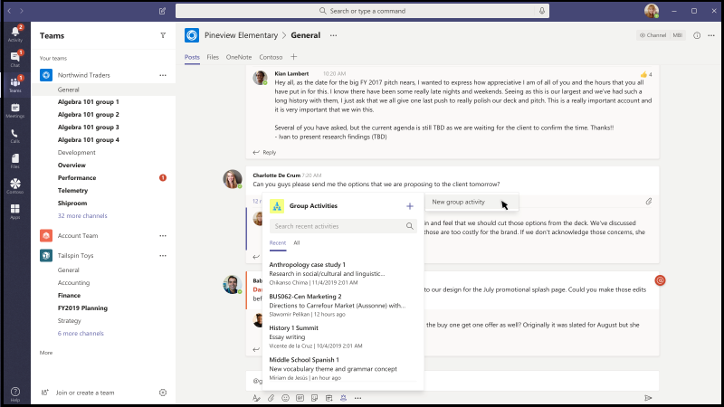

# Modèles d’application pour Microsoft teamsApp Templates for Microsoft Teams

Les modèles d’application sont des applications prêtes pour la production pour Microsoft Teams, basées sur la Communauté, la source ouverte et disponibles sur GitHub.App templates are production-ready apps for Microsoft Teams that are community driven, open-source, and available on GitHub. Chacun d’eux contient des instructions détaillées pour le déploiement et l’installation de cette application pour votre organisation, en fournissant une application prête à l’emploi que vous pouvez installer et commencer à utiliser immédiatement.Each contains detailed instructions for deploying and installing that app for your organization, providing a ready-to-use app that you can install and begin using immediately. Le code source complet est également disponible, ce qui vous permet de l’Explorer en détail ou de le modifier pour répondre à vos besoins spécifiques.The complete source code is available as well, so you can explore it in detail, or fork the code and alter it to meet your specific needs.

**&#9734; indique des modèles d’application récemment publiés.****&#9734; Indicates newly released app templates.**

### Principaux avantagesKey benefits

* **Expérience plug-and-Play :** Tous les modèles d’application incluent des scripts de déploiement qui vous permettront d’héberger tous les services nécessaires dans Microsoft Azure.**Plug and play experience:** All app templates include deployments scripts that will allow you to host all necessary services in Microsoft Azure. Aucun codage n’est requis pour déployer les applications.No coding is required to deploy the apps.
* **Code prêt pour la production :** Les modèles d’application sont conformes aux meilleures pratiques recommandées en matière de sécurité et d’infrastructure, et toutes les modifications apportées à celles-ci sont examinées afin de garantir une poursuite de la conformité.**Production-ready code:** The app templates conform to recommended best practices around security and infrastructure, and all community submitted changes to them are reviewed to ensure continued conformance.
* **Personnalisable et extensible :** Alors que tous les modèles d’application sont prêts à être déployés tels quels, nous fournissons la base de code et les scripts de déploiement complets afin que vous puissiez facilement les personnaliser ou les étendre afin de répondre à vos besoins spécifiques.**Customizable and extensible:** While all app templates are ready to deploy as they are, we provide the entire code base and deployment scripts so that you can easily customize or extend them to fit your unique needs.
* **Documentation détaillée & la prise en charge :** Tous les modèles d’application sont accompagnés d’une documentation de bout en bout sur l’architecture de la solution, le déploiement et les étapes de configuration.**Detailed documentation & support:** All app templates are accompanied by end-to-end documentation on solution architecture, deployment, and configuration steps. Les référentiels étant également surveillés, veuillez signaler tous les problèmes que vous rencontrez en générant un problème sur GitHub.The repositories are monitored as well, so please report any issues you encounter by raising an Issue on GitHub.

## Demander une &#9734;Ask Away &#9734;

Ask out est un [robot Microsoft teams](../bots/what-are-bots.md) qui permet aux utilisateurs de passer des sessions Q&a (question et réponse) dans Teams.Ask Away is a [Microsoft Teams bot](../bots/what-are-bots.md) that enables users to conduct Q&A (Question and Answer) sessions within Teams. À l’aide du robot Ask, les membres de l’équipe peuvent envoyer des questions de vote et de vote partagées par des collègues, ce qui permet à Q&un hôte de recueillir facilement des questions de premier plan dans un canal ou une conversation.Using the Ask Away bot, team members can submit and up-vote questions shared by colleagues allowing Q&A hosts to easily gather top-of-mind questions within a channel or chat. Le bot peut être utilisé pour mener un Q en temps réel&une session dans une réunion teams et permet aux participants d’envoyer des questions en direct via une conversation.The bot can be used to conduct a real-time Q&A session in a Teams meeting and allows attendees to submit questions live via chat.

[L’obtenir sur GitHubGet it on GitHub](https://github.com/OfficeDev/microsoft-teams-apps-askaway)

:::row:::
  :::column span="2":::
      
:::column-end:::
:::row-end:::

## Informations du collaborateurAssociate Insights

Associate Insights est un modèle [d’applications puissantes](/powerapps/maker/canvas-apps/embed-teams-app) qui permet aux employés terrain de capturer et d’envoyer directement des avis sur le client, des sentiments et des idées.Associate Insights is a [Power Apps](/powerapps/maker/canvas-apps/embed-teams-app) template that empowers firstline workers to directly capture and submit customer opinion, sentiment, and perception. Les travailleurs terrain sont souvent le premier représentant de la société à s’adresser à des clients dans un point de contact un-à-un.Firstline workers are often the first company representative to engage with customers in a one-to-one point-of contact. Les données collectées peuvent être partagées et utilisées de façon collaborative par Teams, par exemple, via un onglet Team BI Teams, pour améliorer les produits et améliorer l’expérience client.The collected data can be shared and used collaboratively by business teams, e.g., via a Power BI Teams tab, for product improvement and enhancing the customer experience.

[L’obtenir sur GitHubGet it on GitHub](https://github.com/OfficeDev/microsoft-teams-apps-associateinsights)

:::row:::
  :::column span="2":::
      
:::column-end:::
:::row-end:::
:::row:::
:::column span="2":::
    
:::column-end:::
:::row-end:::

## PrésenceAttendance

L’application de participation est un onglet [d’applications puissantes](/powerapps/maker/canvas-apps/embed-teams-app) qui peut être épinglé dans une équipe.The Attendance app is a [Power Apps](/powerapps/maker/canvas-apps/embed-teams-app) tab that can be pinned in a team. Elle est conçue pour enregistrer la présence, généralement dans des paramètres tels que les environnements d’apprentissage et de formation.It is designed to record presence, typically in settings such as learning and training environments. Les utilisateurs peuvent marquer ou modifier la participation pendant 30 jours au plus et afficher des rapports de présence résumés pour un groupe entier ou des participants individuels.Users can mark or edit attendance for up to 30 days in the past and view summarized attendance reports for an entire group or individual attendees.

[L’obtenir sur GitHubGet it on GitHub](https://github.com/OfficeDev/microsoft-teams-apps-attendance)

## Livre-a-roomBook-a-room

Book-a-Room est un [robot Microsoft teams](../bots/what-are-bots.md) qui permet aux utilisateurs de trouver et de réserver rapidement une salle de réunion pour 30 (par défaut), 60 ou 90 minutes à compter de l’heure actuelle.Book-a-room is a [Microsoft Teams bot](../bots/what-are-bots.md) that lets users quickly find and reserve a meeting room for 30 (default), 60, or 90 minutes starting from the current  time. Les étendues de bot livre-a-room aux conversations personnelles ou 1:1.The Book-a-room bot scopes to personal or 1:1 conversations.

[L’obtenir sur GitHubGet it on GitHub](https://github.com/OfficeDev/microsoft-teams-apps-bookaroom)

## Création d' &#9734; d’accèsBuilding Access &#9734;

La création d’accès est une application Microsoft [Power Platform](https://powerapps.microsoft.com/blog/now-in-preview-customize-teams-with-built-in-power-platform-capabilities/)qui prend en charge l’administration des seuils d’occupation et des normes sociales Distancing en permettant aux directeurs d’installations de gérer, de suivre et de signaler la présence sur site des employés.Building Access is a Microsoft [Power Platform](https://powerapps.microsoft.com/blog/now-in-preview-customize-teams-with-built-in-power-platform-capabilities/)-based app that supports the administration of building occupancy thresholds and social distancing norms by enabling facilities directors to manage, track, and report employee on-site presence. L’application, créée à l’aide de Microsoft [Power Apps](/powerapps/powerapps-overview)et [Power automate](/power-automate/getting-started), s’intègre étroitement à Microsoft teams et permet aux organisations de déterminer la préparation de la construction, d’établir des critères d’éligibilité pour l’accès sur site et de collecter des informations pour une planification future.The app, built using Microsoft [Power Apps](/powerapps/powerapps-overview), and [Power Automate](/power-automate/getting-started), deeply integrates with Microsoft Teams and enables organizations to determine building readiness, establish eligibility criteria for on-site access, and gather insights for future planning.

[L’obtenir sur GitHubGet it on GitHub](https://github.com/OfficeDev/microsoft-teams-apps-buildingaccess)

:::row:::
   :::column span="":::
     
   :::column-end:::
   :::column span="":::
      
   :::column-end:::
:::row-end:::

## CélébrationsCelebrations

Celebrations est une application de teams qui permet aux membres de l’équipe de célébrer les anniversaires, les commémorations et autres événements périodiques.Celebrations is a Teams app that helps team members celebrate each others' birthdays, anniversaries, and other recurring events. Il se souvient des occasions spéciales de tous les membres de l’équipe et envoie un message convivial dans toutes les équipes sélectionnées au moment de la création d’un événement, afin que les membres de l’équipe semblent particuliers le jour.It remembers special occasions of all the team members and sends a friendly message in all the teams selected at the time of event creation, to make the team members feel special on their day.

L’application fournit une interface simple permettant à tous les membres de l’équipe d’ajouter et d’afficher personnellement leurs événements et permet également à l’utilisateur de sélectionner les équipes dans lesquelles les événements sont partagés.The app provides an easy interface for all the team members to personally add and view their events and also allows the user to select the teams in which the events gets shared.

[L’obtenir sur GitHubGet it on GitHub](https://github.com/OfficeDev/microsoft-teams-celebrations-app)

## Liste de vérification &#9734;Checklist &#9734;

Liste de contrôle est une application d' [extension de messagerie](../messaging-extensions/what-are-messaging-extensions.md) Microsoft teams personnalisée qui vous permet de collaborer avec votre équipe en créant une liste de vérification partagée dans une conversation ou un canal.Checklist is a custom Microsoft Teams [messaging extension](../messaging-extensions/what-are-messaging-extensions.md) app that enables you to collaborate with your team by creating a shared checklist in a chat or channel. L’application est prise en charge sur tous les clients de la plate-forme Teams (ordinateur de bureau, navigateur, iOS et Android) et est prête pour le déploiement dans le cadre de votre abonnement Microsoft 365.The app is supported across all Teams platform clients —  desktop, browser, iOS, and Android — and is ready for deployment as part of your Microsoft 365 subscription.  

[L’obtenir sur GitHubGet it on GitHub](https://github.com/OfficeDev/microsoft-teams-checklist-app )

:::row:::
:::column span="2":::
      
:::column-end:::
:::row-end:::

## Communicateur d’entrepriseCompany Communicator

L’application Communicator de l’entreprise permet aux équipes de créer et d’envoyer des messages destinés à plusieurs équipes ou à un grand nombre d’employés via une conversation, ce qui permet aux organisations d’atteindre directement les employés où elles collaborent.The Company Communicator app enables corporate teams to create and send messages intended for multiple teams or large number of employees over chat allowing organization to reach employees right where they collaborate. Utilisez ce modèle pour plusieurs scénarios tels que les nouvelles annonces de l’initiative, l’intégration des employés, l’apprentissage et le développement modernes ou les diffusions à l’échelle de l’organisation.Utilize this template for multiple scenarios such as new initiative announcements, employee onboarding, modern learning and development or organization-wide broadcasts.

L’application fournit une interface simple permettant aux utilisateurs désignés de créer, de prévisualiser, de collaborer et d’envoyer des messages.The app provides an easy interface for designated users to create, preview, collaborate and send messages.

Elle permet de créer des fonctionnalités de communication ciblées personnalisées, telles que la télémétrie personnalisée sur le nombre d’utilisateurs ayant reçu ou interagi avec un message.It provides a foundation to build custom targeted communication capabilities such as custom telemetry on how many users acknowledged or interacted with a message.

[L’obtenir sur GitHubGet it on GitHub](https://github.com/OfficeDev/microsoft-teams-company-communicator-app)

## &#9734; de recherche de groupe de contactsContact Group Lookup &#9734;

L’application de recherche de groupe de contacts offre une approche pratique et utile de la création, de l’accès et de la gestion des groupes de contacts de votre organisation (anciennement appelé listes de distribution ou groupes de communication).The Contact Group Lookup app provides a convenient and useful approach to creating, accessing, and managing your organization's contact groups (formerly known as distribution lists or communication groups). Les utilisateurs peuvent rapidement afficher et converser avec les membres d’un groupe, afficher le statut des membres et créer une conversation de groupe avec des membres sélectionnés dans le groupe de contacts, dans l’environnement de teams.Users can quickly view and chat with group members, view member status, and create a group chat with selected members in the contact group, all within the Teams environment.

[L’obtenir sur GitHubGet it on GitHub](https://github.com/OfficeDev/microsoft-teams-app-contactgrouplookup)

:::row:::
:::column span="2":::
      
:::column-end:::
:::row-end:::
:::row:::
:::column span="2":::
    
:::column-end:::
:::row-end:::

## CrowdSourcerCrowdSourcer

CrowdSourcer est un [robot Microsoft teams](../bots/what-are-bots.md) qui donne aux équipes des informations de la part des membres du groupe.CrowdSourcer is a [Microsoft Teams bot](../bots/what-are-bots.md) that gives teams queried information sourced collaboratively from group members. Il s’agit d’un excellent moyen de répondre aux questions fréquemment posées, tout en permettant aux participants de s’engager activement et de contribuer à une ressource d’informations amusantes et utiles.It's a great way to answer frequently asked questions while enabling participants to actively engage in and contribute to a fun and helpful information resource.

[L’obtenir sur GitHubGet it on Github](https://github.com/OfficeDev/microsoft-teams-crowdsourcer-app)

## Autocollants personnalisésCustom Stickers

L’auto-expression est essentielle pour une culture d’équipe saine.Self-expression is core to a healthy team culture. Ce modèle d’application est une [extension de messagerie](~/messaging-extensions/what-are-messaging-extensions.md) qui permet à vos utilisateurs d’utiliser des autocollants et des images gif personnalisées dans Microsoft Teams.This app template is a [messaging extension](~/messaging-extensions/what-are-messaging-extensions.md) that enables your users to use custom stickers and GIFs within Microsoft Teams. Ce modèle offre une expérience de configuration Web simple où un utilisateur disposant d’un accès à la configuration peut télécharger les images gif/autocollantes/images dont il veut que les utilisateurs finals disposent, ce qui permet à l’ensemble de votre équipe d’utiliser n’importe quel ensemble d’autocollants que vous avez choisis.This template provides an easy web-based configuration experience where anyone with configuration access can upload the GIFs/stickers/images they want their end-users to have, allowing your entire team to use any set of stickers you chose.

Cette application permet également de partager facilement des images/des images/gif/autocollants entre les équipes sans avoir à accéder à des sites SharePoint ou à des canaux individuels comme mécanismes de stockage et de partage.This app also enables easy sharing of images/GIFs/stickers across teams without needing access to SharePoint sites or individual channels as storage and sharing mechanisms. Par exemple, les équipes de produits peuvent facilement partager des images de produits et des images gif sur des équipes de marketing, de marketing et de médias sociaux par programme.For example, product teams can easily share product images and GIFs to social media, marketing and sales teams programmatically. Il est également possible d’étendre cette application en déclenchant un flux de notification à des équipes ou des utilisateurs spécifiques lorsque de nouvelles images/gif sont mis à disposition.One can also extend this app by triggering a notification flow to specific teams/individuals when new images/GIFs are made available.

[L’obtenir sur GitHubGet it on GitHub](https://github.com/OfficeDev/microsoft-teams-stickers-app)

## &#9734; des prescriptions EE-Prescriptions &#9734; 

E-prescription est une application basée sur les [applications puissantes](/powerapps/maker/canvas-apps/embed-teams-app)qui améliore le télémédecin et la fonction Virtual Care en automatisant le processus d’émission de préscriptions pour les patients.E-Prescriptions is a [Power Apps](/powerapps/maker/canvas-apps/embed-teams-app)-based app that enhances telemedicine and virtual care by automating the process of issuing e-prescriptions to patients. Les professionnels de l’médecine peuvent rapidement consulter les rendez-vous, générer des préscriptions et envoyer des courriers électroniques avec des pièces jointes aux patients directement dans la plateforme Teams.Medical professionals can quickly review appointments, generate e-prescriptions, and send emails with e-prescription attachments to patients directly within the Teams platform.

[L’obtenir sur GitHubGet it on GitHub](https://github.com/OfficeDev/microsoft-teams-apps-eprescription) 

:::row:::
:::column span="2":::
      
:::column-end:::
:::row-end:::
:::row:::
:::column span="2":::
    
:::column-end:::
:::row-end:::

## &#9734; de formation des employésEmployee Training &#9734;

La formation des employés est une application Microsoft teams qui permet aux organisateurs de publier, de suivre et de promouvoir facilement des événements d’apprentissage et de formation pour votre organisation.Employee training is a Microsoft Teams app that enables organizers to easily publish,  track, and promote learning and training events for your organization.  Avec l’application, les planificateurs d’événements peuvent envoyer des rappels et des notifications aux inscrits d’événements et les employés peuvent indiquer un intérêt pour les événements à venir, rester informés sur les événements actuels et partager les détails de l’événement avec des collègues via l’extension de messagerie Teams.With the app, event planners can send reminders and notifications to event registrants and employees can indicate interest in upcoming events, stay updated on current events, and share event details with colleagues via the Teams messaging extension.

[L’obtenir sur GitHubGet it on GitHub](https://github.com/OfficeDev/microsoft-teams-apps-employeetraining)

:::row:::
:::column span="2":::
    **Afficher les événements** **View employee training events**   
:::column-end:::
:::row-end:::
:::row:::
:::column span="2":::
    **Créer un événement** **Create employee training event** 
:::column-end:::
:::row-end:::

## Finder expertExpert Finder

Le Finder expert est un [robot Microsoft teams](../bots/what-are-bots.md) qui identifie les membres spécifiques de l’organisation en fonction de leurs compétences, de leurs centres d’intérêt et de leurs attributs d’éducation.Expert Finder is a [Microsoft Teams bot](../bots/what-are-bots.md) that identifies specific organization members based on their skills, interests, and education attributes. Les membres recherchent des experts au sein d’une organisation qui correspondent à une recherche par mot clé des profils utilisateur Azure Active Directory.Members find experts within an organization  that match a keyword search of Azure Active Directory user profiles.

[L’obtenir sur GitHubGet it on GitHub](https://github.com/OfficeDev/microsoft-teams-apps-expertfinder)

## Forum aux questionsFAQ Plus

Q conversation&les robots sont un moyen simple de fournir des réponses aux questions fréquemment posées par les utilisateurs.Conversational Q&A bots are an easy way to provide answers to frequently asked questions by users. Toutefois, la plupart des bots ne s’engagent pas correctement avec les utilisateurs, car il n’y a aucun humain dans la boucle lorsque le bot échoue.However, most bots fail to engage with users in meaningful way because there is no human in the loop when the bot fails. Le bot FAQ est un Q convivial&un bot qui amène un humain dans la boucle lorsqu’il n’est pas en mesure d’aider.FAQ bot is a friendly Q&A bot that brings a human in the loop when it is unable to help. Un peut poser une question au bot et le bot répond avec une réponse si elle est contenue dans la base de connaissances.One can ask the bot a question and the bot responds with an answer if it is contained in the knowledge base. Si ce n’est pas le cas, le bot permet à l’utilisateur de soumettre une requête qui est ensuite publiée dans une équipe d’experts préconfigurée qui aide à prendre en charge les notifications à partir de l’équipe elle-même.If not, the bot allows the user to submit a query which then gets posted to a pre-configured team of experts who help to provide support by acting upon the notifications from within the team itself.

> [!NOTE]
> La dernière version de **FAQ plus** prend en charge les meilleures&une résolution en permettant à une équipe d’experts d’effectuer les opérations suivantes :The latest release of **FAQ Plus** supports improved Q&A resolutions by enabling a team of experts to complete the following:
>
> &#x2714; ajouter de nouvelles&Q directement à la base de connaissances à l’aide des extensions de message.&#x2714; Add new Q&As directly to the knowledge base using message extensions.
>
> &#x2714; modifier et supprimer Q&une paire ajoutée par un bot.&#x2714; Edit and delete Q&A pairs added by a bot.
>
> &#x2714; effectuer le suivi de l’historique des révisions de Q&en tant que.&#x2714; Track the revision history of Q&As.
>
> &#x2714; configurer une réponse avec des détails supplémentaires à afficher sous forme de [carte adaptative](../task-modules-and-cards/cards/cards-reference.md#adaptive-card).&#x2714; Configure an answer with additional details to display as an [adaptive card](../task-modules-and-cards/cards/cards-reference.md#adaptive-card).
>
[**L’obtenir sur GitHub****Get it on GitHub**](https://github.com/OfficeDev/microsoft-teams-apps-faqplusv2)

## Suivi des objectifsGoal Tracker

L’application de suivi des objectifs est une solution complète pour votre organisation afin de prendre en charge la définition des objectifs, d’observer la progression et de reconnaître la réussite de Microsoft Teams.The Goal Tracker app is a comprehensive solution for your organization to support establishing goals, observing progress, and acknowledging success within Microsoft Teams. L’application permet aux utilisateurs de définir, suivre et mettre à jour les objectifs au niveau professionnel, personnel et d’équipe.The app enables users to set, track, and update objectives on a professional, personal, and team level. Les membres de l’équipe reçoivent également des rappels et des mises à jour d’État opportuns pour rester concentrés et rester sur le suivi.Team members also receive timely reminders and status updates to remain focused and stay on track.

[L’obtenir sur GitHubGet it on GitHub](https://github.com/OfficeDev/microsoft-teams-app-goaltracker)

:::row:::
  :::column span="2":::
      
:::column-end:::
:::row-end:::
:::row:::
:::column span="2":::
    
:::column-end:::
:::row-end:::

## Idées intéressantesGreat Ideas

L’application Great Ideas prend en charge l’innovation et la créativité au sein de votre organisation.The Great Ideas app supports and empowers innovation and creativity within your organization. L’application permet à vos employés de partager des idées avec des collègues et un leadership, de découvrir de nouvelles soumissions, de tenir des contributions à l’équipe et de diffuser leur vote pour les meilleures propositions au sein de Microsoft Teams.The app enables your employees to share ideas with colleagues and leadership, discover new submissions, spotlight contributions for peer consideration, and cast their vote for the best proposals within Microsoft Teams.

[L’obtenir sur GitHubGet it on GitHub](https://github.com/OfficeDev/microsoft-teams-apps-greatideas)

:::row:::
  :::column span="2":::
      
:::column-end:::
:::row-end:::
:::row:::
:::column span="2":::
    
:::column-end:::
:::row-end:::

## Activités de groupeGroup Activities

Activités de groupe est une application Microsoft teams qui permet aux propriétaires d’équipe de créer facilement des groupes d’activités et de gérer les flux de travail de collaboration dans le contexte de Microsoft Teams.Group Activities is a Microsoft Teams app that makes it easy for team owners to quickly create activity groups and manage collaboration workflows within the context of Microsoft Teams. Les auteurs d’activité sont activés pour créer des activités, distribuent de manière aléatoire les membres de l’équipe dans des groupes et, éventuellement, le bot envoie des rappels jusqu’à ce que les activités soient terminées.Activity authors are enabled to create activities, randomly distribute team members in groups, and optionally have the bot send reminders until activities are complete.

[L’obtenir sur GitHubGet it on GitHub](https://github.com/OfficeDev/microsoft-teams-apps-groupactivities)

:::row:::
  :::column span="2":::
      
:::column-end:::
:::row-end:::
:::row:::
:::column span="2":::
    
:::column-end:::
:::row-end:::

## Développez vos compétencesGrow Your Skills

L’application développer vos compétences prend en charge la croissance et le développement professionnels en permettant aux employés de contribuer à des projets supplémentaires pour votre organisation tout en apprenant de nouvelles compétences.The Grow Your Skills app supports professional growth and development by enabling employees to contribute to supplemental projects for your organization while simultaneously learning new skills. Les employés peuvent utiliser l’application pour localiser les opportunités qui correspondent à leurs centres d’intérêt, profiter d’une collaboration efficace avec des pairs et acquérir de nouveaux niveaux de compétences et de fonctionnalités, tout au sein de l’environnement Teams.Employees can use the app to locate opportunities that meet their interests, enjoy meaningful collaboration with peers, and acquire new levels of expertise and capabilities, all within the Teams environment.

[L’obtenir sur GitHubGet it on GitHub](https://github.com/OfficeDev/microsoft-teams-apps-growyourskills)

:::row:::
  :::column span="2":::
      
:::column-end:::
:::row-end:::
:::row:::
:::column span="2":::
    
:::column-end:::
:::row-end:::

## Prise en charge RHHR Support

HR support bot est un Q convivial&un bot qui fournit un spécialiste/expert du support technique de l’équipe RH dans la boucle lorsqu’il ne peut pas aider.HR Support bot is a friendly Q&A bot that brings a support professional/expert from the HR team in the loop when it is unable to help. Un peut poser une question au bot et le bot répond avec une réponse si elle est contenue dans la base de connaissances.One can ask the bot a question and the bot responds with an answer if it is contained in the knowledge base. Si ce n’est pas le cas, le bot permet à l’utilisateur de soumettre une requête qui est ensuite publiée dans une équipe d’experts préconfigurée qui aide à fournir une assistance en agissant sur les notifications à partir de son équipe.If not, the bot allows the user to submit a query which then gets posted in a pre-configured team of experts who are help to provide support by acting upon the notifications from within their team itself. De plus, le bot propose des liens vers des questions/stratégies RH recommandées en recherchant des balises préconfigurées dans la question.Additionally, the bot suggests links to recommended HR policies/questions by searching for pre-configured tags in the question. Ces vignettes sont également disponibles dans l’onglet associé sous forme de référence rapide.These tiles can also be found in the associated tab as a quick reference. La prise en charge des RH fonctionne bien pour les QnA de poids léger et pour fournir une assistance rapide lors du lancement de nouveaux projets/initiatives au sein de l’organisation.HR Support works well for light weight QnA and to provide quick support when launching new projects/initiatives in the organization.

[L’obtenir sur GitHubGet it on GitHub](https://github.com/OfficeDev/microsoft-teams-hrsupport-app)

## Brise-glaceIcebreaker

Il s’agit d’un [robot Microsoft teams](../bots/what-are-bots.md) qui permet à votre équipe de se rapprocher en appariant deux membres d’équipe aléatoires, chaque semaine, pour répondre à vos besoins.Icebreaker is a [Microsoft Teams bot](../bots/what-are-bots.md) that helps your team get closer by pairing two random team members up every week to meet. Le bot facilite la planification en suggérant automatiquement des temps libres qui fonctionnent pour les deux membres.The bot makes scheduling easy by automatically suggesting free times that work for both members. Renforcer les connexions personnelles et créer une communauté étroitement à l’aide de cette application.Strengthen personal connections and build a tightly knit community with this app.

En plus d’encourager les connexions personnelles à l’ensemble de votre équipe, l’application brise-glace peut vous aider à cultiver des communautés d’intérêt au sein de votre organisation.In addition to encouraging personal connections across your entire team, the Icebreaker app can help cultivate interest-based communities within your organization. Par exemple, vous pouvez utiliser cette application pour un groupe d’intérêt DevOps afin d’aider les idées et les meilleures pratiques dispersées dans votre organisation.For example, you can use this app for a DevOps interest group to help ideas and best practices organically spread across your organization.

[L’obtenir sur GitHubGet it on GitHub](https://github.com/OfficeDev/microsoft-teams-icebreaker-app)

## EncouragementIncentives

Incentives est un modèle [d’applications puissantes](/powerapps/maker/canvas-apps/embed-teams-app) qui gère et effectue le suivi de la participation des employés incentivized aux activités désignées, telles que les formations et les initiatives de gestion des modifications.Incentives is a [Power Apps](/powerapps/maker/canvas-apps/embed-teams-app) template that manages and tracks incentivized employee participation in designated activities such as trainings and change management initiatives. Les administrateurs utilisent l’application pour établir des activités désignées, affecter des points pour terminer et spécifier les niveaux de points d’admissibilité requis pour les récompenses.Admins use the app to establish designated activities, assign points for completion, and specify required eligibility point levels for rewards. Les employés utilisent l’application pour afficher leurs points cumulés et, lors de la demande d’éligibilité, de demande et de revendication de récompenses remboursables.Employees use the app to view their accumulated points and, upon reaching eligibility, request and claim redeemable rewards.

[L’obtenir sur GitHubGet it on GitHub](https://github.com/OfficeDev/microsoft-teams-apps-incentives)

## Rapporteur de l’incidentIncident Reporter

Incident reporter est un [robot Microsoft teams](../bots/what-are-bots.md)  qui optimise la gestion des incidents au sein de votre organisation.Incident Reporter is a [Microsoft Teams bot](../bots/what-are-bots.md)  that optimizes the management of incidents in your organization. Le robot facilite la collecte automatisée des données d’incidents, les rapports d’incident personnalisés, les notifications des parties prenantes pertinentes et le suivi des incidents de bout en bout.The bot facilitates automated incident data collection, customized incident reports, relevant stakeholder notifications, and end-to-end incident tracking.

[L’obtenir sur GitHubGet it on GitHub](https://github.com/OfficeDev/microsoft-teams-apps-incidentreport)

:::row:::
  :::column span="2":::
      
:::column-end:::
:::row-end:::
:::row:::
:::column span="2":::
    
:::column-end:::
:::row-end:::

## &#9734; d’intégration de nouveaux employésNew Employee Onboarding &#9734;

L’intégration de nouveaux employés est une [nouvelle solution](https://lookbook.microsoft.com/details/75e60a32-9849-4ed4-b83e-b2b08983ad19) intégrée de Microsoft teams et SharePoint qui permet à votre organisation de fournir une expérience d’intégration cohérente et de haute qualité aux employés sur leur voyage de nouvelle embauche.New Employee Onboarding is an integrated Microsoft Teams and [SharePoint New Employee Onboarding Solution](https://lookbook.microsoft.com/details/75e60a32-9849-4ed4-b83e-b2b08983ad19) that enables your organization to provide a consistent, high-quality onboarding experience for employees on their new-hire journey. L’application peut être utilisée par les équipes de ressources humaines et les responsables du recrutement pour fournir des informations pertinentes tout au long du processus d’orientation et d’accueil, ainsi que les nouvelles personnes qui partagent des commentaires, fournissent des introductions et des tâches d’intégration complètes.The app can be used by human resource teams and hiring managers to provide relevant information throughout the orientation and induction process and by new hires to share feedback, provide introductions, and complete onboarding tasks.

[L’obtenir sur GitHubGet it on GitHub](https://github.com/OfficeDev/microsoft-teams-apps-newemployeeonboarding)

:::row:::
  :::column span="2":::
    **Nouvelle carte** **New employee welcome card** 
:::column-end:::
:::row-end:::
:::row:::
:::column span="2":::
    **Liste de vérification** **New employee checklist**   
:::column-end:::
:::row-end:::

## Ouvrir les badgesOpen Badges

Open badges est une application Microsoft teams qui permet aux utilisateurs de gagner des badges d’informations d’identification de formation numérique dans le contexte teams et de les partager partout.Open Badges is a Microsoft Teams app that enables individuals to earn digital learning credential badges within the Teams context and share them everywhere. L’utilisation des fonctionnalités de l’autorité de certification numérique tierce, [Badgr](https://badgr.org/), les badges attribués sont enregistrées dans le profil Badgr d’un destinataire et disponible pour créer et partager une vue d’ensemble des parcours de formation.Using capabilities from the third-party digital badge issuing authority, [Badgr](https://badgr.org/), awarded badges are recorded in a recipient's Badgr profile and available to build and share a rich picture of lifetime learning journeys.

[L’obtenir sur GitHubGet it on GitHub](https://github.com/OfficeDev/microsoft-teams-apps-openbadges)

:::row:::
  :::column span="2":::
      
:::column-end:::
:::row-end:::
:::row:::
:::column span="2":::
    
:::column-end:::
:::row-end:::

## &#9734; de sondagePoll &#9734;

Poll est une application d' [extension de messagerie](../messaging-extensions/what-are-messaging-extensions.md) Microsoft teams personnalisée qui vous permet de créer et d’envoyer rapidement des sondages dans une conversation ou un canal afin de recueillir les avis et les préférences de l’équipe.Poll is a custom Microsoft Teams [messaging extension](../messaging-extensions/what-are-messaging-extensions.md) app that enables you to quickly create and send polls in a chat or a channel to gather team opinions and preferences. L’application est prise en charge sur tous les clients de la plate-forme Teams (ordinateur de bureau, navigateur, iOS et Android) et est prête pour le déploiement dans le cadre de votre abonnement Microsoft 365.The app is supported across all Teams platform clients — desktop, browser, iOS, and Android  — and is ready for deployment as part of your Microsoft 365 subscription.

[L’obtenir sur GitHubGet it on GitHub](https://github.com/OfficeDev/microsoft-teams-poll-app)

:::row:::
  :::column span="1":::
      
:::column-end:::
:::row-end:::

## Réponses rapidesQuick Responses

Les réponses rapides sont une application Microsoft teams qui fournit une solution robuste pour répondre efficacement aux questions fréquemment posées des utilisateurs (FAQ).Quick Responses is a Microsoft Teams app that delivers a robust solution for effectively answering users' commonly asked questions (FAQs). Au lieu de répondre à chaque requête et de répéter des informations en continu, l’application créera une bibliothèque de réponses pour une expérience utilisateur interactive via les [extensions de messagerie](../messaging-extensions/what-are-messaging-extensions.md)Teams.Instead of answering each query manually and  continuously repeating information, the app will build a library of responses for an interactive user experience via Teams [messaging extensions](../messaging-extensions/what-are-messaging-extensions.md).

[L’obtenir sur GitHubGet it on GitHub](https://github.com/OfficeDev/microsoft-teams-apps-quickresponses)

## Refléter &#9734;Reflect &#9734;

Reflect est une application d' [extension de messagerie](../messaging-extensions/what-are-messaging-extensions.md) Microsoft teams personnalisée qui fournit une ressource fiable et inclusive pour les membres de votre équipe afin de partager l’état de leur bien-être émotionnel avec des collègues et/ou des chefs de groupe directement dans Teams.Reflect is a custom Microsoft Teams [messaging extension](../messaging-extensions/what-are-messaging-extensions.md) app that provides a safe and inclusive resource for your team members to share the state of their emotional well-being with colleagues and/or group leaders directly within Teams. L’application est disponible dans les conversations Channel, Group, Meeting et 1:1 et la réponse d’archivage peut être définie sur public, Private-sender ou entièrement anonyme.The app is available in channel, group, meeting, and 1:1 chats and the check-in response can be set to public, private-to-sender, or fully anonymous.

[L’obtenir sur GitHubGet it on GitHub](https://github.com/OfficeDev/Microsoft-Teams-App-Reflect)

:::row:::
    :::column:::
    **Scrutation correcte****Well-being poll**
    
    
    :::column-end:::
:::row-end:::

## Prise en charge à distanceRemote Support

Le support à distance est un [robot Microsoft teams](../bots/what-are-bots.md) qui fournit une interface ciblée entre les demandeurs de support au sein de votre organisation et l’équipe de support interne.Remote Support is a [Microsoft Teams bot](../bots/what-are-bots.md) that provides a focused interface between support requesters throughout your organization and the internal support team.  Les utilisateurs finals peuvent envoyer, modifier ou retirer des demandes de support et l’équipe de support technique peut répondre, gérer et mettre à jour les demandes au sein de la plateforme Teams.End-users can submit, edit, or withdraw requests for support and the support team can respond, manage, and update requests all within the Teams platform.

[L’obtenir sur GitHubGet it on GitHub](https://github.com/OfficeDev/microsoft-teams-apps-remotesupport)

:::row:::
  :::column span="2":::
      
:::column-end:::
:::row-end:::
:::row:::
:::column span="2":::
    
:::column-end:::
:::row-end:::

## Demande-a-TeamRequest-a-team

Request-a-Team est une application Microsoft teams qui optimise la création d’une nouvelle équipe pour votre organisation d’entreprise.Request-a-team is a Microsoft Teams app that optimizes new team creation for your enterprise organization. L’application prend en charge la normalisation et les meilleures pratiques lors de la création de nouvelles instances d’équipe via l’intégration d’un formulaire de demande guidé par un Assistant, d’un processus d’approbation incorporée, d’un tableau de bord d’état de demande et de la création d’une équipe automatisée.The app supports standardization and best practices when creating new team instances through the integration of a wizard-guided request form, an embedded approval process, a request status dashboard, and automated team builds.

[L’obtenir sur GitHubGet it on GitHub](https://github.com/OfficeDev/microsoft-teams-apps-requestateam)

:::row:::
  :::column span="2":::
    
:::column-end:::
:::row-end:::
:::row:::
:::column span="2":::
    
:::column-end:::
:::row-end:::

## Scrums pour les canauxScrums for Channels

Scrums for Channels est une application Assistant Scrum qui permet aux utilisateurs de planifier et d’exécuter des scrums dans des canaux dans Microsoft Teams.Scrums for Channels is a scrum assistant app that enables users to schedule and run scrums in channels within Microsoft Teams. L’application est idéale pour les équipes distantes et les équipes qui reposent sur des membres de différents emplacements géographiques et fuseaux horaires pour partager des mises à jour quotidiennes et s’assurer de la participation à des réunions de Scrum.The app is great for remote teams and teams comprised of members from varied geographical locations and time zones to share daily updates and ensure participation in scrum stand-up meetings.

[L’obtenir sur GitHubGet it on GitHub](https://github.com/OfficeDev/microsoft-teams-apps-scrumsforchannels)

> [!NOTE]
> Pour organiser des réunions de Scrum dans une conversation de groupe, consultez notre modèle [d’application scrums for Group chat](#scrums-for-group-chat) .To conduct scrum meetings in a group chat, please see our [Scrums for Group Chat](#scrums-for-group-chat) app template.

:::row:::
  :::column span="2":::
    
:::column-end:::
:::row-end:::
:::row:::
:::column span="2":::
    
:::column-end:::
:::row-end:::

## Scrums pour la conversation de groupeScrums for Group Chat

> [!NOTE]
> Le modèle d’application de statut scrums a été mis à jour et est désormais Scrum pour la conversation de groupe.The Scrums Status app template has been updated and is now Scrums for Group Chat.

Scrums for Group chat est un Assistant Scrum de support qui permet aux membres de la conversation de groupe d’exécuter des réunions de participation asynchrones et de partager facilement leurs mises à jour quotidiennes.Scrums for Group Chat is a supportive scrum assistant that enables group chat members to run asynchronous stand-up meetings and easily share their daily updates. Elle permet à tous les membres de la conversation de groupe de contribuer au Scrum et d’afficher les mises à jour effectuées par d’autres personnes dans le Scrum en cours d’exécution.It allows all members of the group chat to contribute to the scrum and view the updates made by others in the running scrum.

[L’obtenir sur GitHubGet it on GitHub](https://github.com/OfficeDev/microsoft-teams-apps-scrumsforgroupchat)

## Partager maintenant &#9734;Share Now &#9734;

L’application partager maintenant encourage l’échange d’informations positif entre les collègues en permettant à vos utilisateurs de partager facilement du contenu au sein de l’environnement de teams.The Share Now app promotes the positive exchange of information between colleagues by enabling your users to easily share content within the Teams environment. Les utilisateurs accèdent à l’application pour partager des éléments intéressants avec les membres de l’équipe, découvrir de nouveaux contenus partagés, définir des préférences et des favoris de signet pour une lecture ultérieure.Users engage the app to share items of interest with team members, discover new shared content, set preferences, and bookmark favorites for later reading.

[L’obtenir sur GitHubGet it on GitHub](https://github.com/OfficeDev/microsoft-teams-apps-sharenow)

## Recherche de liste SharePointSharePoint List Search

La collaboration dans Microsoft teams fait souvent référence à des informations contenues dans les éléments d’une liste SharePoint.Collaboration in Microsoft Teams quite often references information contained within items in a SharePoint list. Le simple collage d’un lien vers l’élément en question force tout le monde à basculer le contexte à l’extérieur de la conversation, à trouver les informations nécessaires, puis à revenir à teams pour poursuivre la conversation.Simply pasting a link to the item in question forces everyone to switch context away from the conversation, find the needed information, then return to Teams to continue the conversation. Au fur et à mesure de la conversation, les personnes devront généralement revenir à l’élément de référence plusieurs fois pour vérifier les nouveaux commentaires et actualiser leurs souvenirs des informations contenues dans l’élément.As the conversation continues typically people will have to switch back to the reference item multiple times to verify new comments and refresh their memories of the information contained within the item. Ce changement de contexte crée une barrière à des fins de collaboration et constitue une recette pour les choses qui passent par les fissures.This context switching creates a barrier to smooth collaboration, and is a recipe for things falling through the cracks.

Pour vous aider à résoudre ce problème, nous vous offrons le modèle d’application de recherche de liste.To help alleviate this pain, we are happy to bring to you the List Search app template. Des millions d’utilisateurs utilisent SharePoint pour alimenter certains des flux de travail de base au sein de leur organisation.Millions of users use SharePoint to power some of the core workflows in their organizations. Toutefois, la collaboration sur les listes peut être particulièrement fastidieuse.However, collaborating around lists can be especially tedious. À l’aide du modèle d’application de recherche de liste de Microsoft Teams, les utilisateurs peuvent insérer des informations à partir d’éléments de liste SharePoint directement au sein d’une conversation de conversation afin d’atténuer le changement de contexte provoqué lors de l’insertion d’un lien dans une conversation.Using the List Search app template in Microsoft Teams, users can insert information from SharePoint list items directly within a chat conversation to alleviate the context-switching caused when simply inserting a link into a chat. Les informations sont insérées sous la forme d’une carte à format automatique facile à lire, permettant ainsi à vos utilisateurs de participer à la conversation.The information is inserted as an easy-to-read auto-formatted card, helping your users stay engaged in the conversation.

[L’obtenir sur GitHubGet it on GitHub](https://github.com/OfficeDev/microsoft-teams-list-search-app)

## Archivage du personnelStaff Check-ins

L’archivage du personnel est une application basée sur les [applications puissantes](/powerapps/powerapps-overview)qui permet une communication de supervision entre votre entreprise et le personnel de terrain.Staff Check-ins is a [Power Apps](/powerapps/powerapps-overview)-based app that enables oversight communication between your business and field personnel. Le personnel peut facilement fournir des informations critiques et des mises à jour d’État à une base planifiée ou ad hoc directement à partir de teams.Staff can easily provide time-critical information and status updates on either a scheduled or ad-hoc basis directly from Teams. L’application prend en charge l’emplacement, les photos et les notes en temps réel, ainsi que les notifications de rappel et les flux de travail automatisés.The app supports real-time location, photos, and notes as well as reminder notifications and automated workflows.

[L’obtenir sur GitHubGet it on GitHub](https://github.com/OfficeDev/microsoft-teams-apps-staffcheckins)

## &#9734; d’enquêteSurvey &#9734;

Survey est une application d' [extension de messagerie](../messaging-extensions/what-are-messaging-extensions.md) Microsoft teams personnalisée qui vous permet de créer une enquête dans une conversation ou un canal pour recueillir des données et obtenir des informations sur les actions.Survey is a custom Microsoft Teams [messaging extension](../messaging-extensions/what-are-messaging-extensions.md) app that enables you to create a survey in a chat or a channel to gather data and gain actionable insight.  L’application est prise en charge sur tous les clients de la plate-forme Teams (ordinateur de bureau, navigateur, iOS et Android) et est prête pour le déploiement dans le cadre de votre abonnement Microsoft 365.The app is supported across all Teams platform clients — desktop, browser, iOS, and Android — and is ready for deployment as part of your Microsoft 365 subscription.  

[L’obtenir sur GitHubGet it on GitHub](https://github.com/OfficeDev/Microsoft-Teams-Survey-app)

:::row:::
  :::column span="2":::
    
:::column-end:::
:::row-end:::

## &#9734; de gestion des visiteursVisitor Management &#9734;

L’application de gestion des visiteurs permet à votre organisation et aux employés de gérer facilement et efficacement le processus de visiteur sur site, directement à partir de Microsoft Teams.The Visitor Management app enables your organization and employees to easily and efficiently manage the on-site visitor process, directly from Microsoft Teams. L’application permet aux employés de créer des demandes de visiteurs, de suivre de manière centralisée l’état d’une demande via le tableau de bord du visiteur et de recevoir des notifications en temps réel lorsqu’un visiteur arrive.The app enables employees to create visitor requests, centrally track a request status through the visitor dashboard, and receive real-time notifications when a visitor arrives.

[L’obtenir sur GitHubGet it on GitHub](https://github.com/OfficeDev/microsoft-teams-app-visitormanagement)

:::row:::
  :::column span="2":::
    
:::column-end:::
:::row-end:::
:::row:::
:::column span="2":::
    
:::column-end:::
:::row-end:::

## &#9734; de l’espace de travailWorkplace Awards &#9734;

Workplace Awards est un modèle d’application de teams qui fournit une infrastructure positive pour favoriser la reconnaissance et encourager la culture de l’appréciation des employés dans l’espace de travail moderne.Workplace Awards is a Teams app template that provides a positive framework to foster recognition and encourage the culture of employee appreciation in the modern workplace. L’application vous permet de configurer et de gérer un programme de récompense et de reconnaissance de l’employé (R&R) où les employés peuvent facilement nommer et endosser des collègues et que votre R&R vous permet d’afficher les candidatures envoyées, d’accorder des récompenses et d’annoncer des destinataires.The app enables you to setup and manage an employee rewards and recognition (R&R) program where employees can easily nominate and endorse colleagues and your R&R leader can view submitted nominations, grant awards, and announce recipients.

[L’obtenir sur GitHubGet it on GitHub](https://github.com/OfficeDev/microsoft-teams-apps-workplaceawards)

:::row:::
  :::column span="2":::
    
:::column-end:::
:::row-end:::
:::row:::
:::column span="2":::
    
:::column-end:::
:::row-end:::

Vous avez une idée pour un modèle d’application que vous aimeriez voir ?Have an idea for an app template you'd like to see? [Faites-nous part](https://forms.office.com/Pages/ResponsePage.aspx?id=v4j5cvGGr0GRqy180BHbR2_7qFm_lcZAr4eqEhnLsZ9UMVZGT1lCT0FXUDdZMUM0RkpBS1BESTAwWC4u)de vos commentaires.[Please let us know](https://forms.office.com/Pages/ResponsePage.aspx?id=v4j5cvGGr0GRqy180BHbR2_7qFm_lcZAr4eqEhnLsZ9UMVZGT1lCT0FXUDdZMUM0RkpBS1BESTAwWC4u).
