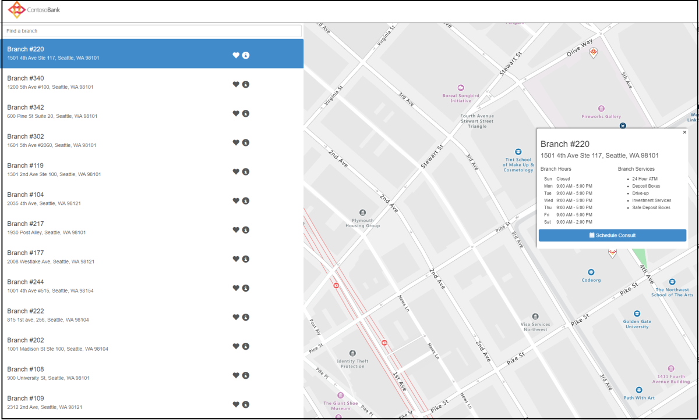
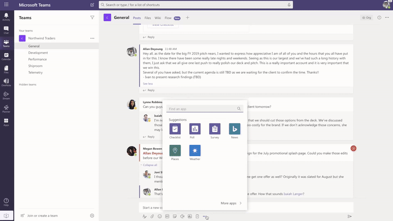

# Modèles d’application pour Microsoft Teams

Les modèles d’applications sont des exemples d’applications complètes Microsoft Teams pour les applications qui sont open-source et disponibles sur GitHub. Chaque modèle d’application contient des instructions détaillées pour le déploiement et l’installation de cette application pour votre organisation. Il fournit également une application d’échantillon que vous pouvez installer et commencer à utiliser immédiatement. Le code source complet est également disponible, ce qui vous permet de l’explorer en détail ou de fourche le code et de le modifier pour répondre à vos exigences spécifiques.
Tous les modèles d’applications sont fournis dans les conditions [de licence du MIT.](https://github.com/OfficeDev/microsoft-teams-apps-eprescription/blob/master/LICENSE)

> [!NOTE] 
> Vous devez autoriser et prendre en charge les applications créées à partir de modèles d’applications pour vos utilisateurs et organisations.

**&#9734; indique les modèles d’applications nouvellement publiés.**

### Principaux avantages

* **Déployez-vous directement dans le cloud :** Tous les modèles d’applications incluent des scripts de déploiement qui vous permettent d’héberger tous les services Microsoft Azure ou la plate-forme Power. 
* **Code d’échantillon recommandé :** Les modèles d’applications sont conformes aux meilleures pratiques recommandées en matière de sécurité et d’infrastructure. Toutes les modifications apportées par la communauté aux modèles d’application sont examinées afin d’assurer la conformité.
* **Personnalisable et extensible :** Bien que tous les modèles d’applications soient déployés avec une configuration minimale, l’ensemble de la base de code et des scripts de déploiement sont fournis, de sorte que vous pouvez facilement les personnaliser ou les étendre pour répondre à vos besoins uniques.
* **Documentation détaillée :** Tous les modèles d’applications sont accompagnés d’une documentation de bout en bout sur l’architecture de solution, le déploiement et les étapes de configuration.  

## Bot d’adoption 

Adoption Bot est un bot de chat de soins aux utilisateurs construit avec Power Virtual Agent pour Teams PVA. Il est considéré comme la version PVA de FAQ Plus. Adoption Bot répond à plus de 100 questions courantes sur Microsoft 365 et Teams. Vous pouvez modifier les sujets existants, ajouter vos propres sujets et ingérer les FAQ existantes. Si les utilisateurs ont besoin d’aide supplémentaire, Adoption Bot peut les connecter à des experts ou même être étendu aux billets de service ouverts avec connecteurs premium flow. Ce bot est auto-installé ou intégré dans une application personnalisée, comme le Centre [d’adoption](https://github.com/akporzondek/adoption_hub).

[Prends-le sur GitHub](https://github.com/OfficeDev/microsoft-teams-apps-adopt-bot)

## Outil d’adoption - Plateforme de gestion des champions &#9734;

Le modèle d’application Champion Management Platform (CMP) vous aide à gérer, à mettre à l’échelle et à inspirer vos champions du travail d’équipe à réaliser plus. Ce modèle d’application est construit sur le SharePoint Framework et chargé dans un onglet au sein d’une équipe. Les groupes peuvent tirer parti de cet outil pour aider à gérer l’adhésion au programme, fournir un classement et des types d’événements pour l’enregistrement, et des outils pour superposer des badges numériques aux participants au programme.

[Prends-le sur GitHub](https://github.com/OfficeDev/microsoft-teams-apps-champion-management)

## Voies d’apprentissage Microsoft 365'adoption (Prise en main) &#9734;

Le modèle Prise en main’application vous permet d’apporter la puissance des voies d’apprentissage Microsoft 365 l’intérieur de Microsoft Teams. Ce modèle d’application vous permet d’accorder un accès facile à des pages de formation spécifiques ou à d’autres actifs intranet et de charger le contenu directement dans Teams. Vous pouvez également modifier le nom ou le logo de l’application pour correspondre à l’image de marque de votre entreprise.

[Prends-le sur GitHub](https://github.com/msft-teams/tools/tree/master/M365%20Learning%20Pathways)

## Gestionnaire de rendez-vous 

Appointment Manager est un modèle d Teams apprologie pour aider les entreprises à créer, gérer et prendre des rendez-vous virtuels avec les consommateurs par l’intermédiaire Teams. Les nouvelles demandes de rendez-vous des consommateurs sont visibles Teams canaux, où elles sont rapidement assignées et réaffectées au personnel d’une équipe. Les demandes de rendez-vous sont consultées aux niveaux de l’équipe ou de la vie personnelle au moyen d’onglets personnalisés. Chaque rendez-vous est associé à une Teams en ligne, d’où le personnel et les consommateurs peuvent facilement se joindre à la réunion à l’heure prévue.

Le modèle d’application s’intègre à Microsoft Bookings pour une gestion facile des rendez-vous. Les rendez-vous planifiés apparaissent automatiquement sur les calendriers des membres du personnel affectés, et les consommateurs reçoivent des notifications et des rappels électroniques personnalisables avec des liens de réunion intégrés.

[Prends-le sur GitHub](https://github.com/OfficeDev/microsoft-teams-apps-appointment-manager)

 

## Demandez à l’extérieur

Ask Away est un [bot Microsoft Teams qui permet](../bots/what-are-bots.md) aux utilisateurs d’effectuer des questions et réponses, appelées sessions Q&A dans Teams. À l’aide du bot Ask Away, les membres de l’équipe peuvent soumettre et voter des questions partagées par des collègues permettant aux hôtes Q&A de recueillir facilement des questions de premier esprit au sein d’un canal ou d’un chat. Le bot est utilisé pour effectuer une session Q&A en temps réel dans une réunion Teams et permet aux participants de soumettre des questions en direct par chat.

[Prends-le sur GitHub](https://github.com/OfficeDev/microsoft-teams-apps-askaway)

:::row:::
  :::column span="2":::
      
:::column-end:::
:::row-end:::

## Informations du collaborateur

Associate Insights est un modèle [Power Apps qui permet](/powerapps/maker/canvas-apps/embed-teams-app) aux travailleurs de première ligne de capturer et de soumettre directement l’opinion, le sentiment et la perception des clients. Les travailleurs de première ligne sont souvent le premier représentant de l’entreprise à s’engager avec les clients dans un point de contact en personne. Les données collectées sont partagées et utilisées en collaboration par les équipes d’affaires, par exemple par le biais d’un onglet Power BI Teams, pour améliorer l’expérience client et améliorer l’expérience client.

[Prends-le sur GitHub](https://github.com/OfficeDev/microsoft-teams-apps-associateinsights)

:::row:::
  :::column span="2":::
      
:::column-end:::
:::row-end:::
:::row:::
:::column span="2":::
    
:::column-end:::
:::row-end:::

## Présence

L’application Présence est [un onglet Power Apps](/powerapps/maker/canvas-apps/embed-teams-app) qui sont épinglés dans une équipe. Il est conçu pour enregistrer la présence dans des environnements tels que les environnements d’apprentissage et de formation. Les utilisateurs peuvent marquer ou modifier la fréquentation jusqu’à 30 jours dans le passé et consulter les rapports de participation résumés pour un groupe entier ou des participants individuels. Pour plus d’informations sur la présence des équipes, [voir Get it on GitHub](https://github.com/OfficeDev/microsoft-teams-apps-attendance).

L’image suivante affiche la démo de l’application de présence :  

## Réservez une chambre

Book-a-room est un [bot Microsoft Teams qui permet](../bots/what-are-bots.md) aux utilisateurs de trouver et de réserver rapidement une salle de réunion pour 30, 60 ou 90 minutes à partir de l’heure actuelle. Le temps par défaut est de 30 minutes. Le livre-une-chambre bot portées à des conversations personnelles ou 1:1. Pour plus d’informations sur l’application Book-a-room, [voir Get it on GitHub](https://github.com/OfficeDev/microsoft-teams-apps-bookaroom).  
L’image suivante affiche la démo book-a-room :

## Accès aux bâtiments

Building Access est une application basée sur microsoft [power platform](https://powerapps.microsoft.com/blog/now-in-preview-customize-teams-with-built-in-power-platform-capabilities/) qui prend en charge l’administration des seuils d’occupation des bâtiments et des normes de distanciation sociale en permettant aux directeurs d’installations de gérer, suivre et signaler la présence des employés sur place. L’application, conçue à [l’aide de](/powerapps/powerapps-overview)Microsoft Power Apps et [Power Automate](/power-automate/getting-started), s’intègre profondément à Microsoft Teams et permet aux organisations de déterminer la préparation au bâtiment, d’établir des critères d’admissibilité pour l’accès sur place et de recueillir des informations pour la planification future.

[Prends-le sur GitHub](https://github.com/OfficeDev/microsoft-teams-apps-buildingaccess)

:::row:::
   :::column span="":::
     
   :::column-end:::
   :::column span="":::
      
   :::column-end:::
:::row-end:::

## Célébrations

Celebrations est une application Teams qui aide les membres de l’équipe à célébrer les anniversaires, les anniversaires et autres événements récurrents de l’autre. Il se souvient des occasions spéciales de tous les membres de l’équipe et envoie un message amical dans toutes les équipes sélectionnées au moment de la création de l’événement, pour que les membres de l’équipe se sentent spéciaux lors de leur journée.

L’application fournit une interface facile pour tous les membres de l’équipe d’ajouter et de visualiser personnellement leurs événements et permet également à l’utilisateur de sélectionner les équipes dans lesquelles les événements sont partagés.

[Prends-le sur GitHub](https://github.com/OfficeDev/microsoft-teams-celebrations-app)

## Liste de vérification

Checklist est une application d Microsoft Teams [d’extension de messagerie](../messaging-extensions/what-are-messaging-extensions.md) personnalisée qui vous permet de collaborer avec votre équipe en créant une liste de contrôle partagée dans un chat ou un canal. L’application est prise en charge dans Teams clients de la plate-forme, tels que le navigateur de bureau, iOS et Android. L’application est prête à être déployée dans le cadre de votre Microsoft 365 abonnement.  

[Prends-le sur GitHub](https://github.com/OfficeDev/microsoft-teams-checklist-app)

:::row:::
:::column span="2":::
      
:::column-end:::
:::row-end:::

## Drop-in en classe 

Classroom Drop-in est une application basée sur la plate-forme Microsoft [Power qui](https://powerapps.microsoft.com/blog/now-in-preview-customize-teams-with-built-in-power-platform-capabilities/)permet aux leaders du système de trouver des équipes de classe, signifie des salles de classe virtuelles et de s’ajouter eux-mêmes ou d’autres à ces équipes de classe pour une période d’abandon spécifiée, au besoin. L’application construite à [l’aide de](/powerapps/powerapps-overview) Microsoft Power Apps [et Power Automate](/power-automate/getting-started), s’intègre profondément à Microsoft Teams pour s’assurer que les instituts éducatifs peuvent optimiser leurs opérations dans un environnement d’apprentissage hybride en donnant accès aux parties prenantes pertinentes pour les équipes de classe par entreprise.

[Prends-le sur GitHub](https://github.com/OfficeDev/microsoft-teams-apps-classroom-dropin)

## Communicateur d’entreprise

L’application company Communicator permet aux équipes d’entreprise de créer et d’envoyer des messages destinés à plusieurs équipes ou à un grand nombre d’employés sur le chat, ce qui permet à l’organisation d’atteindre les employés là où ils collaborent. Utilisez ce modèle pour plusieurs scénarios tels que les annonces de nouvelles initiatives, l’ingusion des employés, l’apprentissage moderne et le développement ou les émissions à l’échelle de l’organisation.

L’application fournit une interface facile pour les utilisateurs désignés pour créer, prévisualiser, collaborer et envoyer des messages.

Il fournit une base pour construire des capacités de communication ciblées personnalisées telles que la télémétrie personnalisée sur le nombre d’utilisateurs reconnus ou interagis avec un message.

[Prends-le sur GitHub](https://github.com/OfficeDev/microsoft-teams-company-communicator-app)

## Recherche de groupe de contact

L’application Contact Group Lookup offre une approche pratique et utile pour créer, accéder et gérer les groupes de contact de votre organisation, anciennement connus sous le nom de listes de distribution ou de groupes de communication. Les utilisateurs peuvent rapidement consulter et discuter avec les membres du groupe, afficher le statut de membre et créer un chat de groupe avec des membres sélectionnés du groupe de contact, le tout dans l’environnement Teams’environnement.

[Prends-le sur GitHub](https://github.com/OfficeDev/microsoft-teams-app-contactgrouplookup)

:::row:::
:::column span="2":::
      
:::column-end:::
:::row-end:::
:::row:::
:::column span="2":::
    
:::column-end:::
:::row-end:::

## Appréciation des collègues 

À l’aide du modèle d’appréciation des collègues Microsoft Teams, les utilisateurs peuvent reconnaître les réalisations de leurs collègues dans le contexte Teams de leurs collègues. Lorsque des collègues choisissent de récompenser un collègue, les destinataires et les autres membres de l’équipe sont marqués dans une conversation de chaîne et reçoivent une notification sur les détails du prix de la chaîne. Les prix sont enregistrés dans l Teams apprable, qui est sécurisée, portable et facilement partageable. Ceci est considéré comme la version basée sur PowerApps du modèle d’application Open Badges, avec un classement.

[Prends-le sur GitHub](https://github.com/OfficeDev/microsoft-teams-apps-coworker-appreciation)

## CrowdSourcer (en)

CrowdSourcer est un [bot Microsoft Teams qui donne](../bots/what-are-bots.md) aux équipes des informations interrogées provenant de membres du groupe. Il aide à répondre aux questions fréquemment posées tout en permettant aux participants de s’engager activement et de contribuer à une ressource d’information amusante et utile.

[Obtenez-le sur Github](https://github.com/OfficeDev/microsoft-teams-crowdsourcer-app)

## Autocollants personnalisés

L’expression de soi est au cœur d’une culture d’équipe saine. Ce modèle d’application est [une extension de](~/messaging-extensions/what-are-messaging-extensions.md) messagerie qui permet à vos utilisateurs d’utiliser des autocollants personnalisés et des GIF dans Microsoft Teams. Ce modèle offre une expérience de configuration web facile où toute personne ayant accès à la configuration peut télécharger les GIF, autocollants et images qu’ils veulent que leurs utilisateurs aient, permettant à toute votre équipe d’utiliser n’importe quel ensemble d’autocollants que vous choisissez.

Cette application permet également un partage facile d’images, gifs, autocollants entre les équipes sans avoir besoin d’accéder à des sites SharePoint ou des canaux individuels comme mécanismes de stockage et de partage. Par exemple, les équipes de produits peuvent facilement partager des images de produits et des GIF aux équipes de médias sociaux, de marketing et de vente de façon programmatique. On peut également étendre cette application en déclenchant un flux de notification à des équipes ou des individus spécifiques lorsque de nouvelles images, et gifs sont mis à disposition.

[Prends-le sur GitHub](https://github.com/OfficeDev/microsoft-teams-stickers-app)

## Idées des employés

L’application Idées d’employés est la version PowerApps du modèle d’application Great Ideas basé sur Azure. L’application permet aux utilisateurs Teams configurer et configurer une campagne d’idées. Une campagne d’idées est une catégorie de regroupement d’idées autour de thèmes communs.

Teams utilisateurs peuvent également effectuer les activités suivantes :

* Configurer un formulaire de soumission standard que les employés doivent soumettre pour chaque idée. 
* Examiner et gérer les idées et la liste des campagnes.
* Modifier et supprimer des campagnes.
* Examiner les conseils d’idées des dirigeants.
* Votez et partagez des idées priorisées.
* Soumettez des idées pour une campagne.
* Voir l’idée d’un autre membre de l’équipe.
* Votez sur les idées les plus appréciées.
* Passez en revue la performance de leurs idées par rapport à d’autres au sein d’une campagne.

[Prends-le sur GitHub](https://github.com/OfficeDev/microsoft-teams-apps-employeeideas)

 

## E-Prescriptions (e-Prescriptions) 

E-Prescriptions est une [application Power Apps qui](/powerapps/maker/canvas-apps/embed-teams-app) améliore la télémédecine et les soins virtuels en automatisant le processus d’émission d’ordonnances électroniques aux patients. Les professionnels de la santé peuvent rapidement examiner les rendez-vous, générer des ordonnances électroniques et envoyer des courriels avec des pièces jointes à des patients directement dans la plate-forme Teams’assurance.

[Prends-le sur GitHub](https://github.com/OfficeDev/microsoft-teams-apps-eprescription) 

:::row:::
:::column span="2":::
      
:::column-end:::
:::row-end:::
:::row:::
:::column span="2":::
    
:::column-end:::
:::row-end:::

## Formation des employés 

La formation des employés est une application Microsoft Teams qui permet aux organisateurs de publier, de suivre et de promouvoir facilement des événements d’apprentissage et de formation pour votre organisation.  Avec l’application, les planificateurs d’événements peuvent envoyer des rappels et des notifications aux inscrits et les employés peuvent indiquer leur intérêt pour les événements à venir, rester à jour sur l’actualité et partager les détails de l’événement avec leurs collègues par le biais de l’extension de messagerie Teams.

[Prends-le sur GitHub](https://github.com/OfficeDev/microsoft-teams-apps-employeetraining)

:::row:::
:::column span="2":::
    **Voir les événements de formation des employés**   
:::column-end:::
:::row-end:::
:::row:::
:::column span="2":::
    **Créer un événement de formation des employés** 
:::column-end:::
:::row-end:::

## Expert Finder

Expert Finder est un [bot Microsoft Teams qui](../bots/what-are-bots.md) identifie des membres spécifiques de l’organisation en fonction de leurs compétences, intérêts et attributs d’éducation. Les membres trouvent des experts au sein d’une organisation qui correspondent à une recherche par mot clé Azure Active Directory profils d’utilisateurs.

[Prends-le sur GitHub](https://github.com/OfficeDev/microsoft-teams-apps-expertfinder)

## Forum aux questions

Conversational Q&Bots A sont un moyen facile de fournir des réponses aux questions fréquemment posées par les utilisateurs. Mais, la plupart des bots ne parviennent pas à s’engager avec les utilisateurs de manière significative parce qu’il n’y a pas d’humain dans la boucle lorsque le bot échoue. FAQ bot est un Q&un bot qui apporte un humain dans la boucle quand il est incapable d’aider. On peut poser une question au bot et le bot répond par une réponse si elle est contenue dans la base de connaissances. Si ce n’est pas le cas, le bot permet à l’utilisateur de soumettre une requête qui est ensuite affichée à une équipe préconfigurée d’experts qui aident à fournir un soutien en agissant sur les notifications de l’intérieur de l’équipe elle-même.

> [!NOTE]
> La dernière version de **FAQ Plus prend en** charge l’amélioration des résolutions Q&A en permettant à une équipe d’experts de compléter les éléments suivants :
>
> &#x2714; ajouter de nouveaux Q&directement à la base de connaissances à l’aide d’extensions de messages.
>
> &#x2714; modifier et supprimer les paires Q&A ajoutées par un bot.
>
> &#x2714; suivre l’historique de révision de Q&As.
>
> &#x2714; configurer une réponse avec des détails supplémentaires à afficher sous forme de [carte adaptative](../task-modules-and-cards/cards/cards-reference.md#adaptive-card).
>
[Prends-le sur GitHub](https://github.com/OfficeDev/microsoft-teams-apps-faqplusv2)

## Obtenez l’application de support

L’application Get Support est utilisée par les organisations qui utilisent Microsoft Teams, pour permettre à n’importe quel groupe d’utilisateurs de demander l’aide des superviseurs. Cette application comprend les fonctionnalités suivantes :
* Demander de l’aide sur différentes catégories à partir d’une application Power.
* Notifications envoyées aux demandeurs les informant de qui le lièvre a assigné.
* Notifications envoyées aux superviseurs affectés pour les informer des personnes qui ont besoin d’aide. 
* Analyse des escalades et des modèles SharePoint et PowerBI.S.

[Prends-le sur GitHub](https://github.com/OfficeDev/microsoft-teams-app-get-support/)

## Tracker objectif

L’application Goal Tracker est une solution complète pour votre organisation afin de soutenir l’établissement d’objectifs, l’observation des progrès et la reconnaissance du succès Microsoft Teams. L’application permet aux utilisateurs de définir, suivre et mettre à jour les objectifs au niveau professionnel, personnel et d’équipe. Les membres de l’équipe reçoivent également des rappels et des mises à jour d’état en temps opportun pour rester concentrés et rester sur la bonne voie.

[Prends-le sur GitHub](https://github.com/OfficeDev/microsoft-teams-app-goaltracker)

:::row:::
  :::column span="2":::
      
:::column-end:::
:::row-end:::
:::row:::
:::column span="2":::
    
:::column-end:::
:::row-end:::

## Grandes idées

L’application Great Ideas soutient et renforce l’innovation et la créativité au sein de votre organisation. L’application permet à vos employés de partager des idées avec leurs collègues et les dirigeants, de découvrir de nouvelles soumissions, de mettre en lumière les contributions pour l’examen par les pairs et de voter pour les meilleures propositions au sein Microsoft Teams.

[Prends-le sur GitHub](https://github.com/OfficeDev/microsoft-teams-apps-greatideas)

:::row:::
  :::column span="2":::
      
:::column-end:::
:::row-end:::
:::row:::
:::column span="2":::
    
:::column-end:::
:::row-end:::

## Activités de groupe

Group Activities est une application Microsoft Teams qui permet aux propriétaires d’équipe de créer rapidement des groupes d’activités et de gérer les workflows de collaboration dans le contexte de Microsoft Teams. Les auteurs d’activités sont autorisés à créer des activités, à distribuer aléatoirement les membres de l’équipe en groupes et, en option, à envoyer des rappels au bot jusqu’à ce que les activités soient terminées.

[Prends-le sur GitHub](https://github.com/OfficeDev/microsoft-teams-apps-groupactivities)

:::row:::
  :::column span="2":::
      
:::column-end:::
:::row-end:::
:::row:::
:::column span="2":::
    
:::column-end:::
:::row-end:::

## Groupe Connecter &#9734;

Group Connecter une application Microsoft Teams qui aide les membres de l’organisation à découvrir les groupes d’employés et à trouver des informations pertinentes pour les groupes d’employés. L’application est intégrée avec de riches capacités pour les dirigeants d’organisation de communiquer avec leurs employés en ce qui concerne les groupes, les événements et les ressources. L’application Connecter groupe correspond également les uns aux autres à la fréquence souhaitée afin d’encourager le réseautage et la cohésion au sein d’un groupe. Pour plus d’informations sur la façon dont vous pouvez tirer parti de l’application Group Connecter pour aider les groupes d’employés à se renforcer au sein de votre organisation, consultez l’application GitHub.

[Prends-le sur GitHub](https://github.com/OfficeDev/microsoft-teams-apps-groupconnect)

## Développez vos compétences

L’application Cultivons vos compétences favorise la croissance et le perfectionnement professionnels en permettant aux employés de contribuer à des projets supplémentaires pour votre organisation tout en apprenant de nouvelles compétences. Les employés peuvent utiliser l’application pour trouver des opportunités qui répondent à leurs intérêts, profiter d’une collaboration significative avec leurs pairs et acquérir de nouveaux niveaux d’expertise et de capacités, le tout dans l’environnement Teams environnement.

[Prends-le sur GitHub](https://github.com/OfficeDev/microsoft-teams-apps-growyourskills)

:::row:::
  :::column span="2":::
      
:::column-end:::
:::row-end:::
:::row:::
:::column span="2":::
    
:::column-end:::
:::row-end:::

## Prise en charge RH

HR Support bot est un q&un bot amical qui apporte un professionnel de soutien ou un expert de l’équipe RH dans la boucle quand il est incapable d’aider. On peut poser une question au bot et le bot répond par une réponse si elle est contenue dans la base de connaissances. Si ce n’est pas le cas, le bot permet à l’utilisateur de soumettre une requête qui est ensuite affichée dans une équipe préconfigurée d’experts qui aident à fournir un soutien en agissant sur les notifications de l’intérieur de leur équipe elle-même. En outre, le bot suggère des liens vers les stratégies rh recommandées ou des questions en recherchant des balises préconfigurées dans la question. Ces tuiles se trouvent dans l’onglet associé comme une référence rapide. Le soutien aux RH fonctionne bien pour les questions de poids léger&A et pour fournir un soutien rapide lors du lancement de nouveaux projets ou initiatives au cours de l’organisation.

[Prends-le sur GitHub](https://github.com/OfficeDev/microsoft-teams-hrsupport-app)

## Brise-glace

Icebreaker est un [bot Microsoft Teams qui aide votre](../bots/what-are-bots.md) équipe à se rapprocher en jumelant deux membres aléatoires de l’équipe chaque semaine pour se rencontrer. Le bot facilite la planification en suggérant automatiquement des temps libres qui fonctionnent pour les deux membres. Renforcez vos liens personnels et construisez une communauté soudée avec cette application.

En plus d’encourager les liens personnels dans toute votre équipe, l’application Icebreaker peut aider à cultiver des communautés basées sur l’intérêt au sein de votre organisation. Par exemple, vous pouvez utiliser cette application pour un groupe d’intérêt DevOps pour aider les idées et les meilleures pratiques à se répandre organiquement dans votre organisation.

[Prends-le sur GitHub](https://github.com/OfficeDev/microsoft-teams-icebreaker-app)

## Incitations

Les incitatifs sont [Power Apps modèle qui](/powerapps/maker/canvas-apps/embed-teams-app) gère et suit la participation des employés incités à des activités désignées, comme les formations et les initiatives de gestion du changement. Les administrateurs utilisent l’application pour établir des activités désignées, attribuer des points pour l’achèvement et spécifier les niveaux de points d’admissibilité requis pour les récompenses. Les employés utilisent l’application pour afficher leurs points accumulés et, lorsqu’ils atteignent l’admissibilité, demandent et réclament des récompenses échangeables.

[Prends-le sur GitHub](https://github.com/OfficeDev/microsoft-teams-apps-incentives)

## Incident Reporter

Incident Reporter est un [Microsoft Teams bot](../bots/what-are-bots.md) qui optimise la gestion des incidents dans votre organisation. Le bot facilite la collecte automatisée de données sur les incidents, les rapports d’incidents personnalisés, les notifications pertinentes des parties prenantes et le suivi des incidents de bout en bout.

[Prends-le sur GitHub](https://github.com/OfficeDev/microsoft-teams-apps-incidentreport)

:::row:::
  :::column span="2":::
      
:::column-end:::
:::row-end:::
:::row:::
:::column span="2":::
    
:::column-end:::
:::row-end:::

## inspection 

 L’inspection est Microsoft Teams qui permet aux travailleurs de première ligne d’inspecter quoi que ce soit, des emplacements aux biens et aux équipements. Par exemple, un magasin de détail, une usine de fabrication ou des véhicules et des machines. Il existe deux applications dans cette solution, chacune destinée à différents types d’utilisateurs.

L’application permet aux travailleurs de première ligne d’inspecter un actif ou une zone, de gérer la qualité des produits et des services ou de maintenir la sécurité au travail. Il facilite la communication entre les membres de l’équipe pour régler les problèmes constatés lors de l’inspection. L’application fournit des rapports simples aux gestionnaires pour accélérer la résolution des problèmes et mettre en évidence les tendances.

[Prends-le sur GitHub](https://github.com/OfficeDev/microsoft-teams-apps-inspection)

   

## Rapports sur les émetteurs

L’application De reporting des enjeux permet aux employés et aux gestionnaires de soulever et de gérer les problèmes. Il se compose de deux applications, application de reporting de problèmes pour les problèmes de reporting et gérer les problèmes app pour gérer les problèmes.

Les responsables d’équipe utilisent l’application Manage Issues pour configurer l’expérience de l’application, y compris le canal dans lequel les messages Microsoft Teams et les tâches planificateur sont créés par l’application. Les gestionnaires utilisent également l’application pour créer des formulaires de modèle pour recueillir des détails lorsqu’un utilisateur signale un problème. Par exemple, examinez, modifiez ou supprimez les formulaires de modèle d’émission. L’application est également utilisée pour examiner les problèmes de l’équipe, rendre compte de l’historique des problèmes et gérer efficacement la résolution des problèmes.

Les employés utilisent l’application de déclaration des problèmes pour enregistrer les problèmes et les détails nécessaires pour les résoudre. L’application est également utilisée pour modifier et résoudre les problèmes existants et obtenir une vue de haut niveau des problèmes individuels ou d’équipe.

[Prends-le sur GitHub](https://github.com/OfficeDev/microsoft-teams-apps-issuereporting)

  

## Nouvel employé à bord 

Le nouvel intégration des employés est une solution intégrée d’intégration de [l’intégration des employés à bord de Microsoft Teams et d’SharePoint un](https://lookbook.microsoft.com/details/75e60a32-9849-4ed4-b83e-b2b08983ad19) nouvel employé qui permet à votre organisation d’offrir une expérience d’intégration cohérente et de haute qualité aux employés qui voyagent pour leur nouvelle embauche. L’application est utilisée par les équipes des ressources humaines et les gestionnaires recruteurs pour fournir des informations pertinentes tout au long du processus d’orientation et d’induction et par les nouvelles recrues pour partager leurs commentaires, fournir des introductions et accomplir des tâches d’onboarding.

[Prends-le sur GitHub](https://github.com/OfficeDev/microsoft-teams-apps-newemployeeonboarding)

:::row:::
  :::column span="2":::
    **Nouvelle carte de bienvenue des employés** 
:::column-end:::
:::row-end:::
:::row:::
:::column span="2":::
    **Nouvelle liste de vérification des employés**   
:::column-end:::
:::row-end:::

## Badges ouverts

Open Badges est une application Microsoft Teams qui permet aux individus de gagner des badges d’identification d’apprentissage numérique dans le Teams et de les partager partout. En utilisant les capacités de l’autorité d’émission de badge numérique [tiers, Badgr](https://badgr.org/), badges attribués sont enregistrés dans le profil Badgr d’un destinataire et disponibles pour construire et partager une image riche des voyages d’apprentissage à vie.

[Prends-le sur GitHub](https://github.com/OfficeDev/microsoft-teams-apps-openbadges)

:::row:::
  :::column span="2":::
      
:::column-end:::
:::row-end:::
:::row:::
:::column span="2":::
    
:::column-end:::
:::row-end:::

## scrutin 

Poll est une application personnalisée d Microsoft Teams ex [extension de messagerie](../messaging-extensions/what-are-messaging-extensions.md) qui vous permet de créer et d’envoyer rapidement des sondages dans un chat ou un canal pour recueillir les opinions et les préférences de l’équipe. L’application est prise en charge sur tous les clients de la plate-forme Teams, tels que le bureau, navigateur, iOS et Android et est prête pour le déploiement dans le cadre de votre abonnement Microsoft 365'argent.

[Prends-le sur GitHub](https://github.com/OfficeDev/microsoft-teams-poll-app)

:::row:::
  :::column span="1":::
      
:::column-end:::
:::row-end:::

## Réponses rapides

Quick Responses est une application Microsoft Teams qui offre une solution robuste pour répondre efficacement aux questions fréquemment posées par les utilisateurs FAQ. Au lieu de répondre manuellement et continuellement à chaque requête, l’application construit une bibliothèque de réponses pour une expérience utilisateur interactive grâce à des [extensions](../messaging-extensions/what-are-messaging-extensions.md)Teams messagerie .

[Prends-le sur GitHub](https://github.com/OfficeDev/microsoft-teams-apps-quickresponses)

## Quiz &#9734;

Quiz est une application [d Teams d’extension de messagerie](../messaging-extensions/what-are-messaging-extensions.md) personnalisée qui vous permet de créer un quiz dans un chat ou un canal de contrôle des connaissances et de résultats instantanés. Vous pouvez utiliser quiz pour, en classe et hors ligne examens, vérification des connaissances au sein de l’équipe, et pour des quiz amusants au sein d’une équipe. L’application Quiz est prise en charge sur plusieurs plateformes, telles que Teams de bureau, navigateur, iOS et clients Android. Cette application est prête à être déployée dans le cadre de votre abonnement Microsoft 365 existant.

[Prends-le sur GitHub](https://github.com/OfficeDev/microsoft-teams-apps-quiz)

:::row:::
  :::column span="1":::
      
:::column-end:::
:::row-end:::

## Assistance rapide

Rapid Assist est une application basée sur microsoft [power platform](https://powerapps.microsoft.com/blog/now-in-preview-customize-teams-with-built-in-power-platform-capabilities/) qui permet aux associés orientés vers le client de se connecter rapidement avec les experts pour obtenir des réponses rapides, rechercher des informations, suivre les demandes ouvertes, et permettre aux experts de recevoir des notifications pour recevoir rapidement un appel pour aider à répondre aux questions. L’application construite à [l’aide de](/powerapps/powerapps-overview) Microsoft Power Apps [et Power Automate](/power-automate/getting-started), s’intègre profondément à Microsoft Teams pour permettre aux organisations de connecter facilement les travailleurs de première ligne avec des liaisons d’entreprise pour résoudre les questions des clients et offrir une grande expérience client. 

[Prends-le sur GitHub](https://github.com/OfficeDev/microsoft-teams-apps-rapid-assist)

:::row:::
   :::column span="":::
     
   :::column-end:::
   :::column span="":::
      
   :::column-end:::
:::row-end:::

## réfléchir 

Reflect est une application personnalisée [d’extension](../messaging-extensions/what-are-messaging-extensions.md) de messagerie Microsoft Teams qui fournit une ressource sûre et inclusive aux membres de votre équipe pour partager l’état de leur bien-être émotionnel avec leurs collègues ou chefs de groupe directement au sein de Teams. L’application est disponible dans les chats canal, groupe, réunion et 1:1 et la réponse d’enregistrement est définie au public, privé à l’expéditeur, ou entièrement anonyme.

[Prends-le sur GitHub](https://github.com/OfficeDev/Microsoft-Teams-App-Reflect)

:::row:::
    :::column:::
    **Sondage sur le bien-être**
    
    
    :::column-end:::
:::row-end:::

## Prise en charge à distance

Remote Support est un bot [Microsoft Teams qui fournit](../bots/what-are-bots.md) une interface ciblée entre les demandeurs de soutien dans toute votre organisation et l’équipe de soutien interne.  Les utilisateurs finaux peuvent soumettre, modifier ou retirer des demandes de support et l’équipe de support peut répondre, gérer et mettre à jour les demandes tout au sein de la Teams plateforme.

[Prends-le sur GitHub](https://github.com/OfficeDev/microsoft-teams-apps-remotesupport)

:::row:::
  :::column span="2":::
      
:::column-end:::
:::row-end:::
:::row:::
:::column span="2":::
    
:::column-end:::
:::row-end:::

## Demande d’une équipe

Request-a-team est une application Microsoft Teams optimise la création de nouvelles équipes pour votre organisation d’entreprise. L’application prend en charge la normalisation et les meilleures pratiques lors de la création de nouvelles instances d’équipe grâce à l’intégration d’un formulaire de demande guidé par des assistants, d’un processus d’approbation intégré, d’un tableau de bord de l’état de la demande et de la création d’équipes automatisées.

[Prends-le sur GitHub](https://github.com/OfficeDev/microsoft-teams-apps-requestateam)

:::row:::
  :::column span="2":::
    
:::column-end:::
:::row-end:::
:::row:::
:::column span="2":::
    
:::column-end:::
:::row-end:::

## Mêlées pour canaux

Scrums for Channels est une application scrum assistant qui permet aux utilisateurs de programmer et d’exécuter des mêlées dans les canaux Microsoft Teams. L’application est idéal pour les équipes distantes et les équipes composées de membres de différents emplacements géographiques et fuseaux horaires pour partager les mises à jour quotidiennes et assurer la participation à des réunions de stand-up scrum.

[Prends-le sur GitHub](https://github.com/OfficeDev/microsoft-teams-apps-scrumsforchannels)

> [!NOTE]
> Pour organiser des réunions de mêlée dans un chat de groupe, consultez [le modèle d’application Scrums for Group Chat.](#scrums-for-group-chat)

:::row:::
  :::column span="2":::
    
:::column-end:::
:::row-end:::
:::row:::
:::column span="2":::
    
:::column-end:::
:::row-end:::

## Mêlées pour le chat de groupe

> [!NOTE]
> Le modèle d’application Scrums Status est mis à jour et est maintenant Scrums pour le Chat de Groupe.

Scrums for Group Chat est un assistant scrum de soutien qui permet aux membres du chat de groupe d’exécuter des réunions de stand-up asynchrones et de partager facilement leurs mises à jour quotidiennes. Il permet à tous les membres du chat de groupe de contribuer à la mêlée et de visualiser les mises à jour effectuées par d’autres membres de la mêlée en cours d’exécution.

[Prends-le sur GitHub](https://github.com/OfficeDev/microsoft-teams-apps-scrumsforgroupchat)

## Partager maintenant 

L’application Share Now favorise l’échange positif d’informations entre collègues en permettant à vos utilisateurs de partager facilement du contenu dans l’environnement Teams’environnement. Les utilisateurs engagent l’application pour partager des éléments d’intérêt avec les membres de l’équipe, découvrir de nouveaux contenus partagés, définir des préférences et des favoris de signet pour une lecture ultérieure.

[Prends-le sur GitHub](https://github.com/OfficeDev/microsoft-teams-apps-sharenow)

## Recherche de liste SharePoint

La collaboration dans Microsoft Teams fait souvent référence à des informations contenues dans des éléments d’SharePoint liste. Coller un lien vers l’élément en question oblige tout le monde à changer de contexte de la conversation, trouver les informations nécessaires, puis revenir à Teams pour continuer la conversation. Comme la conversation continue les gens doivent revenir à l’élément de référence plusieurs fois pour vérifier de nouveaux commentaires et rafraîchir leurs souvenirs des informations contenues dans l’élément. Cette commutation contextnelle crée un obstacle à une collaboration harmonieuse.
Pour résoudre ce problème, le modèle d’application list search est utilisé. De nombreux utilisateurs utilisent SharePoint pour alimenter certains des workflows de base de leurs organisations. Toutefois, il est difficile de collaborer autour des listes. À l’aide du modèle d’application list search en Microsoft Teams, les utilisateurs peuvent insérer des informations à partir d’éléments de liste SharePoint directement dans une conversation de chat pour atténuer le changement de contexte causé lors de l’insertion simple d’un lien dans un chat. Les informations sont insérées comme une carte auto-formatée facile à lire, aidant les utilisateurs à rester engagés dans la conversation.

[Prends-le sur GitHub](https://github.com/OfficeDev/microsoft-teams-list-search-app)

## Enregistrements du personnel

Staff Check-ins est une application [Power Apps qui](/powerapps/powerapps-overview) permet la communication de surveillance entre votre entreprise et le personnel sur le terrain. Le personnel peut facilement fournir des informations critiques dans le temps et des mises à jour de l’état sur une base planifiée ou ad hoc directement à partir Teams. L’application prend en charge l’emplacement en temps réel, les photos, les notes, les notifications de rappel et les workflows automatisés.

[Prends-le sur GitHub](https://github.com/OfficeDev/microsoft-teams-apps-staffcheckins)

## Enquête

Survey est une application d Microsoft Teams [d’extension de messagerie](../messaging-extensions/what-are-messaging-extensions.md) personnalisée qui vous permet de créer une enquête dans un chat ou un canal pour recueillir des données et obtenir des informations exploitables. L’application est prise en charge sur tous les clients de la plate-forme Teams, tels que le bureau, navigateur, iOS et Android et est prête pour le déploiement dans le cadre de votre abonnement Microsoft 365'argent.  

[Prends-le sur GitHub](https://github.com/OfficeDev/Microsoft-Teams-Survey-app)

:::row:::
  :::column span="2":::
    
:::column-end:::
:::row-end:::

## Décompte du temps 

Un projet peut comprendre plusieurs tâches, et divers projets peuvent être assignés aux employés. Les gestionnaires sont tenus de comprendre l’avancement du projet tout au long du temps passé par les employés à effectuer ces tâches. Il peut s’agir d’une activité lourde, car les employés doivent remplir les feuilles de temps. L’application Time Tally permet aux employés de remplir leurs feuilles de temps rapidement, à l’aide de l’appareil mobile, et les gestionnaires n’ont pas à faire un suivi auprès des employés sur la saisie de la feuille de temps. Les gestionnaires peuvent consulter l’utilisation du projet en fonction des ressources, et ils peuvent approuver ou rejeter les entrées. Des notifications de rappel sont envoyées pour assurer la conformité à la feuille de temps. En outre, des données historiques et des utilisations sont disponibles pour l’analyse.

[Prends-le sur GitHub](https://github.com/OfficeDev/microsoft-teams-apps-timetally)

## Formation &#9734;

La formation est une application [personnalisée Teams’extension de messagerie](../messaging-extensions/what-are-messaging-extensions.md) qui permet aux utilisateurs de publier une formation dans un chat ou un canal pour le partage de connaissances hors ligne et l’upskilling. L’application est prise en charge sur plusieurs Teams clients de la plate-forme, tels que bureau, navigateur, iOS et Android. Cette application est prête pour le déploiement dans le cadre de votre abonnement Microsoft 365'abonnement.

[Prends-le sur GitHub](https://github.com/OfficeDev/microsoft-teams-apps-training)

:::row:::
  :::column span="1":::
      
:::column-end:::
:::row-end:::

## Arrondi virtuel

Les fournisseurs d’hôpitaux et de salles d’urgence font **de nombreuses** rondes par jour. Ces examens rapides sur les patients sont destinés à fournir une vérification de l’état sur la façon dont le patient va et de s’assurer que les préoccupations du patient sont traitées. Bien que l’arrondi soit une pratique essentielle pour s’assurer que les patients sont surveillés par plusieurs types de fournisseurs, ils représentent un énorme drain sur l’EPI, parce que pour chaque visite, de chaque fournisseur, un nouveau masque et un nouvel ensemble de gants sont utilisés. Avec ces modèles d’application, les travailleurs médicaux peuvent facilement effectuer des rondes virtuellement, par le biais d’une Microsoft Teams de travail entre le fournisseur et le patient.

La solution d’arrondi virtuel est également référencée dans le billet de blog Microsoft Health et sciences [de la vie](https://aka.ms/teamsvirtualrounding).

[Prends-le sur GitHub](https://github.com/SmartterHealth/Virtual-Rounding)

## Gestion des visiteurs

L’application De gestion des visiteurs permet à votre organisation et à vos employés de gérer facilement et efficacement le processus de visite sur place, directement à partir Microsoft Teams. L’application permet aux employés de créer des demandes de visiteurs, de suivre de manière centrale l’état d’une demande via le tableau de bord des visiteurs et de recevoir des notifications en temps réel à l’arrivée d’un visiteur.

[Prends-le sur GitHub](https://github.com/OfficeDev/microsoft-teams-app-visitormanagement)

:::row:::
  :::column span="2":::
    
:::column-end:::
:::row-end:::
:::row:::
:::column span="2":::
    
:::column-end:::
:::row-end:::

## Prix en milieu de travail

Workplace Awards est un modèle d Teams appe qui fournit un cadre positif pour favoriser la reconnaissance et encourager la culture de l’appréciation des employés dans le milieu de travail moderne. L’application vous permet de configurer et de gérer une récompense et une reconnaissance des employés, appelée programme R&R, où les employés peuvent facilement nommer et approuver des collègues et votre chef R&R peut consulter les candidatures soumises, les bourses d’études et annoncer les récipiendaires.

[Prends-le sur GitHub](https://github.com/OfficeDev/microsoft-teams-apps-workplaceawards)

:::row:::
  :::column span="2":::
    
:::column-end:::
:::row-end:::
:::row:::
:::column span="2":::
    
:::column-end:::
:::row-end:::

Pour plus d’informations sur le modèle d’application, voir [le modèle d’application](https://forms.office.com/Pages/ResponsePage.aspx?id=v4j5cvGGr0GRqy180BHbR2_7qFm_lcZAr4eqEhnLsZ9UMVZGT1lCT0FXUDdZMUM0RkpBS1BESTAwWC4u).

## Voir aussi

[Intégrer les applications Web](~/samples/integrate-web-apps-overview.md)
