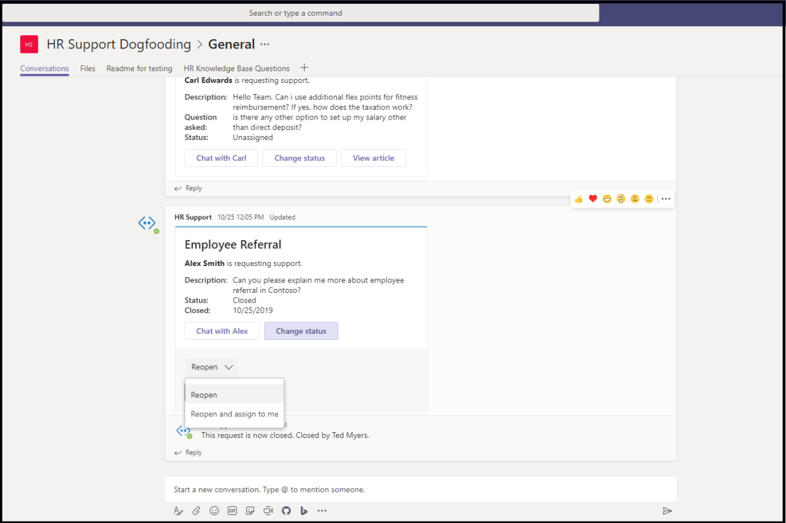

# Modèles d’application pour Microsoft TeamsApp templates for Microsoft Teams

Les modèles d’applications sont des exemples d’applications complètes Microsoft Teams pour les applications qui sont open-source et disponibles sur GitHub.App templates are examples of complete apps for Microsoft Teams that are open-source and available on GitHub. Chaque modèle d’application contient des instructions détaillées pour le déploiement et l’installation de cette application pour votre organisation.Each app template contains detailed instructions for deploying and installing that app for your organization. Il fournit également une application d’échantillon que vous pouvez installer et commencer à utiliser immédiatement.It also provides a sample app that you can install and start using immediately. Le code source complet est également disponible, ce qui vous permet de l’explorer en détail ou de fourche le code et de le modifier pour répondre à vos exigences spécifiques.The complete source code is also available, which allows you to explore it in detail or fork the code and alter it to meet your specific requirements.
Tous les modèles d’applications sont fournis dans les conditions [de licence du MIT.](https://github.com/OfficeDev/microsoft-teams-apps-eprescription/blob/master/LICENSE)All app templates are provided under the [MIT License](https://github.com/OfficeDev/microsoft-teams-apps-eprescription/blob/master/LICENSE) terms.

> [!NOTE] 
> Vous devez autoriser et prendre en charge les applications créées à partir de modèles d’applications pour vos utilisateurs et organisations.You must license and support apps created from app templates for your users and organizations.

**&#9734; indique les modèles d’applications nouvellement publiés.****&#9734; Indicates newly released app templates.**

### Principaux avantagesKey benefits

* **Déployez-vous directement dans le cloud :** Tous les modèles d’applications incluent des scripts de déploiement qui vous permettent d’héberger tous les services Microsoft Azure ou la plate-forme Power.**Deploy directly to the cloud:** All app templates include deployment scripts that allows you to host all required services in Microsoft Azure or the Power Platform. 
* **Code d’échantillon recommandé :** Les modèles d’applications sont conformes aux meilleures pratiques recommandées en matière de sécurité et d’infrastructure.**Recommended sample code:** The app templates conform to recommended best practices around security and infrastructure. Toutes les modifications apportées par la communauté aux modèles d’application sont examinées afin d’assurer la conformité.All community submitted changes to the app templates are reviewed to ensure conformance.
* **Personnalisable et extensible :** Bien que tous les modèles d’applications soient déployés avec une configuration minimale, l’ensemble de la base de code et des scripts de déploiement sont fournis, de sorte que vous pouvez facilement les personnaliser ou les étendre pour répondre à vos besoins uniques.**Customizable and extensible:** While all app templates are deployed with minimal configuration, the entire code base and deployment scripts are provided, so that you can easily customize or extend them to fit your unique needs.
* **Documentation détaillée :** Tous les modèles d’applications sont accompagnés d’une documentation de bout en bout sur l’architecture de solution, le déploiement et les étapes de configuration.**Detailed documentation:** All app templates are accompanied by end-to-end documentation on solution architecture, deployment, and configuration steps.  

## Bot d’adoptionAdoption Bot 

Adoption Bot est un bot de chat de soins aux utilisateurs construit avec Power Virtual Agent pour Teams PVA.Adoption Bot is a user care chat bot built with Power Virtual Agent for Teams PVA. Il est considéré comme la version PVA de FAQ Plus.It is considered as the PVA version of FAQ Plus. Adoption Bot répond à plus de 100 questions courantes sur Microsoft 365 et Teams.Adoption Bot answers 100+ common questions about Microsoft 365 and Teams. Vous pouvez modifier les sujets existants, ajouter vos propres sujets et ingérer les FAQ existantes.You can edit the existing topics, add your own topics, and ingest existing FAQs. Si les utilisateurs ont besoin d’aide supplémentaire, Adoption Bot peut les connecter à des experts ou même être étendu aux billets de service ouverts avec connecteurs premium flow.If users need additional help, Adoption Bot can connect them to experts or even be extended to open service tickets with premium flow connectors. Ce bot est auto-installé ou intégré dans une application personnalisée, comme le Centre [d’adoption](https://github.com/akporzondek/adoption_hub).This bot is self-installed or built into a custom app, such as the [Adoption Hub](https://github.com/akporzondek/adoption_hub).

[Prends-le sur GitHubGet it on GitHub](https://github.com/OfficeDev/microsoft-teams-apps-adopt-bot)

## Outil d’adoption - Plateforme de gestion des champions &#9734;Adoption Tool- Champion Management Platform &#9734;

Le modèle d’application Champion Management Platform (CMP) vous aide à gérer, à mettre à l’échelle et à inspirer vos champions du travail d’équipe à réaliser plus.The Champion Management Platform (CMP) app template helps you manage, scale, and inspire your teamwork champions to achieve more. Ce modèle d’application est construit sur le SharePoint Framework et chargé dans un onglet au sein d’une équipe.This app template is built on the SharePoint Framework and loaded into a tab within a team. Les groupes peuvent tirer parti de cet outil pour aider à gérer l’adhésion au programme, fournir un classement et des types d’événements pour l’enregistrement, et des outils pour superposer des badges numériques aux participants au programme.Groups can leverage this tool to help manage program membership, provide a leaderboard and event types for logging, and tools to overlay digital badges to program participants.

[Prends-le sur GitHubGet it on GitHub](https://github.com/OfficeDev/microsoft-teams-apps-champion-management)

## Voies d’apprentissage Microsoft 365'adoption (Prise en main) &#9734;Adoption Tool- Microsoft 365 Learning Pathways (Get Started) &#9734;

Le modèle Prise en main’application vous permet d’apporter la puissance des voies d’apprentissage Microsoft 365 l’intérieur de Microsoft Teams.The Get Started app template allows you to bring the power of Microsoft 365 learning pathways inside of Microsoft Teams. Ce modèle d’application vous permet d’accorder un accès facile à des pages de formation spécifiques ou à d’autres actifs intranet et de charger le contenu directement dans Teams.This app template allows you to grant easy access to specific training pages or other intranet assets and load the content directly within Teams. Vous pouvez également modifier le nom ou le logo de l’application pour correspondre à l’image de marque de votre entreprise.You can also change the app name or logo to match your company branding.

[Prends-le sur GitHubGet it on GitHub](https://github.com/msft-teams/tools/tree/master/M365%20Learning%20Pathways)

## Gestionnaire de rendez-vousAppointment Manager 

Appointment Manager est un modèle d Teams apprologie pour aider les entreprises à créer, gérer et prendre des rendez-vous virtuels avec les consommateurs par l’intermédiaire Teams.Appointment Manager is a Teams app template to help businesses create, manage, and conduct virtual appointments with consumers through Teams. Les nouvelles demandes de rendez-vous des consommateurs sont visibles Teams canaux, où elles sont rapidement assignées et réaffectées au personnel d’une équipe.New appointment requests from consumers are visible in Teams channels, where they are quickly assigned and reassigned to staff in a team. Les demandes de rendez-vous sont consultées aux niveaux de l’équipe ou de la vie personnelle au moyen d’onglets personnalisés.Appointment requests are viewed at team or personal levels through custom tabs. Chaque rendez-vous est associé à une Teams en ligne, d’où le personnel et les consommateurs peuvent facilement se joindre à la réunion à l’heure prévue.Every appointment is associated with a Teams online meeting, hence the staff and consumers can easily join the meeting at the scheduled time.

Le modèle d’application s’intègre à Microsoft Bookings pour une gestion facile des rendez-vous.The app template integrates with Microsoft Bookings for easy appointment management. Les rendez-vous planifiés apparaissent automatiquement sur les calendriers des membres du personnel affectés, et les consommateurs reçoivent des notifications et des rappels électroniques personnalisables avec des liens de réunion intégrés.Scheduled appointments automatically appear on assigned staff members' calendars, and consumers receive customizable email notifications and reminders with embedded meeting links.

[Prends-le sur GitHubGet it on GitHub](https://github.com/OfficeDev/microsoft-teams-apps-appointment-manager)

 

## Demandez à l’extérieurAsk Away

Ask Away est un [bot Microsoft Teams qui permet](../bots/what-are-bots.md) aux utilisateurs d’effectuer des questions et réponses, appelées sessions Q&A dans Teams.Ask Away is a [Microsoft Teams bot](../bots/what-are-bots.md) that enables users to conduct Question and Answer, called Q&A sessions within Teams. À l’aide du bot Ask Away, les membres de l’équipe peuvent soumettre et voter des questions partagées par des collègues permettant aux hôtes Q&A de recueillir facilement des questions de premier esprit au sein d’un canal ou d’un chat.Using the Ask Away bot, team members can submit and up-vote questions shared by colleagues allowing Q&A hosts to easily gather top-of-mind questions within a channel or chat. Le bot est utilisé pour effectuer une session Q&A en temps réel dans une réunion Teams et permet aux participants de soumettre des questions en direct par chat.The bot is used to conduct a real-time Q&A session in a Teams meeting and allows attendees to submit questions live through chat.

[Prends-le sur GitHubGet it on GitHub](https://github.com/OfficeDev/microsoft-teams-apps-askaway)

:::row:::
  :::column span="2":::
      
:::column-end:::
:::row-end:::

## Informations du collaborateurAssociate Insights

Associate Insights est un modèle [Power Apps qui permet](/powerapps/maker/canvas-apps/embed-teams-app) aux travailleurs de première ligne de capturer et de soumettre directement l’opinion, le sentiment et la perception des clients.Associate Insights is a [Power Apps](/powerapps/maker/canvas-apps/embed-teams-app) template that empowers firstline workers to directly capture and submit customer opinion, sentiment, and perception. Les travailleurs de première ligne sont souvent le premier représentant de l’entreprise à s’engager avec les clients dans un point de contact en personne.Firstline workers are often the first company representative to engage with customers in a one-to-one point-of contact. Les données collectées sont partagées et utilisées en collaboration par les équipes d’affaires, par exemple par le biais d’un onglet Power BI Teams, pour améliorer l’expérience client et améliorer l’expérience client.The collected data are shared and used collaboratively by business teams, such as through a Power BI Teams tab, for product improvement and enhancing the customer experience.

[Prends-le sur GitHubGet it on GitHub](https://github.com/OfficeDev/microsoft-teams-apps-associateinsights)

:::row:::
  :::column span="2":::
      
:::column-end:::
:::row-end:::
:::row:::
:::column span="2":::
    
:::column-end:::
:::row-end:::

## PrésenceAttendance

L’application Présence est [un onglet Power Apps](/powerapps/maker/canvas-apps/embed-teams-app) qui sont épinglés dans une équipe.The Attendance app is a [Power Apps](/powerapps/maker/canvas-apps/embed-teams-app) tab that are pinned in a team. Il est conçu pour enregistrer la présence dans des environnements tels que les environnements d’apprentissage et de formation.It is designed to record presence in settings, such as learning and training environments. Les utilisateurs peuvent marquer ou modifier la fréquentation jusqu’à 30 jours dans le passé et consulter les rapports de participation résumés pour un groupe entier ou des participants individuels.Users can mark or edit attendance for up to 30 days in the past and view summarized attendance reports for an entire group or individual attendees. Pour plus d’informations sur la présence des équipes, [voir Get it on GitHub](https://github.com/OfficeDev/microsoft-teams-apps-attendance).For more information on teams attendance, see [Get it on GitHub](https://github.com/OfficeDev/microsoft-teams-apps-attendance).

L’image suivante affiche la démo de l’application de présence :The following image displays the attendance app demo:  

## Réservez une chambreBook-a-room

Book-a-room est un [bot Microsoft Teams qui permet](../bots/what-are-bots.md) aux utilisateurs de trouver et de réserver rapidement une salle de réunion pour 30, 60 ou 90 minutes à partir de l’heure actuelle.Book-a-room is a [Microsoft Teams bot](../bots/what-are-bots.md) that allows users quickly to find and reserve a meeting room for 30, 60, or 90 minutes starting from the current time. Le temps par défaut est de 30 minutes.The default time is 30 minutes. Le livre-une-chambre bot portées à des conversations personnelles ou 1:1.The Book-a-room bot scopes to personal or 1:1 conversations. Pour plus d’informations sur l’application Book-a-room, [voir Get it on GitHub](https://github.com/OfficeDev/microsoft-teams-apps-bookaroom).For more information on Book-a-room app, see [Get it on GitHub](https://github.com/OfficeDev/microsoft-teams-apps-bookaroom).  
L’image suivante affiche la démo book-a-room :The following image displays the Book-a-room demo:

## Accès aux bâtimentsBuilding Access

Building Access est une application basée sur microsoft [power platform](https://powerapps.microsoft.com/blog/now-in-preview-customize-teams-with-built-in-power-platform-capabilities/) qui prend en charge l’administration des seuils d’occupation des bâtiments et des normes de distanciation sociale en permettant aux directeurs d’installations de gérer, suivre et signaler la présence des employés sur place.Building Access is a Microsoft [Power Platform](https://powerapps.microsoft.com/blog/now-in-preview-customize-teams-with-built-in-power-platform-capabilities/) based app that supports the administration of building occupancy thresholds and social distancing norms by enabling facilities directors to manage, track, and report employee on-site presence. L’application, conçue à [l’aide de](/powerapps/powerapps-overview)Microsoft Power Apps et [Power Automate](/power-automate/getting-started), s’intègre profondément à Microsoft Teams et permet aux organisations de déterminer la préparation au bâtiment, d’établir des critères d’admissibilité pour l’accès sur place et de recueillir des informations pour la planification future.The app, built using Microsoft [Power Apps](/powerapps/powerapps-overview), and [Power Automate](/power-automate/getting-started), deeply integrates with Microsoft Teams and enables organizations to determine building readiness, establish eligibility criteria for on-site access, and gather insights for future planning.

[Prends-le sur GitHubGet it on GitHub](https://github.com/OfficeDev/microsoft-teams-apps-buildingaccess)

:::row:::
   :::column span="":::
     
   :::column-end:::
   :::column span="":::
      
   :::column-end:::
:::row-end:::

## CélébrationsCelebrations

Celebrations est une application Teams qui aide les membres de l’équipe à célébrer les anniversaires, les anniversaires et autres événements récurrents de l’autre.Celebrations is a Teams app that helps team members to celebrate each others' birthdays, anniversaries, and other recurring events. Il se souvient des occasions spéciales de tous les membres de l’équipe et envoie un message amical dans toutes les équipes sélectionnées au moment de la création de l’événement, pour que les membres de l’équipe se sentent spéciaux lors de leur journée.It remembers special occasions of all the team members and sends a friendly message in all the teams selected at the time of event creation, to make the team members feel special on their day.

L’application fournit une interface facile pour tous les membres de l’équipe d’ajouter et de visualiser personnellement leurs événements et permet également à l’utilisateur de sélectionner les équipes dans lesquelles les événements sont partagés.The app provides an easy interface for all the team members to personally add and view their events and also allows the user to select the teams in which the events gets shared.

[Prends-le sur GitHubGet it on GitHub](https://github.com/OfficeDev/microsoft-teams-celebrations-app)

## Liste de vérificationChecklist

Checklist est une application d Microsoft Teams [d’extension de messagerie](../messaging-extensions/what-are-messaging-extensions.md) personnalisée qui vous permet de collaborer avec votre équipe en créant une liste de contrôle partagée dans un chat ou un canal.Checklist is a custom Microsoft Teams [messaging extension](../messaging-extensions/what-are-messaging-extensions.md) app that enables you to collaborate with your team by creating a shared checklist in a chat or channel. L’application est prise en charge dans Teams clients de la plate-forme, tels que le navigateur de bureau, iOS et Android.The app is supported across all Teams platform clients, such as desktop browser, iOS, and Android. L’application est prête à être déployée dans le cadre de votre Microsoft 365 abonnement.The app is ready for deployment as part of your Microsoft 365 subscription.  

[Prends-le sur GitHubGet it on GitHub](https://github.com/OfficeDev/microsoft-teams-checklist-app)

:::row:::
:::column span="2":::
      
:::column-end:::
:::row-end:::

## Drop-in en classeClassroom Drop-in 

Classroom Drop-in est une application basée sur la plate-forme Microsoft [Power qui](https://powerapps.microsoft.com/blog/now-in-preview-customize-teams-with-built-in-power-platform-capabilities/)permet aux leaders du système de trouver des équipes de classe, signifie des salles de classe virtuelles et de s’ajouter eux-mêmes ou d’autres à ces équipes de classe pour une période d’abandon spécifiée, au besoin.Classroom Drop-in is a Microsoft [Power Platform](https://powerapps.microsoft.com/blog/now-in-preview-customize-teams-with-built-in-power-platform-capabilities/)-based app that enables system leaders to find class teams, means virtual classrooms and add themselves or others to these class teams for a specified drop-in period, as needed. L’application construite à [l’aide de](/powerapps/powerapps-overview) Microsoft Power Apps [et Power Automate](/power-automate/getting-started), s’intègre profondément à Microsoft Teams pour s’assurer que les instituts éducatifs peuvent optimiser leurs opérations dans un environnement d’apprentissage hybride en donnant accès aux parties prenantes pertinentes pour les équipes de classe par entreprise.The app built using Microsoft [Power Apps](/powerapps/powerapps-overview) and [Power Automate](/power-automate/getting-started), deeply integrates with Microsoft Teams to ensure educational institutes can optimize their operations in a hybrid learning environment by providing access to relevant stakeholders for class teams per business requirements.

[Prends-le sur GitHubGet it on GitHub](https://github.com/OfficeDev/microsoft-teams-apps-classroom-dropin)

## Communicateur d’entrepriseCompany Communicator

L’application company Communicator permet aux équipes d’entreprise de créer et d’envoyer des messages destinés à plusieurs équipes ou à un grand nombre d’employés sur le chat, ce qui permet à l’organisation d’atteindre les employés là où ils collaborent.The Company Communicator app enables corporate teams to create and send messages intended for multiple teams or large number of employees over chat allowing organization to reach employees right where they collaborate. Utilisez ce modèle pour plusieurs scénarios tels que les annonces de nouvelles initiatives, l’ingusion des employés, l’apprentissage moderne et le développement ou les émissions à l’échelle de l’organisation.Utilize this template for multiple scenarios such as new initiative announcements, employee onboarding, modern learning, and development or organization-wide broadcasts.

L’application fournit une interface facile pour les utilisateurs désignés pour créer, prévisualiser, collaborer et envoyer des messages.The app provides an easy interface for designated users to create, preview, collaborate and send messages.

Il fournit une base pour construire des capacités de communication ciblées personnalisées telles que la télémétrie personnalisée sur le nombre d’utilisateurs reconnus ou interagis avec un message.It provides a foundation to build custom targeted communication capabilities such as custom telemetry on how many users acknowledged or interacted with a message.

[Prends-le sur GitHubGet it on GitHub](https://github.com/OfficeDev/microsoft-teams-company-communicator-app)

## Recherche de groupe de contactContact Group Lookup

L’application Contact Group Lookup offre une approche pratique et utile pour créer, accéder et gérer les groupes de contact de votre organisation, anciennement connus sous le nom de listes de distribution ou de groupes de communication.The Contact Group Lookup app provides a convenient and useful approach to creating, accessing, and managing your organization's contact groups, formerly known as distribution lists or communication groups. Les utilisateurs peuvent rapidement consulter et discuter avec les membres du groupe, afficher le statut de membre et créer un chat de groupe avec des membres sélectionnés du groupe de contact, le tout dans l’environnement Teams’environnement.Users can quickly view and chat with group members, view member status, and create a group chat with selected members in the contact group, all within the Teams environment.

[Prends-le sur GitHubGet it on GitHub](https://github.com/OfficeDev/microsoft-teams-app-contactgrouplookup)

:::row:::
:::column span="2":::
      
:::column-end:::
:::row-end:::
:::row:::
:::column span="2":::
    
:::column-end:::
:::row-end:::

## Appréciation des collèguesCo-worker Appreciation 

À l’aide du modèle d’appréciation des collègues Microsoft Teams, les utilisateurs peuvent reconnaître les réalisations de leurs collègues dans le contexte Teams de leurs collègues.Using the co-worker appreciation template in Microsoft Teams, users can recognize their colleagues' achievements within the Teams’ context. Lorsque des collègues choisissent de récompenser un collègue, les destinataires et les autres membres de l’équipe sont marqués dans une conversation de chaîne et reçoivent une notification sur les détails du prix de la chaîne.When co-workers select to reward a colleague, recipients and other team members are tagged in a channel conversation and they receive a notification about the channel's award details. Les prix sont enregistrés dans l Teams apprable, qui est sécurisée, portable et facilement partageable.The awards are recorded in the Teams app, which is secure, portable, and easily shareable. Ceci est considéré comme la version basée sur PowerApps du modèle d’application Open Badges, avec un classement.This is considered as the PowerApps based version of the Open Badges app template, with a leaderboard.

[Prends-le sur GitHubGet it on GitHub](https://github.com/OfficeDev/microsoft-teams-apps-coworker-appreciation)

## CrowdSourcer (en)CrowdSourcer

CrowdSourcer est un [bot Microsoft Teams qui donne](../bots/what-are-bots.md) aux équipes des informations interrogées provenant de membres du groupe.CrowdSourcer is a [Microsoft Teams bot](../bots/what-are-bots.md) that gives teams queried information sourced collaboratively from group members. Il aide à répondre aux questions fréquemment posées tout en permettant aux participants de s’engager activement et de contribuer à une ressource d’information amusante et utile.It helps to answer frequently asked questions while enabling participants to actively engage in and contribute to a fun and helpful information resource.

[Obtenez-le sur GithubGet it on Github](https://github.com/OfficeDev/microsoft-teams-crowdsourcer-app)

## Autocollants personnalisésCustom Stickers

L’expression de soi est au cœur d’une culture d’équipe saine.Self-expression is core to a healthy team culture. Ce modèle d’application est [une extension de](~/messaging-extensions/what-are-messaging-extensions.md) messagerie qui permet à vos utilisateurs d’utiliser des autocollants personnalisés et des GIF dans Microsoft Teams.This app template is a [messaging extension](~/messaging-extensions/what-are-messaging-extensions.md) that enables your users to use custom stickers and GIFs within Microsoft Teams. Ce modèle offre une expérience de configuration web facile où toute personne ayant accès à la configuration peut télécharger les GIF, autocollants et images qu’ils veulent que leurs utilisateurs aient, permettant à toute votre équipe d’utiliser n’importe quel ensemble d’autocollants que vous choisissez.This template provides an easy web-based configuration experience where anyone with configuration access can upload the GIFs, stickers, and images they want their users to have, allowing your entire team to use any set of stickers you choose.

Cette application permet également un partage facile d’images, gifs, autocollants entre les équipes sans avoir besoin d’accéder à des sites SharePoint ou des canaux individuels comme mécanismes de stockage et de partage.This app also enables easy sharing of images, GIFs, stickers across teams without needing access to SharePoint sites or individual channels as storage and sharing mechanisms. Par exemple, les équipes de produits peuvent facilement partager des images de produits et des GIF aux équipes de médias sociaux, de marketing et de vente de façon programmatique.For example, product teams can easily share product images and GIFs to social media, marketing, and sales teams programmatically. On peut également étendre cette application en déclenchant un flux de notification à des équipes ou des individus spécifiques lorsque de nouvelles images, et gifs sont mis à disposition.One can also extend this app by triggering a notification flow to specific teams or individuals when new images, and GIFs are made available.

[Prends-le sur GitHubGet it on GitHub](https://github.com/OfficeDev/microsoft-teams-stickers-app)

## Idées des employésEmployee Ideas

L’application Idées d’employés est la version PowerApps du modèle d’application Great Ideas basé sur Azure.The Employee Ideas app is the PowerApps version of the Azure based Great Ideas app template. L’application permet aux utilisateurs Teams configurer et configurer une campagne d’idées.The app enables the Teams users to set up and configure an idea campaign. Une campagne d’idées est une catégorie de regroupement d’idées autour de thèmes communs.An idea campaign is a category for grouping ideas around common themes.

Teams utilisateurs peuvent également effectuer les activités suivantes :Teams users can also perform the following activities:

* Configurer un formulaire de soumission standard que les employés doivent soumettre pour chaque idée.Configure a standard submission form that employees must submit for each idea. 
* Examiner et gérer les idées et la liste des campagnes.Review and manage the ideas and list of campaigns.
* Modifier et supprimer des campagnes.Modify and delete campaigns.
* Examiner les conseils d’idées des dirigeants.Review leader boards of ideas.
* Votez et partagez des idées priorisées.Vote for and share prioritized ideas.
* Soumettez des idées pour une campagne.Submit ideas for a campaign.
* Voir l’idée d’un autre membre de l’équipe.View other team member's idea.
* Votez sur les idées les plus appréciées.Vote on most liked ideas.
* Passez en revue la performance de leurs idées par rapport à d’autres au sein d’une campagne.Review the performance of their ideas compared with others within a campaign.

[Prends-le sur GitHubGet it on GitHub](https://github.com/OfficeDev/microsoft-teams-apps-employeeideas)

 

## E-Prescriptions (e-Prescriptions)E-Prescriptions 

E-Prescriptions est une [application Power Apps qui](/powerapps/maker/canvas-apps/embed-teams-app) améliore la télémédecine et les soins virtuels en automatisant le processus d’émission d’ordonnances électroniques aux patients.E-Prescriptions is a [Power Apps](/powerapps/maker/canvas-apps/embed-teams-app) based app that enhances telemedicine and virtual care by automating the process of issuing e-prescriptions to patients. Les professionnels de la santé peuvent rapidement examiner les rendez-vous, générer des ordonnances électroniques et envoyer des courriels avec des pièces jointes à des patients directement dans la plate-forme Teams’assurance.Medical professionals can quickly review appointments, generate e-prescriptions, and send emails with e-prescription attachments to patients directly within the Teams platform.

[Prends-le sur GitHubGet it on GitHub](https://github.com/OfficeDev/microsoft-teams-apps-eprescription) 

:::row:::
:::column span="2":::
      
:::column-end:::
:::row-end:::
:::row:::
:::column span="2":::
    
:::column-end:::
:::row-end:::

## Formation des employésEmployee Training 

La formation des employés est une application Microsoft Teams qui permet aux organisateurs de publier, de suivre et de promouvoir facilement des événements d’apprentissage et de formation pour votre organisation.Employee training is a Microsoft Teams app that enables organizers to easily publish, track, and promote learning and training events for your organization.  Avec l’application, les planificateurs d’événements peuvent envoyer des rappels et des notifications aux inscrits et les employés peuvent indiquer leur intérêt pour les événements à venir, rester à jour sur l’actualité et partager les détails de l’événement avec leurs collègues par le biais de l’extension de messagerie Teams.With the app, event planners can send reminders and notifications to event registrants and employees can indicate interest in upcoming events, stay updated on current events, and share event details with colleagues through the Teams messaging extension.

[Prends-le sur GitHubGet it on GitHub](https://github.com/OfficeDev/microsoft-teams-apps-employeetraining)

:::row:::
:::column span="2":::
    **Voir les événements de formation des employés** **View employee training events**   
:::column-end:::
:::row-end:::
:::row:::
:::column span="2":::
    **Créer un événement de formation des employés** **Create employee training event** 
:::column-end:::
:::row-end:::

## Expert FinderExpert Finder

Expert Finder est un [bot Microsoft Teams qui](../bots/what-are-bots.md) identifie des membres spécifiques de l’organisation en fonction de leurs compétences, intérêts et attributs d’éducation.Expert Finder is a [Microsoft Teams bot](../bots/what-are-bots.md) that identifies specific organization members based on their skills, interests, and education attributes. Les membres trouvent des experts au sein d’une organisation qui correspondent à une recherche par mot clé Azure Active Directory profils d’utilisateurs.Members find experts within an organization that match a keyword search of Azure Active Directory user profiles.

[Prends-le sur GitHubGet it on GitHub](https://github.com/OfficeDev/microsoft-teams-apps-expertfinder)

## Forum aux questionsFAQ Plus

Conversational Q&Bots A sont un moyen facile de fournir des réponses aux questions fréquemment posées par les utilisateurs.Conversational Q&A bots are an easy way to provide answers to frequently asked questions by users. Mais, la plupart des bots ne parviennent pas à s’engager avec les utilisateurs de manière significative parce qu’il n’y a pas d’humain dans la boucle lorsque le bot échoue.But, most bots fail to engage with users in meaningful way because there is no human in the loop when the bot fails. FAQ bot est un Q&un bot qui apporte un humain dans la boucle quand il est incapable d’aider.FAQ bot is a friendly Q&A bot that brings a human in the loop when it is unable to help. On peut poser une question au bot et le bot répond par une réponse si elle est contenue dans la base de connaissances.One can ask the bot a question and the bot responds with an answer if it is contained in the knowledge base. Si ce n’est pas le cas, le bot permet à l’utilisateur de soumettre une requête qui est ensuite affichée à une équipe préconfigurée d’experts qui aident à fournir un soutien en agissant sur les notifications de l’intérieur de l’équipe elle-même.If not, the bot allows the user to submit a query which then gets posted to a pre-configured team of experts who help to provide support by acting upon the notifications from within the team itself.

> [!NOTE]
> La dernière version de **FAQ Plus prend en** charge l’amélioration des résolutions Q&A en permettant à une équipe d’experts de compléter les éléments suivants :The latest release of **FAQ Plus** supports improved Q&A resolutions by enabling a team of experts to complete the following:
>
> &#x2714; ajouter de nouveaux Q&directement à la base de connaissances à l’aide d’extensions de messages.&#x2714; Add new Q&As directly to the knowledge base using message extensions.
>
> &#x2714; modifier et supprimer les paires Q&A ajoutées par un bot.&#x2714; Edit and delete Q&A pairs added by a bot.
>
> &#x2714; suivre l’historique de révision de Q&As.&#x2714; Track the revision history of Q&As.
>
> &#x2714; configurer une réponse avec des détails supplémentaires à afficher sous forme de [carte adaptative](../task-modules-and-cards/cards/cards-reference.md#adaptive-card).&#x2714; Configure an answer with additional details to display as an [Adaptive Card](../task-modules-and-cards/cards/cards-reference.md#adaptive-card).
>
[Prends-le sur GitHubGet it on GitHub](https://github.com/OfficeDev/microsoft-teams-apps-faqplusv2)

## Obtenez l’application de supportGet Support App

L’application Get Support est utilisée par les organisations qui utilisent Microsoft Teams, pour permettre à n’importe quel groupe d’utilisateurs de demander l’aide des superviseurs.The Get Support app is used by organizations that are using Microsoft Teams, to enable any set of users to request assistance from supervisors. Cette application comprend les fonctionnalités suivantes :This app includes the following features:
* Demander de l’aide sur différentes catégories à partir d’une application Power.Requesting assistance on different categories from a Power App.
* Notifications envoyées aux demandeurs les informant de qui le lièvre a assigné.Notifications sent to requestors informing them of who hare assigned.
* Notifications envoyées aux superviseurs affectés pour les informer des personnes qui ont besoin d’aide.Notifications sent to assigned supervisors informing them of who needs assistance. 
* Analyse des escalades et des modèles SharePoint et PowerBI.S.Analyzing escalations and patterns in SharePoint and PowerBI.S.

[Prends-le sur GitHubGet it on GitHub](https://github.com/OfficeDev/microsoft-teams-app-get-support/)

## Tracker objectifGoal Tracker

L’application Goal Tracker est une solution complète pour votre organisation afin de soutenir l’établissement d’objectifs, l’observation des progrès et la reconnaissance du succès Microsoft Teams.The Goal Tracker app is a comprehensive solution for your organization to support establishing goals, observing progress, and acknowledging success within Microsoft Teams. L’application permet aux utilisateurs de définir, suivre et mettre à jour les objectifs au niveau professionnel, personnel et d’équipe.The app enables users to set, track, and update objectives on a professional, personal, and team level. Les membres de l’équipe reçoivent également des rappels et des mises à jour d’état en temps opportun pour rester concentrés et rester sur la bonne voie.Team members also receive timely reminders and status updates to remain focused and stay on track.

[Prends-le sur GitHubGet it on GitHub](https://github.com/OfficeDev/microsoft-teams-app-goaltracker)

:::row:::
  :::column span="2":::
      
:::column-end:::
:::row-end:::
:::row:::
:::column span="2":::
    
:::column-end:::
:::row-end:::

## Grandes idéesGreat Ideas

L’application Great Ideas soutient et renforce l’innovation et la créativité au sein de votre organisation.The Great Ideas app supports and empowers innovation and creativity within your organization. L’application permet à vos employés de partager des idées avec leurs collègues et les dirigeants, de découvrir de nouvelles soumissions, de mettre en lumière les contributions pour l’examen par les pairs et de voter pour les meilleures propositions au sein Microsoft Teams.The app enables your employees to share ideas with colleagues and leadership, discover new submissions, spotlight contributions for peer consideration, and cast their vote for the best proposals within Microsoft Teams.

[Prends-le sur GitHubGet it on GitHub](https://github.com/OfficeDev/microsoft-teams-apps-greatideas)

:::row:::
  :::column span="2":::
      
:::column-end:::
:::row-end:::
:::row:::
:::column span="2":::
    
:::column-end:::
:::row-end:::

## Activités de groupeGroup Activities

Group Activities est une application Microsoft Teams qui permet aux propriétaires d’équipe de créer rapidement des groupes d’activités et de gérer les workflows de collaboration dans le contexte de Microsoft Teams.Group Activities is a Microsoft Teams app that makes it easy for team owners to quickly create activity groups and manage collaboration workflows within the context of Microsoft Teams. Les auteurs d’activités sont autorisés à créer des activités, à distribuer aléatoirement les membres de l’équipe en groupes et, en option, à envoyer des rappels au bot jusqu’à ce que les activités soient terminées.Activity authors are enabled to create activities, randomly distribute team members in groups, and optionally have the bot send reminders until activities are complete.

[Prends-le sur GitHubGet it on GitHub](https://github.com/OfficeDev/microsoft-teams-apps-groupactivities)

:::row:::
  :::column span="2":::
      
:::column-end:::
:::row-end:::
:::row:::
:::column span="2":::
    
:::column-end:::
:::row-end:::

## Groupe Connecter &#9734;Group Connect &#9734;

Group Connecter une application Microsoft Teams qui aide les membres de l’organisation à découvrir les groupes d’employés et à trouver des informations pertinentes pour les groupes d’employés.Group Connect is a Microsoft Teams app that helps organization members discover employee groups and find information relevant to employee groups. L’application est intégrée avec de riches capacités pour les dirigeants d’organisation de communiquer avec leurs employés en ce qui concerne les groupes, les événements et les ressources.The app comes built-in with rich capabilities for organization leaders to communicate with their employees regarding groups, events, and resources. L’application Connecter groupe correspond également les uns aux autres à la fréquence souhaitée afin d’encourager le réseautage et la cohésion au sein d’un groupe.The Group Connect app also matches group members with each other at their desired frequency to encourage networking and cohesion within a group. Pour plus d’informations sur la façon dont vous pouvez tirer parti de l’application Group Connecter pour aider les groupes d’employés à se renforcer au sein de votre organisation, consultez l’application GitHub.For more information on how you can leverage the Group Connect app to help employee groups foster within your organization, see the app on GitHub.

[Prends-le sur GitHubGet it on GitHub](https://github.com/OfficeDev/microsoft-teams-apps-groupconnect)

## Développez vos compétencesGrow Your Skills

L’application Cultivons vos compétences favorise la croissance et le perfectionnement professionnels en permettant aux employés de contribuer à des projets supplémentaires pour votre organisation tout en apprenant de nouvelles compétences.The Grow Your Skills app supports professional growth and development by enabling employees to contribute to supplemental projects for your organization while simultaneously learning new skills. Les employés peuvent utiliser l’application pour trouver des opportunités qui répondent à leurs intérêts, profiter d’une collaboration significative avec leurs pairs et acquérir de nouveaux niveaux d’expertise et de capacités, le tout dans l’environnement Teams environnement.Employees can use the app to locate opportunities that meet their interests, enjoy meaningful collaboration with peers, and acquire new levels of expertise and capabilities, all within the Teams environment.

[Prends-le sur GitHubGet it on GitHub](https://github.com/OfficeDev/microsoft-teams-apps-growyourskills)

:::row:::
  :::column span="2":::
      
:::column-end:::
:::row-end:::
:::row:::
:::column span="2":::
    
:::column-end:::
:::row-end:::

## Prise en charge RHHR Support

HR Support bot est un q&un bot amical qui apporte un professionnel de soutien ou un expert de l’équipe RH dans la boucle quand il est incapable d’aider.HR Support bot is a friendly Q&A bot that brings a support professional or expert from the HR team in the loop when it is unable to help. On peut poser une question au bot et le bot répond par une réponse si elle est contenue dans la base de connaissances.One can ask the bot a question and the bot responds with an answer if it is contained in the knowledge base. Si ce n’est pas le cas, le bot permet à l’utilisateur de soumettre une requête qui est ensuite affichée dans une équipe préconfigurée d’experts qui aident à fournir un soutien en agissant sur les notifications de l’intérieur de leur équipe elle-même.If not, the bot allows the user to submit a query which then gets posted in a pre-configured team of experts who are help to provide support by acting upon the notifications from within their team itself. En outre, le bot suggère des liens vers les stratégies rh recommandées ou des questions en recherchant des balises préconfigurées dans la question.Additionally, the bot suggests links to recommended HR policies or questions by searching for pre-configured tags in the question. Ces tuiles se trouvent dans l’onglet associé comme une référence rapide.These tiles are found in the associated tab as a quick reference. Le soutien aux RH fonctionne bien pour les questions de poids léger&A et pour fournir un soutien rapide lors du lancement de nouveaux projets ou initiatives au cours de l’organisation.HR Support works well for light weight Q&A and to provide quick support when launching new projects or initiatives in the organization.

[Prends-le sur GitHubGet it on GitHub](https://github.com/OfficeDev/microsoft-teams-hrsupport-app)

## Brise-glaceIcebreaker

Icebreaker est un [bot Microsoft Teams qui aide votre](../bots/what-are-bots.md) équipe à se rapprocher en jumelant deux membres aléatoires de l’équipe chaque semaine pour se rencontrer.Icebreaker is a [Microsoft Teams bot](../bots/what-are-bots.md) that helps your team get closer by pairing two random team members up every week to meet. Le bot facilite la planification en suggérant automatiquement des temps libres qui fonctionnent pour les deux membres.The bot makes scheduling easy by automatically suggesting free times that work for both members. Renforcez vos liens personnels et construisez une communauté soudée avec cette application.Strengthen personal connections and build a tightly knit community with this app.

En plus d’encourager les liens personnels dans toute votre équipe, l’application Icebreaker peut aider à cultiver des communautés basées sur l’intérêt au sein de votre organisation.In addition to encouraging personal connections across your entire team, the Icebreaker app can help cultivate interest-based communities within your organization. Par exemple, vous pouvez utiliser cette application pour un groupe d’intérêt DevOps pour aider les idées et les meilleures pratiques à se répandre organiquement dans votre organisation.For example, you can use this app for a DevOps interest group to help ideas and best practices organically spread across your organization.

[Prends-le sur GitHubGet it on GitHub](https://github.com/OfficeDev/microsoft-teams-icebreaker-app)

## IncitationsIncentives

Les incitatifs sont [Power Apps modèle qui](/powerapps/maker/canvas-apps/embed-teams-app) gère et suit la participation des employés incités à des activités désignées, comme les formations et les initiatives de gestion du changement.Incentives is a [Power Apps](/powerapps/maker/canvas-apps/embed-teams-app) template that manages and tracks incentivized employee participation in designated activities, such as trainings and change management initiatives. Les administrateurs utilisent l’application pour établir des activités désignées, attribuer des points pour l’achèvement et spécifier les niveaux de points d’admissibilité requis pour les récompenses.Admins use the app to establish designated activities, assign points for completion, and specify required eligibility point levels for rewards. Les employés utilisent l’application pour afficher leurs points accumulés et, lorsqu’ils atteignent l’admissibilité, demandent et réclament des récompenses échangeables.Employees use the app to view their accumulated points and, upon reaching eligibility, request and claim redeemable rewards.

[Prends-le sur GitHubGet it on GitHub](https://github.com/OfficeDev/microsoft-teams-apps-incentives)

## Incident ReporterIncident Reporter

Incident Reporter est un [Microsoft Teams bot](../bots/what-are-bots.md) qui optimise la gestion des incidents dans votre organisation.Incident Reporter is a [Microsoft Teams bot](../bots/what-are-bots.md)  that optimizes the management of incidents in your organization. Le bot facilite la collecte automatisée de données sur les incidents, les rapports d’incidents personnalisés, les notifications pertinentes des parties prenantes et le suivi des incidents de bout en bout.The bot facilitates automated incident data collection, customized incident reports, relevant stakeholder notifications, and end-to-end incident tracking.

[Prends-le sur GitHubGet it on GitHub](https://github.com/OfficeDev/microsoft-teams-apps-incidentreport)

:::row:::
  :::column span="2":::
      
:::column-end:::
:::row-end:::
:::row:::
:::column span="2":::
    
:::column-end:::
:::row-end:::

## inspectionInspection 

 L’inspection est Microsoft Teams qui permet aux travailleurs de première ligne d’inspecter quoi que ce soit, des emplacements aux biens et aux équipements.Inspection is a Microsoft Teams app that enables front line workers to inspect anything from  locations to assets and equipments. Par exemple, un magasin de détail, une usine de fabrication ou des véhicules et des machines.For example, a retail store, manufacturing plant, or vehicles and machines. Il existe deux applications dans cette solution, chacune destinée à différents types d’utilisateurs.There are two apps in this solution, each intended for different types of users.

L’application permet aux travailleurs de première ligne d’inspecter un actif ou une zone, de gérer la qualité des produits et des services ou de maintenir la sécurité au travail.The app empowers the front line workers to inspect an asset or area, to manage quality of products and services, or maintain safety at workplace. Il facilite la communication entre les membres de l’équipe pour régler les problèmes constatés lors de l’inspection.It facilitates communication between team members to address issues found during inspection. L’application fournit des rapports simples aux gestionnaires pour accélérer la résolution des problèmes et mettre en évidence les tendances.The app provides simple reports for managers to expedite issue resolution and highlight trends.

[Prends-le sur GitHubGet it on GitHub](https://github.com/OfficeDev/microsoft-teams-apps-inspection)

   

## Rapports sur les émetteursIssue Reporting

L’application De reporting des enjeux permet aux employés et aux gestionnaires de soulever et de gérer les problèmes.The Issue Reporting app empowers the employees and managers to raise and manage issues. Il se compose de deux applications, application de reporting de problèmes pour les problèmes de reporting et gérer les problèmes app pour gérer les problèmes.It consists of two apps, Issue reporting app for reporting issues and Manage Issues app for managing issues.

Les responsables d’équipe utilisent l’application Manage Issues pour configurer l’expérience de l’application, y compris le canal dans lequel les messages Microsoft Teams et les tâches planificateur sont créés par l’application.The team managers use the Manage Issues app to configure the app experience, including the channel in which Microsoft Teams messages and Planner tasks are created by the app. Les gestionnaires utilisent également l’application pour créer des formulaires de modèle pour recueillir des détails lorsqu’un utilisateur signale un problème.Managers also use the app to create template forms to collect details when a user reports an issue. Par exemple, examinez, modifiez ou supprimez les formulaires de modèle d’émission.For example, review, edit, or delete issue template forms. L’application est également utilisée pour examiner les problèmes de l’équipe, rendre compte de l’historique des problèmes et gérer efficacement la résolution des problèmes.The app is also used to review team issues, report on issue history, and efficiently manage issue resolution.

Les employés utilisent l’application de déclaration des problèmes pour enregistrer les problèmes et les détails nécessaires pour les résoudre.The employees use the Issue reporting app to log issues and details required to resolve them. L’application est également utilisée pour modifier et résoudre les problèmes existants et obtenir une vue de haut niveau des problèmes individuels ou d’équipe.The app is also used to modify and resolve existing issues and get a high-level view of individual or team issues.

[Prends-le sur GitHubGet it on GitHub](https://github.com/OfficeDev/microsoft-teams-apps-issuereporting)

  

## Nouvel employé à bordNew Employee Onboarding 

Le nouvel intégration des employés est une solution intégrée d’intégration de [l’intégration des employés à bord de Microsoft Teams et d’SharePoint un](https://lookbook.microsoft.com/details/75e60a32-9849-4ed4-b83e-b2b08983ad19) nouvel employé qui permet à votre organisation d’offrir une expérience d’intégration cohérente et de haute qualité aux employés qui voyagent pour leur nouvelle embauche.New Employee Onboarding is an integrated Microsoft Teams and [SharePoint New Employee Onboarding Solution](https://lookbook.microsoft.com/details/75e60a32-9849-4ed4-b83e-b2b08983ad19) that enables your organization to provide a consistent, high-quality onboarding experience for employees on their new-hire journey. L’application est utilisée par les équipes des ressources humaines et les gestionnaires recruteurs pour fournir des informations pertinentes tout au long du processus d’orientation et d’induction et par les nouvelles recrues pour partager leurs commentaires, fournir des introductions et accomplir des tâches d’onboarding.The app is used by human resource teams and hiring managers to provide relevant information throughout the orientation and induction process and by new hires to share feedback, provide introductions, and complete onboarding tasks.

[Prends-le sur GitHubGet it on GitHub](https://github.com/OfficeDev/microsoft-teams-apps-newemployeeonboarding)

:::row:::
  :::column span="2":::
    **Nouvelle carte de bienvenue des employés** **New employee welcome card** 
:::column-end:::
:::row-end:::
:::row:::
:::column span="2":::
    **Nouvelle liste de vérification des employés** **New employee checklist**   
:::column-end:::
:::row-end:::

## Badges ouvertsOpen Badges

Open Badges est une application Microsoft Teams qui permet aux individus de gagner des badges d’identification d’apprentissage numérique dans le Teams et de les partager partout.Open Badges is a Microsoft Teams app that enables individuals to earn digital learning credential badges within the Teams context and share them everywhere. En utilisant les capacités de l’autorité d’émission de badge numérique [tiers, Badgr](https://badgr.org/), badges attribués sont enregistrés dans le profil Badgr d’un destinataire et disponibles pour construire et partager une image riche des voyages d’apprentissage à vie.Using capabilities from the third-party digital badge issuing authority, [Badgr](https://badgr.org/), awarded badges are recorded in a recipient's Badgr profile and available to build and share a rich picture of lifetime learning journeys.

[Prends-le sur GitHubGet it on GitHub](https://github.com/OfficeDev/microsoft-teams-apps-openbadges)

:::row:::
  :::column span="2":::
      
:::column-end:::
:::row-end:::
:::row:::
:::column span="2":::
    
:::column-end:::
:::row-end:::

## scrutinPoll 

Poll est une application personnalisée d Microsoft Teams ex [extension de messagerie](../messaging-extensions/what-are-messaging-extensions.md) qui vous permet de créer et d’envoyer rapidement des sondages dans un chat ou un canal pour recueillir les opinions et les préférences de l’équipe.Poll is a custom Microsoft Teams [messaging extension](../messaging-extensions/what-are-messaging-extensions.md) app that enables you to quickly create and send polls in a chat or a channel to gather team opinions and preferences. L’application est prise en charge sur tous les clients de la plate-forme Teams, tels que le bureau, navigateur, iOS et Android et est prête pour le déploiement dans le cadre de votre abonnement Microsoft 365'argent.The app is supported across all Teams platform clients, such as desktop, browser, iOS, and Android and is ready for deployment as part of your Microsoft 365 subscription.

[Prends-le sur GitHubGet it on GitHub](https://github.com/OfficeDev/microsoft-teams-poll-app)

:::row:::
  :::column span="1":::
      
:::column-end:::
:::row-end:::

## Réponses rapidesQuick Responses

Quick Responses est une application Microsoft Teams qui offre une solution robuste pour répondre efficacement aux questions fréquemment posées par les utilisateurs FAQ.Quick Responses is a Microsoft Teams app that delivers a robust solution for effectively answering users' commonly asked questions FAQs. Au lieu de répondre manuellement et continuellement à chaque requête, l’application construit une bibliothèque de réponses pour une expérience utilisateur interactive grâce à des [extensions](../messaging-extensions/what-are-messaging-extensions.md)Teams messagerie .Instead of answering each query manually and continuously repeating information, the app builds a library of responses for an interactive user experience through Teams [messaging extensions](../messaging-extensions/what-are-messaging-extensions.md).

[Prends-le sur GitHubGet it on GitHub](https://github.com/OfficeDev/microsoft-teams-apps-quickresponses)

## Quiz &#9734;Quiz  &#9734;

Quiz est une application [d Teams d’extension de messagerie](../messaging-extensions/what-are-messaging-extensions.md) personnalisée qui vous permet de créer un quiz dans un chat ou un canal de contrôle des connaissances et de résultats instantanés.Quiz is a custom [Teams messaging extension](../messaging-extensions/what-are-messaging-extensions.md) app that enables you to create a quiz within a chat or a channel for knowledge check and instantaneous results. Vous pouvez utiliser quiz pour, en classe et hors ligne examens, vérification des connaissances au sein de l’équipe, et pour des quiz amusants au sein d’une équipe.You can use Quiz for, In-class and offline exams, Knowledge check within team, and for fun quizzes within a team. L’application Quiz est prise en charge sur plusieurs plateformes, telles que Teams de bureau, navigateur, iOS et clients Android.Quiz app is supported across multiple platforms, such as Teams desktop, browser, iOS, and Android clients. Cette application est prête à être déployée dans le cadre de votre abonnement Microsoft 365 existant.This app is ready for deployment as part of your existing Microsoft 365 subscription.

[Prends-le sur GitHubGet it on GitHub](https://github.com/OfficeDev/microsoft-teams-apps-quiz)

:::row:::
  :::column span="1":::
      
:::column-end:::
:::row-end:::

## Assistance rapideRapid Assist

Rapid Assist est une application basée sur microsoft [power platform](https://powerapps.microsoft.com/blog/now-in-preview-customize-teams-with-built-in-power-platform-capabilities/) qui permet aux associés orientés vers le client de se connecter rapidement avec les experts pour obtenir des réponses rapides, rechercher des informations, suivre les demandes ouvertes, et permettre aux experts de recevoir des notifications pour recevoir rapidement un appel pour aider à répondre aux questions.Rapid Assist is a Microsoft [Power Platform](https://powerapps.microsoft.com/blog/now-in-preview-customize-teams-with-built-in-power-platform-capabilities/) based app that allows customer facing associates to rapidly connect with the experts to get quick answers, search for information, follow up open requests, and allow experts to receive notifications to quickly get on a call to help answer questions. L’application construite à [l’aide de](/powerapps/powerapps-overview) Microsoft Power Apps [et Power Automate](/power-automate/getting-started), s’intègre profondément à Microsoft Teams pour permettre aux organisations de connecter facilement les travailleurs de première ligne avec des liaisons d’entreprise pour résoudre les questions des clients et offrir une grande expérience client.The app built using Microsoft [Power Apps](/powerapps/powerapps-overview) and [Power Automate](/power-automate/getting-started), deeply integrates with Microsoft Teams to enable organizations to easily connect frontline workers with corporate liaisons to resolve customer queries and deliver a great customer experience. 

[Prends-le sur GitHubGet it on GitHub](https://github.com/OfficeDev/microsoft-teams-apps-rapid-assist)

:::row:::
   :::column span="":::
     
   :::column-end:::
   :::column span="":::
      
   :::column-end:::
:::row-end:::

## réfléchirReflect 

Reflect est une application personnalisée [d’extension](../messaging-extensions/what-are-messaging-extensions.md) de messagerie Microsoft Teams qui fournit une ressource sûre et inclusive aux membres de votre équipe pour partager l’état de leur bien-être émotionnel avec leurs collègues ou chefs de groupe directement au sein de Teams.Reflect is a custom Microsoft Teams [messaging extension](../messaging-extensions/what-are-messaging-extensions.md) app that provides a safe and inclusive resource for your team members to share the state of their emotional well-being with colleagues or group leaders directly within Teams. L’application est disponible dans les chats canal, groupe, réunion et 1:1 et la réponse d’enregistrement est définie au public, privé à l’expéditeur, ou entièrement anonyme.The app is available in channel, group, meeting, and 1:1 chats and the check-in response is set to public, private-to-sender, or fully anonymous.

[Prends-le sur GitHubGet it on GitHub](https://github.com/OfficeDev/Microsoft-Teams-App-Reflect)

:::row:::
    :::column:::
    **Sondage sur le bien-être****Well-being poll**
    
    
    :::column-end:::
:::row-end:::

## Prise en charge à distanceRemote Support

Remote Support est un bot [Microsoft Teams qui fournit](../bots/what-are-bots.md) une interface ciblée entre les demandeurs de soutien dans toute votre organisation et l’équipe de soutien interne.Remote Support is a [Microsoft Teams bot](../bots/what-are-bots.md) that provides a focused interface between support requesters throughout your organization and the internal support team.  Les utilisateurs finaux peuvent soumettre, modifier ou retirer des demandes de support et l’équipe de support peut répondre, gérer et mettre à jour les demandes tout au sein de la Teams plateforme.End-users can submit, edit, or withdraw requests for support and the support team can respond, manage, and update requests all within the Teams platform.

[Prends-le sur GitHubGet it on GitHub](https://github.com/OfficeDev/microsoft-teams-apps-remotesupport)

:::row:::
  :::column span="2":::
      
:::column-end:::
:::row-end:::
:::row:::
:::column span="2":::
    
:::column-end:::
:::row-end:::

## Demande d’une équipeRequest-a-team

Request-a-team est une application Microsoft Teams optimise la création de nouvelles équipes pour votre organisation d’entreprise.Request-a-team is a Microsoft Teams app that optimizes new team creation for your enterprise organization. L’application prend en charge la normalisation et les meilleures pratiques lors de la création de nouvelles instances d’équipe grâce à l’intégration d’un formulaire de demande guidé par des assistants, d’un processus d’approbation intégré, d’un tableau de bord de l’état de la demande et de la création d’équipes automatisées.The app supports standardization and best practices when creating new team instances through the integration of a wizard-guided request form, an embedded approval process, a request status dashboard, and automated team builds.

[Prends-le sur GitHubGet it on GitHub](https://github.com/OfficeDev/microsoft-teams-apps-requestateam)

:::row:::
  :::column span="2":::
    
:::column-end:::
:::row-end:::
:::row:::
:::column span="2":::
    
:::column-end:::
:::row-end:::

## Mêlées pour canauxScrums for Channels

Scrums for Channels est une application scrum assistant qui permet aux utilisateurs de programmer et d’exécuter des mêlées dans les canaux Microsoft Teams.Scrums for Channels is a scrum assistant app that enables users to schedule and run scrums in channels within Microsoft Teams. L’application est idéal pour les équipes distantes et les équipes composées de membres de différents emplacements géographiques et fuseaux horaires pour partager les mises à jour quotidiennes et assurer la participation à des réunions de stand-up scrum.The app is great for remote teams and teams comprised of members from varied geographical locations and time zones to share daily updates and ensure participation in scrum stand-up meetings.

[Prends-le sur GitHubGet it on GitHub](https://github.com/OfficeDev/microsoft-teams-apps-scrumsforchannels)

> [!NOTE]
> Pour organiser des réunions de mêlée dans un chat de groupe, consultez [le modèle d’application Scrums for Group Chat.](#scrums-for-group-chat)To conduct scrum meetings in a group chat, see [Scrums for Group Chat](#scrums-for-group-chat) app template.

:::row:::
  :::column span="2":::
    
:::column-end:::
:::row-end:::
:::row:::
:::column span="2":::
    
:::column-end:::
:::row-end:::

## Mêlées pour le chat de groupeScrums for Group Chat

> [!NOTE]
> Le modèle d’application Scrums Status est mis à jour et est maintenant Scrums pour le Chat de Groupe.The Scrums Status app template is updated and is now Scrums for Group Chat.

Scrums for Group Chat est un assistant scrum de soutien qui permet aux membres du chat de groupe d’exécuter des réunions de stand-up asynchrones et de partager facilement leurs mises à jour quotidiennes.Scrums for Group Chat is a supportive scrum assistant that enables group chat members to run asynchronous stand-up meetings and easily share their daily updates. Il permet à tous les membres du chat de groupe de contribuer à la mêlée et de visualiser les mises à jour effectuées par d’autres membres de la mêlée en cours d’exécution.It allows all members of the group chat to contribute to the scrum and view the updates made by others in the running scrum.

[Prends-le sur GitHubGet it on GitHub](https://github.com/OfficeDev/microsoft-teams-apps-scrumsforgroupchat)

## Partager maintenantShare Now 

L’application Share Now favorise l’échange positif d’informations entre collègues en permettant à vos utilisateurs de partager facilement du contenu dans l’environnement Teams’environnement.The Share Now app promotes the positive exchange of information between colleagues by enabling your users to easily share content within the Teams environment. Les utilisateurs engagent l’application pour partager des éléments d’intérêt avec les membres de l’équipe, découvrir de nouveaux contenus partagés, définir des préférences et des favoris de signet pour une lecture ultérieure.Users engage the app to share items of interest with team members, discover new shared content, set preferences, and bookmark favorites for later reading.

[Prends-le sur GitHubGet it on GitHub](https://github.com/OfficeDev/microsoft-teams-apps-sharenow)

## Recherche de liste SharePointSharePoint List Search

La collaboration dans Microsoft Teams fait souvent référence à des informations contenues dans des éléments d’SharePoint liste.Collaboration in Microsoft Teams quite often references information contained within items in a SharePoint list. Coller un lien vers l’élément en question oblige tout le monde à changer de contexte de la conversation, trouver les informations nécessaires, puis revenir à Teams pour continuer la conversation.Paste a link to the item in question forces everyone to switch context away from the conversation, find the needed information, then return to Teams to continue the conversation. Comme la conversation continue les gens doivent revenir à l’élément de référence plusieurs fois pour vérifier de nouveaux commentaires et rafraîchir leurs souvenirs des informations contenues dans l’élément.As the conversation continues  people have to switch back to the reference item multiple times to verify new comments and refresh their memories of the information contained within the item. Cette commutation contextnelle crée un obstacle à une collaboration harmonieuse.This context switching creates a barrier to smooth collaboration.
Pour résoudre ce problème, le modèle d’application list search est utilisé.To resolve this problem, the List Search app template is used. De nombreux utilisateurs utilisent SharePoint pour alimenter certains des workflows de base de leurs organisations.Many users use SharePoint to power some of the core workflows in their organizations. Toutefois, il est difficile de collaborer autour des listes.However, collaborating around lists is difficult. À l’aide du modèle d’application list search en Microsoft Teams, les utilisateurs peuvent insérer des informations à partir d’éléments de liste SharePoint directement dans une conversation de chat pour atténuer le changement de contexte causé lors de l’insertion simple d’un lien dans un chat.Using the List Search app template in Microsoft Teams, users can insert information from SharePoint list items directly within a chat conversation to alleviate the context-switching caused when simply inserting a link into a chat. Les informations sont insérées comme une carte auto-formatée facile à lire, aidant les utilisateurs à rester engagés dans la conversation.The information is inserted as an easy-to-read auto-formatted card, helping the users stay engaged in the conversation.

[Prends-le sur GitHubGet it on GitHub](https://github.com/OfficeDev/microsoft-teams-list-search-app)

## Enregistrements du personnelStaff Check-ins

Staff Check-ins est une application [Power Apps qui](/powerapps/powerapps-overview) permet la communication de surveillance entre votre entreprise et le personnel sur le terrain.Staff Check-ins is a [Power Apps](/powerapps/powerapps-overview) based app that enables oversight communication between your business and field personnel. Le personnel peut facilement fournir des informations critiques dans le temps et des mises à jour de l’état sur une base planifiée ou ad hoc directement à partir Teams.Staff can easily provide time-critical information and status updates on either a scheduled or ad-hoc basis directly from Teams. L’application prend en charge l’emplacement en temps réel, les photos, les notes, les notifications de rappel et les workflows automatisés.The app supports real-time location, photos, notes, reminder notifications, and automated workflows.

[Prends-le sur GitHubGet it on GitHub](https://github.com/OfficeDev/microsoft-teams-apps-staffcheckins)

## EnquêteSurvey

Survey est une application d Microsoft Teams [d’extension de messagerie](../messaging-extensions/what-are-messaging-extensions.md) personnalisée qui vous permet de créer une enquête dans un chat ou un canal pour recueillir des données et obtenir des informations exploitables.Survey is a custom Microsoft Teams [messaging extension](../messaging-extensions/what-are-messaging-extensions.md) app that enables you to create a survey in a chat or a channel to gather data and gain actionable insight. L’application est prise en charge sur tous les clients de la plate-forme Teams, tels que le bureau, navigateur, iOS et Android et est prête pour le déploiement dans le cadre de votre abonnement Microsoft 365'argent.The app is supported across all Teams platform clients, such as desktop, browser, iOS, and Android and is ready for deployment as part of your Microsoft 365 subscription.  

[Prends-le sur GitHubGet it on GitHub](https://github.com/OfficeDev/Microsoft-Teams-Survey-app)

:::row:::
  :::column span="2":::
    
:::column-end:::
:::row-end:::

## Décompte du tempsTime Tally 

Un projet peut comprendre plusieurs tâches, et divers projets peuvent être assignés aux employés.A project can include multiple tasks, and various projects can be assigned to employees. Les gestionnaires sont tenus de comprendre l’avancement du projet tout au long du temps passé par les employés à effectuer ces tâches.Managers are required to understand the project progress through the time spent by the employees on these tasks. Il peut s’agir d’une activité lourde, car les employés doivent remplir les feuilles de temps.This can be a cumbersome activity, as the employees need to fill in the timesheets. L’application Time Tally permet aux employés de remplir leurs feuilles de temps rapidement, à l’aide de l’appareil mobile, et les gestionnaires n’ont pas à faire un suivi auprès des employés sur la saisie de la feuille de temps.Time Tally app enables employees to fill their timesheets quickly, using the mobile device, and managers do not have to follow up with employees on the timesheet entry. Les gestionnaires peuvent consulter l’utilisation du projet en fonction des ressources, et ils peuvent approuver ou rejeter les entrées.Managers get to view the project utilization based on resources, and they can approve or reject the entries. Des notifications de rappel sont envoyées pour assurer la conformité à la feuille de temps.Reminder notifications are sent to ensure timesheet compliance. En outre, des données historiques et des utilisations sont disponibles pour l’analyse.Also, historical data and utilizations are available for analytics.

[Prends-le sur GitHubGet it on GitHub](https://github.com/OfficeDev/microsoft-teams-apps-timetally)

## Formation &#9734;Training  &#9734;

La formation est une application [personnalisée Teams’extension de messagerie](../messaging-extensions/what-are-messaging-extensions.md) qui permet aux utilisateurs de publier une formation dans un chat ou un canal pour le partage de connaissances hors ligne et l’upskilling.Training is a custom [Teams messaging extension](../messaging-extensions/what-are-messaging-extensions.md) app that enables users to publish a training within a chat or a channel for offline knowledge sharing and upskilling. L’application est prise en charge sur plusieurs Teams clients de la plate-forme, tels que bureau, navigateur, iOS et Android.The app is supported across multiple Teams platform clients, such as desktop, browser, iOS, and Android. Cette application est prête pour le déploiement dans le cadre de votre abonnement Microsoft 365'abonnement.This app is ready for deployment as part of your Microsoft 365 subscription.

[Prends-le sur GitHubGet it on GitHub](https://github.com/OfficeDev/microsoft-teams-apps-training)

:::row:::
  :::column span="1":::
      
:::column-end:::
:::row-end:::

## Arrondi virtuelVirtual Rounding

Les fournisseurs d’hôpitaux et de salles d’urgence font **de nombreuses** rondes par jour.Hospital and emergency room providers make many **rounds** per day. Ces examens rapides sur les patients sont destinés à fournir une vérification de l’état sur la façon dont le patient va et de s’assurer que les préoccupations du patient sont traitées.These quick check-ins on patients are intended to provide a status check on how the patient is doing and ensure that the patient’s concerns are addressed. Bien que l’arrondi soit une pratique essentielle pour s’assurer que les patients sont surveillés par plusieurs types de fournisseurs, ils représentent un énorme drain sur l’EPI, parce que pour chaque visite, de chaque fournisseur, un nouveau masque et un nouvel ensemble de gants sont utilisés.While rounding is an essential practice to ensure patients are being monitored by multiple types of providers, they represent a huge drain on PPE, because for each visit, from each provider, a new mask, and new set of gloves are used. Avec ces modèles d’application, les travailleurs médicaux peuvent facilement effectuer des rondes virtuellement, par le biais d’une Microsoft Teams de travail entre le fournisseur et le patient.With this app templates, medical workers can easily conduct rounds virtually, through a Microsoft Teams meeting between the provider and the patient.

La solution d’arrondi virtuel est également référencée dans le billet de blog Microsoft Health et sciences [de la vie](https://aka.ms/teamsvirtualrounding).The Virtual Rounding solution is also referenced in the Microsoft Health and Life Sciences [blog post](https://aka.ms/teamsvirtualrounding).

[Prends-le sur GitHubGet it on GitHub](https://github.com/SmartterHealth/Virtual-Rounding)

## Gestion des visiteursVisitor Management

L’application De gestion des visiteurs permet à votre organisation et à vos employés de gérer facilement et efficacement le processus de visite sur place, directement à partir Microsoft Teams.The Visitor Management app enables your organization and employees to easily and efficiently manage the on-site visitor process, directly from Microsoft Teams. L’application permet aux employés de créer des demandes de visiteurs, de suivre de manière centrale l’état d’une demande via le tableau de bord des visiteurs et de recevoir des notifications en temps réel à l’arrivée d’un visiteur.The app enables employees to create visitor requests, centrally track a request status through the visitor dashboard, and receive real-time notifications when a visitor arrives.

[Prends-le sur GitHubGet it on GitHub](https://github.com/OfficeDev/microsoft-teams-app-visitormanagement)

:::row:::
  :::column span="2":::
    
:::column-end:::
:::row-end:::
:::row:::
:::column span="2":::
    
:::column-end:::
:::row-end:::

## Prix en milieu de travailWorkplace Awards

Workplace Awards est un modèle d Teams appe qui fournit un cadre positif pour favoriser la reconnaissance et encourager la culture de l’appréciation des employés dans le milieu de travail moderne.Workplace Awards is a Teams app template that provides a positive framework to foster recognition and encourage the culture of employee appreciation in the modern workplace. L’application vous permet de configurer et de gérer une récompense et une reconnaissance des employés, appelée programme R&R, où les employés peuvent facilement nommer et approuver des collègues et votre chef R&R peut consulter les candidatures soumises, les bourses d’études et annoncer les récipiendaires.The app enables you to setup and manage an employee rewards and recognition, called R&R program where employees can easily nominate and endorse colleagues and your R&R leader can view submitted nominations, grant awards, and announce recipients.

[Prends-le sur GitHubGet it on GitHub](https://github.com/OfficeDev/microsoft-teams-apps-workplaceawards)

:::row:::
  :::column span="2":::
    
:::column-end:::
:::row-end:::
:::row:::
:::column span="2":::
    
:::column-end:::
:::row-end:::

Pour plus d’informations sur le modèle d’application, voir [le modèle d’application](https://forms.office.com/Pages/ResponsePage.aspx?id=v4j5cvGGr0GRqy180BHbR2_7qFm_lcZAr4eqEhnLsZ9UMVZGT1lCT0FXUDdZMUM0RkpBS1BESTAwWC4u).For more information on app template, see [App template](https://forms.office.com/Pages/ResponsePage.aspx?id=v4j5cvGGr0GRqy180BHbR2_7qFm_lcZAr4eqEhnLsZ9UMVZGT1lCT0FXUDdZMUM0RkpBS1BESTAwWC4u).

## Voir aussiSee also

[Intégrer les applications WebIntegrate web apps](~/samples/integrate-web-apps-overview.md)
