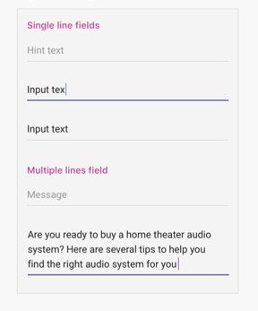

# Onglets sur les appareils mobilesTabs on mobile

> [!NOTE]
> Si vous choisissez que votre onglet canal/groupe apparaisse sur les clients mobiles Teams, la configuration doit avoir une valeur pour la propriété `setSettings()` `websiteUrl` (voir ci-dessous).If you choose to have your channel/group tab appear on Teams mobile clients, the `setSettings()` configuration must have a value for the `websiteUrl` property (see below).

Les onglets personnalisés peuvent faire partie d’un canal, d’une conversation de groupe ou d’une application personnelle (applications qui contiennent des onglets statiques et/ou un bot un-à-un).Custom tabs can be part of a channel, group chat, or personal app (apps that contain static tabs and/or a one-to-one bot).

Les applications personnelles sont disponibles sur les clients mobiles dans le caisse de l’application.Personal apps are available on mobile clients in the app drawer. L’application ne peut être installée qu’à partir d’un ordinateur de bureau ou d’un client web et son apparition sur les clients mobiles peut prendre jusqu’à 24 heures.The app can only be installed from a desktop or web client, and can take up to 24 hours to appear on mobile clients.

Les onglets de canal sont également disponibles sur les appareils mobiles.Channel tabs are also available on mobile. Le comportement par défaut consiste actuellement à utiliser votre `websiteUrl` onglet pour lancer votre onglet dans une fenêtre de navigateur.The default behavior is currently to use your `websiteUrl` to launch your tab in a browser window. Toutefois, ils peuvent être chargés sur un client mobile en cliquant sur le menu de dépassement en haut de l’onglet et en choisissant Ouvrir, qui vous permet de charger l’onglet à l’intérieur du `...` client mobile  `contentUrl` Teams.However, they can be loaded on a mobile client by clicking the `...` overflow menu next to the tab and choosing **Open**, which will use your `contentUrl` to load the tab inside the Teams mobile client.

## Accès aux onglets personnelsAccessing personal tabs

L’illustration suivante montre comment accéder à un onglet personnel sur un appareil mobile.The following illustration shows how you access a personal tab on mobile.

:::image type="content" source="../../assets/images/tabs/mobile-app-drawer.png" alt-text="Illustration montrant le caisse de l’application mobile Teams." border="false":::

## Accès aux onglets de canalAccessing channel tabs

L’illustration suivante montre comment accéder à un onglet de canal sur mobile.The following illustration shows how you access a channel tab on mobile.

:::image type="content" source="../../assets/images/tabs/mobile-tab.png" alt-text="Illustration montrant un onglet mobile Teams." border="false":::

## Considérations relatives à la conceptionDesign considerations

Notre plateforme mobile permet aux applications d’être une expérience immersive avec le contenu de l’application prenant tout l’écran en dehors de la navigation Teams principale.Our mobile platform allows apps to be an immersive experience with the app content taking up all of the screen apart from main Teams navigation. Pour créer une expérience immersive adaptée à Teams, suivez ces instructions.To create an immersive experience that fits with Teams, follow these guidelines.

### Conception réactiveResponsive design

Étant donné que votre onglet peut être ouvert sur des appareils avec un large éventail de tailles d’écran, il doit respecter les principes de [conception](https://www.w3schools.com/html/html_responsive.asp) réactifs.Because your tab can be opened on devices with a wide range of screen sizes, it needs to follow [responsive design](https://www.w3schools.com/html/html_responsive.asp) principles. Toutes les constructions clés doivent être accessibles sur les appareils mobiles et les vues ne doivent pas être déformées.All of the key constructs should be accessible on mobile devices, and the views should not be distorted. Assurez-vous que lorsque votre onglet est chargé sur un appareil mobile, tous les boutons et liens sont facilement accessibles à l’aide de la navigation avec les doigts.Ensure that when your tab is loaded on a mobile device, all buttons and links are easily accessible using finger-based navigation.

### DispositionsLayouts

Il est important de choisir la disposition correcte pour votre onglet.Choosing the correct layout for your tab is important. Vous devez prendre en compte le type d’informations que vous présentez et choisir une disposition qui les organise pour faciliter la consommation.You should consider the kind of information you're presenting, and choose a layout that organizes it for easy consumption. Certaines options potentielles sont décrites ci-dessous.Some potential options are outlined below.

#### Canevas uniqueSingle canvas

Il s’agit d’un domaine important dans lequel le travail est effectué.This is one large area where work gets done. L’application Wiki Teams suit ce modèle.The Teams Wiki app follows this pattern. Si vous avez une application qui ne sépare pas le contenu en composants plus petits, cela serait adapté.If you have an app that doesn’t separate content into smaller components this would be a good fit.

:::image type="content" source="../../assets/images/tabs/mobile-tab-single-canvas.png" alt-text="Illustration montrant un onglet de canevas mobile Teams." border="false":::

#### RépertorierList

Les listes sont excellentes pour le tri et le filtrage de grandes quantités de données et sont très bonnes pour conserver les éléments les plus importants en haut.Lists are great for sorting and filtering large quantities of data and are great at keeping the most important things at the top. Il est utile d’utiliser des colonnes triables.It is helpful to use sortable columns. Les actions peuvent être ajoutées à chaque élément de liste sous le menu des ellipses.Actions can be added to each list item under the ellipsis menu.

:::image type="content" source="../../assets/images/tabs/mobile-tab-list.png" alt-text="Illustration montrant un onglet de liste mobile Teams." border="false":::

#### GridGrid

Les grilles sont utiles pour l’affichage d’éléments hautement visuels.Grids are useful for showing elements which are highly visual. Il est utile d’inclure un contrôle de filtre ou de recherche en haut.It helps to include a filter or search control at the top.

:::image type="content" source="../../assets/images/tabs/mobile-tab-grid.png" alt-text="Illustration montrant un onglet mobile Teams avec une disposition de grille." border="false":::

### Onglets avec bots sur mobileTabs with bots on mobile

L’exemple suivant est une application personnelle qui possède des onglets et un bot.The following example is a personal app that has tabs and a bot.

:::image type="content" source="../../assets/images/tabs/mobile-tab-with-bot.png" alt-text="Illustration montrant comment une application Teams mobile avec des onglets et un bot." border="false":::

## Composants de l’interface utilisateurUI components

### Palettes de couleursColor palettes

L’utilisation de notre palette neutre approuvée pour les arrière-plans, les notifications, le texte et les boutons permettra à votre application de se sentir plus à l’accueil dans Teams.Using our approved neutral palette for backgrounds, notifications, text, and buttons will help your app feel more at home in Teams. Étant donné que Teams mobile a deux thèmes à thèmes (clair et foncé), il est bon de s’assurer que votre application s’annonce bien dans les deux cas.Since Teams mobile has two colour themes (light and dark), it’s a good idea to make sure your app looks great in both.

#### Couleur claireLight color

#### Couleur foncéeDark color

### Boutons et contrôlesButtons and controls

Le style des boutons permet de communiquer le type d’action qu’ils déclenchent.The way buttons are styled helps communicate what kind of action they trigger. Nous tenez à jour un large éventail de boutons mis en forme pour afficher différents niveaux d’accentuation.We maintain a wide range of buttons that are formatted to show different levels of emphasis. Les boutons peuvent avoir du texte, une icône ou une combinaison de texte et d’icône.Buttons can have text, an icon, or a combination of text and an icon. Pour communiquer différents niveaux dans une hiérarchie, nous avons conçu des boutons principaux et secondaires dans chaque catégorie.To communicate different levels in a hierarchy, we designed primary and secondary buttons within each category.

#### BoutonsButtons

Boutons principal et secondaire.Primary and secondary buttons.

#### Contrôles de sélectionSelection controls

Boutons d’radio, case à cocher et boutons bascule.Radio buttons, checkboxes, and toggles.

#### Îles et err.Chiclets and pills

### TypographieTypography

La typographie doit être claire et précise.Typography should be clear and purposeful. Mettre en avant des informations importantes et éviter d’utiliser plusieurs polices et tailles pour réduire la confusion.Emphasize important information and avoid using multiple fonts and sizes to reduce confusion. Nous vous recommandons d’utiliser un cas de phrase et d’éviter l’utilisation de toutes les limites pour la localisation et la lisibilité.We recommend using sentence case and avoiding the usage of all caps for localization and legibility.

### Champs et volantsFields and flyouts

Les champs sont des zones où les utilisateurs peuvent entrer du texte.Fields are areas where users can input text. Les volants sont plus légers que les boîtes de dialogue et apparaissent dans le volet supérieur.Flyouts are more lightweight than dialogs and appear from the top pane.

#### Répertorier les contrôlesList controls

#### contrôles de champsField controls

## Considérations sur les développeursDeveloper considerations

Lorsque vous construisez une application qui inclut un onglet, vous devez prendre en compte (et tester) le fonctionnement de votre onglet sur les clients Microsoft Teams Android et iOS.When you're building an app that includes a tab, you need to consider (and test) how your tab will function on both the Android and iOS Microsoft Teams clients. Les sections ci-dessous décrivent certains des scénarios clés que vous devez prendre en considération.The sections below outline some of the key scenarios you need to consider.

### Test sur les clients mobilesTesting on mobile clients

Vous devez vérifier que votre onglet fonctionne correctement sur des appareils mobiles de différentes tailles et qualités.You need to validate that your tab functions properly on mobile devices of various sizes and qualities. Pour les appareils Android, vous pouvez utiliser [DevTools](~/tabs/how-to/developer-tools.md) pour déboguer votre onglet pendant son exécution.For Android devices, you can use the [DevTools](~/tabs/how-to/developer-tools.md) to debug your tab while it is running. Nous vous recommandons de tester les appareils à haut et faible niveau de performance, ainsi que sur une tablette.We recommend that you test on both high and low performing devices, as well as on a tablet.

### AuthentificationAuthentication

Pour que l’authentification fonctionne sur les clients mobiles, vous devez mettre à niveau le SDK JavaScript teams vers la version 1.4.1 au minimum.For authentication to work on mobile clients, you must upgrade you Teams JavaScript SDK to at least version 1.4.1.

### Bande passante faible et connexions intermittentesLow bandwidth and intermittent connections

Les clients mobiles doivent régulièrement fonctionner avec une bande passante faible et des connexions intermittentes.Mobile clients regularly need to function with low bandwidth and intermittent connections. Votre application doit gérer les délai d’accès de manière appropriée en fournissant un message contextuel à l’utilisateur.Your app should handle any timeouts appropriately by providing a contextual message to the user. Vous devez également fournir des indicateurs de progression des utilisateurs pour fournir des commentaires à vos utilisateurs pour tout processus de longue durée.You should also user progress indicators to provide feedback to your users for any long-running processes.
