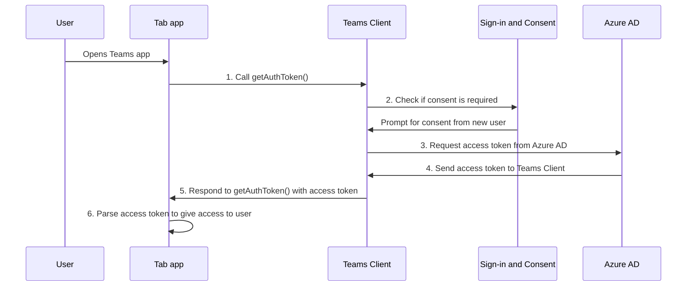

# Activer l’authentification unique (SSO) pour l’application d’onglet

<!--Single sign-on (SSO) allows a user to access an application or a web service after signing-in only once. The app users never have to go through authentication again.-->

Avec l’authentification unique dans Teams, les utilisateurs d’applications ont l’avantage d’utiliser Teams pour accéder aux applications. Une fois connectés à Teams à l’aide d’un compte Microsoft ou Microsoft 365, les utilisateurs de l’application peuvent utiliser votre application sans avoir à se reconnecter. Votre application est disponible pour les utilisateurs de l’application sur n’importe quel appareil disposant d’un accès accordé via Azure AD.

Voici ce que vous allez apprendre dans cette section :

1. **Expérience utilisateur de l’authentification** unique : Teams offre à vos utilisateurs d’application une véritable expérience d’authentification unique. Les utilisateurs de l’application peuvent utiliser votre application sans se reconnecter.
2. **Authentification unique dans Teams au moment de l’exécution** : votre application onglet interagit avec Azure AD au moment de l’exécution pour l’authentification et l’autorisation uniques pour les utilisateurs de votre application.
3. **Activer l’authentification unique pour votre application onglet** : implémentez les tâches impliquées pour implémenter l’authentification unique dans votre application onglet.

## Expérience utilisateur de l’authentification unique dans Teams

Les utilisateurs de l’application se connectent à Teams à l’aide d’un compte Microsoft personnel ou d’un compte Microsoft 365. Vous pouvez en tirer parti et utiliser l’authentification unique pour authentifier et autoriser les utilisateurs de l’application.

&nbsp;&nbsp;&nbsp;&nbsp;:::image type="content" source="../../../assets/images/authentication/teams-sso-tabs/teams-sso-ux.png" alt-text="Expérience utilisateur de l’authentification unique dans une application onglet Teams":::

- Teams authentifie et stocke l’identité de son utilisateur d’application.
- Votre application onglet utilise l’identité stockée de l’utilisateur de l’application qui est déjà validé par Teams.
- L’utilisateur de l’application doit donner son consentement à Teams pour l’utilisation de l’identité à accéder pour l’utilisation de votre application onglet.
- L’utilisateur de l’application peut accéder à l’application sur le web, le bureau ou le client mobile.

Vous pouvez voir ici un exemple d’expérience utilisateur avec l’authentification unique dans une application onglet :

:::image type="content" source="../../../assets/images/authentication/teams-sso-tabs/sso-tab.gif" alt-text="Authentification unique dans l’application onglet":::

### Améliorer l’expérience utilisateur avec l’authentification unique

Voici ce que les utilisateurs de votre application obtiennent avec l’expérience d’authentification unique :

- Teams obtient le jeton d’accès de l’utilisateur actuel de l’application à partir d’Azure AD. Cette interaction avec Azure AD est invisible pour l’utilisateur de l’application. Cela se traduit par l’obtention de l’accès aux applications sans avoir à quitter l’environnement Teams.
- Un utilisateur d’application doit donner son consentement uniquement dans un environnement multilocataire. Si l’utilisateur de l’application et l’application résident dans le même locataire, l’utilisateur de l’application n’a pas besoin de donner son consentement pour l’utilisation de l’application.
- Après avoir donné son consentement à Teams pour la première fois, l’utilisateur de l’application peut utiliser votre application sans autre consentement, même sur n’importe quel autre appareil. Pour cette raison, il offre une meilleure expérience utilisateur.
  - L’administrateur client peut également donner son consentement pour le compte des utilisateurs de l’application. Dans ce scénario, lorsque l’administrateur du locataire donne son consentement pour les utilisateurs d’application dans le locataire, les utilisateurs de l’application n’ont pas besoin d’être invités à donner leur consentement. Cela signifie que les utilisateurs de l’application ne voient pas les dialogues de consentement et peuvent accéder à l’application en toute transparence.
- Le jeton d’accès est pré-extrait par Teams pour améliorer les performances et le temps de chargement de l’application dans l’environnement Teams.
- Les utilisateurs d’applications n’ont pas besoin de mémoriser ou d’enregistrer plusieurs mots de passe pour accéder aux applications et les utiliser dans l’environnement Teams.

> [!NOTE]
> Les utilisateurs de l’application ne peuvent pas accorder l’autorisation à certaines étendues d’autorisation, telles que `Sites.ReadWrite.All`, ce qui permet à l’utilisateur de l’application de lire et d’écrire dans toutes les ressources SharePoint et OneDrive dans le locataire. Pour de telles étendues, seul l’administrateur client doit accorder le consentement au nom d’un utilisateur d’application.

Voyons maintenant ce qui se passe sur le serveur principal pendant l’exécution pour obtenir une expérience d’authentification unique dans Teams.

## Authentification unique dans Teams au moment de l’exécution

Obtenez l’authentification unique dans une application onglet en obtenant un jeton d’accès pour l’utilisateur de l’application Teams actuellement connecté. Ce processus implique le client et le serveur de l’application onglet, le client Teams et Azure AD. Pendant cette interaction, l’utilisateur de l’application doit donner son consentement pour utiliser l’identité Teams afin d’obtenir le jeton d’accès dans un environnement multilocataire.

L’image suivante montre le fonctionnement de l’authentification unique lorsqu’un utilisateur d’application Teams tente d’accéder à l’application onglet :

:::image type="content" source="../../../assets/images/authentication/teams-sso-tabs/sso-runtime-seqd.png" alt-text="Diagramme de l’authentification unique Tab" lightbox="../../../assets/images/authentication/teams-sso-tabs/sso-runtime-seqd.png":::

| # | Interaction | Que se passe-t-il |
| --- | --- | --- |
| 1 | Application onglet → client Teams | L’application d’onglet effectue un appel JavaScript à `getAuthToken()`, qui indique à Teams d’obtenir un jeton d’accès. |
| 2 | Teams Client → Azure AD | Teams demande le point de terminaison Azure AD pour le jeton d’accès de l’utilisateur actuel de l’application en fonction de l’identité Teams. |
| 3 | Formulaire de consentement → Azure AD | Si l’utilisateur actuel de l’application utilise votre application onglet pour la première fois, Teams affiche l’invite de demande de consentement, si l’application doit accéder à certaines données protégées. L’utilisateur de l’application (ou l’administrateur) doit donner son consentement à Teams pour utiliser l’identité Teams de l’utilisateur de l’application pour obtenir un jeton d’accès auprès d’Azure AD.   Alternativement, il existe une invite de demande pour gérer l'authentification renforcée telle que l'authentification à deux facteurs. |
| 4 | Azure AD → Teams Client | Azure AD envoie le jeton d’accès au client Teams. Le jeton est un jeton web JSON (JWT) et sa validation fonctionne comme la validation de jeton dans la plupart des flux OAuth standard. Teams met en cache le jeton en votre nom afin que les appels futurs retournent `getAuthToken()` le jeton mis en cache. |
| 5 | Client Teams → client d’application Tab | Teams envoie le jeton d’accès à l’application onglet dans le cadre de l’objet de résultat retourné par l’appel `getAuthToken()` . |
| 6  | Application Tab (entre client & serveur) | L’application onglet analyse le jeton d’accès à l’aide de JavaScript pour extraire les informations requises, telles que l’adresse e-mail de l’utilisateur de l’application. Le jeton retourné à l’application onglet est à la fois un jeton d’accès et un jeton d’identité. |

Pour plus d’informations, consultez [Mettre à jour le code pour activer l’authentification unique](tab-sso-code.md).

> [!IMPORTANT]
> La `getAuthToken()` valeur est valide uniquement pour le consentement à un ensemble limité d’API au niveau de l’utilisateur, telles que l’e-mail, le profil, offline_access et OpenId. Il n’est pas utilisé pour d’autres étendues Graph telles que `User.Read` ou `Mail.Read`. Pour obtenir des solutions de contournement suggérées, consultez [Étendre votre application avec des autorisations Microsoft Graph](tab-sso-graph-api.md).

Les onglets sont des pages web qui prennent en compte Teams. Pour activer l’authentification unique dans une page web hébergée à l’intérieur d’une application onglet, ajoutez le [Kit de développement logiciel (SDK) client Javascript Teams](/javascript/api/overview/msteams-client?view=msteams-client-js-latest&preserve-view=true), puis appelez `microsoftTeams.initialize()`. Après l’initialisation, appelez `microsoftTeams.getAuthToken()` pour obtenir le jeton d’accès de votre application.

### Cas d’utilisation pour l’activation de l’authentification unique

Vous pouvez activer l’authentification unique dans Teams pour toutes les applications qui prennent en charge Azure AD en tant que fournisseur d’identité. En plus d’utiliser l’authentification unique pour authentifier les utilisateurs d’application dans une application onglet, vous pouvez également l’utiliser pour activer un accès transparent dans Teams.

Voici quelques scénarios dans lesquels vous pouvez utiliser l’API d’authentification unique pour authentifier les utilisateurs de votre application :

- Si vous souhaitez authentifier les utilisateurs de votre application dans une application onglet Teams, l’API SSO permet aux utilisateurs de l’application d’utiliser votre application dans Teams sans authentification supplémentaire nécessaire. En fonction de l’identité Teams de l’utilisateur de l’application, vous pouvez obtenir un jeton d’accès pour lui auprès d’Azure AD.
- Si votre application utilise un module de tâches à partir d’un bot, d’un onglet, d’une extension de message ou de cartes adaptatives, vous pouvez utiliser l’API SSO pour authentifier les utilisateurs de votre application.
- Vous pouvez également utiliser l’API SSO pour authentifier les utilisateurs de votre application qui souhaitent accéder à la vue Étape sans avoir à être à nouveau validés.

> [!TIP]
> Vous pouvez également utiliser l’API SSO pour authentifier les utilisateurs d’applications dans [des modules de tâches](../../../task-modules-and-cards/what-are-task-modules.md) qui incorporent du contenu web.

Pour obtenir l’authentification unique au moment de l’exécution, configurez votre application pour activer l’authentification unique pour authentifier et autoriser les utilisateurs de l’application.

## Activer l’authentification unique pour une application onglet

Cette section décrit les tâches impliquées dans l’implémentation de l’authentification unique pour une application onglet. Ces tâches sont indépendantes du langage et du framework.

Pour activer l’authentification unique pour une application onglet :

&nbsp;&nbsp;&nbsp;&nbsp;&nbsp;:::image type="content" source="../../../assets/images/authentication/teams-sso-tabs/enable-sso.png" alt-text="Étapes pour activer l’authentification unique pour l’onglet" lightbox="../../../assets/images/authentication/teams-sso-tabs/enable-sso.png":::

1. **S’inscrire auprès d’Azure AD** : créez une application Azure AD pour générer un ID d’application et un URI d’ID d’application. Pour générer un jeton d’accès, vous configurez des étendues et autorisez les applications clientes approuvées.
2. **Mettre à jour le code** : ajoutez le code pour gérer le jeton d’accès, en appelant `getAuthToken()` lorsqu’un utilisateur d’application accède à votre application onglet, en envoyant ce jeton au code serveur de votre application dans l’en-tête d’autorisation et en validant le jeton d’accès lorsqu’il est reçu.
3. **Mettre à jour le manifeste de l’application Teams** : mettez à jour votre manifeste d’application cliente Teams avec l’ID d’application et l’URI d’ID d’application générés sur Azure AD pour permettre à Teams de demander des jetons d’accès pour le compte de votre application.

## Cookies tiers sur iOS

Après la mise à jour d’iOS 14, Apple a bloqué par défaut l’accès tiers aux [cookies](https://webkit.org/blog/10218/full-third-party-cookie-blocking-and-more/) pour toutes les applications. Par conséquent, les applications qui tirent parti des cookies tiers pour l’authentification dans leurs onglets Canal ou Conversation et applications personnelles ne pourront pas terminer leurs workflows d’authentification sur les clients iOS Teams. Pour vous conformer aux exigences de confidentialité et de sécurité, vous devez passer à un système basé sur des jetons ou utiliser des cookies internes pour les flux de travail d’authentification utilisateur.

### Prise en charge des clients mobiles Teams

Pour Teams Mobile, les versions client qui prennent en charge l’authentification unique sont les suivantes :

- Teams pour Android (1416/1.0.0.2020073101 et versions ultérieures)
- Teams pour iOS (version : 2.0.18 et versions ultérieures)  
- Kit de développement logiciel (SDK) JavaScript Teams (version 1.11 et ultérieure) pour que l’authentification unique fonctionne dans le panneau côté réunion

Pour une expérience optimale avec Teams, utilisez la dernière version d'iOS et d'Android.

## Meilleures pratiques

Voici une liste des meilleures pratiques :

- **Appelez le jeton d’accès uniquement lorsque vous en avez besoin** : Appelez `getAuthToken()` uniquement lorsque vous avez besoin d’un jeton d’accès. Vous pouvez l’appeler lorsqu’un utilisateur d’application accède à votre application onglet ou pour utiliser une fonction particulière qui nécessite la validation de l’utilisateur de l’application.
- **Ne stockez pas le jeton d’accès sur le code côté client** : ne mettez pas en cache ou ne stockez pas le jeton d’accès dans le code côté client de votre application. Le client Teams met en cache le jeton d’accès (ou en demande un nouveau s’il expire). Cela garantit qu’il n’y a pas de fuite accidentelle de votre jeton à partir de votre application web.
- **Utilisez du code côté serveur pour les appels Microsoft Graph** : utilisez toujours le code côté serveur pour effectuer des appels Microsoft Graph ou d’autres appels qui nécessitent la transmission d’un jeton d’accès. Ne renvoyez jamais le jeton OBO au client pour permettre au client d’effectuer des appels directs vers Microsoft Graph. Cela aide à protéger le jeton contre l’interception ou la fuite. Pour plus d’informations, consultez [Étendre l’application onglet avec des autorisations et une étendue Microsoft Graph](tab-sso-graph-api.md).

## Limitations connues

- Actuellement, l’authentification unique dans Teams prend en charge uniquement le jeton OAuth 2.0. Il ne prend pas en charge le jeton SAML.
- Plusieurs domaines par application ne sont pas pris en charge. Pour plus d’informations, consultez [les applications métier](tab-sso-register-aad.md#before-you-register-with-azure-ad).

## Étape suivante

> [!div class="nextstepaction"]
> [Inscrire votre application onglet dans Azure AD](tab-sso-register-aad.md)

## Voir aussi

[Configurer le code pour activer l’authentification unique dans une application onglet](tab-sso-code.md)

<!--
### Use cases for enabling SSO for tab app

Here are some use cases where enabling SSO is beneficial. Call `getAuthToken()` in these scenarios to use Teams identity for obtaining access token for your app users:

- To get an app user’s identity from Teams if you have an existing app that you want to be available within a tab app in Teams.

- To authenticate an app user by reusing the Team’s identity inside your tab app.

- To authenticate and get an app user’s Teams identity inside configurable tabs. The app users don't need to sign in again. It's applicable to some settings that need to be configured at a configuration stage.

- To obtain an access token inside a task module, when it's invoked from a tab app, a bot app, a messaging extension app, or adaptive cards.

- To authenticate an app user in Stage view.

- To authenticate users for [task modules](../../../task-modules-and-cards/what-are-task-modules.md) that embed web content.
-->

<!--

-->

<!--
- Tenant admin consent: A simple way of [consenting on behalf of an organization as a tenant admin](/azure/active-directory/develop/v2-permissions-and-consent.md#requesting-consent-for-an-entire-tenant) is by getting [consent from admin](/azure/active-directory/manage-apps/grant-admin-consent).
  
    You can ask for consent using the Auth API. Another approach for getting Graph scopes is to present a consent dialog using our existing [third party OAuth provider authentication approach](~/tabs/how-to/authentication/auth-tab-aad.md#navigate-to-the-authorization-page-from-your-pop-up-page). This approach involves popping up an Azure AD consent dialog box.

  

  
To ask for additional consent using the Auth API, follow these steps:

    1. The token retrieved using `getAuthToken()` must be exchanged on the server-side using Azure AD [on-behalf-of flow (OBO)](/azure/active-directory/develop/v2-oauth2-on-behalf-of-flow) to get access to those other Graph APIs. Ensure you use the v2 Graph endpoint for this exchange.
    2. If the exchange fails, Azure AD returns an invalid grant exception. It usually responds with one of the two error messages, `invalid_grant` or `interaction_required`.
    3. When the exchange fails, you must ask for consent. Use the user interface (UI) to ask the app user to grant other consent. This UI must include a button that triggers an Azure AD consent dialog using [Silent authentication](~/concepts/authentication/auth-silent-aad.md).
    4. When asking for more consent from Azure AD, you must include `prompt=consent` in your [query-string-parameter](~/tabs/how-to/authentication/auth-silent-aad.md#get-the-user-context) to Azure AD, otherwise Azure AD wouldn't ask for other scopes.

        - Instead of `?scope={scopes}`, use `?prompt=consent&scope={scopes}`
        - Ensure that `{scopes}` includes all the scopes you're prompting the user for, for example, `Mail.Read` or `User.Read`.
    5. After the app user has granted more permissions, retry the OBO flow to get access to these other APIs.

    

-->
<!--
- If you want your existing app to be available within a Teams tab app, the SSO API allows your signed-in app users to use your app in Teams with no additional authentication needed. Based on the app user's Teams identity, you can obtain access token for them from Azure AD.
- If your app has configurable tabs, you can use `getAuthToken()` to allow app users into the tab app without signing in again. SSO is applicable to some settings that need to be configured at a configuration stage.
- Your app may have a bot, a tab, a message extension, or Adaptive Cards, and allows your app users to invoke task module from within a tab or a bot. The SSO API will authenticate your app users who attempt to access the task module. Teams can use the app user's Teams identity and obtain an access token from Azure AD.

- You can also use the SSO API for authenticating your app users who want to access to Stage view without need to be validated again. The access token obtained for the app user when they first used your app can be used to allow them to use Stage view. -->
