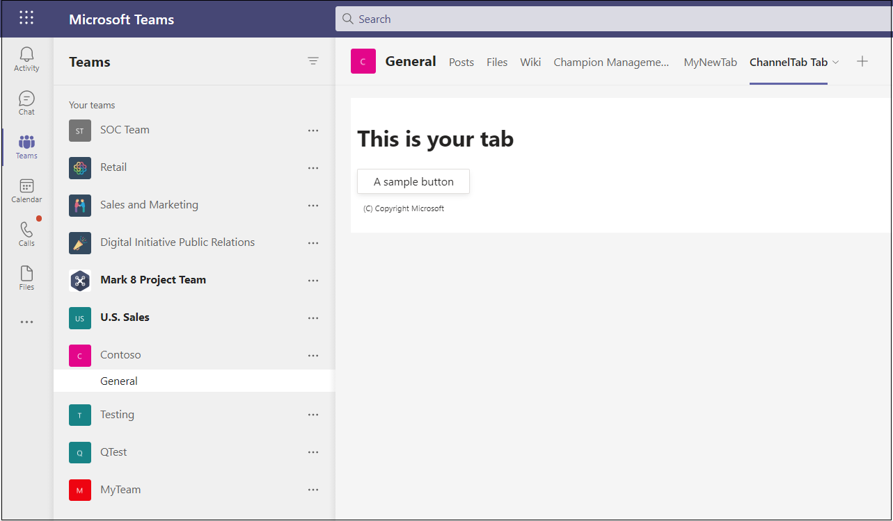

# <a name="create-a-channel-or-group-tab"></a>Créer un onglet de canal ou de groupe

## <a name="create-a-custom-channel-or-group-tab"></a>Créer un onglet de canal ou de groupe personnalisé

Vous pouvez créer un onglet de canal ou de groupe à l'Node.js et le générateur Yeoman, ASP. NETCore ou ASP. NETCore MVC. Pour un onglet de canal ou de groupe Microsoft Teams mobile, consultez [les onglets sur mobile](~/tabs/design/tabs-mobile.md).

# <a name="nodejs"></a>[Node.js](#tab/nodejs)

### <a name="create-a-custom-channel-and-group-tab-using-nodejs-and-the-yeoman-generator"></a>Créer un canal et un onglet de groupe personnalisés à l’aide Node.js et du générateur Yeoman

> [!NOTE]
> Cet article suit les étapes décrites dans la build Your [first Microsoft Teams app](https://github.com/OfficeDev/generator-teams/wiki/Build-Your-First-Microsoft-Teams-App) Wiki found in the Microsoft OfficeDev GitHub repository.

Vous pouvez créer un onglet de canal ou de groupe personnalisé à l’aide [Teams générateur Yeoman](https://github.com/OfficeDev/generator-teams/).

### <a name="prerequisites-for-apps"></a>Conditions préalables pour les applications

Vous devez connaître les conditions préalables suivantes :

* Vous devez avoir un client Office 365 et une équipe configurée avec l’application Autoriser le téléchargement **d’applications** personnalisées activée. Pour plus d’informations, [voir préparer votre Office 365 client](~/concepts/build-and-test/prepare-your-o365-tenant.md).

    > [!NOTE]
    > Si vous n’avez pas de compte Office 365, vous pouvez vous inscrire à un abonnement gratuit via le programme Office 365 développeur. L’abonnement reste actif tant que vous l’utilisez pour le développement continu. Bienvenue [dans le programme Office 365 développeur.](/office/developer-program/microsoft-365-developer-program)

En outre, ce projet nécessite que les logiciels suivants sont installés dans votre environnement de développement :

* N’importe quel éditeur de texte ou IDE. Vous pouvez installer et utiliser [Microsoft Visual Studio Code](https://code.visualstudio.com/download) gratuit.

* [Node.js/npm](https://nodejs.org/en/). Utilisez la dernière version de LTS. Le nœud Gestionnaire de package (npm) s’installe dans votre système avec l’installation de Node.js.

* Une fois que vous avez installé Node.js, installez les packages [Yeoman](https://yeoman.io/) et [gulp-cli](https://www.npmjs.com/package/gulp-cli) en entrant les commandes suivantes dans votre invite de commandes :

    ```bash
    npm install yo gulp-cli --global
    ```

* Installez le générateur Microsoft Teams Apps en entrant les commandes suivantes dans votre invite de commandes :

    ```bash
    npm install generator-teams --global
    ```

### <a name="generate-your-project"></a>Générer votre projet

**Pour générer votre projet**

1. À l’invite de commandes, créez un répertoire pour votre projet d’onglet.

1. Pour démarrer le générateur, allez dans votre nouveau répertoire et tapez la commande suivante :

    ```bash
    yo teams
    ```

1. Ensuite, fournissez une série de valeurs utilisées dans le fichier **manifest.json de votre** application :

    

    **Quel est le nom de votre solution ?**

    Il s’agit du nom de votre projet. Vous pouvez accepter le nom suggéré en sélectionnant la **touche** Entrée.

    **Où souhaitez-vous placer les fichiers ?**

    Vous êtes actuellement dans votre répertoire de projet. **Sélectionnez Entrée**.

    **Titre de votre Microsoft Teams d’application ?**

    Il s’agit du nom de votre package d’application qui sera utilisé dans le manifeste et la description de l’application. Entrez un titre ou **sélectionnez Entrée** pour accepter le nom par défaut.

    **Votre nom (d’entreprise) ? (32 caractères maximum)**

    Le nom de votre société sera utilisé dans le manifeste de l’application. Entrez un nom de société ou **sélectionnez Entrée** pour accepter le nom par défaut.

    **Quelle version de manifeste souhaitez-vous utiliser ?**

    Sélectionnez le schéma par défaut.

    **La échafaudage rapide ? (Y/n)**

    La valeur par défaut est Oui ; entrez **n** pour entrer votre ID partenaire Microsoft.

    **Entrez votre ID partenaire Microsoft, si vous en avez un ? (Laissez vide pour ignorer)**

    Ce champ n’est pas obligatoire et ne doit être utilisé que si vous faites déjà partie de [Microsoft Partner Network](https://partner.microsoft.com).

    **Que voulez-vous ajouter à votre projet ?**

    **Sélectionnez ( &ast; ) Un onglet**.

    **L’URL dans laquelle vous hébergez cette solution ?**

    Par défaut, le générateur suggère une URL de sites web Azure. Vous testez uniquement votre application localement, par conséquent, une URL valide n’est pas nécessaire.

    **Voulez-vous afficher un indicateur de chargement lors du chargement de votre application/onglet ?**

    Choisissez **de ne** pas inclure d’indicateur de chargement lors du chargement de votre application ou de votre onglet. La valeur par défaut est non, entrez **n**.

   **Voulez-vous que les applications personnelles soient restituées sans barre d’en-tête d’onglet ?**

    Choisissez **de** ne pas inclure d’applications personnelles à restituer sans barre d’en-tête d’onglet. La valeur par défaut est non, entrez **n**.

    **Souhaitez-vous inclure l’infrastructure test et les tests initiaux ? (y/N)**

    Choisissez **de ne** pas inclure d’infrastructure de test pour ce projet. La valeur par défaut est Oui ; entrez **n**.

    **Voulez-vous utiliser Azure Applications Informations pour la télémétrie ? (y/N)**

    Choisissez **de ne** pas inclure [azure application Informations](/azure/azure-monitor/app/app-insights-overview). La valeur par défaut est non ; entrez **n**.

    **Nom de l’onglet par défaut (16 caractères maximum) ?**

    Nommez votre onglet. Ce nom d’onglet sera utilisé dans l’ensemble de votre projet en tant que composant de chemin d’URL ou de fichier.

    **Quel type d’onglet voulez-vous créer ?**

    Utilisez les touches de direction pour sélectionner **l’onglet Configurable** .

    **Quelles étendues avez-vous l’intention d’utiliser pour votre onglet ?**

    Vous pouvez sélectionner une équipe ou une conversation de groupe.

    **Avez-vous besoin Microsoft Azure Active Directory (Azure AD) prise en charge de l’sign-on unique pour l’onglet ?**

    Choisissez **de** ne pas inclure Microsoft Azure Active Directory (Azure AD) prise en charge de l’sign-on unique pour l’onglet. La valeur par défaut est oui, entrez **n**.

    **Voulez-vous que cet onglet soit disponible dans SharePoint Online ? (Y/n)**

    Entrez **n**.

    > [!IMPORTANT]
    > Le composant **de chemin d’accès yourDefaultTabNameTab** est la valeur que vous avez entrée dans le générateur pour le nom de l’onglet par **défaut, ainsi** que le mot **Tab**.
    >
    > Par exemple : DefaultTabName: **MyTab** > **/MyTabTab/**

1. Dans Visual Studio Code’éditeur de code ou n’importe quel éditeur de code, allez dans le répertoire de votre projet et ouvrez le fichier suivant :

    ```bash
    ./src/app/scripts/<yourDefaultTabNameTab>/<yourDefaultTabNameTab>.tsx
    ```

1. Recherchez la `render()` méthode et ajoutez la balise `<div>` et le contenu suivants en haut du `<PanelBody>` code de conteneur :

    ```html
        <PanelBody>
            <div style={styles.section}>
                Hello World! Yo Teams rocks!
            </div>
        </PanelBody>
    ```

1. Veillez à enregistrer le fichier mis à jour.

### <a name="build-and-run-your-application"></a>Créer et exécuter votre application

À l’invite de commandes, ouvrez le répertoire de votre projet pour effectuer les tâches suivantes.

#### <a name="create-the-app-package"></a>Créer le package d’application

Vous devez avoir un package d’application pour tester votre onglet dans Teams. Il s’agit d’un dossier zip qui contient les fichiers obligatoires suivants :

* Icône **en couleurs complètes** de 192 x 192 pixels.
* Icône **de plan transparente de** 32 x 32 pixels.
* Fichier **manifest.json** qui spécifie les attributs de votre application.

Le package est créé par le biais d’une tâche Gulp qui valide le fichier manifest.json et génère le dossier zip dans le répertoire **./package**. Dans l’invite de commandes, entrez la commande suivante :

```bash
gulp manifest
```

#### <a name="build-your-application"></a>Créer votre application

La commande de build transpile votre solution dans le **dossier ./dist** . Entrez la commande suivante dans l’invite de commandes :

```bash
gulp build
```

#### <a name="run-your-application-in-localhost"></a>Exécuter votre application dans localhost

1. Démarrez un serveur web local en entrant ce qui suit dans l’invite de commandes :

    ```bash
    gulp serve
    ```

1. Entrez `http://localhost:3007/<yourDefaultAppNameTab>/` dans votre navigateur, remplacez **yourDefaultAppNameTab** par votre nom d’onglet et affichez la page d’accueil de votre application comme illustré dans l’image suivante :

    

1. Pour afficher la page de configuration de votre onglet, allez sur `https://localhost:3007/<yourDefaultAppNameTab>/config.html`. Les exemples suivants sont présentés :

    

### <a name="establish-a-secure-tunnel-to-your-tab"></a>Établir un tunnel sécurisé vers votre onglet

Microsoft Teams est un produit basé sur le cloud et nécessite que le contenu de votre onglet soit disponible à partir du cloud à l’aide de points de terminaison HTTPS. Teams n’autorise pas l’hébergement local. Vous devez publier votre onglet sur une URL publique ou utiliser un proxy qui expose votre port local à une URL internet.

Pour tester votre extension d’onglet, [utilisez ngrok](https://ngrok.com/docs), qui est intégré à cette application. Ngrok est un outil logiciel de proxy inverse qui crée un tunnel vers les points de terminaison HTTPS disponibles publiquement de votre serveur web exécutant localement. Les points de terminaison web de votre serveur sont disponibles pendant la session en cours sur votre ordinateur. Lorsque l’ordinateur est arrêté ou mis en veille, le service n’est plus disponible.

Dans votre invite de commandes, quittez localhost et entrez les commandes suivantes :

```bash
gulp ngrok-serve
```

> [!IMPORTANT]
> Une fois que votre onglet a été téléchargé sur Microsoft Teams et enregistré, vous pouvez l’afficher dans la galerie d’onglets, l’ajouter à la barre d’onglets et interagir avec lui jusqu’à la fin de votre session tunnel ngrok. Si vous redémarrez votre session ngrok, vous devez mettre à jour votre application avec la nouvelle URL.

### <a name="upload-your-application-to-teams"></a>Télécharger votre application à Teams

**Pour télécharger votre application sur Teams**

1. Go to Microsoft Teams. Si vous utilisez la [version web](https://teams.microsoft.com) , vous pouvez inspecter votre code frontal à l’aide des outils de développement [de votre navigateur](~/tabs/how-to/developer-tools.md).
1. Dans vos équipes dans le volet gauche, sélectionnez les &#x25CF;&#x25CF;&#x25CF; en de côté de l’équipe que vous utilisez pour tester votre onglet et choisissez Gérer **l’équipe**.
1. Dans le volet principal, sélectionnez **Applications** dans la barre d’onglets et choisissez **Télécharger une** application personnalisée située dans le coin inférieur droit de la page.
1. Accédez au répertoire de votre projet, accédez au dossier **./package** , sélectionnez le dossier zip du package d’application, puis choisissez **Ouvrir**.

    

1. **Sélectionnez Ajouter** dans la boîte de dialogue. Votre onglet se charge dans Teams.
1. Revenir à votre équipe, choisir le canal dans lequel vous souhaitez afficher l’onglet, ➕ sélectionner dans la barre d’onglets et choisir votre onglet dans la galerie.
1. Suivez les instructions pour ajouter un onglet. Il existe une boîte de dialogue de configuration personnalisée pour votre canal ou onglet de groupe.
1. **Sélectionnez Enregistrer** et votre onglet est ajouté à la barre d’onglets du canal.

    

# <a name="aspnet-core"></a>[ASP.NET Core](#tab/aspnetcore)

### <a name="create-a-custom-channel-or-group-tab-with-aspnet-core"></a>Créer un onglet de canal ou de groupe personnalisé avec ASP.NET Core

Vous pouvez créer un onglet de canal ou de groupe personnalisé à l’C# et ASP.Net page Principale. [App Studio pour Microsoft Teams](~/concepts/build-and-test/app-studio-overview.md) est également utilisé pour finaliser le manifeste de votre application et déployer votre onglet sur Teams.

### <a name="prerequisites-for-teams-apps"></a>Conditions préalables pour Teams applications

Vous devez connaître les conditions préalables suivantes :

- Vous devez avoir un client Office 365 et une équipe configurée avec l’application Autoriser le téléchargement **d’applications** personnalisées activée. Pour plus d’informations, [voir préparer votre Office 365 client](~/concepts/build-and-test/prepare-your-o365-tenant.md).

    > [!NOTE]
    > Si vous n’avez pas de compte Microsoft 365, vous pouvez vous inscrire à un abonnement gratuit via le programme [pour les développeurs Microsoft](https://developer.microsoft.com/microsoft-365/dev-program). L’abonnement reste actif tant que vous l’utilisez pour le développement continu.

* Utilisez App Studio pour importer votre application dans Teams. Pour installer App Studio, sélectionnez **Apps**  dans le coin inférieur gauche de l’application Teams et **recherchez App Studio**. Une fois que vous avez trouvé la vignette, sélectionnez-la et choisissez **Ajouter dans la** boîte de dialogue pour l’installer.

En outre, ce projet nécessite que les logiciels suivants sont installés dans votre environnement de développement :

* Version actuelle de l’Visual Studio IDE avec la charge de travail de développement **.NET CORE sur** plusieurs plateformes installée. Si vous n’avez pas encore Visual Studio, vous pouvez télécharger et installer la dernière version [Microsoft Visual Studio Community](https://visualstudio.microsoft.com/downloads) gratuitement.

* Outil de proxy inverse [ngrok](https://ngrok.com) . Utilisez ngrok pour créer un tunnel vers les points de terminaison HTTPS disponibles publiquement de votre serveur web exécutant localement. Vous pouvez [télécharger ngrok](https://ngrok.com/download).

### <a name="get-the-source-code"></a>Obtenir le code source

À l’invite de commandes, créez un répertoire pour votre projet d’onglet. Un projet simple est fourni pour vous aider à démarrer. Clonez l’exemple de référentiel dans votre nouveau répertoire à l’aide de la commande suivante :

```bash
git clone https://github.com/OfficeDev/microsoft-teams-sample-tabs.git
```

Vous pouvez également récupérer le code source en téléchargeant le dossier zip et en extrayant les fichiers.

**Pour créer et exécuter le projet d’onglet**

1. Une fois que vous avez le code source, Visual Studio puis **sélectionnez Ouvrir un projet ou une solution**.
1. Go to the tab application directory and open **ChannelGroupTab.sln**.
1. Pour créer et exécuter votre application, appuyez sur **F5** ou choisissez **Démarrer le** débogage dans le menu **Débogage** .
1. Dans un navigateur, go to the following URLs and verify the application loaded properly:

    * `http://localhost:44355`
    * `http://localhost:44355/privacy`
    * `http://localhost:44355/tou`

### <a name="review-the-source-code"></a>Passer en revue le code source

#### <a name="startupcs"></a>Startup.cs

Ce projet a été créé à partir ASP.NET Core modèle vide application web 2.2 avec la case à cocher Avancé * Configurer pour **HTTPS** sélectionnée lors de l’installation. Les services MVC sont enregistrés par la méthode de l’infrastructure d’injection de dépendances `ConfigureServices()` . En outre, le modèle vide n’active pas le traitement du contenu statique par défaut, `Configure()` de sorte que l’intermédiaire des fichiers statiques est ajouté à la méthode à l’aide du code suivant :

```csharp
public void ConfigureServices(IServiceCollection services)
  {
    services.AddMvc().SetCompatibilityVersion(CompatibilityVersion.Version_2_2);
  }
public void Configure(IApplicationBuilder app)
  {
    app.UseStaticFiles();
    app.UseMvc();
  }
```

#### <a name="wwwroot-folder"></a>dossier wwwroot

Dans ASP.NET Core, le dossier racine web est l’endroit où l’application recherche des fichiers statiques.

#### <a name="indexcshtml"></a>Index.cshtml

ASP.NET Core fichiers appelés **Index** comme page d’accueil ou par défaut du site. Lorsque l’URL de votre navigateur pointe vers la racine du site, **Index.cshtml** s’affiche en tant que page d’accueil de votre application.

#### <a name="tabcs"></a>Tab.cs

Ce C# contient une méthode qui est appelée à partir de **Tab.cshtml** lors de la configuration.

#### <a name="appmanifest-folder"></a>Dossier AppManifest

Ce dossier contient les fichiers de package d’application requis suivants :

* Icône **en couleurs complètes** de 192 x 192 pixels.
* Icône **de plan transparente de** 32 x 32 pixels.
* Fichier **manifest.json** qui spécifie les attributs de votre application.

Ces fichiers doivent être compressés dans un package d’application pour être utilisés lors du chargement de votre onglet vers Teams. Lorsqu’un utilisateur choisit d’ajouter ou de mettre à jour votre onglet, Microsoft Teams `configurationUrl` charge le contenu spécifié dans votre manifeste, l’incorpore dans un IFrame et l’restituer dans votre onglet.

#### <a name="csproj"></a>.csproj

Dans la Visual Studio’Explorateur de solutions, cliquez avec le bouton droit sur le projet et **sélectionnez Modifier Project fichier**. À la fin du fichier, vous voyez le code suivant qui crée et met à jour votre dossier zip lorsque l’application est créée :

```xml
<PropertyGroup>
    <PostBuildEvent>powershell.exe Compress-Archive -Path \"$(ProjectDir)AppManifest\*\" -DestinationPath \"$(TargetDir)tab.zip\" -Force</PostBuildEvent>
  </PropertyGroup>

  <ItemGroup>
    <EmbeddedResource Include="AppManifest\icon-outline.png">
      <CopyToOutputDirectory>Always</CopyToOutputDirectory>
    </EmbeddedResource>
    <EmbeddedResource Include="AppManifest\icon-color.png">
      <CopyToOutputDirectory>Always</CopyToOutputDirectory>
    </EmbeddedResource>
    <EmbeddedResource Include="AppManifest\manifest.json">
      <CopyToOutputDirectory>Always</CopyToOutputDirectory>
    </EmbeddedResource>
  </ItemGroup>
```

### <a name="establish-a-secure-tunnel-to-your-tab-for-teams"></a>Établir un tunnel sécurisé vers votre onglet pour Teams

Microsoft Teams est un produit basé sur le cloud et nécessite que le contenu de votre onglet soit disponible à partir du cloud à l’aide de points de terminaison HTTPS. Teams n’autorise pas l’hébergement local. Vous devez publier votre onglet sur une URL publique ou utiliser un proxy qui expose votre port local à une URL internet.

Pour tester votre onglet, utilisez [ngrok](https://ngrok.com/docs). Les points de terminaison web de votre serveur sont disponibles lorsque ngrok est en cours d’exécution sur votre ordinateur. Dans la version gratuite de ngrok, si vous fermez ngrok, les URL sont différentes lors du prochain démarrage.

* À l’invite de commandes à la racine du répertoire de votre projet, exécutez la commande suivante :

    ```bash
    ngrok http https://localhost:44355 -host-header="localhost:44355"
    ```

* Ngrok écoute les demandes provenant d’Internet et les approvisionnement vers votre application lorsqu’elle est en cours d’exécution sur le port 44355. Il doit ressembler à `https://y8rCgT2b.ngrok.io/` **l’endroit où y8rCgT2b** est remplacé par votre URL HTTPS alpha-numérique ngrok.

* Veillez à maintenir l’invite de commandes avec ngrok en cours d’exécution et notez l’URL.

### <a name="update-your-application"></a>Mettre à jour votre application

Dans **Tab.cshtml** , l’application présente à l’utilisateur deux boutons d’option pour afficher l’onglet avec une icône rouge ou grise. Le choix du **bouton Sélectionner**  `saveGray()` `saveRed()`gris ou Rouge déclenche ou, respectivement,  `settings.setValidityState(true)`définit et active le bouton Enregistrer sur la page de configuration. Ce code vous permet Teams que vous avez rempli les conditions requises pour la configuration et que l’installation peut se poursuivre. Les paramètres sont `settings.setSettings` définies. Enfin, `saveEvent.notifySuccess()` est appelée pour indiquer que l’URL de contenu a été correctement résolue.

#### <a name="_layoutcshtml"></a>_Layout.cshtml

Pour que votre onglet s’affiche Teams, vous devez inclure le **SDK** `microsoftTeams.initialize()` client JavaScript Microsoft Teams et inclure un appel après le chargement de votre page. Voici comment votre onglet et le client Teams communiquent :

Go to the **Shared** folder, open **_Layout.cshtml**, and add the following to the `<head>` tag:

```html
<script src="https://ajax.aspnetcdn.com/ajax/jQuery/jquery-3.4.1.min.js"></script>
<script src="https://statics.teams.cdn.office.net/sdk/v1.6.0/js/MicrosoftTeams.min.js"></script>
```

> [!IMPORTANT]
> Ne copiez pas et collez les `<script src="...">` URL de cette page, car elles ne représentent pas la dernière version. Pour obtenir la dernière version du SDK, toujours Microsoft Teams [API JavaScript](https://www.npmjs.com/package/@microsoft/teams-js).

#### <a name="tabcshtml"></a>Tab.cshtml

**Pour mettre à jour Tab.cshtml**

1. **Ouvrez Tab.cshtml** dans Visual Studio et mettez à jour l’incorporé `<script>`.

1. En haut du script, appelez `microsoftTeams.initialize()`.

1. Mettez à jour `websiteUrl` les valeurs `contentUrl` de chaque fonction avec l’URL HTTPS ngrok dans votre onglet.

    Votre code doit maintenant inclure les données suivantes avec **y8rCgT2b** remplacé par votre URL ngrok :

    ```javascript
        microsoftTeams.initialize();

        let saveGray = () => {
            microsoftTeams.settings.registerOnSaveHandler(function (saveEvent) {
                microsoftTeams.settings.setSettings({
                    websiteUrl: `https://y8rCgT2b.ngrok.io`,
                    contentUrl: `https://y8rCgT2b.ngrok.io/gray/`,
                    entityId: "grayIconTab",
                    suggestedDisplayName: "MyNewTab"
                });
                saveEvent.notifySuccess();
            });
        }

        let saveRed = () => {
            microsoftTeams.settings.registerOnSaveHandler(function (saveEvent) {
                microsoftTeams.settings.setSettings({
                    websiteUrl: `https://y8rCgT2b.ngrok.io`,
                    contentUrl: `https://y8rCgT2b.ngrok.io/red/`,
                    entityId: "redIconTab",
                    suggestedDisplayName: "MyNewTab"
                });
                saveEvent.notifySuccess();
        });
        }
    ```

1. Enregistrez le **tab.cshtml mis à jour**.

### <a name="build-and-run-your-application-for-teams"></a>Créer et exécuter votre application pour Teams

**Pour créer et exécuter votre application**

1. Dans Visual Studio, appuyez **sur F5** ou choisissez **Démarrer le débogage** dans le menu **Débogage**.
1. Vérifiez que **ngrok** fonctionne correctement en ouvrant votre navigateur et en allant sur votre page de contenu via l’URL HTTPS ngrok fournie dans la fenêtre d’invite de commandes.

> [!TIP]
> Vous devez avoir votre application en cours d Visual Studio et ngrok en cours d’exécution pour effectuer les étapes fournies dans cet article. Si vous devez arrêter l’exécution de votre application dans Visual Studio pour travailler dessus, **maintenez ngrok en cours d’exécution**. Il écoute et reprend le routage de la demande de votre application lorsqu’elle redémarre dans Visual Studio. Si vous devez redémarrer le service ngrok, il renvoie une nouvelle URL et vous devez mettre à jour votre application avec la nouvelle URL.

### <a name="upload-your-tab-for-teams"></a>Télécharger votre onglet pour Teams

> [!NOTE]
> App Studio peut être utilisé pour modifier votre **fichier manifest.json** et télécharger le package terminé dans Teams. Vous pouvez également modifier manuellement le **fichier manifest.json** . Si vous le faites, veillez à générer à nouveau la solution pour créer **tab.zipfichier à** télécharger.

**Pour télécharger votre onglet avec App Studio**

1. Go to Microsoft Teams. Si vous utilisez la [version web](https://teams.microsoft.com), vous pouvez inspecter votre code frontal à l’aide des outils de développement [de votre navigateur](~/tabs/how-to/developer-tools.md).

1. Go to **App Studio** and select the **Manifest editor** tab.

1. **Sélectionnez Importer une application existante dans** **l’éditeur** de manifeste pour commencer à mettre à jour le package d’application pour votre onglet. Le code source est livré avec son propre manifeste partiellement complet. Le nom de votre package d’application **esttab.zip**. Il est disponible à partir du chemin d’accès suivant :

    ```bash
    /bin/Debug/netcoreapp2.2/tab.zip
    ```

1. Télécharger **tab.zip** app Studio.

#### <a name="update-your-app-package-with-manifest-editor"></a>Mettre à jour votre package d’application avec l’éditeur de manifeste

Une fois que vous avez chargé votre package d’application dans App Studio, vous devez le configurer.

Sélectionnez la vignette de votre onglet nouvellement importé dans le panneau droit de la page d’accueil de l’éditeur de manifeste.

Il existe une liste d’étapes sur le côté gauche de l’éditeur de manifeste, et à droite, une liste de propriétés qui doivent avoir des valeurs pour chacune de ces étapes. La plupart des informations ont été fournies par **votre manifest.json** , mais vous devez mettre à jour certains champs.

##### <a name="details-app-details"></a>Détails : détails de l’application

Dans la section **Détails de l’application** :

1. Sous **Identification**, **sélectionnez Générer** pour remplacer l’ID d’espace réservé par le GUID requis pour votre onglet.

1. Sous **Informations sur le développeur**, mettez **à jour le site web** avec votre URL HTTPS **ngrok** .

1. Sous **URL d’application**, mettez à jour la déclaration **de confidentialité** `https://<yourngrokurl>/privacy` et les **conditions d’utilisation** `https://<yourngrokurl>/tou`>.

##### <a name="capabilities-tabs"></a>Fonctionnalités : onglets

Dans la section **Onglets** :

1. Sous **l’onglet Équipe**, sélectionnez **Ajouter**.

1. Dans la **fenêtre pop-up de** l’onglet Équipe, mettez à jour **l’URL de configuration** sur `https://<yourngrokurl>/tab`.

1. **Assurez-vous que les case** à cocher Mise  à jour de la configuration **, Équipe** et Groupe sont sélectionnées et sélectionnez **Enregistrer**.

##### <a name="finish-domains-and-permissions"></a>Finish: Domains and permissions

Dans la section **Domaines et autorisations** , les domaines de vos **onglets** doivent contenir votre URL ngrok sans le préfixe `<yourngrokurl>.ngrok.io/`HTTPS.

##### <a name="finish-test-and-distribute"></a>Fin : Tester et distribuer

> [!IMPORTANT]
> À droite, dans **Description**, vous voyez l’avertissement suivant :
>
> &#9888; « **Le tableau « validDomains » ne peut pas contenir de site de tunnel...** »
>
> Cet avertissement peut être ignoré lors du test de votre onglet.

1. Dans la section **Tester et distribuer** , sélectionnez **Installer**.

1. Dans la boîte de dialogue de fenêtre instantanée,  sélectionnez Ajouter à une équipe ou, dans la zone de la boîte de dialogue, sélectionnez Ajouter **à une conversation**.

1. Choisissez l’équipe ou la conversation dans laquelle vous souhaitez afficher l’onglet, puis **sélectionnez Configurer un onglet**.

1. Dans la boîte de dialogue de fenêtre pop-up suivante, sélectionnez Gris ou **Rouge**, puis sélectionnez **Enregistrer**.

1. Pour afficher votre onglet, allez à l’équipe ou à la conversation dans laquelle vous avez installé l’onglet, puis sélectionnez-le dans la barre d’onglets. La page que vous avez choisie lors de la configuration s’affiche.

    

# <a name="aspnet-core-mvc"></a>[ASP.NET Core MVC](#tab/aspnetcoremvc)

### <a name="create-a-custom-channel-or-group-tab-with-aspnet-core-mvc"></a>Créer un onglet de canal ou de groupe personnalisé avec ASP.NET Core MVC

Vous pouvez créer un onglet de canal ou de groupe personnalisé à l’C# et ASP.Net Core MVC. [App Studio pour Microsoft Teams](~/concepts/build-and-test/app-studio-overview.md) est également utilisé pour finaliser le manifeste de votre application et déployer votre onglet sur Teams.

### <a name="prerequisites-for-custom-channel-or-group-tab"></a>Conditions préalables pour un onglet de groupe ou de canal personnalisé

* Vous devez avoir un client Microsoft 365 et une équipe configurés avec l’application Autoriser le téléchargement **d’applications** personnalisées activée. Pour plus d’informations, [voir préparer votre Office 365 client](~/concepts/build-and-test/prepare-your-o365-tenant.md).

    > [!NOTE]
    > Si vous n’avez pas de compte Microsoft 365, vous pouvez vous inscrire à un abonnement gratuit via le programme [pour les développeurs Microsoft](https://developer.microsoft.com/microsoft-365/dev-program). L’abonnement reste actif tant que vous l’utilisez pour le développement continu.

* Utilisez App Studio pour importer votre application dans Teams. Pour installer App Studio, sélectionnez **Apps**  dans le coin inférieur gauche de l’application Teams et **recherchez App Studio**. Une fois que vous avez trouvé la vignette, sélectionnez-la et choisissez **Ajouter dans la** boîte de dialogue pour l’installer.

En outre, ce projet nécessite que les logiciels suivants sont installés dans votre environnement de développement :

* Version actuelle de l’Visual Studio IDE avec la charge de travail de développement **.NET CORE sur** plusieurs plateformes installée. Si vous n’avez pas encore Visual Studio, vous pouvez télécharger et installer la dernière version [Microsoft Visual Studio Community](https://visualstudio.microsoft.com/downloads) gratuitement.

* Outil de proxy inverse [ngrok](https://ngrok.com) . Utilisez ngrok pour créer un tunnel vers les points de terminaison HTTPS disponibles publiquement de votre serveur web exécutant localement. Vous pouvez [télécharger ngrok](https://ngrok.com/download).

### <a name="get-the-source-code"></a>Obtenir le code source

À l’invite de commandes, créez un répertoire pour votre projet d’onglet. Un projet [d’onglet de groupe](https://github.com/OfficeDev/microsoft-teams-sample-tabs/tree/master/ChannelGroupTabMVC) de canaux simple est fourni pour vous aider à démarrer. Clonez l’exemple de référentiel dans votre nouveau répertoire à l’aide de la commande suivante :

```bash
git clone https://github.com/OfficeDev/microsoft-teams-sample-tabs.git
```

Vous pouvez également récupérer le code source en téléchargeant le dossier zip et en extrayant les fichiers.

**Pour créer et exécuter le projet d’onglet**

1. Une fois que vous avez le code source, Visual Studio puis **sélectionnez Ouvrir un projet ou une solution**.
1. Go to the tab application directory and open **ChannelGroupTabMVC.sln**.
1. Pour créer et exécuter votre application, appuyez sur **F5** ou choisissez **Démarrer le** débogage dans le menu **Débogage** .
1. Dans un navigateur, accédez aux URL suivantes et vérifiez que l’application s’est chargée correctement :

    * `http://localhost:44360`
    * `http://localhost:44360/privacy`
    * `http://localhost:44360/tou`

### <a name="review-the-source-code"></a>Passer en revue le code source

#### <a name="startupcs"></a>Startup.cs

Ce projet a été créé à partir ASP.NET Core modèle vide application web 2.2 avec la case à cocher Avancé - Configurer pour **HTTPS** sélectionnée lors de l’installation. Les services MVC sont enregistrés par la méthode de l’infrastructure d’injection de dépendances `ConfigureServices()` . En outre, le modèle vide n’active pas le traitement du contenu statique par défaut, `Configure()` de sorte que l’intermédiaire des fichiers statiques est ajouté à la méthode à l’aide du code suivant :

```csharp
public void ConfigureServices(IServiceCollection services)
  {
    services.AddMvc().SetCompatibilityVersion(CompatibilityVersion.Version_2_2);
  }
public void Configure(IApplicationBuilder app)
  {
    app.UseStaticFiles();
    app.UseMvc();
  }
```

#### <a name="wwwroot-folder"></a>dossier wwwroot

Dans ASP.NET Core, le dossier racine web est l’endroit où l’application recherche des fichiers statiques.

#### <a name="appmanifest-folder"></a>Dossier AppManifest

Ce dossier contient les fichiers de package d’application requis suivants :

* Icône **en couleurs complètes** de 192 x 192 pixels.
* Icône **de plan transparente de** 32 x 32 pixels.
* Fichier **manifest.json** qui spécifie les attributs de votre application.

Ces fichiers doivent être compressés dans un package d’application pour être utilisés lors du chargement de votre onglet vers Teams.

#### <a name="csproj"></a>.csproj

Dans la Visual Studio’Explorateur de solutions, cliquez avec le bouton droit sur le projet et **sélectionnez Modifier Project fichier**. À la fin du fichier, vous voyez le code suivant qui crée et met à jour votre dossier zip lorsque l’application est créée :

```xml
<PropertyGroup>
    <PostBuildEvent>powershell.exe Compress-Archive -Path \"$(ProjectDir)AppManifest\*\" -DestinationPath \"$(TargetDir)tab.zip\" -Force</PostBuildEvent>
  </PropertyGroup>

  <ItemGroup>
    <EmbeddedResource Include="AppManifest\icon-outline.png">
      <CopyToOutputDirectory>Always</CopyToOutputDirectory>
    </EmbeddedResource>
    <EmbeddedResource Include="AppManifest\icon-color.png">
      <CopyToOutputDirectory>Always</CopyToOutputDirectory>
    </EmbeddedResource>
    <EmbeddedResource Include="AppManifest\manifest.json">
      <CopyToOutputDirectory>Always</CopyToOutputDirectory>
    </EmbeddedResource>
  </ItemGroup>
```

#### <a name="models"></a>Modèles

**ChannelGroup.cs** présente un objet Message et des méthodes qui seront appelées à partir des contrôleurs lors de la configuration.

#### <a name="views"></a>Affichages

Voici les différentes vues dans ASP.NET Core MVC :

* Accueil : ASP.NET Core fichiers appelés **Index** comme page d’accueil ou par défaut du site. Lorsque l’URL de votre navigateur pointe vers la racine du site, **Index.cshtml** s’affiche en tant que page d’accueil de votre application.

* Partagé : le contrôle de **_Layout.cshtml contient** la structure de page globale de l’application et les éléments visuels partagés. Il référencera également la bibliothèque Teams bibliothèque.

#### <a name="controllers"></a>Contrôleurs

Les contrôleurs utilisent la propriété `ViewBag` pour transférer dynamiquement des valeurs vers les vues.

[!INCLUDE [dotnet-ngrok-intro](~/includes/tabs/dotnet-ngrok-intro.md)]

* Ouvrez une invite de commandes à la racine du répertoire de votre projet et exécutez la commande suivante :

    ```bash
    ngrok http https://localhost:443560 -host-header="localhost:44360"
    ```

* Ngrok écoute les demandes provenant d’Internet et les route vers votre application lorsqu’elle est en cours d’exécution sur le port 44355. Il doit ressembler à `https://y8rCgT2b.ngrok.io/` **l’endroit où y8rCgT2b** est remplacé par votre URL HTTPS alpha-numérique ngrok.

* Veillez à maintenir l’invite de commandes avec ngrok en cours d’exécution et notez l’URL.

### <a name="update-your-application"></a>Mettre à jour votre application

Dans **Tab.cshtml** , l’application présente à l’utilisateur deux boutons d’option pour afficher l’onglet avec une icône rouge ou grise. Le choix du **bouton Sélectionner**  gris  ou Rouge, `saveGray()` `saveRed()`déclenche ou, respectivement, `settings.setValidityState(true)`définit et active le bouton Enregistrer sur la page de configuration. Ce code vous permet Teams que vous avez rempli les conditions requises pour la configuration et que l’installation peut se poursuivre. Lors de l’enregistrer, les paramètres sont `settings.setSettings` définies. Enfin, `saveEvent.notifySuccess()` est appelée pour indiquer que l’URL de contenu a été correctement résolue.

[!INCLUDE [dotnet-update-app](~/includes/tabs/dotnet-update-chan-grp-app.md)]

---

## <a name="next-step"></a>Étape suivante

> [!div class="nextstepaction"]
> [Créer une page de contenu](~/tabs/how-to/create-tab-pages/content-page.md)

## <a name="see-also"></a>Voir aussi

* [Teams onglets](~/tabs/what-are-tabs.md)
* [Créer un onglet personnel](~/tabs/how-to/create-personal-tab.md)
* [Onglets sur les appareils mobiles](~/tabs/design/tabs-mobile.md)
* [Créer des onglets avec les Cartes adaptatives](~/tabs/how-to/build-adaptive-card-tabs.md)
* [Créer une page de suppression](~/tabs/how-to/create-tab-pages/removal-page.md)
