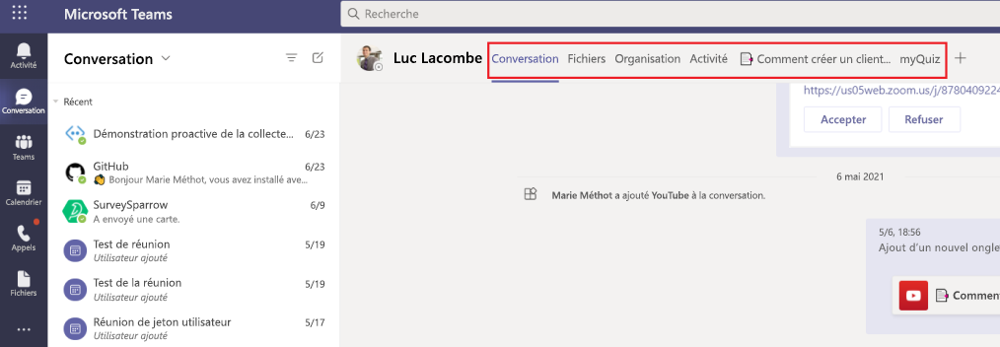
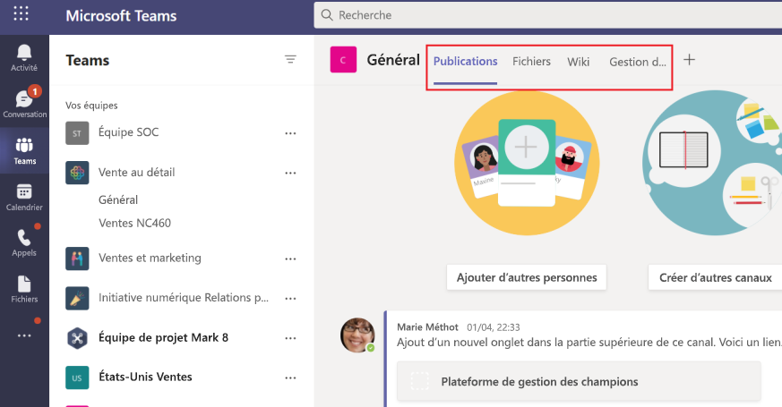

# Onglets Microsoft TeamsMicrosoft Teams tabs

Les onglets Teams des pages web sensibles incorporées dans Microsoft Teams.Tabs are Teams-aware webpages embedded in Microsoft Teams. Il s’agit de balises html <iframe simples qui pointent vers des domaines déclarés dans le manifeste de l’application et qui peuvent être ajoutées dans le cadre d’un canal au sein d’une équipe, d’une conversation de groupe ou d’une application personnelle pour un utilisateur \> individuel.They are simple HTML <iframe\> tags that point to domains declared in the app manifest and can be added as part of a channel inside a team, group chat, or personal app for an individual user. Vous pouvez inclure des onglets personnalisés avec votre application pour incorporer votre propre contenu web dans Teams ou ajouter Teams fonctionnalités spécifiques à votre contenu web.You can include custom tabs with your app to embed your own web content in Teams or add Teams-specific functionality to your web content. Pour plus d’informations, [Teams SDK client JavaScript.](/javascript/api/overview/msteams-client)For more information, see [Teams JavaScript client SDK](/javascript/api/overview/msteams-client).

L’image suivante montre les onglets personnels :The following image shows personal tabs:

L’image suivante montre les onglets du canal Contoso :The following image shows Contoso channel tabs:

> [!VIDEO https://www.youtube-nocookie.com/embed/Jw6i7Mkt0dg]

> [!VIDEO https://www.youtube-nocookie.com/embed/T2a8yJC3VcQ]

Il existe quelques conditions préalables que vous devez respecter avant de travailler sur des onglets.There are few prerequisites that you must go through before working on tabs.

Deux types d’onglets sont disponibles dans Teams, personnel et canal ou groupe.There are two types of tabs available in Teams, personal and channel or group. [Les onglets personnels,](~/tabs/how-to/create-personal-tab.md)ainsi que les bots d’étendue personnelle, font partie des applications personnelles et sont limitées à un seul utilisateur.[Personal tabs](~/tabs/how-to/create-personal-tab.md), along with personally-scoped bots, are part of personal apps and are scoped to a single user. Ils peuvent être épinglés à la barre de navigation de gauche pour faciliter l’accès.They can be pinned to the left navigation bar for easy access. [Les onglets](~/tabs/how-to/create-channel-group-tab.md) de canal ou de groupe offrent du contenu aux canaux et aux conversations de groupe, et sont un excellent moyen de créer des espaces de collaboration autour de contenu web dédié.[Channel or group tabs](~/tabs/how-to/create-channel-group-tab.md) deliver content to channels and group chats, and are a great way to create collaborative spaces around dedicated web-based content.

Vous pouvez [créer une page de contenu](~/tabs/how-to/create-tab-pages/content-page.md) dans le cadre d’un onglet personnel, d’un onglet de canal ou de groupe ou d’un module de tâche.You can [create a content page](~/tabs/how-to/create-tab-pages/content-page.md) as part of a personal tab, channel or group tab, or task module. Vous pouvez créer une page de [configuration](~/tabs/how-to/create-tab-pages/configuration-page.md) qui permet aux utilisateurs de configurer une application Microsoft Teams et de l’utiliser pour configurer un onglet de conversation de canal ou de groupe, une extension de messagerie ou un connecteur Office 365.You can [create a configuration page](~/tabs/how-to/create-tab-pages/configuration-page.md) that enables users to configure Microsoft Teams app and use it to configure a channel or group chat tab, a messaging extension, or an Office 365 Connector. Vous pouvez permettre aux utilisateurs de reconfigurer votre onglet après l’installation et de créer une [page](~/tabs/how-to/create-tab-pages/removal-page.md) de suppression d’onglets pour votre application.You can permit users to reconfigure your tab after installation and [create a tab removal page](~/tabs/how-to/create-tab-pages/removal-page.md) for your application. Lorsque vous créez une application Teams qui inclut un onglet, vous devez tester le fonctionnement de votre onglet sur les clients Teams [Android et iOS.](~/tabs/design/tabs-mobile.md)When you build a Teams app that includes a tab, you must test how your [tab functions on both the Android and iOS Teams clients](~/tabs/design/tabs-mobile.md). Votre onglet doit obtenir [le contexte par](~/tabs/how-to/access-teams-context.md) le biais d’informations de base, de paramètres régionaux et de thèmes, ou qui identifie ce qui se trouve dans `entityId` `subEntityId` l’onglet.Your tab must [get context](~/tabs/how-to/access-teams-context.md) through basic information, locale and theme information, and `entityId` or `subEntityId` that identifies what is in the tab.

Vous pouvez créer des onglets avec des cartes adaptatives et centraliser toutes les fonctionnalités de l’application Teams en éliminant la nécessité d’un autre système principal pour vos bots et onglets.You can build tabs with Adaptive Cards and centralize all Teams app capabilities by eliminating the need for a different backend for your bots and tabs. [Stage View](~/tabs/tabs-link-unfurling.md) est un nouveau composant d’interface utilisateur qui vous permet d’afficher le contenu ouvert en plein écran en Teams et épinglé sous la forme d’un onglet. Le [service](~/tabs/tabs-link-unfurling.md) de déploiement de lien existant est mis à jour de sorte qu’il soit utilisé pour transformer les URL en onglet à l’aide d’une carte adaptative et des services de conversation.[Stage View](~/tabs/tabs-link-unfurling.md) is a new UI component that allows you to render the content opened in full screen in Teams and pinned as a tab. The existing [link unfurling](~/tabs/tabs-link-unfurling.md) service is updated so that it is used to turn URLs into a tab using an Adaptive Card and Chat Services. Vous pouvez créer des [onglets](~/tabs/how-to/conversational-tabs.md) de conversation à l’aide de sous-entités de conversation qui permettent aux utilisateurs d’avoir des conversations sur des sous-entités dans votre onglet, telles que des tâches spécifiques, des patients et des opportunités de vente, au lieu de discuter de l’onglet entier. Vous pouvez modifier les [marges des onglets](~/resources/removing-tab-margins.md) pour améliorer l’expérience du développeur lors de la création d’applications.You can [create conversational tabs](~/tabs/how-to/conversational-tabs.md) using conversational sub-entities that allow users to have conversations about sub-entities in your tab, such as specific task, patient, and sales opportunity, instead of discussing the entire tab. You can make changes to [tab margins](~/resources/removing-tab-margins.md) to enhance the developer's experience when building apps.

## Fonctionnalités de l’ongletTab features

Les fonctionnalités de l’onglet sont les suivantes :The tab features are as follows:

* Si un onglet est ajouté à une application qui possède également un bot, le bot est également ajouté à l’équipe.If a tab is added to an app that also has a bot, the bot is also added to the team.
* Sensibilisation de Azure Active Directory (AAD) de l’utilisateur actuel.Awareness of Azure Active Directory (AAD) ID of the current user.
* Sensibilisation des paramètres régionaux pour que l’utilisateur indique la langue qui est `en-us` .Locale awareness for the user to indicate language that is `en-us`.
* Fonctionnalité d' sign-on unique (SSO), si elle est prise en charge.Single sign-on (SSO) capability, if supported.
* Possibilité d’utiliser des bots ou des notifications d’application pour créer un lien profond vers l’onglet ou une sous-entité au sein du service, par exemple un élément de travail individuel.Ability to use bots or app notifications to deep link to the tab or to a sub-entity within the service, for example an individual work item.
* Possibilité d’ouvrir un module de tâche à partir de liens dans un onglet.The ability to open a task module from links within a tab.
* Réutilisation des SharePoint web dans l’onglet.Reuse of SharePoint web parts within the tab.

## Scénarios utilisateur ongletsTabs user scenarios

**Scénario :** Apportez une ressource web existante à l’Teams.**Scenario:** Bring an existing web-based resource inside Teams. \
**Exemple :** Vous créez un onglet personnel dans votre application Teams qui présente un site web d’entreprise d’information aux utilisateurs.**Example:** You create a personal tab in your Teams app that presents an informational corporate website to users.

**Scénario :** Ajoutez des pages de support à un bot Teams ou une extension de messagerie.**Scenario:** Add support pages to a Teams bot or messaging extension. \
**Exemple :** Vous créez des onglets personnels qui fournissent des **informations sur les** pages web et aident les utilisateurs. **Example:** You create personal tabs that provide **about** and **help** webpage content to users.

**Scénario :** Fournir l’accès aux éléments avec qui vos utilisateurs interagissent régulièrement pour un dialogue et une collaboration collaboratifs collaboratifs.**Scenario:** Provide access to items that your users interact with regularly for cooperative dialogue and collaboration. \
**Exemple :** Vous créez un onglet de canal ou de groupe avec un lien profond vers des éléments individuels.**Example:** You create a channel or group tab with deep linking to individual items.

## Comprendre le fonctionnement des ongletsUnderstand how tabs work

Vous pouvez utiliser l’une des méthodes suivantes pour créer des onglets :You can use one of the following methods to create tabs:

* [Déclarer un onglet personnalisé dans le manifeste de l’applicationDeclare custom tab in app manifest](#declare-custom-tab-in-app-manifest)
* [Utiliser la carte adaptative pour créer des ongletsUse Adaptive Card to build tabs](~/tabs/how-to/build-adaptive-card-tabs.md)

### Déclarer un onglet personnalisé dans le manifeste de l’applicationDeclare custom tab in app manifest

Un onglet personnalisé est déclaré dans le manifeste de l’application de votre package d’application.A custom tab is declared in the app manifest of your app package. Pour chaque page web que vous souhaitez inclure en tant qu’onglet dans votre application, vous définissez une URL et une étendue.For each webpage you want included as a tab in your app, you define a URL and a scope. En outre, vous pouvez ajouter Teams [SDK client JavaScript](/javascript/api/overview/msteams-client) à votre page et appeler après le chargement `microsoftTeams.initialize()` de votre page.Additionally, you can add the [Teams JavaScript client SDK](/javascript/api/overview/msteams-client) to your page, and call `microsoftTeams.initialize()` after your page loads. Teams affiche votre page et donne accès à Teams informations spécifiques, par exemple le client Teams exécute le thème foncé.Teams displays your page and provides access to Teams-specific information, for example the Teams client is running the dark theme.

Que vous choisissiez d’exposer votre onglet dans le canal ou le groupe, ou dans l’étendue personnelle, vous devez présenter une page de contenu HTML <\> iFrame dans votre onglet.  Pour les onglets personnels, l’URL de contenu est définie directement dans Teams manifeste de l’application par la propriété `contentUrl` dans le `staticTabs` tableau.Whether you choose to expose your tab within the channel or group, or personal scope, you must present an <iframe\> HTML [content page](~/tabs/how-to/create-tab-pages/content-page.md) in your tab. For personal tabs, the content URL is set directly in your Teams app manifest by the `contentUrl` property in the `staticTabs` array. Le contenu de votre onglet est le même pour tous les utilisateurs.Your tab's content is the same for all users.

Pour les onglets de canal ou de groupe, vous pouvez également créer une page de configuration supplémentaire.For channel or group tabs, you can also create an additional configuration page. Cette page vous permet de configurer l’URL de la page de contenu, généralement en utilisant des paramètres de chaîne de requête d’URL pour charger le contenu approprié pour ce contexte.This page allows you to configure content page URL, typically by using URL query string parameters to load the appropriate content for that context. Cela est dû au fait que votre onglet de canal ou de groupe peut être ajouté à plusieurs conversations d’équipe ou de groupe.This is because your channel or group tab can be added to multiple teams or group chats. Lors de chaque installation ultérieure, vos utilisateurs peuvent configurer l’onglet, ce qui vous permet d’adapter l’expérience selon les besoins.On each subsequent install, your users can configure the tab, allowing you to tailor the experience as required. Lorsque les utilisateurs ajoutent ou configurent un onglet, une URL est associée à l’onglet présenté dans l’interface Teams’utilisateur.When users add or configure a tab, a URL is associated with the tab that is presented in the Teams user interface (UI). La configuration d’un onglet ajoute simplement des paramètres supplémentaires à cette URL.Configuring a tab simply adds additional parameters to that URL. Par exemple, lorsque vous ajoutez l’onglet Azure Boards, la page de configuration vous permet de choisir la carte à laquelle l’onglet se charge.For example, when you add the Azure Boards tab, the configuration page allows you to choose, which board the tab loads. L’URL de la page de configuration est spécifiée par la  `configurationUrl` propriété dans le tableau dans le manifeste de votre `configurableTabs` application.The configuration page URL is specified by the  `configurationUrl` property in the `configurableTabs` array in your app manifest.

Vous pouvez avoir plusieurs canaux ou onglets de groupe et jusqu’à 16 onglets personnels par application.You can have multiple channels or group tabs, and up to 16 personal tabs per app.

## Voir aussiSee also

* [Demande des autorisations d’appareilRequest device permissions](../concepts/device-capabilities/native-device-permissions.md)
* [Intégrer les fonctionnalités médiasIntegrate media capabilities](../concepts/device-capabilities/mobile-camera-image-permissions.md)
* [Intégrer une QR ou un scanneur de code-barresIntegrate a QR or barcode scanner](../concepts/device-capabilities/qr-barcode-scanner-capability.md)
* [Intégrer les fonctionnalités d’emplacementIntegrate location capabilities](../concepts/device-capabilities/location-capability.md)

## Étape suivanteNext step

> [!div class="nextstepaction"]
> [Conditions préalablesPrerequisites](~/tabs/how-to/tab-requirements.md)
