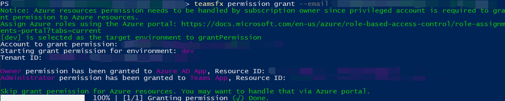

# <a name="teamsfx-command-line-interface"></a>Interface de ligne de commande TeamsFx

L’interface de ligne de commande TeamsFx est une interface de ligne de commande basée sur du texte qui accélère Teams développement d’applications. Il vise à fournir une expérience centrée sur le clavier lors de la création d Teams applications. Il permet également un scénario CI/CD dans lequel CLI peut être facilement intégré dans des scripts pour l’automatisation.

* [Code source](https://github.com/OfficeDev/TeamsFx/tree/dev/packages/cli) 
* [Package (NPM)](https://www.npmjs.com/package/@microsoft/teamsfx-cli)

## <a name="get-started"></a>Prise en main

Commençons par installer et exécuter pour `teamsfx-cli` vérifier toutes les commandes disponibles `npm` `teamsfx -h` :

```bash
  npm install -g @microsoft/teamsfx-cli
  teamsfx -h
```

## <a name="supported-commands"></a>Commandes prise en charge

| `teamsfx` Commandes  | Descriptions |
|:----------------  |:-------------|
| `teamsfx new`       | Créez une application Teams’application. |
| `teamsfx account`   | Gérer les comptes de service cloud. Les services cloud pris en charge sont « Azure » et « Microsoft 365 ».          |
| `teamsfx env`       | Gérer les environnements. |
| `teamsfx capability`| Ajoutez de nouvelles fonctionnalités à l’application actuelle.         |
| `teamsfx resource`  | Gérer les ressources dans l’application actuelle.         |
| `teamsfx provision` | Mise en service des ressources cloud dans l’application actuelle.             |
| `teamsfx deploy`    | Déployez l’application actuelle.  |
| `teamsfx package`   | Créez votre Teams dans un package pour la publication.         |
| `teamsfx validate`  | Validez l’application actuelle.             |
| `teamsfx publish`   | Publiez l’application sur Teams.             |
| `teamsfx preview`   | Afficher un aperçu de l’application actuelle. |
| `teamsfx config`    | Gérer les données de configuration. |
| `teamsfx permission`| Collaborez avec d’autres développeurs dans le même projet.|

## `teamsfx new`

`teamsfx new`passe par défaut en mode interactif et vous guide tout au long du processus de création d’une application Teams en vous posez quelques questions. Vous pouvez également le faire en mode non interactif en réglage `--interactive` de l’indicateur sur `false` .

| `teamsFx new` Commandes  | Descriptions |
|:----------------  |:-------------|
| `teamsfx new template <template-name>`     | Créer une application à partir d’un modèle existant |
| `teamsfx new template list`     | Liste de tous les modèles disponibles |

### <a name="parameters-for-teamsfx-new"></a>Paramètres pour `teamsfx new`

| Paramètres  | Obligatoire | Descriptions |
|:----------------  |:-------------|:-------------|
|`--app-name` | Oui| Nom de votre application Teams application.|
|`--interactive`| Non | Sélectionnez les options de manière interactive. Les options sont `true` et `false` . La valeur par défaut est `true`.|
|`--capabilities`| Non| Choisissez Teams fonctionnalités de l’application, plusieurs options sont `tab` : `bot` , et `messaging-extension` `tab-spfx` . La valeur par défaut est : `tab` .|
|`--programming-language`| Non| Langage de programmation pour le projet. Les options sont `javascrip` ou ont la valeur par défaut : `typescript` `javascript` .|
|`--folder`| Non | Project répertoire. Un sous-dossier avec le nom de votre application sera créé sous ce répertoire. La valeur par défaut est : `./` .|
|`--spfx-framework-type`| Non| Applicable si `Tab(SPfx)` la fonctionnalité est sélectionnée. Infrastructure frontale. Les options `none` sont `react` et, la valeur par défaut est : `none` .|
|`--spfx-web part-name`| Non | Applicable si `Tab(SPfx)` la fonctionnalité est sélectionnée. Nom du partie Web. La valeur par défaut est « helloworld ». |
|`--spfx-web part-desp`| Non | Applicable si `Tab(SPfx)` la fonctionnalité est sélectionnée. Description du partie Web. La valeur par défaut est « helloworld description ». |
|`--azure-resources`| Non| Applicable si contient la `tab` fonctionnalité. Ajoutez des ressources Azure à votre projet. Options(Multiple) sont `sql` (Azure SQL Database) et `function` (Fonctions Azure). |

### <a name="scenarios-for-teamsfx-new"></a>Scénarios pour `teamsfx new`

L’utilisation du mode interactif pour créer une application Teams est très intuitive, essayez-la en commençant par `teamsfx new` . Voici quelques détails sur le contrôle de tous les paramètres :

#### <a name="a-tab-app-hosted-on-spfx-using-react"></a>Application d’onglet hébergée sur SPFx l’React

```bash
teamsfx new --interactive false --app-name newspfxapp --capabilities tab-spfx --spfx-framework-type react
```

#### <a name="a-teams-app-in-javascript-contains-tab-bot-capabilities-and-azure-functions"></a>Une application Teams javaScript contient des onglets, des fonctionnalités de bot et des fonctions Azure

```bash
teamsfx new --interactive false --app-name newtabbotapp --capabilities tab bot --programming-language javascript --azure-resources function
```

#### <a name="a-teams-tab-app-with-azure-functions-and-azure-sql"></a>Application Teams onglet avec fonctions Azure et Azure SQL

```bash
teamsfx new --interactive false app-name newapp --azure-resources sql function --programming-language typescript
```

## `teamsfx account`

Gérer les comptes de service cloud. Les services cloud pris en charge sont `Azure` et `Microsoft 365` .

| `teamsFx account` Commandes  | Descriptions |
|:----------------  |:-------------|
| `teamsfx account login <service>`      | Connectez-vous au service cloud sélectionné. |
| `teamsfx account logout <service>`      | déconnectez-vous du service cloud sélectionné. |
| `teamsfx account set --subscription`      | Mettez à jour les paramètres du compte pour définir un ID d’abonnement. |

## `teamsfx env`

Gérer les environnements.

| `teamsfx env` Commandes  | Descriptions |
|:----------------  |:-------------|
| `teamsfx env add <new_env_name> --env <existing_env_name>` | Ajoutez un nouvel environnement en copiant à partir de l’environnement spécifié. |
| `teamsfx env list` | Liste de tous les environnements. |

### <a name="scenarios-for-teamsfx-env"></a>Scénarios pour `teamsfx env`

#### <a name="create-a-new-environment"></a>Créer un environnement

Ajoutez un nouvel environnement en copiant à partir de l’environnement dev existant :

```bash
teamsfx env add staging --env dev
```

## `teamsfx capability`

Ajoutez de nouvelles fonctionnalités à l’application actuelle.

| `teamsFx capability` Commandes  | Descriptions |
|:----------------  |:-------------|
| `teamsfx capability add tab`      | Ajoutez un onglet. |
| `teamsfx capability add bot`      | Ajoutez un bot. |
| `teamsfx capability add messaging-extension`      | Ajoutez une extension de messagerie. |

> [!NOTE]
> Une fois que votre projet inclut un bot, l’extension de messagerie ne peut plus être ajoutée et elle s’applique vice versa. Vous pouvez inclure des extensions de bot et de messagerie dans votre projet lors de la création d’un projet Teams’application.

## `teamsfx resource`

Gérer les ressources dans l’application actuelle. Pris `<resource-type>` en charge : et `azure-sql` `azure-function` `azure-apim` .

| `teamsFx resource` Commandes  | Descriptions |
|:----------------  |:-------------|
| `teamsfx resource add <resource-type>`      | Ajoutez une ressource à l’application actuelle.|
| `teamsfx resource show <resource-type>`      | Afficher les détails de configuration de la ressource. |
| `teamsfx resource list`      | Liste de toutes les ressources dans l’application actuelle. |

### <a name="parameters-for-teamsfx-resource-add-azure-function"></a>Paramètres pour `teamsfx resource add azure-function`

| Paramètres  | Obligatoire | Descriptions |
|:----------------  |:-------------|:-------------|
|`--function-name`| Oui | Fournissez un nom de fonction. La valeur par défaut est : `getuserprofile` . |

### <a name="parameters-for-teamsfx-resource-add-azure-sql"></a>Paramètres pour `teamsfx resource add azure-sql`

#### `--function-name`

| Paramètres  | Obligatoire | Descriptions |
|:----------------  |:-------------|:-------------|
|`--function-name`| Oui | Fournissez un nom de fonction. La valeur par défaut est : `getuserprofile` . |

> [!NOTE]
> Le nom de la fonction est vérifié SQL doit être accessible à partir de la charge de travail du serveur. Si votre projet ne contient `Azure Functions` pas, il en créera un pour vous.

### <a name="parameters-for-teamsfx-resource-add-azure-apim"></a>Paramètres pour `teamsfx resource add azure-apim`

> [!TIP]
> Les options ci-dessous prennent effet lorsque vous essayez d’utiliser une `APIM` instance existante. Par défaut, vous n’avez pas besoin de spécifier d’options et il crée une nouvelle instance au cours de `teamsfx provision` l’étape.

| Paramètres  | Obligatoire | Descriptions |
|:----------------  |:-------------|:-------------|
|`--subscription`| Oui | Sélectionner un abonnement Azure|
|`--apim-resource-group`| Oui| Nom du groupe de ressources. |
|`--apim-service-name`| Oui | Nom de l’instance du service gestion des API. |
|`--function-name`| Oui | Fournissez un nom de fonction. La valeur par défaut est : `getuserprofile` . |

> [!NOTE]
> Nous demandons le nom de la fonction, `Azure API Management` car elle doit fonctionner avec `Azure Functions` . Si votre projet ne contient `Azure Functions` pas, nous en créerons un pour vous.

## `teamsfx provision`

Mise en service des ressources cloud dans l’application actuelle.

### <a name="parameters-for-teamsfx-provision"></a>Paramètres pour `teamsfx provision`

| Paramètres  | Obligatoire | Descriptions |
|:----------------  |:-------------|:-------------|
|`--env`| Oui| Sélectionnez un environnement pour le projet. |
|`--subscription`| Non | Spécifiez un ID d’abonnement Azure. |
|`--resource-group`| Non | Définissez le nom d’un groupe de ressources existant. |
|`--sql-admin-name`| Non | Applicable lorsqu’il existe SQL ressource dans le projet. Nom d’administrateur SQL.|
|`--sql-password`| Non| Applicable lorsqu’il existe SQL ressource dans le projet. Mot de passe d’administrateur SQL.|

## `teamsfx deploy`

Cette commande est utilisée pour déployer l’application actuelle. Par défaut, il déploie l’intégralité du projet, mais il est également possible de le déployer partiellement. Options(Multiple) sont : `frontend-hosting` , , , , `function` `apim` `teamsbot` `spfx` .

### <a name="parameters-for-teamsfx-deploy"></a>Paramètres pour `teamsfx deploy`

| Paramètres  | Obligatoire | Descriptions |
|:----------------  |:-------------|:-------------|
|`--env`| Oui| Sélectionnez un environnement existant pour le projet. |
|`--open-api-document`| Non | Applicable lorsqu’il existe une ressource APIM dans le projet. Chemin d’accès au fichier de document Open API. |
|`--api-prefix`| Non | Applicable lorsqu’il existe une ressource APIM dans le projet. Préfixe de nom d’API. Le nom unique par défaut de l’API sera `{api-prefix}-{resource-suffix}-{api-version}` . |
|`--api-version`| Non | Applicable lorsqu’il existe une ressource APIM dans le projet. Version de l’API. |

## `teamsfx validate`

Valider l’application actuelle. Cette commande valide le fichier manifeste de votre application.

### <a name="parameters-for-teamsfx-validate"></a>Paramètres pour `teamsfx validate`

`--env`: (Obligatoire) Sélectionnez un environnement existant pour le projet.

## `teamsfx publish`

Publiez l’application sur Teams.

### <a name="parameters-for-teamsfx-publish"></a>Paramètres pour `teamsfx publish`

`--env`: (Obligatoire) Sélectionnez un environnement existant pour le projet.

## `teamsfx package`

Créez votre Teams dans un package pour la publication.

## `teamsfx preview`

Afficher un aperçu de l’application actuelle à partir d’un emplacement local ou distant.

### <a name="parameters-for-teamsfx-preview"></a>Paramètres pour `teamsfx preview`

| Paramètres  | Obligatoire | Descriptions |
|:----------------  |:-------------|:-------------|
|`--local`| Non | Afficher un aperçu de l’application en local. `--local` est exclusif avec `--remote` . |
|`--remote`| Non | Afficher un aperçu de l’application à partir d’une application distante. `--remote` est exclusif avec `--local` . |
|`--env`| Non | Sélectionnez un environnement existant pour le projet lors de `--remote` l’application du paramètre. |
|`--folder`| Non | Project répertoire racine. La valeur par défaut est `./`. |
|`--browser`| Non | Navigateur pour ouvrir Teams client web. Les options sont `chrome` , `edge` et `default` (navigateur par défaut du système). La valeur par défaut est `default`. |
|`--browser-arg`| Non | Argument à transmettre au navigateur, nécessite --browser, peut être utilisé plusieurs fois (par exemple, --browser-args= »--guest ») |
|`--sharepoint-site`| Non | SharePoint’URL du site, par `{your-tenant-name}.sharepoint.com` exemple (uniquement pour SPFx prévisualisation à distance du projet). |

### <a name="scenarios-for-teamsfx-preview"></a>Scénarios pour `teamsfx preview`

#### <a name="local-preview"></a>Aperçu local

Dépendances :

- Node.js
- Kit de développement logiciel .NET
- Outils azure Functions Core

```bash
teamsfx preview --local
teamsfx preview --local --browser chrome
```

#### <a name="remote-preview"></a>Aperçu à distance

```bash
teamsfx preview --remote
teamsfx preview --remote --browser edge
```

> [!Note]
> Les journaux des services d’arrière-plan tels que React seront enregistrés dans `~/.fx/cli-log/local-preview/` .

## `teamsfx config`

Gérez les données de configuration dans l’étendue utilisateur ou dans l’étendue du projet.

| `teamsfx config` Commandes  | Descriptions |
|:----------------  |:-------------|
| `teamsfx config get [option]` | Afficher la valeur de configuration de l’option |
| `teamsfx config set <option> <value>` | Mettre à jour la valeur de configuration de l’option |

### <a name="parameters-for-teamsfx-config"></a>Paramètres pour `teamsfx config`

| Paramètres  | Obligatoire | Descriptions |
|:----------------  |:-------------|:-------------|
|`--env`| Oui | Sélectionnez un environnement existant pour le projet. |
|`--folder`| Non | Project répertoire. Cette configuration est utilisée lors de l’get/set de la configuration du projet. La valeur par défaut est : `./` . |
|`--global`| Non | Fin de la configuration. Si c’est le cas, l’étendue est limitée à l’étendue utilisateur au lieu de l’étendue du projet. La valeur par défaut est : `false` . Configurations globales actuellement prise en charge, y `telemetry` compris : , , `validate-dotnet-sdk` `validate-func-core-tools` . `validate-node` |

### <a name="scenerios-for-teamsfx-config"></a>Scenerios pour `teamsfx config`

Les secrets du fichier sont chiffrés, ce qui peut vous aider à `.userdata` `teamsfx config` afficher/mettre à jour ces valeurs.

#### <a name="stop-sending-telemetry-data"></a>Arrêter l’envoi de données de télémétrie

```bash
teamsfx config set telemetry off
```

#### <a name="disable-environment-checker"></a>Désactiver l’vérification de l’environnement

Il existe trois configs pour activer/désactiver les Node.js, le SDK .NET et la validation des outils principaux des fonctions Azure, qui sont tous activés par défaut. Vous pouvez définir la config sur « off » si vous n’avez pas besoin de la validation des dépendances et que vous souhaitez installer les dépendances par vous-même. Consultez le [guideNode.js'installation,](https://github.com/OfficeDev/TeamsFx/blob/dev/docs/vscode-extension/envchecker-help.md#how-to-install-nodejs)le guide d’installation [du SDK .NET](https://github.com/OfficeDev/TeamsFx/blob/dev/docs/vscode-extension/envchecker-help.md#how-to-install-net-sdk) et le guide d’installation des outils principaux des fonctions [Azure.](https://github.com/OfficeDev/TeamsFx/blob/dev/docs/vscode-extension/envchecker-help.md#how-to-install-azure-functions-core-tools)

Par exemple, pour désactiver la validation du SDK .NET, vous pouvez utiliser la commande suivante.

```bash
teamsfx config set validate-dotnet-sdk off
```

Pour activer la validation du SDK .NET, vous pouvez utiliser la commande suivante.

```bash
teamsfx config set validate-dotnet-sdk on
```

#### <a name="view-all-the-user-scope-configuration"></a>Afficher toute la configuration de l’étendue utilisateur

```bash
teamsfx config get -g
```

#### <a name="view-all-the-configuration-in-project"></a>Afficher toute la configuration dans le projet

La clé secrète est déchiffrée automatiquement :

```bash
teamsfx config get --env dev
```

#### <a name="update-the-secret-configuration-in-project"></a>Mettre à jour la configuration secrète dans le projet

```bash
teamsfx config set fx-resource-aad-app-for-teams.clientSecret xxx --env dev
```

## `teamsfx permission`

L’CLI TeamsFx fournit `teamsFx permission` des commandes pour le scénario de collaboration.

| `teamsFx permission` Commandes | Descriptions |
|:------------------------------|-------------|
| `teamsfx permission grant --env --email` | Accordez l’autorisation au compte Microsoft 365 du collaborateur pour le projet d’un environnement spécifié. |
| `teamsfx permission status` | Afficher l’état des autorisations pour le projet |

### <a name="parameters-for-teamsfx-permission-grant"></a>Paramètres pour `teamsfx permission grant`

| Paramètres  | Obligatoire | Descriptions |
|:----------------  |:-------------|:-------------|
|`--env`| Oui | Fournissez le nom de l’env. |
|`--email`| Oui | Fournissez l’adresse Microsoft 365 de messagerie du collaborateur. Notez que le compte du collaborateur doit se voir dans le même client avec créateur. |

### <a name="parameters-for-teamsfx-permission-status"></a>Paramètres pour `teamsfx permission status`

| Paramètres  | Obligatoire | Descriptions |
|:----------------  |:-------------|:-------------|
|`--env`| Oui | Fournissez le nom de l’env. |
|`--list-all-collaborators` | Non | Avec cet indicateur, Teams Shared Computer Toolkit CLI imprime tous les collaborateurs de ce projet. |

### <a name="scenarios-for-teamsfx-permission"></a>Scénarios pour `teamsfx permission`

Voici quelques exemples, pour une meilleure gestion des autorisations pour les `TeamsFx` projets.

#### <a name="grant-permission"></a>Accorder l’autorisation

Project créateurs et collaborateurs peuvent utiliser la commande pour ajouter un `teamsfx permission grant` nouveau collaborateur au projet :

```bash
teamsfx permission grant --env dev --email user-email@user-tenant.com
```

Une fois l’autorisation accordée, le créateur et les collaborateurs du projet peuvent partager le projet avec le nouveau collaborateur par Github, et le nouveau collaborateur aura toutes les autorisations pour Microsoft 365 compte.

#### <a name="show-permission-status"></a>Afficher l’état des autorisations

Project créateurs et collaborateurs peuvent utiliser la commande pour afficher son Microsoft 365 de compte pour `teamsfx permission status` un env spécifique :

```bash
teamsfx permission status --env dev
```

#### <a name="list-all-collaborators"></a>Liste de tous les collaborateurs

Project créateurs et collaborateurs peuvent utiliser la commande pour afficher tous les `teamsfx permission status` collaborateurs pour un env spécifique :

```bash
teamsfx permission status --env dev --list-all-collaborators
```

#### <a name="e2e-collaboration-work-flow-in-cli"></a>Flux de travail de collaboration E2E dans CLI

En tant que créateur de projet :

- Créez un projet d’onglet TeamsFx (vous pouvez également sélectionner un bot) et le type d’hébergement sélectionnez Azure.

  ```bash
  teamsfx new --interactive false --app-name newapp --host-type azure
  ```

- Connectez-Microsoft 365 compte azure.

  ```bash
  teamsfx account login azure
  teamsfx account login Microsoft 365
  ```

- Provisionnez votre projet.

  ```bash
  teamsfx provision
  ```

- Afficher les collaborateurs. Vous devriez vous voir ici.

  ```bash
  teamsfx permission status --env dev --list-all-collaborators
  ```

  
- Ajoutez un autre compte en tant que collaborateur. Notez que le compte ajouté doit se trouver sous le même client :

  ```bash
  teamsfx permission grant --env dev --email user-email@user-tenant.com
  ```

  
- Push your project to GitHub

En tant que collaborateur Project :

- Clonez le projet à partir GitHub.
- Connectez-Microsoft 365 compte. Notez que le compte Microsoft 365 doit être identique à celui ajouté ci-dessus :

  ```bash
  teamsfx account login Microsoft 365
  ```

- Connectez-vous à un compte Azure qui dispose d’une autorisation de collaborateur pour toutes les ressources Azure.

  ```bash
  teamsfx account login azure
  ```

- Vérifiez l’état de l’autorisation. Vous devez avoir l’autorisation propriétaire du projet :

  ```bash
  teamsfx permission status --env dev
  ```

  
- Mettez à jour le code de l’onglet et déployez le projet à distance.
- Lancez à distance et le projet doit fonctionner comme il se doit.
