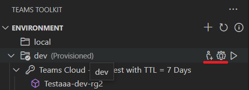

# Collaborer sur Teams projet à l’aide Teams Shared Computer Toolkit

Plusieurs développeurs peuvent travailler ensemble pour déboguer, mettre en service et déployer pour le même projet TeamsFx, mais cela nécessite de définir manuellement les autorisations de Teams App et AAD App, ce qui n’est pas facile à faire.

Teams Shared Computer Toolkit prend désormais en charge la fonctionnalité de collaboration pour permettre à un développeur (propriétaire du projet) d’inviter d’autres développeurs (collaborateurs) au projet TeamsFx pour déboguer, mettre en service et déployer le même projet TeamsFx.

## Configuration requise

* Conditions préalables pour le compte

    Pour mettre en service des ressources cloud dans Azure et Microsoft 365, vous devez avoir les comptes suivants avec les autorisations appropriées. Pour plus [d’informations, reportez-vous](accounts.md) à Préparer les comptes Teams’application.

    * Microsoft 365
    * Azure avec un abonnement valide

* [Installez Teams Shared Computer Toolkit](https://marketplace.visualstudio.com/items?itemName=TeamsDevApp.ms-teams-vscode-extension) version v3.0.0+.

> [!TIP]
> Un projet d’application Teams doit déjà être ouvert dans du code VS.

## Collaborer avec d’autres développeurs

### En tant que propriétaire de projet

> [!NOTE]
> Avant d’ajouter des collaborateurs pour un environnement, le propriétaire du projet [doit](provision.md) d’abord mettre en service le projet.

* Dans la section **ENVIRONNEMENT** sur Teams Shared Computer Toolkit, pointez  sur le nom de l’environnement pour rechercher les boutons Collaborateurs, l’un est le bouton Ajouter des propriétaires de l’application **Teams M365 (avec AAD App),** l’autre bouton De la liste **M365 Teams App (avec AAD App)** comme illustré dans l’image suivante :

  

* Sélectionnez le bouton Ajouter **M365 Teams App (avec** AAD App) et ajoutez une autre adresse e-mail de compte M365 en tant que collaborateur. Le compte à ajouter doit se trouver sur le même client que le propriétaire du projet pour le **débogage** à distance, comme illustré dans l’image :

  

* Pour afficher les collaborateurs dans l’environnement actuel, sélectionnez le bouton List **M365 Teams App (avec AAD App),** puis les collaborateurs sont répertoriés dans le canal de sortie, comme illustré dans l’image suivante :

  

* Push the project to GitHub.

> [!NOTE]
> Le collaborateur nouvellement ajouté ne recevra aucune notification. Project propriétaire doit avertir le collaborateur.

### En tant que collaborateur de projet

* Cloner le projet à partir de GitHub
* Compte M365 de connexion

> [!NOTE]
> Les collaborateurs doivent se connecter à l’aide du compte ajouté par le propriétaire du projet qui se **trouve sous le même client avec le propriétaire du projet.**

* Connectez-vous à un compte Azure qui dispose d’une autorisation de collaborateur pour toutes les ressources Azure utilisées dans ce projet.
* En travaillant sur le code du projet, déployez le projet à distance lorsque vous pensez qu’il est temps de prévisualiser Teams application.
* Lancez à distance pour afficher un aperçu de l’Teams app. Pour plus d’informations, [voir créer et exécuter votre application Teams dans un environnement distant.](/microsoftteams/platform/sbs-gs-javascript?tabs=vscode%2Cvsc%2Cviscode%2Cvcode&tutorial-step=3&branch)

### Limites

> [!NOTE]
> Les autorisations associées à Azure doivent être définies manuellement par l’administrateur d’abonnement Azure sur le portail Azure. Le compte Azure doit avoir un rôle de collaborateur pour l’abonnement au moins afin que les développeurs peuvent collaborer pour mettre en service et déployer le projet TeamsFx.

1. **Impossible de supprimer**: vous ne pouvez pas supprimer des collaborateurs directement de Teams Shared Computer Toolkit extension. Pour supprimer manuellement des collaborateurs, suivez les étapes ci-dessous :

      1. Go to [Teams Developer Portal,](https://  dev.teams.microsoft.com/apps)find your Teams App by name or app id.
      2. Dans la page Teams gestion des applications, sélectionnez **Propriétaires** dans le panneau gauche.
      3. Recherchez et supprimez le collaborateur.
      4. Go to [Azure Active Directory,](https://ms.portal.azure.com/#blade/Microsoft_AAD_IAM/ActiveDirectoryMenuBlade/RegisteredApps)select **App registration** from left panel, and find your AAD App.
      5. Dans la page AAD gestion des applications, sélectionnez **Propriétaires** dans le panneau gauche.
      6. Recherchez et supprimez le collaborateur.
    

1. La fonctionnalité de collaboration prend uniquement en charge le projet hébergé sur Azure, SPFx projet hébergé sera pris en charge à l’avenir.

1. Le collaborateur ajouté à votre projet ne recevra aucune notification. Project propriétaire doit avertir le collaborateur hors connexion.

## Voir aussi

> [!div class="nextstepaction"]
> [Mise en service des ressources cloud](provision.md)

> [!div class="nextstepaction"]
> [Déployer Teams application dans le cloud](deploy.md)

> [!div class="nextstepaction"]
> [Gérer plusieurs environnements](TeamsFx-multi-env.md)
