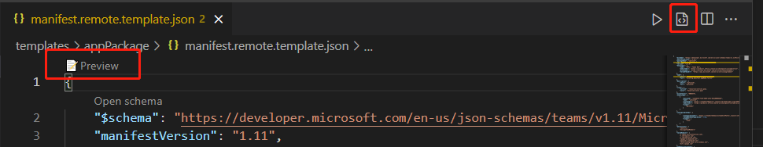
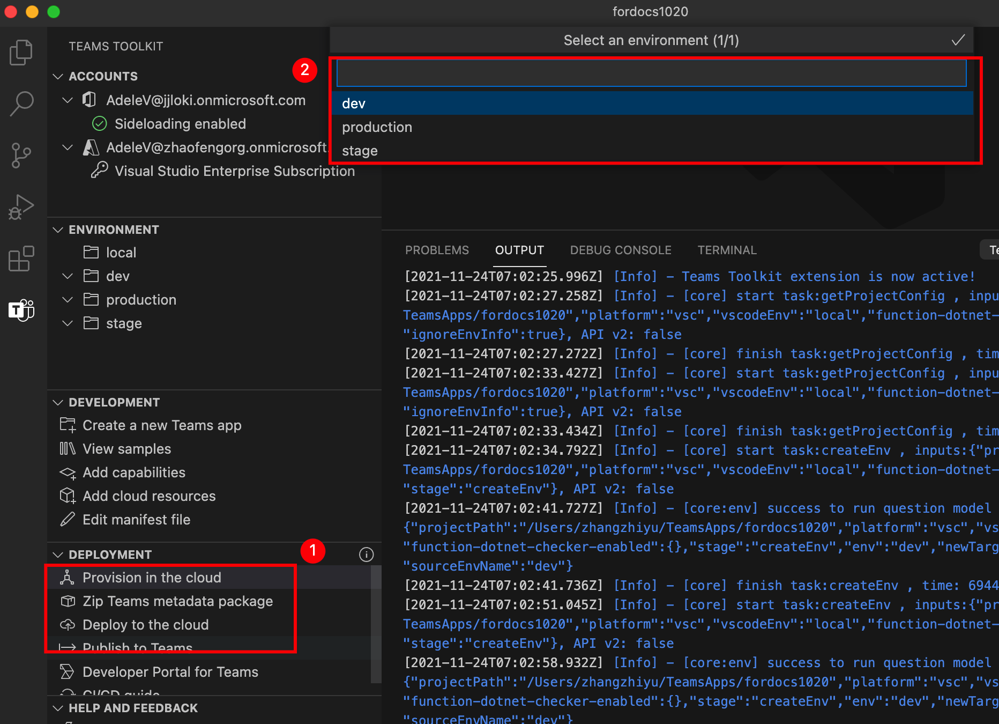

# <a name="preview-teams-app-manifest-in-teams-toolkit"></a>Prévisualiser Teams manifeste de l’application dans Teams Shared Computer Toolkit

Après la conception de la modèle, vous obtenez deux fichiers de modèle de manifeste sous `templates/appPackage` le dossier.

- `manifest.local.template.json` - application d’équipes de débogage locale.
- `manifest.remote.template.json` - partagé entre tous les environnements distants.

Ces fichiers modèles contenant certains espaces réservé et les valeurs réelles de Teams Shared Computer Toolkit seront résolues dans les fichiers sous `.fx/configs` et `.fx/states` .

## <a name="prerequisite"></a>Conditions préalables

* [Installez Teams Shared Computer Toolkit](https://marketplace.visualstudio.com/items?itemName=TeamsDevApp.ms-teams-vscode-extension) version v3.0.0+.

> [!TIP]
> Un projet d’application Teams doit déjà être ouvert dans du code VS.

## <a name="preview-manifest"></a>Manifeste d’aperçu

Pour afficher un aperçu du manifeste avec du contenu réel, Teams Shared Computer Toolkit générera des fichiers manifeste d’aperçu sous le `build/appPackage` dossier :

```text
└───build
    └───appPackage
        ├───appPackage.{env}.zip - Zipped app package of remote teams app
        ├───appPackage.local.zip - Zipped app package of local team app
        ├───manifest.{env}.json  - Previewed manifest of remote teams app
        └───manifest.local.json  - Previewed manifest of local teams app
```

### <a name="local-debug-teams-app"></a>Application de débogage Teams locale

Pour afficher un aperçu du fichier manifeste de l’application teams locale, vous devez appuyer sur **F5** pour exécuter d’abord le débogage local. Cette étape génère les paramètres locaux par défaut pour vous, puis le package d’application et le manifeste d’aperçu sont générés sous le dossier **build/appPackage.**

Les autres méthodes sont les autres :

- Select **Preview** in the codelens of **manifest.local.template.json** file
- Sélectionner **un fichier manifeste d’aperçu** dans la barre de menus du fichier **manifest.local.template.json**
- Sélectionnez **Zip Teams package de métadonnées** dans Treeview et **sélectionnez Local** L’aperçu local apparaît comme illustré dans l’image suivante :


### <a name="remote-environment"></a>Environnement distant

Pour afficher un aperçu du fichier manifeste de l’application Teams distante, vous devez d’abord sélectionner Provision dans le **cloud** dans le panneau DÉVELOPPEMENT de Teams Shared Computer Toolkit extension Treeview, ou déclencher une Teams : mettre en service dans le **cloud** à partir de la palette de commandes. Cette étape génère des configurations pour l’application Teams à distance, puis le package d’application et le manifeste d’aperçu sont générés sous le dossier **build/appPackage.**

Les autres méthodes sont les autres :

- Sélectionnez **Aperçu** dans les codelens du **fichier manifest.remote.template.json.**
- Sélectionnez **le fichier manifeste d’aperçu** dans la barre de menus du **fichier manifest.remote.template.json.**
- Sélectionnez **Zip Teams package de métadonnées** dans Treeview et sélectionnez votre environnement.



> S’il existe plusieurs environnements, vous devez sélectionner l’env que vous souhaitez afficher en aperçu, comme illustré dans l’image :



## <a name="sync-local-changes-to-dev-portal"></a>Synchroniser les modifications locales sur le portail de développement

Après avoir prévisualisé le fichier manifeste, vous pouvez synchroniser vos modifications locales sur le portail de développement de l’une des manières suivantes :

- Sélectionnez **Mettre à jour Teams plateforme dans** le coin supérieur gauche de`manifest.{env}.json`
- Select **Teams: Update manifest to Teams platform** at the menu bar of`manifest.{env}.json`
- Trigger **Teams: update manifest to Teams platform** from command palette


 

> [!NOTE]
> Le déclencheur à partir du codelens d’éditeur ou du bouton de titre met à jour le fichier manifeste actuel Teams plateforme. Le déclencheur à partir de la palette de commandes nécessite la sélection de l’environnement cible.

Si le fichier manifeste est obsolète en raison d’un changement de fichier de configuration ou de modèle, l’utilisateur est invité à confirmer son action : 

- **Aperçu uniquement**: le fichier manifeste local sera remplacé en fonction de la configuration actuelle
- **Aperçu et mise à jour**: le fichier manifeste local sera remplacé en fonction de la configuration actuelle et également mis à jour Teams plateforme en même temps
- **Annuler :** ne rien faire

> [!NOTE]
> Les modifications seront mises à jour sur le portail dev. Si vous avez des mises à jour manuelles dans le portail dev, elle sera écrasée.

## <a name="see-also"></a>Voir aussi

> [!div class="nextstepaction"]
> [Personnaliser Teams manifeste d’application dans Teams Shared Computer Toolkit](TeamsFx-manifest-customization.md)
