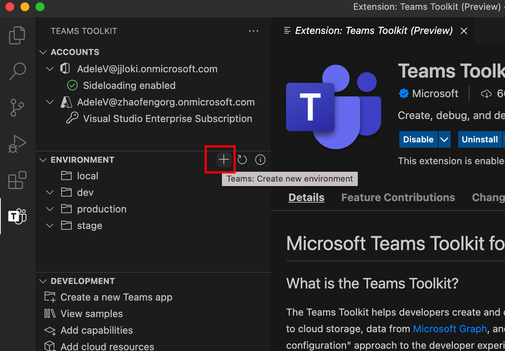

# <a name="manage-multiple-environments-in-teams-toolkit"></a>Gérer plusieurs environnements dans Teams Shared Computer Toolkit

 Teams Shared Computer Toolkit permet aux développeurs de créer et de gérer plusieurs environnements, de mettre en service et de déployer des artefacts dans l’environnement cible pour Teams App.

 Avec plusieurs environnements, les développeurs peuvent :

1. **Test** avant production : il est courant de configurer plusieurs environnements (développement, test, intermédiaire) avant de publier une application Teams dans un environnement de production dans le cycle de vie de développement d’application moderne.

2. **Gérer les comportements** des applications dans différents environnements : les développeurs peuvent définir différents comportements pour différents environnements, tels que les développeurs peuvent vouloir activer la télémétrie dans un environnement de production, mais la désactiver dans un environnement de développement.

## <a name="prerequisite"></a>Conditions préalables

* [Installez Teams Shared Computer Toolkit](https://marketplace.visualstudio.com/items?itemName=TeamsDevApp.ms-teams-vscode-extension) version v3.0.0+.

>[!TIP]
> Un projet d’application Teams doit déjà être ouvert dans du code VS.

## <a name="create-a-new-environment"></a>Créer un environnement

Après avoir créé un projet, Teams Shared Computer Toolkit par défaut crée :

- Un `local` environnement pour représenter les configurations de l’environnement d’ordinateur local.
- Un `dev` environnement pour représenter les configurations d’environnement distant/cloud.

> [!NOTE]
> Chaque projet ne peut avoir `local` qu’un seul environnement, mais plusieurs environnements distants.

Pour ajouter un autre environnement distant, sélectionnez l’icône Teams dans la barre latérale, cliquez sur le bouton Plus sous la section Environnement, puis suivez les questions à créer, comme illustré dans l’image suivante :



> [!NOTE]
> Si vous avez plusieurs environnements existants, vous devez sélectionner un environnement existant pour créer l’environnement. La commande copie le contenu du fichier de l’environnement existant que vous avez sélectionné vers `config.<newEnv>.json` le nouvel environnement en cours de `azure.parameters.<newEnv>.json` création.

## <a name="select-target-environment"></a>Sélectionner l’environnement cible 

Avec le concept d’environnement introduit dans Teams Shared Computer Toolkit, pour toutes les opérations liées à l’environnement, vous pouvez sélectionner l’environnement cible pour effectuer les opérations. Le kit de ressources vous invite à demander un environnement cible lorsque vous avez plusieurs environnements distants, comme illustré dans l’image suivante :


## <a name="project-folder-structure"></a>Project structure de dossiers 

Après avoir créé le projet, vous pouvez afficher les dossiers et les fichiers du projet dans la zone Explorateur de Visual Studio Code. Outre les codes personnalisés, certains fichiers sont utilisés par les Teams Shared Computer Toolkit pour maintenir la config, l’état et le modèle de l’application. Voici la liste de ces fichiers et décrit leur relation avec plusieurs environnements.

- `.fx/configs`: config files that user can customize for the Teams app.
  - `config.<envName>.json`: fichier de configuration par environnement.
  - `azure.parameters.<envName>.json`: fichier de paramètres par environnement pour la mise en service d’Azure BICEP.
  - `projectSettings.json`: paramètres de projet globaux, qui s’appliquent à tous les environnements.
  - `localSettings.json`: fichier de configuration de débogage local.
- `.fx/states`: résultat de la mise en service généré par le Shared Computer Toolkit.
  - `state.<envName>.json`: fichier de sortie de mise en service par environnement.
  - `<env>.userdata`: données utilisateur sensibles par environnement pour la sortie de mise en service.
- `templates`
  - `appPackage`: fichiers de modèles de manifeste d’application.
  - `azure`: fichiers de modèles BICEP.

## <a name="customize-the-provision"></a>Personnaliser la mise en service 

Teams Shared Computer Toolkit vous permet de modifier les fichiers de config et les fichiers modèles pour personnaliser la mise en service des ressources dans chaque environnement.

Le tableau ci-dessous répertorie les scénarios courants pris en charge pour une mise en service personnalisée et où personnaliser :

| Scénarios | Où personnaliser | Comment personnaliser |
| --- | --- | --- |
| Personnaliser la ressource Azure | <ul> <li>Fichiers BICEP sous `templates/azure` .</li> <li>`.fx/azure.parameters.<envName>.json`.</li></ul> | Pour plus [d’informations, voir ARM paramètres et modèles.](provision.md#customize-arm-parameters-and-templates) |
| Réutilisez l’application AAD existante pour Teams’application | <ul> <li>`auth` section dans `.fx/config.<envName>.json` .</li> </ul> | Pour plus d’informations, reportez-vous à une AAD existante pour [votre application Teams’application.](provision.md#use-an-existing-aad-app-for-your-teams-app) |
| Réutilisez l’application AAD existante pour le bot | <ul> <li>`bot` section dans `.fx/config.<envName>.json` .</li> </ul> | Pour plus [d’informations, reportez-vous à une AAD existante pour](provision.md#use-an-existing-aad-app-for-your-bot) votre bot. |
| Ignorez l’ajout d’utilisateurs lors de l’SQL | <ul> <li>`skipAddingSqlUser` dans `.fx/config.<envName>.json` .</li> </ul> | Pour plus [d’informations, reportez-vous à l’SQL utilisateur](provision.md#skip-adding-user-for-sql-database) pour plus d’informations. |
| Personnaliser le manifeste de l’application | <ul> <li>`templates/manifest.remote.template.json`.</li> <li>`manifest` section dans `.fx/config.<envName>.json` .</li>  </ul> | Pour plus [d’Teams,](TeamsFx-manifest-customization.md) reportez-vous à la Teams Shared Computer Toolkit de l’application. |

## <a name="scenarios"></a>Scénarios

### <a name="scenario-1-customize-teams-app-name-for-different-environment"></a>Scénario 1 : personnaliser le nom Teams’application pour un environnement différent

Dans cet exemple, vous allez apprendre à définir le nom Teams’application pour l’environnement par défaut et `myapp(dev)` `dev` pour `myapp(staging)` l’environnement `staging` intermédiaire.

Suivez les étapes de personnalisation :

- Étape 1 : ouvrir le fichier de `.fx/configs/config.dev.json` config.
- Étape 2 : mettre à jour la propriété du *manifeste > appName > court* à `myapp(dev)`

  Mises à jour de `.fx/configs/config.dev.json` :

  ```json
  {
      "$schema": "https://aka.ms/teamsfx-env-config-schema",
      "description": "You can customize the TeamsFx config for different environments.   Visit https://aka.ms/teamsfx-env-config to learn more about this.",
      "manifest": {
          "appName": {
              "short": "myapp(dev)"
              ...
          }
      }
      ...
  }
  ```

- Étape 3 : créez un environnement nommé `staging` s’il n’existe pas.
- Étape 4 : ouvrir le fichier de `.fx/configs/config.staging.json` config.
- Étape 5 : mettre à jour la même propriété de l’étape 2 à `myapp(staging)` .
- Étape 6 : exécutez la commande de mise en service sur et l’environnement pour mettre à jour le nom de `dev` `staging` l’application dans les environnements distants. Pour savoir comment exécuter la commande de mise en service avec Teams Shared Computer Toolkit. Pour plus d’informations, voir [ce document.](provision.md#provision-using-teams-toolkit)

### <a name="scenario-2-customize-teams-app-description-for-different-environment"></a>Scénario 2 : personnaliser Teams description de l’application pour un environnement différent

Dans ce scénario, vous allez apprendre à définir différentes descriptions Teams’application pour différents environnements :

- Pour l’environnement par `dev` défaut, la description sera `my app description for dev` ;
- Pour l’environnement de `staging` transit, la description sera `my app description for staging` ;

Étapes à suivre pour la personnalisation :

- Étape 1 : ouvrir le fichier de `.fx/configs/config.dev.json` config.
- Étape 2 : Ajoutez une nouvelle propriété de *manifeste > description > courte* avec la valeur `my app description for dev` .

  Mises à jour `.fx/configs/config.dev.json`

  ```json
  {
      "$schema": "https://aka.ms/teamsfx-env-config-schema",
      "description": "You can customize the TeamsFx config for different environments.   Visit https://aka.ms/teamsfx-env-config to learn more about this.",
      "manifest": {
          ...
          "description": {
              "short": "`my app description for dev"
              ...
          }
      }
      ...
  }
  ```

- Étape 3 : créez un environnement nommé `staging` s’il n’existe pas.
- Étape 4 : ouvrir le fichier de `.fx/configs/config.staging.json` config.
- Étape 5 : ajoutez la même propriété de l’étape 2 à `my app description for staging` .
- Étape 6 : ouvrez Teams de manifeste d’application pour une application `templates/appPackage/manifest.remote.template.json` distante.
- Étape 7 : mettez à jour la propriété pour utiliser la variable définie dans les fichiers `description > short` de config avec la syntaxe  mustache `{{config.manifest.description.short}}` .
  
  Mises à jour de `manifest.remote.template.json` :

  ```json
  {
    "$schema": "https://developer.microsoft.com/en-us/json-schemas/teams/v1.11/MicrosoftTeams.schema.json",
    "manifestVersion": "1.11",
    "version": "1.0.0",
    ...
    "description": {
      "short": "{{config.manifest.description.short}}",
      ...
    },
    ...
  }
  ```
- Étape 8 : exécutez la commande de mise en service sur et l’environnement pour mettre à jour le nom de `dev` `staging` l’application dans les environnements distants. Pour savoir comment exécuter la commande de mise en service Teams Shared Computer Toolkit, vous pouvez consulter ce [document pour](provision.md#provision-using-teams-toolkit) plus d’informations.

### <a name="scenario-3-customize-teams-app-description-for-all-environments"></a>Scénario 3 : personnaliser la description Teams’application pour tous les environnements

Dans ce scénario, vous allez apprendre à définir la description de Teams application `my app description` pour tous les environnements.

Comme le Teams de manifeste d’application est partagé dans tous les environnements, nous pouvons mettre à jour la valeur de description dans celui-ci pour notre cible :

- Étape 1 : ouvrez le Teams manifeste de l’application pour une application `templates/appPackage/manifest.remote.template.json` distante.
- Étape 2 : mettez à jour la propriété `description > short` avec une **chaîne codée en dur.** `my app description`
  
  Mises à jour de `manifest.remote.template.json` :

  ```json
  {
    "$schema": "https://developer.microsoft.com/en-us/json-schemas/teams/v1.11/MicrosoftTeams.schema.json",
    "manifestVersion": "1.11",
    "version": "1.0.0",
    ...
    "description": {
      "short": "my app description",
      ...
    },
    ...
  }

- Step 3: run provision command against **all** environment to update the app name in remote environments. For how to run provision command with Teams Toolkit, you can refer to [this document](provision.md#provision-using-teams-toolkit) for more details.

### Scenario 4: customize Azure resources for different environment

You can customize Azure resources for each environment, for example specifying Azure Function name, by editing the environment corresponding `.fx/configs/azure.parameters.{env}.json` file.

For more information on BICEP template and parameter files, see [provision cloud resources](provision.md)

## See also

> [!div class="nextstepaction"]
> [Provision cloud resources](provision.md)

> [!div class="nextstepaction"]
> [Add more cloud resources](add-resource.md)

> [!div class="nextstepaction"]
> [Collaborate with other developers on Teams project](TeamsFx-collaboration.md)
