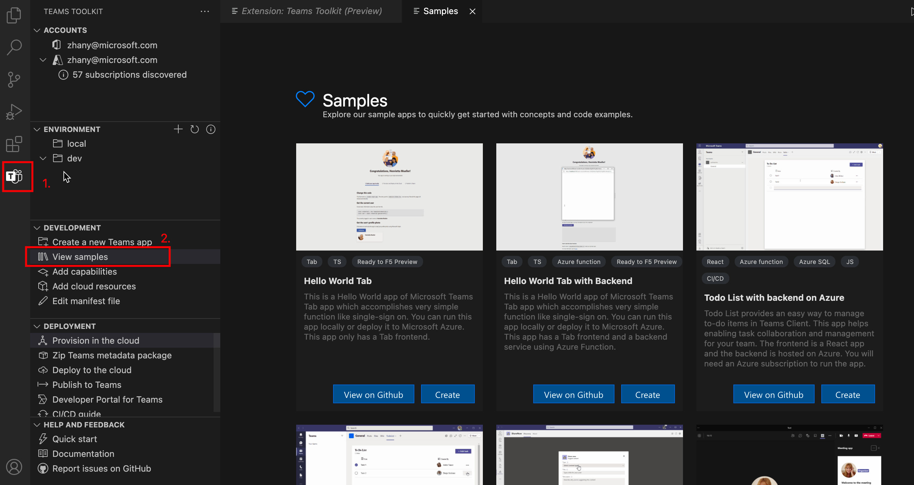

# Créer un projet Teams à l’aide Teams Shared Computer Toolkit

Vous pouvez créer **un projet ou** créer à partir d’exemples pour utiliser le Teams Shared Computer Toolkit pour Teams de l’application. 

## Création d’un projet

Les étapes suivantes vous guident pour créer un projet Teams’application à l’aide Teams Shared Computer Toolkit :

- [Créer une application Teams tabulation (React)](/microsoftteams/platform/sbs-gs-javascript?tabs=vscode%2Cvsc%2Cviscode%2Cvcode&tutorial-step=2)
- [Créer une application Teams Bot](/microsoftteams/platform/sbs-gs-spfx?tabs=vscode%2Cviscode&branch)
- [Créer une application d’extension de message](/microsoftteams/platform/sbs-gs-javascript?tabs=vscode%2Cvsc%2Cviscode%2Cvcode&tutorial-step=6&branch)
- [Créer une application Teams tabulation (SharePoint Framework)](/microsoftteams/platform/sbs-gs-spfx?tabs=vscode%2Cviscode&branch)

## Créer à partir d’exemples

Si vous ne souhaitez pas commencer par l’application «  hello world », vous pouvez essayer d’explorer la galerie d’exemples et trouver quelque chose qui vous intéresse pour commencer votre propre travail. Les étapes suivantes vous aident à créer des applications à partir d’exemples :

 1. Ouvrez **Teams Shared Computer Toolkit** à partir Visual Studio Code.

 1. Sélectionnez **la** section DÉVELOPPEMENT dans l’arborescence.

 1. Sélectionnez **Afficher les exemples.** L’exemple de galerie s’affiche.

Dans la galerie d’exemples, vous pouvez explorer des exemples et les télécharger, comme illustré dans l’image suivante :

Vous pouvez télécharger et exécuter des applications localement ou à distance pour afficher un aperçu dans Teams client web. Suivez les instructions de chaque exemple ou parcourez le code source des exemples en sélectionnant **Afficher sur GitHub**. Ensuite, vous pouvez ouvrir le repo source pour les exemples.

## Voir aussi

> [!div class="nextstepaction"]
> [Mise en service des ressources cloud](provision.md)

> [!div class="nextstepaction"]
> [Déployer Teams application dans le cloud](deploy.md)

> [!div class="nextstepaction"]
> [Publier votre application Teams web](TeamsFx-collaboration.md)

> [!div class="nextstepaction"]
> [Gérer plusieurs environnements](TeamsFx-multi-env.md)

> [!div class="nextstepaction"]
> [Collaborer avec d’autres développeurs sur Teams projet](TeamsFx-collaboration.md)
