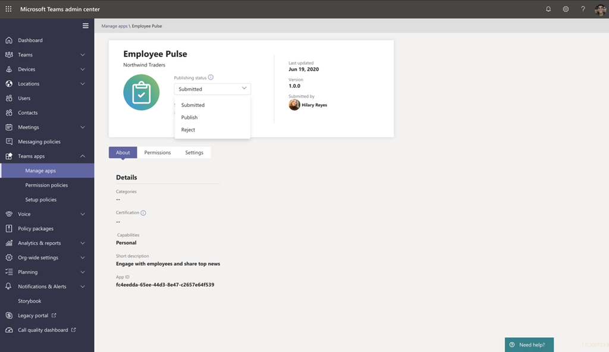

# Publier des Teams à l’aide Teams Shared Computer Toolkit

Après avoir créé l’application, vous pouvez distribuer votre application à différentes étendues, telles qu’une personne, une équipe, une organisation ou toute autre personne. La distribution dépend de plusieurs facteurs, notamment les besoins, les besoins commerciaux et techniques, ainsi que votre objectif pour l’application. La distribution à une étendue différente peut avoir besoin d’un processus de révision différent. En règle générale, plus l’étendue est grande, plus l’application doit passer en revue les problèmes de sécurité et de conformité.

## Conditions préalables

* [Installez Teams Shared Computer Toolkit](https://marketplace.visualstudio.com/items?itemName=TeamsDevApp.ms-teams-vscode-extension) version v3.0.0+.

> [!TIP]
> Vous devez déjà avoir un projet Teams’application.

## Publier dans l’étendue individuelle (autorisation de chargement de version latérale)

Les utilisateurs peuvent ajouter une application personnalisée à Teams en chargeant un package d’application dans un fichier .zip directement dans une équipe ou dans un contexte personnel. L’ajout d’une application personnalisée en chargeant un package d’application, également appelé chargement de version test, vous permet de tester l’application telle qu’elle est développée, avant qu’elle ne soit largement distribuée, comme indiqué dans les scénarios suivants :

* Testez et déboguer une application localement vous-même ou avec d’autres développeurs.
* Vous avez créé une application pour vous-même. Par exemple, pour automatiser un flux de travail.
* Vous avez créé une application pour un petit groupe d’utilisateurs, par exemple, votre groupe de travail.

Il vous permet également de créer une application pour une utilisation interne uniquement et de la partager avec votre équipe sans la soumettre au catalogue d’applications Teams dans le magasin d’applications Teams.

* Créer votre application dans *.zip package d’application

    Vous pouvez créer le package d’application en sélectionnant à partir du panneau `Zip Teams metadata package` DEPLOYMENT dans Treeview de Teams Shared Computer Toolkit. Vous devrez peut-être exécuter `Provision in the cloud` au début. Le package d’application généré se trouve dans l’image `{your project folder}/build/appPackage/appPackage.{env}.zip` suivante :

 

## Publier pour votre organisation 

Lorsque l’application est prête à être en production, le développeur peut soumettre l’application à l’aide de l’API de soumission d’application Teams, appelée à partir de l’API Graph, un environnement de développement intégré (IDE) tel que Visual Studio Code installé avec le kit de ressources Teams. Vous pouvez soit sélectionner Publier sur **Teams** à partir du panneau DEPLOYMENT dans TreeView de Teams Shared Computer Toolkit, soit déclencher Teams **:** Publier sur Teams à partir de la palette de commandes. Sélectionnez **Ensuite Installer pour votre organisation,** comme illustré dans l’image suivante :

Cela rend l’application disponible sur la page Gérer les applications du Centre d’administration Microsoft Teams, où vous et l’administrateur pouvez l’examiner et l’approuver.

En tant qu’administrateur, la page Gérer les applications dans le Centre [d’administration Microsoft Teams](https://admin.teams.microsoft.com/policies/manage-apps) est l’endroit où vous affichez et gérez toutes les applications Teams pour votre organisation. Ici, vous pouvez voir l’état et les propriétés des applications au niveau de l’organisation, approuver ou télécharger de nouvelles applications personnalisées dans le magasin d’applications de votre organisation, bloquer ou autoriser des applications au niveau de l’organisation, ajouter des applications à des équipes, acheter des services pour des applications tierces, afficher les autorisations demandées par les applications, accorder le consentement administrateur aux applications et gérer les paramètres d’application à l’échelle de l’organisation.

Gérer la page d’applications dans le centre d’administration [Teams](https://admin.teams.microsoft.com/policies/manage-apps) Teams toolkit pour Visual Studio Code créé sur l’API de soumission d’applications Teams et vous permet d’automatiser le processus de soumission à approbation pour les applications personnalisées sur Teams.

> [!NOTE]
> N’oubliez pas que cela ne publie pas encore l’application dans le magasin d’applications de votre organisation. Cette étape envoie l’application au Centre d’administration Microsoft Teams où vous pouvez l’approuver pour la publication dans le magasin d’applications de votre organisation.

## Approbation de l’administrateur pour les applications Teams envoyées

L’administrateur de votre client Teams peut ensuite aller à la page Gérer les applications dans le Centre d’administration Microsoft Teams (dans le navigation de gauche, allez à Teams apps > Gérer les applications), vous donne un affichage de toutes les applications Teams de votre organisation. Le widget d’approbation en attente en haut de la page vous permet de savoir quand une application personnalisée est soumise pour approbation.
Dans le tableau, une application nouvellement soumise affiche automatiquement l’état De publication envoyé et l’état bloqué. Vous pouvez trier la colonne État de publication dans l’ordre décroit pour trouver rapidement l’application :

 

Sélectionnez le nom de l’application pour aller à la page des détails de l’application. Sous l’onglet À propos de, vous pouvez afficher des détails sur l’application, notamment la description, l’état, l’auteur et l’ID de l’application :

 

Lorsque vous êtes prêt à mettre l’application à la disposition des utilisateurs, suivez les étapes pour publier l’application :

1. Dans le navigation de gauche du centre d Microsoft Teams,go to Teams apps > Manage apps.
2. Sélectionnez le nom de l’application pour aller à la page des détails de l’application, puis dans la zone État de publication, sélectionnez Publier.
Une fois que vous avez publié l’application, l’état Publication passe à Publié et l’état passe automatiquement à Autorisé.

## Publier sur Microsoft Store

Vous pouvez distribuer votre application directement dans le Store Microsoft Teams et atteindre des millions d’utilisateurs dans le monde entier. Si votre application est également présente dans le Store, vous pouvez immédiatement atteindre des clients potentiels.
Les applications publiées dans Teams store sont également automatiquement répertoriées sur Microsoft AppSource, qui est la place de marché officielle pour Microsoft 365 applications et solutions.
Comprenez le processus de publication Lorsque vous pensez que votre application est prête pour la production, vous pouvez commencer le processus d’obtention de sa liste dans le Teams store.

>[!Tip]
> Le fait de suivre attentivement les étapes préalables à la soumission peut augmenter le risque que Microsoft approuve votre application pour publication.

* Examinez les Teams de validation du Store pour vous assurer que votre application répond Teams et aux normes du Store.
* Créez un compte de développeur de l’Espace partenaires.
* Préparez votre soumission au Store, qui inclut l’exécution de tests automatisés, la compilation de notes de test, la création d’une liste de magasins, entre autres tâches importantes pour accélérer le processus de révision.
* Soumettez votre application via l’Partner Center.
* Travaillez directement avec Microsoft pour résoudre les problèmes et resoumettre votre application (lien pour résoudre les problèmes et resoumettre votre application).

## Voir aussi

> [!div class="nextstepaction"]
> [Gérer plusieurs environnements](TeamsFx-multi-env.md)

> [!div class="nextstepaction"]
> [Collaborer avec d’autres développeurs sur Teams projet](TeamsFx-collaboration.md)