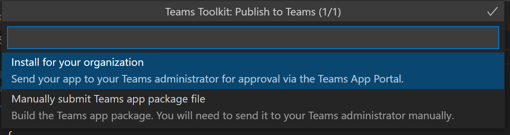

# Publier des applications Teams à l’aide du Kit de ressources Teams

Après avoir créé l’application, vous pouvez distribuer votre application à différentes étendues, telles qu’une personne, une équipe, une organisation ou n’importe qui. La distribution dépend de plusieurs facteurs, notamment des besoins, des exigences commerciales et techniques, ainsi que de votre objectif pour l’application. La distribution vers une étendue différente peut nécessiter un processus de révision différent. En général, plus l’étendue est grande, plus l’application doit passer en revue les problèmes de sécurité et de conformité.

## Conditions préalables

* [Installez le Kit de ressources Teams](https://marketplace.visualstudio.com/items?itemName=TeamsDevApp.ms-teams-vscode-extension) version v3.0.0+.

> [!TIP]
> Vérifiez que vous disposez d’un projet d’application Teams dans VS Code.

## Publier sur une étendue individuelle ou charger une version test

Les utilisateurs peuvent ajouter une application personnalisée à Teams en chargeant un package d’application dans un fichier *.zip directement dans une équipe ou dans un contexte personnel. L’ajout d’une application personnalisée en chargeant un package d’application est appelé chargement indépendant et vous permet de tester l’application lors du développement, avant que l’application soit prête à être largement distribuée, comme indiqué dans les scénarios suivants :

* Testez et déboguez une application localement.
* Créez une application pour vous-même, par exemple pour automatiser un flux de travail.
* Créez une application pour un petit ensemble d’utilisateurs, par exemple, votre groupe de travail.

Vous pouvez créer une application pour une utilisation interne uniquement et la partager avec votre équipe sans l’envoyer au catalogue d’applications Teams dans l’App Store Teams.

**Créer votre application pour *fichier de package d’application .zip**

Vous pouvez générer le package d’application en sélectionnant `Zip Teams metadata package` dans **DEPLOYMENT** dans Treeview of Teams Toolkit. Vous devez d’abord exécuter `Provision in the cloud`. Le package d’application généré se trouve dans `{your project folder}/build/appPackage/appPackage.{env}.zip`.

Effectuez les étapes suivantes pour charger le package d’application :

1. Dans le client Teams, sélectionnez **Apps** dans la barre de gauche.
2. Sélectionnez **Gérer vos applications**.
3. Sélectionnez **publier une application**.

   :::image type="content" source="../assets/images/teams-toolkit-v2/teams toolkit fundamentals/pub.png" alt-text="Publication":::

4. Sélectionnez **Charger une application personnalisée**:

   :::image type="content" source="../assets/images/teams-toolkit-v2/teams toolkit fundamentals/uplo.png" alt-text="charger":::

## Publier pour votre organisation

Lorsque l’application est prête à être utilisée en production, vous pouvez envoyer l’application à l’aide de l’API de soumission d’application Teams, appelée à partir de API Graph, un environnement de développement intégré (IDE) tel que Microsoft Visual Studio Code installé avec le kit de ressources Teams. Vous pouvez sélectionner **Publier sur teams** à partir de **DEPLOYMENT** dans TreeView of Teams Toolkit, ou déclencher **Teams : Publier sur Teams** à partir de la palette de commandes. Sélectionnez ensuite **Installer pour votre organisation**:

L’application est disponible sur le **Gérer les applications** du Centre d’administration Microsoft Teams, où vous et l’administrateur pouvez l’examiner et l’approuver.

En tant qu’administrateur, **Gérer les applications** dans le centre d’administration [Microsoft Teams](https://admin.teams.microsoft.com/policies/manage-apps) est l’endroit où vous pouvez afficher et gérer toutes les applications Teams pour votre organisation. Vous pouvez voir l’état au niveau de l’organisation et les propriétés des applications, approuver ou charger de nouvelles applications personnalisées dans l’App Store de votre organisation, bloquer ou autoriser des applications au niveau de l’organisation, ajouter des applications à des équipes, acheter des services pour des applications tierces, afficher les autorisations demandées par les applications, accorder le consentement administrateur aux applications et [gérer les paramètres d’application à l’échelle de l’organisation](https://admin.teams.microsoft.com/policies/manage-apps).

Le kit de ressources Teams pour Visual Studio Code basé sur l’API de soumission d’applications Teams et vous permet d’automatiser le processus de soumission à approbation pour les applications personnalisées sur Teams.

> [!NOTE]
> L’application ne publie pas encore dans l’App Store de votre organisation. L’étape envoie l’application au Centre d’administration Microsoft Teams où vous pouvez l’approuver pour la publication dans l’App Store de votre organisation.

## Approbation de l’administrateur pour les applications Teams

L’administrateur de votre locataire Teams peut ensuite accéder au **Gérer les applications** dans le Centre d’administration Microsoft Teams, dans le volet de navigation gauche, accéder aux applications Teams > Gérer les applications. Vous pouvez afficher toutes les applications Teams pour votre organisation. Dans le widget d’approbation en attente en haut de la page, vous savez quand une application personnalisée est soumise pour approbation.
Dans le tableau, une application nouvellement soumise publie automatiquement l’état des applications soumises et bloquées. Vous pouvez trier la colonne d’état de publication dans l’ordre décroissant pour trouver l’application :

 :::image type="content" source="../assets/images/teams-toolkit-v2/teams toolkit fundamentals/admin-approval-for-teams-app-1.png" alt-text="Approbation":::

Sélectionnez le nom de l’application pour accéder à la page des détails de l’application. Sous l’onglet À propos, vous pouvez afficher des détails sur l’application, notamment la description, l’état et l’ID d’application :

 :::image type="content" source="../assets/images/teams-toolkit-v2/teams toolkit fundamentals/about-submitted-app-1.png" alt-text="Application soumise":::

Effectuez les étapes suivantes pour publier l’application :

1. Dans le volet de navigation gauche du Centre d’administration Microsoft Teams, accédez à Applications Teams > **Gérer les applications**.
2. Sélectionnez le nom de l’application pour accéder à la page des détails de l’application, puis dans la zone d’état, sélectionnez **Publier**.
Après avoir publié l’application, l’état de publication devient publié et l’état devient automatiquement autorisé.

## Publier dans le Microsoft Store

Vous pouvez distribuer votre application directement dans le Store au sein de Microsoft Teams et atteindre des millions d’utilisateurs dans le monde entier. Si votre application est également proposée dans le Store, vous pouvez atteindre instantanément les clients potentiels. Les applications publiées dans le magasin Teams sont également répertoriées automatiquement sur Microsoft AppSource, qui est la place de marché officielle pour Microsoft 365 applications et solutions.

Pour plus d’informations, consultez ([Publier votre application sur le Microsoft Teams Store](../concepts/deploy-and-publish/appsource/publish.md#publish-your-app-to-the-microsoft-teams-store)).

## Voir aussi

* [Gérer plusieurs environnements](TeamsFx-multi-env.md)
* [Collaborer avec d’autres développeurs sur des projets Teams](TeamsFx-collaboration.md)
