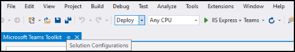

# Créer des applications avec les Teams Shared Computer Toolkit et Visual Studio

Le Kit de ressources Microsoft Teams vous permet de créer des applications personnalisées d’équipes directement dans l’environnement de développement intégré (IDE) Visual Studio. Le kit de ressources Microsoft Teams vous guide au cours du processus et vous fournit toutes les fonctionnalités nécessaires pour créer, déboguer et lancer votre application Teams.

## Configuration requise

1. [Activer la prévisualisation pour les développeurs.](../resources/dev-preview/developer-preview-intro.md#enable-developer-preview)

1. Assurez-vous que **ASP.NEmodule** de développement web et T a été ajouté à votre instance Visual Studio web. Vous pouvez vérifier en suivant les étapes de la Visual Studio en ajoutant ou en supprimant des charges de travail et de la documentation [sur les composants.](/visualstudio/install/modify-visual-studio?view=vs-2019&preserve-view=true)

3. Si vous souhaitez tester votre application en la déployant à partir de Visual Studio, iiS (Internet Information Services) doit être installé dans votre environnement de développement. Visual Studio n’inclut pas IIS et n’est pas inclus dans la configuration Windows 10, Windows 8 ou Windows 7 par défaut ; Toutefois, vous pouvez télécharger la dernière version à partir du Centre [de téléchargement Microsoft.](https://www.microsoft.com/download/details.aspx?id=48264)

## Installer le Teams Shared Computer Toolkit

Le Microsoft Teams Shared Computer Toolkit pour Visual Studio est disponible en téléchargement à partir de [Visual Studio Marketplace](https://marketplace.visualstudio.com/items?itemName=TeamsDevApp.vsteamstemplate) ou directement à partir du menu **Extensions** dans Visual Studio.

## Utilisation du kit de ressources

- [Configurer un nouveau projet](#set-up-a-new-teams-project)
- [Configurer votre application](#configure-your-app)
- [Package de votre application](#package-your-app)
- [Exécutez votre application dans Teams](#install-and-run-your-app-locally)
- [Valider votre application](#validate-your-app)
- [Publier votre application](#publish-your-app-to-teams)

## Configurer un nouveau projet Teams projet

1. Sélectionnez **Créer un projet.**
1. Choose **Microsoft Teams App** and select **Next**.
1. Vous arrivez à **l’écran** Configurer votre nouveau projet où vous pouvez choisir le nom **Project,** l’emplacement **et** le nom de **la solution.**
1. Cochez la case **« Placer la solution et le projet dans le même répertoire**».
1. Une fenêtre pop-up étiquetée **Ajouter des** fonctionnalités vous permettra de choisir une ou plusieurs fonctionnalités pour la configuration de votre projet.
1. Sélectionnez **le bouton** Suivant pour terminer le processus de configuration.
1. Une fenêtre pop-up libellée **Ajouter des** fonctionnalités vous permet de choisir les propriétés de chaque fonctionnalité sélectionnée.
1. Sélectionnez **Terminer** et vous allez vous poser sur **Microsoft Teams Shared Computer Toolkit** page d’accueil.

## Configurer votre application

L’application Teams principale englobe trois composants :

  1. Le Microsoft Teams client (web, de bureau ou mobile) où les utilisateurs interagissent avec votre application.
  1. Un serveur qui répond aux demandes de contenu qui s’afficheront dans Teams, par exemple, du contenu d’onglet HTML ou une carte adaptative de bot .
  1. Un package Teams’application se compose de trois fichiers :

      > [!div class="checklist"]
      >
      > - Le manifest.jssur
      > - Icône [de couleur à](../resources/schema/manifest-schema.md#icons) afficher dans le catalogue d’applications public ou d’organisation
      > - Icône [de plan à](../resources/schema/manifest-schema.md#icons) afficher dans la barre Teams’activité.

Lorsqu’une application est installée, le client Teams pare le fichier manifeste pour déterminer les informations nécessaires, telles que le nom de votre application et l’URL où se trouvent les services.

> [!NOTE]
>Si vous ne l’avez pas déjà fait, vous devrez vous Microsoft 365 votre compte pour poursuivre le processus de développement.
>
> Si vous n’avez pas de compte Microsoft 365, vous pouvez vous inscrire à un abonnement au Microsoft 365 [développeur.](https://developer.microsoft.com/microsoft-365/dev-program) Il est *gratuit pendant* 90 jours et est continuellement renouvelé tant que vous l’utilisez pour l’activité de développement. Si vous avez un abonnement Visual Studio *Enterprise* ou *Professional,* les deux programmes incluent un abonnement Microsoft 365 développeur [gratuit,](https://aka.ms/MyVisualStudioBenefits)actif pendant toute la durée de vie de Visual Studio abonnement. Pour plus d’informations, voir [Configurer un abonnement Microsoft 365 développeur.](/office/developer-program/office-365-developer-program-get-started)
>

### Étapes de configuration

1. Pour configurer votre application,  sur la page Microsoft Teams Shared Computer Toolkit’accueil, sélectionnez **Modifier le package d’application.**
1. Dans le menu **déroulant Mes environnements,** sélectionnez **Développement.**
1. Vous allez vous trouver sur la page **des détails de l’application** où vous pouvez modifier les champs de propriété de votre application.
1. La modification des champs dans la page détails de l’application met à jour le contenu du manifest.jssur le fichier qui sera finalement intégré au package de l’application. [En savoir plus](https://aka.ms/teams-toolkit-manifest)

## Package de votre application

La modification de la page de **détails** de l’application ou la mise à jour du **manifeste,** ou des fichiers **.env** dans le dossier  **.publish** de votre application, génèreront **automatiquementDevelopment.zip** fichier. Le Development.zip inclut trois fichiers obligatoires : **l'manifest.jset** [deux icônes.](../concepts/build-and-test/apps-package.md#app-icons)

## Installer et exécuter votre application localement

1. Dans le menu **déroulant Configurations** de la solution, **sélectionnez Déployer** comme illustré dans l’image suivante :

    

2. Sélectionnez **le IIS Express + Teams** bouton.

1. Teams s’affiche et le dialogue d’installation de l’application doit s’Teams client.

## Valider votre application

La  page Valider vous permet de vérifier votre package d’application avant de la soumettre à AppSource. Il vous suffit de charger le package de manifeste et l’outil de validation vérifie votre application par rapport à tous les cas de test liés au manifeste. Pour chaque échec de test, la description fournit un lien de documentation pour vous aider à corriger l’erreur. Pour les tests difficiles à automatiser, la liste de contrôle préliminaire détaille 7 des cas de test les plus courants qui ont échoué, ainsi qu’un lien vers une liste de vérification de soumission complète. 

## Publier votre application sur Teams

✔ Sur la page d’accueil de votre projet, vous pouvez charger votre application vers une équipe, soumettre votre application au magasin d’applications personnalisé de votre entreprise pour les utilisateurs de votre organisation ou soumettre votre application à la source d’application pour tous les utilisateurs Teams.

✔ votre administrateur informatique examine ces soumissions.

✔ vous pouvez revenir à la **page** Publier pour vérifier l’état de votre soumission et savoir si votre application a été approuvée ou rejetée par votre administrateur informatique. C’est également là que vous allez envoyer des mises à jour à votre application ou annuler les soumissions actives.

## Étape suivante

> [!div class="nextstepaction"]
> [Maintenance et prise en charge de votre application publiée](../concepts/deploy-and-publish/appsource/post-publish/overview.md)
>
