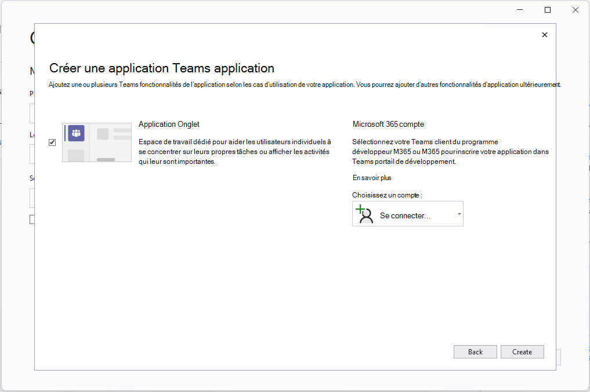

# Extension de kit de ressources Teams pour Visual Studio

Générez, testez et développez pour Teams à l’intérieur de votre IDE.

L’extension de Teams Shared Computer Toolkit pour Visual Studio facilite la création de projets pour Teams, la configuration automatique des applications dans Teams portail des développeurs, l’exécution et le débogage dans Teams, la configuration de l’hébergement cloud et l’utilisation de [TeamsFx](https://github.com/OfficeDev/teamsfx) à partir de votre IDE.

## Extension de kit de ressources Teams pour Visual Studio

>[!NOTE]
> Comme prérequis, veillez à utiliser Visual Studio 2022 17.1 Preview 2 ou version ultérieure pour suivre les instructions ci-dessous.

1. Si vous avez déjà installé Visual Studio 2022 17.1 Preview 2, passez à l’étape suivante. Sinon, [installez préversion Visual Studio 2022](https://visualstudio.microsoft.com/vs/preview/).
2. Ouvrez le Visual Studio Installer.
3. Sélectionnez **Modifier** pour votre installation vs 2022 Preview existante.
4. Sélectionnez l’ASP.NET et la charge de **travail de développement web**.
5. À droite, développez la section **ASP.NET et de développement web**, puis sélectionnez **Microsoft Teams outils de développement** dans la liste facultative des composants.
6. Sélectionnez **Installer** ou **Modifier** dans le Visual Studio Installer pour terminer le processus d’installation.

   

## Démarrage rapidement avec un nouveau projet

Les modèles de projet Teams Toolkit fournissent tout le code, les fichiers et la configuration dont vous avez besoin pour démarrer un projet d'application Teams.

Le modèle de projet d’application Microsoft Teams vous permet de spécifier un compte Microsoft 365 qui est nécessaire pour inscrire et configurer automatiquement votre nouvelle application Teams.

> [!NOTE]
> Si vous ne disposez pas d'un compte Microsoft 365, vous pouvez vous inscrire à un abonnement au[ programme de développement Microsoft 365](https://developer.microsoft.com/microsoft-365/dev-program). Il est gratuit pendant 90 jours et renouvelé tant que vous l’utilisez pour l’activité de développement. Si vous avez un abonnement Visual Studio Enterprise ou Professional, les deux programmes incluent un abonnement gratuit Microsoft 365 [développeur](https://aka.ms/MyVisualStudioBenefits), actif pendant toute la durée de vie de votre abonnement Visual Studio. Pour plus d’informations, reportez-vous à l’article [Configuration d’un abonnement Microsoft 365 pour les développeurs](/office/developer-program/office-365-developer-program-get-started).

1. Visual Studio 2022
1. Dans la fenêtre de démarrage, choisissez **Créer un projet**.
1. Dans la zone **Rechercher des modèles**, entrez Microsoft Teams App.
1. Sélectionnez le **modèle d’application Microsoft Teams**, puis **suivant**.
1. Dans la fenêtre **Configurer votre nouveau projet**, tapez ou entrez _HelloTeams_ dans la **zone de nom Project**. Sélectionnez ensuite **Créer**.
1. Dans la fenêtre **Créer une application Teams**, choisissez ou connectez-vous à un compte Microsoft 365 à l’aide du sélecteur **choisir un compte**. Sélectionnez ensuite **Créer**.

   

Visual Studio ouvrez votre nouveau projet et Teams Shared Computer Toolkit configurerez votre nouveau projet dans le Portail des développeurs de Teams. Le projet sera ajouté pour l'organisation Teams liée au compte Microsoft 365 que vous avez choisi dans les étapes ci-dessus et créera un nouvel enregistrement Azure Active Directory. Ceci est nécessaire pour que l'application fonctionne dans Teams.

## Exécuter et déboguer votre application dans Teams

Vous pouvez lancer votre projet d’application s’exécutant localement à partir de Visual Studio.

1. Ouvrez ou [créez un projet d’application Teams](#get-started-quickly-with-a-new-project).
2. Appuyez sur **F5** ou sélectionnez **Déboguer > Démarrer le débogage** dans Visual Studio.

Visual Studio lancera votre projet d’application Teams dans un navigateur et démarrera le débogage.

## Héberger votre application Teams dans le cloud et la prévisualiser

Vous pouvez créer et configurer automatiquement des ressources cloud pour héberger votre application dans Azure à l’aide de Teams Shared Computer Toolkit.

1. Sélectionnez le **Projet > Teams Shared Computer Toolkit > Provisionnement dans le menu Cloud**.
2. Dans la fenêtre Sélectionner votre abonnement, choisissez l’abonnement Azure avec lequel vous souhaitez créer des ressources.

Teams Shared Computer Toolkit créera des ressources Azure dans cet abonnement, mais aucun code n’est déployé au cours de cette étape. Pour déployer votre projet sur ces nouvelles ressources :

1. Sélectionnez le **Project > Teams Shared Computer Toolkit > Déployer dans le menu Cloud**.

## Aperçu de votre application s’exécutant à partir de ressources cloud

Vous pouvez exécuter votre application dans un navigateur à l’aide des ressources distantes pour vérifier que tout fonctionne. Il n’est pas encore possible de déboguer dans ce scénario.

1. Sélectionnez le **menu de l’application Teams aperçu Projet > Teams Shared Computer Toolkit >**.

Votre application s’ouvre dans un navigateur et utilise les ressources créées par les étapes Provision et Déploiement.

## Publier votre application sur Teams

Dans le [portail des développeurs de Teams](https://dev.teams.microsoft.com/home), vous pouvez télécharger votre application vers une équipe, la soumettre à la boutique d'applications personnalisée de votre entreprise pour les utilisateurs de votre organisation, ou la soumettre à App Source pour tous les utilisateurs de Teams.

- Votre administrateur informatique examine ces envois.
- Vous pouvez revenir à la page **Publier** pour vérifier l'état de votre soumission et savoir si votre application a été approuvée ou rejetée par votre administrateur informatique. C'est également ici que vous pouvez soumettre des mises à jour de votre application ou annuler toute soumission en cours.
