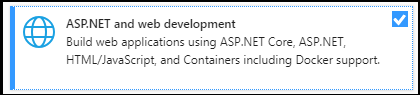

# Créer des applications avec les Teams Shared Computer Toolkit et Visual StudioBuild apps with the Teams Toolkit and Visual Studio

Le Kit de ressources Microsoft Teams vous permet de créer des applications personnalisées d’équipes directement dans l’environnement de développement intégré (IDE) Visual Studio.The Microsoft Teams Toolkit enables you to create custom Teams apps directly within the Visual Studio integrated development environment (IDE). Le kit de ressources Microsoft Teams vous guide au cours du processus et vous fournit toutes les fonctionnalités nécessaires pour créer, déboguer et lancer votre application Teams.The Microsoft Teams toolkit guides you through the process and provides everything you need to build, debug, and launch your Teams app.

## Conditions préalablesPrerequisites

1. [Activer la prévisualisation pour les développeurs.](../resources/dev-preview/developer-preview-intro.md#enable-developer-preview)[Enable developer preview](../resources/dev-preview/developer-preview-intro.md#enable-developer-preview).

1. Assurez-vous que **lemodule ASP.NE T** et le module de développement web ont été ajoutés à Visual Studio instance.Make sure that the **ASP.NET and web development module** has been added to your Visual Studio instance. Vous pouvez vérifier en suivant les étapes de la Visual Studio en ajoutant ou en supprimant des charges de travail et de la documentation [sur les composants.](/visualstudio/install/modify-visual-studio?view=vs-2019&preserve-view=true)You can check by following the steps in the [Modify Visual Studio by adding or removing workloads and component](/visualstudio/install/modify-visual-studio?view=vs-2019&preserve-view=true) documentation.

3. Si vous souhaitez tester votre application en la déployant à partir de Visual Studio, iiS (Internet Information Services) doit être installé dans votre environnement de développement.If you would like test your app by deploying it from Visual Studio, you'll need to have IIS (Internet Information Services) installed in your development environment. Visual Studio n’inclut pas IIS et n’est pas inclus dans la configuration Windows 10, Windows 8 ou Windows 7 par défaut ; Toutefois, vous pouvez télécharger la dernière version à partir du Centre [de téléchargement Microsoft.](https://www.microsoft.com/download/details.aspx?id=48264)Visual Studio does not include IIS and it isn't included in the default Windows 10, Windows 8, or Windows 7 configuration; however, you can download the latest version from the [Microsoft download center](https://www.microsoft.com/download/details.aspx?id=48264).

## Installer le Teams Shared Computer ToolkitInstall the Teams Toolkit

Le Microsoft Teams Shared Computer Toolkit pour Visual Studio est disponible en téléchargement à partir de [Visual Studio Marketplace](https://marketplace.visualstudio.com/items?itemName=TeamsDevApp.vsteamstemplate) ou directement à partir du menu **Extensions** dans Visual Studio.The Microsoft Teams Toolkit for Visual Studio is available for download from the [Visual Studio Marketplace](https://marketplace.visualstudio.com/items?itemName=TeamsDevApp.vsteamstemplate) or directly from the **Extensions** menu within Visual Studio.

## Utilisation du kit de ressourcesUsing the toolkit

- [Configurer un nouveau projetSet up a new project](#set-up-a-new-teams-project)
- [Configurer votre applicationConfigure your app](#configure-your-app)
- [Package de votre applicationPackage your app](#package-your-app)
- [Exécuter votre application dans TeamsRun your app in Teams](#install-and-run-your-app-locally)
- [Valider votre applicationValidate your app](#validate-your-app)
- [Publier votre applicationPublish your app](#publish-your-app-to-teams)

## Configurer un nouveau projet Teams projetSet up a new Teams project

1. Sélectionnez **Créer un projet.**Select **Create a new project**.
1. Choose **Microsoft Teams App** and select **Next**.Choose **Microsoft Teams App** and select **Next**.
1. Vous arrivez à **l’écran** Configurer votre nouveau projet où vous pouvez choisir le nom **Project,** l’emplacement **et** le nom de **la solution.**You will arrive at the **Configure your new project** screen where you can choose the **Project name**, **Location**, and **Solution name**.
1. Cochez la case **« Placer la solution et le projet dans le même répertoire**».Check the box labeled **Place solution and project in the same directory**.
1. Une fenêtre pop-up étiquetée **Ajouter** des fonctionnalités vous permet de choisir une ou plusieurs fonctionnalités pour la configuration de votre projet.A pop-up window labeled **Add Capabilities** will allow you to choose one or more capabilities for your project setup.
1. Sélectionnez **le bouton** Suivant pour terminer le processus de configuration.Select the **Next** button to complete the configuration process.
1. Une fenêtre pop-up étiquetée **Ajouter des** fonctionnalités vous permet de choisir les propriétés de chaque fonctionnalité sélectionnée.A pop-up window labeled **Add Capabilities** will allow you to choose the properties for each selected capability.
1. Sélectionnez **Terminer** et vous allez vous poser sur **Microsoft Teams Shared Computer Toolkit** page d’accueil.Select **Finish** and you will  land on the **Microsoft Teams Toolkit** landing page.

## Configurer votre applicationConfigure your app

L’application Teams principale englobe trois composants :At its core, the Teams app embraces three components:

  1. Le Microsoft Teams client (web, de bureau ou mobile) où les utilisateurs interagissent avec votre application.The Microsoft Teams client (web, desktop or mobile) where users interact with your app.
  1. Un serveur qui répond aux demandes de contenu qui s’afficheront dans Teams, par exemple, du contenu d’onglet HTML ou une carte adaptative de bot .A server that responds to requests for content that will be displayed in Teams, e.g., HTML tab content or a bot adaptive card .
  1. Un package Teams’application se compose de trois fichiers :A Teams app package consists of three files:

      > [!div class="checklist"]
      >
      > - Le manifest.jssurThe manifest.json
      > - Icône [de couleur à](../resources/schema/manifest-schema.md#icons) afficher dans le catalogue d’applications public ou d’organisationA [color icon](../resources/schema/manifest-schema.md#icons) for your app to display in the public or organization app catalog
      > - Icône [de plan à](../resources/schema/manifest-schema.md#icons) afficher dans la barre Teams’activité.An [outline icon](../resources/schema/manifest-schema.md#icons) for display on the Teams activity bar.

Lorsqu’une application est installée, le client Teams pare le fichier manifeste pour déterminer les informations nécessaires, telles que le nom de votre application et l’URL où se trouvent les services.When an app is installed, the Teams client parses the manifest file to determine needed information like the name of your app and the URL where the services are located.

> [!NOTE]
>Si ce n’est pas déjà fait, vous devrez vous Microsoft 365 votre compte ou compte pour poursuivre le processus de développement.If you haven't done so already, you will need to sign in to your Microsoft 365  or account to continue with the development process.
>
> Si vous n’avez pas de compte Microsoft 365, vous pouvez vous inscrire à un abonnement au Microsoft 365 [développeur.](https://developer.microsoft.com/microsoft-365/dev-program)If you don't have a Microsoft 365 account, you can sign up for a [Microsoft 365 Developer Program](https://developer.microsoft.com/microsoft-365/dev-program) subscription. Il est *gratuit pendant* 90 jours et est continuellement renouvelé tant que vous l’utilisez pour l’activité de développement.It's *free* for 90 days and will continually renew as long as you're using it for development activity. Si vous avez un abonnement Visual Studio *Enterprise* ou *Professional,* les deux programmes incluent un abonnement Microsoft 365 développeur [gratuit,](https://aka.ms/MyVisualStudioBenefits)actif pendant toute la durée de vie de Visual Studio abonnement.If you have a Visual Studio *Enterprise* or *Professional* subscription, both programs include a free Microsoft 365 [developer subscription](https://aka.ms/MyVisualStudioBenefits), active for the life of your Visual Studio subscription. Pour plus d’informations, voir [Configurer un abonnement Microsoft 365 développeur.](/office/developer-program/office-365-developer-program-get-started)For more information, See [Set up a Microsoft 365 developer subscription](/office/developer-program/office-365-developer-program-get-started).
>

### Étapes de configurationConfiguration steps

1. Pour configurer votre application,  sur la page Microsoft Teams Shared Computer Toolkit’accueil, sélectionnez **Modifier le package d’application.**To configure your app, on the **Microsoft Teams Toolkit** landing page, select **Edit app package**.
1. Dans le menu **déroulant Mes environnements,** sélectionnez **Développement.**From the **My Environments** drop-down menu, select **development**.
1. Vous allez vous trouver sur la page **des détails de l’application** où vous pouvez modifier les champs de propriété de votre application.You will land on the **App details** page where you can edit your app's property fields.
1. La modification des champs dans la page détails de l’application met à jour le contenu du manifest.jssur le fichier qui sera finalement intégré au package de l’application.Editing the fields in the App details page updates the contents of the manifest.json file that will ultimately ship as part of the app package. [En savoir plusLearn more](https://aka.ms/teams-toolkit-manifest)

## Package de votre applicationPackage your app

La modification de la page de **détails** de l’application ou la mise à jour du manifeste **ou** des fichiers **.env** dans le dossier **.publish** de votre application génère automatiquement **votre fichierDevelopment.zip..**Modifying the **app details** page or updating the **manifest**, or **.env** files in your app's  **.publish** folder will automatically generate your **Development.zip** file. Le Development.zip inclut trois fichiers obligatoires : **l'manifest.jset** [deux icônes.](../concepts/build-and-test/apps-package.md#app-icons)The Development.zip file includes three required files — the **manifest.json** and [two icons](../concepts/build-and-test/apps-package.md#app-icons).

## Installer et exécuter votre application localementInstall and run your app locally

1. Dans le menu **déroulant Configurations** de la solution, **sélectionnez Déployer** comme illustré dans l’image suivante :From the **Solution Configurations** dropdown menu, select **Deploy** as shown in the following image:

    

2. Sélectionnez **le IIS Express + Teams** bouton.Select the **IIS Express + Teams** button.

1. Teams s’affiche et le dialogue d’installation de l’application doit s’Teams client.Teams will launch and the app installation dialogue should appear in the Teams client.

## Valider votre applicationValidate your app

La  page Valider vous permet de vérifier votre package d’application avant de la soumettre à AppSource.The **Validate** page allows you to check your app package before submitting your app to AppSource. Il vous suffit de charger le package de manifeste et l’outil de validation vérifie votre application par rapport à tous les cas de test liés au manifeste.Simply upload the manifest package and the validation tool will check your app against all manifest related test cases. Pour chaque échec de test, la description fournit un lien de documentation pour vous aider à corriger l’erreur.For each failed tests, the description provides a documentation link to help you fix the error. Pour les tests qui sont difficiles  à automatiser, la liste de contrôle préliminaire détaille 7 des cas de test les plus courants qui ont échoué, ainsi qu’un lien vers une liste de vérification de soumission complète.For the tests that are hard to automate, the **Preliminary checklist** details 7 of the most common failed test cases as well as link to a complete submission checklist.

## Publier votre application sur TeamsPublish your app to Teams

✔ Sur la page d’accueil de votre projet, vous pouvez charger votre application vers une équipe, soumettre votre application au magasin d’applications personnalisé de votre entreprise pour les utilisateurs de votre organisation ou soumettre votre application à la source d’application pour tous les utilisateurs Teams.✔ On your project home page, you can upload your app to a team, submit your app to your company custom app store for users in your organization, or submit your app to App Source for all Teams users.

✔ votre administrateur informatique examine ces soumissions.✔ Your IT admin will review these submissions.

✔ vous pouvez revenir à la **page** Publier pour vérifier l’état de votre soumission et savoir si votre application a été approuvée ou rejetée par votre administrateur informatique. C’est également là que vous allez envoyer des mises à jour à votre application ou annuler les soumissions actives.✔  You can return to the **Publish** page to check on your submission status and learn if your app was approved or rejected by your IT admin. This is also where you'll come to submit updates to your app or cancel any currently active submissions.

## Étape suivanteNext step

> [!div class="nextstepaction"]
> [Maintenance et prise en charge de votre application publiéeMaintaining and supporting your published app](../concepts/deploy-and-publish/appsource/post-publish/overview.md)
>
